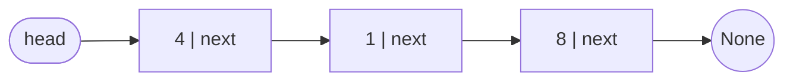
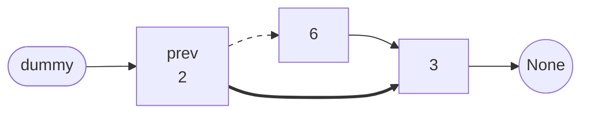
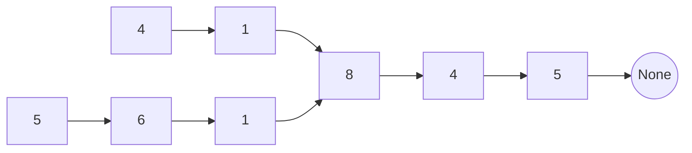

# Linked List Basics

A **linked list** is a sequence in which every element lives in its own object,
called a **node**, and each node carries exactly two things: a value, and a
reference to the node that comes after it. The order of the sequence is not
recorded anywhere as a whole. It exists only inside those references, one hop at
a time

That is the opposite arrangement to a
[dynamic array](../../01_arrays_and_hashing/notes/01_dynamic_arrays.md), which
holds every element side by side in one contiguous block of memory. The block is
what makes `nums[i]` instant, since the address of element `i` is pure
arithmetic, and it is also what makes inserting into the middle expensive, since
every later element has to shift over to make room. A linked list has no block at
all, so it loses the arithmetic and gains the cheap insert

Think of it as a scavenger hunt rather than a numbered row of lockers. You are
handed one clue, and each clue tells you where to find the next one. Nothing lets
you skip ahead to the seventh clue, and nothing lets you look back at the clue you
just left, but slipping a brand new clue into the middle of the hunt costs only
one rewrite: the clue in front of it now points at the new one instead



When each node carries only that one forward reference, the structure is a
**singly linked list** (as opposed to a **doubly linked list**, whose nodes also
point backwards). Singly linked is what interviews mean by default, and it is
what this topic assumes throughout

**The parts you have to name out loud**:

- The **head** is the first node, and it is the only thing you are given. A list
  *is* its head, so a function that takes a list takes a `head` argument
- The **next** pointer of each node is the only route to the node after it. There
  is no index, no length, and no way back
- The last node's `next` is `None`, and that is the only signal that the list has
  ended
- An **empty list** is `head is None`, which is why almost every linked list
  function starts by handling `None`

In Python the node is a plain class, and this is the definition LeetCode hands
you with type hints added:

```python
from __future__ import annotations


class ListNode:
    def __init__(self, val: int = 0, next: ListNode | None = None) -> None:
        self.val = val
        self.next = next


# build and to_list are test helpers used by the checks throughout this note,
# not part of any solution. An interviewer hands you a head already built
def build(values: list[int]) -> ListNode | None:
    head = None
    for val in reversed(values):
        head = ListNode(val, head)
    return head


def to_list(head: ListNode | None) -> list[int]:
    out = []
    while head:
        out.append(head.val)
        head = head.next
    return out


assert ListNode().val == 0 and ListNode().next is None
assert to_list(build([4, 1, 8])) == [4, 1, 8]
assert build([]) is None
assert to_list(build([])) == []
```

The `from __future__ import annotations` line is what lets `__init__` name
`ListNode` in its own signature, because without it the annotation is evaluated
while the class is still being defined and the name does not exist yet

One property drives everything else in this module. You never hold a position,
you hold a **reference to a node**, and those are not the same thing. A position
can be adjusted with arithmetic, whereas a reference can only be exchanged for
the next reference along. That is why the phrase "the node before it" comes up in
every technique here, since the predecessor is a thing you must be *holding*
rather than something you can compute

> This topic covers the traversal loop, the **dummy head** that removes the
> head-is-special case, the pointer-order rule that stops you losing half the
> list, and two lists that share a tail

## When A Problem Hands You A Head

The signal is blunt compared to other patterns, because the input type gives it
away. If the signature says `head: ListNode | None`, you are in this module. What
actually varies is which linked list technique the problem wants, and that is
decided by what the problem asks you to do with the pointers

**What the shape is good at**:

- Removing or inserting in the middle in `O(1)` once you hold the node before it,
  since nothing after it moves
- Splicing whole runs of nodes from one list into another by rewiring a couple of
  `next` pointers, which is what makes merging and partitioning cheap
- Growing without ever reallocating, because there is no backing block to outgrow

**What it is bad at, and the negative signal**:

- Random access, so anything that wants `nums[i]` or binary search on the values
  is not going to work directly
- Walking backwards, since a singly linked node cannot see its predecessor
- Knowing its own length, which is `O(n)` to compute and is worth avoiding when a
  one-pass solution exists

When a problem needs an index or needs to go backwards, you have three ways out,
and interviewers expect you to know which one you picked. You can copy the values
into a list and lose the `O(1)` space, you can use
[fast and slow pointers](02_fast_slow.md) to reach a position without counting,
or you can reverse part of the list so that backwards becomes forwards, which is
[reversal](03_reversal.md)

## Walking With One Pointer

Every linked list solution is built on the same three lines. Take a local
pointer, do something with the node it names, then step it forward

```python
def length(head: ListNode | None) -> int:
    n = 0
    curr = head
    while curr:
        n += 1
        curr = curr.next
    return n


assert length(build([1, 2, 3, 4, 5])) == 5
assert length(build([7])) == 1
assert length(None) == 0
```

**Two habits inside that loop**:

- `curr = head` copies the reference into a local name, so the walk does not move
  `head` itself. You almost always have to return the head at the end, and a loop
  that consumed it has nothing to return
- `while curr` is the end test, since the last node's `next` is `None` and `None`
  is falsy. Write `while curr` rather than `while curr.next` unless you
  specifically need to stop one node early, because the two differ by exactly one
  node and that is a common off-by-one

Accumulating as you walk is the whole of several problems. Converting a list of
binary digits into a number is the same loop with the counter replaced by
shift-and-add:

```python
def get_decimal_value(head: ListNode | None) -> int:
    total = 0
    curr = head
    while curr:
        total = total * 2 + curr.val
        curr = curr.next
    return total


assert get_decimal_value(build([1, 0, 1])) == 5
assert get_decimal_value(build([0])) == 0
assert get_decimal_value(build([1, 0, 0, 1, 0, 0, 1, 1])) == 147
```

This works despite the most significant bit arriving first, because multiplying
the running total by 2 pushes everything already accumulated one place left
before the new bit is added

## Why You Need The Node Before The One You Want

Deleting a node means making it unreachable, and the only thing pointing at it is
the `next` of the node before it. So a deletion is not an operation on the target
at all, it is an assignment on its predecessor



The thick edge is the entire deletion, written `prev.next = prev.next.next`. The
node holding 6 still points at 3 afterwards, and that does not matter, because
nothing points at the 6 any more so nothing will ever read it

That is why the standard walk for any edit carries **two pointers**, one on the
node being examined and one on the node before it. Some problems let you avoid
the second pointer by phrasing the check one node ahead instead. Removing
duplicates from a sorted list is the clean case, since equal values are adjacent
and you can compare `curr.val` against `curr.next.val` and unlink forward, never
needing to look behind you

**The near miss worth memorizing**: one problem hands you the node to delete and
nothing else, with no access to the head. There is no predecessor to reach, so
the real deletion is impossible. You fake it by making the target *become* its
successor

```python
def delete_node(node: ListNode) -> None:
    node.val = node.next.val
    node.next = node.next.next


head = build([4, 5, 1, 9])
delete_node(head.next)
assert to_list(head) == [4, 1, 9]

head = build([4, 5, 1, 9])
delete_node(head.next.next)
assert to_list(head) == [4, 5, 9]
```

The node object survives and the value that was in the next node now sits in it,
so from the outside one element is gone and the order is intact. This only works
because the problem guarantees the target is never the last node, since a last
node has no successor to absorb

## Why The Head Keeps Breaking Your Code

Every node in the list has a predecessor to edit, except one. The head is pointed
at by your local variable rather than by another node, so the two-pointer walk
has nothing to attach to when the head itself has to go

The obvious repair is to handle it before the loop starts, and it looks
completely reasonable:

```python
def remove_elements_broken(head: ListNode | None, val: int) -> ListNode | None:
    if head and head.val == val:
        head = head.next
    curr = head
    while curr and curr.next:
        if curr.next.val == val:
            curr.next = curr.next.next
        else:
            curr = curr.next
    return head


assert to_list(remove_elements_broken(build([1, 2, 6, 3, 4, 5, 6]), 6)) == [1, 2, 3, 4, 5]
assert to_list(remove_elements_broken(build([6, 6, 1, 6]), 6)) == [6, 1]  # the bug
assert to_list(remove_elements_broken(build([7, 7, 7, 7]), 7)) == [7]  # also wrong
assert remove_elements_broken(None, 1) is None
```

Run that on `[6, 6, 1, 6]` with `val = 6` and it returns `[6, 1]`. The `if` fired
once, dropped the first 6, and then the loop began at the second 6 and only ever
inspected `curr.next`, so the node `curr` was standing on was never a candidate
for removal. The leading 6 survives

The fix people reach for next is turning the `if` into a `while`, which does
handle a run of matching heads. It also duplicates the removal logic in two
places, and every later problem in the module that touches the front needs the
same duplicate. The better move is to remove the exception instead of patching it

## The Dummy Head

Give the head a predecessor. Allocate one throwaway node, point it at the real
head, and start the walk from there

```python
def remove_elements(head: ListNode | None, val: int) -> ListNode | None:
    dummy = ListNode(0, head)
    prev = dummy
    while prev.next:
        if prev.next.val == val:
            prev.next = prev.next.next
        else:
            prev = prev.next
    return dummy.next


assert to_list(remove_elements(build([1, 2, 6, 3, 4, 5, 6]), 6)) == [1, 2, 3, 4, 5]
assert to_list(remove_elements(build([6, 6, 1, 6]), 6)) == [1]
assert remove_elements(build([7, 7, 7, 7]), 7) is None
assert remove_elements(None, 1) is None
```

That node is the **dummy head**, also called a **sentinel**. Its value is never
read, and its only job is to be a predecessor so that no node in the list is
special any more

**Why each line is what it is**:

- `dummy = ListNode(0, head)` links the sentinel to the current head, so
  `dummy.next` tracks whatever the head becomes as nodes are unlinked
  - This is also why you return `dummy.next` and never `head`, since the original
    head may well have been deleted and the local `head` name would be stale
- The loop examines `prev.next` rather than `prev`, because the node you are
  deciding about must be the one your pointer can unlink
- `prev` advances **only in the else branch**, which is the line everything hinges
  on
  - After an unlink, a brand new node has slid into the `prev.next` slot and has
    not been checked yet. Advancing would step straight over it, which is the
    exact bug that left a 6 behind above
  - After a keep, the node is staying, so it becomes the predecessor for the next
    decision
- `while prev.next` ends the walk when the predecessor is the last node, and it
  also covers the empty list for free, since `dummy.next` is `None` immediately

The sentinel has a second use that is worth as much as the first. When you are
**building** a list rather than editing one, a dummy gives you somewhere to
attach the first node, so the "is this the first output node?" case disappears:

```python
dummy = ListNode()
tail = dummy
while ...:
    tail.next = ListNode(some_value)
    tail = tail.next
return dummy.next
```

`tail` always names the last node written, so appending is `O(1)` with no walk to
the end. Every problem that weaves two lists together is this loop with a choice
inside it, which is where [merge and split](04_merge_split.md) picks up

## Dry Run: Removing Every 6

Take `[6, 6, 1, 6]` with `val = 6`, which is the input that broke the version
above

```text
prev=dummy   prev.next=6      UNLINK   list=[6, 1, 6]   prev stays at dummy
prev=dummy   prev.next=6      UNLINK   list=[1, 6]      prev stays at dummy
prev=dummy   prev.next=1      KEEP     list=[1, 6]      prev moves to 1
prev=1       prev.next=6      UNLINK   list=[1]         prev stays at 1
prev=1       prev.next=None            loop ends, return dummy.next -> [1]
```

The third line is the one to study, because it is the only step that rejects a
removal, and it is also the only step where `prev` moves. Those two facts are the
same fact. The node holding 1 is staying, so it takes over as the predecessor,
and the walk advances by one

Look at the first two lines together for the reason a `while` beats an `if` at
the front. `prev` sat still through both, so the second 6 was inspected as an
ordinary node with an ordinary predecessor. Nothing in the code knows or cares
that these were the first two nodes of the list

The last line shows why the return is `dummy.next`. The head of the list changed
twice during the run, and the only name that stayed correct throughout is the
sentinel's pointer

## Saving The Next Pointer Before You Overwrite It

Once you start changing `next` pointers rather than just reading them, one rule
governs everything. **The link you are about to overwrite may be your only route
to the rest of the list**, so read it into a variable first

```python
nxt = curr.next  # save the route out
curr.next = prev  # now safe to destroy it
prev = curr
curr = nxt  # and step onto the saved node
```

Write those middle two lines in the other order and `curr.next` already points
backwards by the time you try to read it, so `curr = curr.next` walks back into
the part of the list you have finished. In an interview this shows up as an
infinite loop or a two-element answer, and it is the single most common linked
list bug

The same discipline applies whenever you splice: hold a name for the node you are
cutting away before you cut, or it is unreachable and gone. The four lines above
are the complete reversal loop, and every sublist and k-group variant of it is
[reversal](03_reversal.md)

## Two Lists That Share A Tail

Two linked lists can **intersect**, meaning that from some node onward they are
literally the same nodes rather than merely equal values. The picture is a Y



Finding that junction is easy with a [hash set](../../01_arrays_and_hashing/notes/02_hashing.md)
of every node in the first list, then walking the second until a node is already
in the set. That is `O(n)` extra space, and the follow-up is always whether you
can do it in `O(1)`

The obstacle is that the two lists have different lengths, so walking them in
lockstep from their heads compares nodes at different distances from the shared
tail. Fix the lengths and the lockstep works. You could measure both lengths and
give the longer list a head start, which is correct and needs two extra passes

The shorter version makes each pointer walk **both** lists. Send `a` down list A
and then onto list B, and send `b` down list B and then onto list A. Each pointer
now covers exactly the same total distance, so they arrive at the junction on the
same step

```python
def get_intersection_node(head_a: ListNode | None, head_b: ListNode | None) -> ListNode | None:
    a, b = head_a, head_b
    while a is not b:
        a = a.next if a else head_b
        b = b.next if b else head_a
    return a


shared = build([8, 4, 5])
a_head = build([4, 1])
a_head.next.next = shared
b_head = build([5, 6, 1])
b_head.next.next.next = shared
assert get_intersection_node(a_head, b_head) is shared
assert get_intersection_node(build([2, 6, 4]), build([1, 5])) is None
assert get_intersection_node(None, build([1, 5])) is None
```

**Why it terminates either way**:

- Writing the lengths as `a + c` and `b + c`, where `c` is the shared tail, each
  pointer travels `a + c + b` nodes plus the one `None` at the end of its own
  list before reaching the junction, which is the nine steps counted in the dry
  run below, and those two totals are equal no matter which list is longer
- The jump condition is `if a` and not `if a.next`, so each pointer visits `None`
  once at the end of a list before switching. That off-by-one is deliberate,
  because it is what makes the no-intersection case work
  - With no shared tail, both pointers are `None` on the same step, `None is None`
    is true, and the loop exits returning `None`
  - Switching a step early would let them pass each other forever
- The test is `a is not b`, comparing **object identity**, since two distinct
  nodes are allowed to hold the same value and only the shared node is the answer

## Dry Run: Where The Lists Meet

`A = [4, 1, 8, 4, 5]` and `B = [5, 6, 1, 8, 4, 5]`, sharing the tail that starts
at the node holding 8

```text
step 0   a=4      b=5
step 1   a=1      b=6
step 2   a=8      b=1        a is already at the junction node, b is not
step 3   a=4      b=8
step 4   a=5      b=4
step 5   a=None   b=5        a ran off A, so it jumps to the head of B
step 6   a=5      b=None     b ran off B, so it jumps to the head of A
step 7   a=6      b=4
step 8   a=1      b=1        NOT a match: two different nodes holding 1
step 9   a=8      b=8        same node, loop exits, this is the answer
```

Step 8 is the rejected step and the reason the comparison is `is`. Both pointers
are looking at a node whose value is 1, one in each list, and they are unrelated
nodes. A version written with `a.val != b.val` stops here and returns the wrong
node

Step 2 is worth a second look too. `a` stood on the junction node early and the
algorithm did nothing about it, because arriving there is not the event being
detected. The event is both pointers standing there **at the same time**, which
is what the length equalization buys

## Worked Example: [Design Linked List](https://leetcode.com/problems/design-linked-list/)

Build a linked list class from nothing, supporting `get(index)`, `add_at_head`,
`add_at_tail`, `add_at_index`, and `delete_at_index`. Indices are 0-based,
`get` returns `-1` when the index is out of range, and an insert past the end is
ignored rather than an error

**Input**: a sequence of method calls on one `MyLinkedList` object, which starts
empty. Every `val` and `index` passed in satisfies `0 <= index, val <= 1000`, and
the list is driven entirely through these five methods, with no direct access to
the nodes:

- `get(index: int) -> int` returns the value stored at position `index`, or `-1`
  when `index` is negative or at least the current length, which includes every
  call made while the list is still empty
- `add_at_head(val: int) -> None` inserts a new node holding `val` before the
  current first node, so `val` becomes index 0
- `add_at_tail(val: int) -> None` appends a new node holding `val` after the
  current last node, so `val` becomes index `size`
- `add_at_index(index: int, val: int) -> None` inserts `val` so that it lands at
  position `index`. Inserting at `index == size` is the legal append, and an
  `index` greater than `size` is ignored rather than an error. The constraints
  never send a negative `index`, so clamping one to 0 is defensive rather than
  required
- `delete_at_index(index: int) -> None` removes the node at position `index`, and
  does nothing at all when `index` is out of range

**Output**: only `get` returns a value, a single `int` that is the stored value or
`-1`. The four mutating methods return `None` and are judged purely by the list
state they leave behind, which the next `get` reads

**Recognizing it**: there is no pattern to spot here, which is the point. This is
the problem that checks whether the mechanics are automatic, and the trap is
writing five methods with five different sets of edge cases. Anything asking you
to implement the structure rather than use it is testing the sentinel and the
index bookkeeping

**Step by step**:

1. Construct the object with two fields, a **dummy head** and a `size` counter.
   The sentinel exists so that index 0 has a predecessor like every other index,
   and `size` is stored rather than recomputed because all three bounds checks
   need the length and walking for it would cost `O(n)` on every call
2. Write one private helper, `_before(index)`, that starts on the sentinel and
   takes `index` forward hops. It returns the node *before* position `index`,
   which is the node every mutation needs to hold, and it is total over every
   legal index because zero hops leaves you standing on the sentinel itself
3. Implement `get` as a bounds check followed by one call to the helper. Reject
   `index < 0 or index >= self.size` with `-1` first, since without that guard the
   walk runs off the end and dereferences `None`, then return
   `_before(index).next.val` because the helper lands on the predecessor and the
   node you want is one hop further
4. Implement `add_at_head` and `add_at_tail` by delegating to `add_at_index`
   rather than writing pointer code twice. The head is index 0 and the tail is
   index `size`, so neither end is a special case once the sentinel exists
5. Implement `add_at_index` by rejecting only `index > self.size`, since inserting
   *at* `size` is the legal append, clamping a negative index up to 0 as a
   defensive guard the constraints never exercise, then
   splicing with `prev.next = ListNode(val, prev.next)`. Building the new node
   with the old `prev.next` already inside it saves the link before the assignment
   overwrites it, which is the same save-then-overwrite rule as the reversal loop.
   Finish by incrementing `size`, because a stale count breaks every later bounds
   check
6. Implement `delete_at_index` with the same bounds check `get` uses, because
   unlike an insert there is no node sitting at position `size` to remove, which
   makes the guard `index >= self.size` rather than the insert's `>`. Hold
   the predecessor from the helper, unlink with `prev.next = prev.next.next`, and
   decrement `size`

```python
class MyLinkedList:
    def __init__(self) -> None:
        self.dummy = ListNode()
        self.size = 0

    def _before(self, index: int) -> ListNode:
        node = self.dummy
        for _ in range(index):
            node = node.next
        return node

    def get(self, index: int) -> int:
        if index < 0 or index >= self.size:
            return -1
        return self._before(index).next.val

    def add_at_head(self, val: int) -> None:
        self.add_at_index(0, val)

    def add_at_tail(self, val: int) -> None:
        self.add_at_index(self.size, val)

    def add_at_index(self, index: int, val: int) -> None:
        if index > self.size:
            return
        index = max(index, 0)
        prev = self._before(index)
        prev.next = ListNode(val, prev.next)
        self.size += 1

    def delete_at_index(self, index: int) -> None:
        if index < 0 or index >= self.size:
            return
        prev = self._before(index)
        prev.next = prev.next.next
        self.size -= 1


ll = MyLinkedList()
assert ll.get(0) == -1
ll.add_at_head(1)
ll.add_at_tail(3)
ll.add_at_index(1, 2)
assert to_list(ll.dummy.next) == [1, 2, 3]
assert ll.get(1) == 2
ll.delete_at_index(1)
assert ll.get(1) == 3
ll.add_at_index(99, 7)
assert to_list(ll.dummy.next) == [1, 3]
```

**The insight**: every method wants the same thing, which is the node *before*
index `i`, so write that once as `_before` and let the sentinel make it total.
Starting at `self.dummy` and stepping `index` times lands on the predecessor for
every legal index including 0, where zero steps leaves you on the sentinel itself.
With no sentinel, `_before(0)` has no node to return and each of the three
mutating methods needs its own head branch

**Three bookkeeping decisions worth defending out loud**:

- `self.size` is stored rather than counted, because all three bounds checks need
  the length and recomputing it would make every call `O(n)` even when the index
  is 0
  - Update it on every insert and delete, since a stale size makes `get` walk off
    the end into an `AttributeError` on `None`
- `add_at_head` and `add_at_tail` delegate instead of duplicating, which is the
  same collapse the sentinel performs. The head is index 0 and the tail is index
  `size`, so neither is a separate case
- `add_at_index` uses `index > self.size` rather than `>=`, because inserting *at*
  `size` is the legal append, while `delete_at_index` uses `>=` since deleting at
  `size` has no node to remove

## Time and Space Complexity

`n` is the number of nodes in the list, `i` is an index being addressed, and `m`
is the number of nodes in the second list wherever two lists are involved

**Walking and editing a singly linked list**

| Operation                         | Time                                                                                                                                                           | Space                                                                    |
| --------------------------------- | -------------------------------------------------------------------------------------------------------------------------------------------------------------- | ------------------------------------------------------------------------ |
| reaching index `i`                | `O(i)`: one `next` hop per index, and `O(n)` in the worst case, since there is no arithmetic route to a node                                                   | `O(1)`: a single pointer variable regardless of how far it walks         |
| unlink or insert given `prev`     | `O(1)`: two reference assignments, and nothing after the edit point moves                                                                                      | `O(1)`: no allocation for an unlink, one node for an insert              |
| unlink given only the target node | `O(n)`: the predecessor is unreachable, so it has to be found by walking from the head                                                                         | `O(1)`: the walk stores nothing                                          |
| length, or reaching the last node | `O(n)`: nothing is stored about size, so the only way to find the end is to arrive at `None`                                                                   | `O(1)`: a counter and a pointer                                          |
| the same edits on an array        | `O(n)`: inserting or deleting in the middle shifts every later element, per [common operation costs](../../00_fundamentals/notes/04_common_operation_costs.md) | `O(1)`: in place, which is the trade the array makes for `O(1)` indexing |

**Removing every node with a given value**

| Approach                             | Time                                                               | Space                                                                                                      |
| ------------------------------------ | ------------------------------------------------------------------ | ---------------------------------------------------------------------------------------------------------- |
| dummy head, single pass              | `O(n)`: each node is examined once and each unlink is `O(1)`       | `O(1)`: one sentinel and one `prev`, both fixed regardless of `n`                                          |
| collecting survivors into a new list | `O(n)`: the same single pass, so the time is not what rules it out | `O(n)`: a fresh node per survivor, and it also fails a follow-up that asks for the edit to happen in place |

**Finding where two lists intersect**

| Approach                           | Time                                                                                                                     | Space                                                                                          |
| ---------------------------------- | ------------------------------------------------------------------------------------------------------------------------ | ---------------------------------------------------------------------------------------------- |
| pointer switching                  | `O(n + m)`: each pointer walks its own list then the other, so at most `n + m` steps before they meet or both hit `None` | `O(1)`: two references, which is the answer the `O(1)` space follow-up wants                   |
| measure both lengths, then align   | `O(n + m)`: two passes to measure plus one lockstep pass, so the same class with a larger constant                       | `O(1)`: two references and two integers                                                        |
| hash set of the first list's nodes | `O(n + m)`: one pass to fill the set, one to probe it, with `O(1)` average membership                                    | `O(n)`: every node of the first list is stored, which is what the follow-up asks you to remove |

**MyLinkedList**

| Operation                                  | Time                                                                               | Space                                                                       |
| ------------------------------------------ | ---------------------------------------------------------------------------------- | --------------------------------------------------------------------------- |
| `get` / `add_at_index` / `delete_at_index` | `O(i)`: `_before` takes `i` hops from the sentinel, and the edit itself is `O(1)`  | `O(1)`: one walking pointer, plus one new node on an insert                 |
| `add_at_head`                              | `O(1)`: index 0 means `_before` takes zero hops                                    | `O(1)`: one new node                                                        |
| `add_at_tail`                              | `O(n)`: no tail pointer is kept, so it walks the whole list to reach the last node | `O(1)`: one new node                                                        |
| holding `n` values                         | `O(1)`: `self.size` is stored, so reporting the length costs nothing               | `O(n)`: one node object per stored value, each with a value and a reference |

Keeping a tail pointer would make `add_at_tail` `O(1)`, at the cost of updating it
on every insert and delete that touches the end. That trade is worth mentioning
out loud, and it is exactly the design a doubly linked list commits to

## Summary

- A **linked list** is a chain of **node** objects, where each node holds a value
  and a `next` reference to the node after it, and the last node's `next` is
  `None`. A list is nothing more than its first node, the **head**, which is why
  every function in this module both takes a `head` and gives one back
  - An empty list is `head is None`, so the first decision in almost any solution
    is what to do when there is nothing to walk
  - **Singly linked** means each node points only forward. A **doubly linked**
    node carries a backward reference too, which is what buys the extra
    operations mentioned under `add_at_tail` below
- The signal is the input type rather than any phrase in the problem statement.
  When the signature reads `head: ListNode | None`, there are no indices and no
  length available, and the only thing still open is which pointer technique the
  problem wants
- The structure trades away random access to buy cheap edits. Reaching index `i`
  costs `O(i)` because there is no arithmetic route to a node and you have to hop
  there, while unlinking or inserting costs `O(1)` once you already hold the node
  before the edit point, because nothing after that point moves
  - When a problem genuinely needs an index or needs to travel backwards, there
    are exactly three ways out: copy the values into a list and surrender the
    `O(1)` space, use
    [fast and slow pointers](02_fast_slow.md) to reach a position without
    counting, or [reverse](03_reversal.md) part of the list so that backwards
    becomes forwards
- Only a node's predecessor can unlink it, because that predecessor's `next` is
  the single reference keeping the target reachable. The deletion itself is the
  one line `prev.next = prev.next.next`, and the reason the standard edit walk
  carries two pointers is that one of them has to be sitting on that predecessor
  - The exception is *Delete Node in a Linked List*, which hands you the target
    with no head and no predecessor. You copy the successor's value into the
    target and unlink the successor instead, which works only because the problem
    promises the target is never the last node
- The **dummy head**, also called a **sentinel**, is a single throwaway node
  placed in front of the real head so that every node in the list has a
  predecessor and none of them is special. Its value is never read
  - Because the real head may be unlinked during the walk, the return value is
    always `dummy.next` and never the local `head`, which goes stale the moment
    the first node is dropped
  - The same node is the anchor when you **build** a list rather than edit one.
    Attach to `tail.next` and step `tail` forward, return `dummy.next`, and the
    "is this the first output node?" case disappears
- Advance `prev` only in the branch where the node is kept. After an unlink a new,
  unchecked node has slid into the `prev.next` slot, so moving `prev` would step
  straight over it and leave consecutive matches behind
- Save `curr.next` into a variable before you overwrite it, because the link you
  are about to destroy may be your only route to the rest of the list. Those four
  lines (`nxt = curr.next`, `curr.next = prev`, `prev = curr`, `curr = nxt`) are
  the entire reversal loop, and writing the middle two in the wrong order produces
  either an infinite loop or a two-element answer
- Compare nodes with `is` and values with `==`, never mixing the two. Distinct
  nodes holding equal values are common, so only object identity answers the
  question "is this the same node?"
- Two lists **intersect** when, from some node onward, they are literally the same
  nodes rather than merely nodes with equal values. Pointer switching, where each
  pointer walks its own list and then the other, finds the junction in
  `O(n + m)` time and `O(1)` space, because both pointers cover the identical
  total distance, the `a + c + b` nodes plus the single `None` each one passes
  through when it runs off the end of its own list
  - The hash set of every node in the first list finds it in the same time but
    `O(n)` space, and removing that space is the follow-up the interviewer asks
    for
- Not every operation on a linked list is cheap. Reaching the end is `O(n)` unless
  a tail pointer is kept, which is why `add_at_tail` in *Design Linked List* walks
  the whole list while `add_at_head` is `O(1)`
  - Keeping a tail pointer makes the append `O(1)` at the cost of updating it on
    every edit near the end, and saying that trade out loud is worth doing
- The most common mistake involves the `prev` pointer moving when it should not.
  Advancing it after an unlink skips the node that just slid forward, which is
  exactly what leaves a leading `6` behind in `[6, 6, 1, 6]`, and it is the same
  family of bug as reading `curr.next` after already overwriting it

## Interview Checklist

Before writing code, make sure you can answer each of these

```text
Does the head itself ever get deleted or moved, and if so am I using a dummy?
Am I returning dummy.next rather than head, which may be stale?
Which node does my pointer sit on, the one being decided or its predecessor?
In the unlink branch, am I correctly leaving prev where it is?
Have I saved the next pointer before overwriting it anywhere?
Am I comparing nodes with `is`, and values with `==`, and never mixing them?
What happens on an empty list, a one-node list, and a list that is all matches?
Do I know the length, or am I about to assume it without a pass to compute it?
Can I do this in O(1) space, or am I copying values into a list or a set?
Am I about to walk to the tail more than once, and could one pass carry both?
```
