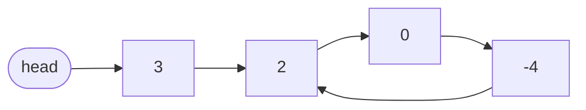
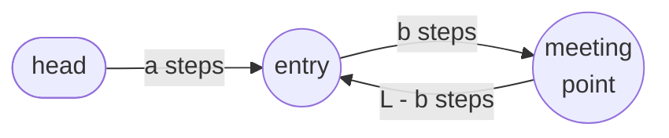

# Fast And Slow Pointers

**Fast and slow pointers** are two pointers walking the *same* linked list at the
same time, arranged so that one is always ahead of the other. The answer to the
problem is read off the **distance between them** rather than off a count, which
is what lets a single pass answer a question about a place the pass has not
reached yet

The [pointer pairs you have already used on arrays](../../02_two_pointers/notes/01_opposite_end_pointers.md)
had a luxury this one does not. There you could start a pointer at the last index
because an array lets you jump to any position for free. A
[singly linked list](01_linked_list_basics.md) has no indices and no backwards
link, so the only legal move is following one `next` at a time. Both pointers
here therefore start at the **head** and both only ever move **forward**, and
every difference between them has to be manufactured out of speed or out of a
head start

The picture to keep is two runners on a track. Send them off together with one
running twice as fast as the other, and two things follow. On a straight track
the fast runner crosses the finish line while the slow one is standing exactly at
the halfway mark, so the slow runner's position *is* the midpoint. On a circular
track the fast runner cannot get away, and eventually laps around and catches the
slow one from behind, so a collision is proof that the track loops

Those two outcomes are the two arrangements, and between them they cover every
problem in this family

- **Different speeds.** One pointer takes two steps for every one the other
  takes, so the leader arrives at the end while the trailer is exactly halfway
  - This arrangement is also what detects a cycle, since a faster pointer stuck
    in a loop must eventually run into the slower one
- **Different starting points.** Both pointers take one step per turn, but the
  leader begins `n` nodes ahead, so when the leader reaches the end the trailer
  is sitting `n` nodes from the end

The two-speed version has a name you should say out loud in an interview, since
naming an algorithm is free credit: **Floyd's cycle-finding algorithm**, also
called the **tortoise and hare** after the fable

> This topic covers finding the middle without a length, why a doubling pointer
> cannot skip past the one it is chasing, the fixed-gap variant, and the
> arithmetic that turns a meeting point into the exact node where a cycle begins

## The Questions That Are Defined From The End

Almost everything a problem asks about a linked list is defined from the **end**.
The middle is halfway to the end, the nth-from-last is `n` back from the end, and
a cycle is the case where there is no end at all. The head shows you none of
that, which is exactly the gap a second pointer fills

The signal is a question about a position you cannot address directly, combined
with a restriction that blocks the easy way of getting there

- **"The middle node"**, or anything that splits the list in half, which is what
  merge sort on a list needs
- **"The nth node from the end"**, where the distance is measured from a place you
  have not reached yet
- **"Is there a cycle"**, or "where does the cycle start", where the list has no
  end to walk to
- The phrase **"in one pass"** or **"using O(1) memory"** in the follow-up, which
  is there to rule out counting first or storing nodes as you go

The negative signal is worth as much. If the problem is about the **values** in
the list rather than about positions, two pointers at different speeds have
nothing to offer, because neither pointer knows anything about what the other one
is looking at. Merging, partitioning, and adding lists digit by digit are all
[merge and split](04_merge_split.md) problems, where the two pointers walk two
different lists in step

## Why A Set Of Visited Nodes Is The Wrong Kind Of Memory

Cycle detection has an obvious solution, and it is the one most people give
first. Walk the list, put every node into a
[hash set](../../01_arrays_and_hashing/notes/02_hashing.md), and if you ever
reach a node that is already in the set, the list loops

```python
from __future__ import annotations


class ListNode:
    def __init__(self, val: int = 0, next: ListNode | None = None) -> None:
        self.val = val
        self.next = next


# build and to_list are test helpers for the asserts in this note, not part of
# any solution, and later blocks reuse them rather than redefining them
def build(vals: list[int]) -> ListNode | None:
    head = None
    for val in reversed(vals):
        head = ListNode(val, head)
    return head


def to_list(head: ListNode | None) -> list[int]:
    out = []
    while head:
        out.append(head.val)
        head = head.next
    return out


def has_cycle_with_set(head: ListNode | None) -> bool:
    seen: set[int] = set()
    curr = head
    while curr:
        if id(curr) in seen:
            return True
        seen.add(id(curr))
        curr = curr.next
    return False


looped = build([3, 2, 0, -4])
looped.next.next.next.next = looped.next
assert has_cycle_with_set(looped) is True
assert has_cycle_with_set(build([3, 2, 0, -4])) is False
assert has_cycle_with_set(build([1])) is False
assert has_cycle_with_set(None) is False
```

That is correct, it is `O(n)` time, and it costs `O(n)` space. The follow-up
attached to this problem asks for `O(1)` memory, which does not mean "use a
smaller set". It means you are allowed a fixed number of pointers and nothing
else, so the only place left to store information is **the list itself**

A second pointer moving at the same speed as the first stores nothing, since the
distance between the two never changes and neither one ever learns anything the
other did not already know. Make the second pointer move at a **different rate**
and that distance changes by a known amount on every step, which turns it into a
quantity you can reason about and, in a loop, drive to zero. That single change
is the whole technique, and both arrangements below are versions of it

## Finding The Middle Without Counting The Length

Start both pointers at the head and move `slow` one node per turn while `fast`
moves two. `fast` covers exactly twice the ground, so at the moment `fast` runs
out of list, `slow` has covered half of it

```python
def middle_node(head: ListNode | None) -> ListNode | None:
    slow = fast = head
    while fast and fast.next:
        slow = slow.next
        fast = fast.next.next
    return slow


assert to_list(middle_node(build([1, 2, 3, 4, 5]))) == [3, 4, 5]
assert to_list(middle_node(build([1, 2, 3, 4, 5, 6]))) == [4, 5, 6]
assert to_list(middle_node(build([1]))) == [1]
assert middle_node(None) is None
```

**Why the loop test names two things**:

- `fast.next.next` reads through two references, so both of them have to exist
  before the step is legal, and the test is checking exactly those two
- `fast` is the odd-length exit. On `[1, 2, 3, 4, 5]` the fast pointer lands
  exactly on the last node, `fast.next` is `None`, and the loop stops
- `fast.next` is the even-length exit. On `[1, 2, 3, 4]` the fast pointer steps
  clean off the end to `None`, and testing `fast.next` first would raise
  `AttributeError` on `None`
  - This is why the order in `while fast and fast.next` matters, since Python
    stops evaluating an `and` as soon as the left side is false
- `slow = fast = head` puts both at the head, and that choice is what decides
  which node you land on for an even-length list

**The middle is ambiguous when the list has an even length**, and every problem
in this family tells you which one it wants. Two nodes are equally central in
`[1, 2, 3, 4]`, and the code above returns the **second** of them, the node
holding 3, because `slow` takes one step for each pair `fast` consumes and the
last pair pushes it past the halfway line

Landing on the **first** middle instead takes one changed line

```python
def first_middle(head: ListNode | None) -> ListNode | None:
    slow = fast = head
    while fast.next and fast.next.next:
        slow = slow.next
        fast = fast.next.next
    return slow


assert first_middle(build([1, 2, 3, 4])).val == 2
assert first_middle(build([1, 2, 3, 4, 5])).val == 3
assert first_middle(build([1])).val == 1
```

Testing one node further ahead makes the loop stop one step earlier, so `slow`
never crosses the midpoint. That is the version you want when you are about to
**split** the list, since `slow` is then the last node of the first half and
`slow.next` starts the second half

Deleting the middle needs a third variant, because deleting any node means
holding [the node before it](01_linked_list_basics.md). Drag a `prev` pointer
one node behind `slow`

```python
def delete_middle(head: ListNode | None) -> ListNode | None:
    if head is None or head.next is None:
        return None
    prev = None
    slow = fast = head
    while fast and fast.next:
        prev = slow
        slow = slow.next
        fast = fast.next.next
    prev.next = slow.next
    return head


assert to_list(delete_middle(build([1, 3, 4, 7, 1, 2, 6]))) == [1, 3, 4, 1, 2, 6]
assert to_list(delete_middle(build([1, 2, 3, 4]))) == [1, 2, 4]
assert to_list(delete_middle(build([2, 1]))) == [2]
assert delete_middle(build([1])) is None
```

The `head.next is None` guard is not decoration. A one-node list has itself as
its middle, deleting it leaves nothing, and without the guard `prev` is still
`None` when the loop ends and `prev.next` raises

## Dry Run: Landing On The Middle

Take `[1, 2, 3, 4, 5]`, and watch where the loop refuses to take another step

```text
start    slow=1   fast=1   fast.next=2      test passes
step 1   slow=2   fast=3   fast.next=4      test passes
step 2   slow=3   fast=5   fast.next=None   REJECTED, loop ends
answer   slow=3, and the list from there is [3, 4, 5]
```

The rejected step is the whole mechanism. `fast` stopped on the last node rather
than on `None`, which is the odd-length case, and `slow` had taken exactly two
steps to `fast`'s four. Had the loop taken one more step, `fast.next.next` would
have been read off a node whose `next` is `None`

Now the even-length list `[1, 2, 3, 4]`, which exits through the other guard

```text
start    slow=1   fast=1      fast.next=2      test passes
step 1   slow=2   fast=3      fast.next=4      test passes
step 2   slow=3   fast=None                    REJECTED, fast is falsy
answer   slow=3, the second of the two middles
```

`fast` is `None` here rather than sitting on a node, so the first half of the
`and` is what stopped the loop. Compare that with the `first_middle` version on
the same input: its test asks about `fast.next.next`, which is `None` when `fast`
is on node 3, so it stops one step earlier and leaves `slow` on node 2. One
character of difference in the loop test, and a different node comes back

## Why Fast Cannot Jump Over Slow

Point the last node of a list back at an earlier node and the list becomes a
loop with a tail hanging off it



Walking this with one pointer never terminates, since `next` is never `None`. Run
the same two-speed pair on it and something has to give, because `fast` cannot
escape a loop it is already inside

Measure `d`, the number of steps `fast` would have to take, going forward, to
land on `slow`. Once both pointers are inside the cycle, every turn moves `slow`
forward 1 and `fast` forward 2, so **`d` drops by exactly 1 per turn**. It is a
non-negative integer decreasing one at a time, so it cannot skip over zero, and
`d = 0` is the two pointers standing on the same node

Both pointers do get inside the cycle, because `slow` walks the tail once and
never leaves the cycle afterwards, and `fast` entered even earlier. From that
moment `d` is smaller than the cycle length, so the meeting happens within one
lap

```python
def has_cycle(head: ListNode | None) -> bool:
    slow = fast = head
    while fast and fast.next:
        slow = slow.next
        fast = fast.next.next
        if slow is fast:
            return True
    return False


cyclic = build([3, 2, 0, -4])
cyclic.next.next.next.next = cyclic.next
assert has_cycle(cyclic) is True
assert has_cycle(build([1, 2])) is False
assert has_cycle(build([1])) is False
assert has_cycle(None) is False
```

**Three decisions inside those six lines**:

- The `slow is fast` check comes **after** both moves, not before. Both pointers
  start on the head, so a check at the top of the loop is true on the first turn
  and reports a cycle in every list of two or more nodes
- The comparison is `is` and not `==`, since two different nodes are free to hold
  the same value and only object identity means "the same node"
- The exit condition is unchanged from the midpoint version, and it is what makes
  the acyclic case work. A list that ends puts `fast` on `None` or on the last
  node, the test fails, and the function returns `False` without any special
  handling

"Why two steps and not three" is the follow-up interviewers like, and the honest
answer has two halves. Moving `fast` three steps drops `d` by 2 per turn, and a
quantity falling by 2 can step over zero rather than land on it, so the argument
above no longer applies. It happens to still meet when both pointers start on the
head, because after `t` turns `fast` is `2t` ahead counted around the cycle and
some `t` makes that a whole number of laps, but that is a divisibility argument
about one particular starting arrangement rather than the guarantee you want.
Start the two pointers on different nodes and a gap falling by 2 can orbit an
even-length cycle forever, passing zero on the way round every time

The second half is the one that decides it. The entry-node arithmetic in the
worked example below rests on `fast` having walked **exactly twice** what `slow`
walked, so at 3 to 1 the equation `a + b = kL` is false and the phase-two walk
from the head does not land on the entry. Closing the distance by exactly one
each turn is what guarantees a landing, and the 2-to-1 ratio is what makes the
meeting point usable afterwards

## Dry Run: Closing The Gap Inside A Cycle

Take the list drawn above, `3 -> 2 -> 0 -> -4`, with `-4` pointing back at the
node holding 2. The cycle is three nodes long, and the tail before it is one node

```text
start    slow=3    fast=3     both still on the tail node
step 1   slow=2    fast=0     d=2   not the same node
step 2   slow=0    fast=2     d=1   REJECTED, one apart is not a meeting
step 3   slow=-4   fast=-4    d=0   they meet
```

Step 2 is the one to study. `fast` is a single node behind `slow` and the
identity check is false, so the loop keeps going rather than reporting anything.
That step is also the proof made visible: `d` went 2, then 1, then 0, one at a
time, which is why no pair of pointers can pass each other unnoticed

Step 1 shows the other half of the argument. `slow` had just arrived at the entry
node and `fast` had entered on that same turn and carried one node further, so
`d` was measured the long way around the loop rather than along the list. Nothing
about the tail matters once both are inside

Notice where they met. It is the node holding -4, not the node where the cycle
begins, and no problem ever asks for the meeting point itself. Turning it into
the entry node is the worked example below

## A Fixed Gap Instead Of A Speed Difference

*Remove Nth Node From End Of List* is the same idea with the speeds equal and the
**starting positions** unequal. Send a `lead` pointer `n` nodes ahead, then walk
both together. When `lead` reaches the last node, `lag` is `n` nodes behind it,
which is where the target lives

The obvious alternative is to walk the list once to count its length `L`, then
walk again `L - n` steps. That is `O(n)` either way and it is a perfectly good
answer, but it needs the whole list twice, and the follow-up on this problem asks
for one pass

```python
def remove_nth_from_end(head: ListNode | None, n: int) -> ListNode | None:
    dummy = ListNode(0, head)
    lead = lag = dummy
    for _ in range(n):
        lead = lead.next
    while lead.next:
        lead = lead.next
        lag = lag.next
    lag.next = lag.next.next
    return dummy.next


assert to_list(remove_nth_from_end(build([1, 2, 3, 4, 5]), 2)) == [1, 2, 3, 5]
assert to_list(remove_nth_from_end(build([1, 2]), 2)) == [2]
assert remove_nth_from_end(build([1]), 1) is None
```

**Why the pointers start on the dummy and not on the head**:

- Removing a node means editing its predecessor, so `lag` must end one node
  **before** the target, which is why the walk stops on `lead.next` rather than
  on `lead`
- The node to remove can be the head itself, when `n` equals the length, and the
  head has no predecessor in the list
  - The [dummy head](01_linked_list_basics.md) supplies one, and starting both
    pointers there keeps the `n`-node separation intact
  - Return `dummy.next` rather than `head`, since `head` is stale exactly when it
    was the node removed
- The advance loop is `for _ in range(n)` on `lead` alone, and the walk loop moves
  both, so the separation is established once and then preserved for free

```text
advance 1   lead=1   lag=dummy
advance 2   lead=2   lag=dummy      the gap of 2 is now set
walk        lead=3   lag=1
walk        lead=4   lag=2
walk        lead=5   lag=3
stop        lead=5 has no next, so the walk is REFUSED here
unlink      lag.next is 4, the second node from the end
```

The refused step is again where the answer appears. Stopping on `lead.next`
rather than on `lead` leaves `lag` one node short of the target instead of on it,
and that one-node offset is the difference between a working solution and an
`AttributeError` on the last unlink

## Comparing A List Against Its Own Second Half

*Palindrome Linked List* wants to compare the front of the list against the back,
which a singly linked list cannot do, because nothing points backwards. Copying
every value into a Python list makes it easy and costs `O(n)` space, and the
follow-up asks for `O(1)`

The repair is to make backwards into forwards. Find the middle with the two-speed
walk, flip the `next` pointers of everything from there on, and then two forward
walks meet in the middle

```python
def is_palindrome(head: ListNode | None) -> bool:
    slow = fast = head
    while fast and fast.next:
        slow = slow.next
        fast = fast.next.next

    prev = None
    while slow:
        nxt = slow.next
        slow.next = prev
        prev = slow
        slow = nxt

    left, right = head, prev
    while right:
        if left.val != right.val:
            return False
        left = left.next
        right = right.next
    return True


assert is_palindrome(build([1, 2, 2, 1])) is True
assert is_palindrome(build([1, 2])) is False
assert is_palindrome(build([1, 2, 1])) is True
assert is_palindrome(build([1])) is True
```

The middle loop is the standard reversal, built on the
[save-before-you-overwrite rule](01_linked_list_basics.md), and
[reversal](03_reversal.md) takes it apart properly. What matters here is that
`prev` ends up naming the **last** node of the original list, which is the head of
the reversed back half

**Two details that make the comparison safe**:

- The loop condition is `while right` and not `while left and right`, because the
  reversed half is never longer than the front half, so the back pointer is always
  the one that runs out first
- On an odd-length list the two halves overlap on the middle node, which gets
  compared against itself and always matches, so no separate case is needed

The same split-and-reverse shape solves *Maximum Twin Sum* and *Reorder List*.
Finding the middle is step one in all of them, which is why the two-speed walk is
worth having in your fingers rather than in your notes

## Worked Example: [Linked List Cycle II](https://leetcode.com/problems/linked-list-cycle-ii/)

Return the node where the cycle begins, or `None` if the list has no cycle. The
tail is not necessarily the whole loop, so the answer is generally somewhere in
the middle of the list

**Input**: `head`, a `ListNode | None`, the first node of a singly linked list
whose last node may point back at some earlier node instead of at `None`. The
list holds up to `10^4` nodes, and an empty list is given as `None`. The cycle is
part of the structure you are handed rather than a separate argument, so the
function is never told where, or whether, the loop is

**Output**: a `ListNode | None`, the actual node object where the cycle begins,
meaning the first node that the walk reaches twice, and not its value, its index,
or the node where the two pointers happened to collide. Return `None` when the
list ends normally, which includes the empty list

**Recognizing it**: "detect a cycle" plus "`O(1)` memory" is Floyd, and asking for
the **entry node** rather than a yes or no is the tell that a second phase is
needed. The meeting point found by phase one is almost never the entry, as the dry
run above showed, so a solution that returns `slow` directly is wrong on every
input with a tail

Name the three quantities the list has



- `a` is the distance from the head to the entry node
- `b` is the distance from the entry to where the pointers met
- `L` is the length of the cycle

When they meet, `slow` has walked `a + b`, because it goes one node per turn and
does not complete a lap before being caught. `fast` has walked twice that, and
`fast`'s route is the same `a + b` plus some whole number of laps, so
`2(a + b) = a + b + kL` for some `k >= 1`. Cancelling gives `a + b = kL`, and
therefore `a = kL - b`

Read that last equation as a set of directions. From the meeting point, `L - b`
steps forward lands on the entry, so `kL - b` steps forward lands on the entry as
well, since the extra `k - 1` laps come back to the same node. And `kL - b` is
exactly `a`, which is the number of steps a fresh pointer at the head needs to
reach the entry. **Two pointers, one at the head and one at the meeting point,
both moving one step at a time, arrive at the entry on the same turn**

Therefore,

1. Start `slow` and `fast` on the head and loop while `fast and fast.next`, which
   is the same guard as every other two-speed walk, because `fast.next.next` reads
   through two references and both have to exist before the step is legal
2. Move `slow` one node and `fast` two nodes per turn, since a gap that changes by
   a known amount every turn is the only thing a list with no end will tell you
   about itself
3. Compare with `slow is fast` **after** both moves, using identity rather than
   `==`, because both pointers begin on the head and a check at the top of the loop
   would report a cycle on the very first turn of any list
4. On a meeting, do **not** return that node. It is the collision point, which sits
   `b` nodes past the entry, so release a fresh `probe` from the head and leave
   `slow` parked where the collision happened
5. Advance `probe` and `slow` **one step each** per turn until they are the same
   node, since the doubling was only ever a device for producing the meeting and
   the equation `a = kL - b` counts single steps from both places
6. Test `while probe is not slow` before moving anything, which is the `a = 0` edge
   case where the cycle starts at the head itself and zero steps is the right
   answer, then return `probe`, the node both pointers are standing on
7. If the loop runs out instead, meaning `fast` reached `None` or the last node,
   return `None`, because a list that ends cannot loop and no special empty-list
   case is needed

```python
def detect_cycle(head: ListNode | None) -> ListNode | None:
    slow = fast = head
    while fast and fast.next:
        slow = slow.next
        fast = fast.next.next
        if slow is fast:
            probe = head
            while probe is not slow:
                probe = probe.next
                slow = slow.next
            return probe
    return None


tailed = build([3, 2, 0, -4])
tailed.next.next.next.next = tailed.next
assert detect_cycle(tailed) is tailed.next

at_head = build([1, 2])
at_head.next.next = at_head
assert detect_cycle(at_head) is at_head

assert detect_cycle(build([1])) is None
assert detect_cycle(None) is None
```

**The insight**: the meeting point is not the answer, it is a *measurement*. It
encodes `a` as a distance inside the cycle, and phase two spends that measurement
by walking it off from two places at once

On the four-node example, `a` is 1 and `b` is 2 with `L = 3`, so `a + b = 3` is
one full lap and `k = 1`. Phase two takes a single step from each side: the probe
moves from the node holding 3 to the node holding 2, `slow` moves from -4 back
around to the node holding 2, and the loop exits immediately with the right answer

**Two things that are easy to get wrong here**:

- Phase two moves `probe` and `slow` **one step each**, since the doubling was
  only ever a device for making them meet, and keeping `fast` at double speed in
  phase two makes the arithmetic above false
- The check is `while probe is not slow`, tested before the first move, which
  handles `a = 0` correctly. A cycle starting at the head means the pointers met
  at a place already `L` steps from the entry, and zero moves is the right answer

## Time and Space Complexity

`n` is the number of nodes reachable from the head, `L` is the length of the
cycle when there is one, and `a` is the distance from the head to the node where
that cycle begins

**Finding the middle**

| Approach                       | Time                                                                                                    | Space                                                                                       |
| ------------------------------ | ------------------------------------------------------------------------------------------------------- | ------------------------------------------------------------------------------------------- |
| Two-speed walk                 | `O(n)`: `fast` visits each node at most once and stops at the end, and `slow` does half that many steps | `O(1)`: two pointer variables, and no node is copied or stored                              |
| Count the length, then re-walk | `O(n)`: two passes over the list, so the same class with twice the constant                             | `O(1)`: one counter and one pointer, which is why this is a legitimate answer and not a bug |
| Copy the values into a list    | `O(n)`: one pass to copy, then `O(1)` indexing to reach the middle                                      | `O(n)`: one slot per node, which is what an `O(1)` space follow-up rules out                |

**Cycle detection and locating the entry**

| Approach                  | Time                                                                                                                              | Space                                                                                           |
| ------------------------- | --------------------------------------------------------------------------------------------------------------------------------- | ----------------------------------------------------------------------------------------------- |
| Floyd, phase one          | `O(n)`: `slow` walks the tail in at most `n` steps, then the distance `d < L` closes by 1 per turn, so `O(n + L)` which is `O(n)` | `O(1)`: two pointers, and the list is never modified                                            |
| Floyd, phase two          | `O(n)`: the probe walks `a` steps, and `a` is at most `n`                                                                         | `O(1)`: one extra pointer reusing the meeting point                                             |
| Hash set of visited nodes | `O(n)`: one membership test and one insert per node, both `O(1)` on average                                                       | `O(n)`: every node visited before the repeat is stored, which fails the `O(1)` memory follow-up |

**The fixed-gap and split variants**

| Approach                             | Time                                                                                                         | Space                                                                      |
| ------------------------------------ | ------------------------------------------------------------------------------------------------------------ | -------------------------------------------------------------------------- |
| Nth from end with a gap of `n`       | `O(n)`: `lead` traverses the list once and `lag` trails inside that same pass                                | `O(1)`: two pointers and one sentinel node, none of which grow with `n`    |
| Nth from end by measuring the length | `O(n)`: one pass to count and one to walk, which fails the one-pass follow-up rather than the complexity bar | `O(1)`: a counter and a pointer                                            |
| Palindrome by split and reverse      | `O(n)`: a full pass for `fast` to find the middle, a half pass to reverse, and a half pass to compare        | `O(1)`: the reversal rewires existing nodes in place and allocates nothing |
| Palindrome by copying values         | `O(n)`: one pass to copy, then a two-pointer scan of the copy                                                | `O(n)`: a Python list holding every value                                  |

Every row here is `O(n)` time, so the technique is never chosen for speed. It is
chosen for the `O(1)` space and the single pass, which are the two constraints
these problems actually test

## Summary

- **Fast and slow pointers** run two pointers forward over one list and read the
  answer off the changing distance between them, which is the only way a singly
  linked list will tell you anything about its own end before you get there
  - The two-speed form is **Floyd's cycle-finding algorithm**, also called the
    **tortoise and hare**, and naming it out loud in an interview costs nothing
  - **Different speeds** means `slow` advances one node and `fast` advances two
    per turn, which is what lands on a midpoint and what catches a cycle
  - **Different starting points** means both advance one node per turn while
    `lead` begins `n` nodes ahead, which is what finds the nth node from the end
- A problem wants this technique when it names a position measured from the end
  of the list, such as the middle, the nth from last, or the node where a cycle
  begins, and then adds **"in one pass"** or **"using `O(1)` memory"**
  - Those two phrases are not decoration. They exist to rule out walking the list
    once to count its length, and to rule out dropping every visited node into a
    hash set, both of which are otherwise correct answers
- A second pointer at the *same* speed is useless here, because the gap between
  two pointers moving in lockstep never changes and so never records anything.
  Giving one of them a different rate turns that gap into a number that moves by a
  known amount every turn, which is what makes it something you can reason about
- The core loop is `while fast and fast.next`, with `slow = slow.next` and
  `fast = fast.next.next` inside it. Both tests are load-bearing, since
  `fast.next.next` reads through two references and `fast` has to be confirmed
  non-`None` before `fast.next` is read off it
  - `fast` being falsy is the even-length exit and `fast.next` being `None` is the
    odd-length exit, so a list of either parity stops safely
- An even-length list has two equally central nodes, and which one you get is
  decided by one character in the loop test. `while fast and fast.next` returns
  the **second** middle, and `while fast.next and fast.next.next` stops a step
  earlier and returns the **first**
  - Splitting problems want the first middle, because `slow` is then the last node
    of the front half and `slow.next` cleanly begins the back half
  - Deleting the middle needs a `prev` pointer trailing `slow`, since removing any
    node means editing the node before it
- The cycle meeting is guaranteed, not lucky. Once both pointers are inside the
  loop, the forward distance `d` from `fast` up to `slow` falls by exactly 1 every
  turn, because `fast` gains two nodes and `slow` gains one, and a non-negative
  integer decreasing one at a time cannot skip over zero
  - This is also the answer to "why not three steps". A gap falling by 2 per turn
    can step across zero instead of landing on it, and it breaks the entry-node
    equation below, which needs `fast` to have walked exactly double
- Locating where the cycle **begins** takes a second phase built on `a = kL - b`,
  where `a` is head-to-entry, `b` is entry-to-meeting-point, and `L` is the cycle
  length. A probe released from the head and the pointer left at the meeting
  point, both moving one node per turn, arrive at the entry on the same turn
- *Remove Nth Node From End* drops the speed difference and uses a fixed head
  start of `n` nodes instead, walking both pointers together until `lead.next` is
  `None` so that `lag` stops one node **before** the target
  - Both pointers start on the [dummy head](01_linked_list_basics.md) rather than
    on the real head, because the node being removed can be the head itself and a
    head has no predecessor to edit. Return `dummy.next`, never `head`
- *Palindrome Linked List*, *Maximum Twin Sum*, and *Reorder List* are all the
  same split-and-reverse shape: find the middle with the two-speed walk, reverse
  the back half in place, then walk the two halves toward each other
- Everything in this topic is `O(n)` time, so speed is never the reason to choose
  it. The reason is `O(1)` space, since the technique holds a fixed number of
  pointers, against `O(n)` for a hash set of visited nodes or a copied list of
  values
- The most common mistake involves testing `slow is fast` at the top of the loop
  before either pointer has moved, which is true on the very first turn because
  both started on the head, and so reports a cycle in every list long enough to
  enter the loop at all, meaning every list of two or more nodes
  - A close second is comparing with `==` instead of `is`, which conflates two
    distinct nodes that happen to hold equal values

## Interview Checklist

Before writing code, make sure you can answer each of these

```text
Is the answer defined from the end of the list, and am I forbidden from counting first?
Can I name Floyd's cycle-finding algorithm and say why the meeting is guaranteed?
Is my loop test `while fast and fast.next`, with fast checked before fast.next?
For an even-length list, do I want the first middle or the second, and which test gives it?
Do I need a prev pointer trailing slow, because something is going to be unlinked?
Am I comparing nodes with `is` rather than `==`, since equal values are not the same node?
In cycle detection, does the identity check run after both pointers move?
Can I justify the 2-to-1 speed ratio, rather than any other pair of speeds?
For the cycle entry, do both phase-two pointers move exactly one step per turn?
For a gap of n, do both pointers start on the dummy so the head can be removed?
Do I return dummy.next rather than head, in case the head was the node removed?
Can I state O(n) time and O(1) space unprompted, and say what the O(n)-space rival was?
What happens on an empty list, a one-node list, and a list that is one big cycle?
```
