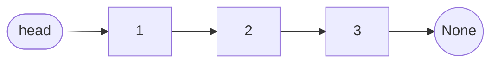
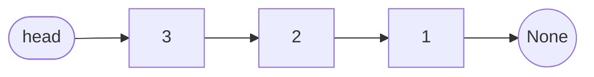
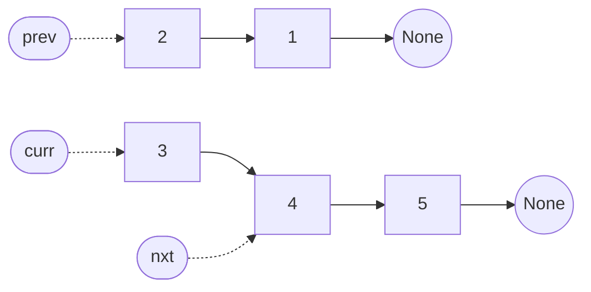

# Linked List Reversal

**Reversing** a linked list means making the same nodes read in the opposite
order, so the node that used to be last is the one the caller starts from and the
node that used to be first is where the list now ends. The node objects
themselves are untouched, because the only thing that decides order in a linked
list is which node each `next` field points at

That is what makes this a different operation from reversing an array. An array
reversal swaps **values** across the middle, since the values sit in numbered
slots you can address directly. A linked list has no slots and no addresses, so
there is nothing to swap by index. What you rewrite instead is the `next` field
of every node, one node at a time, until each one faces the way it came from

Picture a line of people where everybody is pointing at whoever stands ahead of
them. Reversing that line does not mean anyone walks anywhere. Each person turns
and points at whoever used to be behind them, and then you announce that the
person at the old back of the line is the one to talk to first





The two pictures hold the exact same three node objects, sitting in the exact
same place in memory. Only the `next` field of each one changed, along with which
node the caller is told to treat as the head

**Three consequences fall out of that**:

- The old head becomes the new **tail**, so its `next` has to end up as `None`,
  since a linked list ends wherever a `next` is `None`
- The old tail becomes the new **head**, so a reversal function has to hand back
  a different node than the one it was given. A reversal that returns `head` is
  returning a pointer to what is now the last element, which reads as an
  almost-empty list
- Nothing is copied and nothing is allocated, so this is an **in-place** rewrite
  costing `O(1)` extra space, and that bound is what every follow-up on this
  topic is fishing for

> This topic covers the three-pointer flip, reversing only a slice between two
> positions, reversing in fixed-size groups, and using a reversal as a subroutine
> so that a backwards walk becomes a forwards one

## When A Problem Wants The List Backwards

A problem with the word "reverse" in its title needs no recognition work at all.
The versions worth studying are the ones that never say it, since an interviewer
who wants to see whether you understand the technique will describe the effect
and leave you to find the mechanism

- **Reverse the whole list**, or reverse it between two given positions, or in
  groups of `k`
- **Compare the front against the back**, as in checking a palindrome or pairing
  element `i` with element `n - 1 - i`. A singly linked node cannot look
  backwards, so the standard move is to reverse the second half and then walk
  both halves forwards in lockstep
- **Process the list from the tail towards the head**, as in adding two numbers
  whose most significant digit comes first, or dropping every node that has a
  larger node somewhere to its right
- **Rearrange in a pattern that reads the list from both ends**, as in weaving
  the first node, the last node, the second node, the second-to-last

**When reversal is the wrong tool**: a reversal is destructive, since the
original ordering is gone the moment the pointers are rewritten. If the caller
still needs the list the way it came in, you either reverse a second time at the
end to restore it or you do not reverse at all. When you only need to *read* the
values backwards and `O(n)` space is acceptable, pushing them onto a
[stack](../../03_stacks_and_queues/notes/01_stack.md) or into a plain list is
simpler and far easier to get right under pressure. Reversal is what you reach
for when the interviewer has pinned you to `O(1)` space, or when the problem
forbids touching the values

## Why Copying The Values Out Is Not Enough

The first idea most people have is to leave the pointers completely alone. Walk
the list once collecting the values into a Python list, then walk it a second
time writing those values back in the opposite order

```python
from __future__ import annotations


class ListNode:
    def __init__(self, val: int = 0, next: ListNode | None = None) -> None:
        self.val = val
        self.next = next


# build and to_list are test helpers used by the checks throughout this note,
# not part of any solution, and they are reused by every block below
def build(values: list[int]) -> ListNode | None:
    head = None
    for val in reversed(values):
        head = ListNode(val, head)
    return head


def to_list(head: ListNode | None) -> list[int]:
    out = []
    while head:
        out.append(head.val)
        head = head.next
    return out


def reverse_by_values(head: ListNode | None) -> ListNode | None:
    vals = []
    curr = head
    while curr:
        vals.append(curr.val)
        curr = curr.next
    curr = head
    for v in reversed(vals):
        curr.val = v
        curr = curr.next
    return head


assert to_list(reverse_by_values(build([1, 2, 3, 4, 5]))) == [5, 4, 3, 2, 1]
assert to_list(reverse_by_values(build([1, 2]))) == [2, 1]
assert reverse_by_values(build([])) is None
```

This is correct and it runs in `O(n)` time, so it does not fail for being slow.
It fails for two specific reasons

- It costs `O(n)` extra space for `vals`, because the list holds one entry per
  node, and "now do it in `O(1)` space" is the follow-up that always arrives on
  this module
- Several problems in the ladder state that you **may not alter the values in the
  nodes**, only the nodes themselves, and *Reverse Nodes in K-Group* says so
  outright. A node in a real system carries a payload rather than an integer, and
  shuffling payloads between objects is not the same operation as reordering the
  objects

Both objections point the same way. The one field you are always allowed to
change is `next`, so the algorithm has to be a sequence of `next` assignments and
nothing else. That is the entire derivation, and every technique below is
bookkeeping wrapped around it

## Three Pointers, One Flip Per Node

The goal is for each node to end up pointing at the node that used to come before
it. Standing on some node, though, you have no idea what its predecessor is,
because a **singly linked** node stores no backwards reference. The fix is to
carry the predecessor yourself in a variable as you walk, so that the node you
need is always in hand by the time you arrive

Overwriting `curr.next` destroys your only route forward, which is why the
[pointer-order rule](01_linked_list_basics.md) says to read it into a name before
you clobber it. That leaves three live references at every moment: the node
behind, the node you are on, and the node ahead

```python
def reverse_list(head: ListNode | None) -> ListNode | None:
    prev = None
    curr = head
    while curr:
        nxt = curr.next
        curr.next = prev
        prev = curr
        curr = nxt
    return prev


assert to_list(reverse_list(build([1, 2, 3, 4, 5]))) == [5, 4, 3, 2, 1]
assert to_list(reverse_list(build([1, 2]))) == [2, 1]
assert to_list(reverse_list(build([7]))) == [7]
assert reverse_list(build([])) is None
```

Below is the state halfway through a five-node list. Two of the five nodes have
already been flipped, and the snapshot is taken at the top of the third
iteration, right after `nxt = curr.next` has saved the route forward



Midway through the loop the structure is temporarily two separate lists.
Everything behind `prev` is finished and already points backwards, everything
from `curr` onward is untouched and still points forwards, and not one pointer
joins the two halves. That is the **invariant** to say out loud while you code,
because every line in the loop exists to preserve it

**What each line is doing, and what breaks without it**:

- `prev = None` seeds the walk with the fact that the first node has nothing
  before it. It is also what terminates the finished list, since the original
  head gets `curr.next = None` on the very first iteration and becomes the tail
  - Seeding with `head` instead is the classic slip, and it makes the first node
    point at itself, which is an infinite loop the moment anything reads it
- `nxt = curr.next` is the saved route out, taken before the next line destroys it
- `curr.next = prev` is the only line that changes the list. The other four move
  pointers around
- `prev = curr` then `curr = nxt` advance both markers by one, and the order
  matters, since assigning `curr` first would leave `prev` pointing at the node
  you already stepped onto
- `return prev` is the part people get wrong under time pressure. The loop ends
  when `curr` is `None`, so `curr` is useless and `prev` is standing on the last
  node processed, which is the new head

Both edge cases fall out for free. An empty list never enters the loop and
returns `prev`, which is still `None`, and a single node is flipped to point at
`None` and returned

## Dry Run: Flipping A Three-Node List

`1 -> 2 -> 3`, with the state shown at the end of each iteration

```text
start            prev=None  curr=1     reversed so far: (empty)
iter 1  nxt=2    prev=1     curr=2     reversed so far: 1
iter 2  nxt=3    prev=2     curr=3     reversed so far: 2->1
iter 3  nxt=None prev=3     curr=None  reversed so far: 3->2->1
iter 4  NOT RUN, since curr is None    return prev, which is 3
```

The fourth row is the step that gets rejected, and it is the one to look at.
`curr` walked one position past the end of the list, so the loop test failed and
the flip never happened. That is exactly why the return value is `prev` and not
`curr`. A candidate who writes `return curr` gets `None` back on every input,
which looks like a much deeper bug than it is

Iteration 3 is the other one worth reading. `nxt` came out as `None`, and that
`None` is what ends up in `curr`, so the loop is self-terminating with no length
check and no special case for the last node

## The Recursive Version, And What It Costs

Interviewers regularly ask for the recursive form as a follow-up, or hand you one
of the two and ask how the other compares

```python
def reverse_list_recursive(head: ListNode | None) -> ListNode | None:
    if head is None or head.next is None:
        return head
    new_head = reverse_list_recursive(head.next)
    head.next.next = head
    head.next = None
    return new_head


assert to_list(reverse_list_recursive(build([1, 2, 3, 4, 5]))) == [5, 4, 3, 2, 1]
assert to_list(reverse_list_recursive(build([1, 2]))) == [2, 1]
assert to_list(reverse_list_recursive(build([7]))) == [7]
assert reverse_list_recursive(build([])) is None
```

The base case hands back an empty or one-node list unchanged, because a list that
short is already its own reversal. In every other case you reverse everything
after `head` first and get back the new head, which is the old tail and is not
something the current frame could compute for itself. The node `head.next` is by
then the **last** node of that reversed remainder, so `head.next.next = head`
hooks the current node onto the end of it, and `head.next = None` turns the
current node into the new tail

Say the cost difference out loud rather than offering the two versions as
interchangeable. The recursion costs `O(n)` stack space, because it opens one
frame per node before any of them unwind, and on a list of a hundred thousand
nodes CPython raises `RecursionError` long before the algorithm itself is the
problem. The iterative flip is `O(1)` space and is the one to write by default

## Reversing Only The Slice Between Two Positions

*Reverse Linked List II* hands you `left` and `right` and asks for positions
`left` through `right` reversed, counted from 1, with everything outside that
range left exactly as it was. The flip loop itself does not change by a single
character. What changes is that a slice has two **seams**, meaning two points
where the reversed section meets the untouched list, and both of them have to be
re-stitched once the flipping is done

Two nodes have to be in hand before the flip starts. The first is the node
**before** the slice, which is where the reversed section gets re-attached, since
a node can only ever be reached through its predecessor. The second is the node
**first inside** the slice, which is the slice's future tail once everything
turns around, so it is the node that has to end up pointing at whatever follows
the slice

```python
def reverse_between(head: ListNode | None, left: int, right: int) -> ListNode | None:
    dummy = ListNode(0, head)
    before = dummy
    for _ in range(left - 1):
        before = before.next
    tail = before.next

    prev, curr = None, tail
    for _ in range(right - left + 1):
        nxt = curr.next
        curr.next = prev
        prev = curr
        curr = nxt

    before.next = prev
    tail.next = curr
    return dummy.next


assert to_list(reverse_between(build([1, 2, 3, 4, 5]), 2, 4)) == [1, 4, 3, 2, 5]
assert to_list(reverse_between(build([1, 2, 3, 4, 5]), 1, 5)) == [5, 4, 3, 2, 1]
assert to_list(reverse_between(build([5]), 1, 1)) == [5]
```

**The decisions that make this work**:

- The [dummy head](01_linked_list_basics.md) is not optional here, because
  `left = 1` means the slice starts at the head and there is no real node before
  it. With the sentinel, `before` always exists, and `left - 1` steps from the
  sentinel lands on the right node for every legal `left` including 1
- `tail = before.next` is captured **before** the flip, since after the flip that
  node is buried at the far end of the reversed slice and walking to it would
  cost another pass
- The loop runs `right - left + 1` times, counting nodes rather than testing
  values, which is why it is a `for` and not a `while`. Positions 2 through 4 is
  three nodes, and the `+ 1` is the off-by-one that gets dropped
- After the loop, `prev` is the first node of the reversed slice and `curr` is
  the first node after the slice, so the two reconnections are
  `before.next = prev` and `tail.next = curr`
  - Doing them in the other order is harmless here, but doing only one of them is
    not. Skipping `tail.next = curr` leaves the slice's new tail still pointing
    at the node it pointed at mid-flip, which truncates the list
- `return dummy.next` rather than `head`, since a slice starting at position 1
  replaces the head and the local `head` name goes stale

## Dry Run: Positions Two Through Four

`1 -> 2 -> 3 -> 4 -> 5` with `left = 2` and `right = 4`

```text
walk    before=1                          one step, since left-1 = 1
capture tail=2                            the slice's future tail

flip 1  nxt=3  prev=2  curr=3   slice: 2         before.next is STILL 2 (stale)
flip 2  nxt=4  prev=3  curr=4   slice: 3->2      before.next is STILL 2 (stale)
flip 3  nxt=5  prev=4  curr=5   slice: 4->3->2   before.next is STILL 2 (stale)

reconnect  before.next = prev = 4
reconnect  tail(2).next = curr = 5
result     1 -> 4 -> 3 -> 2 -> 5
```

The stale column is the point of the trace. Through all three flips, node 1 kept
pointing at node 2, which by the end is the *last* node of the slice rather than
the first. If you stopped after the loop and returned, the list would read
`1 -> 2 -> None`, because node 2's `next` was set to `None` on the first flip and
never fixed. The list looks reversed while you are watching `prev`, and is broken
from the head's point of view until the two reconnection lines run

The walk at the top is the discarded work worth noticing. The loop advanced
`before` and then deliberately stopped one node short of the slice, refusing to
step onto node 2 even though node 2 is where the interesting part starts. You
stop early on purpose, because a node can only be re-attached by its predecessor

## Reversing In Fixed-Size Groups

*Reverse Nodes in K-Group* is the slice version applied over and over down the
length of the list, with one extra rule attached. If fewer than `k` nodes remain
when you get to the end, that leftover run stays in its original order. *Swap
Nodes in Pairs* is the identical problem with `k` fixed at 2, so writing the
general version buys you both

That rule about the remainder is what forces the shape of the loop. You cannot
start flipping a group and then discover it was short, because by the time you
find out you have already rewritten its pointers and there is nothing left to
leave alone. Each round therefore begins by **probing forward `k` nodes** and
only commits to flipping once it has confirmed they are all there

```python
def reverse_k_group(head: ListNode | None, k: int) -> ListNode | None:
    dummy = ListNode(0, head)
    group_prev = dummy

    while True:
        kth = group_prev
        for _ in range(k):
            kth = kth.next
            if kth is None:
                return dummy.next
        group_next = kth.next

        prev, curr = group_next, group_prev.next
        while curr is not group_next:
            nxt = curr.next
            curr.next = prev
            prev = curr
            curr = nxt

        tail = group_prev.next
        group_prev.next = kth
        group_prev = tail


assert to_list(reverse_k_group(build([1, 2, 3, 4, 5]), 2)) == [2, 1, 4, 3, 5]
assert to_list(reverse_k_group(build([1, 2, 3, 4, 5]), 3)) == [3, 2, 1, 4, 5]
assert to_list(reverse_k_group(build([1, 2, 3]), 1)) == [1, 2, 3]
assert to_list(reverse_k_group(build([1, 2]), 3)) == [1, 2]
```

**The two ideas that are not in the plain template**:

- `prev` is seeded with `group_next` instead of `None`, which does one of the two
  reconnections for free. In the slice version the first node flipped got
  `curr.next = None` and needed fixing afterwards. Here it gets
  `curr.next = group_next` immediately, so the group's new tail is already
  stitched to the rest of the list the moment it is flipped
  - The loop condition becomes `while curr is not group_next`, comparing
    **identity** rather than counting, since `group_next` is the node that marks
    the end of the group
- `tail = group_prev.next` is read before `group_prev.next = kth` overwrites it.
  That node was the first of the group and is now the last, which makes it
  exactly the predecessor the next round needs, so `group_prev = tail` sets up
  the next iteration with no walking

`kth` is the probe and the group's last node at the same time. Walking `k` steps
from `group_prev` lands on it, so if the walk hits `None` the group is short and
the function returns immediately with the remainder untouched, which is the
required behaviour rather than an error case

## Dry Run: Groups Of Three, With A Remainder

`1 -> 2 -> 3 -> 4 -> 5` with `k = 3`, so one full group and a remainder of two

```text
round 1  group_prev=dummy   probe 3 steps -> kth=3   full group, commit
         group_next=4
  flip 1 prev=1  curr=2     chain from prev: 1->4->5
  flip 2 prev=2  curr=3     chain from prev: 2->1->4->5
  flip 3 prev=3  curr=4     curr is group_next, stop
  splice tail=1, group_prev.next=3, group_prev=1
         list is now 3->2->1->4->5

round 2  group_prev=1       probe: 4, then 5, then None   REJECTED, group is short
         return dummy.next -> 3->2->1->4->5
```

Round 2 is the rejected step and the reason the probe runs before the flip. Two
nodes were left, the walk ran off the end on its third hop, and the function
returned without touching them. Had the code flipped first and checked after,
those two nodes would already be reversed and would have to be reversed back

The `chain from prev` column shows the seeded `prev` paying off. After the very
first flip, node 1 already points at node 4, so the tail of the group is
connected to the rest of the list before the group is even finished. Nothing at
the end of the round has to repair that seam

## When It Looks Like Reversal And Is Not

*Swapping Nodes in a Linked List* asks you to swap the `k`th node counted from
the start with the `k`th node counted from the end. It sits in the reversal
problem set, it mentions a position measured from the back, and it needs no
reversal whatsoever

```python
def swap_nodes(head: ListNode | None, k: int) -> ListNode | None:
    first = head
    for _ in range(k - 1):
        first = first.next

    second = head
    walker = first
    while walker.next:
        walker = walker.next
        second = second.next

    first.val, second.val = second.val, first.val
    return head


assert to_list(swap_nodes(build([1, 2, 3, 4, 5]), 2)) == [1, 4, 3, 2, 5]
assert to_list(swap_nodes(build([7, 9, 6, 6, 7, 8, 3, 0, 9, 5]), 5)) == [7, 9, 6, 6, 8, 7, 3, 0, 9, 5]
assert to_list(swap_nodes(build([1, 2, 3]), 2)) == [1, 2, 3]
assert to_list(swap_nodes(build([1]), 1)) == [1]
```

The `k`th node from the end comes out of the fixed-gap trick established in
[fast and slow pointers](02_fast_slow.md), and once you are holding both nodes the
swap is a single line on their values. The `next` pointers are never written to,
so the list reads in exactly the order it always did

The distinction is worth holding onto, because it is the same line the k-group
problem draws from the other side. Here the problem permits swapping values and
exactly two of them move, which makes touching values both legal and by a wide
margin the shortest code. Once a problem forbids it, or once a whole run of nodes
has to change order rather than two individuals, you are back to rewiring `next`
pointers

## Worked Example: [Maximum Twin Sum Of A Linked List](https://leetcode.com/problems/maximum-twin-sum-of-a-linked-list/)

The list has an even number of nodes. Node `i` and node `n - 1 - i` are called
twins, so the first pairs with the last, the second with the second-to-last, and
so on for `n / 2` pairs. Return the largest sum any twin pair reaches

**Input**: `head`, a `ListNode | None` pointing at the first node of a singly
linked list whose length `n` is guaranteed **even**, with `2 <= n <= 10^5` and
each `val` an integer between 1 and 10^5. The list is never empty, so `head` is
never `None` on any legal input

**Output**: a single `int`, the maximum of `node[i].val + node[n - 1 - i].val`
taken over all `n / 2` twin pairs. It is one number for the whole list rather
than one per pair, and the list itself is not what gets returned even though the
algorithm rewires half of it along the way

**Recognizing it**: the giveaway is the index arithmetic `n - 1 - i`, which is
the written form of "walk in from both ends". A singly linked list can only walk
one way, so one of the two walks has to be turned around. Any problem that pairs
a position from the front with a position from the back is this shape, and
*Palindrome Linked List* and *Reorder List* are the same recognition with a
different thing done to the pairs

**Step by step**

1. Start `slow` and `fast` both on `head` and advance them together, `slow` by
   one node and `fast` by two, for as long as `fast` and `fast.next` both exist.
   The **midpoint walk** is what locates the second half without knowing `n`, and
   on an even length it leaves `slow` standing on the first node of that second
   half, which is precisely the node the reversal has to start from
2. Reverse the list from `slow` onward with the plain **three-pointer flip**,
   seeding `prev = None` and `curr = slow`. When the loop ends, `prev` holds the
   head of the reversed second half, which is the original **last** node of the
   list, so the walk that used to run backwards now runs forwards
3. Deliberately leave the first half attached to the second rather than cutting
   it at the seam. The last node of the first half still points into the reversed
   section, and that costs nothing here because the pairing loop is driven by the
   reversed half, not by the first one
4. Set `best = 0`, then put `first` on `head` and `second` on `prev`. Twin `i`
   now sits at offset `i` from each of those two pointers, so the index
   arithmetic `n - 1 - i` has been engineered out of the problem entirely
5. Walk both pointers forward one node at a time, taking `max(best, first.val + second.val)` at each stop. The loop condition is `while second` rather than
   `while first and second`, since the reversed half is the one that ends in a
   clean `None` after exactly `n / 2` steps, and it stops `first` before it can
   wander into the reversed region
6. Return `best`, which by then is the largest sum any pair reached. The `n = 2`
   case needs no special handling, because the midpoint walk takes exactly one
   step and lands `slow` on the second node, that one node gets flipped, and the
   single pair is scored on the first iteration of the pairing loop

```python
def twin_sum(head: ListNode | None) -> int:
    slow, fast = head, head
    while fast and fast.next:
        slow = slow.next
        fast = fast.next.next

    prev, curr = None, slow
    while curr:
        nxt = curr.next
        curr.next = prev
        prev = curr
        curr = nxt

    best = 0
    first, second = head, prev
    while second:
        best = max(best, first.val + second.val)
        first = first.next
        second = second.next
    return best


assert twin_sum(build([5, 4, 2, 1])) == 6
assert twin_sum(build([4, 2, 2, 3])) == 7
assert twin_sum(build([1, 100000])) == 100001
```

**The insight**: reversing the second half turns the backwards walk into a
forwards one, and after that the twins line up as a plain lockstep walk of two
pointers. Twin `i` is at offset `i` from `head` and at offset `i` from the
reversed half's head, so no index arithmetic survives into the final loop

Three details carry the rest of it

- The midpoint comes from the [fast and slow walk](02_fast_slow.md), and with an
  even length `slow` lands on the first node of the second half, which is exactly
  the node to reverse from
- The first half is never cut loose from the second, so after the reversal the
  node at the end of the first half still points into the reversed section. That
  does not matter, because the loop is driven by `second`, which runs out after
  `n / 2` steps and stops `first` before it can wander
- `while second` is the right test rather than `while first and second`, since
  both halves have the same length and the reversed half is the one whose end is
  now a clean `None`

On `[5, 4, 2, 1]` the midpoint walk leaves `slow` on the node holding 2, the
second half reverses to `1 -> 2`, and the two pairs come out as `5 + 1` and
`4 + 2`, both 6, so the answer is 6. Notice that pairing the *unreversed* halves
in lockstep would have given `5 + 2` and `4 + 1`, which are the wrong pairs and
would answer 7

## Time and Space Complexity

`n` is the number of nodes and `k` is the group size

**Reversing a whole list**

| Approach                        | Time                                                                                  | Space                                                                                                                                       |
| ------------------------------- | ------------------------------------------------------------------------------------- | ------------------------------------------------------------------------------------------------------------------------------------------- |
| three-pointer flip              | `O(n)`: one visit per node, with a fixed number of assignments each and no re-walking | `O(1)`: three references, `prev`, `curr` and `nxt`, regardless of how long the list is                                                      |
| recursion                       | `O(n)`: still one visit per node, since each frame handles exactly one node           | `O(n)`: one call frame per node, and CPython's default recursion limit means a long list raises `RecursionError` before anything else fails |
| copy the values out and rewrite | `O(n)`: one pass to collect and one to write back                                     | `O(n)`: one slot per value, and it is disallowed outright when the problem forbids changing node values                                     |

**Reversing a slice or fixed-size groups**

| Approach                              | Time                                                                                                                   | Space                                                                                                   |
| ------------------------------------- | ---------------------------------------------------------------------------------------------------------------------- | ------------------------------------------------------------------------------------------------------- |
| `reverse_between`, single pass        | `O(n)`: `left - 1` steps to reach the seam plus `right - left + 1` flips, and those two together never exceed `n`      | `O(1)`: one sentinel node and four references, none of which depend on the slice length                 |
| `reverse_k_group`, iterative          | `O(n)`: every node is touched twice, once by the probe that counts out `k` and once by the flip, so `2n` pointer steps | `O(1)`: a fixed set of references per round, reused across rounds                                       |
| `reverse_k_group`, recursive          | `O(n)`: the same two touches per node, with the recursion replacing the outer loop                                     | `O(n / k)`: one frame per group, which is `O(n)` when `k` is small and is the reason to prefer the loop |
| collect the nodes into an array first | `O(n)`: one pass to fill the array, then re-link by index                                                              | `O(n)`: a reference per node, which fails the `O(1)`-space follow-up this whole module is built around  |

**Pairing the front against the back, as in twin sum**

| Approach                         | Time                                                                                             | Space                                                                                         |
| -------------------------------- | ------------------------------------------------------------------------------------------------ | --------------------------------------------------------------------------------------------- |
| reverse the second half in place | `O(n)`: `n / 2` steps to the midpoint, `n / 2` flips, and `n / 2` pairings, so three half-passes | `O(1)`: the reversal is in place and the pairing loop adds two more references                |
| push every value onto a stack    | `O(n)`: one pass to push and one to pop while walking forwards again                             | `O(n)`: the stack holds every value, and this is the version to name and then reject out loud |

## Summary

- Reversing a linked list means turning every `next` pointer around so that the
  same node objects read in the opposite order. Nothing moves in memory and no
  value is copied, because the order of a linked list is nothing more than the
  set of `next` pointers
  - The old head becomes the tail and its `next` has to finish as `None`, and the
    old tail becomes the head, which is why a reversal function returns a
    different node than the one it was handed
- A problem wants a reversal when it asks for one outright, when it pairs a
  position counted from the front with a position counted from the back as in a
  palindrome check or a twin sum, or when it needs the nodes processed from the
  tail towards the head
  - A reversal is destructive, so when the caller still needs the original order
    you either reverse a second time to restore it, or you push the values onto a
    stack instead and accept the `O(n)` space
- Collecting the values into a Python list and writing them back in reverse is
  correct and costs `O(n)` time, and it still fails on two counts. It needs
  `O(n)` extra space when the follow-up always demands `O(1)`, and several
  problems, *Reverse Nodes in K-Group* among them, forbid changing node values at
  all and permit only the pointers to move
- The core mechanic is the **three-pointer flip**. Carry `prev`, `curr` and
  `nxt`, and for each node save `nxt = curr.next`, redirect with
  `curr.next = prev`, then advance with `prev = curr` and `curr = nxt`
  - Mid-loop the structure is genuinely two lists, one behind `prev` that is
    finished and points backwards and one from `curr` onward that is untouched
    and points forwards, with nothing joining them. That is the invariant to
    narrate, since every line of the loop exists to keep it true
  - `prev` is seeded with `None` so the original head gets flipped into a tail on
    the very first iteration, and the value returned is `prev`, because the loop
    only exits once `curr` has stepped one position past the end and become
    `None`
- Reversing only positions `left` through `right`, as *Reverse Linked List II*
  asks, reuses the identical flip loop and adds two seams to re-stitch. Capture
  the node **before** the slice and the node **first inside** it ahead of the
  flip, then finish with `before.next = prev` and `tail.next = curr`
  - The dummy head is mandatory here rather than merely convenient, because
    `left = 1` puts the slice at the head of the list where there is no real
    predecessor to re-attach to
- Reversing in fixed-size groups, as *Reverse Nodes in K-Group* asks, probes `k`
  nodes forward before committing to anything, because a final run shorter than
  `k` has to be left in its original order and you cannot discover that after you
  have already rewritten its pointers. *Swap Nodes in Pairs* is the same code
  with `k` fixed at 2
  - Seeding `prev` with `group_next`, the node sitting just past the group,
    rather than with `None` stitches the trailing seam the moment the first node
    flips, so only the leading seam needs repairing at the end of each round
- *Swapping Nodes in a Linked List* lives in this problem set and needs no
  reversal at all, since it finds both nodes with the fixed-gap walk and then
  swaps two values, leaving every `next` pointer exactly where it was
- The iterative flip runs in `O(n)` time and `O(1)` space, holding three
  references no matter how long the list gets. The recursive flip is the same
  `O(n)` time but `O(n)` space, because it opens one call frame per node before
  a single one unwinds
  - `reverse_k_group` written recursively is `O(n / k)` space rather than `O(n)`,
    since it opens one frame per group instead of one per node, though for a
    small `k` that is still linear and CPython will raise `RecursionError` on a
    long list
  - Any version that first collects the nodes or values into an array is `O(n)`
    space, which is precisely the bound the `O(1)`-space follow-up asks you to
    beat
- The most common mistake involves finishing the flip and re-attaching only one
  of the two seams, which silently truncates the list at the slice boundary. The
  small case you traced by hand still looks right, because the chain hanging off
  `prev` is correct and the damage is only visible when you read from the head
  - Second place goes to returning `curr` or the stale `head` instead of `prev`.
    `curr` is always `None` by the time the loop exits, and `head` is by then
    pointing at what has become the last node

## Interview Checklist

Before writing code, make sure you can answer each of these

```text
Am I allowed to change node values, or only the next pointers?
Is prev seeded with None, or with the node after the section I am reversing?
Do I return prev rather than curr or the stale head?
Which node ends up as the tail, and is its next definitely None?
For a slice: do I hold the node before it and the node first inside it?
For a slice: have I written both reconnections, at the front seam and the back?
Am I using a dummy head, given that left = 1 makes the head itself move?
For groups: do I count out k nodes before flipping, or after it is too late?
What happens on an empty list, a single node, and a group shorter than k?
Do I need the original order back afterwards, and if so am I reversing twice?
Iterative or recursive, and can I state the stack cost of the recursive one?
```
