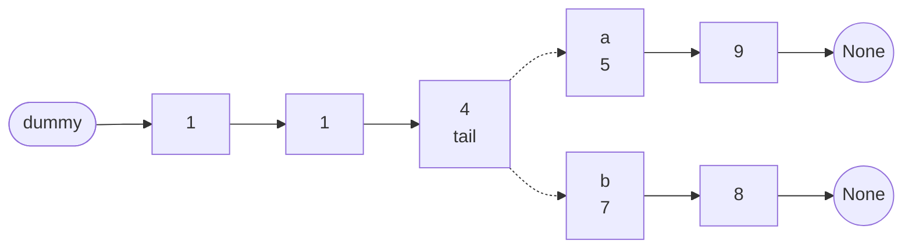
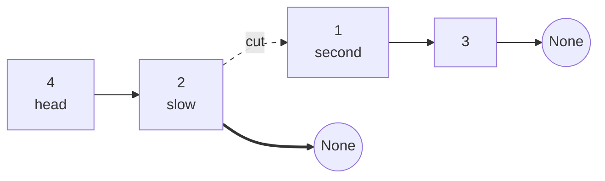
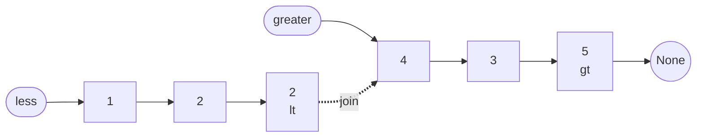

# Merge And Split

**Merging** two linked lists means ending up with a single list that holds the
nodes of both. **Splitting** one list means ending up with two lists that
between them hold its nodes. Neither operation copies a value and neither
allocates a node, because every node the answer needs already exists, and the
only thing being changed is which node follows which

That is possible because of *where* a list keeps its order. An array keeps order
in the positions themselves, so the element after `a[3]` is `a[4]` and nothing
you write can change that. A linked list keeps order entirely in the `next`
references, so you can put any node after any other node by writing one line.
Merging two sorted arrays needs a third array to write the answer into, since
there is no way to declare that `a[3]` is followed by `b[0]`. Merging two sorted
lists needs no extra room at all, because declaring exactly that is the only
thing a list ever does

Picture the nodes as train cars and each `next` as the coupling between two of
them. Rearranging the train means uncoupling and recoupling, and no cargo is
ever unloaded and reloaded. That leaves exactly two moves, and this whole topic
is built out of them

- A **splice** attaches an existing node, or an entire run of nodes, onto the end
  of a chain you are building. It is one assignment, `tail.next = node`, and it
  costs the same whether the run behind `node` holds one element or a million,
  since none of them move
- A **cut** ends a chain early by writing `node.next = None`. It is the only way
  to make a list stop, because a list ends exactly where a `None` is, and the
  nodes after the cut are still perfectly intact as a separate list

> This topic covers the two-cursor merge, cutting a list in half without counting
> it, splitting by a rule rather than by position, digit arithmetic across two
> lists, and merging `k` lists at once

## When The Answer Is Built Out Of Two Chains

Everything in [linked list basics](01_linked_list_basics.md) edits one list in
place. The signal here is that the problem is holding **two** chains at some
point, either because it handed you two or because you are about to make two

- Two heads arrive as arguments and both lists are sorted, which is the plain
  merge
- The problem says sort the list, so you have to manufacture the two chains
  yourself by splitting, sort each, and merge them back
- Nodes have to be regrouped while keeping their **relative order**, as in "every
  node below `x` before every node at or above `x`". Two chains built in one pass
  and joined at the end does this without comparing anything twice
- Two lists represent numbers and you have to add them, which walks both cursors
  forward together and carries a digit
- There are `k` lists rather than two, which is the same merge applied repeatedly
  in the right order

The negative signal is worth as much. If you only ever hold one chain and are
unlinking nodes out of it, that is the dummy-head walk from basics. If you need a
position measured from the end, that is
[fast and slow pointers](02_fast_slow.md). If the problem asks you to reorder
nodes backwards, you need [reversal](03_reversal.md) first, because a merge only
ever moves forward

## Why Inserting One List Into The Other Dies

The obvious way to merge sorted `A` and `B` is to keep `A` as the answer and drop
each node of `B` into its sorted place. It reads like the array version, and it
is correct

The cost is where it falls apart. Inserting a node into `A` requires the node
*before* the insertion point, and a list has no way to jump there, so you walk
from `A`'s head to find it. That is `O(n)` per node of `B`, so two lists of a
thousand nodes each cost up to a million pointer hops to produce an answer that
is only two thousand nodes long

Look at what the walking is actually re-deriving. `B` is sorted, so its second
node belongs at or after the place its first node went, and its third belongs at
or after that. **The insertion point only ever moves forward.** Restarting from
`A`'s head throws away everything the previous insertion already learned

So keep a cursor on each list, compare only the two nodes the cursors name, and
advance whichever one you consumed. Neither cursor ever goes backwards, so the
whole merge is a single pass over both lists

One thing is still missing, which is somewhere to attach the first node. That is
what the [dummy head](01_linked_list_basics.md) is for, and here it does its
second job: it anchors a list you are *building*, so "is this the first output
node?" never becomes a case

## Weaving Two Sorted Lists

The output chain grows from a dummy, and `tail` always names its last node. At
every step exactly two nodes are candidates, and the smaller one wins



The dotted edges are the decision. Only 5 and 7 are ever compared, because every
other node in `a`'s list is at least 5 and every other node in `b`'s list is at
least 7, so nothing behind either cursor can be the next smallest

```python
from __future__ import annotations


class ListNode:
    def __init__(self, val: int = 0, next: ListNode | None = None) -> None:
        self.val = val
        self.next = next


# build and to_list are test helpers for the asserts in this note, not part of
# any solution, and later blocks reuse them rather than redefining them
def build(vals: list[int]) -> ListNode | None:
    head = None
    for val in reversed(vals):
        head = ListNode(val, head)
    return head


def to_list(head: ListNode | None) -> list[int]:
    out = []
    while head:
        out.append(head.val)
        head = head.next
    return out


def merge_two_lists(a: ListNode | None, b: ListNode | None) -> ListNode | None:
    dummy = ListNode()
    tail = dummy
    while a and b:
        if a.val <= b.val:
            tail.next = a
            a = a.next
        else:
            tail.next = b
            b = b.next
        tail = tail.next
    tail.next = a if a else b
    return dummy.next


assert to_list(merge_two_lists(build([1, 2, 4]), build([1, 3, 4]))) == [1, 1, 2, 3, 4, 4]
assert to_list(merge_two_lists(build([1, 5, 9]), build([1, 4]))) == [1, 1, 4, 5, 9]
assert to_list(merge_two_lists(build([]), build([0]))) == [0]
assert merge_two_lists(None, None) is None
```

**The four lines that decide whether this is right**:

- `while a and b` runs only while there is a real comparison to make, since the
  moment one cursor is `None` there is nothing to choose between
- `tail.next = a` splices the **existing** node rather than building a new one
  with `ListNode(a.val)`. Both give the correct values, and the copying version
  allocates `n + m` nodes for no reason, which is the first thing an interviewer
  will ask you to remove
- `tail.next = a if a else b` finishes the entire remainder with **one link**.
  Whatever is left is already a sorted chain ending in `None`, so appending its
  head appends all of it
  - Writing a second `while` loop here to walk the remainder node by node is the
    tell that you are still thinking in arrays, where the leftovers really do
    have to be copied one at a time
  - It also covers both empty cases, because if `a` is `None` the expression
    yields `b`, and if both are `None` it yields `None`
- `a.val <= b.val` rather than `<` keeps the merge **stable**, meaning that when
  two nodes tie, the one from `a` comes out first. Ties matter as soon as nodes
  carry anything besides the value being compared, and stability is free here, so
  there is no reason to give it up

Nothing is allocated except the single dummy, so this runs in `O(1)` extra space

## Dry Run: Merging 1->5->9 With 1->4

```text
  a=1  b=1    take a=1   leave b=1    output so far [1]
  a=5  b=1    take b=1   leave a=5    output so far [1, 1]
  a=5  b=4    take b=4   leave a=5    output so far [1, 1, 4]
  a=5  b=None one list is empty, attach the rest [5, 9] with a single link
  result [1, 1, 4, 5, 9]
```

The first line is the tie, and it is the only step where the choice was not
forced. Both cursors named a 1, `<=` sent the one from `a`, and the 1 in `b` was
left where it stood. Swap `<=` for `<` and the two 1s come out in the other
order, which is still sorted and is still a different answer

The middle two lines are the same rejection twice. `a` stayed on 5 across both,
because a cursor only advances when its own node was consumed. A version that
advances both cursors every iteration drops nodes silently, and the output comes
back short rather than out of order, which is a much harder bug to see

The last line is the remainder. Two nodes were still waiting in `a`, and they
joined the output in one assignment. That step does no comparisons at all,
because the merge already knows everything left is larger than everything placed

## Cutting A List In Half Without Counting It

To split a list you need two things: the node where the second half begins, and
the node just before it, since only that node can be cut

[Fast and slow pointers](02_fast_slow.md) find the midpoint in one pass, and the
one adjustment here is where `fast` starts. Starting it at `head.next` gives it a
one-node head start, which lands `slow` on the **last node of the first half**
rather than on the first node of the second

```python
def split_in_half(head: ListNode) -> tuple[ListNode, ListNode | None]:
    slow, fast = head, head.next
    while fast and fast.next:
        slow = slow.next
        fast = fast.next.next
    second = slow.next
    slow.next = None
    return head, second


first, second = split_in_half(build([1, 2]))
assert (to_list(first), to_list(second)) == ([1], [2])
first, second = split_in_half(build([1, 2, 3]))
assert (to_list(first), to_list(second)) == ([1, 2], [3])
first, second = split_in_half(build([1, 2, 3, 4]))
assert (to_list(first), to_list(second)) == ([1, 2], [3, 4])
first, second = split_in_half(build([1, 2, 3, 4, 5]))
assert (to_list(first), to_list(second)) == ([1, 2, 3], [4, 5])
```



**Why the cut is the whole function**:

- `second = slow.next` has to be read **before** `slow.next` is overwritten,
  which is the pointer-order rule from basics applied to a splice instead of a
  reversal
- `slow.next = None` is what actually makes two lists. Skip it and `second` is a
  correct second half while `head` is still the *entire original list*, since
  nothing told it to stop
  - The two halves then overlap, so any recursion on them never shrinks. Running
    merge sort with that line removed raises `RecursionError` rather than
    returning a wrong answer, which at least fails loudly
- `head.next` is read before the loop, so the caller must guarantee at least two
  nodes. Every caller already does, because a list of length 0 or 1 is the base
  case that returns immediately

Here is what the head start buys, on lengths 2 through 5

```text
[1, 2]           -> [1]        [2]
[1, 2, 3]        -> [1, 2]     [3]
[1, 2, 3, 4]     -> [1, 2]     [3, 4]
[1, 2, 3, 4, 5]  -> [1, 2, 3]  [4, 5]
```

The length-2 row is the one that matters, because it is the smallest input the
function ever sees. It splits into two lists of one, both of which are base
cases. Start `fast` at `head` instead and `slow` advances all the way to the
second node, so `slow.next` is already `None` and the split is `[1, 2]` and
`[]`. The recursion hands back the same list it was given, and the sort loops
forever

## Splitting By A Rule Instead Of By Position

Some problems split on a predicate rather than a midpoint. Partitioning around a
value `x` means every node below `x` has to come before every node at or above
`x`, with the original relative order preserved inside each group

Building the answer in place is painful, because moving one node means unlinking
it from the middle and inserting it elsewhere while your cursor is still standing
in the middle. Building **two** chains instead makes it a single forward pass:
each node is appended to whichever chain it belongs to, and the two chains are
joined at the end

```python
def partition(head: ListNode | None, x: int) -> ListNode | None:
    less, greater = ListNode(), ListNode()
    lt, gt = less, greater
    while head:
        if head.val < x:
            lt.next = head
            lt = lt.next
        else:
            gt.next = head
            gt = gt.next
        head = head.next
    gt.next = None
    lt.next = greater.next
    return less.next


assert to_list(partition(build([1, 4, 3, 2, 5, 2]), 3)) == [1, 2, 2, 4, 3, 5]
assert to_list(partition(build([2, 1]), 2)) == [1, 2]
assert to_list(partition(build([1, 2]), 3)) == [1, 2]
assert partition(None, 0) is None
```



**Three things hold this together**:

- Two dummies and two tails, which is the merge's build loop run twice at once.
  Each chain gets nodes appended in the order they are met, so relative order
  survives with no sorting and no comparison between nodes
- `head = head.next` reads from the original list and stays correct all the way
  through, because appending rewrote a *tail's* `next` rather than the pointer
  stored inside `head` itself
- The damage only shows up at the end. Each chain's tail still carries the `next`
  it had in the original list, and that points at a node which has since been
  appended to the other chain
  - `lt.next = greater.next` happens to overwrite one of those two stale
    pointers, which is why the bug is easy to miss
  - `gt.next = None` is the other one, and it is the line people leave out, since
    nothing in the code looks like it is missing

Removing that one line on `[1, 4, 3, 2, 5, 2]` with `x = 3` produces
`1, 2, 2, 4, 3, 5` and then returns to the 2 again, forever. The first six values
are correct, which is exactly why the bug survives a quick eyeball and hangs the
grader

## Dry Run: Partitioning Around 3

`[1, 4, 3, 2, 5, 2]` with `x = 3`

```text
  node 1  -> less      less=[1]        greater=[]
  node 4  -> greater   less=[1]        greater=[4]
  node 3  -> greater   less=[1]        greater=[4, 3]
  node 2  -> less      less=[1, 2]     greater=[4, 3]
  node 5  -> greater   less=[1, 2]     greater=[4, 3, 5]
  node 2  -> less      less=[1, 2, 2]  greater=[4, 3, 5]
  cut greater's tail, join less -> greater: [1, 2, 2, 4, 3, 5]
```

The `node 3` line is the rejected one, and it is the reason the comparison is
`<` and not `<=`. The value equals `x`, so it belongs with the greater group, and
a solution written with `<=` moves it into the first group and returns an answer
that fails on this exact input

The `greater` chain ends as `4, 3, 5`, which is not sorted and is not supposed to
be. Partitioning only promises the split, and nodes keep the order they had, so
4 stays ahead of 3 because it did in the input

## Adding Two Numbers Digit By Digit

When two lists represent numbers with the least significant digit first, addition
is one walk down both lists carrying a digit. This is the one place in the topic
where you **do** allocate nodes, because the output digits are sums that exist in
neither input, so there is nothing to splice

```python
def add_two_numbers(l1: ListNode | None, l2: ListNode | None) -> ListNode | None:
    dummy = ListNode()
    tail = dummy
    carry = 0
    while l1 or l2 or carry:
        total = carry
        if l1:
            total += l1.val
            l1 = l1.next
        if l2:
            total += l2.val
            l2 = l2.next
        carry, digit = divmod(total, 10)
        tail.next = ListNode(digit)
        tail = tail.next
    return dummy.next


assert to_list(add_two_numbers(build([2, 4, 3]), build([5, 6, 4]))) == [7, 0, 8]
assert to_list(add_two_numbers(build([0]), build([0]))) == [0]
carried = add_two_numbers(build([9, 9, 9, 9, 9, 9, 9]), build([9, 9, 9, 9]))
assert to_list(carried) == [8, 9, 9, 9, 0, 0, 0, 1]
assert add_two_numbers(None, None) is None
```

**The loop condition is the whole problem**:

- `while l1 or l2 or carry` is `or`, not `and`, because the lists can have
  different lengths and the shorter one simply contributes nothing once it runs
  out. Using `and` truncates the answer to the shorter number
- The third clause, `or carry`, is the case people forget. Adding `999 + 1` leaves
  a carry after both lists are exhausted, and without that clause the answer comes
  back as `[0, 0, 0]` instead of `[0, 0, 0, 1]`
- `divmod(total, 10)` splits the sum into the carry and the digit in one call, and
  `total` can never exceed 19, so the carry is always 0 or 1

The follow-up reverses the digit order, putting the **most significant digit
first**, which breaks the walk because addition has to start from the least
significant end and a singly linked list cannot be read backwards. Two ways out,
and both are worth naming out loud

The first is to [reverse](03_reversal.md) both inputs, run the code above, and
reverse the answer. That works and mutates the inputs, which is sometimes
disallowed

The second pushes both lists onto stacks, which reverses them without touching a
single `next` pointer. The digits then come out least significant first, and each
new digit is **prepended** to the answer rather than appended

```python
def add_two_numbers_ii(l1: ListNode | None, l2: ListNode | None) -> ListNode | None:
    s1: list[int] = []
    s2: list[int] = []
    while l1:
        s1.append(l1.val)
        l1 = l1.next
    while l2:
        s2.append(l2.val)
        l2 = l2.next
    head: ListNode | None = None
    carry = 0
    while s1 or s2 or carry:
        total = carry
        if s1:
            total += s1.pop()
        if s2:
            total += s2.pop()
        carry, digit = divmod(total, 10)
        head = ListNode(digit, head)
    return head


msd = add_two_numbers_ii(build([7, 2, 4, 3]), build([5, 6, 4]))
assert to_list(msd) == [7, 8, 0, 7]
assert to_list(add_two_numbers_ii(build([2, 4, 3]), build([5, 6, 4]))) == [8, 0, 7]
assert to_list(add_two_numbers_ii(build([0]), build([0]))) == [0]
assert add_two_numbers_ii(None, None) is None
```

`head = ListNode(digit, head)` is the line to look at, and it is the one time in
this topic the dummy-and-tail pattern is the wrong tool. Digits are computed
from least significant to most, and the answer needs them in the opposite order,
so each new node goes on the **front**. The head moves on every iteration, there
is no tail to track, and the reversal happens for free as a side effect of how
the list is built

## Merging k Lists At Once

With `k` sorted lists instead of two, the first instinct is to merge them into an
accumulator one at a time. That is correct and quietly quadratic in `k`. If each
list holds `n` nodes, the accumulator is `n` long for the second merge, `2n` for
the third, and `(k - 1)n` for the last, so the total work is
`n(2 + 3 + ... + k)`, which is `O(Nk)` where `N = kn` is the total node count.
The first list's nodes get walked over `k - 1` separate times

Pairing the lists up fixes it. Merge list 0 with list 1, list 2 with list 3, and
so on, which halves how many lists are left. Repeat until one remains

```python
def merge_k_lists(lists: list[ListNode | None]) -> ListNode | None:
    if not lists:
        return None
    while len(lists) > 1:
        merged = []
        for i in range(0, len(lists), 2):
            a = lists[i]
            b = lists[i + 1] if i + 1 < len(lists) else None
            merged.append(merge_two_lists(a, b))
        lists = merged
    return lists[0]


three = merge_k_lists([build([1, 4, 5]), build([1, 3, 4]), build([2, 6])])
assert to_list(three) == [1, 1, 2, 3, 4, 4, 5, 6]
assert to_list(merge_k_lists([build([2]), build([]), build([1])])) == [1, 2]
assert merge_k_lists([]) is None
assert merge_k_lists([build([])]) is None
```

Each round touches every node exactly once, since the pairs are disjoint, so a
round costs `O(N)`. The number of lists halves each round, so there are
`log k` rounds, giving `O(N log k)`. Nothing new is written, and the odd list out
when `len(lists)` is odd merges against `None`, which the merge already handles

The rival approach keeps one candidate per list in a **min-heap**, pops the
smallest, and pushes that node's successor. It is the same `O(N log k)`, since
every node is pushed and popped once at `O(log k)` per operation on a heap of at
most `k` entries

```python
import heapq


def merge_k_lists_heap(lists: list[ListNode | None]) -> ListNode | None:
    heap: list[tuple[int, int, ListNode]] = []
    for i, node in enumerate(lists):
        if node:
            heapq.heappush(heap, (node.val, i, node))
    dummy = ListNode()
    tail = dummy
    while heap:
        _, i, node = heapq.heappop(heap)
        tail.next = node
        tail = node
        if node.next:
            heapq.heappush(heap, (node.next.val, i, node.next))
    return dummy.next


three = merge_k_lists_heap([build([1, 4, 5]), build([1, 3, 4]), build([2, 6])])
assert to_list(three) == [1, 1, 2, 3, 4, 4, 5, 6]
assert to_list(merge_k_lists_heap([build([1]), build([1]), build([1])])) == [1, 1, 1]
assert merge_k_lists_heap([]) is None
assert merge_k_lists_heap([build([])]) is None
```

The middle element of the tuple is not decoration. When two nodes hold equal
values, `heapq` falls through to comparing the next tuple element, and comparing
two `ListNode` objects raises
`TypeError: '<' not supported between instances of 'ListNode' and 'ListNode'`.
The list index breaks every tie before a node is ever compared

This is the one build loop in the topic that needs **no closing cut**, which is
worth being able to justify, since the partition needed one. Whenever a popped
node has a successor, that successor is pushed, so the heap is non-empty and the
loop runs again. The loop can only end on a node whose `next` is already `None`,
which means the output chain terminates on its own

Given the choice, the pairwise version needs no extra structure and no tiebreaker
trick, which makes it the easier one to get right on a whiteboard. Say both, then
pick

## Splicing A Range Out By Index

Replacing nodes `a` through `b` of one list with another list is two assignments
once you hold the right two nodes. You need `before`, the node at index `a - 1`,
and `after`, the node at index `b + 1`

```python
def merge_in_between(list1: ListNode, a: int, b: int, list2: ListNode) -> ListNode:
    before = list1
    for _ in range(a - 1):
        before = before.next
    after = before
    for _ in range(b - a + 2):
        after = after.next
    tail = list2
    while tail.next:
        tail = tail.next
    before.next = list2
    tail.next = after
    return list1


spliced = merge_in_between(build([0, 1, 2, 3, 4, 5]), 3, 4, build([100, 101, 102]))
assert to_list(spliced) == [0, 1, 2, 100, 101, 102, 5]
assert to_list(merge_in_between(build([0, 1, 2]), 1, 1, build([9]))) == [0, 9, 2]
```

Counting `after` from `before` rather than from the head avoids a second walk
from the front. `before` sits at index `a - 1`, and `after` sits at `b + 1`, so
the gap between them is `b + 1 - (a - 1)`, which is `b - a + 2` steps

The removed nodes are never touched. Once `before.next` points at `list2`,
nothing in the list points at node `a` any more, so the whole run from `a` to `b`
is unreachable and gone, exactly as an unlink works in basics. There is no
deletion step to write

## Worked Example: [Sort List](https://leetcode.com/problems/sort-list/)

Sort a linked list into ascending order, in `O(n log n)` time, and the follow-up
asks for constant extra space

**Input**: `head`, a `ListNode | None`, the head of a singly linked list holding
between 0 and `5 * 10^4` nodes, where each `val` is an `int` between `-10^5` and
`10^5`. An empty list arrives as `None` rather than as a node, so the empty case
is a real input and not a hypothetical

**Output**: a `ListNode | None`, the head of a list containing **the same nodes**
relinked into ascending order by `val`, and `None` when the input was `None`. The
answer is the original nodes with rewritten `next` references, not fresh nodes
carrying copied values, which is what makes the constant-space follow-up
reachable at all

**Recognizing it**: the constraint tells you which sort, because most sorting
algorithms need something a list cannot give. Quicksort partitions around an
index and needs to swap elements at arbitrary positions. Heapsort needs to reach
the child of position `i`, which is arithmetic on an index. Both of those want
random access, and reaching index `i` in a list is `O(i)`

Merge sort is the one that only ever walks forward, and you already have both of
its halves. Splitting is free because a list can be cut anywhere in `O(1)` once
you hold the node, and merging is the two-cursor weave

Therefore,

1. Return `head` unchanged when it is `None` or when `head.next` is `None`,
   because a list of zero or one node is already in ascending order. This is both
   the answer for those inputs and the only thing that stops the recursion, since
   every other branch splits and recurses
2. Split the list into two halves with `split_in_half`, which starts `fast` at
   `head.next` so that `slow` finishes on the **last node of the first half**, and
   then writes `slow.next = None` to actually sever the two chains. Without that
   cut the first half is still the whole original list, the halves overlap, and
   the recursion never shrinks
3. Call `sort_list` on the first half. It needs to know nothing about the second
   half, because the cut already made it an independent list that ends in `None`
4. Call `sort_list` on the second half the same way. These two calls are the only
   place any work is delegated, and each hands back a fully sorted chain
5. Merge the two sorted halves with `merge_two_lists`, which puts a cursor on each
   returned head, splices the smaller node onto `tail`, and attaches whatever
   remains with one link once either cursor runs out. Nothing is allocated here,
   which is where the list beats the array
6. Return the merged head, which is the sorted list at this level and becomes one
   of the two sorted halves for the caller one level up

```python
def sort_list(head: ListNode | None) -> ListNode | None:
    if not head or not head.next:
        return head
    first, second = split_in_half(head)
    return merge_two_lists(sort_list(first), sort_list(second))


assert to_list(sort_list(build([4, 2, 1, 3]))) == [1, 2, 3, 4]
assert to_list(sort_list(build([-1, 5, 3, 4, 0]))) == [-1, 0, 3, 4, 5]
assert to_list(sort_list(build([1]))) == [1]
assert sort_list(None) is None
```

```text
sort [4, 2, 1, 3]
  split into [4, 2] and [1, 3]
  sort [4, 2]
    split into [4] and [2]
    sort [4] -> base case, returned as is
    sort [2] -> base case, returned as is
    merge -> [2, 4]
  sort [1, 3]
    split into [1] and [3]
    sort [1] -> base case, returned as is
    sort [3] -> base case, returned as is
    merge -> [1, 3]
  merge -> [1, 2, 3, 4]
```

The base case is doing real work here even though it looks like a guard. A
one-node list is already sorted, and a zero-node list is too, so both are
returned untouched. That is also the only thing stopping the recursion, since
`split_in_half` reads `head.next` and would fail on a single node

**The insight**: merge sort on an **array** costs `O(n)` auxiliary space, because
merging two sorted subarrays needs a scratch buffer to write into. There is
nowhere else to put the interleaved result when the two halves sit in fixed
adjacent slots. Merging two **lists** needs nothing, because relinking makes room

So the structure that is worse at almost everything is better at this one thing.
Say that out loud, because it is the actual answer to "why merge sort here"

The time is `O(n log n)`, because splitting halves the list each time so there are
`log n` levels, and every level merges all `n` nodes exactly once at `O(1)` per
node. The only space this version uses is the recursion stack, which is
`O(log n)` deep because it holds one frame per level and nothing inside the
merge allocates. If the interviewer wants literal `O(1)`, the
move is **bottom-up** merge sort: merge runs of width 1, then width 2, then 4,
doubling until the width covers the list. Same comparisons, same `O(n log n)`, no
recursion, at the cost of bookkeeping to cut and rejoin the runs by hand

## Time and Space Complexity

`n` and `m` are the lengths of two lists being merged, `k` is the number of lists
in the k-way problem, and `N` is the total node count across all `k` of them

**Merging two sorted lists**

| Approach                                   | Time                                                                                                         | Space                                                                                                        |
| ------------------------------------------ | ------------------------------------------------------------------------------------------------------------ | ------------------------------------------------------------------------------------------------------------ |
| Two cursors, splice existing nodes         | `O(n + m)`: every node is compared at most once and then linked once, and the remainder attaches in one step | `O(1)`: one dummy and one `tail`, regardless of how long either list is                                      |
| Two cursors, allocate a new node per value | `O(n + m)`: the same walk, so time is not what rules it out                                                  | `O(n + m)`: a fresh node per value, and it fails the follow-up asking you to reuse the nodes you were handed |
| Insert each node of `B` into `A`           | `O(n · m)`: each insertion walks `A` from the head to find the predecessor, redoing the scan every time      | `O(1)`: the walking itself allocates nothing, which is why the cost hides in the time column alone           |

**Splitting one list**

| Approach                                 | Time                                                                                             | Space                                                                               |
| ---------------------------------------- | ------------------------------------------------------------------------------------------------ | ----------------------------------------------------------------------------------- |
| Fast and slow, then cut                  | `O(n)`: `fast` covers the list once while `slow` covers half, and the cut is a single assignment | `O(1)`: two pointers, and no node is created or copied                              |
| Count the length, then walk `n // 2`     | `O(n)`: two passes instead of one, same class with a bigger constant                             | `O(1)`: one integer and one pointer                                                 |
| Partition by a predicate into two chains | `O(n)`: one pass, each node appended to one of the two tails in `O(1)`                           | `O(1)`: two dummies and two tails, and every node in the output is an original node |

**Sorting one list**

| Approach                                | Time                                                                                        | Space                                                                                                             |
| --------------------------------------- | ------------------------------------------------------------------------------------------- | ----------------------------------------------------------------------------------------------------------------- |
| Merge sort by split and merge           | `O(n log n)`: `log n` levels of splitting, and every level merges all `n` nodes once        | `O(log n)`: the recursion stack is one frame per level, since merging itself allocates nothing                    |
| Bottom-up merge sort                    | `O(n log n)`: the same `log n` passes of width 1, 2, 4, and so on, each touching every node | `O(1)`: the run widths are tracked with integers instead of stack frames, which is the true constant-space answer |
| Copy values to a list, sort, write back | `O(n log n)`: Python's sort dominates the two `O(n)` passes                                 | `O(n)`: the value array holds every element, which is the space the follow-up is asking you to eliminate          |

**Merging k sorted lists**

| Approach                             | Time                                                                                                                 | Space                                                                                                 |
| ------------------------------------ | -------------------------------------------------------------------------------------------------------------------- | ----------------------------------------------------------------------------------------------------- |
| Pairwise merging, halving each round | `O(N log k)`: `log k` rounds, and each round's merges are disjoint so together they touch all `N` nodes once         | `O(k)`: the round's list of heads holds at most `k / 2` entries, and no node is ever copied           |
| Min-heap of one candidate per list   | `O(N log k)`: every node is pushed and popped once, at `O(log k)` each on a heap holding at most `k` entries         | `O(k)`: the heap never exceeds one entry per list, independent of how long the lists are              |
| Accumulate one list at a time        | `O(N k)`: the growing accumulator is re-walked on every merge, so the first list's nodes are traversed `k - 1` times | `O(1)`: the merge itself is in place, so a correct-looking solution that times out shows nothing here |

## Summary

- **Merging** produces one chain holding the nodes of two, and **splitting**
  produces two chains holding the nodes of one. Both are done entirely by
  rewriting `next` references, so no value is ever copied and no node is ever
  created
  - The two moves are the **splice**, `tail.next = node`, which attaches an
    existing node or an entire run onto the end of a chain you are building, and
    the **cut**, `node.next = None`, which is the only thing that makes a chain
    stop
- A problem wants this technique when it is holding **two chains** at some point,
  which happens either because two sorted heads arrived as arguments or because
  you have to manufacture the second chain yourself
  - "Sort this list" is the same signal in disguise, since sorting means
    splitting the list, sorting each half, and merging them back
  - So is "regroup these nodes while keeping their relative order", since two
    chains built in one pass and joined at the end does that with no comparison
    between nodes and no sorting
- Merging by dropping each node of `B` into its sorted place inside `A` is
  correct and costs `O(n · m)`, because a list cannot jump to the node before an
  insertion point, so every single insertion rewalks `A` from the head
  - What that rewalking throws away is that `B` is sorted, so the insertion point
    only ever moves forward and never needs to be searched for again
- The merge itself is one cursor per input list. Compare only the two nodes the
  cursors name, splice the winner onto `tail`, and advance **only** the cursor
  whose node you just consumed, since a cursor that advances on a step it did not
  win silently drops a node
  - Once one cursor hits `None`, attach the entire remainder with the single link
    `tail.next = a if a else b`, because whatever is left is already a sorted
    chain that ends in `None`
  - The **dummy head** does its second job here. In basics it anchored a list you
    were editing, and here it anchors a list you are *building*, so "is this the
    first output node?" never becomes a case and the answer is `dummy.next`
- Which way a tie goes is a real decision rather than a detail. Writing
  `a.val <= b.val` keeps a merge **stable**, meaning that when two nodes tie the
  one from the first list comes out first, while partitioning around `x` needs a
  strict `<` so that a value equal to `x` lands in the greater group
- Splice the nodes you were handed instead of allocating a fresh
  `ListNode(a.val)` for each value, since both produce the right values but the
  copying version allocates `n + m` nodes for nothing
  - Digit addition is the one genuine exception in this topic, because a sum
    digit exists in neither input list, so there is no node available to splice
    and one has to be built
- Splitting in half is [fast and slow pointers](02_fast_slow.md) with `fast`
  started at `head.next` rather than `head`. That one-node head start lands
  `slow` on the **last node of the first half**, which is the only node that can
  perform the cut
  - The two-node list is the case to check, because it is the smallest input the
    recursion ever reaches. The head start splits it into `[1]` and `[2]`, both
    base cases, while starting `fast` at `head` gives `[1, 2]` and `[]` and the
    sort never terminates
- Merging `k` lists is done either by pairing them up and halving how many are
  left each round, or by keeping a **min-heap** holding one candidate node per
  list. Both are `O(N log k)`, and the pairwise version needs no extra structure,
  which makes it the easier one to get right on a whiteboard
  - Accumulating the lists one at a time into a growing answer is the version to
    reject out loud, because it rewalks the accumulator on every merge and costs
    `O(N k)`
  - A heap of nodes needs a tiebreaker such as the list index in the middle of
    the tuple, since `heapq` compares the next tuple element when two values tie,
    and comparing two `ListNode` objects raises `TypeError`
- Merging two lists is `O(n + m)` time, since every node is compared at most once
  and linked once, and `O(1)` extra space, since only the dummy and the `tail`
  pointer exist. Sorting one list by merge sort is `O(n log n)` time and
  `O(log n)` space rather than `O(1)`, because the recursion stack holds one
  frame per level of splitting. Merging `k` lists is `O(N log k)` time for `N`
  total nodes and `O(k)` space, by either method
  - **Bottom-up** merge sort, which merges runs of width 1, then 2, then 4, is
    the honest `O(1)` space answer, since it tracks the run width with an integer
    instead of with stack frames
  - Merge sort on an **array** costs `O(n)` auxiliary space because merging two
    adjacent subarrays needs a scratch buffer, and merging two lists costs
    nothing, which is the actual answer to "why merge sort here"
- The most common mistake involves forgetting a cut, and both versions of it fail
  loudly rather than returning a wrong value. A split missing `slow.next = None`
  leaves `head` naming the whole original list, so the halves overlap, the
  recursion never shrinks, and merge sort raises `RecursionError`. A partition
  missing `gt.next = None` leaves the greater chain's tail still pointing at a
  node that now lives in the less chain, which yields six correct values on
  `[1, 4, 3, 2, 5, 2]` and then loops forever
  - Neither one is visible in the first few outputs, which is exactly why
    eyeballing the start of the answer passes them both

## Interview Checklist

Before writing code, make sure you can answer each of these

```text
Am I splicing the nodes I was given, or quietly allocating new ones?
Do I have a dummy to anchor the output, and am I returning dummy.next?
Does every cursor advance only when its own node was consumed?
After the main loop, have I attached the remainder with one link rather than a loop?
Is the comparison <= or <, and can I say what changes if I flip it?
Where does every chain I build end, and did I write the None that ends it?
For a split: does slow stop on the last node of the first half, or one past it?
Does my split work on a two-node list, which is the smallest input recursion reaches?
For digit addition: does the loop keep going while a carry is still outstanding?
For k lists: am I halving the list count per round, or re-walking one accumulator?
For a heap of nodes: is there a tiebreaker before the node, so it is never compared?
What is my space, and is the recursion stack included in the number I just said?
```
