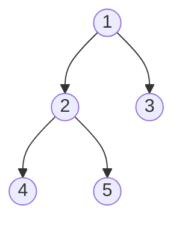
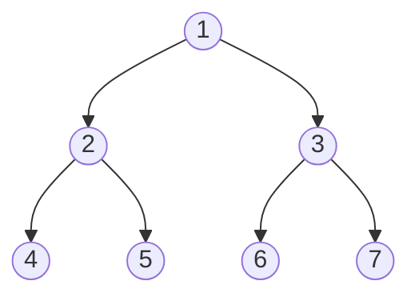
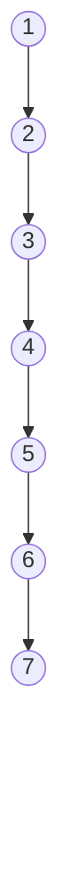

# Tree Fundamentals

A **tree** is a collection of **nodes** where each node holds a value and points
to some number of other nodes, called its **children**. A
[linked list](../../06_linked_lists/notes/01_linked_list_basics.md) node points
to exactly one successor, so following it produces a single line of nodes. Give a
node two successors instead of one and the line splits into two, then into four,
and what you get is a tree. That is the whole structural difference: a tree is a
linked list that is allowed to branch.

A **binary tree** is the version where every node has at most two children, named
the **left child** and the **right child**. Almost every tree problem in
interviews is about binary trees, and this module is written around them.

Five words carry most of the vocabulary, and all of them describe a position
rather than a kind of node:

- The **root** is the single node with no parent. It is where every walk starts,
  and it is the only handle you are given to the tree
- A **parent** is a node that points at another node, and that other node is its
  **child**. Every node except the root has exactly one parent, which is what
  makes the structure a tree rather than a general graph
- A **leaf** is a node with no children at all. In Python terms, both its `left`
  and its `right` are `None`
- An **edge** is one parent-to-child link. A tree with `n` nodes has exactly
  `n - 1` edges, because every node except the root is the far end of exactly one
  edge
- A **subtree** is any node together with everything hanging below it. The node
  `2` below, with `4` and `5` under it, is a subtree, and inside that subtree the
  node `2` is itself a root



That last point is the one to hold on to, because it is the reason tree code
looks the way it does. Node `1` is the root of a five-node tree, node `2` is the
root of a three-node tree, and node `4` is the root of a one-node tree. Nothing
about node `2` says "I am a child". Handed to a function on its own, it is
indistinguishable from the root of a whole tree, so a function that answers a
question about a tree can be handed a child and answer the same question about
that child's subtree.

## The Node Type You Are Handed

Interview problems hand you a class like this one, already defined, and hand your
function the root. This is the shared node type for the whole module, and later
topics use it without redefining it.

```python
from __future__ import annotations


class TreeNode:
    def __init__(
        self,
        val: int,
        left: TreeNode | None = None,
        right: TreeNode | None = None,
    ) -> None:
        self.val = val
        self.left = left
        self.right = right


root = TreeNode(1, TreeNode(2, TreeNode(4), TreeNode(5)), TreeNode(3))

assert root.val == 1
assert root.left.val == 2 and root.right.val == 3
assert root.left.left.val == 4
assert root.left.left.left is None
assert TreeNode(7).left is None and TreeNode(7).right is None
```

Two conventions come out of that block, and both matter more than they look.

**A missing child is `None`, not a special empty node.** `root.left.left.left is None`
is how you know `4` is a leaf, so every function you write has to survive being handed
`None`, since reaching for `node.left.val` at a leaf raises `AttributeError`.

**`None` is also how an empty tree arrives.** A problem that says "the tree may be
empty" is telling you your function will be called with `root = None`, which is
why almost every solution in this module opens with a check for it.

Sites like LeetCode print trees as level-order arrays such as `[1,2,3,4,5]`, with
`null` for a missing child. That is a display format for the problem statement.
The object your function receives is always the root `TreeNode`.

## Depth, Height, And Why Two Seven-Node Trees Are Not Alike

The number of nodes tells you almost nothing about how a tree behaves. These two
both hold seven nodes:





The first is three levels deep and the second is seven, and every cost in this
module is written in terms of that difference rather than in terms of `n`.

- The **depth** of a node is how many edges lie between the root and that node,
  so the root sits at depth `0` and its children sit at depth `1`. Depth is
  measured downward from the root
- The **height** of a node is the number of edges on the longest path from that
  node down to a leaf, so every leaf has height `0`. The **height of the tree**
  means the height of its root. Height is measured upward from the leaves
- A **level** is the set of all nodes at one depth, which is the unit
  [level-order traversal](03_bfs.md) works in

Watch the off-by-one when you say these out loud, because LeetCode's *Maximum
Depth of Binary Tree* asks for the number of **nodes** on the longest root-to-leaf
path, which is the height in edges plus one. A one-node tree has height `0` in
edges and maximum depth `1` in nodes. Neither convention is wrong, so state which
one you are using before you write the base case.

**The named shapes** describe how the nodes are spread across the levels, and
three of them appear directly in problem statements:

- A **perfect** tree has every level completely full, like the first diagram
  above. A perfect tree with `k` levels holds exactly `2**k - 1` nodes, because
  level `i` holds `2**i` nodes and those powers of two sum to one less than the
  next power
- A **complete** tree has every level full except possibly the last, and the last
  level is filled from the left with no gaps. Every perfect tree is complete
- A **balanced** tree is one where, at every node, the heights of the left and
  right subtrees differ by at most one. This is the exact definition *Balanced
  Binary Tree* asks you to check
- A **skewed** tree is the second diagram, where each node has at most one child.
  It is a linked list wearing a tree's type

Write `n` for the node count and `h` for the number of nodes on the longest
root-to-leaf path, which is the height in edges plus one and is exactly how many
levels deep a walk can go. Across the shapes above, `h` runs from about `log2 n`
when the tree is perfect, since `k` levels hold `2**k - 1` nodes and so `k` grows
logarithmically in `n`, up to `n` when the tree is skewed, since each node sits
alone on its own level. That spread is why tree bounds are quoted in `h`: a claim
of `O(log n)` only holds for the balanced case, and the interviewer will ask
about the skewed one.

## Why A Loop Down The Tree Only Ever Sees One Branch

The obvious way to attack a tree is the way you attack a linked list, by walking
a pointer in a loop until it falls off the end. To find the longest root-to-leaf
path, follow `left` and count:

```python
lopsided = TreeNode(1, TreeNode(2), TreeNode(3, TreeNode(6, TreeNode(7))))

node, depth = lopsided, 0
while node is not None:
    depth += 1
    node = node.left

assert depth == 2
```

The longest path in `lopsided` is `1, 3, 6, 7`, so the correct answer is `4` and
the loop reported `2`. It is not an off-by-one and no smarter starting condition fixes
it. The line `node = node.left` throws `node.right` away, permanently, and the
deep part of the tree was on the discarded side.

You cannot fix it by choosing the better child either, because at node `1` there
is no local information that says the right side runs deeper. Finding out
requires walking it, which is the very thing you would be committing not to do.

So the loop has to visit both children, which means that when it goes left it
must write down the right child somewhere and come back to it later. That
somewhere is a stack of pending nodes, one entry per branch you owe yourself.

The point is that you already have such a stack. Every function call in Python
suspends its caller, remembers exactly where it was, and resumes it when the call
returns, so calling the function on the left child and then on the right child
gives you the pending-branch stack for free. That is the entire reason tree code
is written recursively: **the call stack is the bookkeeping the loop was
missing**.

An explicit stack of your own is also possible, and
[iterative traversal](02_dfs.md) covers it, but it is the same algorithm with the
bookkeeping written out by hand.

## Deciding What One Node Returns

Recursion on a tree is not "think about the whole tree at once". It is the
opposite: write a function that answers the question for **one subtree**, assume
it already works on smaller subtrees, and combine.

Every function you write in this module has the same three-part skeleton, and the
only design work is filling in the three blanks.

```text
answer for an empty subtree     <- the base case
answer for the left subtree     <- a recursive call
answer for the right subtree    <- a recursive call
combine those two with node.val <- the return value
```

Before typing anything, finish this sentence: "`f(node)` returns \_\_\_\_ for the
subtree rooted at `node`." That sentence is the **return contract**, and it is
what makes the rest mechanical, because the base case and the combine step are
both consequences of it rather than separate decisions.

For maximum depth the contract is the number of nodes on the longest downward
path.

> "`max_depth(node)` returns the number of nodes on the longest path from `node`
> down to a leaf, and `0` for an empty subtree. So a node's answer is one for
> itself plus the deeper of its two children's answers."

```python
def max_depth(node: TreeNode | None) -> int:
    if node is None:
        return 0
    left = max_depth(node.left)
    right = max_depth(node.right)
    return 1 + max(left, right)


assert max_depth(root) == 3
assert max_depth(TreeNode(1)) == 1
assert max_depth(None) == 0
```

**Where each line comes from the contract**:

- `if node is None: return 0` is the contract read on an empty subtree, since an
  empty subtree has no nodes on any path
- The two recursive calls are made **before** anything is combined, so both
  answers are in hand when the node decides. A node cannot know its own depth
  until its children have reported, which is why this shape is described as
  recursing first and combining on the way back up
- `1 + max(left, right)` is "myself, plus the deeper side". The `1` is this node
  because the contract counts nodes, and it would be absent if the contract
  counted edges
- The return value goes **to the parent**, which is the only consumer. A recursive
  call whose result is not read is the classic non-working tree function, because
  the work happened and then vanished

## Matching The Base Case To What You Return

There is no universal tree base case. The right one falls out of the contract,
which is why the contract gets written first:

```text
max_depth      "nodes on the longest path"      empty -> 0
count nodes    "how many nodes are down here"   empty -> 0
same_tree      "are these two identical"        two empties -> True
search         "the node holding this value"    empty -> None
has path       "does a qualifying path exist"   empty -> False
```

The tempting alternative is to stop at leaves instead of at `None`, since a leaf
feels like the real bottom of the tree. It reads well and it passes on a tree
where every node has zero or two children:

```python
def max_depth_leaf_base(node: TreeNode) -> int:
    if node.left is None and node.right is None:
        return 1
    return 1 + max(max_depth_leaf_base(node.left), max_depth_leaf_base(node.right))


assert max_depth_leaf_base(TreeNode(1)) == 1
assert max_depth_leaf_base(root) == 3

one_child = TreeNode(1, TreeNode(2))
try:
    max_depth_leaf_base(one_child)
    crashed = False
except AttributeError:
    crashed = True

assert crashed is True
assert max_depth(one_child) == 2
```

A node with exactly one child is neither a leaf nor safe to recurse from. It
fails the leaf test, so the function recurses into both children, and one of them
is `None`, whose `.left` does not exist. Basing the recursion on `None` covers
leaves automatically, because a leaf is just a node whose two recursive calls both
hit the empty case, so it needs no test of its own.

Some problems genuinely need a leaf test on top of the `None` test, and
[root-to-leaf paths](04_path_problems.md) is where that appears. Even there the
`None` case comes first, and the leaf test is an extra branch rather than a
replacement.

## Dry Run: Maximum Depth On A Five-Node Tree

Running `max_depth` on the five-node tree from the first diagram, in the order
each call finishes. A call cannot finish until both of its children have
returned, so the leaves complete first and the root completes last.

```text
node 4: left=0 right=0 -> 1     both children are None, so the base case fires twice
node 5: left=0 right=0 -> 1
node 2: left=1 right=1 -> 2     max(1, 1) = 1, plus itself
node 3: left=0 right=0 -> 1
node 1: left=2 right=1 -> 3     max(2, 1) = 2, so the right answer is DISCARDED
```

The last line is the one to look at. Node `3` did real work and correctly
reported `1`, and the root threw that number away, because `max` keeps only the
deeper side. That is normal and it is what "combine" means here: a child's answer
is an input to a decision, not a partial result that gets accumulated.

Notice also that node `3` was fully explored before the root knew it was the
shallower branch. There is no way to skip it, which is why this function is `O(n)`
and not `O(h)`, and it is the concrete version of the point that no local
information at the root tells you which side runs deeper.

## Recursing Over Two Trees At Once

Several problems in the ladder compare two trees rather than measure one, and the
contract idea extends to them unchanged. The function just takes two nodes that
sit at the same position in their respective trees, and the contract becomes a
sentence about the pair.

```python
def same_tree(p: TreeNode | None, q: TreeNode | None) -> bool:
    if p is None or q is None:
        return p is q
    if p.val != q.val:
        return False
    return same_tree(p.left, q.left) and same_tree(p.right, q.right)


assert same_tree(TreeNode(1, TreeNode(2), TreeNode(3)), TreeNode(1, TreeNode(2), TreeNode(3))) is True
assert same_tree(TreeNode(1, TreeNode(2)), TreeNode(1, None, TreeNode(2))) is False
assert same_tree(TreeNode(1, TreeNode(2), TreeNode(1)), TreeNode(1, TreeNode(1), TreeNode(2))) is False
assert same_tree(None, None) is True
assert same_tree(TreeNode(1), None) is False
```

`return p is q` in the base case handles both empty situations in one line, since
two `None`s are the same object and so compare `True`, while one `None` against a
real node compares `False`. Writing it as `return True` there is the bug that makes
the second assert fail, because `[1,2]` and `[1,null,2]` hold the same values but
differ in shape, and shape is exactly what the mismatched `None` was reporting.

The recursive step pairs `p.left` with `q.left` and `p.right` with `q.right`,
which is what "same tree" means. Pair them crosswise instead, calling on
`p.left, q.right` and then `p.right, q.left`, and the same six lines answer
*Symmetric Tree* by comparing a tree against its own mirror.

## Worked Example: [Count Complete Tree Nodes](https://leetcode.com/problems/count-complete-tree-nodes/)

Count how many nodes a **complete** binary tree contains. Counting every node one
by one is four lines and obviously correct, so the problem is really asking you to
beat `O(n)` by exploiting completeness.

**Input**: `root`, a `TreeNode | None`, the root of a complete binary tree, so
every level is full except possibly the last, which fills from the left. The tree
may be empty, in which case `root` is `None`, and it may be large enough that an
`O(n)` walk, while accepted, is not the answer being asked for

**Output**: an `int`, the total number of nodes in the tree, which is `0` for an
empty tree

The phrase that identifies the technique is "complete binary tree", because
completeness is a promise about **shape**, and a promise about shape lets you
count nodes with arithmetic instead of with a traversal. The naive recursion,
`1 + count(left) + count(right)`, visits all `n` nodes and ignores that promise
entirely.

The lever is that a **perfect** subtree needs no counting at all: with `k` levels
it holds exactly `2**k - 1` nodes. Detecting perfection is cheap, because walking
only the left spine and only the right spine of a subtree gives two numbers, and
in a complete tree those two numbers are equal exactly when the subtree is
perfect. If the last level is short, the right spine bottoms out one level above
the left one.

> "I will walk the left spine and the right spine of each subtree. If they are the
> same length the subtree is perfect and I return `2**levels - 1` without touching
> it. Otherwise I recurse into both children, and because the tree is complete at
> most one of those children can be imperfect, so only one side keeps recursing."

Therefore,

1. Return `0` for an empty subtree, which is both the base case and the answer for
   an empty tree, so no separate top-level check is needed
2. Walk the left spine from this node, following `left` until you fall off, and
   count the nodes you passed. That is the number of levels on the leftmost path,
   and in a complete tree it is the full height, since the last level fills from
   the left
3. Walk the right spine the same way. In a complete tree this equals the left
   count when the bottom level is full, and is one smaller when it is not
4. If the two counts match, the subtree is perfect, so return `2**levels - 1` and
   stop. This is the step that saves the time, because an entire subtree is
   resolved without visiting any of it
5. Otherwise the bottom level is partly filled, so fall back to
   `1 + count(left) + count(right)`. The recursion is not wasteful here, because
   completeness guarantees the missing nodes are all on one side, so one of the two
   children is perfect and terminates immediately at step 4
6. The recursion therefore follows a single root-to-leaf path of imperfect
   subtrees, doing one pair of spine walks at each step

```python
def count_nodes(node: TreeNode | None) -> int:
    if node is None:
        return 0
    left_levels, walk = 0, node
    while walk is not None:
        left_levels += 1
        walk = walk.left
    right_levels, walk = 0, node
    while walk is not None:
        right_levels += 1
        walk = walk.right
    if left_levels == right_levels:
        return 2**left_levels - 1
    return 1 + count_nodes(node.left) + count_nodes(node.right)


complete = TreeNode(1, TreeNode(2, TreeNode(4), TreeNode(5)), TreeNode(3, TreeNode(6)))
perfect = TreeNode(1, TreeNode(2, TreeNode(4), TreeNode(5)), TreeNode(3, TreeNode(6), TreeNode(7)))

assert count_nodes(complete) == 6
assert count_nodes(perfect) == 7
assert count_nodes(TreeNode(1)) == 1
assert count_nodes(None) == 0
```

Tracing `complete`, which is `[1,2,3,4,5,6]`:

```text
count(1)  left spine 1,2,4 = 3   right spine 1,3 = 2   unequal -> recurse
count(2)  left spine 2,4   = 2   right spine 2,5 = 2   equal   -> 2**2 - 1 = 3
count(3)  left spine 3,6   = 2   right spine 3   = 1   unequal -> recurse
count(6)  left spine 6     = 1   right spine 6   = 1   equal   -> 2**1 - 1 = 1
count(None) -> 0
count(3) returns 1 + 1 + 0 = 2
count(1) returns 1 + 3 + 2 = 6
```

The `count(2)` line is the payoff. Nodes `4` and `5` were never visited, and the
recursion into that entire subtree was discarded in favour of one exponentiation.
On a large tree that skipped side is roughly half of everything.

The `count(3)` line shows the other half of the argument. Its right spine ran out
a level early, which is exactly the signal that the bottom level is incomplete
underneath it, so it had to recurse. Only one node per level ever ends up in that
position.

- **Time Complexity**: `O(log² n)`, because the recursion only continues into
  imperfect subtrees and there is at most one per level, giving `O(log n)` calls
  on a complete tree, and each call walks two spines of length `O(log n)`
- **Space Complexity**: `O(log n)` for the call stack, because the recursion
  descends one level per call and a complete tree with `n` nodes has about
  `log2 n` levels. The spine walks allocate nothing, since they move one pointer

## Time and Space Complexity

Throughout, `n` is the number of nodes and `h` is the height counted in nodes as
defined above, which is exactly how deep the recursion goes: about `log2 n` for a
balanced tree and `n` for a skewed one.

**Answering a question about one tree**

| Approach                                                      | Time                                                                        | Space                                                                                                             |
| ------------------------------------------------------------- | --------------------------------------------------------------------------- | ----------------------------------------------------------------------------------------------------------------- |
| Recursion returning one answer per subtree, as in `max_depth` | `O(n)`: every node is visited exactly once and does constant combining work | `O(h)`: one stack frame per node on the current root-to-leaf path, which is `O(log n)` balanced and `O(n)` skewed |
| Looping down a single branch                                  | `O(h)`: it touches one node per level                                       | `O(1)`: one pointer, no stack, and it is also wrong, because it never sees the branches it skipped                |

**Comparing two trees with `same_tree`**

| Approach         | Time                                                                                                                                                               | Space                                                                                                       |
| ---------------- | ------------------------------------------------------------------------------------------------------------------------------------------------------------------ | ----------------------------------------------------------------------------------------------------------- |
| Paired recursion | `O(min(n_p, n_q))`: where `n_p` and `n_q` are the two node counts, since the walk stops at the first value or shape mismatch and can never outrun the smaller tree | `O(min(h_p, h_q))`: the two walks descend in lockstep, so the stack is as deep as the shallower tree allows |

**Counting the nodes of a complete tree**

| Approach              | Time                                                                                          | Space                                                                                            |
| --------------------- | --------------------------------------------------------------------------------------------- | ------------------------------------------------------------------------------------------------ |
| Visit every node      | `O(n)`: the completeness promise is never used                                                | `O(log n)`: a complete tree's height is about `log2 n`, so the stack cannot get deeper than that |
| Spine-height shortcut | `O(log² n)`: `O(log n)` recursive calls, one per level, each doing two `O(log n)` spine walks | `O(log n)`: same stack depth, since the shortcut removes calls rather than levels                |

The `O(h)` stack is not only a complexity answer. Python's default recursion limit
is 1000 frames, so a skewed tree of 10,000 nodes raises `RecursionError` on code
that is otherwise correct. If a problem allows that shape, say so out loud and
offer the explicit-stack version as the fix.

## Summary

- A **binary tree** is a linked structure where each node holds a value and up to
  two children, `left` and `right`, and a missing child is `None`. It is a linked
  list that is allowed to branch, and every node is itself the root of a subtree,
  which is why one function can answer the same question about the whole tree and
  about any part of it
  - The **root** is the node with no parent, a **leaf** is a node with no
    children, and an **edge** is one parent-to-child link, so `n` nodes always
    have `n - 1` edges
- The **depth** of a node counts edges downward from the root, so the root has
  depth `0`, while the **height** of a node counts edges on its longest path down
  to a leaf, so a leaf has height `0`
  - LeetCode's *Maximum Depth of Binary Tree* wants the number of nodes on that
    longest path, which is one more than the height in edges, so name your
    convention before writing the base case
- Tree shapes have names that appear verbatim in problem statements. A **perfect**
  tree has every level full and holds `2**k - 1` nodes across `k` levels, a
  **complete** tree is full except for a last level that fills from the left, a
  **balanced** tree has left and right heights differing by at most one at every
  node, and a **skewed** tree is a chain
  - Height `h` therefore ranges from about `log2 n` to `n`, and that range is why
    tree costs are quoted in `h` rather than in `n`
- Walking a tree with a loop fails because `node = node.left` discards
  `node.right` forever, and no local test at a node reveals which side runs
  deeper. Recursion fixes it because the call stack remembers the branch you owe
  yourself, one frame per pending branch
- The technique for writing any tree function is to finish the sentence
  "`f(node)` returns \_\_\_\_ for the subtree rooted at `node`", then recurse on both
  children and combine their answers with `node.val`
  - The base case is the contract read on an empty subtree, so it is `0` for
    `max_depth`, `True` for `same_tree`, and `None` for a search. There is no
    single base case to memorize
  - The recursive call's return value must be read by the parent, since a
    recursive call whose result is dropped does its work and then throws it away
- Base the recursion on `None` rather than on leaves. A node with exactly one
  child is neither a leaf nor safe to recurse from, so a leaf-only base case
  raises `AttributeError` on `None.left`, and it passes every test tree in which
  each node has zero or two children
- A plain recursive tree walk is `O(n)` time, because it visits each node once,
  and `O(h)` space for the call stack, which is `O(log n)` on a balanced tree and
  `O(n)` on a skewed one
  - Python's default recursion limit is 1000 frames, so a skewed tree of 10,000
    nodes raises `RecursionError` even though the algorithm is correct
  - Shape promises can beat `O(n)`. *Count Complete Tree Nodes* runs in
    `O(log² n)` by returning `2**levels - 1` for any subtree whose left and right
    spines are equally long, which skips that subtree entirely

## Interview Checklist

Before writing code, make sure you can answer each of these

```text
Can I finish "f(node) returns ____ for the subtree rooted at node" in one sentence?
What does that contract say about an empty subtree, and is that my base case?
Is my base case on None rather than on a leaf, so a one-child node is safe?
Do I need both children's answers before deciding, or does state flow downward?
Am I reading the return value of every recursive call I make?
Am I counting nodes or edges for depth, and did I say which out loud?
What is the height h here: is a skewed tree allowed by the constraints?
Have I stated O(n) time and O(h) space, and what h becomes in the worst case?
Does the problem promise a shape (complete, balanced, BST) I can exploit?
Does my code survive root being None on the very first call?
```
