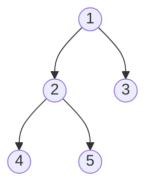
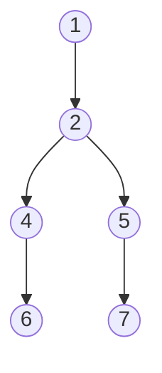
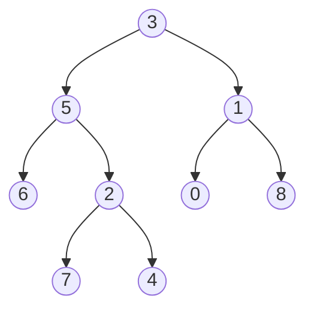

# Tree DFS

**Depth-first search (DFS)** is a way of visiting every node in a tree that
commits to one branch and follows it all the way down before it looks at the
branch next to it. From the root it walks into the left child, then that child's
left child, and keeps going until it hits an empty spot. Only then does it back
up one step and try the branch it skipped

The name says what it does. It goes *deep* first, in preference to going wide.
The other option, visiting everything one step from the root before anything two
steps away, is [breadth-first search](03_bfs.md), and it needs a queue

DFS needs a **stack**, because backing up means resuming the most recent node you
were not finished with, and the most recent unfinished item is exactly what a
[stack](../../03_stacks_and_queues/notes/01_stack.md) hands back. You almost never
write that stack out. Python's call stack already is one: each recursive call
pushes a frame, each `return` pops it, so recursion gives you DFS for free. That
is why nearly every tree solution in an interview is a small recursive helper

Picture running a pencil around the outside of a tree, starting at the root's
left shoulder and finishing back at its right shoulder without lifting the tip.
The pencil passes each node exactly three times: once on the way down into it,
once when it comes back up from the left child and turns toward the right one, and
once on the way out for good. Nothing about that walk changes between problems.
What changes is **which of the three passes is the one where you do the work**,
and that single choice is what the three traversal orders are

## Three Orders From One Walk

Take this tree, which is the one every example in this section uses:



The recursive walk always goes left subtree, then right subtree. Insert the
node's own visit before both calls, between them, or after both, and you get the
three named orders:

- **Preorder** is node, left, right. The node is handled *before* its subtrees,
  so a parent is always recorded before any of its descendants
- **Inorder** is left, node, right. The node is handled between its two subtrees
- **Postorder** is left, right, node. The node is handled *after* both subtrees,
  so every descendant is recorded before its parent

```python
class TreeNode:
    """The shared binary-tree node type from the fundamentals topic."""

    def __init__(
        self,
        val: int = 0,
        left: "TreeNode | None" = None,
        right: "TreeNode | None" = None,
    ) -> None:
        self.val = val
        self.left = left
        self.right = right


def preorder(node: TreeNode | None) -> list[int]:
    if node is None:
        return []
    return [node.val] + preorder(node.left) + preorder(node.right)


def inorder(node: TreeNode | None) -> list[int]:
    if node is None:
        return []
    return inorder(node.left) + [node.val] + inorder(node.right)


def postorder(node: TreeNode | None) -> list[int]:
    if node is None:
        return []
    return postorder(node.left) + postorder(node.right) + [node.val]


small = TreeNode(1, TreeNode(2, TreeNode(4), TreeNode(5)), TreeNode(3))

assert preorder(small) == [1, 2, 4, 5, 3]
assert inorder(small) == [4, 2, 5, 1, 3]
assert postorder(small) == [4, 5, 2, 3, 1]
assert preorder(None) == [] and inorder(None) == [] and postorder(None) == []
assert preorder(TreeNode(7)) == [7]
```

The three functions differ by where `[node.val]` sits, and nothing else. The list
concatenation here is for illustration, since building an output list this way
copies at every level and costs more than appending into one shared list, which
is what real solutions do

**Which order a problem wants** comes from when the node's own work is possible:

- Preorder when the node can be handled with no knowledge of its subtrees, which
  is the case for copying a tree, printing its structure, or serializing it. It
  is also the order in which a parent must be linked before its children, which
  is why *Flatten Binary Tree To Linked List* is preorder
- Postorder when the node's answer depends on answers from below, such as a
  height, a subtree sum, or whether a subtree should be deleted. *Binary Tree
  Pruning* is postorder, because you cannot decide whether to cut a node until
  you know whether either subtree still contains a `1`
- Inorder when the tree is a **binary search tree**, since a BST's inorder walk
  produces its values in sorted order, which the [BST topic](05_bst.md) proves and
  uses

Postorder is the workhorse. Most of the recursive-shape problems in this module
are postorder in disguise

## Why Asking Every Node For Its Height Separately Dies

The **diameter** of a binary tree is the number of edges on the longest path
between any two nodes, and that path does not have to pass through the root

Any such path has a highest point, the one node on it closest to the root. Below
that node the path runs straight down into the left subtree and straight down into
the right subtree, so its length in edges is exactly `height(left) + height(right)`,
where height counts the nodes on the longest downward chain. That gives an
obvious algorithm: compute that quantity at every node and keep the largest

```python
def height(node: TreeNode | None) -> int:
    if node is None:
        return 0
    return 1 + max(height(node.left), height(node.right))


def diameter_slow(node: TreeNode | None) -> int:
    if node is None:
        return 0
    through_here = height(node.left) + height(node.right)
    return max(through_here, diameter_slow(node.left), diameter_slow(node.right))


assert diameter_slow(small) == 3
assert diameter_slow(TreeNode(1)) == 0
assert diameter_slow(None) == 0
```

This is correct, and it is quadratic. `height(node)` is itself a full DFS of that
node's subtree, so calling it once per node means every node is re-walked once for
each of its ancestors. A node at depth `d` gets visited `d` times over the whole
run, so the total work is the sum of all subtree sizes, which is `O(n * h)` for
`n` nodes and height `h`. On a tree that is one long chain, where `h = n`, that is
`O(n²)`

Instrumenting the code above to count calls to `height` shows the shape directly:
a left-leaning chain of 10 nodes takes 110 calls, while a chain of 20 nodes takes
420 of them. Doubling the input roughly quadruples the work, which is what
quadratic looks like from the outside

The waste is specific rather than general. Every one of those recomputations asks
a question whose answer the walk already had. When `diameter_slow` is standing at
node 2, it calls `height(node 4)`, and moments later it recurses into node 4 and
calls `height` on node 4's children all over again. The information flows the
wrong way: it is being pulled downward on demand instead of being carried upward
once

## Returning Height And Recording The Answer In One Pass

Turn the flow around. Let one postorder helper return the height, and while it
holds the two child heights, have it also record the path that turns at this node.
Each node then gets its height computed exactly once, and the diameter falls out
as a side effect of the same walk

```python
def diameter_of_binary_tree(root: TreeNode | None) -> int:
    best = 0

    def height(node: TreeNode | None) -> int:
        nonlocal best
        if node is None:
            return 0
        left = height(node.left)
        right = height(node.right)
        best = max(best, left + right)
        return 1 + max(left, right)

    height(root)
    return best


assert diameter_of_binary_tree(small) == 3
assert diameter_of_binary_tree(TreeNode(1)) == 0
assert diameter_of_binary_tree(None) == 0
```

**The two different quantities in that helper are the whole trick, and mixing them
up is the standard bug**:

- `left + right` is the answer *through* this node, a path that comes up one side
  and goes down the other. It is a candidate for the global best, and it is never
  returned, because a path that bends at this node cannot be extended by this
  node's parent
- `1 + max(left, right)` is what this node reports *upward*, a path that goes
  straight down through it. Only a straight chain can be extended by an ancestor,
  so this is the only value a parent can use
- `best` lives outside the recursion and is written with `nonlocal`, because the
  winner may sit anywhere in the tree while the helper's return value is reserved
  for the height

This "return one thing, record another" shape is the single most reusable idea in
tree DFS. *Balanced Binary Tree* returns the height and records a boolean when a
gap exceeds one, and *Binary Tree Maximum Path Sum* returns the best downward sum
and records the best bending sum, which is the same helper with `max` over sums
instead of over lengths

> "I will write one postorder helper that returns the height of the subtree. While
> it has both child heights in hand I will also update a running best with
> `left + right`, which is the longest path bending at this node. Returning the
> height and recording the diameter are two different values, and only the height
> goes back to the parent."

## Tracing The One-Pass Helper On A Six-Node Tree



Node 1 has no right child, and nodes 4 and 5 each have a single child. Postorder
finishes a node only after both of its subtrees, so the finish order is 6, 4, 7,
5, 2, 1. Each line below is one node completing, with the heights its two calls
returned, the candidate `left + right`, and whether that candidate replaced the
best so far:

```text
node   left   right   candidate   best   outcome
  6      0      0         0         0    no change, a leaf bends nothing
  4      1      0         1         1    accepted, the 6-4 path
  7      0      0         0         1    no change
  5      1      0         1         1    tie, not an improvement
  2      2      2         4         4    accepted, the 6-4-2-5-7 path
  1      3      0         3         4    REJECTED, the root's own path is shorter
```

The last line is the one to remember. By the time the walk returns to the root,
the best answer has already been found two levels below it, and the root's own
candidate of 3 loses and is discarded. This is why the answer cannot be the return
value: if the helper returned the best-so-far instead of the height, node 2 could
not have reported the height of 3 that node 1 needed, and if the code only checked
the root, it would answer 3 instead of 4

The tie at node 5 matters for the same reason. A candidate that merely equals the
best changes nothing, so `max` is correct and there is no need for a separate
comparison

## Passing State Down Versus Returning It Up

Every DFS helper you write is one of two shapes, and choosing the wrong one is
what makes a problem feel impossible

- **Bottom-up** helpers take a node and return a value describing its subtree.
  The parent calls both children, then combines. Use this when a node's answer
  depends on what is below it
- **Top-down** helpers take a node plus some state describing the path from the
  root to it, and pass an updated copy of that state to each child. Use this when
  a node's answer depends on what is above it

Maximum depth can be written either way, which makes the contrast concrete:

```python
def max_depth_bottom_up(root: TreeNode | None) -> int:
    if root is None:
        return 0
    return 1 + max(max_depth_bottom_up(root.left), max_depth_bottom_up(root.right))


def max_depth_top_down(root: TreeNode | None) -> int:
    deepest = 0

    def walk(node: TreeNode | None, depth: int) -> None:
        nonlocal deepest
        if node is None:
            return
        deepest = max(deepest, depth)
        walk(node.left, depth + 1)
        walk(node.right, depth + 1)

    walk(root, 1)
    return deepest


assert max_depth_bottom_up(small) == 3
assert max_depth_top_down(small) == 3
assert max_depth_bottom_up(None) == 0 and max_depth_top_down(None) == 0
assert max_depth_bottom_up(TreeNode(9)) == 1 and max_depth_top_down(TreeNode(9)) == 1
```

The bottom-up version's return value means "the height of this subtree", and the
answer is whatever the root reports. The top-down version's parameter means "how
many nodes are on the path from the root to here", the return value is unused, and
the answer accumulates in a captured variable. For depth alone the bottom-up
version is shorter, but the top-down shape is the one that generalizes, because a
parameter can carry anything an ancestor knows: a running sum, the maximum value
seen so far on this path, or a pair of bounds

**How to tell which shape a problem wants** is to say the helper's contract out
loud in one sentence. If the sentence is "given this node, return X about its
subtree", it is bottom-up. If it is "given this node and X about its ancestors, do
something", it is top-down. When both sentences are true, as in
*Lowest Common Ancestor Of Deepest Leaves*, you need a bottom-up helper returning a
pair, or a bottom-up helper plus a captured variable as in the diameter above

## Building A Path And Undoing It

Some problems need the actual list of nodes from the root to the current node, not
a summary of it. The obvious move is to pass `path + [node.val]` to each child,
which is correct and quietly expensive, because it allocates and copies a fresh
list of up to `h` values at every one of the `n` calls

The cheap version keeps **one** list that every call shares, appends before
recursing, and removes the same element after. That undo is **backtracking**, and
you will meet it as a technique in its own right in
[backtracking](../../09_backtracking/notes/01_backtracking_basics.md)

```python
def root_to_leaf_values(root: TreeNode | None) -> list[list[int]]:
    paths: list[list[int]] = []
    path: list[int] = []

    def walk(node: TreeNode | None) -> None:
        if node is None:
            return
        path.append(node.val)
        if node.left is None and node.right is None:
            paths.append(path[:])
        else:
            walk(node.left)
            walk(node.right)
        path.pop()

    walk(root)
    return paths


assert root_to_leaf_values(small) == [[1, 2, 4], [1, 2, 5], [1, 3]]
assert root_to_leaf_values(TreeNode(7)) == [[7]]
assert root_to_leaf_values(None) == []
```

**Three lines are load-bearing here**:

- `path.pop()` sits after both recursive calls and outside any branch, so it runs
  on every exit from `walk`. Each call appends exactly one value and removes
  exactly one, which is what keeps `path` equal to the true root-to-node path at
  all times. Put the `pop` inside the `else` and the leaf values never leave,
  which leaks one branch's nodes into its sibling
- `paths.append(path[:])` copies. Storing `path` itself stores a reference to the
  one list that keeps mutating, so every recorded path ends up empty at the end,
  and this is the bug that silently produces `[[], [], []]`
- A leaf is `node.left is None and node.right is None`, not "the recursion hit
  `None`". Reaching `None` from a node with one child would otherwise record a
  path that stops mid-tree, which is exactly the trap in *Minimum Depth Of Binary
  Tree*

## DFS Without Recursion

Recursion is the right default, but an explicit stack is worth having for two
reasons. A tree skewed into a chain of 100,000 nodes overflows Python's default
recursion limit of 1000, and some problems need the walk **paused**, which a
recursive function cannot do. *Binary Search Tree Iterator* is exactly that: it
must return one value per `next()` call and then stop

Preorder is the easy one, because a node is finished the moment you see it. Push
the root, then repeatedly pop, record, and push the children

```python
def preorder_iterative(root: TreeNode | None) -> list[int]:
    out: list[int] = []
    stack: list[TreeNode] = [root] if root else []
    while stack:
        node = stack.pop()
        out.append(node.val)
        if node.right:
            stack.append(node.right)
        if node.left:
            stack.append(node.left)
    return out


def inorder_iterative(root: TreeNode | None) -> list[int]:
    out: list[int] = []
    stack: list[TreeNode] = []
    node = root
    while node or stack:
        while node:
            stack.append(node)
            node = node.left
        node = stack.pop()
        out.append(node.val)
        node = node.right
    return out


def postorder_iterative(root: TreeNode | None) -> list[int]:
    out: list[int] = []
    stack: list[TreeNode] = [root] if root else []
    while stack:
        node = stack.pop()
        out.append(node.val)
        if node.left:
            stack.append(node.left)
        if node.right:
            stack.append(node.right)
    out.reverse()
    return out


assert preorder_iterative(small) == [1, 2, 4, 5, 3]
assert inorder_iterative(small) == [4, 2, 5, 1, 3]
assert postorder_iterative(small) == [4, 5, 2, 3, 1]
assert preorder_iterative(None) == []
assert inorder_iterative(None) == [] and postorder_iterative(None) == []
```

**The right child is pushed before the left** in `preorder_iterative` because a
stack returns the newest item first, so pushing left last is what makes left pop
first. Getting this backwards produces a mirror-image traversal that looks
plausible and is wrong

Inorder cannot record on sight, since a node's left subtree must be emitted first.
The inner `while node` loop walks the **left spine**, pushing every node it passes
without emitting any of them. When it runs out, the top of the stack is the
leftmost unvisited node, which is the next value in order. After emitting it, the
walk moves to its right child and pushes that node's left spine in turn

Postorder is the one people try to derive directly and lose time on. The trick is
to notice that node, right, left is preorder with the two pushes swapped, and
reversing that sequence gives left, right, node, which is postorder. Two lines of
change instead of a second stack and a last-visited pointer

That inorder loop is also the whole of *Binary Search Tree Iterator*. Keep the
stack between calls instead of finishing the loop:

```python
class BSTIterator:
    def __init__(self, root: TreeNode | None) -> None:
        self.stack: list[TreeNode] = []
        self._push_left(root)

    def _push_left(self, node: TreeNode | None) -> None:
        while node:
            self.stack.append(node)
            node = node.left

    def next(self) -> int:
        node = self.stack.pop()
        self._push_left(node.right)
        return node.val

    def has_next(self) -> bool:
        return bool(self.stack)


bst = TreeNode(7, TreeNode(3), TreeNode(15, TreeNode(9), TreeNode(20)))
it = BSTIterator(bst)
assert [it.next(), it.next(), it.has_next(), it.next(), it.next(), it.next(), it.has_next()] == [
    3,
    7,
    True,
    9,
    15,
    20,
    False,
]
assert BSTIterator(None).has_next() is False
```

A single `next()` can push a whole spine and so cost `O(h)`, but every node is
pushed once and popped once across the iterator's life, so `n` calls do `O(n)`
work in total, which is `O(1)` **amortized** per call. That is the same counting
argument as the [queue built from two stacks](../../03_stacks_and_queues/notes/02_queue_and_deque.md),
and saying "amortized" out loud is what the interviewer is listening for. The
stack never holds more than one root-to-node path, so the space is `O(h)` rather
than `O(n)`

## When A Node Has More Than Two Children

An **N-ary tree** replaces `left` and `right` with a single `children` list of any
length. Nothing about DFS changes, because the walk never depended on there being
exactly two branches. A recursive call per child replaces the two hard-coded calls,
and `max` over the children replaces `max(left, right)`. Inorder has no meaning
here, since "between the children" is not a single place once there are three of
them.

```python
class Node:
    def __init__(self, val: int = 0, children: "list[Node] | None" = None) -> None:
        self.val = val
        self.children = children if children is not None else []


def nary_preorder(root: Node | None) -> list[int]:
    out: list[int] = []
    stack: list[Node] = [root] if root else []
    while stack:
        node = stack.pop()
        out.append(node.val)
        stack.extend(reversed(node.children))
    return out


def nary_postorder(root: Node | None) -> list[int]:
    out: list[int] = []
    stack: list[Node] = [root] if root else []
    while stack:
        node = stack.pop()
        out.append(node.val)
        stack.extend(node.children)
    out.reverse()
    return out


def max_depth_nary(root: Node | None) -> int:
    if root is None:
        return 0
    return 1 + max((max_depth_nary(child) for child in root.children), default=0)


nary = Node(1, [Node(3, [Node(5), Node(6)]), Node(2), Node(4)])

assert nary_preorder(nary) == [1, 3, 5, 6, 2, 4]
assert nary_postorder(nary) == [5, 6, 3, 2, 4, 1]
assert max_depth_nary(nary) == 3
assert nary_preorder(None) == [] and nary_postorder(None) == []
assert max_depth_nary(None) == 0 and max_depth_nary(Node(1)) == 1
```

`stack.extend(reversed(node.children))` is the same reasoning as pushing the right
child before the left in the binary case, since the last child pushed is the first
popped and the leftmost child has to come out first. The postorder version drops
the `reversed` and reverses the finished output instead, which is the same two-line
trick as before. In `max_depth_nary` the `default=0` is what handles a leaf, whose
`children` list is empty and would otherwise make `max` raise on an empty sequence

## Worked Example: [Lowest Common Ancestor of a Binary Tree](https://leetcode.com/problems/lowest-common-ancestor-of-a-binary-tree/)

Given a binary tree and two of its nodes, find the deepest node that has both of
them somewhere beneath it. A node counts as a descendant of itself, so if one of
the two targets is an ancestor of the other, that target is the answer

**Input**:

- `root`, a `TreeNode` at the top of a binary tree holding between 2 and `10^5`
  nodes, whose values are integers and are all distinct
- `p` and `q`, two `TreeNode` references that are guaranteed to be different nodes
  and are both guaranteed to exist in this tree

**Output**: the `TreeNode` that is the lowest common ancestor, meaning the node
deepest in the tree whose subtree contains both `p` and `q`. The return is a node
reference and not a value, so the caller gets the actual object from the tree

The phrase "deepest node whose subtree contains both" is the giveaway that this is
**bottom-up**, because containment is a fact about a subtree and a subtree can only
report upward. The naive reading of the problem is to find the root-to-node path
for `p`, find it again for `q`, and compare the two lists to find the last shared
entry. That works and takes two traversals plus `O(h)` extra space for the two
paths, and it is more code than the one-pass version, which needs no path at all

The insight is that a node needs almost nothing from its children. If a helper
returns "some target found in this subtree, or `None`", then a node that gets a
non-`None` answer from **both** sides is the lowest common ancestor, since the two
targets are in different subtrees and no node deeper than this one can contain
both. A node that hears from only one side is not the answer itself, so it just
passes that answer along to its own parent

> "I will write a helper that returns a node if either target is found in that
> subtree, and `None` otherwise. If both recursive calls come back non-`None`, the
> targets split here, so this node is the answer. Otherwise I forward whichever
> side found something, and the answer bubbles up untouched."

1. Handle the empty subtree first by returning `None`, which is the value that
   means "neither target is down here" and is what makes the combine step below
   work without any special cases
2. If the current node is `p` or `q`, return the current node immediately without
   recursing. Compare by identity rather than by value, since the problem hands you
   node references. This also covers the case where one target is an ancestor of
   the other, because that ancestor reports itself and the deeper target is never
   even visited
3. Otherwise recurse into the left subtree and into the right subtree, and hold
   both results. Each one is either a found target, a lower common ancestor already
   determined further down, or `None`
4. If both results are non-`None`, one target is in the left subtree and the other
   is in the right, so this node is the lowest node containing both and it returns
   itself. Every ancestor above will then see exactly one non-`None` side and pass
   this node up unchanged
5. If exactly one result is non-`None`, return it. This single line covers two
   different situations that do not need distinguishing: it may be a bare target
   that has not met its partner yet, or the finished answer being carried to the
   root
6. If both are `None`, return `None`, which is what the previous step already does
   since `left or right` evaluates to `None` when both are

```python
def lowest_common_ancestor(root: TreeNode | None, p: TreeNode, q: TreeNode) -> TreeNode | None:
    if root is None or root is p or root is q:
        return root
    left = lowest_common_ancestor(root.left, p, q)
    right = lowest_common_ancestor(root.right, p, q)
    if left and right:
        return root
    return left or right


n7, n4, n6, n0, n8 = TreeNode(7), TreeNode(4), TreeNode(6), TreeNode(0), TreeNode(8)
n2 = TreeNode(2, n7, n4)
n5 = TreeNode(5, n6, n2)
n1 = TreeNode(1, n0, n8)
n3 = TreeNode(3, n5, n1)

assert lowest_common_ancestor(n3, n5, n1) is n3
assert lowest_common_ancestor(n3, n5, n4) is n5
assert lowest_common_ancestor(n3, n7, n4) is n2
assert lowest_common_ancestor(None, n5, n1) is None
```

`if left and right` is safe here because a `TreeNode` instance is always truthy,
since the class defines neither `__bool__` nor `__len__`, so the only falsy result
either call can produce is `None`. Spelling out `left is not None` and
`right is not None` says the same thing and is worth preferring when the node
class is one you did not write

That test tree is the one from the problem statement:



Searching for `p = 7` and `q = 4` completes the nodes in postorder, and every line
is one call returning:

```text
node    left    right   returns
   6    None    None    None      DISCARDED, neither target is in this subtree
   7      -       -     7         identity hit, children never visited
   4      -       -     4         identity hit, children never visited
   2      7       4     2         both sides non-None, so node 2 is the answer
   5    None      2     2         one side only, forwarded upward unchanged
   0    None    None    None      DISCARDED
   8    None    None    None      DISCARDED
   1    None    None    None      DISCARDED, the whole right subtree is empty of targets
   3      2     None    2         one side only, forwarded, and this is the result
```

Node 6 is the instructive one. It searches, finds nothing, and returns `None`,
which is not a failure but the signal that lets node 5 conclude the targets do not
split there. Node 1 does the same for an entire subtree of three nodes. Node 3, the
root, also does not qualify, because only one of its sides answered, and it is a
common ancestor but not the lowest one

- **Time Complexity:** `O(n)` for `n` nodes, because each node is visited at most
  once and does constant work beyond its two recursive calls, and the early return
  at a target only cuts visits
- **Space Complexity:** `O(h)` for a tree of height `h`, because the only storage
  is the call stack, which holds one frame per node on the current root-to-node
  path. That is `O(log n)` when the tree is balanced and `O(n)` when it is a chain

## Time and Space Complexity

Throughout, `n` is the number of nodes and `h` is the height of the tree, which is
`O(log n)` for a balanced tree and `O(n)` for one skewed into a chain

**Walking the whole tree**

| Approach                               | Time                                                                                 | Space                                                                                                                              |
| -------------------------------------- | ------------------------------------------------------------------------------------ | ---------------------------------------------------------------------------------------------------------------------------------- |
| Recursive DFS, any of the three orders | `O(n)`: each node is entered exactly once and does `O(1)` work besides its two calls | `O(h)`: the call stack holds one frame per node on the current root-to-node path, plus `O(n)` for the output list if you build one |
| Iterative DFS with an explicit stack   | `O(n)`: the same one-visit-per-node walk, with pushes replacing frames               | `O(h)`: the stack holds at most one root-to-node path at a time, which is why it is not `O(n)`, plus `O(n)` for the output         |

**Diameter, and the same shape for balanced-tree and max-path-sum problems**

| Approach                                                   | Time                                                                                                                                         | Space                                                                                       |
| ---------------------------------------------------------- | -------------------------------------------------------------------------------------------------------------------------------------------- | ------------------------------------------------------------------------------------------- |
| One postorder pass returning height and recording the best | `O(n)`: every node's height is computed once, and the recording is `O(1)` per node                                                           | `O(h)`: the call stack only, since the best is a single captured integer                    |
| Calling `height()` at every node                           | `O(n * h)`: `height(node)` re-walks that node's whole subtree, so the total is the sum of all subtree sizes, degrading to `O(n²)` on a chain | `O(h)`: no worse than the fast version, since the cost is repeated work rather than storage |

**Collecting every root-to-leaf path**

| Approach                                  | Time                                                                                                                                    | Space                                                                                                  |
| ----------------------------------------- | --------------------------------------------------------------------------------------------------------------------------------------- | ------------------------------------------------------------------------------------------------------ |
| One shared list with `append` and `pop`   | `O(n + L)`: `O(1)` per node for the append and pop, plus `O(L)` to copy the recorded paths, where `L` is the total length of the output | `O(h + L)`: the call stack and the one live path are both `O(h)`, and the returned paths are `O(L)`    |
| Passing `path + [node.val]` to each child | `O(n * h + L)`: each of the `n` calls copies a list of up to `h` values before recursing                                                | `O(h² + L)`: every one of the up-to-`h` live frames owns a separate copy of a path of up to `h` values |

**`BSTIterator`**

| Operation    | Time                                                                                                                                              | Space                                                                                                              |
| ------------ | ------------------------------------------------------------------------------------------------------------------------------------------------- | ------------------------------------------------------------------------------------------------------------------ |
| `next()`     | `O(1)` amortized, `O(h)` worst case: one call can push a whole left spine, but each node is pushed once and popped once across the full iteration | `O(h)`: the stack holds one root-to-node path, which is the entire reason this beats materializing the sorted list |
| `has_next()` | `O(1)`: it is an emptiness check on the stack                                                                                                     | `O(1)`: it allocates nothing                                                                                       |

## Summary

- **Depth-first search** on a tree follows one branch as deep as it goes before
  backing up to the branch beside it. Backing up means resuming the most recent
  unfinished node, which is stack behaviour, and Python's call stack supplies it,
  so a recursive helper is the default way to write any tree DFS
  - The walk itself never changes between problems. What changes is which of the
    node's three touches, on the way in, between the children, or on the way out,
    is the one that does the work
- The three orders are **preorder** (node, left, right), **inorder** (left, node,
  right), and **postorder** (left, right, node), and in code they differ only by
  where the node's own line sits relative to the two recursive calls
  - Preorder handles a node before knowing anything about its subtrees, which
    suits copying, serializing, and relinking a parent before its children
  - Postorder handles a node after both subtrees have reported, which is what any
    height, subtree sum, or delete-this-subtree decision needs, and it is the order
    most tree interview problems want
  - Inorder is for binary search trees, whose values come out sorted
- Every DFS helper is either **bottom-up**, taking a node and returning a fact
  about its subtree, or **top-down**, taking a node plus state describing the path
  from the root and passing an updated version of that state to each child. Decide
  which before writing a line, by saying the helper's contract as one sentence
- Computing a subtree fact by calling a helper like `height()` separately at every
  node re-walks each subtree once per ancestor, giving `O(n * h)` and `O(n²)` on a
  chain. The fix is one postorder pass where each node returns the fact upward
  while a captured variable records the global answer
  - The returned value and the recorded value are usually different quantities.
    Diameter returns `1 + max(left, right)`, the straight-down path an ancestor can
    extend, and records `left + right`, the bending path that no ancestor can
  - The winning node may sit anywhere, so reading the answer off the root's return
    value instead of the captured variable is the standard wrong version
- Carrying the current root-to-node path is done with one shared list, appending
  before the recursive calls and popping after them, which is **backtracking**
  - The `pop` must run on every exit from the helper, not only on the non-leaf
    branch, or one branch's nodes leak into its sibling
  - Record with `path[:]` and never `path`, because storing the live list stores a
    reference to something that keeps mutating and ends up empty
- An explicit stack replaces recursion when the tree may be deep enough to blow
  Python's default recursion limit of 1000 frames, or when the traversal has to be
  paused and resumed, as in `BSTIterator`
  - Iterative preorder pushes the right child before the left, since a stack
    returns the newest item first and the left child must pop first
  - Iterative inorder pushes the whole left spine without emitting anything, then
    pops one node, emits it, and pushes the left spine of its right child
  - Iterative postorder is the preorder loop with the two pushes swapped and the
    output reversed at the end, which is far less code than a last-visited pointer
- An **N-ary tree** swaps `left` and `right` for a `children` list, and every DFS
  idea above survives unchanged: loop over the children instead of naming two of
  them, push them reversed so the leftmost pops first, and use
  `max(..., default=0)` so a childless node does not make `max` raise
  - Inorder is the one order that does not carry over, because "between the
    children" stops being a single position once a node has three of them
- The cost of a full DFS is `O(n)` time, because each node is entered once, and
  `O(h)` auxiliary space for the frames or the explicit stack, on top of whatever
  the output itself takes
  - `O(h)` is `O(log n)` on a balanced tree and `O(n)` on a chain, so quoting
    `O(log n)` space without saying "if balanced" is a claim the interviewer will
    push back on

## Interview Checklist

Before writing code, make sure you can answer each of these

```text
Is this bottom-up (return a fact about the subtree) or top-down (pass ancestor state down)?
Can I say the helper's contract in one sentence: "given a node, this returns ..."?
Which order is it, and specifically: can I handle the node before its children have reported?
Does the value I return upward differ from the value I record as the answer?
If they differ, is the answer in a nonlocal or a captured list rather than the root's return?
What does the None subtree return, and does that value make the combine step work unchanged?
Am I recomputing a subtree fact once per ancestor, which is O(n*h) hiding as O(n)?
If I carry a path, does the pop run on every exit, and do I copy the list when recording?
Is a leaf tested as "both children are None", rather than as "the recursion reached None"?
Could this tree be a 10^5-node chain, and does that break recursion or make O(h) equal O(n)?
```
