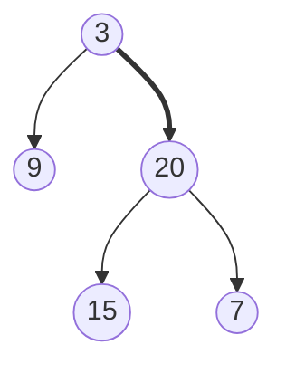
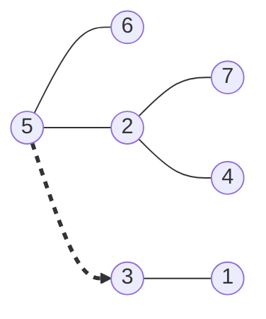

# Tree BFS

**Breadth-first search (BFS)** visits every node at distance 1 from the root
before any node at distance 2, every node at distance 2 before any node at
distance 3, and so on outward. The set of nodes sharing a distance from the root
is a **level**, so BFS is also called **level-order traversal**

That is the opposite commitment from [DFS](02_dfs.md), which follows one branch
all the way down before it looks at the branch beside it. Both visit all `n`
nodes, but they visit them in different orders, and the order is the whole point



DFS on this tree finishes `9` and then descends the bold edge into `20`, `15`,
and `7`, so it reaches depth 2 before it has finished looking at depth 1 — except
here it happens to have. Change `9` into a subtree ten levels deep and DFS spends
all ten levels there before it ever sees `20`. BFS visits `3`, then `9` and `20`,
then `15` and `7`, and never touches a node at depth `d + 1` until every node at
depth `d` is done

The picture to hold is a ripple spreading out from the root. Everything the
ripple has already passed is closer to the root than everything it has not, which
is why BFS answers questions phrased in terms of distance: the shallowest leaf,
the deepest row, the node you see from the right, everything exactly `k` steps
from a target

The structure that produces this order is a **queue**, covered in
[queues and deques](../../03_stacks_and_queues/notes/02_queue_and_deque.md). A
queue hands back the oldest waiting item, and a node's children are always
enqueued after every node at the parent's own depth, so arrival order and
distance order are the same order

## A Plain Drain Loses The Level Boundaries

Start with the smallest thing that works. Put the root in a queue, and until the
queue is empty, pop a node, record it, and enqueue whichever children exist

```python
from __future__ import annotations

from collections import deque


class TreeNode:  # the shared node type from 01_fundamentals
    def __init__(
        self,
        val: int,
        left: TreeNode | None = None,
        right: TreeNode | None = None,
    ) -> None:
        self.val = val
        self.left = left
        self.right = right


def bfs_flat(root: TreeNode | None) -> list[int]:
    if root is None:
        return []

    queue: deque[TreeNode] = deque([root])
    order: list[int] = []

    while queue:
        node = queue.popleft()
        order.append(node.val)
        if node.left is not None:
            queue.append(node.left)
        if node.right is not None:
            queue.append(node.right)

    return order


tree = TreeNode(3, TreeNode(9), TreeNode(20, TreeNode(15), TreeNode(7)))
assert bfs_flat(tree) == [3, 9, 20, 15, 7]
assert bfs_flat(TreeNode(1)) == [1]
assert bfs_flat(None) == []
```

The visiting order is correct, and `[3, 9, 20, 15, 7]` really is the tree read
top to bottom, left to right. The problem is that
[Binary Tree Level Order Traversal](https://leetcode.com/problems/binary-tree-level-order-traversal/)
asks for `[[3], [9, 20], [15, 7]]`, and nothing in that flat list says where one
level stops. The loop threw the boundary away by never recording it

You cannot recover it afterwards either, because a flat list of five values is
consistent with many different trees. The fix has to happen while the queue still
knows

## Freezing The Level Size Before The Drain

Look at the queue at the moment the `while` condition is tested. It contains
exactly the nodes of one level, and nothing else, because every node that was
popped before this instant has already had its children appended, and no node of
the level after that has been created yet

```text
before iteration 1   queue = [3]           this is level 0, complete
before iteration 2   queue = [9, 20]       this is level 1, complete
before iteration 3   queue = [15, 7]       this is level 2, complete
```

So the boundary is free. Read `len(queue)` once, then pop exactly that many
nodes. Everything you append during those pops belongs to the next level and is
safely outside the count

> "At the top of each outer iteration the queue holds exactly one level, so I
> will snapshot its length into `level_size` and pop that many nodes. The
> children I append during the inner loop are the next level, and the snapshot
> keeps them out of this one."

The word "snapshot" is doing real work. Recomputing the length inside the loop
instead of freezing it first is the bug people actually write:

```python
def level_order_broken(root: TreeNode | None) -> list[list[int]]:
    if root is None:
        return []

    queue: deque[TreeNode] = deque([root])
    result: list[list[int]] = []

    while queue:
        level: list[int] = []
        while queue:  # re-checks a queue that the loop body keeps refilling
            node = queue.popleft()
            level.append(node.val)
            if node.left is not None:
                queue.append(node.left)
            if node.right is not None:
                queue.append(node.right)
        result.append(level)

    return result


assert level_order_broken(tree) == [[3, 9, 20, 15, 7]]
```

The inner `while` cannot finish until the queue is empty, and the queue only
empties once the entire tree has been consumed, so every node lands in one giant
level. The assert above is not a passing test, it is the bug written down

The working version replaces that inner condition with a fixed repeat count:

```python
def level_order(root: TreeNode | None) -> list[list[int]]:
    if root is None:
        return []

    queue: deque[TreeNode] = deque([root])
    result: list[list[int]] = []

    while queue:
        level_size = len(queue)
        level: list[int] = []

        for _ in range(level_size):
            node = queue.popleft()
            level.append(node.val)
            if node.left is not None:
                queue.append(node.left)
            if node.right is not None:
                queue.append(node.right)

        result.append(level)

    return result


assert level_order(tree) == [[3], [9, 20], [15, 7]]
assert level_order(TreeNode(1)) == [[1]]
assert level_order(None) == []
```

**Three lines that decide whether this works**:

- `if root is None: return []` returns an empty list rather than `[[]]`, because
  a tree with no nodes has no levels at all, and a list holding one empty level
  claims it has one
- `level_size = len(queue)` is evaluated before the `for` header runs, and
  `range(level_size)` is built once from that value, so appending to `queue`
  inside the body cannot extend the iteration
- `if node.left is not None` filters at enqueue time, which keeps the queue free
  of `None` and means nothing inside the loop has to guard against it. Every
  variant below relies on the queue holding real nodes

## Dry Run: Level Order On Five Nodes

The tree is `3` on top, `9` and `20` beneath it, and `15` and `7` beneath `20`

```text
outer start  level_size=1  queue=[3]
   pop 3   left=9, right=20 enqueued      queue=[9, 20]   level=[3]
outer end    result=[[3]]

outer start  level_size=2  queue=[9, 20]
   pop 9   left=None DISCARDED, right=None DISCARDED   queue=[20]      level=[9]
   pop 20  left=15, right=7 enqueued                   queue=[15, 7]   level=[9, 20]
outer end    result=[[3], [9, 20]]

outer start  level_size=2  queue=[15, 7]
   pop 15  left=None DISCARDED, right=None DISCARDED   queue=[7]   level=[15]
   pop 7   left=None DISCARDED, right=None DISCARDED   queue=[]    level=[15, 7]
outer end    result=[[3], [9, 20], [15, 7]]
```

The discarded children are the reason the queue length is a usable signal. Six of
the ten child slots in this tree are empty, and each one is rejected at the
enqueue check rather than being pushed as a `None` placeholder, so `len(queue)`
always counts real nodes and never counts holes

The middle iteration is the one worth staring at. After popping `9` the queue
holds one element, and after popping `20` it holds two. Neither number is 2, the
count the level actually needed. Only the value frozen before the first pop was
correct, which is exactly what `level_order_broken` gets wrong

## One Loop, Four Different Answers

Most level-order problems change one thing inside that loop and leave the rest
alone. The template stays the same and the payload changes

- [Right Side View](https://leetcode.com/problems/binary-tree-right-side-view/)
  wants the node you would see standing to the right of the tree, which is the
  **last** node of each level, so it keeps the value when the loop index equals
  `level_size - 1`
- [Average Of Levels](https://leetcode.com/problems/average-of-levels-in-binary-tree/)
  sums the level and divides by `level_size`, which is already in hand and does
  not need a second pass over the level list
- [Find Bottom Left Tree Value](https://leetcode.com/problems/find-bottom-left-tree-value/)
  wants the **first** node of the last level, so it overwrites a single variable
  at index 0 of every level and lets the deepest level win by being last

```python
def right_side_view(root: TreeNode | None) -> list[int]:
    if root is None:
        return []

    queue: deque[TreeNode] = deque([root])
    view: list[int] = []

    while queue:
        level_size = len(queue)
        for i in range(level_size):
            node = queue.popleft()
            if i == level_size - 1:
                view.append(node.val)
            if node.left is not None:
                queue.append(node.left)
            if node.right is not None:
                queue.append(node.right)

    return view


def average_of_levels(root: TreeNode | None) -> list[float]:
    if root is None:
        return []

    queue: deque[TreeNode] = deque([root])
    averages: list[float] = []

    while queue:
        level_size = len(queue)
        total = 0
        for _ in range(level_size):
            node = queue.popleft()
            total += node.val
            if node.left is not None:
                queue.append(node.left)
            if node.right is not None:
                queue.append(node.right)
        averages.append(total / level_size)

    return averages


def find_bottom_left_value(root: TreeNode | None) -> int:
    if root is None:
        return 0

    queue: deque[TreeNode] = deque([root])
    leftmost = root.val

    while queue:
        for i in range(len(queue)):
            node = queue.popleft()
            if i == 0:
                leftmost = node.val
            if node.left is not None:
                queue.append(node.left)
            if node.right is not None:
                queue.append(node.right)

    return leftmost


assert right_side_view(TreeNode(1, TreeNode(2, None, TreeNode(5)), TreeNode(3, None, TreeNode(4)))) == [1, 3, 4]
assert right_side_view(TreeNode(1, None, TreeNode(3))) == [1, 3]
assert right_side_view(None) == []
assert average_of_levels(tree) == [3.0, 14.5, 11.0]
assert average_of_levels(TreeNode(1)) == [1.0]
assert average_of_levels(None) == []
assert find_bottom_left_value(TreeNode(2, TreeNode(1), TreeNode(3))) == 1
assert find_bottom_left_value(TreeNode(1)) == 1
assert find_bottom_left_value(None) == 0
```

`find_bottom_left_value` is the one whose empty-tree guard is purely defensive,
since the problem guarantees at least one node, and that guarantee is also what
lets it seed `leftmost` with `root.val` before the traversal starts. Say that
out loud rather than silently omitting the check

The fourth variant,
[Zigzag Level Order Traversal](https://leetcode.com/problems/binary-tree-zigzag-level-order-traversal/),
alternates the output direction per level. The traversal itself must not change,
because reversing the order in which children are enqueued corrupts every later
level. Reverse only the collected values, and a `deque` for the level makes that
free with `appendleft`:

```python
def zigzag_level_order(root: TreeNode | None) -> list[list[int]]:
    if root is None:
        return []

    queue: deque[TreeNode] = deque([root])
    result: list[list[int]] = []
    left_to_right = True

    while queue:
        level: deque[int] = deque()
        for _ in range(len(queue)):
            node = queue.popleft()
            if left_to_right:
                level.append(node.val)
            else:
                level.appendleft(node.val)
            if node.left is not None:
                queue.append(node.left)
            if node.right is not None:
                queue.append(node.right)
        result.append(list(level))
        left_to_right = not left_to_right

    return result


assert zigzag_level_order(tree) == [[3], [20, 9], [15, 7]]
assert zigzag_level_order(TreeNode(1)) == [[1]]
assert zigzag_level_order(None) == []
```

## Linking Nodes Across A Level

[Populating Next Right Pointers In Each Node](https://leetcode.com/problems/populating-next-right-pointers-in-each-node/)
gives each node a third pointer, `next`, and asks you to make it point at the
node immediately to its right on the same level, or at `None` for the rightmost
node. The level loop already visits a level left to right, so the only new state
is a `previous` variable that is reset at the start of every level

```python
class NextNode:
    def __init__(
        self,
        val: int,
        left: NextNode | None = None,
        right: NextNode | None = None,
    ) -> None:
        self.val = val
        self.left = left
        self.right = right
        self.next: NextNode | None = None


def connect(root: NextNode | None) -> NextNode | None:
    if root is None:
        return None

    queue: deque[NextNode] = deque([root])

    while queue:
        previous: NextNode | None = None
        for _ in range(len(queue)):
            node = queue.popleft()
            if previous is not None:
                previous.next = node
            previous = node
            if node.left is not None:
                queue.append(node.left)
            if node.right is not None:
                queue.append(node.right)

    return root


def chain(node: NextNode | None) -> list[int]:
    values: list[int] = []
    while node is not None:
        values.append(node.val)
        node = node.next
    return values


perfect = NextNode(
    1,
    NextNode(2, NextNode(4), NextNode(5)),
    NextNode(3, NextNode(6), NextNode(7)),
)
connect(perfect)
assert chain(perfect) == [1]
assert chain(perfect.left) == [2, 3]
assert chain(perfect.left.left) == [4, 5, 6, 7]
assert perfect.left.right.next is perfect.right.left
assert connect(None) is None
assert chain(None) == []
```

`previous` is declared inside the `while` and outside the `for`, and that
placement is the entire problem. Declare it outside the `while` and the last node
of one level gets linked to the first node of the next, which crosses levels and
produces a single chain through the whole tree. The assert on
`perfect.left.right.next is perfect.right.left` is the one that catches the real
mistake, because it checks a link between two nodes with different parents, which
is the only place this can go wrong

## Why The First Leaf BFS Reaches Is The Shallowest

[Minimum Depth Of Binary Tree](https://leetcode.com/problems/minimum-depth-of-binary-tree/)
asks for the number of nodes on the shortest root-to-leaf path. BFS can stop the
moment it pops a node with no children, and no later leaf can beat it, because
BFS pops nodes in non-decreasing depth order, so every node still unexamined sits
at the current depth or deeper

> "BFS pops in non-decreasing depth order, so the first leaf I pop is at the
> minimum leaf depth. I return immediately instead of finishing the traversal."

```python
def minimum_depth(root: TreeNode | None) -> int:
    if root is None:
        return 0

    queue: deque[TreeNode] = deque([root])
    depth = 1

    while queue:
        for _ in range(len(queue)):
            node = queue.popleft()
            if node.left is None and node.right is None:
                return depth
            if node.left is not None:
                queue.append(node.left)
            if node.right is not None:
                queue.append(node.right)
        depth += 1

    return depth


assert minimum_depth(tree) == 2
assert minimum_depth(TreeNode(2, None, TreeNode(3, None, TreeNode(4)))) == 3
assert minimum_depth(TreeNode(1)) == 1
assert minimum_depth(None) == 0
```

The near-miss here is the recursive one-liner, and it is wrong for a reason worth
being able to state:

```python
def wrong_min_depth(root: TreeNode | None) -> int:
    if root is None:
        return 0
    return 1 + min(wrong_min_depth(root.left), wrong_min_depth(root.right))


assert wrong_min_depth(TreeNode(2, None, TreeNode(3, None, TreeNode(4)))) == 1
```

A right-leaning chain of three nodes has one leaf, at depth 3, so the answer is 3,
yet the recursion returns 1, because at the root the missing left child returns 0
and `min` picks it. A missing child is not a path to a leaf, so the base case
`None -> 0` is only correct for maximum depth, where an absent branch losing to a
present one is exactly what you want. The BFS version never has this bug, because
it only ever asks whether a popped node is a leaf, and `None` is never popped

The early return also changes the running time in practice. On a tree whose left
child is a leaf and whose right subtree holds a million nodes, BFS returns after
two pops, the root and then that leaf, while any complete traversal visits
everything

## When A Queue Entry Carries More Than A Node

Nothing requires the queue to hold bare nodes. Push a tuple and every entry
carries its own context, which is how BFS answers questions that a node alone
cannot

[Cousins In Binary Tree](https://leetcode.com/problems/cousins-in-binary-tree/)
asks whether two values sit at the same depth with different parents. Depth is
already implied by the level loop, so the only missing piece is the parent, which
the entry can carry

```python
def is_cousins(root: TreeNode | None, x: int, y: int) -> bool:
    if root is None:
        return False

    queue: deque[tuple[TreeNode, TreeNode | None]] = deque([(root, None)])

    while queue:
        found: dict[int, TreeNode | None] = {}
        for _ in range(len(queue)):
            node, parent = queue.popleft()
            if node.val in (x, y):
                found[node.val] = parent
            if node.left is not None:
                queue.append((node.left, node))
            if node.right is not None:
                queue.append((node.right, node))

        if x in found and y in found:
            return found[x] is not found[y]
        if found:
            return False

    return False


assert is_cousins(TreeNode(1, TreeNode(2, TreeNode(4)), TreeNode(3)), 4, 3) is False
assert is_cousins(TreeNode(1, TreeNode(2, None, TreeNode(4)), TreeNode(3, None, TreeNode(5))), 5, 4) is True
assert is_cousins(TreeNode(1, TreeNode(2, None, TreeNode(4)), TreeNode(3)), 2, 3) is False
assert is_cousins(TreeNode(1), 1, 2) is False
assert is_cousins(None, 1, 2) is False
```

`if found: return False` is the line to defend. Reaching it means exactly one of
the two values appeared on this level, so the other one is deeper, so their
depths differ and they cannot be cousins. Without it the search keeps going and
would report the pair as cousins when it later finds the second value at another
depth. The comparison itself uses `is not` rather than `!=`, because two distinct
parent nodes can hold equal values and identity is what "different parent"
actually means

[Vertical Order Traversal](https://leetcode.com/problems/vertical-order-traversal-of-a-binary-tree/)
extends the entry to `(node, row, col)`, where the root sits at `(0, 0)`, a left
child is `(row + 1, col - 1)`, and a right child is `(row + 1, col + 1)`. BFS
gives increasing `row` for free, but that is not enough on its own, because two
nodes can share both a row and a column, and the problem breaks that tie by
value. The output is grouped by `col` ascending and, within a column, sorted by
`(row, val)`, so a final sort is unavoidable and the traversal only supplies the
coordinates

## Radiating Outward From A Node That Is Not The Root

[All Nodes Distance K In Binary Tree](https://leetcode.com/problems/all-nodes-distance-k-in-binary-tree/)
wants every value exactly `k` steps from a given target node, counting steps in
either direction. BFS from the root is useless here, because the target's own
level is not the frontier the question is about

Distance in this problem treats an edge as walkable both ways, so each node has
up to three neighbors: its left child, its right child, and its parent. A node
object only stores the first two, so the missing pointer has to be built once and
stored in a dictionary



The dashed edge from `5` up to its parent `3` is the one the tree does not give
you, and it is the edge that puts `1` two steps from `5`

```python
def distance_k(root: TreeNode | None, target: TreeNode | None, k: int) -> list[int]:
    if root is None or target is None:
        return []

    parent: dict[TreeNode, TreeNode | None] = {root: None}
    stack = [root]
    while stack:
        node = stack.pop()
        for child in (node.left, node.right):
            if child is not None:
                parent[child] = node
                stack.append(child)

    queue: deque[TreeNode] = deque([target])
    visited: set[TreeNode] = {target}
    distance = 0

    while queue:
        if distance == k:
            return [node.val for node in queue]
        for _ in range(len(queue)):
            node = queue.popleft()
            for neighbor in (node.left, node.right, parent[node]):
                if neighbor is not None and neighbor not in visited:
                    visited.add(neighbor)
                    queue.append(neighbor)
        distance += 1

    return []


rooted = TreeNode(
    3,
    TreeNode(5, TreeNode(6), TreeNode(2, TreeNode(7), TreeNode(4))),
    TreeNode(1, TreeNode(0), TreeNode(8)),
)
assert sorted(distance_k(rooted, rooted.left, 2)) == [1, 4, 7]
assert distance_k(rooted, rooted.left, 0) == [5]
assert distance_k(rooted, rooted.left, 9) == []
solo = TreeNode(1)
assert distance_k(solo, solo, 0) == [1]
assert distance_k(solo, solo, 3) == []
```

**Two things this version does that a tree BFS never has to**:

- `visited` is mandatory once parents are walkable, because the ripple would
  otherwise step from a node to its parent and straight back down to the same
  node forever. On a plain downward traversal no node is reachable twice, which
  is why the earlier templates need no visited set
- The `if distance == k` check sits at the top of the outer loop, before any
  popping, so the queue at that instant is precisely the frontier at distance
  `k` and the whole level is the answer. Checking after the inner loop would
  report the frontier one step too far out

Nodes are used directly as dictionary keys and set members, which works because
Python objects are hashable by identity by default, so two distinct nodes holding
equal values are still distinct keys

## Worked Example: [Maximum Width Of Binary Tree](https://leetcode.com/problems/maximum-width-of-binary-tree/)

Return the width of the widest level, where a level's width is measured from its
leftmost non-null node to its rightmost non-null node, counting the missing
positions in between as if they were there. A level holding two real nodes with
a three-node gap between them has width 5, not 2

**Input**: `root`, the root of a binary tree, of type `TreeNode | None`. Node
values are integers and the official constraints guarantee at least one node, so
the empty case is a defensive guard rather than a tested input. The tree can be
deep enough that a naive position index grows past the range of a fixed-width
integer in other languages, which is a follow-up worth naming even though Python
integers do not overflow

**Output**: a single `int`, the largest width found over all levels. Width counts
**positions**, not nodes, so the answer is at least as large as the largest
number of nodes on any one level, and equals 1 for a single-node tree

The naive reading is "count the nodes on each level and take the maximum", and it
is wrong on the very first example, because it reports 3 for a bottom level whose
two outer nodes span four positions. Counting positions requires knowing where
in the level each node sits, and a node object stores no such thing

Give every node the position index it would have in an array-backed complete
binary tree, where the root is index 0, a left child is `2 * i`, and a right
child is `2 * i + 1`. That numbering is defined for every position whether a node
exists there or not, so the gaps are counted automatically, and the width of a
level is `last_index - first_index + 1`

> "I will carry a heap-style position index in the queue alongside each node,
> with children at `2 * i` and `2 * i + 1`. The width of a level is then the last
> index minus the first index plus one, and the empty slots between them are
> counted for free because the numbering never skips."

One correction is needed before that is usable. The indices double every level,
so at depth `d` they reach roughly `2^d`, and on a deep skewed tree those numbers
become enormous. Subtracting the level's first index from every index in that
level fixes it, because only differences within a level are ever used, so shifting
a whole level by a constant changes nothing

Therefore,

1. Guard the empty tree by returning 0, since a tree with no levels has no
   widest level
2. Seed the queue with `(root, 0)`, pairing every node with its position index,
   because the index is the piece of information the node itself cannot supply
3. At the top of each outer iteration read `first = queue[0][1]`, the index of
   the leftmost node on this level, before popping anything. It is needed for
   every entry on the level, so it must be captured while the level is still
   intact
4. Pop exactly `len(queue)` entries as usual, and for each one rebase its index
   by subtracting `first`. The leftmost node of the level therefore becomes 0,
   which keeps the numbers small without changing any difference within the level
5. Enqueue each existing child at `2 * index` or `2 * index + 1` using the
   **rebased** index, so the next level inherits the shrunken numbering rather
   than the original one
6. Keep the rebased index of the last entry popped on this level in `last`. Since
   the level is drained left to right, the final one is the rightmost node
7. After the level finishes, the width is `last + 1`, because the leftmost node
   was rebased to index 0 and positions are counted inclusively. Fold it into a
   running maximum
8. Return the running maximum once the queue empties, which happens after the
   deepest level has been measured

```python
def width_of_binary_tree(root: TreeNode | None) -> int:
    if root is None:
        return 0

    queue: deque[tuple[TreeNode, int]] = deque([(root, 0)])
    widest = 0

    while queue:
        first = queue[0][1]
        last = first

        for _ in range(len(queue)):
            node, index = queue.popleft()
            index -= first
            last = index
            if node.left is not None:
                queue.append((node.left, 2 * index))
            if node.right is not None:
                queue.append((node.right, 2 * index + 1))

        widest = max(widest, last + 1)

    return widest


assert width_of_binary_tree(TreeNode(1, TreeNode(3, TreeNode(5), TreeNode(3)), TreeNode(2, None, TreeNode(9)))) == 4
assert (
    width_of_binary_tree(
        TreeNode(
            1,
            TreeNode(3, TreeNode(5, TreeNode(6), None), None),
            TreeNode(2, None, TreeNode(9, TreeNode(7), None)),
        )
    )
    == 7
)
assert width_of_binary_tree(TreeNode(1, TreeNode(3, TreeNode(5)), TreeNode(2))) == 2
assert width_of_binary_tree(TreeNode(1)) == 1
assert width_of_binary_tree(None) == 0
```

The first example traces like this:

```text
level start  first=0  entries=[(1, 0)]
   node 1 at 0: left 3 -> index 0, right 2 -> index 1
level end    last=0  width=1  widest=1

level start  first=0  entries=[(3, 0), (2, 1)]
   node 3 at 0: left 5 -> index 0, right 3 -> index 1
   node 2 at 1: left slot 2 EMPTY, nothing enqueued
   node 2 at 1: right 9 -> index 3
level end    last=1  width=2  widest=2

level start  first=0  entries=[(5, 0), (3, 1), (9, 3)]
   node 5 at 0: both slots EMPTY
   node 3 at 1: both slots EMPTY
   node 9 at 3: both slots EMPTY
level end    last=3  width=4  widest=4
```

The discarded slot is what the whole problem is about. Node `2` has no left
child, so index 2 is never enqueued, and the bottom level physically holds three
nodes at indices 0, 1, and 3. Counting nodes gives 3, while `last + 1` gives 4,
and 4 is the answer, because the missing position between `3` and `9` still lies
between the level's two outermost nodes

- **Time Complexity:** `O(n)` where `n` is the number of nodes, because each node
  is enqueued once and dequeued once, and the work per node is a subtraction, an
  assignment, and two child checks
- **Space Complexity:** `O(w)` where `w` is the largest number of nodes on any
  single level, because the queue holds the remainder of the current level plus
  the part of the next level already built, which is bounded by `2w`. On a
  complete tree the bottom level holds about `n / 2` nodes, so this is `O(n)` in
  the worst case

## Time and Space Complexity

Throughout, `n` is the number of nodes, `w` is the largest number of nodes on any
single level, and `h` is the height of the tree

**Level-order traversal**

| Approach                        | Time                                                                                            | Space                                                                                                                                                                           |
| ------------------------------- | ----------------------------------------------------------------------------------------------- | ------------------------------------------------------------------------------------------------------------------------------------------------------------------------------- |
| BFS with a frozen `level_size`  | `O(n)`: each node is enqueued once and dequeued once, and the per-node work is two child checks | `O(w)`: the queue never holds more than the rest of the current level plus the next level built so far, which is at most `2w`, and `w` reaches about `n / 2` on a complete tree |
| Recursive DFS bucketed by depth | `O(n)`: the same single visit per node, with `result[depth]` appended to on arrival             | `O(h)` call stack plus `O(n)` output, and `h` is `O(n)` on a skewed tree, so the stack is the risk rather than the queue                                                        |

The DFS alternative genuinely works for level order and is worth naming out loud.
BFS wins whenever the answer depends on stopping early, as in `minimum_depth`, or
on a whole level being in hand at once, as in `width_of_binary_tree`, because DFS
has no moment where one level exists as a unit

**The variants in this topic**

| Problem                                                                 | Time                                                                                                                                                                                           | Space                                                                                                                         |
| ----------------------------------------------------------------------- | ---------------------------------------------------------------------------------------------------------------------------------------------------------------------------------------------- | ----------------------------------------------------------------------------------------------------------------------------- |
| `right_side_view`, `average_of_levels`, `zigzag_level_order`, `connect` | `O(n)`: one visit per node, and the per-level bookkeeping is `O(1)` since `level_size` is already known                                                                                        | `O(w)`: the queue, plus a per-level list of at most `w` values that is released each iteration                                |
| `minimum_depth`                                                         | `O(n)` worst case when the shallowest leaf is on the last level, but it returns on the first leaf popped, so a shallow leaf beside a huge subtree costs only the nodes above that leaf's depth | `O(w)`: only the queue, since no level list is collected                                                                      |
| `is_cousins`                                                            | `O(n)`: one visit per node, and both targets are decided within a single level                                                                                                                 | `O(w)`: the queue now holds `(node, parent)` pairs, which is a constant factor per entry rather than a different class        |
| `distance_k`                                                            | `O(n)`: one pass to build the parent map plus a second traversal that visits each node at most once thanks to `visited`                                                                        | `O(n)`: the parent map holds an entry for every node, so this is the one variant whose space is driven by `n` rather than `w` |
| `vertical_traversal`                                                    | `O(n log n)`: the BFS itself is `O(n)`, but the final ordering sorts the coordinate keys and sorts the values inside each cell, and sorting dominates                                          | `O(n)`: every node is stored in the coordinate map before anything is emitted                                                 |

## Summary

- **Breadth-first search** visits a tree by distance from the root, finishing
  every node at depth `d` before touching any node at depth `d + 1`. The set of
  nodes at one distance is a **level**, and the traversal is also called
  **level-order traversal**
  - A queue produces this order because it returns the oldest waiting node, and
    children are always enqueued behind every node at the parent's own depth
  - [DFS](02_dfs.md) is the opposite commitment, going as deep as possible down
    one branch first, so it never has a whole level in hand at once
- A problem wants BFS when it is phrased in terms of distance, level, depth,
  row, or "the first thing you reach". Level averages, right side view, minimum
  depth, the bottom-left value, cousins, and nodes exactly `k` away are all that
  question in different clothes
- The whole technique is one line. Snapshot `level_size = len(queue)` at the top
  of the outer loop and pop exactly that many nodes, because at that instant the
  queue holds exactly one complete level
  - Re-testing `while queue` for the inner loop instead is the classic bug, and
    it collapses the entire tree into one level, since the loop keeps refilling
    the queue it is draining
  - Everything appended during the inner loop belongs to the next level, which
    the frozen count correctly excludes
- Children are filtered with `if node.left is not None` at enqueue time, so the
  queue only ever holds real nodes and `len(queue)` counts nodes rather than
  holes. An empty tree returns an empty answer rather than `[[]]`, since no
  levels exist at all
- The variants change the payload, not the loop. Index `level_size - 1` gives
  the right side view, index 0 of every level gives the bottom-left value, a
  running total over the level gives the averages, `deque.appendleft` gives
  zigzag without disturbing the enqueue order, and a `previous` variable declared
  inside the outer loop links a level with `next` pointers
- BFS can return the moment it pops a leaf for **minimum depth**, because it pops
  in non-decreasing depth order, so nothing unexamined is shallower
  - The recursive `1 + min(left, right)` is wrong on a node with one missing
    child, since a `None` branch returns 0 and wins the `min` while not being a
    path to any leaf
- A queue entry can be a tuple carrying context the node does not store, which is
  what makes the harder problems tractable
  - `(node, parent)` decides cousins, and the parents must be compared with `is not` rather than `!=`, because two different nodes can hold equal values
  - `(node, index)` with children at `2 * i` and `2 * i + 1` measures **maximum
    width**, and rebasing each level against its own first index keeps the
    numbers from doubling out of range
  - `(node, row, col)` supplies the coordinates for **vertical order traversal**,
    which still needs a final sort by `(col, row, val)` because BFS cannot break
    the within-cell tie
- Distance from an arbitrary node needs the parent pointer that a tree node does
  not have. Build a `parent` dictionary in one pass, then BFS from the target
  over three neighbors, and keep a `visited` set, since with parents walkable the
  search would otherwise bounce between a node and its parent forever
- Cost is `O(n)` time for every variant except `vertical_traversal`, which is
  `O(n log n)` because of the final sort. Space is `O(w)` for the plain level
  loop, where `w` is the widest level and reaches about `n / 2` on a complete
  tree, and `O(n)` for `distance_k`, which stores a parent entry per node

## Interview Checklist

Before writing code, make sure you can answer each of these

```text
Does this problem ask about depth, level, distance, or "the first one reached"?
Do I need the level boundary at all, or is a flat visit order enough?
Where exactly do I snapshot len(queue), and what breaks if I re-test it inside?
What does the empty tree return: [], 0, or something the problem states?
Am I enqueuing nodes rather than values, and filtering None at the enqueue check?
Does the queue entry need a tuple: a parent, a depth, a position index, coordinates?
Can I stop early, as minimum depth does, instead of draining the whole tree?
For an index-carrying BFS, am I rebasing each level so the numbers stay small?
Am I walking parent pointers, and if so, do I have a visited set?
Can I state the space as O(w) and say what w is on a complete tree?
```
