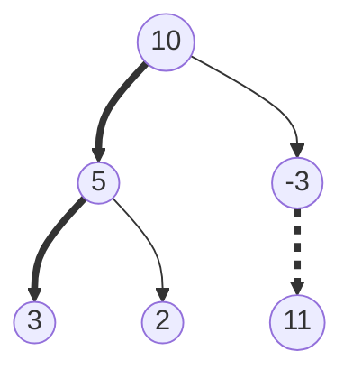

# Tree Path Problems

A **path** in a binary tree is a route you walk by starting at some node and
repeatedly stepping down into one of its children. Each step goes strictly
downward, so a path never turns around and never visits a node twice. Two names
matter because problems are worded in terms of them:

- A **root-to-leaf path** starts at the root and stops at a **leaf**, a node with
  no children at all. Every node in the tree sits on at least one of these
- A **downward path** is any piece of a root-to-leaf path: it may begin at any
  node and end at any node below it, so it is the tree's version of a subarray

The previous notes asked questions about **subtrees**. Height, balance, and
"are these two shapes identical" are all questions about everything hanging
below a node, and they are answered by
[bottom-up recursion](02_dfs.md) that collects children's answers and combines
them. A path question is different in direction. It asks about the line of
**ancestors** above the current node, and a node cannot see its ancestors,
because a `TreeNode` has `left` and `right` but no pointer to its parent.

The hook that makes all of this easy is that the recursion already knows the
path. When a DFS call is running at some node, the chain of calls sitting on the
call stack underneath it is exactly the route from the root to that node. So the
path never has to be looked up or reconstructed. It just has to be **carried
down as a parameter**, one value per call.



The solid bold route `10 → 5 → 3` is a root-to-leaf path. The dashed route
`-3 → 11` is a downward path that is not root-to-leaf, since it starts partway
down. Both are paths; `5 → 10 → -3` is not, because it steps upward in the
middle.

> This topic covers how to carry path state downward, how to rebuild the path
> itself with backtracking, the accumulators that are not sums, and the prefix
> map that counts downward paths starting anywhere

## Which Route The Problem Means

Read the problem statement for the two endpoints, because they decide the whole
structure of the code:

- **Root to leaf.** The path is only complete at a leaf, so the answer is
  checked there and nowhere else. *Path Sum*, *Path Sum II*, *Binary Tree
  Paths*, and *Sum Root To Leaf Numbers* are all this shape
- **Root to every node.** Every node is its own question and there is no leaf
  test at all, as in *Count Good Nodes In Binary Tree*, which asks about each
  node's ancestors
- **Any node down to any node.** The path can start anywhere, which means one
  node participates in many candidate paths, as in *Path Sum III*

**The leaf test is `node.left is None and node.right is None`**, and getting it
wrong is the most expensive mistake in this family. A node with exactly one
child is not a leaf, even though one of its child pointers is `None`. That
matters because the tempting alternative is to put the check in the `None` base
case, which fires once for every missing child:

```text
tree = 1
        \
         2       target = 1

check at None:  reaches 1's missing left child with remaining 0, says True
check at leaf:  the only leaf is 2, path sum is 3, says False
```

The correct answer is `False`, since the one root-to-leaf path here is
`1 → 2` and it sums to 3. The `None`-based version returns `True`, which is
what the run below shows.

## Why Reporting Sums Back Up The Tree Is The Wrong Direction

The reflex after the DFS note is to make this bottom-up, since that is how every
subtree question was answered. Have each node return every root-to-leaf sum that
lives below it, then check the root's list for the target:

```python
from __future__ import annotations


class TreeNode:
    def __init__(
        self,
        val: int = 0,
        left: TreeNode | None = None,
        right: TreeNode | None = None,
    ) -> None:
        self.val = val
        self.left = left
        self.right = right


def leaf_sums(node: TreeNode | None) -> list[int]:
    if node is None:
        return []
    if node.left is None and node.right is None:
        return [node.val]
    return [node.val + below for below in leaf_sums(node.left) + leaf_sums(node.right)]


tree = TreeNode(5, TreeNode(4, TreeNode(11, TreeNode(7), TreeNode(2))), TreeNode(8))
assert sorted(leaf_sums(tree)) == [13, 22, 27]
assert leaf_sums(TreeNode(1)) == [1]
assert leaf_sums(None) == []
```

`TreeNode` is the shared node type from
[tree fundamentals](01_fundamentals.md), defined once here so the blocks in this
topic run end to end without reaching back into that note. The `build` helper
below joins it, and every later block assumes both.

This is correct and it is the wrong shape. Look at the list comprehension: every
value that a child returns gets `node.val` added to it *again* at each ancestor
on the way up. A leaf at depth `h` therefore has its sum touched `h` times, once
per ancestor, so the total work is the sum of all the leaf depths rather than
the number of nodes. On a tree shaped like a long stem ending in a bush of
leaves, that sum is `O(n²)`.

It also answers a question nobody asked. *Path Sum* wants one boolean, and this
builds every sum in the tree before deciding, so it cannot stop early when the
first qualifying path is found.

Both problems have the same cause, which is that the sum is being assembled in
the wrong direction. The prefix `5 + 4 + 11` is already known by the time the
call at `11` starts running, and recomputing it on the way back up is what costs
the extra factor. Push it down as an argument instead and the recomputation
disappears.

## Path Sum: The Accumulator Rides In The Parameter

Rather than pass the sum accumulated so far, pass what is **left to find**. Each
call subtracts its own value and hands the remainder to its children, so the
test at the leaf is a comparison against zero rather than against a target that
also has to be carried:

```python
def path_sum(root: TreeNode | None, target_sum: int) -> bool:
    if root is None:
        return False
    remaining = target_sum - root.val
    if root.left is None and root.right is None:
        return remaining == 0
    return path_sum(root.left, remaining) or path_sum(root.right, remaining)


def build(values: list[int | None]) -> TreeNode | None:
    """LeetCode level-order list to tree, so the asserts can use official examples."""
    from collections import deque

    if not values or values[0] is None:
        return None
    root = TreeNode(values[0])
    queue = deque([root])
    index = 1
    while queue and index < len(values):
        node = queue.popleft()
        for side in ("left", "right"):
            if index >= len(values):
                break
            value = values[index]
            index += 1
            if value is not None:
                child = TreeNode(value)
                setattr(node, side, child)
                queue.append(child)
    return root


assert path_sum(build([5, 4, 8, 11, None, 13, 4, 7, 2, None, None, None, 1]), 22) is True
assert path_sum(build([1, 2, 3]), 5) is False
assert path_sum(build([1, 2]), 1) is False
assert path_sum(build([]), 0) is False
```

**Three lines carry the whole method**:

- `if root is None: return False` is the base case for a *missing child*, not for
  a finished path. An absent child offers no root-to-leaf path, so it can only
  ever report failure, which is why the target is not even looked at here
- `remaining = target_sum - root.val` is the state going down. Subtracting rather
  than adding means the children need one number instead of two, since they no
  longer need to know the original target
- `return ... or ...` is what makes the search stop early, because Python's `or`
  does not evaluate the right side once the left side is `True`, so the whole
  right subtree is skipped as soon as a path is found

Moving the check into the `None` case is the version to be able to reject out
loud. Running it on the two-node tree above with target 1 returns `True`, and on
the empty tree with target 0 it also returns `True`, when both answers are
`False`. In each case the recursion walked into a child that does not exist and
declared the nonexistent path complete.

> "The completion test has to be `node.left is None and node.right is None`,
> not `node is None`. A node with one child would otherwise report a finished
> path through its missing side, and the empty tree would claim a path of
> sum zero"

## Rebuilding The Path, Not Just Its Total

*Path Sum II* wants the qualifying paths themselves, and *Binary Tree Paths*
wants all of them as strings. A single integer is no longer enough state, so
carry a list. Growing a fresh list per call would copy `O(h)` values at every
node, so use one shared list and the append/recurse/pop shape from
[tree DFS](02_dfs.md):

```python
def path_sum_ii(root: TreeNode | None, target_sum: int) -> list[list[int]]:
    result: list[list[int]] = []
    path: list[int] = []

    def dfs(node: TreeNode | None, remaining: int) -> None:
        if node is None:
            return
        path.append(node.val)
        remaining -= node.val
        if node.left is None and node.right is None and remaining == 0:
            result.append(path.copy())
        dfs(node.left, remaining)
        dfs(node.right, remaining)
        path.pop()

    dfs(root, target_sum)
    return result


assert path_sum_ii(build([5, 4, 8, 11, None, 13, 4, 7, 2, None, None, 5, 1]), 22) == [
    [5, 4, 11, 2],
    [5, 8, 4, 5],
]
assert path_sum_ii(build([1, 2, 3]), 5) == []
assert path_sum_ii(build([]), 0) == []
```

**`path.copy()` is the line that gets missed, and it fails silently.** `path` is
one list that the whole traversal mutates, so appending it bare stores a
reference rather than a snapshot. By the time the traversal ends, every `pop`
has run and that one list is empty, so a result that looked right during the
recursion comes back as `[[], []]` on the example above: two entries, because
two paths did qualify, both of them emptied out afterwards.

Dropping the `path.pop()` fails loudly instead. On the same input the result
becomes `[[5, 4, 11, 7, 2], [5, 4, 11, 7, 2, 8, 13, 4, 5]]`, since without the
undo the list keeps every node the traversal has ever touched, including the
dead-end leaf 7 and the entire left subtree still sitting in front of the second
path.

*Binary Tree Paths* is the same traversal with the recording line changed:

```python
def binary_tree_paths(root: TreeNode | None) -> list[str]:
    result: list[str] = []
    path: list[str] = []

    def dfs(node: TreeNode | None) -> None:
        if node is None:
            return
        path.append(str(node.val))
        if node.left is None and node.right is None:
            result.append("->".join(path))
        dfs(node.left)
        dfs(node.right)
        path.pop()

    dfs(root)
    return result


assert binary_tree_paths(build([1, 2, 3, None, 5])) == ["1->2->5", "1->3"]
assert binary_tree_paths(build([1])) == ["1"]
assert binary_tree_paths(build([])) == []
```

No `copy()` appears here, and it is not an oversight. `"->".join(path)` builds a
brand new string out of the current contents, so the snapshot is taken for free
by the join. The rule is really about **aliasing**: copy when you store the
mutable container, and skip the copy when you store something derived from it.

## Dry Run: The Rejected Leaves And The Pops

Target 22 on this tree, where `path` is shown after the append and `remaining`
after the subtraction:

```text
        5
       / \
      4   8
     /   / \
    11  13  4
   /  \
  7    2
```

```text
visit   5  path=[5]           remaining=17
visit   4  path=[5, 4]        remaining=13
visit  11  path=[5, 4, 11]    remaining=2
leaf    7  path=[5, 4, 11, 7] remaining=-5   REJECT
pop     7  path=[5, 4, 11]
leaf    2  path=[5, 4, 11, 2] remaining=0    RECORD
pop     2  path=[5, 4, 11]
pop    11  path=[5, 4]
pop     4  path=[5]
visit   8  path=[5, 8]        remaining=9
leaf   13  path=[5, 8, 13]    remaining=-4   REJECT
pop    13  path=[5, 8]
leaf    4  path=[5, 8, 4]     remaining=5    REJECT
pop     4  path=[5, 8]
pop     8  path=[5]
pop     5  path=[]
```

The result is `[[5, 4, 11, 2]]`.

The rejected leaf 7 is the step to study. Its `remaining` went negative, which
proves nothing about the tree in general, because negative node values are
allowed and a later node could bring the total back. The rejection is purely
that this particular path ended and did not land on zero. Then `pop 7` removes
it, and the very next line shows `path=[5, 4, 11]` again, which is exactly the
state the sibling 2 needs. Without that pop, the sibling would have inherited
7 and recorded `[5, 4, 11, 7, 2]`.

Leaf 4 on the right side was rejected with `remaining=5`, and 5 is a value the
tree actually contains. That changes nothing, because a leaf is only recorded
when `remaining` is exactly zero, and the path `5 → 8 → 4` has nowhere left to
go.

The last line matters for a different reason. `path` returns to `[]` when the
root's own `pop` runs, which is why the shared list is safe to reuse across the
whole traversal, and also why storing it uncopied loses everything.

## Accumulators That Are Not Sums

The skeleton is fixed. Only the accumulated value changes, and picking it is the
real work in these problems.

*Sum Root To Leaf Numbers* reads each path as digits, so the state is the number
built so far and the update is the standard digit shift `current * 10 + digit`:

```python
def sum_root_to_leaf_numbers(root: TreeNode | None) -> int:
    def dfs(node: TreeNode | None, current: int) -> int:
        if node is None:
            return 0
        current = current * 10 + node.val
        if node.left is None and node.right is None:
            return current
        return dfs(node.left, current) + dfs(node.right, current)

    return dfs(root, 0)


assert sum_root_to_leaf_numbers(build([1, 2, 3])) == 25
assert sum_root_to_leaf_numbers(build([4, 9, 0, 5, 1])) == 1026
assert sum_root_to_leaf_numbers(build([])) == 0
```

Returning `0` from the `None` case is safe here only because the values are
digits and the answer is a sum, so a missing child contributes nothing. That
same `return 0` would be a bug in *Path Sum*, where zero is a meaningful target,
which is why the base case has to be matched to what the function returns rather
than memorized.

*Count Good Nodes In Binary Tree* calls a node **good** when no ancestor on its
path is strictly larger. The accumulator is therefore the maximum seen so far,
and there is no leaf test anywhere, because every node is asked the question:

```python
def good_nodes(root: TreeNode | None) -> int:
    def dfs(node: TreeNode | None, best: int) -> int:
        if node is None:
            return 0
        good = 1 if node.val >= best else 0
        higher = max(best, node.val)
        return good + dfs(node.left, higher) + dfs(node.right, higher)

    return 0 if root is None else dfs(root, root.val)


assert good_nodes(build([3, 1, 4, 3, None, 1, 5])) == 4
assert good_nodes(build([3, 3, None, 4, 2])) == 3
assert good_nodes(build([1])) == 1
assert good_nodes(build([])) == 0
```

Seeding `best` with `root.val` makes the root count itself, since a value is
always greater than or equal to itself, which matches the problem's rule that
the root is always good. The comparison is `>=` rather than `>` because an
ancestor that *ties* the node is not larger than it, so a repeated value stays
good. Swapping in `>` loses every tie, including the root's tie with its own
seed, and the second assert drops from 3 to 1, since the root 3 and the child 3
below it both stop counting and only node 4 is left.

Nothing here is undone on the way back up, and nothing needs to be, because
`best` is a plain integer passed by value. Each call has its own copy, so a
sibling branch is handed the parent's `higher` untouched. **Backtracking is only
needed when the state is a shared mutable object**, which is the `path` list
above and the map below.

## Worked Example: [Path Sum III](https://leetcode.com/problems/path-sum-iii/)

Count how many downward paths in the tree add up to a target. The path does not
have to start at the root and does not have to end at a leaf, so any node may be
the start and any node below it may be the end.

**Input**:

- `root`, a `TreeNode | None`, the root of a binary tree that may be empty. Node
  values may be negative, which the official first example demonstrates with a
  `-3`
- `target_sum`, an `int`, the total a path must reach, and it may itself be
  negative or zero

**Output**: an `int`, the number of distinct downward paths whose values sum to
`target_sum`. Two paths are distinct when they use a different set of nodes, so
the same node may be counted in many paths, and a single node on its own counts
as a path of length one when its value equals the target.

**The approach.** "Paths going downwards" plus "does not need to start at the
root" is the tree's restatement of counting subarrays with a given sum, because
each root-to-node path is one array and every downward path ending at that node
is a suffix of it. The naive fix is to run the *Path Sum* walk starting from
every node in turn, which is `O(n·h)` and repeats the same additions at every
depth. The technique that removes the repetition is the
[prefix sum with a frequency map](../../01_arrays_and_hashing/notes/03_prefix_suffix_sums.md),
seeded with `{0: 1}`, exactly as for subarrays.

The one genuinely new part is that the "array" changes as the traversal moves.
The current root-to-node path is the array, and stepping into a child extends
it, while returning from that child must shorten it again. So the map has to be
undone on the way back up, or a prefix recorded on the left branch will still be
sitting there when the right branch looks something up, and the right branch
will count a path that bends through the parent instead of going straight down.

> "Every downward path ending at this node is a suffix of the root-to-node path.
> If the running sum here is `running`, a suffix sums to the target exactly when
> some ancestor's prefix equals `running - target`, so I will keep a count of
> the prefix sums currently on the path and look that value up. Then I will
> decrement my own prefix before returning, because it is not on the path of any
> other branch"

**The steps**:

1. Keep one dictionary `counts` mapping a prefix sum to how many nodes on the
   **current** root-to-node path produced it. Seed it with `{0: 1}`, which
   stands for the empty prefix above the root, and is what lets a path starting
   at the root itself be counted
2. Recurse with `running`, the sum from the root down to and including the
   current node. Adding `node.val` on entry means one addition per node for the
   whole traversal rather than one per candidate path
3. At each node, compute `running - target_sum`. That is the prefix an ancestor
   would have to hold for the stretch between that ancestor and here to sum to
   the target, since subtracting the earlier prefix from the current one leaves
   exactly the values in between
4. Add `counts.get(running - target_sum, 0)` to the answer. Take the stored
   frequency rather than one, because two different ancestors can produce the
   same prefix sum when values are negative, and each of them starts a
   different valid path. A missing key contributes zero
5. Only then record the current node's own prefix with
   `counts[running] += 1`. Doing this before the lookup would let a node with
   `target_sum == 0` match itself and count an empty path
6. Recurse into both children and add what they report. They inherit the map in
   its current state, which is correct because every node on the path from the
   root to this node is also an ancestor of theirs
7. Decrement `counts[running]` before returning. This is the backtracking step,
   and it removes the current node from the set of available ancestors so that
   an uncle or a cousin branch cannot use it
8. Return the running total up the recursion, so the count at the root is the
   sum over all nodes of the paths ending at that node, which covers every
   downward path exactly once because each path ends at exactly one node

```python
def path_sum_iii(root: TreeNode | None, target_sum: int) -> int:
    counts: dict[int, int] = {0: 1}

    def dfs(node: TreeNode | None, running: int) -> int:
        if node is None:
            return 0
        running += node.val
        found = counts.get(running - target_sum, 0)
        counts[running] = counts.get(running, 0) + 1
        found += dfs(node.left, running) + dfs(node.right, running)
        counts[running] -= 1
        return found

    return dfs(root, 0)


assert path_sum_iii(build([10, 5, -3, 3, 2, None, 11, 3, -2, None, 1]), 8) == 3
assert path_sum_iii(build([5, 4, 8, 11, None, 13, 4, 7, 2, None, None, 5, 1]), 22) == 3
assert path_sum_iii(build([1]), 1) == 1
assert path_sum_iii(build([]), 0) == 0
```

A plain `dict` with `.get` is used rather than a `defaultdict` because reading a
missing key on a `defaultdict` inserts it, which would quietly grow the map with
zero entries on every lookup that misses.

**The trace**, on the official example with its three leaves removed so the log
fits, target 8. Only the non-zero entries of `counts` are shown, since a
decremented key is left sitting at zero rather than deleted:

```text
at   10  running=10  need= 2  found=0  counts={0:1}
at    5  running=15  need= 7  found=0  counts={0:1, 10:1}
at    3  running=18  need=10  found=1  counts={0:1, 10:1, 15:1}    <- 5+3
undo  3            counts={0:1, 10:1, 15:1}
at    2  running=17  need= 9  found=0  counts={0:1, 10:1, 15:1}
undo  2            counts={0:1, 10:1, 15:1}
undo  5            counts={0:1, 10:1}
at   -3  running= 7  need=-1  found=0  counts={0:1, 10:1}
at   11  running=18  need=10  found=1  counts={0:1, 10:1, 7:1}     <- -3+11
undo 11            counts={0:1, 10:1, 7:1}
undo -3            counts={0:1, 10:1}
undo 10            counts={0:1}
```

The answer is 2, from the paths `5 → 3` and `-3 → 11`.

The `undo 5` line is the one that earns the technique. Prefix 15 belonged to the
left branch only, and it disappears from the map before the traversal crosses to
`-3`. Had it stayed, the lookup at node 11 would still have found 15 as a live
prefix. On the smaller tree `[1, 2, 3]` with target 1 the damage is visible in
the answer: the correct count is 1, from the root alone, and skipping the
decrement returns 2, because node 3 looks up prefix 3 and finds the entry that
node 2 left behind, even though node 2 is a sibling rather than an ancestor and
so lies on no downward path through node 3.

The rejected lookups matter too. At node 10 the code asks for prefix 2 and the
map holds only 0, so nothing is counted, and at node -3 it asks for -1 for the
same result. Those misses are the common case, and they cost one dictionary
lookup rather than a fresh downward walk.

- **Time Complexity:** `O(n)` for `n` nodes, because each node does one
  addition, one dictionary lookup, one insert, and one decrement, all `O(1)` on
  average, and each node is visited exactly once
- **Space Complexity:** `O(h)` for a tree of height `h`, because `counts` holds
  at most one entry per node on the current root-to-node path plus the seeded
  zero, and the call stack is the same depth. That is `O(log n)` on a balanced
  tree and `O(n)` on a skewed one

## Time and Space Complexity

Throughout, `n` is the number of nodes, `h` is the height of the tree, `L` is
the number of leaves, and `P` is the number of paths that qualify for the
answer. Space excludes the returned output unless a row says otherwise.

**Root-to-leaf accumulation** (*Path Sum*, *Sum Root To Leaf Numbers*, *Count
Good Nodes*)

| Approach                          | Time                                                                                                                                      | Space                                                                                                        |
| --------------------------------- | ----------------------------------------------------------------------------------------------------------------------------------------- | ------------------------------------------------------------------------------------------------------------ |
| Carry state down in the parameter | `O(n)`: each node updates the accumulator once and is visited once, and the update is `O(1)` arithmetic                                   | `O(h)`: only the recursion stack, since each call holds one integer and nothing is shared                    |
| Return every leaf sum upward      | `O(n·h)`: each of the `L` leaf sums is re-added at each of its up-to-`h` ancestors, which reaches `O(n²)` on a long stem ending in a bush | `O(L + h)`: the lists alive on the stack together hold at most one entry per leaf, plus the recursion itself |

**Collecting the paths themselves** (*Path Sum II*, *Binary Tree Paths*)

| Approach                             | Time                                                                                                                                                                        | Space                                                                                                               |
| ------------------------------------ | --------------------------------------------------------------------------------------------------------------------------------------------------------------------------- | ------------------------------------------------------------------------------------------------------------------- |
| Shared list with append and pop      | `O(n + P·h)`: the traversal is `O(n)`, and each of the `P` qualifying paths is copied out at a cost of up to `h` values, which reaches `O(n²)` when many long paths qualify | `O(h)` auxiliary: one shared `path` of at most `h` values plus the stack, with the output adding a further `O(P·h)` |
| Fresh list per call, no backtracking | `O(n·h)`: every call copies the parent's list before extending it, so up to `h` values are copied at each of the `n` nodes                                                  | `O(h²)`: the `h` calls on the stack each own a private list of up to `h` values, since none of them share storage   |

**Counting downward paths** (*Path Sum III*)

| Approach                                | Time                                                                                                                                               | Space                                                                                                       |
| --------------------------------------- | -------------------------------------------------------------------------------------------------------------------------------------------------- | ----------------------------------------------------------------------------------------------------------- |
| Prefix-sum map with backtracking        | `O(n)`: one lookup, one insert, and one decrement per node, each `O(1)` on average for a dictionary                                                | `O(h)`: the map holds one entry per node on the current path plus the seeded zero, matching the stack depth |
| Restart the downward walk at every node | `O(n·h)`: the walk from a node touches everything below it, and each node is touched once per ancestor, so it degrades to `O(n²)` on a skewed tree | `O(h)`: the two nested recursions are each bounded by the height, and no map is stored                      |

The `O(n)` versus `O(n·h)` gap in the last table is the whole reason *Path Sum
III* is a medium rather than an easy, and it is worth stating out loud even
though the naive version passes on small inputs.

## Summary

- A **path** in a tree is a route that only ever steps from a node to one of its
  children, so it never turns around. A **root-to-leaf path** runs from the root
  to a node with no children, and a **downward path** is any piece of one,
  starting and ending wherever the problem allows
  - Paths are about **ancestors**, whereas the height and balance questions from
    the earlier notes are about subtrees, which is why paths flow downward and
    subtree answers flow upward
- The whole family works because the chain of live recursive calls is the
  root-to-node path already. Nothing needs a parent pointer; the path state is
  simply an extra parameter that each call updates before recursing
  - For *Path Sum* that parameter is the remaining target, for *Sum Root To Leaf
    Numbers* it is `current * 10 + node.val`, and for *Count Good Nodes* it is
    the largest ancestor value seen so far
- The completion test for a root-to-leaf problem is
  `node.left is None and node.right is None`, and the `None` base case exists
  only to report that a missing child offers no path. Putting the target check
  in the `None` case makes a one-child node report a finished path through the
  side that does not exist, and makes the empty tree claim a path of sum zero
- When the carried state is a **mutable list** rather than a number, one shared
  list plus `append`, recurse, `pop` avoids copying at every node. Two separate
  mistakes follow from that sharing
  - Storing `path` instead of `path.copy()` stores a reference to a list that
    the traversal keeps mutating, so the results come back empty after the final
    pops, which looks like a wrong algorithm rather than an aliasing bug
  - Skipping the `pop` lets a finished branch leak into its sibling, so the
    recorded paths grow to include dead ends and whole unrelated subtrees
  - Deriving a value from the list, such as `"->".join(path)` in *Binary Tree
    Paths*, needs no copy, because the join already builds a new string
- *Path Sum III* is the subarray-sum-equals-`k` counting technique with the
  root-to-node path playing the part of the array. Keep a map from prefix sum to
  how many ancestors produced it, seed it with `{0: 1}` for the empty prefix
  above the root, and at each node add `counts[running - target]` to the answer
  - Record the node's own prefix **after** the lookup, or a target of zero lets
    a node match itself and count an empty path
  - Decrement the prefix before returning, since an ancestor's prefix left in
    the map lets a cousin branch count a route that bends upward through a
    shared ancestor rather than going straight down
- The cost of the accumulate-downward versions is `O(n)` time and `O(h)` space,
  and both bounds are exact rather than amortized, since every node is visited
  once and only the current path is ever in memory
  - `h` is `O(log n)` on a balanced tree and `O(n)` on a skewed one, so the
    space answer to give out loud is `O(h)` with that range attached
  - The path-collecting problems are the exception. They add `O(P·h)` for
    copying out `P` qualifying paths of length up to `h`, and that output term
    cannot be avoided because it is the answer

## Interview Checklist

Before writing code, make sure you can answer each of these

```text
Where does the path start: at the root, or at any node?
Where does it end: at a leaf, at any node, or wherever the sum lands?
Is my leaf test both children None, or did I put the check in the None case?
What exactly is carried down: a remaining target, a running sum, a built number,
  a max-so-far, a list of values?
Does the None base case return something that is safe for this accumulator, or
  is zero a meaningful answer here?
Is the carried state mutable? If so, where does the undo happen, and is it after
  both recursive calls?
If I append a path into results, am I copying it or storing a live reference?
For any-start paths: am I recording my own prefix after the lookup, and
  decrementing it before I return?
Can I state both O(n) time and O(h) space, and say what h is on a skewed tree?
Do negative values break anything I assumed, such as a sum only ever growing?
```
