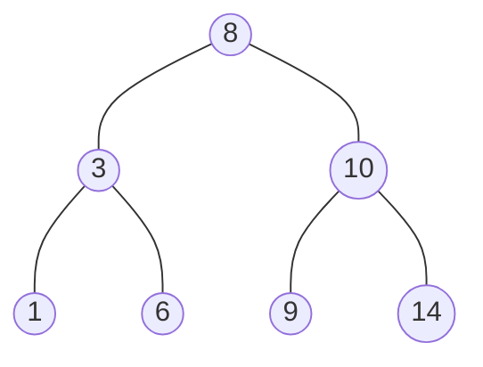
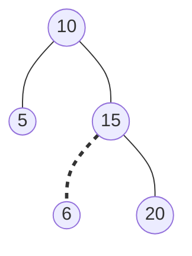

# Binary Search Trees

A **binary search tree (BST)** is a binary tree carrying one extra promise about
where values live. For every node in the tree:

```text
every value in the left subtree   <  node.val
every value in the right subtree  >  node.val
```

The word **subtree** is what makes this interesting. The rule is not "the left
child is smaller and the right child is bigger", it is a statement about *every*
descendant on that side, however deep. A node near the root constrains thousands
of nodes it never touches directly



Read the root of that tree and you already know something about all six other
nodes: three of them are below 8 and three are above it. In a plain binary tree
the value 6 could be anywhere, so finding it means looking everywhere. Here, one
comparison against the root rules out half the tree without reading it

The structure that already does this is a sorted array, where
[binary search](../../05_binary_search/notes/01_binary_search_basics.md) finds a
value in `O(log n)` by halving a range. A sorted array pays for that with
insertion, because putting a new value in the middle shifts everything after it.
A BST is the same halving idea with the halves stored as *links* instead of as
index ranges, so inserting is a matter of attaching one node rather than moving
`n` of them

> This topic covers navigating by comparison, validating the invariant with
> inherited bounds, the sorted sequence that inorder traversal hands you for
> free, and the insert and delete operations that keep the invariant true

## Halving The Tree With One Comparison

Finding a value in a plain binary tree means visiting nodes until you hit it,
which is `O(n)`, because a value with no ordering rule behind it can sit in any
of the `n` positions. The BST rule removes the guesswork. At each node you
compare the target with `node.val` and exactly one of three things is true, so
you never have to explore both children

```python
from __future__ import annotations


class TreeNode:  # the shared node type from 01_fundamentals.md
    def __init__(
        self,
        val: int,
        left: TreeNode | None = None,
        right: TreeNode | None = None,
    ) -> None:
        self.val = val
        self.left = left
        self.right = right


def inorder_values(node: TreeNode | None) -> list[int]:
    if node is None:
        return []
    return inorder_values(node.left) + [node.val] + inorder_values(node.right)


def search_in_bst(root: TreeNode | None, val: int) -> TreeNode | None:
    node = root
    while node is not None:
        if val < node.val:
            node = node.left
        elif val > node.val:
            node = node.right
        else:
            return node
    return None


sample = TreeNode(4, TreeNode(2, TreeNode(1), TreeNode(3)), TreeNode(7))
found = search_in_bst(sample, 2)
assert found is not None and inorder_values(found) == [1, 2, 3]
assert search_in_bst(sample, 5) is None
assert search_in_bst(None, 5) is None
```

The problem returns the whole **subtree** rooted at the match rather than the
value, which is why the assert checks its contents instead of one integer. A BST
node and the subtree hanging off it are the same object

Notice there is no recursion here. Search never needs to come back up, because
the answer is wherever the descent lands, so a `while` loop that reassigns `node`
does the job in `O(1)` space. That is the first thing to say out loud when an
interviewer asks about space

Tracing a lookup for 6 in the seven-node tree above shows what "discard" means
concretely:

```text
at 8    6 < 8     go left, and the entire right subtree (10, 9, 14) is discarded
at 3    6 > 3     go right, and 1 is discarded
at 6    6 == 6    found
```

Three nodes were read and four were never touched. A lookup for 5 walks the same
first two steps, then finds `6.left` is `None` and returns `None`, because
reaching a missing child means the value cannot be anywhere else in the tree

## Pruning A Whole Subtree By Its Range

The same comparison that picks a direction can also delete a direction. If a node's
value is already below the range you care about, its entire left subtree is below
the range too, because every value there is smaller than the node's. That whole
side can be skipped without being read

That single observation solves both
[Range Sum of BST](https://leetcode.com/problems/range-sum-of-bst/) and
[Trim a Binary Search Tree](https://leetcode.com/problems/trim-a-binary-search-tree/),
which look different but share a skeleton: out of range on the low side means
recurse right only, out of range on the high side means recurse left only, and in
range means handle both children

```python
def range_sum_bst(root: TreeNode | None, low: int, high: int) -> int:
    if root is None:
        return 0
    if root.val < low:
        return range_sum_bst(root.right, low, high)
    if root.val > high:
        return range_sum_bst(root.left, low, high)
    return root.val + range_sum_bst(root.left, low, high) + range_sum_bst(root.right, low, high)


def trim_bst(root: TreeNode | None, low: int, high: int) -> TreeNode | None:
    if root is None:
        return None
    if root.val < low:
        return trim_bst(root.right, low, high)
    if root.val > high:
        return trim_bst(root.left, low, high)
    root.left = trim_bst(root.left, low, high)
    root.right = trim_bst(root.right, low, high)
    return root


in_range = TreeNode(10, TreeNode(5, TreeNode(3), TreeNode(7)), TreeNode(15, None, TreeNode(18)))
assert range_sum_bst(in_range, 7, 15) == 32
assert range_sum_bst(None, 1, 5) == 0

to_trim = TreeNode(3, TreeNode(0, None, TreeNode(2, TreeNode(1))), TreeNode(4))
trimmed = trim_bst(to_trim, 1, 3)
assert inorder_values(trimmed) == [1, 2, 3]
assert trimmed is not None and trimmed.right is None
assert trim_bst(None, 1, 3) is None
```

`trim_bst` returns a node rather than mutating in place, and that return value is
the whole trick. When a node falls out of range, the function returns the trimmed
version of the surviving side, and the caller's `root.left = trim_bst(...)` line
splices that survivor in as a direct child. Nodes get promoted several levels up
without any parent pointer being involved. In the assert above, 0 is below the
range and is dropped, so its right subtree containing 2 and 1 is what gets
returned and attached in its place

One thing to say before writing either function is that pruning does not change
the worst case:

> "Pruning skips subtrees that cannot contribute, but if the whole tree sits
> inside the range then nothing is skipped, so this is `O(n)` worst case and only
> faster in practice."

## Why Comparing A Node To Its Two Children Is Not Enough

The obvious way to check whether a tree is a valid BST is to walk it and confirm
at each node that the left child is smaller and the right child is bigger. It is
a local check, it is easy to write, and it accepts trees that are not BSTs

```python
def children_look_ok(node: TreeNode | None) -> bool:
    if node is None:
        return True
    if node.left is not None and node.left.val >= node.val:
        return False
    if node.right is not None and node.right.val <= node.val:
        return False
    return children_look_ok(node.left) and children_look_ok(node.right)


not_a_bst = TreeNode(10, TreeNode(5), TreeNode(15, TreeNode(6), TreeNode(20)))
assert children_look_ok(not_a_bst) is True  # and yet this tree is not a BST
assert children_look_ok(TreeNode(2, TreeNode(1), TreeNode(3))) is True
assert children_look_ok(None) is True
```

Here is the tree it wrongly accepts, with the offending edge dashed:



Every parent-child pair is fine. At the root, 5 is less than 10 and 15 is greater
than 10. At node 15, 6 is less than 15 and 20 is greater than 15. But 6 lives in
the *right* subtree of 10 while being smaller than 10, which breaks the rule for
subtrees. Searching for 6 would compare it against 10, go left, and never find
it, which is exactly the failure the invariant exists to prevent

The reason the local check fails points straight at the fix. Node 6 is illegal
because of an ancestor two levels up that it never gets compared against, so each
node has to know the range its ancestors have already committed it to. Carry that
range down as two bounds. Every left move tightens the upper bound to the current
value, and every right move raises the lower bound to it

```python
def validate_bst(root: TreeNode | None) -> bool:
    def within(node: TreeNode | None, low: float, high: float) -> bool:
        if node is None:
            return True
        if not low < node.val < high:
            return False
        return within(node.left, low, node.val) and within(node.right, node.val, high)

    return within(root, float("-inf"), float("inf"))


assert validate_bst(TreeNode(2, TreeNode(1), TreeNode(3))) is True
assert validate_bst(not_a_bst) is False
assert validate_bst(None) is True
assert validate_bst(TreeNode(1)) is True
```

**Three lines decide whether this is correct**:

- `float("-inf")` and `float("inf")` start the root off unconstrained, since the
  root has no ancestors and therefore no inherited limits. An interviewer may ask
  what happens with `2^31 - 1` in the tree, and the answer is that infinities have
  no such ceiling, unlike hardcoding a large integer
- `low < node.val < high` is strict on both sides, because the LeetCode definition
  of a BST admits no duplicates, so a value equal to an ancestor is a violation
  rather than a tie
- `within(node.left, low, node.val)` passes `node.val` as the new **upper** bound
  and keeps `low` unchanged, which is the line people invert. Going left cannot
  raise the floor, since nothing about moving to smaller values tells you anything
  new about how small is allowed

## Dry Run: Bounds Catching A Distant Violation

Running `validate_bst` on the invalid tree above, with the bound pair shown at
each call:

```text
node 10   bounds (-inf, inf)    ok
node 5    bounds (-inf, 10)     ok
None      bounds (-inf, 5)      ok, empty subtree
None      bounds (5, 10)        ok, empty subtree
node 15   bounds (10, inf)      ok
node 6    bounds (10, 15)       REJECTED, 6 is not greater than 10
```

The last two lines are the whole point. Moving right from 10 raised the floor to
10 and left the ceiling at infinity, then moving left from 15 lowered the ceiling
to 15 while the floor stayed at 10. Node 6 arrives holding a range it was never
compared against locally, fails the lower bound, and short-circuits the whole
call chain back to `False` — node 20 is never even visited

The rejection also shows why the recursion returns a boolean rather than
collecting anything. As soon as one node is out of bounds the answer is settled,
so `and` stops the traversal early

The rival approach is to run an inorder traversal into a list and check the list
is strictly increasing. That is correct and easy to explain, and it costs `O(n)`
extra space for the list where the bounds version costs only the `O(h)` call
stack. Mention it, then say why you are not using it

## Inorder Traversal Is The Sorted Order

Take the [inorder traversal](02_dfs.md) of a BST, meaning left subtree, then
node, then right subtree, and the values come out sorted ascending. That follows
directly from the invariant, because at every node inorder emits everything
smaller than it first, then it, then everything larger. Nothing is sorted at
runtime — the sortedness is the tree's shape being read out

This turns several problems into "walk the sorted sequence and stop when you have
what you need". For
[Kth Smallest Element in a BST](https://leetcode.com/problems/kth-smallest-element-in-a-bst/)
the useful form is the iterative one, because it can return the moment the count
runs out instead of traversing the rest of the tree

```python
def kth_smallest(root: TreeNode | None, k: int) -> int:
    stack: list[TreeNode] = []
    node = root
    while node is not None or stack:
        while node is not None:
            stack.append(node)
            node = node.left
        node = stack.pop()
        k -= 1
        if k == 0:
            return node.val
        node = node.right
    return -1


assert kth_smallest(TreeNode(3, TreeNode(1, None, TreeNode(2)), TreeNode(4)), 1) == 1
big = TreeNode(5, TreeNode(3, TreeNode(2, TreeNode(1)), TreeNode(4)), TreeNode(6))
assert kth_smallest(big, 3) == 3
assert kth_smallest(None, 1) == -1
```

The inner `while` pushes the **left spine**, meaning the chain of leftmost
descendants, so the smallest unvisited value ends up on top of the stack. Popping
visits it, and moving to `node.right` queues up whatever comes next in sorted
order. Tracing `k = 3` on the second tree:

```text
push 5     stack=[5]
push 3     stack=[5, 3]
push 2     stack=[5, 3, 2]
push 1     stack=[5, 3, 2, 1]
pop 1      k now 2      stack=[5, 3, 2]
pop 2      k now 1      stack=[5, 3]
pop 3      k now 0      stack=[5]     return 3
```

The abandoned work is what makes the iterative version worth writing. Node 5 was
pushed on the first step and is still sitting on the stack when the function
returns, and 4 and 6 were never pushed at all. A recursive inorder that appends
every value to a list would have visited all six nodes before answering. This
version costs `O(h + k)`, and if the interviewer follows up with "what if the tree
is modified often and this is called repeatedly", the answer is to store a subtree
size on each node so the descent can skip counted subtrees

**Two more problems are the same walk with different bookkeeping**:

- [Recover Binary Search Tree](https://leetcode.com/problems/recover-binary-search-tree/)
  has exactly two nodes swapped, so the sorted sequence has one or two places
  where it goes down instead of up. Keep a `prev` pointer during inorder and
  record every descent
- [Convert BST to Greater Tree](https://leetcode.com/problems/convert-bst-to-greater-tree/)
  needs each node increased by the sum of everything larger, so run inorder
  **backwards** as right, node, left, which walks the values in descending order
  and lets one running total accumulate before it is applied

```python
def recover_tree(root: TreeNode | None) -> None:
    first: TreeNode | None = None
    second: TreeNode | None = None
    prev: TreeNode | None = None
    stack: list[TreeNode] = []
    node = root
    while node is not None or stack:
        while node is not None:
            stack.append(node)
            node = node.left
        node = stack.pop()
        if prev is not None and prev.val > node.val:
            if first is None:
                first = prev
            second = node
        prev = node
        node = node.right
    if first is not None and second is not None:
        first.val, second.val = second.val, first.val


def convert_bst(root: TreeNode | None) -> TreeNode | None:
    total = 0

    def visit(node: TreeNode | None) -> None:
        nonlocal total
        if node is None:
            return
        visit(node.right)
        total += node.val
        node.val = total
        visit(node.left)

    visit(root)
    return root


apart = TreeNode(1, TreeNode(3, None, TreeNode(2)))
recover_tree(apart)
assert inorder_values(apart) == [1, 2, 3]

adjacent = TreeNode(3, TreeNode(1), TreeNode(4, TreeNode(2)))
recover_tree(adjacent)
assert inorder_values(adjacent) == [1, 2, 3, 4]

lone = TreeNode(1)
recover_tree(lone)
assert inorder_values(lone) == [1]

greater = TreeNode(2, TreeNode(1), TreeNode(3))
convert_bst(greater)
assert inorder_values(greater) == [6, 5, 3]
assert convert_bst(None) is None
```

`first` is assigned only when it is still `None`, and `second` is overwritten
every time, and that asymmetry is the one thing to get right in `recover_tree`.
When the two swapped nodes are adjacent in sorted order there is a single descent
and both culprits come from it, so `first` takes the larger side and `second` the
smaller. When they are far apart there are two separate descents, and the answer
is the larger value from the first descent paired with the smaller value from the
last one. Keeping the first `first` and the last `second` covers both cases with
no special casing, which is why the two assignments are guarded differently

## Splitting Point: Lowest Common Ancestor In A BST

For a general binary tree, finding the lowest common ancestor means searching both
subtrees and combining what comes back. A BST makes it a descent, because the
values tell you which side each target is on before you look

Walk down from the root. If both targets are smaller than the current node, the
answer is somewhere left. If both are larger, it is right. The moment they
straddle the current node, or one of them *is* the current node, you are standing
on the split point and that node is the answer, because going any further in
either direction would leave one target behind

```python
def lowest_common_ancestor_bst(
    root: TreeNode | None, p: TreeNode, q: TreeNode
) -> TreeNode | None:
    node = root
    while node is not None:
        if p.val < node.val and q.val < node.val:
            node = node.left
        elif p.val > node.val and q.val > node.val:
            node = node.right
        else:
            return node
    return None


n3, n5 = TreeNode(3), TreeNode(5)
n4 = TreeNode(4, n3, n5)
n2 = TreeNode(2, TreeNode(0), n4)
n8 = TreeNode(8, TreeNode(7), TreeNode(9))
n6 = TreeNode(6, n2, n8)
assert lowest_common_ancestor_bst(n6, n2, n8) is n6
assert lowest_common_ancestor_bst(n6, n2, n4) is n2
assert lowest_common_ancestor_bst(None, n2, n4) is None
```

The `else` branch quietly handles the case where one node is an ancestor of the
other. With `p = 2` and `q = 4`, node 2 fails both the "both smaller" and "both
larger" tests, since 2 is not less than itself, so it is returned. A node is
allowed to be its own ancestor in this problem, and writing the conditions as two
positive tests with a catch-all `else` gets that for free

## Inorder Successor Without A Parent Pointer

The **inorder successor** of a node is the next value in sorted order, which is
the smallest value in the tree that is still larger than it. When the node has a
right child the answer is easy, since the smallest thing bigger than it is the
leftmost node of that right subtree. When it has no right child the successor is
an ancestor, and with no parent pointers you cannot walk up to find it

The way around that is to record candidates on the way down. Descend from the
root as if searching. Every time you move **left**, the node you are leaving is
larger than the target and is the best candidate seen so far, so remember it.
Every time you move right, the node you are leaving is too small to be a
successor, so remember nothing

```python
def inorder_successor(root: TreeNode | None, p: TreeNode) -> TreeNode | None:
    successor: TreeNode | None = None
    node = root
    while node is not None:
        if p.val < node.val:
            successor = node
            node = node.left
        else:
            node = node.right
    return successor


tiny = TreeNode(2, TreeNode(1), TreeNode(3))
assert inorder_successor(tiny, tiny.left) is tiny
spine = TreeNode(5, TreeNode(3, TreeNode(2, TreeNode(1)), TreeNode(4)), TreeNode(6))
assert inorder_successor(spine, spine.left).val == 4
assert inorder_successor(spine, spine.right) is None
```

Each left move overwrites the previous candidate with a smaller one, so the final
`successor` is the tightest ancestor above the target. The last assert is the edge
case interviewers ask for, where the target is the maximum of the tree, the
descent only ever moves right, nothing is ever recorded, and `None` is correctly
returned

## Insert Descends To A Missing Child

Inserting is search that keeps going until it falls off the tree. Wherever the
descent finds a `None` child is exactly where the new value belongs, because that
is the only spot reachable by the comparisons the value satisfies

```python
def insert_into_bst(root: TreeNode | None, val: int) -> TreeNode:
    if root is None:
        return TreeNode(val)
    if val < root.val:
        root.left = insert_into_bst(root.left, val)
    else:
        root.right = insert_into_bst(root.right, val)
    return root


target = TreeNode(4, TreeNode(2, TreeNode(1), TreeNode(3)), TreeNode(7))
insert_into_bst(target, 5)
assert inorder_values(target) == [1, 2, 3, 4, 5, 7]
assert target.right.left is not None and target.right.left.val == 5
assert insert_into_bst(None, 5).val == 5
```

**The `root.left = insert_into_bst(root.left, val)` line is the idiom to
internalise**, and it recurs in `trim_bst` above and in delete below. The
recursive call returns the root of the rebuilt subtree, which is the same node it
was given in every case except one: when the subtree was empty, it returns a
brand-new node. Assigning the result back is what attaches that new node.
Dropping the assignment and calling `insert_into_bst(root.left, val)` on its own
line compiles, runs, and silently does nothing when the insertion point is
reached, because the new node is returned to a caller that throws it away

The `else` branch sends equal values right, which is a convention rather than a
rule. State it out loud, since it is a genuine ambiguity in the problem

Building a BST from scratch inverts the same idea.
[Convert Sorted Array to BST](https://leetcode.com/problems/convert-sorted-array-to-binary-search-tree/)
asks for a **height-balanced** tree, meaning the two subtrees of every node differ
in height by at most one, and inserting the sorted values one at a time would
produce a straight line instead, since each value is larger than everything
already placed. Take the middle element as the root instead, which splits the
remaining values into two halves of nearly equal size, and recurse on each half

```python
def convert_sorted_array_to_bst(nums: list[int]) -> TreeNode | None:
    def build(lo: int, hi: int) -> TreeNode | None:
        if lo > hi:
            return None
        mid = (lo + hi) // 2
        node = TreeNode(nums[mid])
        node.left = build(lo, mid - 1)
        node.right = build(mid + 1, hi)
        return node

    return build(0, len(nums) - 1)


balanced = convert_sorted_array_to_bst([-10, -3, 0, 5, 9])
assert balanced is not None and balanced.val == 0
assert inorder_values(balanced) == [-10, -3, 0, 5, 9]
assert convert_sorted_array_to_bst([]) is None
```

The indices are inclusive on both ends, so `lo > hi` is the empty range and the
two recursive calls exclude `mid` by stepping over it. Because each call halves
its range, the depth is `O(log n)` and the result is balanced by construction

## Worked Example: [Delete Node in a BST](https://leetcode.com/problems/delete-node-in-a-bst/)

Remove the node holding a given key from a BST and return the root of the
resulting tree, which must still be a valid BST. If no node holds that key, the
tree comes back unchanged

**Input**:

- `root`, a `TreeNode | None`, the root of a valid BST whose values are unique,
  and which may be empty
- `key`, an `int`, the value to remove, which is not guaranteed to be present in
  the tree

**Output**: a `TreeNode | None`, the root of the tree after the deletion. It is
the same object as the input root in most cases, but not always, since deleting
the root itself returns a different node, and deleting the only node in a
one-node tree returns `None`. The values remaining must be exactly the input
values minus `key`, and the ordering invariant must still hold everywhere

The phrase that identifies the technique is "the result must still be a valid
BST", which rules out simply detaching the node. Detaching a node with two
children orphans both subtrees, and reinserting all of their values one by one to
repair the tree costs `O(n log n)` and rebuilds parts that were already correct.
The cheap fix is to notice that only *one* value has to move. Overwrite the
doomed node's value with a value that is legal in that position, then delete that
value from where it used to live, which is a strictly easier deletion

Exactly two values are legal in the vacated slot: the inorder successor, which is
the smallest value in the right subtree, and the inorder predecessor, which is the
largest in the left. Either one sits immediately next to the deleted value in
sorted order, so nothing on either side is disturbed

> "The node with two children is the only hard case. I will copy in its inorder
> successor, which is the leftmost node of the right subtree, then recursively
> delete that successor from the right subtree. The successor has no left child by
> definition, so that second deletion is guaranteed to hit an easy case and cannot
> recurse again."

Therefore,

1. If the tree is empty, return `None`, because there is nothing to delete and the
   caller's assignment then correctly records an empty subtree
2. Compare `key` against `root.val` and descend the same way search does, since
   the ordering guarantees the key cannot be on the other side. Assign the
   recursive result back with `root.left = delete(root.left, key)`, because the
   subtree you are handing off may come back with a different root
3. At the matching node, check for a missing left child first, and if there is
   none, return `root.right`. That covers both the leaf case and the
   one-child-on-the-right case in a single line, since `root.right` is `None` for
   a leaf
4. Symmetrically, if the right child is missing, return `root.left`, which
   promotes the surviving side into the deleted node's position
5. With both children present, walk to the leftmost node of the right subtree by
   following `left` links until there are none. That node holds the smallest value
   larger than the one being deleted, so it is the successor
6. Copy the successor's value into the current node. The node object stays where
   it is and only its payload changes, so every parent link and both subtrees stay
   attached
7. Delete the successor's value from the right subtree with a recursive call, and
   assign the result to `root.right`. That call cannot reach the two-children case
   again, because the successor is a leftmost node and therefore has no left child
8. Return `root` so the caller can reattach this subtree, which is what makes the
   whole chain of assignments in step 2 work

```python
def delete_node_bst(root: TreeNode | None, key: int) -> TreeNode | None:
    if root is None:
        return None
    if key < root.val:
        root.left = delete_node_bst(root.left, key)
    elif key > root.val:
        root.right = delete_node_bst(root.right, key)
    else:
        if root.left is None:
            return root.right
        if root.right is None:
            return root.left
        successor = root.right
        while successor.left is not None:
            successor = successor.left
        root.val = successor.val
        root.right = delete_node_bst(root.right, successor.val)
    return root


def make_tree() -> TreeNode:  # [5, 3, 6, 2, 4, null, 7]
    return TreeNode(5, TreeNode(3, TreeNode(2), TreeNode(4)), TreeNode(6, None, TreeNode(7)))


two_children = delete_node_bst(make_tree(), 3)
assert two_children is not None and inorder_values(two_children) == [2, 4, 5, 6, 7]
assert two_children.left is not None and two_children.left.val == 4
assert two_children.left.right is None

assert inorder_values(delete_node_bst(make_tree(), 0)) == [2, 3, 4, 5, 6, 7]
assert delete_node_bst(None, 0) is None
assert delete_node_bst(TreeNode(1), 1) is None
```

The trace for `delete_node_bst(root, 3)` on that tree, indented by recursion
depth:

```text
at 5   3 < 5, go left        the right subtree (6, 7) is discarded, never read
  at 3   match, two children
         successor = leftmost of right subtree = 4
         overwrite 3 with 4
    at 4   match under the recursive call to remove the successor
           no left child, so return its right child, which is None
result   [5, [4, [2], None], [6, None, [7]]]
```

The discarded right subtree in the first line is the ordering doing its job. Node
6 and node 7 cannot hold the key 3 and cannot be affected by its removal, so they
are neither compared nor rebuilt. The second thing to notice is the innermost
call, where the successor 4 turned out to be a leaf and hit the easy case
immediately, which is guaranteed rather than lucky

- **Time Complexity:** `O(h)`, where `h` is the height of the tree, because the
  descent to the key visits one node per level, the walk to the successor descends
  the left spine of the right subtree without ever going back up, and the two
  together are bounded by the height. That is `O(log n)` on a balanced tree and
  `O(n)` on a tree that degenerates into a chain
- **Space Complexity:** `O(h)` for the recursion stack, because one frame is open
  per level of the descent and nothing else is allocated. An iterative version
  that tracks the parent pointer manually brings this to `O(1)`, and it is worth
  naming as the follow-up

## Time and Space Complexity

Throughout, `n` is the number of nodes and `h` is the height of the tree, so
`h = O(log n)` when the tree is balanced and `h = O(n)` when it is a chain. Nothing
in this topic keeps a tree balanced, so quoting `O(log n)` without stating the
assumption is a correctness error rather than a rounding one

**Operations that follow one path down**

| Operation                                                          | Time                                                                                                     | Space                                                                                                                                             |
| ------------------------------------------------------------------ | -------------------------------------------------------------------------------------------------------- | ------------------------------------------------------------------------------------------------------------------------------------------------- |
| `search_in_bst`, `lowest_common_ancestor_bst`, `inorder_successor` | `O(h)`: one comparison rules out an entire subtree, so exactly one node is read per level                | `O(1)`: the loop reassigns a single `node` variable and never needs to return upward                                                              |
| `insert_into_bst`                                                  | `O(h)`: the descent stops at the first missing child, which is at most `h` levels down                   | `O(h)` as written, since each level holds a recursion frame open to reattach the result, and `O(1)` if rewritten as a loop that tracks the parent |
| `delete_node_bst`                                                  | `O(h)`: the descent to the key plus the walk down the successor's left spine, both bounded by the height | `O(h)`: one recursion frame per level of the descent                                                                                              |
| Searching the same tree ignoring the ordering                      | `O(n)`: with no rule about where a value lives, every node is a candidate and must be visited            | `O(h)`: the traversal still only holds one root-to-node path at a time                                                                            |

**Operations that touch many nodes**

| Operation                                    | Time                                                                                                                                  | Space                                                                                                                                       |
| -------------------------------------------- | ------------------------------------------------------------------------------------------------------------------------------------- | ------------------------------------------------------------------------------------------------------------------------------------------- |
| `validate_bst`                               | `O(n)`: every node must be checked against its inherited bounds, though a violation short-circuits the rest                           | `O(h)`: only the call stack, since the bounds are two numbers passed down rather than a stored collection                                   |
| Validating by collecting inorder into a list | `O(n)`: same single traversal, then one linear scan to confirm the list increases                                                     | `O(n)`: the list holds every value at once, which is the reason to prefer the bounds version                                                |
| `kth_smallest`                               | `O(h + k)`: pushing the left spine costs `h`, then each of the `k` pops does `O(1)` work before returning early                       | `O(h)`: the stack never holds more than one root-to-node path of ancestors                                                                  |
| `range_sum_bst`, `trim_bst`                  | `O(n)` worst case: pruning skips out-of-range subtrees, but a range covering the whole tree prunes nothing                            | `O(h)`: the recursion stack, and `trim_bst` rewires existing nodes rather than allocating new ones                                          |
| `convert_bst`, `recover_tree`                | `O(n)`: both need the complete sorted sequence, since a running total and a pair of out-of-order nodes can only be settled at the end | `O(h)`: the call stack for `convert_bst`, and the explicit stack for `recover_tree`                                                         |
| `convert_sorted_array_to_bst`                | `O(n)`: one node is constructed per element, and the index arithmetic per call is constant                                            | `O(n)` for the tree it returns, plus `O(log n)` of stack, because halving the range at each level makes the result balanced by construction |

## Summary

- A **binary search tree** is a binary tree where, for every node, every value in
  its left subtree is smaller and every value in its right subtree is larger. The
  rule covers whole subtrees rather than just the two children, which is what lets
  one comparison at the root eliminate half the remaining nodes
  - Think of it as a sorted array whose halves are joined by links instead of
    index ranges, which is why lookup stays `O(log n)` on a balanced tree while
    insertion avoids shifting anything
- The signal that a problem wants BST reasoning is that the input is stated to be
  a binary search tree, or that the question involves a value range, a rank such as
  "kth smallest", or a next/previous value. If the same problem were posed on an
  unordered tree it would need a full traversal, and the ordering is what removes it
- Navigation is a loop, not a recursion. Search, lowest common ancestor, and
  inorder successor all compare against the current node, move to one child, and
  never come back up, so they run in `O(1)` extra space
  - Lowest common ancestor is the first node where the two targets stop agreeing
    on a direction, and a node counts as its own ancestor, which the catch-all
    `else` branch handles without a special case
  - Inorder successor records a candidate on every left move and discards nothing
    on a right move, because only a node you turned left at can be larger than the
    target
- Validation cannot be done locally. Comparing each node with its two children
  accepts trees like root 10 with 15 on the right holding a left child of 6, where
  every pair is fine but 6 is on the wrong side of 10 entirely
  - Carry an inherited `(low, high)` range instead, tightening the high bound on
    every left move and the low bound on every right move, starting the root at
    negative and positive infinity so no integer in the tree can overflow the bound
  - Both comparisons are strict, since the standard BST definition permits no
    duplicate values
- **Inorder traversal of a BST emits the values in sorted order**, because at each
  node it emits everything smaller, then the node, then everything larger. That one
  fact solves kth smallest by counting pops, recover-BST by finding where the
  sequence descends, and convert-to-greater-tree by running the traversal backwards
  as right, node, left with a running total
  - The iterative form with an explicit stack is worth the extra lines for kth
    smallest, since it stops at the kth pop and costs `O(h + k)` instead of the
    `O(n)` a full recursive traversal would spend
- Insert walks down to the first missing child and attaches a node there, and
  delete replaces a two-child node's value with its inorder successor and then
  deletes that successor, which is guaranteed to be an easier case because a
  leftmost node has no left child
  - Both rely on `root.left = f(root.left, ...)`, where the recursive call returns
    the possibly-new root of that subtree. Calling the function without assigning
    the result back runs cleanly and changes nothing, which is the most easily
    missed bug in this topic
- Every bound here is in terms of `h`, the height, and none of these operations
  rebalance the tree. Inserting sorted values one at a time produces a chain where
  `h = n` and every operation degrades to `O(n)`, which is why building from a
  sorted array takes the middle element as the root instead

## Interview Checklist

Before writing code, make sure you can answer each of these

```text
Is the input guaranteed to be a valid BST, or is checking that the actual task?
Can I answer this by descending one path, or does it need every node visited?
Am I claiming O(log n) when I mean O(h), and have I said what makes h that small?
For validation: am I carrying ancestor bounds rather than comparing to children?
Which bound does a left move tighten, and which does a right move tighten?
Does the problem allow duplicate values, and if so which side do ties go to?
Would inorder order, or reverse inorder order, hand me the answer directly?
Can I stop the traversal early, and does the iterative form make that possible?
Am I assigning the recursive result back to root.left or root.right?
For delete: which of the three child cases am I in, and who fills the hole?
Is the successor I picked guaranteed to have no left child of its own?
What is returned for an empty tree, and for a key that is not present?
```
