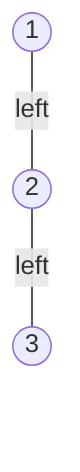
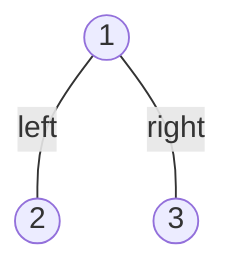
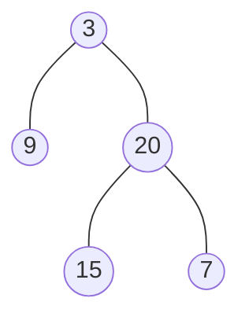

# Tree Construction

A traversal flattens a tree into a list. **Construction** runs that arrow
backwards: you are handed one or two flat lists, and you have to return the root
of a real linked structure of `TreeNode` objects whose traversal reproduces those
lists. Nothing about the tree is given to you as a shape. The shape is something
you have to recover from ordering alone

The reason this is doable at all is that a **traversal order is a rule about
where the root sits relative to its subtrees**. [Preorder, inorder, and
postorder](02_dfs.md) each put the root in a different place: first, between the
two subtrees, or last. Knowing where the root sits inside a list is knowing where
to cut the list

So every construction problem, however it is dressed up, is the same two
questions asked once per recursive call:

```text
1. Which value is the root of this subtree?
2. Which part of the input belongs to its left subtree, and which to its right?
```

Answer those two and the recursion writes itself, because each part is a smaller
instance of the identical problem. Different problems answer the two questions
with different signals, and recognizing which signal a problem hands you is the
whole skill

## Why Preorder Alone Describes More Than One Tree

The tempting first idea is that one traversal is enough. Preorder starts with the
root, so read the list left to right, make the first value the root, and hang the
rest underneath as you go

That dies immediately, and the counterexample is three nodes. Both of these trees
have preorder `1, 2, 3`:





In the first, `3` is the left child of `2`. In the second, `3` is the right child
of `1`. Preorder cannot tell them apart, because preorder emits the root, then
the entire left subtree, then the entire right subtree, and it never says *how
long* the left subtree run is. When you are standing at `1` and looking at
`[2, 3]`, the left subtree could be `[2, 3]` or just `[2]`, and both readings are
legal

That is the exact gap to fill. You do not need more values, you need the **size
of the left subtree**, because once you know the left subtree occupies the next
`k` values of preorder, everything after those `k` values is the right subtree
and the ambiguity is gone. Every technique in this topic is a different way of
recovering that one number

## Inorder Says Where The Root Splits The Values

Inorder emits the entire left subtree, then the root, then the entire right
subtree. So the position of the root inside inorder *is* the size of the left
subtree, read off directly

Take LeetCode's example, `preorder = [3, 9, 20, 15, 7]` and
`inorder = [9, 3, 15, 20, 7]`:

```text
preorder   3 | 9 | 20 15 7          3 comes first, so 3 is the root
             ^   ^^^^^^^^

inorder    9 | 3 | 15 20 7          3 sits at index 1 of inorder
           ^       ^^^^^^^^
        1 value            3 values
        on the left        on the right
```

One value sits to the left of `3` in inorder, so the left subtree holds exactly
one node, so it consumes exactly one value of preorder. That resolves the
ambiguity of the previous section, and it resolves it at every level, because
each subtree's slice of inorder has the same property with respect to its own
root

The two lists play different roles and it is worth keeping them straight:

```text
preorder    tells you WHICH value is the root of the current subtree
inorder     tells you HOW MANY values fall on each side of that root
```

## Range Recursion, And Why Slicing Is Quadratic

The first version people write copies the slices. Find the root in inorder with
`inorder.index(root)`, then recurse on `preorder[1:k+1]` and `inorder[:k]`, and so
on. It is correct, and it is the version to mention and then reject out loud,
because it wastes work in two separate ways

- `inorder.index(root)` is a linear scan, so it costs `O(n)` per call, and with
  `n` calls that alone is `O(n²)`
- Each slice **copies** the values into a fresh list, so a call handling `m`
  values does `O(m)` copying. Every level of the tree copies about `n` values in
  total, and there are `h` levels, giving `O(n · h)` time and `O(n · h)` extra
  memory, which is `O(n²)` on a skewed tree

Both problems have the same fix, which is to stop moving data and instead pass
the **boundaries** of the region you are working on. This is the same move that
turns a list into a queue by advancing an index instead of shifting elements,
covered in [queues and deques](../../03_stacks_and_queues/notes/02_queue_and_deque.md)

Two changes get you there:

- Precompute a **value-to-index map** over inorder once, so finding a root's
  position is a single [hash lookup](../../01_arrays_and_hashing/notes/02_hashing.md)
  in `O(1)` instead of a scan. This is why the problem statements promise
  distinct values, since a duplicate would make the position ambiguous
- Pass `lo` and `hi`, a pair of indices into the original inorder list, instead of
  a sub-list. An empty subtree is then the condition `lo > hi`, which needs no
  allocation at all

The preorder side needs no range, only a single shared cursor. Preorder visits
root, then the whole left subtree, then the whole right subtree, and that is
exactly the order in which this recursion creates nodes, so the next value the
recursion needs is always the next unconsumed value of preorder. One counter
tracks it

```python
class TreeNode:
    """The shared binary tree node from 01_fundamentals, repeated so this block runs."""

    def __init__(
        self,
        val: int = 0,
        left: "TreeNode | None" = None,
        right: "TreeNode | None" = None,
    ) -> None:
        self.val = val
        self.left = left
        self.right = right


def shape(node: TreeNode | None) -> tuple | None:
    """(value, left, right) nesting, so the asserts below can name a whole tree."""
    if node is None:
        return None
    return (node.val, shape(node.left), shape(node.right))


def construct_from_preorder_inorder(preorder: list[int], inorder: list[int]) -> TreeNode | None:
    position = {value: i for i, value in enumerate(inorder)}
    cursor = 0

    def build(lo: int, hi: int) -> TreeNode | None:
        nonlocal cursor
        if lo > hi:
            return None
        value = preorder[cursor]
        cursor += 1
        mid = position[value]
        node = TreeNode(value)
        node.left = build(lo, mid - 1)
        node.right = build(mid + 1, hi)
        return node

    return build(0, len(inorder) - 1)


assert shape(construct_from_preorder_inorder([3, 9, 20, 15, 7], [9, 3, 15, 20, 7])) == (
    3,
    (9, None, None),
    (20, (15, None, None), (7, None, None)),
)
assert shape(construct_from_preorder_inorder([-1], [-1])) == (-1, None, None)
assert construct_from_preorder_inorder([], []) is None
```

**The four lines that carry the algorithm**:

- `if lo > hi: return None` is the base case, and it fires when the inorder range
  is empty, meaning this child does not exist. It must come before the cursor is
  read, because an absent subtree consumes no preorder value at all
- `cursor += 1` happens immediately after reading, before either recursive call.
  If you advance it afterwards, the left subtree starts from the root's own value
  and builds a node that is already placed
- `mid = position[value]` is read before recursing, since `cursor` changes during
  the recursive calls while `mid` must keep describing this root
- `node.left` is built **before** `node.right`, and this ordering is not
  cosmetic. The shared cursor makes the two calls order-dependent, since preorder
  lays the left subtree's values down first, so the left call has to be the one
  that consumes them

> "I will index inorder by value once up front, then recurse on index ranges
> rather than slices. Preorder is consumed by a single cursor, because the order
> this recursion creates nodes in is exactly preorder, so the next value I need is
> always the next one in the list. That makes it one pass, `O(n)`."

## Dry Run: Rebuilding From `[3, 9, 20, 15, 7]` And `[9, 3, 15, 20, 7]`

Each line is one call to `build`. `mid` is the root's index in inorder, and the
two ranges on the right are what it hands its children:

```text
build( 0, 4)  whole tree   root=3  cursor->1  mid=1  left=(0,0)  right=(2,4)
build( 0, 0)  left of 3    root=9  cursor->2  mid=0  left=(0,-1) right=(1,0)
build( 0,-1)  left of 9    empty range, return None, cursor stays 2
build( 1, 0)  right of 9   empty range, return None, cursor stays 2
build( 2, 4)  right of 3   root=20 cursor->3  mid=3  left=(2,2)  right=(4,4)
build( 2, 2)  left of 20   root=15 cursor->4  mid=2  left=(2,1)  right=(3,2)
build( 2, 1)  left of 15   empty range, return None, cursor stays 4
build( 3, 2)  right of 15  empty range, return None, cursor stays 4
build( 4, 4)  right of 20  root=7  cursor->5  mid=4  left=(4,3)  right=(5,4)
build( 4, 3)  left of 7    empty range, return None, cursor stays 5
build( 5, 4)  right of 7   empty range, return None, cursor stays 5
```

The discarded calls are the interesting ones. Line three asks for the left child
of `9` with the range `(0, -1)`, where `hi` has gone below `lo` because `9` sat at
index `0` of inorder and had nothing to its left. The call returns `None` and,
critically, **leaves the cursor at 2**. Had the base case been placed after
reading `preorder[cursor]`, that dead call would have eaten the `20`, and every
node built afterwards would be wrong while the code still ran to completion and
returned a tree

Notice also that `mid` can land on either end of its range. For `20` the range was
`(2, 4)` and `mid` came out as `3`, so both children exist. For `15` the range was
`(2, 2)`, a single slot, so `mid = 2` and both of its children were empty ranges.
A one-element range is always a leaf, since there is nothing left to split

The finished tree:



## Reading Roots From The Back With Postorder

Postorder emits left, right, root, so the root is the **last** value rather than
the first. Inorder still supplies the split, so only the source of roots changes.
Consume postorder from the end and walk the cursor backwards

There is one more change, and it is the line people lose points on. Working
backwards from the end of postorder, the value before the root is the root of the
**right** subtree, not the left, because postorder finishes the right subtree last
before writing the root. So the right child has to be built first

```python
def construct_from_inorder_postorder(inorder: list[int], postorder: list[int]) -> TreeNode | None:
    position = {value: i for i, value in enumerate(inorder)}
    cursor = len(postorder) - 1

    def build(lo: int, hi: int) -> TreeNode | None:
        nonlocal cursor
        if lo > hi:
            return None
        value = postorder[cursor]
        cursor -= 1
        mid = position[value]
        node = TreeNode(value)
        node.right = build(mid + 1, hi)
        node.left = build(lo, mid - 1)
        return node

    return build(0, len(inorder) - 1)


assert shape(construct_from_inorder_postorder([9, 3, 15, 20, 7], [9, 15, 7, 20, 3])) == (
    3,
    (9, None, None),
    (20, (15, None, None), (7, None, None)),
)
assert shape(construct_from_inorder_postorder([-1], [-1])) == (-1, None, None)
assert construct_from_inorder_postorder([], []) is None
```

Swapping those two lines back to left-then-right fails loudly on the five-node
input above, raising `IndexError` because the backwards cursor runs off the front
of the list. That is the friendly outcome. On the three-node input
`inorder = [9, 3, 20]` with `postorder = [9, 20, 3]` the same swap returns
`(3, (20, (9, None, (3, None, None)), None), (20, None, None))`, a five-node tree
built from three values, in which both `3` and `20` appear twice. That is a wrong
answer that runs cleanly to completion, which is the outcome to fear

## When The Split Is A Value Range Instead Of An Index Range

[Construct Binary Search Tree From Preorder Traversal](https://leetcode.com/problems/construct-binary-search-tree-from-preorder-traversal/)
hands you preorder and nothing else, which the first section said was not enough.
It is enough here because the tree is a [BST](05_bst.md), and a BST's inorder
traversal is its values in sorted order, so the second list is not missing, it is
implied

That gives a free two-line answer worth stating out loud: sort a copy of preorder
to get inorder, then hand both lists to `construct_from_preorder_inorder`
unchanged. It costs `O(n log n)` for the sort, and it is a completely valid
submission

The `O(n)` version drops inorder entirely and replaces the index range `(lo, hi)`
with a **value window** `(low, high)`, the open interval of values allowed in this
subtree. Everything in a left subtree is below its parent, and everything in a
right subtree is above, so descending left tightens `high` to the parent's value
and descending right tightens `low`. The next preorder value belongs to the
current subtree exactly when it falls inside the window, and when it does not,
this subtree is finished and the value belongs to some ancestor's other side

```python
def bst_from_preorder(preorder: list[int]) -> TreeNode | None:
    cursor = 0

    def build(low: float, high: float) -> TreeNode | None:
        nonlocal cursor
        if cursor == len(preorder) or not low < preorder[cursor] < high:
            return None
        value = preorder[cursor]
        cursor += 1
        node = TreeNode(value)
        node.left = build(low, value)
        node.right = build(value, high)
        return node

    return build(float("-inf"), float("inf"))


assert shape(bst_from_preorder([8, 5, 1, 7, 10, 12])) == (
    8,
    (5, (1, None, None), (7, None, None)),
    (10, None, (12, None, None)),
)
assert shape(bst_from_preorder([1, 3])) == (1, None, (3, None, None))
assert bst_from_preorder([]) is None
```

The rejections are what drive this one, so here are the calls for
`[8, 5, 1, 7, 10, 12]`, with the window on the left:

```text
(-inf, inf)  root         take 8, cursor->1
(-inf, 8)    left of 8    take 5, cursor->2
(-inf, 5)    left of 5    take 1, cursor->3
(-inf, 1)    left of 1    7 is outside the window -> None, cursor stays 3
(1, 5)       right of 1   7 is outside the window -> None, cursor stays 3
(5, 8)       right of 5   take 7, cursor->4
(5, 7)       left of 7    10 is outside the window -> None, cursor stays 4
(7, 8)       right of 7   10 is outside the window -> None, cursor stays 4
(8, inf)     right of 8   take 10, cursor->5
(8, 10)      left of 10   12 is outside the window -> None, cursor stays 5
(10, inf)    right of 10  take 12, cursor->6
(10, 12)     left of 12   preorder exhausted -> None
(12, inf)    right of 12  preorder exhausted -> None
```

Follow the `7`. It is rejected twice, once as the left child of `1` and once as
the right child of `1`, and each rejection returns `None` without moving the
cursor, which is what lets the same `7` be offered again one level up where the
window `(5, 8)` finally accepts it. A rejection here means "not mine, ask my
parent", and the recursion unwinding is the asking. The two `None` results at the
end come from the other guard, `cursor == len(preorder)`, since every value has
been placed and the remaining calls have nothing to consider

## When Nothing Hands You The Root At All

[Maximum Binary Tree](https://leetcode.com/problems/maximum-binary-tree/) gives a
single array with no traversal semantics. The rule is that the root of any
segment is its **maximum**, and the values left of that maximum form the left
subtree with the same rule applied again

There is no list of roots to consume, so there is no cursor. The range recursion
is otherwise identical, with the root located by scanning the current range
instead of read from a lookup table:

```python
def construct_maximum_binary_tree(nums: list[int]) -> TreeNode | None:
    def build(lo: int, hi: int) -> TreeNode | None:
        if lo > hi:
            return None
        mid = lo
        for i in range(lo + 1, hi + 1):
            if nums[i] > nums[mid]:
                mid = i
        node = TreeNode(nums[mid])
        node.left = build(lo, mid - 1)
        node.right = build(mid + 1, hi)
        return node

    return build(0, len(nums) - 1)


assert shape(construct_maximum_binary_tree([3, 2, 1, 6, 0, 5])) == (
    6,
    (3, None, (2, None, (1, None, None))),
    (5, (0, None, None), None),
)
assert shape(construct_maximum_binary_tree([3, 2, 1])) == (3, None, (2, None, (1, None, None)))
assert construct_maximum_binary_tree([]) is None
```

The scan is what costs you here. On an already-descending array like `[3, 2, 1]`
the maximum is always at the front, so every range is one shorter than the last
and the tree is a right-leaning chain, giving `O(n²)`. Say that out loud, then
offer the linear alternative: "the root of a segment is its maximum, and each
node's parent is the nearer of the closest greater value on its left and on its
right, which is what a
[monotonic stack](../../03_stacks_and_queues/notes/03_monotonic_stack.md)
computes in one pass."

[Convert Sorted Array To BST](https://leetcode.com/problems/convert-sorted-array-to-binary-search-tree/)
is the same section's idea with a different rule, and it is the one case where you
get to *choose* the root rather than deduce it. Any value in the range could be
the root and still leave a valid BST, since the array is already sorted, so pick
the midpoint `(lo + hi) // 2`, which splits the range into two halves whose sizes
differ by at most one and therefore produces a height-balanced tree. Picking `lo`
every time is also a legal BST and is a chain of `n` nodes, which is exactly the
answer the problem rejects

## Which Signal Splits The Input

Every problem in this topic is the same recursion with two slots filled in
differently. This is the table to run through when a construction problem looks
unfamiliar:

| Problem                     | Where the root comes from                              | Where the split comes from                                      |
| --------------------------- | ------------------------------------------------------ | --------------------------------------------------------------- |
| Preorder and inorder        | The next unconsumed preorder value, front to back      | The root's index in inorder, found through a value-to-index map |
| Inorder and postorder       | The next unconsumed postorder value, back to front     | The root's index in inorder, with the right child built first   |
| Preorder and postorder      | The next unconsumed preorder value, front to back      | The index of the *left child's* value inside postorder          |
| BST from preorder           | The next unconsumed preorder value                     | An open value window `(low, high)` rather than an index range   |
| Maximum Binary Tree         | The maximum inside the current index range             | The position of that maximum                                    |
| Convert Sorted Array To BST | Your choice, and the midpoint is the one that balances | The midpoint's index, splitting the range into equal halves     |

## Worked Example: [Construct Binary Tree From Preorder And Postorder Traversal](https://leetcode.com/problems/construct-binary-tree-from-preorder-and-postorder-traversal/)

You are given the preorder and postorder traversals of a binary tree whose values
are all distinct, and you must rebuild a tree that produces both. Neither list is
inorder, so the split has to be recovered some other way, and the answer is not
always unique

**Input**:

- `preorder`, a `list[int]` holding the preorder traversal of the tree
- `postorder`, a `list[int]` holding the postorder traversal of the same tree, of
  the same length as `preorder`
- Both lists contain the same set of distinct values, and the input is guaranteed
  to describe at least one real binary tree, so you do not have to detect
  malformed input

**Output**: a `TreeNode | None`, the root of a binary tree whose preorder
traversal equals `preorder` and whose postorder traversal equals `postorder`. The
answer is not necessarily unique, and any tree meeting both conditions is
accepted, which is the problem telling you the ambiguity from the first section
of this topic is still present here

The reason it is still present is worth being able to state. When a node has two
children, `preorder[i + 1]` is its left child, and locating that child's value in
postorder tells you exactly where the left subtree's postorder block ends. When a
node has only one child, nothing in either list records whether that child hung on
the left or the right, so `[1, 2]` and `[2, 1]` describe both a `1` with a lone
left child and a `1` with a lone right child. The problem accepts either, so the
code can pick a side and never look back

> "Preorder gives me the root, and the value right after it is the root of the
> left subtree. Finding that value in postorder gives me where the left subtree
> ends there, which is the subtree size I need. A node with one child is genuinely
> ambiguous, so I will treat every single child as a left child, which the problem
> allows."

Working in postorder index ranges rather than inorder ones is the small twist. In
a range `(lo, hi)` of postorder, the current root always sits at `hi`, since
postorder writes the root last

1. Build a **value-to-index map over postorder** once up front, so locating a
   child's block boundary is `O(1)` rather than a scan, exactly as the inorder
   map did earlier
2. Keep a single **preorder cursor** starting at `0`, because the recursion
   creates nodes in preorder just as it did before, so the roots come out of
   `preorder` in order with no ranges needed
3. Recurse over **postorder ranges** `(lo, hi)`, where `hi` is the position of
   the current subtree's own root. Return `None` when `lo > hi`, which is an
   empty child slot and must not consume a preorder value
4. Take `preorder[cursor]` as this subtree's root and advance the cursor, since
   preorder always names the root of the region being built first
5. If `lo == hi`, the range holds exactly one value, so this node is a leaf.
   Return immediately, because reading `preorder[cursor]` again would look at a
   value belonging to a different subtree
6. Otherwise read `preorder[cursor]`, which is now the **left child's** value,
   and look it up in the postorder map to get `split`. Postorder finishes the
   left subtree at that index, so the left subtree occupies `(lo, split)`
7. The right subtree is everything between the end of the left block and the
   root's own slot, which is `(split + 1, hi - 1)`. The `hi - 1` is the
   off-by-one that matters, because `hi` is the current root's own position and
   handing it to a child would build that root twice
8. Assign both children and return the node, letting the same two questions
   repeat one level down

```python
def construct_from_preorder_postorder(preorder: list[int], postorder: list[int]) -> TreeNode | None:
    position = {value: i for i, value in enumerate(postorder)}
    cursor = 0

    def build(lo: int, hi: int) -> TreeNode | None:
        nonlocal cursor
        if lo > hi:
            return None
        node = TreeNode(preorder[cursor])
        cursor += 1
        if lo == hi:
            return node
        split = position[preorder[cursor]]
        node.left = build(lo, split)
        node.right = build(split + 1, hi - 1)
        return node

    return build(0, len(postorder) - 1)


assert shape(construct_from_preorder_postorder([1, 2, 4, 5, 3, 6, 7], [4, 5, 2, 6, 7, 3, 1])) == (
    1,
    (2, (4, None, None), (5, None, None)),
    (3, (6, None, None), (7, None, None)),
)
assert shape(construct_from_preorder_postorder([1], [1])) == (1, None, None)
assert shape(construct_from_preorder_postorder([1, 2], [2, 1])) == (1, (2, None, None), None)
assert construct_from_preorder_postorder([], []) is None
```

On the official example the recursion never hits an empty range, because every
node there has zero or two children. Tracing `preorder = [1, 2, 3, 4]` with
`postorder = [3, 4, 2, 1]` is more informative, since its root has a left child
and no right child:

```text
build(0,3)  whole tree   root=1 cursor->1  left root=2 at post index 2 -> left=(0,2) right=(3,2)
build(0,2)  left of 1    root=2 cursor->2  left root=3 at post index 0 -> left=(0,0) right=(1,1)
build(0,0)  left of 2    root=3 cursor->3  lo==hi, leaf, no split
build(1,1)  right of 2   root=4 cursor->4  lo==hi, leaf, no split
build(3,2)  right of 1   empty postorder range, return None, cursor stays 4
```

The last line is the rejected step and it is the one to understand. The left
subtree of `1` claimed postorder positions `0` through `2`, and `1` itself owns
position `3`, so the right range came out as `(3, 2)` with `lo` above `hi` and no
positions left to claim. The guard returned `None` without touching the cursor,
which by then was already at `4` with the whole input consumed. Drop that guard
and the very next statement reads `preorder[4]` and raises `IndexError`

- **Time Complexity:** `O(n)` for `n` nodes, because building the postorder map is
  one pass, every node is created by exactly one call that does `O(1)` work, and
  each `position` lookup is a constant-time hash lookup rather than a scan
- **Space Complexity:** `O(n)` auxiliary, because the map holds one entry per
  value, plus `O(h)` for the recursion stack where `h` is the height of the tree,
  which is itself `O(n)` on a skewed tree, and a further `O(n)` for the returned
  nodes, which is output rather than working memory

## Time and Space Complexity

`n` is the number of nodes, and `h` is the height of the finished tree, which is
`O(log n)` when the tree is balanced and `O(n)` when it is a chain. Every entry
below excludes the `O(n)` nodes of the returned tree itself, since that output is
unavoidable for any correct solution

**Rebuilding from two traversals**

| Approach                                                           | Time                                                                                                                                                   | Space                                                                                                                                              |
| ------------------------------------------------------------------ | ------------------------------------------------------------------------------------------------------------------------------------------------------ | -------------------------------------------------------------------------------------------------------------------------------------------------- |
| Index map plus index ranges                                        | `O(n)`: the map is one pass, and each of the `n` nodes is produced by one call doing constant work, since the root lookup is a hash lookup             | `O(n)`: the value-to-index map stores every value, which dominates the `O(h)` recursion stack alongside it                                         |
| Slicing the lists at each call, with `list.index` to find the root | `O(n · h)`, so `O(n²)` on a skewed tree: each level copies about `n` values into fresh lists, and the linear `index` scan adds another `O(n)` per call | `O(n · h)`: the copies at each level are all alive at once while the recursion is deep inside them, unlike the shared map, which is allocated once |

**Rebuilding from a single array**

| Approach                                              | Time                                                                                                                                                               | Space                                                                                                                                |
| ----------------------------------------------------- | ------------------------------------------------------------------------------------------------------------------------------------------------------------------ | ------------------------------------------------------------------------------------------------------------------------------------ |
| BST from preorder with a value window                 | `O(n)`: every preorder value is accepted exactly once, and each rejection immediately returns `None`, so the total number of calls is bounded by the nodes created | `O(h)`: only the recursion stack, because the window is two numbers per frame and no map is built                                    |
| BST from preorder by sorting to recover inorder       | `O(n log n)`: the sort dominates, and the rebuild that follows it is the linear index-map version                                                                  | `O(n)`: the sorted copy of preorder plus the index map over it                                                                       |
| Maximum Binary Tree by scanning for the range maximum | `O(n · h)`, so `O(n²)` on a sorted array and `O(n log n)` when the maxima happen to fall mid-range: each level rescans about `n` values to locate its maxima       | `O(h)`: recursion stack only, since the scan allocates nothing                                                                       |
| Maximum Binary Tree with a monotonic stack            | `O(n)`: each index is pushed once and popped at most once across the whole run                                                                                     | `O(n)`: a descending input never pops, so every index sits on the stack at once                                                      |
| Convert Sorted Array To BST at the midpoint           | `O(n)`: the midpoint is arithmetic rather than a search, so each of the `n` nodes costs constant work                                                              | `O(log n)`: the recursion stack only, and the midpoint split forces `h = O(log n)` rather than the `O(n)` a skewed choice would give |

## Summary

- **Construction** problems hand you flat lists and ask for a linked tree, which
  is the inverse of a traversal. Every one of them is the same recursion asking
  two questions per call: which value is this subtree's root, and where does the
  input split into its left and right halves
  - The problems differ only in which signal answers those questions, so
    identifying the signal is most of the work
- One traversal alone is almost never enough, because preorder never records how
  long the left subtree's run is, so `1, 2, 3` describes both a three-node chain
  and a root with two children
  - The exception is a BST, where the ordering invariant means the sorted values
    are the inorder traversal, so the second list is implied rather than missing
- **Inorder is the splitter.** The root's index inside inorder is the size of the
  left subtree, which is exactly the number preorder cannot supply. Preorder
  supplies roots front to back, and postorder supplies them back to front
  - When consuming postorder backwards, build the **right** child first, because
    the value just before a root in postorder is the root of its right subtree
- Recurse on **index ranges into the original lists**, never on slices. A slice
  copies its values, which costs `O(n · h)` time and memory and degrades to
  `O(n²)` on a skewed tree, while a pair of integers costs nothing
  - Pair the ranges with a value-to-index map built once over inorder, so finding
    a root's position is an `O(1)` hash lookup instead of an `O(n)` scan
  - The map is why these problems promise distinct values, since a repeated value
    would have no single position
- A **single shared cursor** is enough for the traversal that supplies roots,
  because the recursion creates nodes in exactly that traversal's order. It must
  be advanced immediately after reading, and the empty-subtree base case must be
  checked *before* reading it
  - A dead call that consumes a value shifts every later node, and the result is a
    complete, plausible, wrong tree rather than a crash
- The split does not have to be an index. In **BST from preorder** it is an open
  value window `(low, high)` that tightens as you descend, where a value outside
  the window means "this belongs to an ancestor" and returns `None` without
  consuming anything
- The root does not have to be given. In **Maximum Binary Tree** the root of a
  range is its maximum, found by scanning, which makes that version `O(n · h)` and
  therefore `O(n²)` on a sorted array
  - The linear alternative is a monotonic stack, since each node's parent is the
    nearer of its closest greater neighbour on the left and on the right
  - **Convert Sorted Array To BST** goes further and lets you choose the root,
    because every value in the range is a legal BST root once the array is sorted.
    Choosing the midpoint is what makes the tree balanced, and choosing the first
    element every time gives a legal BST that is a chain of `n` nodes
- **Preorder plus postorder** is the odd one out, because a node with a single
  child is genuinely ambiguous and the problem accepts any valid answer. Locate
  `preorder[i + 1]`, the left child's value, inside postorder to find where the
  left block ends, and give the right subtree the range up to `hi - 1` so the root
  does not claim its own slot twice

## Interview Checklist

Before writing code, make sure you can answer each of these

```text
Which input tells me the root, and does it read front to back or back to front?
Which input tells me the split, and is that split an index or a value range?
Am I recursing on index ranges, or am I copying slices and paying O(n·h) for it?
Have I built the value-to-index map once outside the recursion, not inside it?
Is the empty check (lo > hi, or outside the window) placed BEFORE consuming a root?
Does the cursor advance exactly once per node created, and never on a dead call?
Which child do I build first, and does the order of my two recursive calls matter?
For postorder roots consumed backwards: am I building the right child before the left?
Is the answer unique, or does the problem accept any valid tree?
What is the height in the worst case, and what does that do to my stack space?
```
