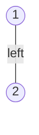
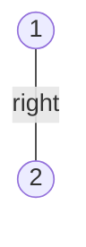
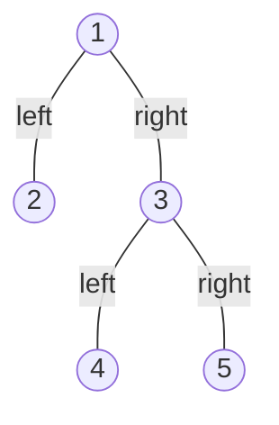

# Tree Serialization

**Serialization** turns a structure in memory into a flat sequence of characters
that can be written to a file, sent over a network, or handed to another process.
**Deserialization** reads that sequence back and rebuilds the structure. The pair
only counts as correct together, and the property they have to satisfy is the
**round trip**: `deserialize(serialize(tree))` must give back a tree identical to
the original in both its values and its shape.

A [traversal](02_dfs.md) also flattens a tree into a sequence, so it looks like
half the job is already done. It is not, because a traversal is allowed to lose
information and serialization is not. Preorder on a tree tells you the values in
one particular order and says nothing about which of them were missing children,
which is why [construction](06_construction.md) needed a second list before it
could run the arrow backwards.

The picture to hold is zipping a folder. If the archive records only the
filenames, unzipping gives you a pile of files rather than the folder layout you
started with. An archive that round-trips has to record the structure too,
including the parts that hold nothing.

## Why A List Of Values Has More Than One Reading

Start with the cheapest possible encoding, which is preorder joined by commas.
Walk the tree, write each value down as you meet it, and hand back the string.

Both of these trees produce `1,2`:





A decoder handed `1,2` has to guess whether `2` hangs on the left or the right,
and nothing in the string decides it. This is the same gap that made one
traversal insufficient for construction, where the fix was to demand a second
list. That fix is unavailable here, because the whole interface is one string
going out and the same string coming back in.

What you get instead is something construction never had: **you choose the
format**. The decoder is your own code reading your own output, so you are free
to write down anything that helps, including things that are not values.

## Writing Down The Holes

Every node has exactly two child slots, `left` and `right`, and each slot is
either filled or empty. The encoding above records the filled ones and stays
silent about the empty ones, so emit a **null marker** for the empty ones as
well. Any character that cannot be confused with a value works, and `#` is the
usual pick.

The two trees above now separate:

```text
left child only     1,2,#,#,#
right child only    1,#,2,#,#
```

With markers the string becomes **self-delimiting**, meaning a reader can tell
where each piece ends without being told any lengths in advance. Reading a value
means "two complete subtrees follow this token"; reading `#` means "nothing here,
this branch is finished". Those two rules are enough to consume the string with
no lookahead and no backtracking.

**The output size follows from counting slots.** A tree of `n` nodes has `2n`
child slots, and `n - 1` of them are filled, because every node except the root
is the child of exactly one parent. That leaves `n + 1` empty slots, so the
encoding is `n` values plus `n + 1` markers, which is `2n + 1` tokens. The
markers roughly double the output and that is the entire cost of making it
readable back.

## Preorder With Null Markers

Preorder is the order to encode in, because it writes a node before either of its
subtrees, so the decoder always knows which node it is building before it has to
decide what goes underneath.

```python
from __future__ import annotations


class TreeNode:  # the shared node type from 01_fundamentals
    def __init__(
        self,
        val: int,
        left: TreeNode | None = None,
        right: TreeNode | None = None,
    ) -> None:
        self.val = val
        self.left = left
        self.right = right


def shape(node: TreeNode | None) -> tuple | None:
    """(value, left, right) nesting, so an assert can name a whole tree."""
    if node is None:
        return None
    return (node.val, shape(node.left), shape(node.right))


def serialize(root: TreeNode | None) -> str:
    parts: list[str] = []

    def walk(node: TreeNode | None) -> None:
        if node is None:
            parts.append("#")
            return
        parts.append(str(node.val))
        walk(node.left)
        walk(node.right)

    walk(root)
    return ",".join(parts)


def deserialize(data: str) -> TreeNode | None:
    tokens = iter(data.split(","))

    def build() -> TreeNode | None:
        token = next(tokens)
        if token == "#":
            return None
        node = TreeNode(int(token))
        node.left = build()
        node.right = build()
        return node

    return build()


tree = TreeNode(1, TreeNode(2), TreeNode(3, TreeNode(4), TreeNode(5)))

assert serialize(tree) == "1,2,#,#,3,4,#,#,5,#,#"
assert shape(deserialize(serialize(tree))) == shape(tree)
assert serialize(TreeNode(1, TreeNode(2))) == "1,2,#,#,#"
assert serialize(TreeNode(1, None, TreeNode(2))) == "1,#,2,#,#"
assert serialize(TreeNode(-7)) == "-7,#,#"
assert serialize(None) == "#"
assert deserialize("#") is None
```

**The four decisions in that pair of functions**:

- `serialize` appends to a list and joins once at the end rather than building
  the string with `+=`, because Python strings are immutable, so repeated
  concatenation copies everything written so far and turns an `O(n)` walk into
  `O(n²)` character copying
- `deserialize` holds a single **iterator** over the tokens, shared by every
  recursive call. Construction established that a shared cursor works because the
  recursion creates nodes in exactly preorder, which is the order the values were
  written in, and the same argument applies unchanged here
- The marker check comes **before** the node is created, since a `#` means this
  slot has no node at all, and it still consumes its token, because the marker
  occupies a real position in the stream
- `node.left` is assigned before `node.right`, and the order is load-bearing
  rather than stylistic, since both calls draw from the same iterator and the
  left subtree's tokens were written first

The one thing this format does not need is a length, a depth, or a node count in
a header. Construction had to recover the size of the left subtree from a second
list; here the left subtree announces its own end by running out of children,
which is what the `#` tokens are saying.

> "I will encode in preorder and write a sentinel for every missing child, so the
> string records shape and not only values. Decoding reads the tokens left to
> right through one shared iterator, and because the encoder and decoder walk in
> the same order, whatever the left subtree consumes is exactly what it wrote."

An empty tree serializes to `"#"` rather than to the empty string, which is worth
saying out loud, because a format where an empty tree produces nothing at all
cannot distinguish "no tree" from "no data arrived".

## Dry Run: Decoding `1,2,#,#,3,#,#`

The tree is a root of `1` with leaves `2` and `3`, so the encoding holds three
values and four markers, which is the `2n + 1` count from earlier. Each line is
one call to `build`, indented by depth:

```text
build(root      ) reads '1' at index 0, cursor->1   make TreeNode(1)
  build(left of 1 ) reads '2' at index 1, cursor->2   make TreeNode(2)
    build(left of 2 ) reads '#' at index 2, cursor->3   RETURN None, no node made
    build(right of 2) reads '#' at index 3, cursor->4   RETURN None, no node made
  build(right of 1) reads '3' at index 4, cursor->5   make TreeNode(3)
    build(left of 3 ) reads '#' at index 5, cursor->6   RETURN None, no node made
    build(right of 3) reads '#' at index 6, cursor->7   RETURN None, no node made
```

The four discarded calls are the mechanism. Each one reads a token, builds
nothing, and returns `None`, and the important part is that it **still advances
the cursor**. Skipping the token instead, on the theory that nothing was
constructed, would leave the `#` in the stream for the next call to trip over,
and every node after it would be attached in the wrong place.

The line to watch is `build(right of 1)`. It reads index 4, not index 2, because
the left subtree of `1` consumed indices 1 through 3 while this call was
suspended. Nobody computed that range and nobody passed it along. The left call
took as much as it needed and left the iterator sitting at the first token that
was never its business, which is the property that makes the shared iterator
correct.

The five-node tree from the code block encodes as `1,2,#,#,3,4,#,#,5,#,#`, and it
is worth reading that string against the picture once:



The `#,#` immediately after `2` is what says `2` is a leaf, and it is also what
tells the decoder that the `3` which follows belongs to the root's right slot
rather than to anything under `2`.

## The Level-Order Format Behind `[1,2,3,null,null,4,5]`

Sites print trees as level-order arrays with `null` for missing children, which
is a **breadth-first** encoding rather than a preorder one. It is worth being
able to write both, partly because the format is the one you will be shown in a
problem statement, and partly because it is the answer to "can you do this
without recursion", which is a live follow-up given that a skewed tree of ten
thousand nodes exceeds Python's recursion limit.

The encoder pushes children unconditionally, including the missing ones, and
writes a marker when a `None` comes back out of the queue. The decoder reads the
tokens in pairs, since consecutive tokens are the two children of whichever node
is at the front of its queue.

```python
from collections import deque


def serialize_level(root: TreeNode | None) -> str:
    if root is None:
        return ""
    parts: list[str] = []
    queue: deque[TreeNode | None] = deque([root])
    while queue:
        node = queue.popleft()
        if node is None:
            parts.append("#")
            continue
        parts.append(str(node.val))
        queue.append(node.left)
        queue.append(node.right)
    return ",".join(parts)


def deserialize_level(data: str) -> TreeNode | None:
    if not data:
        return None
    tokens = data.split(",")
    root = TreeNode(int(tokens[0]))
    queue: deque[TreeNode] = deque([root])
    i = 1
    while queue and i < len(tokens):
        node = queue.popleft()
        if tokens[i] != "#":
            node.left = TreeNode(int(tokens[i]))
            queue.append(node.left)
        i += 1
        if i < len(tokens) and tokens[i] != "#":
            node.right = TreeNode(int(tokens[i]))
            queue.append(node.right)
        i += 1
    return root


assert serialize_level(tree) == "1,2,3,#,#,4,5,#,#,#,#"
assert shape(deserialize_level(serialize_level(tree))) == shape(tree)
assert shape(deserialize_level("1,2,3,#,#,4,5")) == shape(tree)
assert shape(deserialize_level("1,#,2")) == (1, None, (2, None, None))
assert serialize_level(None) == ""
assert deserialize_level("") is None
```

Two details separate this from the [level-order traversal](03_bfs.md) you already
write for BFS problems. The queue holds `None` entries here, where a traversal
would filter them out, because a skipped `None` is a hole that never gets
recorded. And the decoder's queue holds only real nodes, since a `None` has no
child slots to fill.

The `i < len(tokens)` guard is what lets the decoder accept a **truncated**
string. LeetCode's displayed arrays drop the trailing nulls, so the seven tokens
of `[1,2,3,null,null,4,5]` describe the same tree as the eleven the encoder
produced, and both of those asserts pass. Running out of tokens simply means
every remaining slot is empty.

## When The Encoding Is Used As A Key

A serialized tree is a string, and strings can be compared, hashed, and searched.
That turns "is `sub` a subtree of `root`" into "is `serialize(sub)` a substring of
`serialize(root)`", which is a legitimate alternative to the paired recursion used
for [Subtree of Another Tree](https://leetcode.com/problems/subtree-of-another-tree/).

It also contains a trap that costs people the problem. Values are written without
any separator in front of them, so a `2` can be found inside a `12`:

```python
assert serialize(TreeNode(12)) == "12,#,#"
assert serialize(TreeNode(2)) == "2,#,#"
assert (serialize(TreeNode(2)) in serialize(TreeNode(12))) is True  # wrong answer


def signature(node: TreeNode | None) -> str:
    if node is None:
        return ",#"
    return f",{node.val}{signature(node.left)}{signature(node.right)}"


assert signature(TreeNode(12)) == ",12,#,#"
assert (signature(TreeNode(2)) in signature(TreeNode(12))) is False
real = TreeNode(3, TreeNode(4, TreeNode(1), TreeNode(2)), TreeNode(5))
assert signature(TreeNode(4, TreeNode(1), TreeNode(2))) in signature(real)
assert signature(None) == ",#"
```

The fix is to put the separator **before** every token rather than between
tokens, so a match can only ever begin where a token begins. This is the same
length-and-delimiter reasoning as
[encoding a list of strings](../../01_arrays_and_hashing/notes/02_hashing.md),
and it is the reason a format that looks fine when you read it can still be
ambiguous to a machine.

## Worked Example: [Construct String From Binary Tree](https://leetcode.com/problems/construct-string-from-binary-tree/)

Encode a binary tree as a preorder string where each node's children are wrapped
in parentheses, and drop every empty pair of parentheses that is not needed to
recover the tree. The dropping is the entire problem, since keeping all of them
is four lines.

**Input**: `root`, a `TreeNode | None`. The problem guarantees at least one node,
so the empty tree is not tested, though a solution should still survive it. Node
values are integers and may be negative, which means a `-` can appear in the
output and the format has to tolerate it

**Output**: a `str` holding the preorder encoding. A node contributes its value,
then its left child wrapped in `(` and `)`, then its right child wrapped the same
way, with empty pairs omitted wherever their absence still leaves exactly one tree
that could have produced the string. So `[1,2,3,4]` gives `"1(2(4))(3)"`, and the
empty tree gives `""`

The phrase that decides the technique is "omit all the empty parenthesis pairs
that do not affect the one-to-one mapping", which is asking for the smallest
lossless encoding rather than the smallest string. Dropping *every* empty pair is
the naive reading, and it fails on `[1,2,3,null,4]`, where node `2` has a right
child and no left child. Without the empty left pair the output is `"1(2(4))(3)"`,
which is the encoding of a different tree, the one where `4` hangs on `2`'s left.
That is the same left-versus-right ambiguity the null markers fixed earlier, and
here `()` is the null marker.

Reading it the other way gives the rule. A trailing absence is recoverable and a
middle absence is not, because parentheses are positional: the first pair after a
value is always the left child and the second is always the right, so an omitted
pair can only ever be understood as "the ones after this point are all empty".

> "Parentheses are positional, so I can drop a pair only when nothing meaningful
> follows it. A missing right child is at the end, so it goes; a missing left
> child with a right sibling after it has to stay as `()`, or the right child gets
> read as a left child. A leaf drops both."

Therefore,

1. Walk the tree in preorder and append pieces to a list, joining once at the end,
   because building the answer with `+=` at each node re-copies everything
   accumulated so far
2. At a node, append its value first, since the format is preorder and the value
   always leads
3. If the node is a **leaf**, return immediately. Both pairs would be empty and
   nothing follows them, so dropping both loses nothing
4. Otherwise append `(`, recurse into the left child, and append `)`. This pair is
   emitted whether or not the left child exists, because at this point you already
   know something follows it
5. A recursive call on `None` appends nothing at all, which is exactly what turns
   step 4 into the literal `()` when the left child is missing
6. Append the right child's pair only when the right child exists, since a missing
   right child is the trailing case that step 3's reasoning allows you to drop
7. Return the joined pieces at the top level, which for an empty tree is the empty
   string because no piece was ever appended

```python
def tree_to_string(root: TreeNode | None) -> str:
    parts: list[str] = []

    def walk(node: TreeNode | None) -> None:
        if node is None:
            return
        parts.append(str(node.val))
        if node.left is None and node.right is None:
            return
        parts.append("(")
        walk(node.left)
        parts.append(")")
        if node.right is not None:
            parts.append("(")
            walk(node.right)
            parts.append(")")

    walk(root)
    return "".join(parts)


assert tree_to_string(TreeNode(1, TreeNode(2, TreeNode(4)), TreeNode(3))) == "1(2(4))(3)"
assert tree_to_string(TreeNode(1, TreeNode(2, None, TreeNode(4)), TreeNode(3))) == "1(2()(4))(3)"
assert tree_to_string(TreeNode(1, None, TreeNode(2))) == "1()(2)"
assert tree_to_string(TreeNode(1)) == "1"
assert tree_to_string(None) == ""
```

Tracing `[1,2,3,null,4]`, the case the naive reading gets wrong, with the string
built so far on the right:

```text
walk(root)          emit '1'                        1
  walk(left of 1)   emit '2'                        1(2
    walk(left of 2) node is None, emit nothing      1(2
    close the left pair, KEPT because a right follows   1(2()
    walk(right of 2) emit '4'                       1(2()(4
      4 is a leaf, DROP both of its pairs           1(2()(4
    close the right pair                            1(2()(4)
  close the left pair of 1                          1(2()(4))
  walk(right of 1) emit '3'                         1(2()(4))(3
    3 is a leaf, DROP both of its pairs             1(2()(4))(3
  close the right pair of 1                         1(2()(4))(3)
```

Two pairs were dropped and one empty pair was kept, and the difference between
them is the whole problem. Node `4` is a leaf, so its two empty pairs sit at the
end of its own contribution with nothing after them, and removing them leaves the
reading unchanged. Node `2`'s left pair is also empty, but `(4)` comes after it,
so removing it would promote `4` into the left position.

- **Time Complexity:** `O(n)` for `n` nodes, because each node appends at most
  five short pieces and `"".join` copies each piece once, so no character is
  copied more than a constant number of times
- **Space Complexity:** `O(n)` for the pieces list and the output string, which
  together hold one value per node plus at most four parentheses per node, plus
  `O(h)` for the recursion stack where `h` is the height, which is `O(n)` on a
  skewed tree

The version that returns a string from each call instead, as
`f"{node.val}({left}){right}"`, is easier to read and quietly worse. Each node
copies both of its children's finished strings, so the total copying is the sum of
every subtree's encoded length, which is `O(n · h)` and therefore `O(n²)` on a
skewed tree. Mention it and then write the list version.

## Time and Space Complexity

Throughout, `n` is the number of nodes and `h` is the height of the tree in nodes,
which is about `log2 n` when the tree is balanced and `n` when it is skewed.
"Output" below means the encoded string itself, which no correct solution can
avoid producing.

**Preorder encoding with null markers**

| Operation                                | Time                                                                                                                                    | Space                                                                                                      |
| ---------------------------------------- | --------------------------------------------------------------------------------------------------------------------------------------- | ---------------------------------------------------------------------------------------------------------- |
| `serialize`                              | `O(n)`: each node appends exactly one token, each `None` slot appends one marker, and the single `",".join` copies every character once | `O(n)` output of `2n + 1` tokens, plus `O(h)` stack: one frame per node on the current root-to-leaf path   |
| `deserialize`                            | `O(n)`: `split` is one pass, and each of the `2n + 1` tokens is read by exactly one call that does constant work                        | `O(n)` for the token list, plus `O(h)` stack for the same reason, plus the `O(n)` nodes returned as output |
| `serialize` built with `result += token` | `O(n²)`: each concatenation copies the whole string built so far, since Python strings are immutable                                    | `O(n)`: the intermediate copies are discarded as they go, so the space is not what gives this version away |

**Level-order encoding**

| Operation           | Time                                                                                                           | Space                                                                                                                                                                |
| ------------------- | -------------------------------------------------------------------------------------------------------------- | -------------------------------------------------------------------------------------------------------------------------------------------------------------------- |
| `serialize_level`   | `O(n)`: every real node is enqueued and dequeued exactly once, and each contributes at most two `None` entries | `O(w)` for the queue, where `w` is the widest level, which is up to about `n / 2` on a perfect tree, plus the `O(n)` output                                          |
| `deserialize_level` | `O(n)`: the token index only ever moves forward, and each real node is enqueued once                           | `O(w)` for the queue plus `O(n)` for the token list, and no recursion at all, which is why this version survives a skewed tree that would exceed the recursion limit |

**Subtree matching through serialization**

| Approach                                                 | Time                                                                                                                                                              | Space                                                                                                         |
| -------------------------------------------------------- | ----------------------------------------------------------------------------------------------------------------------------------------------------------------- | ------------------------------------------------------------------------------------------------------------- |
| Substring search on the two signatures                   | `O(n + m)` with a linear substring search, where `n` and `m` are the node counts of the two trees, since both encodings are one pass and Python's `in` scans them | `O(n + m)`: both encodings are held in memory at once, which is strictly more than the paired recursion needs |
| Paired recursion, comparing candidate roots node by node | `O(n · m)` worst case: every node of the larger tree can start a comparison that runs the length of the smaller one                                               | `O(h)`: only the recursion stack, since nothing is encoded                                                    |

## Summary

- **Serialization** flattens a tree into a string and **deserialization** rebuilds
  it, and the pair is correct only when the round trip returns a tree identical to
  the original in both values and shape
  - A traversal is not a serialization, because a traversal is allowed to lose the
    shape and only records the values
- A list of values alone has more than one reading, since `1,2` describes both a
  root with a left child and a root with a right child. Construction solved the
  same ambiguity by demanding a second traversal, which is not available when the
  interface is one string, so serialization solves it by **choosing the format**
  instead
- The fix is a **null marker**, a token such as `#` written for every empty child
  slot. It makes the string self-delimiting, meaning a value announces that two
  subtrees follow and a marker announces that a branch is finished, so the decoder
  needs no lengths and never backtracks
  - A tree of `n` nodes has `n + 1` empty slots, because its `2n` slots include
    `n - 1` filled ones, one for every node except the root. The encoding is
    therefore `2n + 1` tokens, so markers roughly double the output
- Encode in **preorder** and decode with a **single shared iterator** over the
  tokens. The recursion creates nodes in the order the encoder wrote them, so
  whatever the left subtree consumes is exactly what it wrote, and the right call
  resumes at the first token that was never the left subtree's business
  - The marker check has to come before the node is created, and a discarded call
    still consumes its token. Leaving that token behind shifts every node after it
- The **level-order** format, which is what `[1,2,3,null,null,4,5]` in a problem
  statement means, encodes the same information breadth-first with a queue that
  carries `None` entries rather than filtering them out. It uses no recursion,
  which is the answer when a skewed tree would exceed Python's recursion limit
  - Its decoder must tolerate a truncated string, since displayed arrays drop the
    trailing nulls, and running out of tokens simply means the rest is empty
- A serialized tree is a **key**, so subtree matching becomes substring search.
  Put the separator before every token rather than between them, or `2,#,#` is
  found inside `12,#,#` and the answer is silently wrong
- Build the output by appending to a list and joining once. Python strings are
  immutable, so `result += token` copies everything written so far and turns an
  `O(n)` walk into `O(n²)` character copying
  - The same trap wears a disguise in the recursive version that returns
    `f"{node.val}({left}){right}"`, which copies each subtree's whole string into
    its parent and costs `O(n · h)`
- *Construct String From Binary Tree* is the same idea with parentheses as the
  delimiter. A leaf drops both empty pairs and a missing right child drops its
  pair, but a missing left child with a right sibling keeps `()`, because
  parentheses are positional and dropping that pair promotes the right child into
  the left position

## Interview Checklist

Before writing code, make sure you can answer each of these

```text
Does my format record shape, or only values, and what does a missing child emit?
Can two different trees produce the same string, and can I name the pair if so?
What does an empty tree serialize to, and is that distinguishable from no data?
Is the decoder reading tokens through one shared cursor that never rewinds?
Does a null marker still consume its token before returning None?
Am I decoding left before right, matching the order the encoder wrote them?
Am I joining a list of pieces, or concatenating a string n times for O(n²)?
Preorder or level order, and am I consistent across the encoder and the decoder?
If the values can be multi-digit or negative, does my separator still parse?
How deep can the recursion go here, and do I need the iterative version instead?
```
