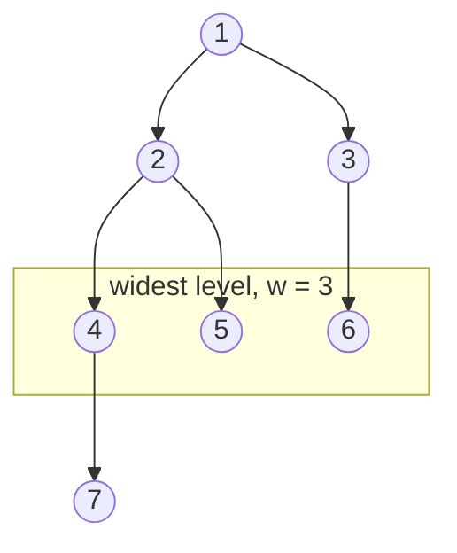

# Tree Complexity

An array's cost is written in one number, because `n` values sitting in a row admit
exactly one arrangement and there is no second question to ask about it. A tree of
`n` nodes admits many arrangements, and two of them can make the same walk cost
wildly different amounts. Tree bounds therefore need more than the node count, and
the extra numbers describe **shape** rather than size.

Three numbers price any walk over a binary tree:

- `n` is the **node count**, and it is the only one of the three the constraints
  section of a problem hands you
- `h` is the **height** in nodes, meaning how many levels deep the tree runs, which
  is the same `h` that [tree fundamentals](01_fundamentals.md) defined and showed
  ranging from about `log2 n` up to `n`
- `w` is the **width**, the largest number of nodes sitting on any one level. A
  perfect three-level tree has `w = 4`, since its bottom level holds four nodes,
  while a chain puts one node on each level and so has `w = 1`

`w` is the number this topic adds, and it earns a symbol because the two traversals
you already know do not pay for the same thing. A recursive [DFS](02_dfs.md) holds
one root-to-leaf path in its call stack, so its space follows `h`. A level-order
[BFS](03_bfs.md) holds one level in its queue, so its space follows `w`. Quoting
`O(h)` for a BFS is not a rounding error, it is the wrong variable.

A function that measures all three at once makes them concrete. `TreeNode` is the
shared node type from the fundamentals topic, repeated here only so the blocks
below run on their own:

```python
from __future__ import annotations

from collections import deque


class TreeNode:
    def __init__(
        self,
        val: int,
        left: TreeNode | None = None,
        right: TreeNode | None = None,
    ) -> None:
        self.val = val
        self.left = left
        self.right = right


def build_chain(length: int) -> TreeNode | None:
    root: TreeNode | None = None
    for value in range(length, 0, -1):
        root = TreeNode(value, root)
    return root


def build_perfect(levels: int, label: int = 1) -> TreeNode | None:
    if levels == 0:
        return None
    return TreeNode(
        label,
        build_perfect(levels - 1, 2 * label),
        build_perfect(levels - 1, 2 * label + 1),
    )


def shape(root: TreeNode | None) -> tuple[int, int, int]:
    nodes = 0
    height = 0
    width = 0
    queue: deque[TreeNode] = deque([root] if root is not None else [])

    while queue:
        height += 1
        width = max(width, len(queue))
        for _ in range(len(queue)):
            node = queue.popleft()
            nodes += 1
            if node.left is not None:
                queue.append(node.left)
            if node.right is not None:
                queue.append(node.right)

    return nodes, height, width


assert shape(build_perfect(3)) == (7, 3, 4)
assert shape(build_chain(7)) == (7, 7, 1)
assert shape(TreeNode(1)) == (1, 1, 1)
assert shape(None) == (0, 0, 0)
```

The two seven-node calls are the whole point. Same `n`, and the height triples
while the width drops to one, so any bound written only in `n` has hidden the part
that actually varies.

## Why "O(n) Time And O(log n) Space" Is The Answer That Gets Corrected

The reflex answer for a recursive tree walk is `O(n)` time and `O(log n)` space.
The time half is usually right, since most walks touch every node once. The space
half is where the correction comes, and it comes because `O(log n)` is the height
of a *perfect* tree rather than the height of a binary tree. Level `i` of a perfect
tree holds `2**i` nodes, so `h` levels hold `2**h - 1` nodes, and inverting that
gives `h ≈ log2 n`.

That inversion only describes trees whose levels are full. The counterexample is
not a hand-built pathological input, it is the single most ordinary way a binary
search tree gets constructed:

```python
def insert_bst(root: TreeNode | None, value: int) -> TreeNode:
    if root is None:
        return TreeNode(value)
    if value < root.val:
        root.left = insert_bst(root.left, value)
    else:
        root.right = insert_bst(root.right, value)
    return root


def bst_from(values: list[int]) -> TreeNode | None:
    root: TreeNode | None = None
    for value in values:
        root = insert_bst(root, value)
    return root


assert shape(bst_from([4, 2, 6, 1, 3, 5, 7])) == (7, 3, 4)
assert shape(bst_from([1, 2, 3, 4, 5, 6, 7])) == (7, 7, 1)
assert shape(bst_from([])) == (0, 0, 0)
```

Both calls insert the same seven keys and both produce a valid
[binary search tree](05_bst.md). Shuffled, the keys land three levels deep.
Sorted, they land seven deep, because every arriving key is larger than everything
already stored, so it walks to the rightmost node and hangs off it. What comes back
is a linked list whose `left` pointers are all `None`, with `h = n`.

Nothing in a problem statement rules that input out unless the statement says
"balanced", and the consequence in Python is worse than a slower run, since a walk
one frame per level deep can exceed the interpreter's recursion limit outright,
which [tree fundamentals](01_fundamentals.md) covers.

> "Time is `O(n)` because every node is visited once. Space is `O(h)` for the
> recursion stack, and `h` is `O(log n)` only when the tree is balanced. Nothing
> here promises that, so I will quote the worst case as `O(n)` on a skewed tree and
> mention that the recursive version can blow the recursion limit at the input size
> in the constraints."

Saying that unprompted is what separates a memorized bound from an understood one.
The rest of this topic is the machinery for producing that sentence about any walk
rather than recalling it for one: figure out which shape symbol each part of the
algorithm is paying for.

## The Stack Holds Ancestors, The Queue Holds A Level

Both traversals reach all seven nodes of a perfect three-level tree, so their time
is the same. Logging what each one is *holding* at every step is what separates
their space:

```python
def dfs_stack_log(root: TreeNode | None) -> tuple[list[str], int]:
    log: list[str] = []
    frames: list[int] = []
    peak = 0

    def walk(node: TreeNode | None) -> None:
        nonlocal peak
        if node is None:
            return
        frames.append(node.val)
        peak = max(peak, len(frames))
        log.append(f"enter {node.val}  stack={frames.copy()}")
        walk(node.left)
        walk(node.right)
        frames.pop()
        log.append(f"leave {node.val}  stack={frames.copy()}")

    walk(root)
    return log, peak


def bfs_queue_log(root: TreeNode | None) -> tuple[list[str], int]:
    log: list[str] = []
    peak = 0
    queue: deque[TreeNode] = deque([root] if root is not None else [])

    while queue:
        peak = max(peak, len(queue))
        log.append(f"queue={[node.val for node in queue]}")
        for _ in range(len(queue)):
            node = queue.popleft()
            if node.left is not None:
                queue.append(node.left)
            if node.right is not None:
                queue.append(node.right)

    return log, peak


tree = TreeNode(
    1,
    TreeNode(2, TreeNode(3), TreeNode(4)),
    TreeNode(5, TreeNode(6), TreeNode(7)),
)

assert shape(tree) == (7, 3, 4)
assert dfs_stack_log(tree)[1] == 3
assert bfs_queue_log(tree)[1] == 4
assert dfs_stack_log(None) == ([], 0) and bfs_queue_log(None) == ([], 0)
assert (dfs_stack_log(build_chain(20))[1], bfs_queue_log(build_chain(20))[1]) == (20, 1)
```

The DFS log, printed in full:

```text
enter 1  stack=[1]
enter 2  stack=[1, 2]
enter 3  stack=[1, 2, 3]
leave 3  stack=[1, 2]          <- frame discarded before node 4 is ever entered
enter 4  stack=[1, 2, 4]
leave 4  stack=[1, 2]
leave 2  stack=[1]
enter 5  stack=[1, 5]
enter 6  stack=[1, 5, 6]
leave 6  stack=[1, 5]
enter 7  stack=[1, 5, 7]
leave 7  stack=[1, 5]
leave 5  stack=[1]
leave 1  stack=[]              peak 3, which is h
```

The `leave 3` line is the one carrying the bound. A plausible-sounding claim is
that DFS space grows with how many nodes it has visited so far, and that line
rejects it: node 3 is fully processed and its frame is gone *before* node 4 is
entered, so the two are never held together. Only ancestors of the current node
stay on the stack, and a node has at most `h - 1` ancestors because there are only
`h` levels above and including it, which is why the bound is `O(h)` and not `O(n)`.

The BFS log on the same tree is three lines:

```text
queue=[1]              size 1
queue=[2, 5]           size 2
queue=[3, 4, 6, 7]     size 4     peak, which is w
```

BFS peaks at four where DFS peaked at three, and the gap widens with size, since a
perfect tree of 8191 nodes gives a 13-frame stack against a 4096-node queue. Run
the same two functions on the 20-node chain in the asserts and the numbers invert
exactly, with a peak depth of 20 against a queue that never exceeds one.

## A Tall Tree Cannot Also Be A Wide One

Reading that, `h` and `w` look like two independent risks to worry about. They are
not independent at all, and the useful fact is that a tree which is bad for one is
automatically good for the other. Two inequalities pin it down.

**Width is at most about half the tree**, written `w <= (n + 1) / 2`. A level
holding `w` nodes needs at least `ceil(w / 2)` parents on the level above, because
each parent supports at most two children, and that level in turn needs at least
`ceil(w / 4)` grandparents above it. Those ancestors are all distinct nodes, so
`n >= w + w/2 + w/4 + ... >= 2w - 1`, which rearranges to `w <= (n + 1) / 2`. The
bound is tight for a perfect tree, whose bottom level holds exactly `(n + 1) / 2`
of its nodes.

**Height and width sum to at most `n + 1`**, written `h + w <= n + 1`. Every one of
the `h` levels holds at least one node, since a level with no nodes would have
ended the tree. The widest level contributes `w` and the other `h - 1` levels
contribute at least one each, so `n >= w + (h - 1)`, which rearranges to
`h + w <= n + 1`.



Seven nodes over four levels with three of them shaded. Every node outside the
shaded band is a node that band could have had instead, so widening that level
means taking nodes from the levels above or below it, which is exactly what
shortens the tree. Measured across the shapes, the tension is visible in the last
column:

```text
shape                     n      h      w    h + w
perfect, 3 levels         7      3      4        7
chain, 7 nodes            7      7      1        8
mixed (diagram above)     7      4      3        7
perfect, 13 levels     8191     13   4096     4109
chain, 5000 nodes      5000   5000      1     5001
```

The chain rows are the ones to hold on to, because a chain is the worst possible
input for recursive DFS and the *best* possible input for BFS, whose queue never
holds more than one node. The perfect rows are the mirror image.

This is what to reach for when an interviewer asks which traversal to use and tells
you something about the shape. A tree described as wide and shallow, such as a file
system or an org chart, punishes BFS and costs DFS almost nothing, and a tree
described as deep and narrow does the reverse. When the shape is unknown both are
`O(n)` space in the worst case, so the choice falls back to what the problem needs,
which is level membership for BFS and root-to-node paths for DFS.

## Reading A Time Bound Off The Walk Instead Of Recalling It

Every tree time bound in this module is one multiplication:

```text
time = (how many nodes the walk reaches) * (work done at each one)
```

Almost everything you write reaches all `n` nodes and does a constant amount of
work at each, which is where the familiar `O(n)` comes from. The two interesting
cases are the departures in each direction.

**One path instead of all nodes.** BST search, BST insert, and the range-pruned
descent in *Range Sum of BST* discard an entire subtree at every comparison, so
they examine one node per level and finish in `O(h)`. That is `O(log n)` on a
balanced tree and `O(n)` on the sorted-insert chain from earlier, which is the same
`h` caveat wearing different clothes.

**A whole subtree at each node instead of `O(1)`.** *Subtree of Another Tree* asks
whether a pattern appears anywhere in a tree, and the direct solution runs a full
equality check rooted at every candidate node. Each check can walk the entire
pattern before it fails, so the cost is `O(n * m)` for `n` nodes in the tree and `m`
nodes in the pattern. Counting the comparisons shows it happening:

```python
def subtree_comparisons(root: TreeNode | None, pattern: TreeNode | None) -> int:
    comparisons = 0

    def same(a: TreeNode | None, b: TreeNode | None) -> bool:
        nonlocal comparisons
        comparisons += 1
        if a is None or b is None:
            return a is b
        return a.val == b.val and same(a.left, b.left) and same(a.right, b.right)

    def walk(node: TreeNode | None) -> bool:
        if node is None:
            return False
        return same(node, pattern) or walk(node.left) or walk(node.right)

    walk(root)
    return comparisons


def equal_chain(length: int, value: int, tail: int | None = None) -> TreeNode | None:
    root: TreeNode | None = None if tail is None else TreeNode(tail)
    for _ in range(length):
        root = TreeNode(value, root)
    return root


counts = [subtree_comparisons(equal_chain(size, 0), equal_chain(size // 2 - 1, 0, tail=9)) for size in (16, 32, 64, 128)]

assert counts == [107, 407, 1583, 6239]
assert subtree_comparisons(None, TreeNode(1)) == 0
assert subtree_comparisons(TreeNode(1), None) == 1
```

Each doubling of the input roughly quadruples the comparisons, which is what a
quadratic bound looks like from the outside when `m` grows in step with `n`. The
inputs are chains of identical values with one mismatched node at the end of the
pattern, which forces every equality check to walk the pattern in full before
returning `False`. On the shuffled inputs an interviewer hands you it will look
linear, and that is the reason this bound has to be argued from the structure
rather than measured.

Two more shapes of per-node work already have homes and are worth naming rather
than rederiving. Calling a `height` helper from inside every node's visit is the
`O(n * h)` trap that [one-pass DFS](02_dfs.md) removes by returning the height
upward instead of pulling it downward. Counting the nodes of a complete tree
reaches `O(log² n)` through the perfect-subtree shortcut in the
[fundamentals worked example](01_fundamentals.md), and it is the only walk in this
module that beats `O(n)` while still answering about the whole tree.

## Auxiliary Space Versus The Answer You Have To Return

Two different quantities both get called "space", and a tree problem that returns a
collection is where they come apart.

- **Auxiliary space** is what the algorithm allocates in order to work, meaning the
  recursion stack, the BFS queue, a parent map, or a visited set. This is the number
  an interviewer is asking for when they say "and the space?"
- **Output space** is the answer itself. The problem demands it, so no approach can
  avoid it, which makes it an unfair charge against any particular approach

Level-order traversal is the clean illustration, since its queue holds one level and
is therefore `O(w)` auxiliary, while the list of lists it returns holds every value
and is `O(n)` output. Saying "`O(n)` space" there is not wrong, but it hides the
fact that the machinery is the cheap part.

Root-to-leaf path problems are where the output stops being a footnote and becomes
the dominant term, because every leaf emits a path that repeats each of its
ancestors:

```python
def binary_tree_paths(root: TreeNode | None) -> list[str]:
    paths: list[str] = []

    def walk(node: TreeNode | None, prefix: str) -> None:
        if node is None:
            return
        prefix = str(node.val) if not prefix else f"{prefix}->{node.val}"
        if node.left is None and node.right is None:
            paths.append(prefix)
            return
        walk(node.left, prefix)
        walk(node.right, prefix)

    walk(root, "")
    return paths


def values_emitted(root: TreeNode | None) -> int:
    return sum(path.count("->") + 1 for path in binary_tree_paths(root))


assert binary_tree_paths(build_perfect(2)) == ["1->2", "1->3"]
assert binary_tree_paths(TreeNode(9)) == ["9"]
assert binary_tree_paths(None) == []

assert (len(binary_tree_paths(build_perfect(4))), values_emitted(build_perfect(4))) == (8, 32)
assert (len(binary_tree_paths(build_chain(15))), values_emitted(build_chain(15))) == (1, 15)
assert (len(binary_tree_paths(build_perfect(12))), values_emitted(build_perfect(12))) == (
    2048,
    24576,
)
```

Write `L` for the number of leaves. The output holds `L` paths of up to `h` values
each, so it is `O(L * h)`, and the measured pairs show both extremes on trees of
identical node count. The perfect 15-node tree emits 32 values from 8 leaves of
length 4, more than twice its own size, while the 15-node chain emits 15 from its
one leaf. Pushed further, the perfect tree of 4095 nodes emits 24576 values, since
`L = (n + 1) / 2` and `h = log2(n + 1)` on a perfect tree together make the output
`O(n log n)` even though the tree itself is `O(n)`.

> "Auxiliary space is `O(h)` for the recursion stack. The output is separate and
> unavoidable at `L` paths of up to `h` values each, so `O(L * h)`, which is
> `O(n log n)` on a balanced tree because about half of its nodes are leaves."

The same split covers the `path` list that
[backtracking path problems](04_path_problems.md) carry downward. That list is
`O(h)` auxiliary because it is undone on the way back up, while the copies appended
to the answer are output.

## Worked Example: [Lowest Common Ancestor of Deepest Leaves](https://leetcode.com/problems/lowest-common-ancestor-of-deepest-leaves/)

Find the deepest level of the tree, take every leaf sitting on that level, and
return the lowest node whose subtree contains all of them. When only one leaf is
deepest the answer is that leaf itself, since a node counts as its own ancestor.

**Input**: `root`, the root `TreeNode` of a binary tree whose node values are
unique. The problem guarantees at least one node, and the solution below still
returns `None` if it is handed an empty tree

**Output**: a `TreeNode`, and specifically the node object from the input tree
rather than a copy or a value. It is the deepest node from which every
maximum-depth leaf is still reachable going downward, which is what "lowest common
ancestor of those leaves" means

The phrase "lowest node whose subtree contains all of them" is the
[lowest common ancestor](02_dfs.md) shape, except that the set of nodes to cover is
not given to you. It has to be discovered, and discovering it is a depth question,
so both have to happen in the same walk. Computing every node's depth first and
then running an LCA over the deepest leaves is the approach that recomputes subtree
information at every node, which is the `O(n * h)` trap from earlier in this topic.

The way out is a single postorder helper that returns two facts about the subtree
below it: how deep that subtree runs, and the answer for that subtree considered
alone. At any node, comparing the two depths its children returned is enough to
decide everything.

> "One postorder pass returning a pair, the depth of this subtree and the answer
> within it. If the two children come back with equal depths, the deepest leaves
> are split across both sides, so this node is the meeting point. If one side is
> deeper, every deepest leaf lives there, so I pass that side's answer up unchanged
> and discard the other side's."

Therefore,

1. Write one helper taking a node and returning a pair: the depth of the subtree
   rooted there, and the node that answers the problem for that subtree alone. Two
   values are needed because the depth is what the parent compares while the answer
   is what the caller ultimately wants, and neither can be recovered from the other
2. Return `(0, None)` for an empty subtree, since a missing child contributes no
   depth and has no leaves to cover. That base case is also the reason the whole
   function survives an empty tree with no extra guard
3. At a real node, recurse into both children and hold both pairs before deciding
   anything, because the decision is a comparison between the two sides and neither
   side on its own can make it
4. When the two depths are equal, the deepest leaves are spread across both
   subtrees, so no node below this one contains all of them. Return this node as the
   answer, paired with a depth one greater than its children's
5. When the left depth is strictly greater, every deepest leaf lies in the left
   subtree, so the left subtree's own answer already covers all of them and is still
   correct here. Pass that node up unchanged and discard the right answer entirely,
   because a node on the right covers none of the deepest leaves
6. Mirror that for the right side. In both unequal cases the returned depth is one
   more than the deeper child, since the longest downward path through this node
   runs through the deeper side
7. Call the helper on the root and return the second half of its pair. The first
   half is the tree's height, which existed only to drive the comparisons

```python
def lca_deepest_leaves(root: TreeNode | None) -> TreeNode | None:
    def walk(node: TreeNode | None) -> tuple[int, TreeNode | None]:
        if node is None:
            return 0, None

        left_depth, left_answer = walk(node.left)
        right_depth, right_answer = walk(node.right)

        if left_depth == right_depth:
            return left_depth + 1, node
        if left_depth > right_depth:
            return left_depth + 1, left_answer
        return right_depth + 1, right_answer

    return walk(root)[1]


example = TreeNode(
    3,
    TreeNode(5, TreeNode(6), TreeNode(2, TreeNode(7), TreeNode(4))),
    TreeNode(1, TreeNode(0), TreeNode(8)),
)

assert lca_deepest_leaves(example).val == 2
assert lca_deepest_leaves(TreeNode(1)).val == 1
assert lca_deepest_leaves(TreeNode(0, TreeNode(1, None, TreeNode(2)), TreeNode(3))).val == 2
assert lca_deepest_leaves(None) is None
assert lca_deepest_leaves(build_chain(4)).val == 4
```

- **Time Complexity:** `O(n)` for `n` nodes, because each node is entered exactly
  once and, with both child pairs already in hand, does two comparisons and one
  addition, so no node is ever re-walked on behalf of an ancestor
- **Space Complexity:** `O(h)` for `h` levels, because the only storage is the
  recursion stack holding one root-to-leaf path of pairs, which is `O(log n)` on a
  balanced tree and `O(n)` on a skewed one. The returned value is a reference to a
  node that already exists, so the output adds `O(1)`

Postorder on `example` produces these pairs, with the discarded side named:

```text
node 6:  left=(0,-)   right=(0,-)   ->  (1, 6)   tie at a leaf
node 7:  left=(0,-)   right=(0,-)   ->  (1, 7)   tie at a leaf
node 4:  left=(0,-)   right=(0,-)   ->  (1, 4)   tie at a leaf
node 2:  left=(1,7)   right=(1,4)   ->  (2, 2)   tie, so 2 is the meeting point
node 5:  left=(1,6)   right=(2,2)   ->  (3, 2)   right deeper, DISCARD answer 6
node 0:  left=(0,-)   right=(0,-)   ->  (1, 0)   tie at a leaf
node 8:  left=(0,-)   right=(0,-)   ->  (1, 8)   tie at a leaf
node 1:  left=(1,0)   right=(1,8)   ->  (2, 1)   tie, so 1 is the meeting point
node 3:  left=(3,2)   right=(2,1)   ->  (4, 2)   left deeper, DISCARD answer 1
```

The two discards are the mechanism. At node 5, the answer 6 coming up from the left
is perfectly correct for the left subtree, and it is thrown away because that
subtree does not reach the deepest level. At the root, node 1 is thrown away for the
same reason even though it was the right answer for everything beneath it. Only the
comparison of the two depths decides, so an answer that wins locally on a shallower
side never survives to the root

## Time and Space Complexity

Throughout, `n` is the node count, `h` is the number of levels, `w` is the largest
level size, `L` is the number of leaves, and `m` is the node count of a second
pattern tree. The shape bounds are `w <= (n + 1) / 2` and `h + w <= n + 1`, so `h`
and `w` are never both large.

**What the traversal machinery costs**

| Traversal                            | Time                                                                                                               | Space                                                                                                                                                              |
| ------------------------------------ | ------------------------------------------------------------------------------------------------------------------ | ------------------------------------------------------------------------------------------------------------------------------------------------------------------ |
| Recursive DFS                        | `O(n)`: every node is entered exactly once and the per-node work is a constant number of comparisons               | `O(h)`: the stack holds only the current node's ancestors, because each frame pops before its sibling is entered, giving `O(log n)` balanced and `O(n)` on a chain |
| Iterative DFS with an explicit stack | `O(n)`: the same visit count, with the pending branches written out by hand rather than held in interpreter frames | `O(h)`: at most one pending sibling waits per level, and it never trips the recursion limit because the stack lives on the heap                                    |
| BFS by level                         | `O(n)`: each node is enqueued once and dequeued once                                                               | `O(w)`: the queue holds one level at a time, which is `1` on a chain and `(n + 1) / 2` on a perfect tree                                                           |

**What the per-node work costs**

| Shape of the work                                                                        | Time                                                                                                                                                                 | Space                                                                                                                              |
| ---------------------------------------------------------------------------------------- | -------------------------------------------------------------------------------------------------------------------------------------------------------------------- | ---------------------------------------------------------------------------------------------------------------------------------- |
| `O(1)` at every node, as in `max_depth` and `lca_deepest_leaves`                         | `O(n)`: `n` visits times constant work                                                                                                                               | `O(h)` auxiliary under DFS or `O(w)` under BFS, since the walk stores nothing beyond its own pending nodes                         |
| One path only, as in BST search and insert                                               | `O(h)`: each comparison discards a whole subtree, so exactly one node per level is examined, which is `O(log n)` balanced and `O(n)` on a sorted-insert chain        | `O(1)` written as a loop, or `O(h)` written recursively, because the only state is the current node                                |
| A subtree fact recomputed at every node, as in calling a `height` helper from each visit | `O(n * h)`: each of `n` nodes re-walks the subtree beneath it, and that subtree can be `h` deep                                                                      | `O(h)`: the two nested walks are never active on more than one root-to-leaf path at a time                                         |
| A full pattern comparison at every node, as in `subtree_of_another_tree`                 | `O(n * m)`: each of `n` candidate roots can walk the whole `m`-node pattern before mismatching, measured above as a quadrupling per doubling when `m` grows with `n` | `O(h + m)`: the outer walk's stack plus the comparison's own stack, which is bounded by the pattern's height and therefore by `m`  |
| Collecting every root-to-leaf path, as in `binary_tree_paths`                            | `O(L * h)`: each of `L` leaves emits a path repeating up to `h` ancestor values, which is `O(n log n)` on a balanced tree                                            | `O(L * h)` output plus `O(h)` auxiliary: the answer list dominates, while the prefix carried downward is undone on the way back up |

The last row is the one people quote wrongly. `O(n)` is a lower bound on that
output rather than the answer, because a balanced tree has about `n / 2` leaves and
each of their paths repeats roughly `log2 n` values, which is strictly more data
than the tree holds.

## Summary

- Tree cost is written in three numbers while the problem statement gives you only
  one of them. `n` is the node count from the constraints, `h` is how many levels
  deep the tree runs, and `w` is the largest number of nodes on any single level,
  and it is shape rather than size that decides what a walk costs
  - Two seven-node trees can need three stack frames or seven, so a bound quoted
    purely in `n` has hidden the part that varies
- The reflex answer of `O(n)` time and `O(log n)` space is right about the time and
  wrong about the space, because `log2 n` is the height of a perfect tree rather
  than of a binary tree. Quote `O(h)` and then say what `h` becomes
  - Skewed input is ordinary, not exotic: inserting already-sorted keys into a BST
    walks every key to the rightmost node and builds a chain with `h = n` every
    single time
- Recursive DFS pays for height because its call stack holds only the ancestors of
  the current node, while level-order BFS pays for width because its queue holds one
  level. Those are different variables, so `O(h)` is simply the wrong answer for a
  BFS rather than a loose one
  - A node's frame is discarded before its sibling is entered, which is why the
    stack is `O(h)` and not `O(number of nodes visited so far)`
- `h` and `w` are in tension and cannot both be large, since `w <= (n + 1) / 2`
  because a wide level needs ancestor levels that halve going up, and
  `h + w <= n + 1` because every other level still needs at least one node of its own
  - A chain is the worst input for recursive DFS at `n` frames and the best for BFS
    at a queue of one, and a perfect tree is the exact mirror, so a shape described
    as wide and shallow argues for DFS while deep and narrow argues for BFS
- Derive a time bound as the number of nodes the walk reaches times the work done at
  each one, rather than recalling a bound per problem. Reaching all `n` nodes with
  `O(1)` work each is `O(n)`, descending a single path is `O(h)`, recomputing a
  subtree fact at every node is `O(n * h)`, and comparing a whole `m`-node pattern at
  every node is `O(n * m)`
  - The one walk in this module that beats `O(n)` while answering about the whole
    tree is *Count Complete Tree Nodes* at `O(log² n)`, and it only does so because
    completeness is promised in the statement
- Auxiliary space is what the algorithm allocates, meaning the `O(h)` recursion
  stack, the `O(w)` BFS queue, or an `O(n)` parent map. Output space is the answer
  the problem forces you to build, so it is not a fair charge against your approach
  - Path-collecting problems are where the output dominates, since `L` leaves each
    emitting up to `h` values gives `O(L * h)`, which works out to `O(n log n)` on a
    balanced tree and is therefore larger than the tree itself
- The single most useful sentence to have ready is that space is `O(h)`, which is
  `O(log n)` if the tree is balanced and `O(n)` if it is skewed, volunteered before
  the interviewer asks for the worst case

## Interview Checklist

```text
Have I named n, h, and w before quoting a bound, instead of saying only "O(n)"?
Am I claiming O(log n) anywhere the statement never promised a balanced tree?
What does this bound become on a chain, and what does it become on a perfect tree?
Is my space O(h) from a recursion stack or O(w) from a BFS queue?
Could the recursion depth exceed Python's limit at the largest allowed input size?
Am I doing O(1) work per node, or re-walking a subtree at each node for O(n * h)?
Am I recomputing a height, size, or sum that one postorder pass could return upward?
Have I separated auxiliary space from the output the problem forces me to build?
For a path or level problem, is the returned answer larger than the tree itself?
Can I say the bound aloud as "n is the node count, and the walk costs ... because ..."?
```
