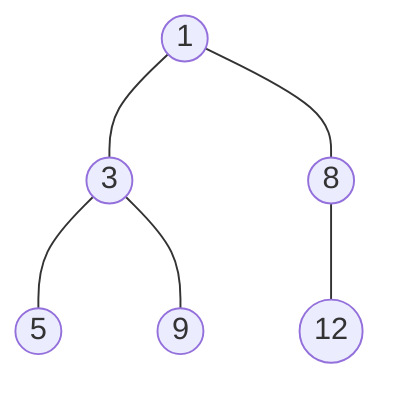

# Heaps

A **heap** is a binary tree that keeps one promise and nothing else: every node
holds a value less than or equal to the values in both of its children. That
promise is the **heap property**, and a tree obeying it is a **min-heap**. Flip
the comparison so every node is at least as large as its children and you have a
**max-heap**. Everything in this topic works the same way in both directions, so
the min version is the one worth learning first

The promise is deliberately weak, and the weakness is the point. Compare it to
the [binary search tree](../../07_trees/notes/05_bst.md), which orders left
against right and therefore lets you search. A heap says nothing about siblings
or cousins, only about a node against its own two children



The 5 sits two levels down on the left while the 8 sits one level down on the
right, so a smaller value is deeper than a larger one. A BST would forbid that,
and a heap does not care, because the only thing a heap guarantees is that the
**root holds the minimum of everything below it**. Ask a heap "is 9 in here?" and
you have to check every node, since nothing tells you which branch to take

Two more pieces of vocabulary. A heap is a
[complete binary tree](../../07_trees/notes/01_fundamentals.md), so every level
is full except possibly the last, which fills from the left with no gaps. And a
**priority queue** is the job description rather than the structure:
hand me the highest-priority item next, whatever "priority" means here. A binary
heap is the standard way to build one, and interviewers use the two words
interchangeably

Completeness is what lets a heap live in a flat array with no node objects and no
pointers at all. Number the nodes level by level starting at the root, and each
family relationship becomes arithmetic on the index

```text
index    0    1    2    3    4    5
value    1    3    8    5    9   12

parent(i) = (i - 1) // 2
left(i)   = 2 * i + 1
right(i)  = 2 * i + 2
```

Index 1 holds 3, so its children live at 3 and 4, holding 5 and 9, which is
exactly the picture above. When the rest of this topic says "the heap", it means
a plain Python list arranged this way

## Why A Sorted List Cannot Keep Up

The obvious way to always know the smallest value is to keep the collection
sorted. The minimum is then at index 0, reading it costs `O(1)`, and removing it
is one `pop(0)`

That collapses the moment values keep arriving. Inserting into a sorted list
means finding the position and then shifting every larger element one slot right,
and that shift is `O(n)` because a
[dynamic array](../../01_arrays_and_hashing/notes/01_dynamic_arrays.md) stores
its values in contiguous slots. Insert `n` values and you have paid `O(n²)`

```text
sorted    [ 3, 5, 8, 12 ]     insert 4
          [ 3, 4, 5,  8, 12 ]  5, 8 and 12 each moved one slot right
```

Full sorting is doing far more work than the question asked for. Total order
settles the relationship between every pair of elements, and a query for the
minimum only needs one of those relationships. The fix is to promise less: order
each node against its own children and nothing further. That is enough to pin the
minimum at the root, because if the root beats its children, and they beat
theirs, the root beats everything by following the chain down

> "I need the minimum repeatedly while new values keep arriving, so keeping the
> collection sorted costs `O(n)` per insert from the shifting. A heap only
> promises parent beats child, which still puts the minimum at the root and costs
> `O(log n)` to restore."

The payoff is that a broken heap is only ever broken along **one root-to-leaf
path**. A complete tree over `n` nodes has height `floor(log2(n))`, because each
level holds twice the nodes of the one above it, so repairing a path is
`O(log n)` work

## Sifting Up And Sifting Down

Two repair routines carry the whole structure

**Sifting up** fixes a value that is too small for where it sits. Append the new
value at the end of the array, which is the only spot that keeps the tree
complete, then compare it with its parent and swap while the parent is larger.
Each swap moves the value up one level, so the loop runs at most the height of
the tree

**Sifting down** fixes a value that is too large for where it sits, which is what
happens after removing the root. You cannot leave a hole at index 0, and the only
element whose removal keeps the tree complete is the last one, so move that last
element into the root and push it back down. At each step compare it against
**both** children and swap with the **smaller** of the two, because swapping with
the larger child would put a value above its sibling that is bigger than it, and
the heap property would still be broken

```python
class MinHeap:
    def __init__(self) -> None:
        self.data: list[int] = []

    def push(self, value: int) -> None:
        self.data.append(value)
        self._sift_up(len(self.data) - 1)

    def pop(self) -> int:
        if not self.data:
            raise IndexError("pop from empty heap")
        smallest = self.data[0]
        last = self.data.pop()
        if self.data:
            self.data[0] = last
            self._sift_down(0)
        return smallest

    def peek(self) -> int:
        if not self.data:
            raise IndexError("peek from empty heap")
        return self.data[0]

    def _sift_up(self, i: int) -> None:
        while i > 0:
            parent = (i - 1) // 2
            if self.data[parent] <= self.data[i]:
                return
            self.data[parent], self.data[i] = self.data[i], self.data[parent]
            i = parent

    def _sift_down(self, i: int) -> None:
        n = len(self.data)
        while True:
            smallest = i
            for child in (2 * i + 1, 2 * i + 2):
                if child < n and self.data[child] < self.data[smallest]:
                    smallest = child
            if smallest == i:
                return
            self.data[i], self.data[smallest] = self.data[smallest], self.data[i]
            i = smallest


h = MinHeap()
for v in (5, 3, 8, 1, 9, 2):
    h.push(v)
assert h.peek() == 1
assert [h.pop() for _ in range(6)] == [1, 2, 3, 5, 8, 9]

try:
    MinHeap().pop()
except IndexError:
    pass
else:
    raise AssertionError("popping an empty heap must raise")
```

**The lines that decide whether this is correct**:

- `if self.data[parent] <= self.data[i]: return` stops the climb early, and the
  early stop is what makes push `O(log n)` rather than `O(n)`. Once a value is
  no smaller than its parent, everything above the parent is already smaller than
  it too, so there is nothing left to fix
- `last = self.data.pop()` before writing index 0 handles the one-element case,
  because popping the only element leaves the list empty and the `if self.data`
  guard skips the sift entirely rather than reading a missing root
- `for child in (2 * i + 1, 2 * i + 2)` picks the smaller child by letting the
  second comparison overwrite the first only when it wins, which is the compact
  way to say "swap with the smaller child"
- `smallest == i` is the stopping condition, and it is checked before the swap
  rather than after, so a value already in the right place costs one comparison
  round instead of a wasted swap
- The heap is never sorted at any point, so `self.data` after several pushes is
  not the sorted input and should never be read as if it were

## Dry Run: Four Pushes And Two Pops

Pushing 5, then 3, then 8, then 1 into an empty min-heap

```text
push 5    append          data=[5]                 index 0, nothing above it
push 3    append at 1     data=[5, 3]
          parent(1)=0, 5 > 3, swap
                          data=[3, 5]
push 8    append at 2     data=[3, 5, 8]
          parent(2)=0, 3 <= 8, STOP, no swap
push 1    append at 3     data=[3, 5, 8, 1]
          parent(3)=1, 5 > 1, swap
                          data=[3, 1, 8, 5]
          parent(1)=0, 3 > 1, swap
                          data=[1, 3, 8, 5]
```

The push of 8 is the step to look at, because it is the swap that was considered
and thrown away. The parent 3 was already smaller, so the climb stopped after one
comparison and 8 stayed at index 2. That early exit is why most pushes cost far
less than the worst case, and the worst case is still only `O(log n)`, because
even a value that climbs the whole way crosses the height of the tree once

Note also that `data` is `[1, 3, 8, 5]` rather than `[1, 3, 5, 8]`. The list is a
valid heap and is not sorted, and only index 0 is guaranteed to hold anything in
particular. In `[1, 5, 2, 6, 7]`, which is also a valid heap, the second smallest
value sits at index 2 rather than index 1, so reading a heap positionally past
the root gives wrong answers

Now two pops

```text
pop       root is 1, save it
          move last element 5 into the root
                          data=[5, 3, 8]
          children of 0 are 3 and 8; 3 < 8, so 8 is REJECTED as the swap target
          5 > 3, swap with index 1
                          data=[3, 5, 8]    returns 1
pop       root is 3, save it
          move last element 8 into the root
                          data=[8, 5]
          only child is 5, and 8 > 5, swap
                          data=[5, 8]       returns 3
```

The rejected child in the first pop is the mechanism. Both children were smaller
than the incoming 5, so both looked like valid swaps, and only the smaller one
is. Swapping 5 with the 8 would have produced `[8, 3, 5]`, where the new root 8
is larger than its own child 3, so the heap property would be no better than
before the swap

## heapq Is A Heap On A Plain List

Python ships this as `heapq`, which you met by name in
[common operation costs](../../00_fundamentals/notes/04_common_operation_costs.md).
It is a module of functions rather than a class, and every function takes an
ordinary list and rearranges it in place, so there is no wrapper object and
`len(heap)`, truthiness, and iteration all behave like a list

```python
import heapq

heap: list[int] = []
heapq.heappush(heap, 5)
heapq.heappush(heap, 1)
heapq.heappush(heap, 3)
assert heap[0] == 1
assert heapq.heappop(heap) == 1

values = [9, 4, 7, 1, 8, 2]
heapq.heapify(values)
assert values[0] == 1
assert [heapq.heappop(values) for _ in range(6)] == [1, 2, 4, 7, 8, 9]

both = [4, 1, 7]
heapq.heapify(both)
assert heapq.heappushpop(both, 0) == 0
assert heapq.heapreplace(both, 0) == 1

assert heapq.nsmallest(2, [5, 1, 9, 3]) == [1, 3]
assert heapq.nlargest(2, [5, 1, 9, 3]) == [9, 5]
assert heapq.nsmallest(3, []) == []

empty: list[int] = []
try:
    heapq.heappop(empty)
except IndexError:
    pass
else:
    raise AssertionError("popping an empty heap must raise")
```

`heappushpop` pushes then pops and `heapreplace` pops then pushes, which is why
the two asserts above return different values from the same heap and the same
argument. Pushing 0 into a heap whose root is 1 and immediately popping gives the
0 straight back, since it never had to enter. Replacing instead removes the
existing root 1 first and lets 0 take its place. Both are one sift instead of
two, so either is cheaper than a separate push and pop, and `heapreplace` is the
one to reach for when the heap must keep a fixed size

**Building a heap from an existing list is `O(n)`, not `O(n log n)`.** Pushing
`n` values one at a time costs `O(n log n)` because each push can climb the full
height. `heapify` instead sifts **down** from the last internal node backwards to
the root, and that direction is cheaper because of where the nodes are: half the
nodes are leaves and sift down zero levels, a quarter sift down at most one, an
eighth at most two, and the series `n/4 * 1 + n/8 * 2 + n/16 * 3 + ...` sums to
less than `n`. When you already hold the values, always `heapify`

## Max-Heaps By Negating Everything

`heapq` has no max-heap. The standard move is to push `-x` instead of `x`, since
the smallest negated value is the largest original value, and negate again on the
way out

> "Python's `heapq` is min-only, so I will store negated values and negate on the
> way out. The heap top then gives me the current maximum."

[Last Stone Weight](https://leetcode.com/problems/last-stone-weight/) is the
direct drill for this. Repeatedly smash the two heaviest stones together, and the
survivor of a mismatched pair is their difference, which goes back into the pile

```python
import heapq


def last_stone_weight(stones: list[int]) -> int:
    heap = [-s for s in stones]
    heapq.heapify(heap)
    while len(heap) > 1:
        first = -heapq.heappop(heap)
        second = -heapq.heappop(heap)
        if first != second:
            heapq.heappush(heap, -(first - second))
    return -heap[0] if heap else 0


assert last_stone_weight([2, 7, 4, 1, 8, 1]) == 1
assert last_stone_weight([1]) == 1
assert last_stone_weight([2, 2]) == 0
assert last_stone_weight([]) == 0
```

The loop condition is `len(heap) > 1` because a smash needs two stones, and the
final `if heap else 0` covers the case where the last two stones were equal and
annihilated each other, leaving nothing. Negating on both the way in and the way
out is easy to half-forget, so a value that comes back positive when it should be
negative is worth checking first when a max-heap solution returns nonsense

This shape, where you pop the extreme value, change it, and push the changed
value back, is the workhorse of the module's opening problems.
[Remove Stones To Minimize The Total](https://leetcode.com/problems/remove-stones-to-minimize-the-total/)
runs the same loop `k` times with a max-heap, replacing the largest pile with
what remains after removing half of it

```python
import heapq


def min_stone_sum(piles: list[int], k: int) -> int:
    heap = [-p for p in piles]
    heapq.heapify(heap)
    for _ in range(k):
        largest = -heapq.heappop(heap)
        heapq.heappush(heap, -(largest - largest // 2))
    return -sum(heap)


assert min_stone_sum([5, 4, 9], 2) == 12
assert min_stone_sum([4, 3, 6, 7], 3) == 12
assert min_stone_sum([1], 3) == 1
```

`largest - largest // 2` is the ceiling of half, which is what survives when you
remove the floor of half, and getting that backwards is the bug that shows up on
odd piles only.
[Maximum Product After K Increments](https://leetcode.com/problems/maximum-product-after-k-increments/)
is the mirror image with a min-heap, where each of the `k` steps pops the
smallest value, adds one, and pushes it back, because raising the smallest factor
grows a product more than raising an already-large one

## What Goes In Each Entry

A heap entry is often not a bare number, because you need to know which *thing*
the number belonged to. The standard entry is a tuple whose first slot is the
value being ordered and whose remaining slots carry the payload, since Python
compares tuples left to right and only looks at the second slot when the first
slots tie

```python
import heapq


def k_closest_points(points: list[list[int]], k: int) -> list[list[int]]:
    heap = [(x * x + y * y, x, y) for x, y in points]
    heapq.heapify(heap)
    return [[x, y] for _, x, y in (heapq.heappop(heap) for _ in range(k))]


assert k_closest_points([[1, 3], [-2, 2]], 1) == [[-2, 2]]
assert sorted(k_closest_points([[3, 3], [5, -1], [-2, 4]], 2)) == sorted([[3, 3], [-2, 4]])
assert k_closest_points([[0, 1]], 1) == [[0, 1]]
```

The squared distance `x * x + y * y` is used rather than the real distance,
because the square root is monotonic and therefore never changes which point is
closer, and skipping it keeps the arithmetic in integers

**The trap is a payload that cannot be compared.** When two first slots tie,
Python falls through to comparing the second slots, and if those are objects with
no ordering defined the whole call raises. This is a real crash rather than a
wrong answer, and it fires only on ties, so it survives small test inputs

```python
import heapq


class Point:
    def __init__(self, x: int, y: int) -> None:
        self.x = x
        self.y = y


broken: list[tuple[int, Point]] = [(1, Point(0, 0))]
try:
    heapq.heappush(broken, (1, Point(3, 4)))
except TypeError as err:
    message = str(err)
else:
    raise AssertionError("comparing two Points should raise")

fixed: list[tuple[int, int, Point]] = []
for order, point in enumerate([Point(0, 0), Point(3, 4)]):
    heapq.heappush(fixed, (1, order, point))

assert message == "'<' not supported between instances of 'Point' and 'Point'"
assert [entry[1] for entry in (heapq.heappop(fixed), heapq.heappop(fixed))] == [0, 1]
```

The fix is a middle slot holding something always comparable and always unique,
usually an insertion counter. It breaks every tie before the payload is ever
reached, and as a bonus it makes the ordering stable, since a smaller counter
means it arrived earlier. Say that out loud when you write it, because an
interviewer who has seen this crash will be watching for it

Three problems in this module's ladder, namely
[Kth Largest Element In An Array](https://leetcode.com/problems/kth-largest-element-in-an-array/),
[K Closest Points To Origin](https://leetcode.com/problems/k-closest-points-to-origin/),
and [Kth Largest Element In A Stream](https://leetcode.com/problems/kth-largest-element-in-a-stream/),
can be solved by capping the heap at size `k` instead of holding everything. That
bounded variant and the argument for why it beats sorting are the subject of
[top-k](02_top_k.md)

## Worked Example: [Meeting Rooms II](https://leetcode.com/problems/meeting-rooms-ii/)

You are given the start and end times of a set of meetings, and you need the
smallest number of rooms that can host all of them. Two meetings can share a room
when one has finished before the other begins, and cannot when they overlap

**Input**: `intervals`, a `list[list[int]]` where each inner list is exactly
`[start, end]` with `start < end`, given in no particular order, and the list may
be empty

**Output**: an `int`, the minimum number of rooms needed so that no two
overlapping meetings are ever in the same room. This is the same as the largest
number of meetings that are simultaneously in progress at any single instant,
because that instant is the moment demanding the most rooms

The phrase that identifies the technique is **the room frees up at the earliest
end time**. Checking each meeting against every other to see which overlap costs
`O(n²)`, and it also does not directly answer the question, since knowing which
pairs overlap still leaves you counting the largest simultaneous group

Sort the meetings by start time and walk them in order. Hold the end times of the
meetings currently occupying rooms in a min-heap, so the top is the room that
frees up soonest. For each new meeting, the only room worth checking is that one,
because if the earliest-finishing room is still busy then every other room is
too

> "I will sort by start time and keep a min-heap of the end times of the rooms in
> use. The heap top is the soonest a room frees up, so if that end time is at or
> before the new meeting's start I reuse the room, otherwise I open a new one.
> The answer is the size the heap reaches."

Therefore,

1. Return 0 immediately when `intervals` is empty, because zero meetings need
   zero rooms and the main loop would otherwise return the size of an empty heap,
   which happens to be right but reads as an accident
2. Sort `intervals` by start time, because processing meetings in the order they
   begin is what makes "has any room freed up yet" a question about the past only
3. Keep a min-heap `ends` holding one end time per room currently in use. Nothing
   identifies which room is which, and nothing needs to, since the count is the
   answer and the rooms are interchangeable
4. For each meeting in start order, compare its start with `ends[0]`, the
   earliest end time in the heap. That is the only comparison needed, because a
   room frees up at its end time and the soonest of those bounds all the others
5. When `ends[0] <= start`, that room is free, so replace its end time with the
   new meeting's end time. The room count does not change, since one meeting
   moved out as another moved in
6. Otherwise every room is still occupied at this start time, so push the new end
   time as an extra room. The heap grows by one, and this is the only step that
   ever increases the answer
7. Return `len(ends)`, which is the number of rooms opened. The heap never
   shrinks, because a reuse swaps an entry rather than removing one, so its final
   length is the peak number of simultaneous meetings

```python
import heapq


def meeting_rooms_ii(intervals: list[list[int]]) -> int:
    if not intervals:
        return 0
    intervals.sort(key=lambda interval: interval[0])
    ends: list[int] = []
    for start, end in intervals:
        if ends and ends[0] <= start:
            heapq.heapreplace(ends, end)
        else:
            heapq.heappush(ends, end)
    return len(ends)


assert meeting_rooms_ii([[0, 30], [5, 10], [15, 20]]) == 2
assert meeting_rooms_ii([[7, 10], [2, 4]]) == 1
assert meeting_rooms_ii([[1, 5], [5, 9]]) == 1
assert meeting_rooms_ii([[1, 5]]) == 1
assert meeting_rooms_ii([]) == 0
```

Tracing `[[0, 30], [5, 10], [15, 20], [20, 35]]`, already in start order:

```text
[0,30]   heap empty            open a room     ends=[30]
[5,10]   ends[0]=30 > 5        REJECTED reuse, open a room
                                               ends=[10, 30]
[15,20]  ends[0]=10 <= 15      reuse that room, replace 10 with 20
                                               ends=[20, 30]
[20,35]  ends[0]=20 <= 20      reuse that room, replace 20 with 35
                                               ends=[30, 35]
rooms = len(ends) = 2
```

The rejected reuse on the second meeting is the whole decision. The heap held
only 30 at that point, the meeting started at 5, and 30 is after 5, so no room
was available and the count went up. The last step is the edge case worth naming
out loud, since a meeting ending at 20 and another starting at 20 do not overlap,
which is why the comparison is `<=` and not `<`

- **Time Complexity**: `O(n log n)` for `n` meetings, because the sort is
  `O(n log n)` and the loop does one `O(log n)` heap operation per meeting for
  another `O(n log n)`, so the two terms match rather than one dominating
- **Space Complexity**: `O(n)`, because in the worst case every meeting overlaps
  every other and the heap ends up holding one end time per meeting, plus
  whatever the sort itself uses

## Time and Space Complexity

`n` is the number of elements currently in the heap, and `k` is a requested count
of items

**Heap operations**

| Operation                      | Time                                                                                                                                    | Space                                                                                   |
| ------------------------------ | --------------------------------------------------------------------------------------------------------------------------------------- | --------------------------------------------------------------------------------------- |
| `heap[0]` to peek              | `O(1)`: the heap property puts the minimum at the root, which is index 0                                                                | `O(1)`: a single read that allocates nothing                                            |
| `heappush`                     | `O(log n)`: sifting up walks at most one root-to-leaf path, and a complete tree has height `floor(log2(n))`                             | `O(1)` amortized: it appends to the underlying list, whose growth is amortized constant |
| `heappop`                      | `O(log n)`: sifting the moved last element down walks at most one path, with two comparisons per level                                  | `O(1)`: the swaps are in place                                                          |
| `heappushpop` / `heapreplace`  | `O(log n)`: one sift instead of the two a separate push and pop would do, so it is the same class at roughly half the constant          | `O(1)`: the size never changes, so no reallocation happens                              |
| `heapify(values)`              | `O(n)`: sifting down from the last internal node upward, where half the nodes move zero levels and the level series sums below `n`      | `O(1)`: it rearranges the caller's list in place rather than building a second one      |
| `n` separate pushes from empty | `O(n log n)`: each of the `n` pushes can climb the full height, which is why `heapify` is preferred when the values already exist       | `O(n)`: the list grows to hold all `n` values                                           |
| `heapq.nsmallest(k, iterable)` | `O(m log k)`: where `m` is the number of items in the iterable, since it keeps a heap capped at `k` and does one bounded operation each | `O(k)`: only the `k` best candidates are retained, whatever `m` is                      |
| searching for a value          | `O(n)`: the heap property says nothing about siblings, so no branch can be ruled out and every element must be checked                  | `O(1)`: a linear scan over the existing list                                            |

**Keeping the minimum available while values arrive over time**

| Approach                              | Time                                                                                                                               | Space                                                                                              |
| ------------------------------------- | ---------------------------------------------------------------------------------------------------------------------------------- | -------------------------------------------------------------------------------------------------- |
| Binary heap                           | `O(log n)` per insert and per removal with `O(1)` peeking, because only one root-to-leaf path is ever repaired                     | `O(n)`: one array slot per live element, with no node objects or pointers                          |
| List kept sorted on every insert      | `O(n)` per insert, because the elements larger than the new value all shift one slot right in contiguous storage                   | `O(n)`: one slot per element, the same as the heap, so the cost is entirely in time                |
| Unsorted list scanned for the minimum | `O(1)` per insert but `O(n)` per removal, because finding the minimum has to compare every element and removing it shifts the tail | `O(n)`: one slot per element, again the same, which is why the choice is decided by the operations |
| Sorting the whole collection once     | `O(n log n)` once and `O(1)` per pop afterwards, which wins only when nothing new arrives, since a late arrival forces a re-sort   | `O(n)`: the sorted copy, and Timsort's own temporary space on top                                  |

## Summary

- A **heap** is a binary tree where every node's value is less than or equal to
  both of its children's values, which is called the **heap property**. That
  single promise puts the smallest element at the root, and it says nothing at
  all about how two siblings or cousins compare
  - A **min-heap** has the smallest value at the root and a **max-heap** has the
    largest, and they are the same structure with the comparison flipped
  - A **priority queue** is the job, meaning give me the best item next, and a
    binary heap is the usual way to do that job, so interviewers use the two
    terms as synonyms
- Reach for a heap when a problem repeatedly asks for the current smallest or
  largest item from a collection that keeps changing, as in the earliest meeting
  end time, the heaviest remaining stone, or the next task to run
  - If the collection never changes, sorting once is simpler and no slower
  - If you need to look up arbitrary values rather than the extreme one, a heap
    is the wrong structure, because searching it is `O(n)`
- The idea a heap replaces is keeping the collection sorted, which dies because
  inserting into a sorted list shifts every larger element and costs `O(n)` per
  insert. A heap promises less than total order and therefore repairs itself
  along a single root-to-leaf path, which is `O(log n)` since a complete tree
  over `n` nodes has height `floor(log2(n))`
- A heap is stored as a **flat array** with no pointers, where `parent(i)` is
  `(i - 1) // 2`, `left(i)` is `2 * i + 1`, and `right(i)` is `2 * i + 2`. This
  works only because the tree is **complete**, meaning every level is full except
  the last, which fills from the left
- Two routines do all the work. **Sifting up** appends a value at the end and
  swaps it upward while its parent is larger, which is `push`. **Sifting down**
  moves the last element into the root after the root is removed and swaps it
  with the **smaller** of its two children while it is out of place, which is
  `pop`
  - Swapping with the larger child instead is the classic sift-down bug, because
    it leaves the new parent bigger than its remaining sibling
- Python's `heapq` operates on an ordinary list in place, so `len`, truthiness,
  and iteration all still work, and there is no wrapper object
  - `heapify` turns an existing list into a heap in `O(n)`, which beats pushing
    the same `n` values one at a time at `O(n log n)`, because half the nodes are
    leaves that sift down zero levels
  - `heappushpop` pushes then pops and `heapreplace` pops then pushes, and both
    cost one sift rather than two, so they are the right call when the heap has
    to keep a fixed size
- `heapq` provides **no max-heap**, so push `-x` and negate again on the way out,
  as in `last_stone_weight` and `min_stone_sum`. Forgetting the second negation
  gives a plausible-looking negative answer rather than a crash
- Entries are usually **tuples** ordered by their first slot, such as
  `(squared_distance, x, y)`, since Python compares tuples left to right and only
  reads later slots when earlier ones tie
  - When the payload is an object with no ordering, a tie raises `TypeError` on
    the comparison, and it only fires on ties, so small tests miss it
  - Insert a unique always-comparable middle slot such as an insertion counter,
    which settles every tie before the payload is reached and makes the ordering
    stable by arrival
- The list holding a heap is **not sorted**, and only the root is guaranteed to
  be in the right place. Reading `heap[1]` as the second smallest, or iterating a
  heap expecting sorted order, produces a plausible wrong answer rather than a
  crash, and the fix is to pop repeatedly or call `heapq.nsmallest`

## Interview Checklist

Before writing code, make sure you can answer each of these

```text
Do I need the extreme item repeatedly, or is one min/max lookup enough (then just use min/max)?
Does the collection change while I work, or can I sort it once and walk it?
Min-heap or max-heap, and if max, am I negating on the way in AND on the way out?
Do I already hold all the values (heapify, O(n)) or do they arrive over time (push, O(n log n))?
What exactly is one heap entry: a bare value, or a tuple with the ordering key first?
If entries are tuples, can every field be compared when the keys tie, or do I need a counter slot?
Am I anywhere reading heap[1] or iterating the heap as though it were sorted?
Does the heap have a fixed size, so heapreplace or heappushpop saves a sift?
What is at the top of the heap in plain English, and can I say why that is the only entry worth checking?
What does the code do on empty input, before the loop ever runs?
```
