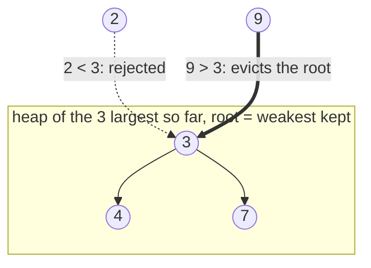

# Top K

A **top-k** question asks for the `k` best items out of `n`, scored by some rule,
and does not ask for anything about the other `n - k`. "The 3 largest numbers",
"the 5 closest points", "the 2 most frequent words" are all the same shape: a
score per item, a number `k`, and a request for the winners only

That is a strictly smaller question than sorting. Sorting puts all `n` items in
order, which answers "who is 47th" as a side effect, and you are never asked. It
is also a smaller question than the plain heap from
[heap basics](01_heap_basics.md), where the heap holds everything and you pop
until you are satisfied

The mental image is a club with exactly `k` places inside and a bouncer at the
door. The bouncer does not know or care how the people inside rank against each
other. He only tracks **the weakest person currently inside**, because that is the
only person a newcomer has to beat. Someone stronger walks in and the weakest one
walks out; someone weaker is turned away and nothing changes. That single
comparison, repeated `n` times, is the entire technique, and a heap is the
structure that hands you the weakest kept item in `O(1)`

## Spotting A Top-K Question

The wording that signals it:

- **"k largest", "k smallest", "k closest", "k most frequent", "k highest scoring"**,
  where the answer is a group of `k` things and their internal order is usually
  irrelevant
- **"the kth largest"** on its own, which is the same problem with the answer read
  off the top of the heap instead of dumped out of it
- **A stream**, as in "values keep arriving and after each one report the current
  kth largest". The input has no end, so anything that needs to see all of it at
  once is disqualified before you start
- **A frequency question**, as in "the k most common elements". The scoring step is
  a [frequency map](../../01_arrays_and_hashing/notes/02_hashing.md) and the
  selection step is top-k over the counts

Two nearby shapes are not this. If the question wants the **middle** of the data
rather than an end of it, that is the [two heaps](03_two_heaps.md) split. If the
`k` items have to be drawn in order from several already-sorted sources, that is
[k-way merge](04_k_way_merge.md)

## Why Sorting All n Values Answers A Bigger Question Than You Asked

The first idea for "give me the 3 largest of these numbers" is to sort the list
and slice the last three. It is short, it is correct, and it costs `O(n log n)`
because a comparison sort has to order every element against the others

For a single array of moderate size that is genuinely fine, and you should say so
out loud rather than pretending it is a disaster. The place it falls apart is the
version of the problem where the values **arrive one at a time** and you must
answer after every arrival, which is exactly *Kth Largest Element In A Stream*.
Sorting cannot be updated. One new value invalidates the sorted array, so you
re-sort from scratch, and answering after each of `m` arrivals costs
`O(m · n log n)`. You are also holding all `n` values forever to compute an answer
that only ever needs `k` of them

So the sort is doing two things you did not ask for. It ranks the losers, and it
cannot absorb a new item incrementally. Fix both by never keeping more than `k`
items and deciding each new item's fate on arrival

## The Size-K Min-Heap, Whose Root Is The Admission Cutoff

To keep the `k` largest values seen so far, the only question a new value has to
answer is whether it beats the **smallest** value you are currently keeping. If it
does not, it cannot be in the top `k`, because there are already `k` values at
least as large as it. If it does, it takes that value's place

The smallest of the kept values, retrieved instantly and updated cheaply, is
exactly what a **min-heap** gives you at its root. So the structure for the `k`
*largest* is a min-heap, which reads backwards the first time and is the single
most confused point in this topic



> "I will keep a min-heap capped at `k` entries. The root is the weakest value I
> am still keeping, so it is the bar a new value has to clear. Anything I pop off
> that root is permanently out, because `k` values already beat it."

The code pushes first and trims after, so the heap is momentarily size `k + 1`
and one `heappop` restores it:

```python
import heapq


def k_largest(nums: list[int], k: int) -> list[int]:
    heap: list[int] = []
    for x in nums:
        heapq.heappush(heap, x)
        if len(heap) > k:
            heapq.heappop(heap)
    return sorted(heap, reverse=True)


assert k_largest([4, 1, 7, 3, 9, 2, 5], 3) == [9, 7, 5]
assert k_largest([3, 2, 3, 1, 2, 4, 5, 5, 6], 4) == [6, 5, 5, 4]
assert k_largest([5], 1) == [5]
assert k_largest([], 3) == []
assert k_largest([1, 2], 0) == []
```

**The three lines that decide whether this is right**:

- `if len(heap) > k` runs after every push, not once at the end, because a heap
  that is allowed to grow to `n` is just a sorted-everything solution wearing a
  heap costume, and the `log k` in the bound becomes `log n`
- `heapq.heappop(heap)` removes the *root*, which is the minimum, so the value
  discarded is always the weakest candidate rather than the newest one. Pushing
  then popping the minimum is why a value smaller than the root is deleted on the
  same iteration it arrives
- `sorted(heap, reverse=True)` is there because **a heap is not a sorted list**.
  `heap` holds the right `k` values in heap order, so returning it directly is
  correct whenever the problem accepts any order, and wrong the moment it asks for
  descending order

`heapq.heappushpop(heap, x)` does the push and the pop in one sift instead of two,
and `if x > heap[0]` skips the work entirely for a value that cannot win. Both are
worth mentioning as tightenings; neither changes the complexity class

For the `k` **smallest**, every direction flips: you keep a max-heap, its root is
the largest kept value, and a new value gets in by being smaller. Python's `heapq`
has no max-heap, so negate the key as
[heap basics](01_heap_basics.md) established

## Dry Run: Keeping The 3 Largest Of `[4, 1, 7, 3, 9, 2, 5]`

The `heap` column is the underlying list in heap order, so position 0 is the root
and the rest is not sorted:

```text
x=4   pushed, size 1 <= 3, no pop     heap=[4]           root=4
x=1   pushed, size 2 <= 3, no pop     heap=[1, 4]        root=1
x=7   pushed, size 3 <= 3, no pop     heap=[1, 4, 7]     root=1
x=3   pushed, size 4 > 3, popped 1    heap=[3, 4, 7]     root=3
x=9   pushed, size 4 > 3, popped 3    heap=[4, 9, 7]     root=4
x=2   pushed, size 4 > 3, popped 2    heap=[4, 9, 7]     root=4   <- discarded itself
x=5   pushed, size 4 > 3, popped 4    heap=[5, 9, 7]     root=5
```

The `x=2` line is the one to study. Two was pushed and then immediately popped
back out, because it was smaller than the root and therefore already the minimum
of the four values in the heap. The heap list is byte-for-byte identical before
and after that step, which is what "this value cannot be in the top 3" looks like
mechanically: three values already beat it, so no future arrival can rescue it

The `x=1` line shows why the trim has to be a condition rather than an
unconditional pop. At that point only two values had been seen, and popping would
have thrown away a value that still belonged in the answer

Notice also that the final `heap=[5, 9, 7]` is not in any useful order. Reading it
left to right and calling it "the top 3 in descending order" is wrong, and the
only ordering guarantee is that position 0 holds the minimum

## Flipping The Direction: The K Closest Points

*K Closest Points To Origin* asks for the `k` points nearest `(0, 0)`, which is
`k` **smallest** by distance, so the heap flips to a max-heap and the root becomes
the *farthest* point you are still keeping. Negating the distance turns `heapq`'s
min-heap into that max-heap

```python
import heapq


def k_closest(points: list[list[int]], k: int) -> list[list[int]]:
    heap: list[tuple[int, int, int]] = []
    for x, y in points:
        heapq.heappush(heap, (-(x * x + y * y), x, y))
        if len(heap) > k:
            heapq.heappop(heap)
    return [[x, y] for _, x, y in heap]


assert sorted(k_closest([[1, 3], [-2, 2]], 1)) == [[-2, 2]]
assert sorted(k_closest([[3, 3], [5, -1], [-2, 4]], 2)) == [[-2, 4], [3, 3]]
assert k_closest([], 3) == []
```

The squared distance and the score-first tuple entry are both carried over from
[heap basics](01_heap_basics.md), which solved this same problem by heapifying all
`n` points and popping `k` times. What changes here is the cap. Negating the score
makes the root the *farthest* point being kept, so the trim discards the point
that is currently worst, the heap never holds more than `k` entries, and the space
drops from `O(n)` to `O(k)` because the `n - k` losers are never stored at all

## Holding The Answer Between Calls

*Kth Largest Element In A Stream* removes the array. Values arrive through repeated
`add` calls and each call must return the current kth largest, so the heap becomes
an instance attribute that survives between calls instead of a local that is
rebuilt

```python
import heapq


class KthLargest:
    def __init__(self, k: int, nums: list[int]) -> None:
        self.k = k
        self.heap: list[int] = nums[:]
        heapq.heapify(self.heap)
        while len(self.heap) > k:
            heapq.heappop(self.heap)

    def add(self, val: int) -> int:
        heapq.heappush(self.heap, val)
        if len(self.heap) > self.k:
            heapq.heappop(self.heap)
        return self.heap[0]


stream = KthLargest(3, [4, 5, 8, 2])
assert [stream.add(v) for v in (3, 5, 10, 9, 4)] == [4, 5, 5, 8, 8]
assert KthLargest(1, []).add(-1) == -1
```

`return self.heap[0]` is the whole reason "the kth largest" and "the k largest"
are one problem. The heap holds the `k` largest values, so its minimum is the
smallest of the top `k`, which is the kth largest overall. Reading the root is
`O(1)` and removes nothing

The constructor heapifies the seed list in `O(n)` and then trims, rather than
pushing the seed values one at a time, because building a heap from a list in bulk
is cheaper than `n` individual pushes. The initial list may be shorter than `k`,
which is why the trim is a `while` on the size rather than an assumption, and the
first few `add` calls then simply grow the heap

## When The Tie-Break Runs The Other Way

*Top K Frequent Words* wants the `k` most frequent words, and ties are broken by
**lexicographically smaller first**. That combination breaks the naive tuple entry,
because the two fields want opposite directions: for eviction purposes a lower
count is worse, but among equal counts a *larger* word is worse. A plain
`(count, word)` tuple gets the count right and the word backwards. On
`["i", "love", "leetcode", "i", "love", "coding"]` with `k = 1`, where `"i"` and
`"love"` both appear twice, the min-heap root of the two tied entries is
`(2, "i")`, so it evicts `"i"` and keeps `"love"`, which is exactly the wrong
survivor

Python compares tuples field by field, and there is no way to negate a string, so
you supply the reversed comparison with a tiny wrapper whose `__lt__` is flipped:

```python
import heapq
from collections import Counter


class ReverseWord:
    __slots__ = ("word",)

    def __init__(self, word: str) -> None:
        self.word = word

    def __lt__(self, other: "ReverseWord") -> bool:
        return self.word > other.word


def top_k_frequent_words(words: list[str], k: int) -> list[str]:
    counts = Counter(words)
    heap: list[tuple[int, ReverseWord]] = []
    for word, count in counts.items():
        heapq.heappush(heap, (count, ReverseWord(word)))
        if len(heap) > k:
            heapq.heappop(heap)
    return [entry.word for _, entry in sorted(heap, key=lambda p: (-p[0], p[1].word))]


forecast = ["the", "day", "is", "sunny", "the", "the", "the", "sunny", "is", "is"]

assert top_k_frequent_words(["i", "love", "leetcode", "i", "love", "coding"], 2) == ["i", "love"]
assert top_k_frequent_words(["i", "love", "leetcode", "i", "love", "coding"], 1) == ["i"]
assert top_k_frequent_words(forecast, 4) == ["the", "is", "sunny", "day"]
assert top_k_frequent_words(["a"], 1) == ["a"]
assert top_k_frequent_words([], 0) == []
```

> "The heap has to order entries worst-first so the root is the one to evict.
> Worst means fewer occurrences, and on a tie it means the alphabetically later
> word, so the string comparison has to be inverted while the count is not."

The final `sorted` is separate work and cannot be skipped, because the problem
asks for the answer in descending frequency with ties ascending, and the heap only
ever guaranteed which `k` words survive. Sorting `k` entries costs `O(k log k)`,
which is small next to the scan

If the wrapper class feels like too much to write under time pressure, say so and
use `heapq.nsmallest(k, counts, key=lambda w: (-counts[w], w))`, which applies the
same size-`k` heap internally and takes an ordinary sort key, so the negation
handles the count and the plain string handles the tie

## Counts That Change After Every Pick

*Task Scheduler*, *Reorganize String*, and *Sort Characters By Frequency* look like
top-k problems and use the same counting first step, but `k` is gone. The heap
holds **every** distinct count, and the loop repeatedly takes the current largest,
consumes one unit of it, and puts the remainder back

The reason a heap is required rather than one sort of the counts is that the
counts **change as you go**. Placing an `'a'` drops its count by one and may move
it behind `'b'`, so any static order computed up front is stale after the first
pick. A heap re-sorts itself in `O(log d)` per change, where `d` is the number of
distinct values

*Reorganize String* is the sharpest version. No two adjacent characters may match,
so pop the two most frequent, emit one of each, and push back whatever still has
count left. Taking two at a time is what guarantees the two emitted characters
differ

```python
import heapq
from collections import Counter


def reorganize_string(s: str) -> str:
    heap = [(-count, ch) for ch, count in Counter(s).items()]
    heapq.heapify(heap)
    out: list[str] = []
    while len(heap) > 1:
        count_a, a = heapq.heappop(heap)
        count_b, b = heapq.heappop(heap)
        out.append(a)
        out.append(b)
        if count_a + 1 < 0:
            heapq.heappush(heap, (count_a + 1, a))
        if count_b + 1 < 0:
            heapq.heappush(heap, (count_b + 1, b))
    if heap:
        count, ch = heap[0]
        if count < -1:
            return ""
        out.append(ch)
    return "".join(out)


assert reorganize_string("aab") == "aba"
assert reorganize_string("aaab") == ""
assert reorganize_string("a") == "a"
```

The counts are stored negated, so `count_a + 1` moves a negative count toward
zero, and `count_a + 1 < 0` means "there is still at least one left, push it back".
The impossible case is detected at the end rather than up front: if one character
is left over with more than one copy remaining, no arrangement exists, because a
single character repeated at the tail must sit next to itself

The same loop covers the neighbours in the ladder with one change each. *Sort
Characters By Frequency* pops the max and emits the character repeated `count`
times, never pushing anything back. *Task Scheduler* pops up to `n + 1` distinct
tasks per cooling round into a holding list, then pushes back the ones with count
remaining, and the answer counts the rounds. *Least Number Of Unique Integers
After K Removals* runs the mirror image on a **min**-heap, deleting the rarest
value first, because removing a small count wipes out a whole distinct value for
the least budget

## Worked Example: [Top K Frequent Elements](https://leetcode.com/problems/top-k-frequent-elements/)

Given an integer array, return the `k` values that appear most often. Two separate
steps hide in that sentence: scoring every distinct value by how often it occurs,
then selecting the `k` best scores

**Input**:

- `nums`, a `list[int]`, where `1 <= len(nums) <= 10^5` and every value satisfies
  `-10^4 <= nums[i] <= 10^4`, so values repeat freely and the number of distinct
  values can be anywhere from 1 to `len(nums)`
- `k`, an `int`, guaranteed to lie between 1 and the number of distinct values, so
  the request is always satisfiable

**Output**: a `list[int]` of exactly `k` elements, each a value from `nums`, being
the `k` values with the highest occurrence counts. The order of the returned list
does not matter, and the problem guarantees the answer is unique, so no tie-break
between two values with equal counts is ever needed. The output holds the values
themselves, not their counts and not their indices

The phrase "k most frequent" is the top-k signal, and the follow-up on the problem
page — do better than `O(n log n)` — rules out the sort. Counting is unavoidable
since frequency cannot be known without one pass, but sorting the `d` distinct
counts to pick `k` of them is the part that does more than asked, so replace it
with a size-`k` heap over the counts

> "One pass builds the counts. Then I select over the distinct values rather than
> the raw array, and I only ever keep `k` of them, so the selection costs
> `O(d log k)` instead of `O(d log d)`."

Therefore,

1. Count occurrences in a single pass with `Counter(nums)`, which gives a map from
   each distinct value to its count in `O(n)`. Everything after this works on the
   `d` distinct values, and `d` can be far smaller than `n`, which is the first
   saving
2. Create an empty heap that will hold at most `k` entries. Each entry is the tuple
   `(count, value)` with the count first, because the heap must order by frequency
   and carry the value along as payload
3. For each `(value, count)` in the map, push its tuple onto the heap. Push
   unconditionally rather than comparing first, since the comparison is an
   optimization and the trim below is what enforces correctness
4. Immediately after each push, if the heap now holds more than `k` entries, pop
   the root. The root is the smallest count in the heap, so the value discarded is
   the least frequent of the `k + 1` candidates, and it cannot belong in the answer
   because `k` values already beat it
5. When the scan ends, the heap holds exactly `k` entries and they are the `k`
   highest counts. There is no comparison left to make, since every value that lost
   was compared against the running cutoff at the moment it was considered
6. Strip the counts and return just the values. No sort is needed because the
   problem accepts any order, and skipping it keeps the final step at `O(k)`

```python
import heapq
from collections import Counter


def top_k_frequent(nums: list[int], k: int) -> list[int]:
    counts = Counter(nums)
    heap: list[tuple[int, int]] = []
    for value, count in counts.items():
        heapq.heappush(heap, (count, value))
        if len(heap) > k:
            heapq.heappop(heap)
    return [value for _, value in heap]


assert sorted(top_k_frequent([1, 1, 1, 2, 2, 3], 2)) == [1, 2]
assert top_k_frequent([1], 1) == [1]
assert sorted(top_k_frequent([4, 4, 4, 5, 5, 6], 3)) == [4, 5, 6]
assert top_k_frequent([], 0) == []
```

Tracing the first example, where `Counter` yields `1 -> 3`, `2 -> 2`, `3 -> 1` in
that order:

```text
push (3, 1)   size 1 <= 2, no pop     heap=[(3, 1)]
push (2, 2)   size 2 <= 2, no pop     heap=[(2, 2), (3, 1)]
push (1, 3)   size 3 > 2, popped (1, 3)   heap=[(2, 2), (3, 1)]
```

The value 3 is the discarded step. It entered the heap and left on the same
iteration, because its count of 1 was below the cutoff count of 2 that two other
values had already cleared

- **Time Complexity:** `O(n + d log k)`, where `n` is the length of `nums` and `d`
  is the number of distinct values, because counting touches each of the `n`
  elements once and each of the `d` distinct values then does one push and at most
  one pop on a heap capped at `k`
- **Space Complexity:** `O(d)`, because the counter stores one entry per distinct
  value, which dominates the `O(k)` heap since `k <= d` always holds

If the interviewer pushes further, the honest answer is that the counts can be
placed in buckets indexed by frequency, since a count is an integer between 1 and
`n`, and sweeping those buckets from the top gives `O(n)` time at the cost of an
`O(n)` array of buckets

## Time and Space Complexity

Throughout, `n` is the number of items scanned, `k` is the number kept, and `d` is
the number of **distinct** values, so `d <= n`.

**Selecting the `k` largest of `n` values**

| Approach                     | Time                                                                                                                                              | Space                                                                                                                     |
| ---------------------------- | ------------------------------------------------------------------------------------------------------------------------------------------------- | ------------------------------------------------------------------------------------------------------------------------- |
| Size-`k` min-heap            | `O(n log k)`: each of the `n` values does one push and at most one pop, and every heap operation costs `log` of the size, which never exceeds `k` | `O(k)`: the heap is trimmed back to `k` entries after every push, so its size is capped regardless of how large `n` grows |
| Sorting and slicing the tail | `O(n log n)`: a comparison sort orders every element against the others, including the `n - k` that get thrown away                               | `O(n)`: `sorted` copies the whole input into a new list before ordering it                                                |
| `heapq.nlargest(k, nums)`    | `O(n log k)`: the library runs this same size-`k` heap internally, so it is a shorthand rather than a different algorithm                         | `O(k)`: it keeps `k` candidates plus the `k`-element result it returns                                                    |

When `k` is close to `n`, `log k` is close to `log n` and the heap stops being an
improvement, which is worth saying out loud. The heap wins hardest when `k` is
small and fixed while `n` is large or unbounded. A third option for the single
kth-largest value is quickselect, which partitions around a pivot for `O(n)`
average time but degrades to `O(n²)` on adversarial pivots, and it needs the whole
array in memory, so it is unavailable on a stream

**Top K Frequent Elements**

| Approach                      | Time                                                                                                           | Space                                                                                                  |
| ----------------------------- | -------------------------------------------------------------------------------------------------------------- | ------------------------------------------------------------------------------------------------------ |
| Counting plus a size-`k` heap | `O(n + d log k)`: one pass to count, then `d` heap operations on a heap capped at `k`                          | `O(d)`: one counter entry per distinct value, which dominates the `O(k)` heap because `k <= d`         |
| Counting then sorting counts  | `O(n + d log d)`: the sort orders all `d` distinct values when only `k` are wanted                             | `O(d)`: the same counter, plus the sorted copy of its `d` items                                        |
| Counting then bucketing       | `O(n)`: a count is an integer in `1..n`, so it can index a bucket array directly and no comparisons are needed | `O(n)`: the bucket array has one slot per possible frequency, which is `n` slots even when `d` is tiny |

**Repeatedly popping the largest count, as in Reorganize String**

| Operation                   | Time                                                                                                                   | Space                                                                                                 |
| --------------------------- | ---------------------------------------------------------------------------------------------------------------------- | ----------------------------------------------------------------------------------------------------- |
| Building the heap of counts | `O(n + d)`: one pass over the `n` characters to count them, then `heapify` over the `d` distinct counts in linear time | `O(d)`: one heap entry per distinct character, which is at most 26 for lowercase input                |
| The emit loop as a whole    | `O(n log d)`: each of the `n` characters is emitted once, and each emission costs a pop and possibly a push at `log d` | `O(n)`: the output list holds every character once, which is output space rather than auxiliary space |

## Summary

- A **top-k** question asks for the `k` best items out of `n` by some score and
  says nothing about the other `n - k`, so any solution that produces a full
  ordering is answering a larger question than the one asked
  - The giveaway wordings are "k largest", "k closest", "k most frequent", and
    "the kth largest", which is the same problem with the answer read off the top
    of the heap instead of emptied out of it
- Keep a heap capped at `k` entries and let its root be the admission cutoff. Every
  arriving item is compared against the weakest item you are currently keeping, and
  it either takes that item's place or is discarded forever
  - For the `k` **largest** you keep a **min**-heap, which feels inverted until you
    say why: the root is the weakest survivor, and that is the only value a
    newcomer has to beat
  - For the `k` **smallest**, such as the `k` closest points, everything flips to a
    max-heap built by negating the score, and the root becomes the farthest point
    still being kept
- The cost is `O(n log k)` time and `O(k)` space, because each of the `n` items does
  one push and at most one pop on a heap whose size never exceeds `k`. Sorting is
  `O(n log n)` time and `O(n)` space, so the saving is real but shrinks to nothing
  as `k` approaches `n`
  - The version where it is not a tradeoff at all is the stream, since a sorted
    array cannot absorb a new value incrementally and the size-`k` heap answers in
    `O(log k)` per arrival while storing only `k` values
- Frequency flavours run in two stages: build a count map in `O(n)`, then do the
  top-k selection over the `d` **distinct** values rather than the raw array. Both
  bounds should be quoted separately, as in `O(n + d log k)`
- When the tie-break runs opposite to the primary score, as in *Top K Frequent
  Words* where higher counts win but alphabetically **earlier** words win ties, a
  plain tuple cannot express it, because a string cannot be negated the way a
  number can
  - Either wrap the string in a small class with an inverted `__lt__`, or hand
    `heapq.nsmallest` a key function such as `(-count, word)`
- A heap of counts with no cap at all, popping the largest and pushing back the
  decremented remainder, solves the scheduling family: *Reorganize String*, *Task
  Scheduler*, and *Sort Characters By Frequency*
  - A single up-front sort does not work there because the counts change after
    every pick and any precomputed order goes stale, whereas a heap re-orders
    itself in `O(log d)`
- The mistake that survives all the way to a wrong answer is treating the finished
  heap as sorted. Its list is in heap order, with only position 0 guaranteed to be
  the minimum, so a problem that wants the `k` values ranked needs an explicit
  `sorted` on the `k` survivors

## Interview Checklist

Before writing code, make sure you can answer each of these

```text
Am I being asked for k items, or for the single kth item, or for a full ordering?
Is it k largest or k smallest, and does that make my capped heap a min-heap or a max-heap?
What is the score, and does each heap entry need a payload alongside it?
Where exactly does the trim go, and is it conditional on the size exceeding k?
Can I explain why a value popped off the root can never come back into the answer?
Do ties need breaking, and does the tie-break run the same direction as the score?
Does the problem want the k results in order, or is heap order acceptable as-is?
Is the input a stream, which rules out sorting and quickselect entirely?
Does a counting step come first, and is my bound stated over distinct values, not n?
Do the scores change as I consume items, which means no cap and a pop-modify-push loop?
Is k close to n, in which case log k is close to log n and I should say the heap barely helps?
```
