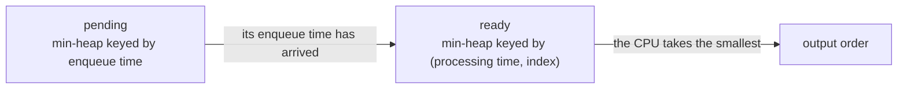

# Two Heaps

**Two heaps** means running two separate heaps at the same time, arranged so that
their tops face each other across a boundary. One heap holds the values on one
side of that boundary with its largest value on top, and the other holds the
values on the far side with its smallest value on top. Reading both tops reads
both sides of the boundary at once.

A single heap answers exactly one question, which is "what is the most extreme
value in here". It cannot tell you the second smallest without a pop, and it can
never tell you the middle. Two heaps get around that by choosing where the
boundary sits and keeping it there as values arrive.

Think of a sorted deck cut into two piles, with the low pile turned face up on
its top card and the high pile turned face up on its bottom card. The two
exposed cards are the two cards next to the cut. Move a card across the cut and
the exposed pair changes, but you never had to sort either pile to see them.

Two arrangements of this show up in interviews, and they look different enough
that people miss the second one:

- **Facing heaps**, where the boundary is a rank in the sorted order. The classic
  boundary is the median, so the low half is a max-heap and the high half is a
  min-heap
- **Pipeline heaps**, where the boundary is a condition rather than a rank. One
  heap holds items that are not usable yet, ordered by when they become usable,
  and hands each one to a second heap that ranks the items that are usable now

## Why A Heap Alone Cannot Show You The Middle

Numbers arrive one at a time and after each arrival you have to report the
median of everything seen so far. The direct idea is to keep one sorted list and
slot each new number into its correct position with `bisect.insort`. That gives
a genuinely `O(1)` median, since the middle of a sorted list is an index lookup.

Insertion is what kills it. Putting a value into the middle of a Python list
[shifts every larger element one slot right](../../00_fundamentals/notes/04_common_operation_costs.md),
which is `O(n)` per arrival and `O(n²)` across the whole stream. The binary
search that finds the position is fast, and then the write undoes all of that
saving.

Look at what the sorted list was doing, because the fix falls out of it. It was
holding a total order, which is expensive, purely so that one position in the
middle could be read, which is cheap. A heap makes the opposite trade: insertion
is `O(log n)` because only one root-to-leaf path is touched, and in exchange you
can read only the extreme.

The reconciling observation is that **the middle of the whole is the end of each
half**. Cut the sorted order at the median and the two values around the cut are
the maximum of the low half and the minimum of the high half. Those are both
extremes, so both are heap-readable. Neither half needs to be internally sorted,
because nothing except the two values at the cut is ever read.

```text
sorted view      1     3     5   |   15    22    40
                 \___________/       \____________/
                    low half            high half
                  a max-heap,          a min-heap,
                   top = 5              top = 15
                                ^
                    the median lives here, between the two tops
```

This is the same trick the front-middle-back queue uses when it
[splits into two deques at the midpoint](../../03_stacks_and_queues/notes/02_queue_and_deque.md)
so the middle becomes an end. Here the split is by value rather than by
position, and heaps rather than deques do the holding.

## Facing Heaps: The Low Half And The High Half

Two invariants define the structure, and every line of code exists to restore
one of them:

- **Ordering**: every value in `low` is less than or equal to every value in
  `high`. Without this the two tops are not the two values around the median,
  they are just two arbitrary values
- **Size**: `len(low) == len(high)`, or `len(low) == len(high) + 1`. The extra
  element goes to `low` by convention, so an odd count puts the median on `low`'s
  top and an even count averages the two tops

Python's `heapq` is a min-heap, so `low` stores
[negated values](01_heap_basics.md) and `-low[0]` is its true maximum.

The tempting way to write `add_num` is to pick the destination heap by size,
pushing into whichever half is currently shorter. That keeps the size invariant
and breaks the ordering one. Feed it 10, then 1, then 100: the 10 goes to `low`,
the 1 goes to `high` because `low` is now longer, and the 100 goes back to `low`
because the sizes are equal again. `low` now holds 10 and 100 while `high` holds
1, and the reported median is 100 when the true median is 10.

The fix removes the choice entirely. Push every new value into `low`, then
immediately relay `low`'s maximum over to `high`. That second step is what
enforces ordering, because the largest thing in the low half is exactly the
element that does not belong there if it exceeds anything in the high half. The
relay leaves `high` one too big whenever the sizes were even, so a single size
check sends one element back:

```python
import heapq


class MedianFinder:
    def __init__(self) -> None:
        self.low: list[int] = []  # max-heap of the smaller half, values negated
        self.high: list[int] = []  # min-heap of the larger half

    def add_num(self, num: int) -> None:
        heapq.heappush(self.low, -num)
        heapq.heappush(self.high, -heapq.heappop(self.low))
        if len(self.high) > len(self.low):
            heapq.heappush(self.low, -heapq.heappop(self.high))

    def find_median(self) -> float:
        if len(self.low) > len(self.high):
            return float(-self.low[0])
        return (-self.low[0] + self.high[0]) / 2


mf = MedianFinder()
mf.add_num(1)
mf.add_num(2)
assert mf.find_median() == 1.5
mf.add_num(3)
assert mf.find_median() == 2.0

single = MedianFinder()
single.add_num(5)
assert single.find_median() == 5.0
```

**The three lines of `add_num`, in order**:

- `heappush(self.low, -num)` is unconditional, and skipping the comparison is the
  point. The new value may well belong in `high`, and the next line will move it
  there without anybody having to decide
- `heappush(self.high, -heappop(self.low))` restores ordering by hand. Whatever
  the largest low-half value is after the insertion, it is the correct element to
  promote, because a max-heap's top is the only value in `low` that could exceed
  `high`'s minimum
- The `if` restores size. The relay always removes one from `low` and adds one to
  `high`, so `high` ends up one too large exactly when the two halves started
  equal, and one element comes straight back

`find_median` reads tops only and never mutates, so it is `O(1)`. The odd case
returns `low`'s top because the size invariant deliberately parks the extra
element there, which means you never have to ask which half is longer, only
whether they differ.

## Dry Run: Four Numbers Into The Median Finder

The stream is 5, 15, 1, 3. `low` is printed as true values rather than the
negated integers actually stored, since the negation is a Python detail and not
part of the idea.

```text
add 5    push 5 into low          low=[5]      high=[]
         relay 5 to high          low=[]       high=[5]
         high is bigger, undo     low=[5]      high=[]        median 5.0

add 15   push 15 into low         low=[5,15]   high=[]
         relay 15 to high         low=[5]      high=[15]      median 10.0

add 1    push 1 into low          low=[1,5]    high=[15]
         relay 5 to high          low=[1]      high=[5,15]
         high is bigger, undo     low=[1,5]    high=[15]      median 5.0

add 3    push 3 into low          low=[1,3,5]  high=[15]
         relay 5 to high          low=[1,3]    high=[5,15]    median 4.0
```

The step to study is the relay on `add 1`, which is immediately discarded. The
5 was moved out of `low` into `high` and then sent straight back on the very
next line, ending exactly where it started. That round trip looks wasteful and
is not, because until the relay ran there was no cheap way to know whether 5 or
1 was the value that belonged in the high half. The relay asks the question by
doing it, and the size check undoes it when the answer is no.

Compare that with `add 3`, where the same relay was kept. Both steps promoted
the number 5, and the only difference was the size of `high` afterwards.

The final state also shows why neither half is sorted. `low` holds 1 and 3 with
3 on top, and `high` holds 5 and 15 with 5 on top, so the median is
`(3 + 5) / 2 = 4`. The full sorted stream is `[1, 3, 5, 15]`, whose median is
also 4, and nothing ever sorted anything.

## Removing A Value That Is Not On Top

Sliding a window over the stream adds a new requirement. Every step admits one
new value and evicts the value that fell out the left side, and that evicted
value is almost never sitting on top of either heap. `heapq` has no
delete-by-value: finding the element is an `O(n)` scan and repairing the heap
afterwards is another `O(n)`, which drags one slide back to linear time.

The way out is to not delete it. A value buried in the middle of a heap is
invisible, since the only position anybody ever reads is the top. So mark the
evicted value as gone in a `delayed` counter, leave it parked where it is, and
throw it away later if and when it surfaces. This is **lazy deletion**, and it
is the standard companion to any heap that has to forget things.

Two consequences follow, and both are places people get it wrong:

- `len(low)` is no longer the number of live elements in the low half, because
  parked entries still count toward it. Track `low_size` and `high_size` by hand
  and balance on those numbers, never on `len`
- A top must be live before it is read or moved. Prune right after any operation
  that could leave a parked value exposed, which is an eviction of the current
  top and a rebalance that pops one off

```python
import heapq
from collections import Counter


def median_sliding_window(nums: list[int], k: int) -> list[float]:
    low: list[int] = []  # max-heap of the smaller half, values negated
    high: list[int] = []  # min-heap of the larger half
    delayed: Counter[int] = Counter()  # evicted but still parked in some heap
    low_size = 0
    high_size = 0

    def prune_low() -> None:
        while low and delayed[-low[0]]:
            delayed[-low[0]] -= 1
            heapq.heappop(low)

    def prune_high() -> None:
        while high and delayed[high[0]]:
            delayed[high[0]] -= 1
            heapq.heappop(high)

    def rebalance() -> None:
        nonlocal low_size, high_size
        if low_size > high_size + 1:
            heapq.heappush(high, -heapq.heappop(low))
            low_size -= 1
            high_size += 1
            prune_low()
        elif low_size < high_size:
            heapq.heappush(low, -heapq.heappop(high))
            high_size -= 1
            low_size += 1
            prune_high()

    def add(num: int) -> None:
        nonlocal low_size, high_size
        if not low or num <= -low[0]:
            heapq.heappush(low, -num)
            low_size += 1
        else:
            heapq.heappush(high, num)
            high_size += 1
        rebalance()

    def remove(num: int) -> None:
        nonlocal low_size, high_size
        delayed[num] += 1
        if low and num <= -low[0]:
            low_size -= 1
            if num == -low[0]:
                prune_low()
        else:
            high_size -= 1
            if high and num == high[0]:
                prune_high()
        rebalance()

    out: list[float] = []
    for i, num in enumerate(nums):
        add(num)
        if i >= k:
            remove(nums[i - k])
        if i >= k - 1:
            out.append(float(-low[0]) if k % 2 else (-low[0] + high[0]) / 2)
    return out


assert median_sliding_window([1, 3, -1, -3, 5, 3, 6, 7], 3) == [1.0, -1.0, -1.0, 3.0, 5.0, 6.0]
assert median_sliding_window([1, 2], 2) == [1.5]
assert median_sliding_window([5], 1) == [5.0]
```

**What changed relative to `MedianFinder`**:

- `add` picks its destination by comparing against `-low[0]` instead of always
  pushing into `low` and relaying. The relay trick is unavailable here, since a
  relay pops a top, and a top may be a parked corpse rather than a live value
- `remove` decides which side lost an element by the same comparison, and only
  bothers pruning when the evicted value is the top it just marked. A value
  buried deeper costs nothing to leave alone
- `rebalance` prunes after moving an element across, because the pop it just did
  may have exposed a parked value underneath
- The window fills before the first answer is emitted, so the eviction at
  `i >= k` and the first output at `i >= k - 1` are deliberately off by one

The counting argument for the cost is the same one that justifies any lazy
structure. Every value in `nums` is pushed a constant number of times and popped
at most once per push, so the total heap traffic over the whole run is `O(n)`
operations of `O(log n)` each, and the inner `while` in `prune_low` cannot run
more times in total than there were pushes.

## Pipeline Heaps: One Heap Gates, One Heap Ranks

The second arrangement splits on a condition rather than on rank. In
[IPO](https://leetcode.com/problems/ipo/) you have `n` projects, each with a
capital requirement and a profit, and starting capital `w`. You may run `k`
projects, and finishing one adds its profit to `w`. Maximize the final capital.

The greedy choice is obvious once stated: at each round take the most profitable
project you can currently afford. Doing it directly means scanning all `n`
projects on each of the `k` rounds to find that project, which is `O(kn)` and is
the version that times out.

What makes the scan wasteful is that **the gate only ever opens**. Capital never
decreases, because profits are non-negative, so a project that is affordable in
round three is still affordable in round seven. Every rescan therefore re-derives
a fact that was already known. Once a project becomes affordable it can move,
permanently, into a structure that ranks by profit:

- The **gate heap** is a min-heap keyed by capital requirement, holding the
  projects still out of reach. Its top is the cheapest thing not yet unlocked,
  so one comparison tells you whether anything new has opened up
- The **ranking heap** is a max-heap keyed by profit, holding everything already
  unlocked. Its top is the answer for this round

```python
import heapq


def find_maximized_capital(k: int, w: int, profits: list[int], capital: list[int]) -> int:
    locked = list(zip(capital, profits))
    heapq.heapify(locked)  # gate heap: cheapest capital requirement on top
    unlocked: list[int] = []  # ranking heap: best profit on top, negated
    for _ in range(k):
        while locked and locked[0][0] <= w:
            _, profit = heapq.heappop(locked)
            heapq.heappush(unlocked, -profit)
        if not unlocked:
            break
        w -= heapq.heappop(unlocked)
    return w


assert find_maximized_capital(2, 0, [1, 2, 3], [0, 1, 1]) == 4
assert find_maximized_capital(3, 0, [1, 2, 3], [0, 1, 2]) == 6
assert find_maximized_capital(1, 0, [1, 2, 3], [1, 1, 2]) == 0
assert find_maximized_capital(5, 7, [], []) == 7
```

The `break` is the edge case that gets skipped. If nothing is affordable and the
gate heap's cheapest project is still out of reach, no future round can help
either, because `w` cannot grow without running something. Returning `w`
immediately is correct, and looping the remaining rounds would either spin or
crash on an empty pop.

`w -= heapq.heappop(unlocked)` subtracts because the profits are stored negated
for max-heap behaviour, so subtracting a negative adds the profit.

**The property to name out loud is monotonicity of the gate.** Each project
crosses from `locked` to `unlocked` exactly once and never returns, which is what
bounds the total work at `O(n log n)` regardless of `k`. If capital could fall,
or if a project could expire, items would have to move back and this whole shape
collapses.

That structure generalizes past IPO. Whenever a problem has items that *become*
eligible over time and a choice among the currently eligible ones, the same two
heaps apply:



In [Process Tasks Using Servers](https://leetcode.com/problems/process-tasks-using-servers/)
the same diagram holds with a busy-servers heap keyed by free time feeding a
free-servers heap keyed by weight and index, and the clock is what opens the
gate. The next section works the CPU version end to end.

## Worked Example: [Single-Threaded CPU](https://leetcode.com/problems/single-threaded-cpu/)

Tasks arrive at known times, and a single-threaded CPU runs them one at a time
until each finishes. Whenever the CPU is free it starts the shortest task that
has already arrived, breaking ties by the smaller original index. If nothing has
arrived yet, the CPU idles until the next arrival. Report the order the tasks
are run in.

**Input**: `tasks`, a `list[list[int]]` where `tasks[i] = [enqueue_time_i, processing_time_i]`, both positive integers. The list is non-empty on LeetCode,
and the values are large enough that the running clock can exceed any single
task's arrival time by a wide margin, so the clock is a plain Python `int` and
never wraps

**Output**: a `list[int]` of every task's original index, in the order the CPU
runs them. It is a permutation of `0 .. len(tasks) - 1` and has the same length
as `tasks`, so it is a schedule rather than a selection, and nothing is ever
dropped

This is the **pipeline heaps** shape, with the clock as the gate. Rescanning
every unfinished task each time the CPU frees up is `O(n²)`, and it repeats work
because a task that has already arrived stays arrived forever, exactly like the
capital gate in IPO. The two heaps are a `pending` min-heap keyed by enqueue
time, which answers "what arrives next", and a `ready` min-heap keyed by the pair
`(processing_time, index)`, which answers "what should run next". Tuple ordering
makes the tie-break free, since Python compares the second field only when the
first ties.

> "I will keep two heaps. The first is keyed by enqueue time and holds tasks that
> have not arrived yet, so its top tells me when the CPU can stop idling. The
> second is keyed by processing time then index and holds tasks that have
> arrived, so its top is the task the rule says to run. Every task crosses from
> the first heap to the second exactly once, because arrival is permanent, which
> makes the whole run `O(n log n)`."

Therefore,

1. Build `pending` as a list of `(enqueue_time, processing_time, index)` triples
   and `heapify` it, which is `O(n)` and cheaper than sorting. Enqueue time comes
   first in the tuple because that is the key this heap is ordered by, and the
   index is carried along so the answer can name the task later
2. Keep a running clock `time`, starting at 0, that always holds the moment the
   CPU is next free. Everything in the loop is a decision made at that instant
3. Loop while either heap is non-empty, since work can be waiting in `pending`
   even when nothing is `ready`, and vice versa
4. If `ready` is empty and the earliest pending task arrives later than `time`,
   jump `time` forward to that arrival. This is the idle case, and jumping rather
   than ticking is what keeps the loop bounded by the number of tasks instead of
   by the clock. Guard it on `ready` being empty, because if something is ready
   the CPU must run it now rather than wait for a possibly better task
5. Move every task whose enqueue time has now been reached out of `pending` and
   into `ready`, re-keyed as `(processing_time, index)`. Since `pending` is
   ordered by arrival, checking its top is enough, and the loop stops at the first
   task that has not arrived
6. Pop `ready` to get the shortest available task, append its index to the answer,
   and advance `time` by its processing time, which is when the CPU frees up again
7. Repeat. Each iteration runs exactly one task, so the loop executes once per
   task and the answer comes out in schedule order

```python
import heapq


def get_order(tasks: list[list[int]]) -> list[int]:
    pending = [(enqueue, proc, i) for i, (enqueue, proc) in enumerate(tasks)]
    heapq.heapify(pending)
    ready: list[tuple[int, int]] = []
    order: list[int] = []
    time = 0
    while pending or ready:
        if not ready and pending[0][0] > time:
            time = pending[0][0]
        while pending and pending[0][0] <= time:
            enqueue, proc, i = heapq.heappop(pending)
            heapq.heappush(ready, (proc, i))
        proc, i = heapq.heappop(ready)
        order.append(i)
        time += proc
    return order


assert get_order([[1, 2], [2, 4], [3, 2], [4, 1]]) == [0, 2, 3, 1]
assert get_order([[7, 10], [7, 12], [7, 5], [7, 4], [7, 2]]) == [4, 3, 2, 0, 1]
assert get_order([[1, 1]]) == [0]
assert get_order([]) == []
```

Tracing `[[1, 2], [2, 4], [3, 2], [4, 1]]`, with `ready` shown as
`(processing_time, index)` pairs at the moment the CPU chooses:

```text
time=0   nothing ready, jump the clock to 1
time=1   unlock task 0             ready=[(2,0)]           run 0, free at 3
time=3   unlock tasks 1 and 2      ready=[(2,2), (4,1)]    run 2, free at 5
time=5   unlock task 3             ready=[(1,3), (4,1)]    run 3, free at 6
time=6   nothing new to unlock     ready=[(4,1)]           run 1, free at 10
```

The rejected step is at `time=3`. Task 1 had been waiting since time 2 and task
2 only arrived at time 3, and task 2 ran first anyway because its processing time
of 2 beats task 1's 4. Arrival order buys a task nothing once it is in `ready`,
which is the whole reason the second heap is keyed by processing time and not by
enqueue time. Task 1 loses again at `time=5` to the even shorter task 3, and only
runs when it is the last thing left.

The clock jump on the first line is the other thing to notice. Nothing had
arrived at time 0, so the CPU skipped straight to 1 rather than advancing one
unit at a time, which is what keeps the running time independent of how large the
timestamps are.

- **Time Complexity**: `O(n log n)` for `n` tasks, because `heapify` is `O(n)` and
  every task is popped from `pending` once and pushed then popped in `ready` once,
  which is `O(n)` heap operations each costing `O(log n)`
- **Space Complexity**: `O(n)`, because a task sits in exactly one of `pending`
  and `ready` at any moment, so the two heaps together hold at most `n` entries,
  plus the `n`-length output list

## Time and Space Complexity

Throughout, `n` is the number of values inserted over the whole run and `k` is
the window width in the sliding-window problem.

**Find Median From Data Stream, with facing heaps**

| Operation                                      | Time                                                                                                                     | Space                                                                                             |
| ---------------------------------------------- | ------------------------------------------------------------------------------------------------------------------------ | ------------------------------------------------------------------------------------------------- |
| `add_num`                                      | `O(log n)`: at most three heap operations, each rebalancing one root-to-leaf path of a heap holding about `n / 2` values | `O(n)`: the two heaps partition the values seen so far, storing each exactly once                 |
| `find_median`                                  | `O(1)`: it reads `low[0]` and `high[0]`, which are array index lookups, and mutates nothing                              | `O(1)`: it allocates nothing beyond the returned float                                            |
| `bisect.insort` into one sorted list, rejected | `O(n)` per add: the binary search is `O(log n)` but the insert shifts every larger element one slot right                | `O(n)`: a single list holding every value, which is why space is not what rules this approach out |

**Sliding Window Median, with lazy deletion**

| Operation                                                       | Time                                                                                                                                                                 | Space                                                                                                                                                |
| --------------------------------------------------------------- | -------------------------------------------------------------------------------------------------------------------------------------------------------------------- | ---------------------------------------------------------------------------------------------------------------------------------------------------- |
| One slide, meaning one `add`, one `remove`, and one median read | `O(log n)` amortized: each value is pushed a constant number of times and popped at most once per push, so the pruning loops cannot outpace the pushes that fed them | `O(n)`: parked entries linger until they surface, so the heaps can grow to hold one entry per value ever inserted rather than only the `k` live ones |
| The whole run over `nums`                                       | `O(n log n)`: `O(n)` total heap operations across all slides, each `O(log n)`                                                                                        | `O(n)`: the two heaps plus the `delayed` counter, which holds at most one key per distinct evicted value                                             |
| Re-sorting each window, rejected                                | `O((n - k + 1) · k log k)`: every window is sorted from scratch, discarding the `k - 1` elements it shares with the previous one                                     | `O(k)`: one sorted copy of the current window at a time                                                                                              |

**Pipeline heaps, as in IPO and Single-Threaded CPU**

| Operation                                 | Time                                                                                                                                                                              | Space                                                                                                       |
| ----------------------------------------- | --------------------------------------------------------------------------------------------------------------------------------------------------------------------------------- | ----------------------------------------------------------------------------------------------------------- |
| The whole run over `n` items              | `O(n log n)`: each item crosses from the gate heap to the ranking heap exactly once, because the gate only ever opens, so the total is `O(n)` heap operations of `O(log n)`       | `O(n)`: an item is in exactly one of the two heaps at any moment, so together they hold at most `n` entries |
| One selection round                       | `O(log n)` plus the cost of whatever it unlocks: the pop from the ranking heap is `O(log n)`, and the unlocking `while` is charged to the items it moves rather than to the round | `O(1)`: a round allocates nothing, since it only moves entries between existing heaps                       |
| Rescanning all items each round, rejected | `O(rn)` for `r` rounds: every round re-derives which items are eligible, a fact that never changes back                                                                           | `O(n)`: the items themselves in a plain list, with no auxiliary structure                                   |

## Summary

- **Two heaps** means keeping two heaps whose tops face each other across a
  boundary, so that reading both tops reads both sides of the boundary in `O(1)`.
  One heap alone can only ever report a single extreme value
  - The two arrangements are **facing heaps**, where the boundary is a rank such
    as the median, and **pipeline heaps**, where the boundary is a condition such
    as "has this arrived yet"
- The insight behind the median split is that the middle of the whole collection
  is the *end* of each half, and ends are exactly what heaps expose. So the low
  half goes in a max-heap and the high half in a min-heap, and neither half is
  ever sorted internally because only the two values beside the cut are read
- Facing heaps need two invariants at once, and code that maintains only one of
  them is the standard bug. Ordering says every value in `low` is at most every
  value in `high`, and size says the halves are equal or `low` has exactly one
  extra
  - Choosing the destination heap by size alone keeps the sizes right and lets a
    small value get stranded in the high half, which silently reports a wrong
    median rather than crashing
  - Pushing into `low` and unconditionally relaying `low`'s maximum into `high`
    enforces ordering with no comparison at all, and one size check afterwards
    sends the element back when the relay was not needed
- Since Python's `heapq` is a min-heap, the low half stores negated values, so its
  true maximum is `-low[0]` and every value pushed or popped there flips sign
- When values have to *leave* the structure, as in a sliding window, use **lazy
  deletion**: mark the evicted value in a counter, leave it parked in whatever
  heap holds it, and discard it only if it surfaces at a top
  - A parked entry is harmless anywhere except on top, because the top is the only
    position that is ever read
  - `len(low)` stops being the live count once entries are parked, so the balance
    logic has to run on separately tracked `low_size` and `high_size` integers
- Pipeline heaps work because **the gate is monotone**: capital only grows and the
  clock only advances, so an item that becomes eligible stays eligible and crosses
  from the gate heap to the ranking heap exactly once
  - That one-way crossing is what makes the whole run `O(n log n)` instead of
    `O(rn)` for `r` rounds, and it is the sentence to say out loud
  - It also tells you when the pattern does *not* apply, since an eligibility
    condition that can turn back off would require moving items backwards
- The costs are `O(log n)` per insertion and `O(1)` per median read, with `O(n)`
  space, for both `MedianFinder` and the pipeline problems
  - The sliding-window version is `O(log n)` **amortized** per slide rather than
    worst case, since a single `remove` can trigger a run of pruning pops, and its
    space is `O(n)` rather than `O(k)` because parked entries outlive the window

## Interview Checklist

Before writing code, make sure you can answer each of these

```text
Is the boundary a rank in the sorted order, or a condition that turns on over time?
Which half is the max-heap and which is the min-heap, and why that way around?
What is the size invariant, and which half deliberately holds the extra element?
How does a new value get placed without breaking the ordering between the halves?
Am I negating on both the push and the pop for the max-heap side?
Is the median read from one top or averaged from two, and how do I decide?
Do values ever leave, and if so am I using lazy deletion with tracked live counts?
With lazy deletion, is a top guaranteed live before I read it or move it?
Is the gate monotone, so that an item crosses from one heap to the other only once?
What does one heap entry hold: a bare value, or a tuple that carries a tie-break?
What happens when the ranking heap is empty but the gate heap is not?
```
