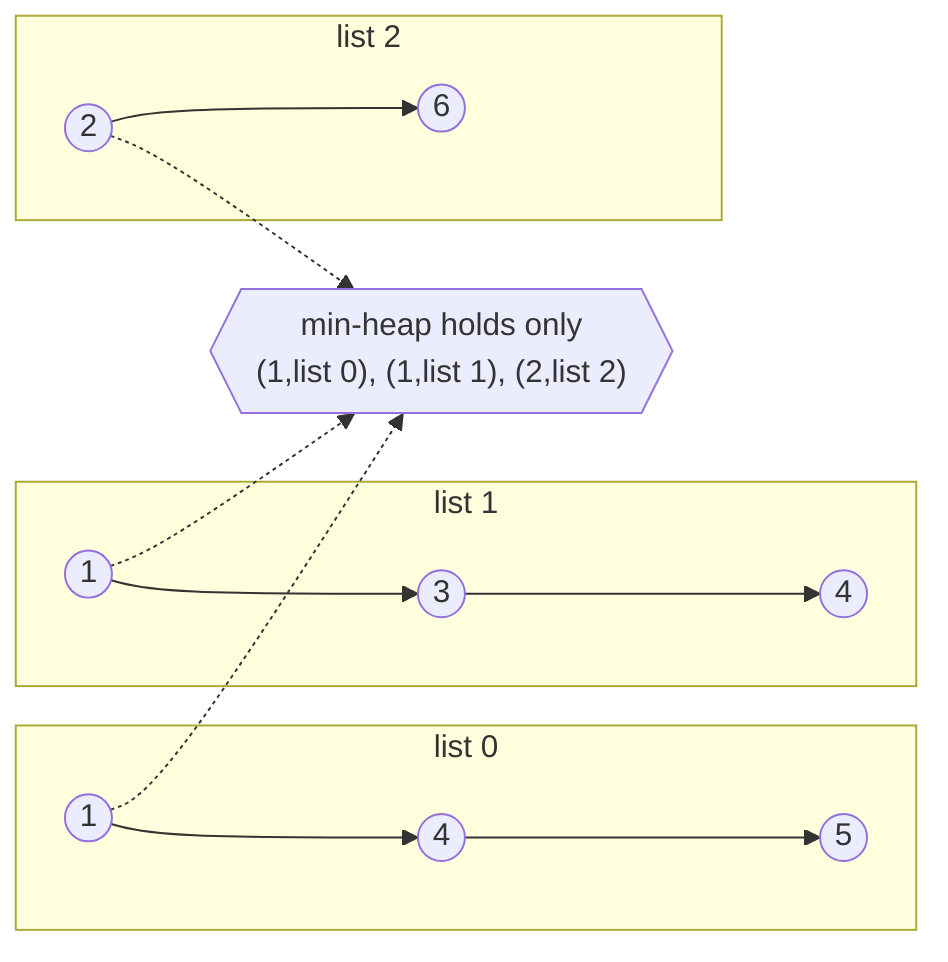

# Merging k Sorted Sources

A **k-way merge** takes `k` sequences that are each already sorted and produces
one sorted sequence containing everything in them. The `k` is the number of
sequences, and **merge** means the result is a single ordered run rather than `k`
runs stapled end to end

You have already done the `k = 2` case. In
[merging two sorted lists](../../06_linked_lists/notes/04_merge_split.md) you held
a pointer into each list, compared the two values under those pointers, took the
smaller one, and advanced only the pointer you took from. Nothing in that argument
cared that there were exactly two lists. With `k` lists you hold `k` pointers,
compare the `k` values under them, take the smallest, and advance only the pointer
you took from

The value sitting under a pointer is that source's **candidate**, also called its
head. Candidates are the only values worth looking at, because each source is
sorted, so the smallest value a source will ever offer again is the one at its
current position and everything behind that position is larger. The next value of
the merged output is therefore the smallest of the `k` candidates, and never
anything deeper

```text
list 0   [ 1 ][ 4 ][ 5 ]
           ^
list 1   [ 1 ][ 3 ][ 4 ]
           ^
list 2   [ 2 ][ 6 ]
           ^
candidates 1, 1, 2   ->   the next output is 1, and no other value can beat it
```

Picture three queues at a ticket counter, each already in ticket order. To
announce the next number globally you only read the three people standing at the
front, since everyone behind them holds a higher number in their own line

## Finding The Minimum Of k Candidates, N Times

Write `N` for the total number of values across all sources and `k` for the number
of sources. The skeleton above is forced on you, so the only open question is what
"smallest of the `k` candidates" costs. The direct answer is to scan all `k` of
them on every step, which is `O(k)` work per output value and `O(N * k)` in total

That product is the problem. With `k = 1000` sources holding `N = 100000` values
between them, the scan performs one hundred million comparisons to emit a hundred
thousand numbers, and nearly all of that work is rediscovering an order it already
knew. Between two consecutive steps the candidate set changes by exactly one
entry, because you remove the value you just emitted and add its successor from
that same source. The scan throws away the other `k - 1` comparisons and redoes
them from scratch

"Give me the smallest of a set, then let me remove one item and insert another" is
the exact contract of a [heap](01_heap_basics.md), which reads the minimum at its
root in `O(1)` and absorbs the removal plus the insertion in `O(log k)`. Swapping
the scan for a heap turns `O(N * k)` into `O(N log k)`

The tempting shortcut is to push all `N` values into one heap and drain it. That
is correct, and it is also just heapsort, costing `O(N log N)` time and `O(N)`
space. The entire saving comes from the heap never holding more than one candidate
per source, which pins its size at `k` and every operation at `log k` instead of
`log N`

> "Each source is sorted, so the next value overall is the minimum of the `k`
> current heads. I will keep exactly those `k` heads in a min-heap, pop the
> smallest, and push the successor from whichever source it came from."

## What One Heap Entry Has To Carry

Popping the smallest candidate is only half a step, because you then have to
**advance the source that candidate came from**. A bare value cannot tell you
which source that was, so the entry has to carry its own provenance. The standard
entry is a three-field tuple

```text
(value, source_index, position_in_that_source)
```

Each field is doing a job, and [tuple ordering](01_heap_basics.md) compares them
left to right

- `value` goes first because that is what the heap must order by, and every
  comparison should be settled by it whenever it can be
- `source_index` says which source to advance after the pop, and it doubles as the
  tie-break when two sources offer equal values
- `position_in_that_source` says where the value sat, so the successor is at
  `position + 1` without searching for it

The tie-break is not cosmetic. Two sources can hold the same value, and when the
first fields tie Python moves on to the second. Since only one entry per source is
ever live, the `source_index` values in the heap are distinct, so the comparison
always stops at the second field and never reaches the third. That matters when
the third field is an object with no ordering defined on it, such as a linked-list
node, because comparing two of those raises
`TypeError: '<' not supported between instances of 'ListNode' and 'ListNode'`

## The Merge Over Arrays

```python
import heapq


def merge_sorted_arrays(lists: list[list[int]]) -> list[int]:
    heap: list[tuple[int, int, int]] = [(row[0], src, 0) for src, row in enumerate(lists) if row]
    heapq.heapify(heap)

    merged: list[int] = []
    while heap:
        value, src, idx = heapq.heappop(heap)
        merged.append(value)
        if idx + 1 < len(lists[src]):
            heapq.heappush(heap, (lists[src][idx + 1], src, idx + 1))

    return merged


assert merge_sorted_arrays([[1, 4, 5], [1, 3, 4], [2, 6]]) == [1, 1, 2, 3, 4, 4, 5, 6]
assert merge_sorted_arrays([[3], [], [1, 2]]) == [1, 2, 3]
assert merge_sorted_arrays([]) == []
assert merge_sorted_arrays([[], []]) == []
```

**Three lines decide whether this works**:

- `if row` filters out empty sources while the heap is being seeded, because an
  empty source has no candidate at all and `row[0]` on it raises `IndexError`.
  This is the input shape interviewers reach for first, which is why the third and
  fourth asserts exist
- `heapq.heapify(heap)` builds the heap from the `k` starting candidates in
  `O(k)`, which is cheaper than `k` separate pushes at `O(k log k)`
- `if idx + 1 < len(lists[src])` is the only place the heap is allowed to grow. A
  source that has run out simply pushes nothing, so the heap shrinks by one for the
  rest of the run, and that is how the loop terminates without any separate
  exhausted-source bookkeeping

## Dry Run: Three Sorted Lists

The sources are `[1, 4, 5]`, `[1, 3, 4]`, and `[2, 6]`, so `k = 3` and `N = 8`.
Entries print as `(value, source, position)`

```text
start                              heap=[(1,0,0), (1,1,0), (2,2,0)]   out=[]
pop (1,0,0)  push (4,0,1)          heap=[(1,1,0), (2,2,0), (4,0,1)]   out=[1]
pop (1,1,0)  push (3,1,1)          heap=[(2,2,0), (3,1,1), (4,0,1)]   out=[1,1]
pop (2,2,0)  push (6,2,1)          heap=[(3,1,1), (4,0,1), (6,2,1)]   out=[1,1,2]
pop (3,1,1)  push (4,1,2)          heap=[(4,0,1), (4,1,2), (6,2,1)]   out=[1,1,2,3]
pop (4,0,1)  push (5,0,2)          heap=[(4,1,2), (5,0,2), (6,2,1)]   out=[1,1,2,3,4]
pop (4,1,2)  push NOTHING          heap=[(5,0,2), (6,2,1)]            out=[1,1,2,3,4,4]
pop (5,0,2)  push NOTHING          heap=[(6,2,1)]                     out=[1,1,2,3,4,4,5]
pop (6,2,1)  push NOTHING          heap=[]                            out=[1,1,2,3,4,4,5,6]
```

The very first pop is a tie, since sources 0 and 1 both offer a `1`. The heap
compared `(1, 0, 0)` against `(1, 1, 0)`, found the values equal, and decided on
the source index, so source 0's value came out first. Either order would have
produced a correctly sorted output, and the point of the tie-break is not which
one wins but that the comparison stops at the second field instead of running into
the third

The discarded pushes are the more interesting half. On the sixth pop, which took
`(4, 1, 2)`, position `2` was the last position of source 1, so
`idx + 1 < len(...)` failed and no replacement candidate went in. The heap fell
to two entries and then one, and
emptiness is what ends the loop. Compare that with pushing everything up front,
where the heap would have started at eight entries and every one of the sixteen
operations would have paid `log 8` rather than `log 3`

## Merging k Linked Lists

[Merge K Sorted Lists](https://leetcode.com/problems/merge-k-sorted-lists/) is the
same algorithm over
[linked lists](../../06_linked_lists/notes/01_linked_list_basics.md). There is no
index to advance, so the successor is `node.next`, and the entry carries the node
itself in place of a position



```python
import heapq


class ListNode:
    def __init__(self, val: int = 0, next: "ListNode | None" = None) -> None:
        self.val = val
        self.next = next


def merge_k_lists(lists: list[ListNode | None]) -> ListNode | None:
    heap: list[tuple[int, int, ListNode]] = [(head.val, src, head) for src, head in enumerate(lists) if head is not None]
    heapq.heapify(heap)

    dummy = ListNode()
    tail = dummy
    while heap:
        _, src, node = heapq.heappop(heap)
        tail.next = node
        tail = node
        if node.next is not None:
            heapq.heappush(heap, (node.next.val, src, node.next))

    return dummy.next


def build(values: list[int]) -> ListNode | None:
    head: ListNode | None = None
    for value in reversed(values):
        head = ListNode(value, head)
    return head


def to_list(head: ListNode | None) -> list[int]:
    out: list[int] = []
    while head is not None:
        out.append(head.val)
        head = head.next
    return out


merged = merge_k_lists([build([1, 4, 5]), build([1, 3, 4]), build([2, 6])])
assert to_list(merged) == [1, 1, 2, 3, 4, 4, 5, 6]
assert to_list(merge_k_lists([])) == []
assert to_list(merge_k_lists([None])) == []
```

Drop the `src` field here and the two `1` values collide, Python falls through to
comparing two `ListNode` objects, and the run dies with the `TypeError` named
above. The middle field is load-bearing rather than decorative

The nodes are relinked rather than copied, so no second list is allocated and the
extra space stays at `O(k)` for the heap. The
[dummy head](../../06_linked_lists/notes/01_linked_list_basics.md) removes the
special case for the first node, since `tail` then always points at something real

No cleanup line is needed at the end. The final `tail` is the node holding the
maximum value, and its `next` is already `None`, because if it had a successor
that successor would have been pushed and the heap would not be empty

## Rows Of A Sorted Matrix Are Already k Sorted Sources

Nothing in the merge requires the sources to arrive as a list of lists. In
[Kth Smallest Element In A Sorted Matrix](https://leetcode.com/problems/kth-smallest-element-in-a-sorted-matrix/)
you are given an `n` by `n` matrix whose rows and columns are each sorted, which
means every row is a sorted source and the matrix is `n` of them stacked. Two
extra observations shrink the work

- You can stop after `k` pops, because the `k`th value popped out of a k-way merge
  is the `k`th smallest overall, and nothing popped later can change it
- Only the first `min(n, k)` rows can hold the answer, because column `0` is
  sorted, so `matrix[k][0]` already has the `k` values `matrix[0][0]` through
  `matrix[k - 1][0]` sitting at or below it and cannot itself be the `k`th smallest

```python
import heapq


def kth_smallest(matrix: list[list[int]], k: int) -> int:
    n = len(matrix)
    heap: list[tuple[int, int, int]] = [(matrix[r][0], r, 0) for r in range(min(n, k))]
    heapq.heapify(heap)

    value = 0
    for _ in range(k):
        value, r, c = heapq.heappop(heap)
        if c + 1 < n:
            heapq.heappush(heap, (matrix[r][c + 1], r, c + 1))

    return value


assert kth_smallest([[1, 5, 9], [10, 11, 13], [12, 13, 15]], 8) == 13
assert kth_smallest([[-5]], 1) == -5
```

The merge is not the only way to answer this one.
[Binary search on the answer](../../05_binary_search/notes/04_search_on_answer.md)
counts how many matrix values are at most a candidate `v` and reaches
`O(n log r)` for a value range of width `r`, which beats the heap once `k` grows
large. Say that comparison out loud, since the interviewer is usually waiting for
it

## When A Source Manufactures Its Own Successors

In [Super Ugly Number](https://leetcode.com/problems/super-ugly-number/) there are
no lists at all. You are given a list of primes and asked for the `n`th smallest
positive integer whose prime factors all come from that list, counting from `1`

Each prime is still a sorted source, because the multiples it produces from
already-confirmed answers come out in increasing order. What changes is that a
source's successor does not exist until you generate it, so instead of advancing
an index you multiply the value you just popped by every prime and push the
results

That creates a problem the array version never had. The same number is reachable
along more than one route, since `2 * 3` and `3 * 2` are both `6`, so a value can
enter the heap twice and be emitted twice. A **seen set** rejects any candidate
that has already been generated

```python
import heapq


def nth_super_ugly_number(n: int, primes: list[int]) -> int:
    heap: list[int] = [1]
    seen: set[int] = {1}

    value = 1
    for _ in range(n):
        value = heapq.heappop(heap)
        for prime in primes:
            nxt = value * prime
            if nxt not in seen:
                seen.add(nxt)
                heapq.heappush(heap, nxt)

    return value


assert nth_super_ugly_number(12, [2, 7, 13, 19]) == 32
assert nth_super_ugly_number(1, [2, 3, 5]) == 1
```

Tracing the first five pops with `primes = [2, 3, 5]` shows the rejections doing
real work

```text
pop 1   generated 2, 3, 5                      heap=[2, 3, 5]
pop 2   generated 4, 6, 10                     heap=[3, 4, 5, 6, 10]
pop 3   generated 9, 15, REJECTED 6            heap=[4, 5, 6, 9, 10, 15]
pop 4   generated 8, 12, 20                    heap=[5, 6, 8, 9, 10, 12, 15, 20]
pop 5   generated 25, REJECTED 10, REJECTED 15 heap=[6, 8, 9, 10, 12, 15, 20, 25]
```

The `6` rejected on the third line had already been pushed by `2 * 3` on the line
above, and without the set it would sit in the heap twice and be returned as two
separate answers, so the twelfth pop would be wrong rather than merely slow. The
same duplicate-state guard appears whenever the successors of two different
sources can collide, which includes grid-shaped frontiers where a cell is
reachable both from the left and from above

## Tracking The Max While The Heap Tracks The Min

[Smallest Range Covering Elements From K Lists](https://leetcode.com/problems/smallest-range-covering-elements-from-k-lists/)
asks for the shortest interval `[a, b]` containing at least one number from each
of `k` sorted lists. Run the merge and the current `k` candidates are, by
construction, one number from every list, so the interval running from the
smallest candidate to the largest candidate always covers all `k` lists. Every
such interval is a legal answer, and you want the narrowest of them

The heap already hands you the smallest candidate at its root. The largest is not
available from a min-heap, so track it in a plain variable, which is enough
because the maximum only ever moves upward. A newly pushed successor is larger
than the value it replaced, so `current_max = max(current_max, nxt)` never misses
anything

```python
import heapq


def smallest_range(nums: list[list[int]]) -> list[int]:
    heap: list[tuple[int, int, int]] = [(row[0], src, 0) for src, row in enumerate(nums)]
    heapq.heapify(heap)

    current_max = max(row[0] for row in nums)
    best = [heap[0][0], current_max]

    while True:
        value, src, idx = heapq.heappop(heap)
        if current_max - value < best[1] - best[0]:
            best = [value, current_max]
        if idx + 1 == len(nums[src]):
            return best
        nxt = nums[src][idx + 1]
        current_max = max(current_max, nxt)
        heapq.heappush(heap, (nxt, src, idx + 1))


assert smallest_range([[4, 10, 15, 24, 26], [0, 9, 12, 20], [5, 18, 22, 30]]) == [20, 24]
assert smallest_range([[1, 2, 3], [1, 2, 3], [1, 2, 3]]) == [1, 1]
assert smallest_range([[7]]) == [7, 7]
```

```text
init best=[0,5] width 5
pop  0 from list 1   range [0,5]    width 5   rejected, not narrower
pop  4 from list 0   range [4,9]    width 5   rejected, ties do not replace
pop  5 from list 2   range [5,10]   width 5   rejected
pop  9 from list 1   range [9,18]   width 9   rejected
pop 10 from list 0   range [10,18]  width 8   rejected
pop 12 from list 1   range [12,18]  width 6   rejected
pop 15 from list 0   range [15,20]  width 5   rejected
pop 18 from list 2   range [18,24]  width 6   rejected
pop 20 from list 1   range [20,24]  width 4   ACCEPTED, best=[20,24]
list 1 is now exhausted, so the loop stops and returns [20,24]
```

Eight of the nine candidate ranges were rejected for being no narrower than the
best so far, and the strict `<` is what makes a tie keep the earlier one. Since
candidates come out in increasing order, the earlier range has the smaller left
endpoint, which is exactly the tie-break the problem asks for

Stopping at the first exhausted list is the part to justify out loud. The popped
minimum only ever increases, so once list 1 has nothing left, every future
interval would need a value from list 1 at least as large as the `20` you just
consumed, and no such value exists. No later interval can cover all `k` lists

## Sweeping A Covered Point Across Merged Intervals

The sources do not have to be numbers.
[Employee Free Time](https://leetcode.com/problems/employee-free-time/) gives you
one sorted, non-overlapping list of busy intervals per employee and asks for the
positive-length gaps during which every employee is free. Merge the `k` interval
lists by start time and carry a single variable holding how far ahead everyone is
covered. A gap appears whenever the next interval starts strictly later than that
covered point

```python
import heapq


def employee_free_time(schedule: list[list[list[int]]]) -> list[list[int]]:
    heap: list[tuple[int, int, int, int]] = [(busy[0][0], busy[0][1], src, 0) for src, busy in enumerate(schedule) if busy]
    heapq.heapify(heap)
    if not heap:
        return []

    free: list[list[int]] = []
    covered_until = heap[0][1]

    while heap:
        start, end, src, idx = heapq.heappop(heap)
        if start > covered_until:
            free.append([covered_until, start])
        covered_until = max(covered_until, end)
        if idx + 1 < len(schedule[src]):
            nxt = schedule[src][idx + 1]
            heapq.heappush(heap, (nxt[0], nxt[1], src, idx + 1))

    return free


assert employee_free_time([[[1, 2], [5, 6]], [[1, 3]], [[4, 10]]]) == [[3, 4]]
assert employee_free_time([[[1, 3], [6, 7]], [[2, 4]], [[2, 5], [9, 12]]]) == [[5, 6], [7, 9]]
assert employee_free_time([[[1, 10]], [[2, 3]], [[12, 13]]]) == [[10, 12]]
assert employee_free_time([[[1, 4]]]) == []
assert employee_free_time([]) == []
```

`covered_until` takes `max(covered_until, end)` rather than plain `end`, because an
interval can sit entirely inside the covered region, as `[2, 3]` does inside
`[1, 10]` in the third assert. Overwriting with `end` there would drag the frontier
back from `10` to `3` and report `[3, 12]` as free time, during which the first
employee is in fact busy

## A News Feed Is A Merge Read From The Newest End

[Design Twitter](https://leetcode.com/problems/design-twitter/) is the same merge
wearing different clothes. Store each user's tweets as a list in posting order,
which is sorted by a global counter that increments on every post. A news feed is
then a merge of the lists belonging to the user and everyone they follow, capped
at ten tweets, so you stop after ten pops instead of draining

Two adjustments fall out of "newest first". Each source is read from its **back**,
so the seed entry is the last index and the successor sits at `idx - 1`. And the
heap has to return the largest timestamp, so push negated timestamps to get
maximum-first behaviour out of a min-heap, which is the
[max-heap-by-negation](01_heap_basics.md) move

```python
import heapq


class Twitter:
    def __init__(self) -> None:
        self.clock = 0
        self.tweets: dict[int, list[tuple[int, int]]] = {}
        self.following: dict[int, set[int]] = {}

    def post_tweet(self, user_id: int, tweet_id: int) -> None:
        self.clock += 1
        self.tweets.setdefault(user_id, []).append((self.clock, tweet_id))

    def follow(self, follower_id: int, followee_id: int) -> None:
        self.following.setdefault(follower_id, set()).add(followee_id)

    def unfollow(self, follower_id: int, followee_id: int) -> None:
        self.following.setdefault(follower_id, set()).discard(followee_id)

    def get_news_feed(self, user_id: int) -> list[int]:
        sources = self.following.get(user_id, set()) | {user_id}
        heap: list[tuple[int, int, int]] = []
        for src in sources:
            posts = self.tweets.get(src)
            if posts:
                last = len(posts) - 1
                heap.append((-posts[last][0], src, last))
        heapq.heapify(heap)

        feed: list[int] = []
        while heap and len(feed) < 10:
            _, src, idx = heapq.heappop(heap)
            feed.append(self.tweets[src][idx][1])
            if idx - 1 >= 0:
                heapq.heappush(heap, (-self.tweets[src][idx - 1][0], src, idx - 1))

        return feed


tw = Twitter()
assert tw.get_news_feed(1) == []
tw.post_tweet(1, 5)
assert tw.get_news_feed(1) == [5]
tw.follow(1, 2)
tw.post_tweet(2, 6)
assert tw.get_news_feed(1) == [6, 5]
tw.unfollow(1, 2)
assert tw.get_news_feed(1) == [5]
```

`| {user_id}` adds the user to their own source list, because you see your own
tweets whether or not you follow yourself, and using a set means following
yourself explicitly does not merge the same source twice. The `if posts` guard is
the empty-source filter again, since a followee who has never posted has no
candidate to seed

The interesting cost here is what the merge avoids. A follower with a thousand
followees who have a million tweets between them never touches those tweets, since
the heap only ever holds one candidate per followee and only ten pops happen

## Worked Example: [Find K Pairs With Smallest Sums](https://leetcode.com/problems/find-k-pairs-with-smallest-sums/)

You get two sorted integer arrays. A pair takes one value from each array, and its
weight is the sum of those two values. Return the `k` pairs with the smallest sums

**Input**: `nums1` and `nums2`, both `list[int]` sorted in non-decreasing order,
and `k`, a positive `int`. Values may repeat inside an array and may be negative.
`k` may exceed `len(nums1) * len(nums2)`, so it is an upper bound on how many pairs
you return rather than a promise

**Output**: a `list[list[int]]` of at most `k` pairs `[u, v]`, where `u` comes from
`nums1` and `v` from `nums2`, holding the `k` smallest values of `u + v`. Pairs are
identified by position, so two equal values sitting at different indices form two
distinct pairs, which is why `nums1 = [1, 1, 2]` can legally return
`[[1, 1], [1, 1]]`. When fewer than `k` pairs exist, return all of them

The naive version builds every pair and sorts by sum. With arrays of length `m` and
`n` that is `m * n` pairs, which is far more work than the `k` pairs actually
asked for, and on arrays of a hundred thousand elements it is ten billion pairs
that will not fit in memory, never mind the sort

The unlock is to notice the sorted sources that are already there. Fix an index `i`
into `nums1` and let `j` run across `nums2`. The sums `nums1[i] + nums2[0]`,
`nums1[i] + nums2[1]`, and so on are non-decreasing, because `nums2` is sorted and
`nums1[i]` is a constant added to all of them. Row `i` is therefore a sorted
source, there are `m` of them, and the answer is the first `k` outputs of a k-way
merge

```text
            nums2[0]=2   nums2[1]=4   nums2[2]=6
nums1[0]=1       3            5            7        row 0, sorted
nums1[1]=7       9           11           13        row 1, sorted
nums1[2]=11     13           15           17        row 2, sorted
```

> "Row `i` of that sum matrix is `nums1[i]` added to every element of `nums2`, so
> each row is already sorted. That makes this a k-way merge over `m` sorted rows
> where I stop after `k` pops, and only the first `k` rows can ever contribute."

Here is the whole method

1. Return `[]` immediately when either array is empty, because no pair can be
   formed and every later step assumes `nums2[0]` exists
2. Seed the heap with the first entry of each row, which is the pair `(i, 0)` for
   each `i`, keyed by the sum `nums1[i] + nums2[0]`. That is the cheapest pair in
   its row, so no row needs more than one representative
3. Seed only the first `min(k, m)` rows. Row `k` cannot contribute, because the `k`
   pairs `(0, 0)` through `(k - 1, 0)` all have sums at or below
   `nums1[k] + nums2[0]`, so `k` pairs already beat it
4. Build the heap with `heapify` rather than pushing one at a time, since the
   starting entries are all known up front and heapifying them costs `O(k)` instead
   of `O(k log k)`
5. Loop while the heap is non-empty and fewer than `k` pairs have been collected.
   Pop the smallest sum and record its pair, which is correct because every
   unexplored pair sits behind some candidate currently in the heap and is
   therefore no smaller than it
6. After popping `(i, j)`, push `(i, j + 1)` when it exists, which is the next entry
   of that same row. The row advances by exactly one, so the heap keeps holding at
   most one candidate per row
7. Stop when `k` pairs are collected or the heap empties, and return the collected
   pairs, which come out in non-decreasing sum order as a byproduct

```python
import heapq


def k_smallest_pairs(nums1: list[int], nums2: list[int], k: int) -> list[list[int]]:
    if not nums1 or not nums2:
        return []

    heap: list[tuple[int, int, int]] = [(nums1[i] + nums2[0], i, 0) for i in range(min(k, len(nums1)))]
    heapq.heapify(heap)

    pairs: list[list[int]] = []
    while heap and len(pairs) < k:
        _, i, j = heapq.heappop(heap)
        pairs.append([nums1[i], nums2[j]])
        if j + 1 < len(nums2):
            heapq.heappush(heap, (nums1[i] + nums2[j + 1], i, j + 1))

    return pairs


assert k_smallest_pairs([1, 7, 11], [2, 4, 6], 3) == [[1, 2], [1, 4], [1, 6]]
assert k_smallest_pairs([1, 1, 2], [1, 2, 3], 2) == [[1, 1], [1, 1]]
assert k_smallest_pairs([1, 2], [3], 10) == [[1, 3], [2, 3]]
assert k_smallest_pairs([1, 2], [], 3) == []
```

Running the first example, all three outputs come from row `0`, while rows `1` and
`2` sit in the heap the entire time without ever being the minimum

```text
seed                          heap=[(3,0,0), (9,1,0), (13,2,0)]
pop sum=3  pair [1,2]  push (5,0,1)   heap=[(5,0,1), (9,1,0), (13,2,0)]
pop sum=5  pair [1,4]  push (7,0,2)   heap=[(7,0,2), (9,1,0), (13,2,0)]
pop sum=7  pair [1,6]  push NOTHING   heap=[(9,1,0), (13,2,0)]
```

The third pop is the discarded push again, since `j + 1` ran off the end of `nums2`
and row `0` had no successor to offer. The run then hits `len(pairs) == k` and
returns, leaving two candidates in the heap that were never needed. That leftover
is the whole point of the pattern, because the pairs summing to `9` and `13` were
never even compared against each other

- **Time Complexity:** `O(min(k, m) + k log min(k, m))`, where `m` is
  `len(nums1)`, because the seed heapifies `min(k, m)` entries in linear time and
  then each of the at most `k` iterations does one pop and at most one push on a
  heap that never exceeds `min(k, m)` entries
- **Space Complexity:** `O(min(k, m))` for the heap, since it holds one candidate
  per seeded row and never grows, plus `O(k)` for the returned list of pairs

## Time and Space Complexity

`N` is the total number of values across all sources and `k` is the number of
sources, unless a row names its own symbols.

**Merging `k` sorted sources completely**

| Approach                            | Time                                                                                                                                                    | Space                                                                                                             |
| ----------------------------------- | ------------------------------------------------------------------------------------------------------------------------------------------------------- | ----------------------------------------------------------------------------------------------------------------- |
| Heap with one candidate per source  | `O(N log k)`: every value is pushed once and popped once, and each of those `2N` operations costs `O(log k)` because the heap holds at most `k` entries | `O(k)`: one entry per live source, plus `O(N)` more if you materialize the merged output rather than streaming it |
| Push all `N` values into one heap   | `O(N log N)`: the same `2N` operations against a heap of size `N`, which is heapsort and throws away the fact that the sources were already sorted      | `O(N)`: every value sits in the heap at once, which is the real cost of the shortcut                              |
| Concatenate and call `sort`         | `O(N log N)`: a comparison sort of the combined list, again discarding the order each source already had                                                | `O(N)`: the combined list, plus Timsort's merge buffer on top of it                                               |
| Rescan the `k` candidates each step | `O(N * k)`: `N` outputs, each doing a linear scan over `k` heads and redoing `k - 1` comparisons it already made                                        | `O(k)`: one position per source and no heap at all                                                                |

**The variants in this topic**

| Problem                                       | Time                                                                                                                                       | Space                                                                                                                        |
| --------------------------------------------- | ------------------------------------------------------------------------------------------------------------------------------------------ | ---------------------------------------------------------------------------------------------------------------------------- |
| Merge K Sorted Lists                          | `O(N log k)`: the plain merge, with `N` nodes relinked one at a time                                                                       | `O(k)`: the heap only, because nodes are relinked rather than copied                                                         |
| Smallest Range Covering Elements From K Lists | `O(N log k)`: the same merge, and it stops early at the first exhausted list, which only helps                                             | `O(k)`: the heap, plus one integer for the running maximum                                                                   |
| Employee Free Time                            | `O(N log k)`: `N` intervals across `k` employees, each entering and leaving the heap once                                                  | `O(k)`: the heap, plus `O(g)` for the `g` gaps returned                                                                      |
| Kth Smallest Element In A Sorted Matrix       | `O(min(n, k) + k log min(n, k))`: heapify the seeded row heads, then `k` pops on a heap of that size, for an `n` by `n` matrix             | `O(min(n, k))`: one candidate per seeded row, since the matrix itself is read in place                                       |
| Super Ugly Number                             | `O(n * p * log(n * p))`: each of the `n` pops generates up to `p` candidates for `p` primes, so up to `n * p` values pass through the heap | `O(n * p)`: the heap and the seen set both grow with the number of generated candidates, which is the price of deduplicating |
| Design Twitter, one `get_news_feed`           | `O(f + 10 log f)`: heapify one candidate per followee for `f` followees, then at most ten pops                                             | `O(f)`: one heap entry per followee, independent of how many tweets exist                                                    |

The `O(N log k)` and `O(N log N)` rows only separate when `k` is much smaller than
`N`. Merging two lists of a million values each has `k = 2`, so `log k` is `1` and
the heap is a genuine win, while merging a million single-element lists has `k = N`
and the two bounds coincide, which is worth saying out loud rather than claiming
the heap always helps

## Summary

- A **k-way merge** produces one sorted sequence from `k` already-sorted sources by
  repeatedly taking the smallest of the `k` current candidates. Each source is
  sorted, so everything behind a candidate is larger than it, which is why the next
  output value is always one of those `k` values and never anything deeper
  - The `k = 2` case is the ordinary two-pointer merge of two sorted lists, and the
    heap only exists because comparing `k` heads by hand is too slow
- The signal in a problem statement is several inputs that are each sorted, or one
  structure whose rows, diagonals, or per-user histories are each sorted, together
  with a request for a merged order, a `k`th smallest, or a value that has to span
  all the sources
  - Sorted rows of a matrix, one interval list per employee, one tweet list per
    followee, and the multiples of each prime are all "sources" in this sense
- The heap holds **one entry per source, never all `N` values**. That is the entire
  optimization, since it keeps the heap at size `k` so each operation costs `log k`
  rather than `log N`
  - Pushing everything at once is still correct, and it is exactly heapsort at
    `O(N log N)` time and `O(N)` space
- Each heap entry is a tuple of `(value, source_index, position)`, because a bare
  value cannot tell you which source to advance after the pop
  - The `source_index` field also breaks ties between equal values, and since only
    one entry per source is live those indices are distinct, so the comparison never
    reaches the third field
  - That is what prevents `TypeError: '<' not supported between instances of 'ListNode'` when the third field is a node or any other unordered object
- An exhausted source pushes nothing and the heap shrinks, which is what terminates
  the loop. Empty sources have to be filtered out before the first candidate is
  read, because indexing position `0` of an empty source raises `IndexError`
- When successors are generated rather than looked up, as with the multiples of each
  prime in Super Ugly Number, the same value can be reached along two routes, so a
  **seen set** must reject duplicates before they are pushed
  - Without it the duplicate is emitted twice and the answer is wrong rather than
    merely slow, since `2 * 3` and `3 * 2` both produce `6`
- Two habits cover most of the variants. You can stop popping as soon as you have
  enough output, which is how a `k`th smallest costs `k` pops instead of `N`, and you
  can carry extra state alongside the heap, such as the running maximum that turns
  the merge into Smallest Range or the covered point that turns it into Employee
  Free Time
- The cost is `O(N log k)` time and `O(k)` auxiliary space for a full merge, which
  is a real improvement over `O(N log N)` only when `k` is much smaller than `N`
  - The bound is worst case rather than amortized, because every value is pushed
    exactly once and popped exactly once

## Interview Checklist

Before writing code, make sure you can answer each of these

```text
Is every input source already sorted, and sorted in the direction I need?
What is k here, what is N, and is k actually much smaller than N?
Does my heap hold one candidate per source, or did I push all N values?
What does one heap entry hold: value, source id, and a position or a node?
If two sources tie on value, what field breaks the tie, and is it comparable?
Do I filter out empty sources before reading their first element?
When a source runs out, does the code push nothing rather than crash?
Can I stop after k pops instead of draining the whole merge?
Are successors looked up or generated, and if generated, do I need a seen set?
Do I need extra state beside the heap, such as a running max or a covered point?
Can I state why this is O(N log k), and when that stops beating a plain sort?
```
