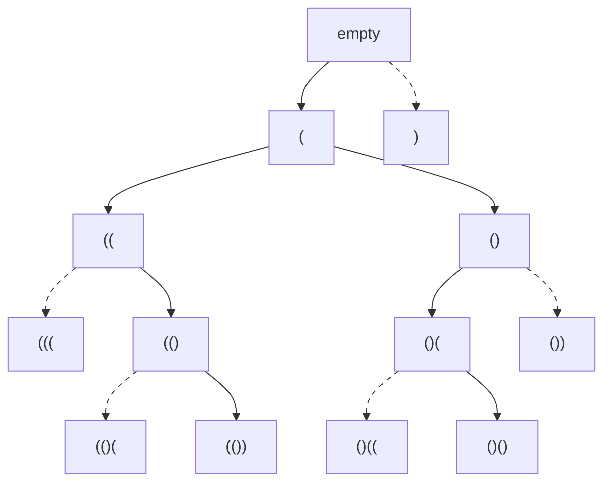

# Backtracking Basics

**Backtracking** is how you search for answers that have to be **built** rather
than found. Every problem so far handed you a structure and asked a question
about it, so the array, the tree, or the graph existed before your code ran. Here
the thing you are searching does not exist yet. You assemble a candidate answer
one decision at a time, and when a run of decisions leads somewhere hopeless you
take the last one back and try the next option instead

The set of all those decision sequences forms a **decision tree**. Its root is
the state where you have decided nothing, each edge is one choice, each node is
the **partial solution** built by the choices above it, and each leaf is either a
complete answer or a dead end. Building all the parenthesis strings of length 4
gives this tree, where a solid edge is a choice the search took and a dashed edge
is one it refused



The tree is never allocated. Unlike the `TreeNode` objects in
[trees](../../07_trees/notes/01_fundamentals.md), no node here is an object in
memory, because each one is just the value of your variables at some moment
during the recursion. Only the single path from the root down to wherever you
currently are exists at any instant, which is why a search over exponentially
many nodes still runs in memory proportional to the depth

The mental image is a crossword filled in with pencil rather than pen. You write
a word into the grid, check whether the crossings still spell anything, and if
they do not you rub that word out and try another. Rubbing out is the part that
has a name, and it is the part that beginners leave out

This topic covers where the technique comes from, the choose / explore /
un-choose cycle that every later note in the module reuses, what specifically
breaks when the un-choose is missing, **pruning** as the thing that makes an
exponential search finish, and the three shapes a backtracking problem asks for:
collect the complete answers, count them, or take the best one

## Why Building Every Candidate And Filtering At The End Dies

[Generate Parentheses](https://leetcode.com/problems/generate-parentheses/) asks
for every string of `n` opening and `n` closing brackets that is properly
balanced. For `n = 3` there are five, from `((()))` through `()()()`

The obvious first attempt separates the two halves of the problem. An answer is a
string of length `2n` over the alphabet `(` and `)`, so produce every such
string, then throw away the ones that are not balanced

```python
from itertools import product


def is_balanced(s: str) -> bool:
    depth = 0
    for ch in s:
        depth += 1 if ch == "(" else -1
        if depth < 0:
            return False
    return depth == 0


def generate_parentheses_filter(n: int) -> list[str]:
    return ["".join(p) for p in product("()", repeat=2 * n) if is_balanced("".join(p))]


assert generate_parentheses_filter(2) == ["(())", "()()"]
assert generate_parentheses_filter(1) == ["()"]
assert generate_parentheses_filter(0) == [""]
```

It is correct, and it works out badly as soon as `n` grows. The constraint on
this problem is `1 <= n <= 8`, and here is what the top of that range costs,
counted by running the code above

```text
n      strings built    balanced    built per answer
1                  4           1                 4.0
2                 16           2                 8.0
3                 64           5                12.8
8             65,536       1,430                45.8
```

The ratio is not the interesting part, since 65,536 is a number a computer eats
without noticing. What matters is **where** the waste is. Of those 65,536
strings, exactly 32,768 begin with `)`, and every single one of them is doomed by
its first character, because a string whose first bracket closes can never
balance. The filter cannot act on that. It has no way to say "the first character
is wrong", it can only say "this finished string of 16 characters is wrong", so
it builds all 32,768 of them in full and rejects them one at a time

That is the failure, and it names the fix exactly. The validity of a candidate is
visible long before the candidate is finished, so the test belongs on the
**partial** answer rather than the complete one. Kill `)` at the first character
and 32,768 candidates disappear in a single decision

## Testing The Prefix, Not The Answer

Build the string left to right, and at each position ask what may legally come
next given what is already written. Two rules cover it, and both are about the
prefix rather than the finished string

- An `(` is allowed while `opened < n`, because there are only `n` of them to
  spend
- A `)` is allowed while `closed < opened`, because a closing bracket needs an
  unmatched opening bracket to pair with, and `opened - closed` counts exactly
  those

Throwing away a branch because the partial answer already violates a constraint
is called **pruning**, and it is the reason backtracking is usable at all. A
pruned branch costs one comparison and removes every leaf beneath it

```python
def generate_parentheses_strings(n: int) -> list[str]:
    out: list[str] = []

    def build(prefix: str, opened: int, closed: int) -> None:
        if len(prefix) == 2 * n:
            out.append(prefix)
            return
        if opened < n:
            build(prefix + "(", opened + 1, closed)
        if closed < opened:
            build(prefix + ")", opened, closed + 1)

    build("", 0, 0)
    return out


assert generate_parentheses_strings(3) == [
    "((()))",
    "(()())",
    "(())()",
    "()(())",
    "()()()",
]
assert generate_parentheses_strings(1) == ["()"]
```

Two things about this version are worth saying out loud

**No candidate is ever rejected after the fact.** There is no `is_balanced` call
anywhere, because a string that reaches length `2n` passed every test on the way
down. When the search reaches a leaf, the answer is already known to be valid, so
the base case saves rather than checks

**Nothing is undone, because nothing is shared.** `prefix + "("` builds a brand
new string and hands it to the child, so the parent's own `prefix` is untouched
when that child returns. Strings in Python are immutable, so this is the one case
where the un-choose step is free

For `n = 8` this visits 6,917 nodes, against 131,071 nodes in the full tree of
every bracket string, both counted by instrumenting the two functions above. The
prune removed 95% of the search and did it with two integer comparisons

## Choose, Explore, Un-choose

The prefix version is clean and it has one real cost. `prefix + "("` copies the
whole prefix, so a node at depth `d` allocates a fresh string of `d` characters,
and that copying happens at every node in the tree. The fix is the same one the
[root-to-leaf walk](../../07_trees/notes/02_dfs.md) used on trees: keep **one**
list that every call shares, append to it before recursing, and remove the same
element after

```python
def generate_parentheses(n: int) -> list[str]:
    out: list[str] = []
    path: list[str] = []

    def backtrack(opened: int, closed: int) -> None:
        if len(path) == 2 * n:
            out.append("".join(path))
            return
        if opened < n:
            path.append("(")  # choose
            backtrack(opened + 1, closed)  # explore
            path.pop()  # un-choose
        if closed < opened:
            path.append(")")
            backtrack(opened, closed + 1)
            path.pop()

    backtrack(0, 0)
    return out


assert generate_parentheses(3) == [
    "((()))",
    "(()())",
    "(())()",
    "()(())",
    "()()()",
]
assert generate_parentheses(2) == ["(())", "()()"]
assert generate_parentheses(1) == ["()"]
```

Those three lines around each recursive call are the **choose / explore /
un-choose** cycle, and every note in this module is a variation on them. Written
as a skeleton with the problem-specific parts named

```text
def backtrack(state):
    if the partial answer is complete:
        record a copy of it
        return
    for each choice available here:
        if the choice violates a constraint:
            skip it                     <- pruning
        apply the choice to the state   <- choose
        backtrack(deeper state)         <- explore
        undo the choice                 <- un-choose
```

Four decisions turn that skeleton into a real solution, and naming them is how
you start the problem in an interview

1. **What is the state?** Here it is `path` plus the two counters, and the
   counters exist only so the constraint check is `O(1)` rather than a rescan
2. **What are the choices at a node?** Two, `(` and `)`. In other problems it is
   the letters of a digit, the unused numbers, or every cut point in a string
3. **When is a partial answer complete?** At `len(path) == 2 * n`. This is the
   base case, and it is a fact about the state rather than about the input index
4. **What prunes?** `opened < n` and `closed < opened`, both checked before the
   choice is applied rather than after

**`out.append("".join(path))` copies.** `path` is the single list the whole
recursion mutates, so appending it directly would store a reference that is empty
by the time the search finishes. The `join` copies here; the equivalent for a
list answer is `path[:]`, which you already met when
[collecting root-to-leaf paths](../../07_trees/notes/02_dfs.md)

> "I will build the string one bracket at a time and check the constraint before
> each bracket rather than after the whole string. An open bracket is legal while
> I have some left, and a close bracket is legal while there is something open to
> match. That way every string I complete is already valid, so there is no filter
> at the end"

## What A Missing Un-choose Actually Does

Delete the two `path.pop()` lines and the function still compiles, still
terminates, and still returns a list of correct-looking strings. It just returns
almost none of them

```python
def generate_parentheses_no_undo(n: int) -> list[str]:
    out: list[str] = []
    path: list[str] = []

    def backtrack(opened: int, closed: int) -> None:
        if len(path) == 2 * n:
            out.append("".join(path))
            return
        if opened < n:
            path.append("(")
            backtrack(opened + 1, closed)
        if closed < opened:
            path.append(")")
            backtrack(opened, closed + 1)

    backtrack(0, 0)
    return out


assert generate_parentheses_no_undo(2) == ["(())"]
assert generate_parentheses_no_undo(3) == ["((()))"]
```

One answer comes back instead of two, and for `n = 3` one instead of five. The
reason is that `opened` and `closed` are **parameters**, so they unwind for free
when a call returns, while `path` is a shared object that does not. After the
first leaf is saved, the counters have rewound to describe a node near the top of
the tree, and `path` still holds all `2n` characters from the branch that just
finished. The next branch therefore starts from a state that no node in the tree
actually has, and its first check, `len(path) == 2 * n`, is already true

That is the general shape of the bug. **The un-choose exists to keep the shared
state equal to the path from the root to the current node.** Anything the
recursion mutates and does not restore leaks one branch's decisions into its
sibling, and it leaks silently, because the output is still a list of plausible
strings

The undo has to be paired one-for-one with the choice, and it has to run on every
exit from the call, including the failing ones. An undo tucked inside an `if` or
placed after an early `return` is the same bug wearing a disguise

## Dry Run: Both Rejections On `n = 2`

Building all balanced strings of four brackets. Indentation is recursion depth,
and the lines that matter most are the two refusals

```text
take '('   path='('
  take '('   path='(('
    '(' refused: opened = 2 = n, no opens left
    take ')'   path='(()'
      '(' refused: opened = 2 = n
      take ')'   path='(())'
        length 4                       SAVE '(())'
      undo ')'   path='(()'
    undo ')'   path='(('
  undo '('   path='('
  take ')'   path='()'
    take '('   path='()('
      '(' refused: opened = 2 = n
      take ')'   path='()()'
        length 4                       SAVE '()()'
      undo ')'   path='()('
    undo '('   path='()'
    ')' refused: closed = 1 = opened, nothing open to match
  undo ')'   path='('
undo '('   path=''
')' refused: closed = 0 = opened, nothing open to match
```

The last line is the whole point of the derivation, sitting at the root. Refusing
`)` as the first character is one comparison, and in the filtering version that
same decision cost 32,768 fully built strings

The refusal at `path='()'` is the other rule doing its job. Two characters are
written, one bracket is open and one is closed, so nothing is available to close.
The branch is abandoned without recursing, which is what pruning looks like from
the inside

Notice that `path` returns to `''` at the very end. That is the invariant worth
stating in an interview, because it is what the `pop` lines buy: **every call
leaves the shared state exactly as it found it**, so after the top-level call
returns, `path` is empty again

## When The Choices Come From A Table Instead Of A Rule

In Generate Parentheses the choices were computed from the state. More often they
are simply listed for you, and then the loop over choices is a loop over that
list. [Letter Combinations of a Phone
Number](https://leetcode.com/problems/letter-combinations-of-a-phone-number/) is
the plainest example in the module, since a digit maps to three or four letters
and position `i` of the answer must be one of the letters of digit `i`

```python
DIGIT_LETTERS = {
    "2": "abc",
    "3": "def",
    "4": "ghi",
    "5": "jkl",
    "6": "mno",
    "7": "pqrs",
    "8": "tuv",
    "9": "wxyz",
}


def letter_combinations(digits: str) -> list[str]:
    if not digits:
        return []
    out: list[str] = []
    path: list[str] = []

    def backtrack(i: int) -> None:
        if i == len(digits):
            out.append("".join(path))
            return
        for letter in DIGIT_LETTERS[digits[i]]:
            path.append(letter)
            backtrack(i + 1)
            path.pop()

    backtrack(0)
    return out


assert letter_combinations("23") == ["ad", "ae", "af", "bd", "be", "bf", "cd", "ce", "cf"]
assert letter_combinations("9") == ["w", "x", "y", "z"]
assert letter_combinations("") == []
```

Nothing prunes, because every letter of every digit leads to a valid answer, so
the tree has no dead ends and every leaf is saved. The `if not digits` guard is
the edge case that gets missed: with no guard the base case fires immediately at
`i == 0` and returns `[""]`, one empty string, where the problem wants an empty
list

[Letter Case Permutation](https://leetcode.com/problems/letter-case-permutation/)
is the same walk with a twist worth seeing, because the number of choices depends
on the character. A letter branches two ways, into lower and upper case, while a
digit has exactly one option and is copied straight through

```python
def letter_case_permutation(s: str) -> list[str]:
    out: list[str] = []
    path: list[str] = []

    def backtrack(i: int) -> None:
        if i == len(s):
            out.append("".join(path))
            return
        if s[i].isdigit():
            path.append(s[i])
            backtrack(i + 1)
            path.pop()
            return
        for ch in (s[i].lower(), s[i].upper()):
            path.append(ch)
            backtrack(i + 1)
            path.pop()

    backtrack(0)
    return out


assert letter_case_permutation("a1b2") == ["a1b2", "a1B2", "A1b2", "A1B2"]
assert letter_case_permutation("3z4") == ["3z4", "3Z4"]
assert letter_case_permutation("12345") == ["12345"]
```

The digit branch still appends and still pops. It would be tempting to skip both
and recurse straight to `i + 1`, but then the digit never reaches the answer, so
the choose / un-choose pair stays even when there is only one choice to make

## Counting The Leaves Instead Of Listing Them

Some problems want how many complete answers exist rather than what they are.
[Beautiful Arrangement](https://leetcode.com/problems/beautiful-arrangement/)
asks for the number of ways to arrange `1..n` so that at every position
`1..n`, either the value divides the position or the position divides the value

The temptation is to generate all `n!` arrangements and count the valid ones,
which is the filtering mistake again in a new costume. Test the constraint at the
moment a number is placed instead, and the divisibility rule for position `p`
depends only on `p` and the value going there, so it is checkable immediately

```python
def count_arrangement(n: int) -> int:
    used = [False] * (n + 1)
    total = 0

    def backtrack(position: int) -> None:
        nonlocal total
        if position > n:
            total += 1
            return
        for value in range(1, n + 1):
            if used[value]:
                continue
            if value % position != 0 and position % value != 0:
                continue
            used[value] = True
            backtrack(position + 1)
            used[value] = False

    backtrack(1)
    return total


assert count_arrangement(2) == 2
assert count_arrangement(1) == 1
assert count_arrangement(3) == 3
assert count_arrangement(4) == 8
```

Three things change relative to the earlier code, and each is a shape you will
meet again

**There is no `path`.** Nothing about the arrangement is ever read back, only
counted, so the state is just "which values are spent". A boolean array answers
that, and its choose / un-choose pair is `used[value] = True` matched by
`used[value] = False`. Tracking used items is developed properly in
[permutations](03_permutations.md), which is the same idea with the arrangement
kept

**The base case increments instead of appending.** `total += 1` at
`position > n` counts one leaf, and since every leaf was validated on the way
down, no test is needed there

**Both `continue`s are prunes, and the second one carries the problem.** Dropping
the divisibility check leaves a correct program that enumerates every
arrangement. Instrumenting both versions gives this

```text
n     nodes with the divisibility prune    nodes without it     answers
4                                    32                   65           8
8                                 1,138              109,601         132
10                                8,964            9,864,101         700
```

At `n = 10` the prune is the difference between nine million nodes and nine
thousand. The constraint is checked before the recursive call rather than at the
leaf, so a bad value cuts away every arrangement that would have started with it

## Worked Example: [Split A String Into The Max Number Of Unique Substrings](https://leetcode.com/problems/split-a-string-into-the-max-number-of-unique-substrings/)

Cut a string into consecutive non-empty pieces so that no two pieces are equal,
and return the largest number of pieces any such cut achieves. Every character
must land in exactly one piece, and the pieces must stay in order, so the only
freedom is where the cuts go

**Input**: `s`, a `str` of lowercase English letters, short enough that an
exponential search over its cut points is expected

**Output**: an `int`, the maximum number of pieces over all splits whose pieces
are pairwise distinct. It is not the number of valid splits and not the pieces
themselves. A split into one piece, the whole string, is always valid, so the
answer is at least `1` for any non-empty input

**The approach.** "Cut the string into pieces, all distinct, maximize the count"
is a decision tree whose choice at each node is **how far the next piece
reaches**, which is a range of options rather than a fixed alphabet. The naive
version enumerates every one of the `2^(n-1)` ways to place cuts, collects each
resulting list of pieces, and checks distinctness at the end, which pays the full
cost even for splits whose first two pieces already collide. Instead, keep the
pieces used so far in a set, refuse a piece already in it at the moment it is
proposed, and take the running maximum at each leaf

> "The state is a start index and the set of pieces I have already used. At each
> node I try every end position after the start, skip the piece if the set
> already holds it, and recurse from the end of it. The un-choose is a `discard`
> from the set rather than a `pop`, because the set is what the recursion shares"

Therefore,

1. Track two things: `start`, the index the next piece begins at, and `seen`, the
   set of pieces used along the current path. `len(seen)` is the depth of the
   recursion and also the number of pieces cut so far, so no separate counter is
   needed
2. When `start == n` the whole string is consumed, which makes this a complete
   split, so compare `len(seen)` against the best seen so far and return
3. At each node, loop `end` from `start + 1` through `n`, so the piece
   `s[start:end]` runs from a single character up to the entire remaining
   suffix. The empty piece is excluded by starting at `start + 1`
4. If that piece is already in `seen`, skip it. This is the constraint, checked
   at the moment the piece is proposed rather than after the split is finished
5. Otherwise add the piece, recurse from `end`, and discard the piece on the way
   back. Adding and discarding is the choose / un-choose pair, and skipping the
   discard would make every later branch believe pieces are taken that are not
6. Prune with a bound on what the branch can still achieve. Even if every
   remaining character became a piece of its own, this branch tops out at
   `len(seen) + (n - start)` pieces, so when that cannot beat `best` the whole
   subtree is worthless and the call returns immediately
7. Return `best` after the top-level call. It was updated only at complete
   splits, so it never reflects a partial one

```python
def max_unique_split(s: str) -> int:
    n = len(s)
    seen: set[str] = set()
    best = 0

    def backtrack(start: int) -> None:
        nonlocal best
        if start == n:
            best = max(best, len(seen))
            return
        if len(seen) + (n - start) <= best:
            return
        for end in range(start + 1, n + 1):
            piece = s[start:end]
            if piece in seen:
                continue
            seen.add(piece)
            backtrack(end)
            seen.discard(piece)

    backtrack(0)
    return best


assert max_unique_split("ababccc") == 5
assert max_unique_split("aba") == 2
assert max_unique_split("aa") == 1
assert max_unique_split("a") == 1
assert max_unique_split("") == 0
```

Tracing `"aba"` shows both rejections firing, with indentation as depth

```text
take 'a'    seen={a}
  take 'b'    seen={a,b}
    SKIP 'a', already in seen
  take 'ba'   seen={a,ba}
    end of string, 2 pieces         BEST -> 2
take 'ab'   seen={ab}
  PRUNE at start=2: 1 + 1 <= best 2
take 'aba'  seen={aba}
  end of string, 1 piece            no better than 2
```

The `SKIP` is the distinctness constraint. After `a` and `b`, the only remaining
character is `a`, which is already a piece, so that branch has no legal move and
dies without recursing. The `PRUNE` is the bound: one piece is cut, one character
is left, so this branch cannot exceed two pieces and two is already matched, and
the whole subtree is skipped without slicing a single substring. Both rejections
happen before any recursive call, which is what keeps them cheap

- **Time Complexity:** `O(n · 2^n)` where `n = len(s)`, because each of the
  `n - 1` gaps between characters is independently a cut or not, giving `2^(n-1)`
  root-to-leaf paths, and the pieces along any one path total `n` characters to
  slice and hash. The two rejections only ever remove work, so they cannot raise
  this
- **Space Complexity:** `O(n)` auxiliary, because the pieces in `seen` are
  disjoint slices of one prefix of `s` and so hold at most `n` characters between
  them, and the recursion is at most `n` frames deep since every call consumes at
  least one character

## Time and Space Complexity

Backtracking costs are dominated by the number of nodes in the pruned tree, which
is bounded by the branching factor `b` raised to the depth `d`. Auxiliary space
is the shared state plus the recursion stack, both bounded by `d`, and it
excludes the returned answers

**Generate Parentheses**, where `n` is the number of bracket pairs and `C_n` is
the `n`th Catalan number, the count of balanced strings

| Approach                                | Time                                                                                                                                                                                                           | Space                                                                                                                                                                |
| --------------------------------------- | -------------------------------------------------------------------------------------------------------------------------------------------------------------------------------------------------------------- | -------------------------------------------------------------------------------------------------------------------------------------------------------------------- |
| Prefix pruning on `opened` and `closed` | `O(n · C_n)`, about `4^n / sqrt(n)`: every node lies on a path to at least one valid string, so the node count is within a constant factor of the `C_n` answers, each joined in `O(n)`                         | `O(n)` auxiliary: `path` holds `2n` characters and the recursion is `2n` frames deep, one per character placed                                                       |
| Build all `2^(2n)` strings, then filter | `O(n · 4^n)`: every string of length `2n` over a two-letter alphabet is materialised and scanned once. At `n = 8` that is 65,536 strings for 1,430 answers, and 32,768 of them are dead at the first character | `O(n)` auxiliary if the strings are consumed lazily, since only one candidate exists at a time, but nothing about the wasted work is fixable by spending more memory |

**The rest of the family**, where `k` is the number of digits, `L` is the number
of letters in the input, and `n` is the input size

| Problem                                   | Time                                                                                                                                                                                                                      | Space                                                                                                         |
| ----------------------------------------- | ------------------------------------------------------------------------------------------------------------------------------------------------------------------------------------------------------------------------- | ------------------------------------------------------------------------------------------------------------- |
| Letter Combinations of a Phone Number     | `O(k · 4^k)`: a digit offers three or four letters, so the tree has at most `4^k` leaves and each is joined into a string of length `k`. Nothing prunes, because every leaf is an answer                                  | `O(k)` auxiliary: one character is appended per level and the recursion is `k` deep                           |
| Letter Case Permutation                   | `O(n · 2^L)`: only the `L` letters branch, each two ways, while digits pass through with a single child, and each of the `2^L` leaves costs `O(n)` to join                                                                | `O(n)` auxiliary: `path` reaches the full length of the input, which is also the recursion depth              |
| Beautiful Arrangement                     | `O(n!)` worst case: `n` values are placed into `n` positions and the divisibility prune has no proven bound, so the honest ceiling is the unpruned tree. Measured, the prune takes `n = 10` from 9,864,101 nodes to 8,964 | `O(n)` auxiliary: the `used` array is `n + 1` booleans and the recursion is one frame per position            |
| Split A String Into Max Unique Substrings | `O(n · 2^n)`: each of the `n - 1` gaps is a cut or not, and the pieces on one path total `n` characters to slice and hash                                                                                                 | `O(n)` auxiliary: the pieces in `seen` are disjoint slices of one prefix, so they hold `n` characters at most |

The number to volunteer is the auxiliary space, because it is `O(depth)` in every
row above while the time is exponential in every row. That gap is the whole
reason the technique is viable: the tree is enormous, and you only ever hold one
root-to-node path of it

## Summary

- **Backtracking** searches for answers that have to be built rather than found.
  You extend a **partial solution** one choice at a time, and when a branch is
  exhausted or illegal you undo the last choice and try the next one
  - The search space is a **decision tree** whose root is "nothing decided", whose
    edges are choices, and whose leaves are complete answers or dead ends. It is
    never allocated, since a node is only the value of your variables at some
    moment of the recursion
- The signal in a problem statement is a request for **all** of something, or the
  **number** of them, or the **best** one, where each answer is a sequence of
  independent decisions: all subsets, every valid string, how many arrangements,
  the longest split. A single-pass or greedy method usually will not do, because
  the choices interact
- The naive approach worth naming out loud is generating every candidate and
  filtering the valid ones at the end. It dies because validity is visible at a
  prefix, and the filter can only see finished candidates
  - On Generate Parentheses with `n = 8` it builds 65,536 strings for 1,430
    answers, and half of those are already dead at their first character
- **Choose, explore, un-choose** is the cycle, written as `apply the choice`, then
  the recursive call, then `undo the choice`. It is `append` / `pop` on a list,
  `True` / `False` on a `used` array, `add` / `discard` on a set, and it is always
  a matched pair
  - The undo keeps the shared state equal to the path from the root to the current
    node, so it must run on every exit from the call, not just the successful ones
  - Leaving it out does not crash. The counters passed as parameters still unwind
    while the shared list does not, so the two disagree and the search returns a
    small number of correct-looking answers instead of all of them
- **Pruning** is testing the constraint on the partial answer before recursing,
  and it is what makes an exponential search finish. One comparison deletes every
  leaf below the branch
  - Check before the recursive call, never at the leaf, since checking at the leaf
    is the filtering mistake with extra steps
  - A bound on what a branch could still achieve prunes as well as a hard
    constraint does, which is what `len(seen) + (n - start) <= best` does in the
    split problem
- Four questions turn the skeleton into a solution, and answering them out loud is
  how you open the problem: what is the state, what are the choices at a node,
  when is a partial answer complete, and what prunes
- The base case takes one of three shapes, and the problem statement tells you
  which. Append a **copy** of the path for "return them all", `total += 1` for
  "how many", and `best = max(best, ...)` for "the largest"
  - Copy at save time with `path[:]` or `"".join(path)`. Saving the live list
    stores a reference to the one object the recursion keeps mutating
- Costs are exponential in time and linear in space. Time is roughly the node
  count, `O(b^d)` for branching factor `b` and depth `d`, while auxiliary space is
  `O(d)`, because only one root-to-node path is ever held

## Interview Checklist

Before writing code, make sure you can answer each of these

```text
Is the answer built from a sequence of choices? If so this is backtracking, not a single pass.
What exactly is the state: a path, a set, a board, a pair of counters?
What is the list of choices at one node, and is it fixed or does it depend on the state?
What makes a partial answer complete, and is that a fact about the state or about an index?
Does the base case collect a copy, increment a count, or take a maximum?
Which constraint can I test on the partial answer, before recursing rather than at the leaf?
Is every mutation of shared state paired with an undo that runs on every exit from the call?
Am I copying the path at save time instead of storing the live object?
Is there a bound on what a branch can still achieve that lets me abandon it early?
What are the branching factor and the depth, so I can state the node count and the O(depth) space?
```
