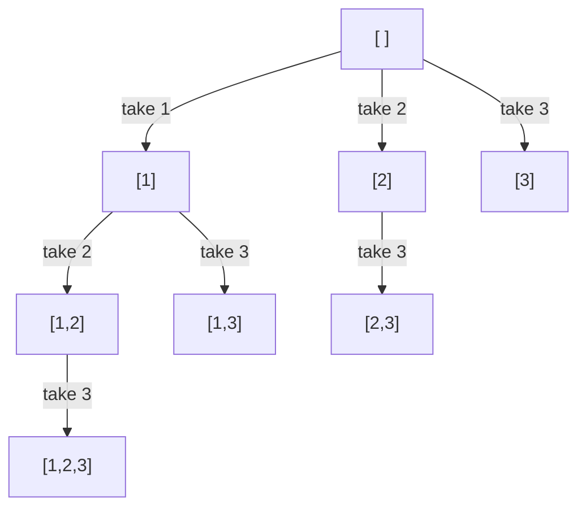

# Subsets And Combinations

A **subset** of a collection is any selection of its elements where each element
is taken at most once and the order you list them in does not matter. `[1, 3]`
and `[3, 1]` are the same subset of `[1, 2, 3]`, and both the empty selection
`[]` and the whole thing `[1, 2, 3]` count. A subset is not a
[slice](../../00_fundamentals/notes/02_python_basics.md), because a slice has to
be contiguous and a subset can skip freely

The collection of every subset is called the **power set**. Its size follows from
one observation: each element faces an independent yes-or-no decision, so `n`
elements give `2 × 2 × ... × 2 = 2^n` subsets. For `[1, 2, 3]` that is 8, and you
can list them by counting in binary, where bit `i` says whether element `i` is in

A **combination** is a subset of a fixed size `k`. "Choose 2 of 4" means the
subsets of size exactly 2, of which there are `C(4, 2) = 6`. The words in
interviews are loose, so treat "subset", "combination", "choose k", and "pick a
group" as the same family: **order does not matter, so each group must be
produced exactly once**. When order *does* matter you are in permutation
territory, which the [next topic](03_permutations.md) covers

That single requirement — each group exactly once — is what this whole topic is
about, and it turns out to cost one integer parameter

## Why Letting Every Position Pick Any Element Dies

The [choose / explore / un-choose skeleton](01_backtracking_basics.md) says: at
each node, loop over the available choices, take one, recurse, put it back. Apply
that literally and "available" means every element not already in the path

```python
def subsets_unrestricted(nums: list[int]) -> list[list[int]]:
    result: list[list[int]] = []
    path: list[int] = []
    used = [False] * len(nums)

    def backtrack() -> None:
        result.append(path[:])
        for i in range(len(nums)):
            if used[i]:
                continue
            used[i] = True
            path.append(nums[i])
            backtrack()
            path.pop()
            used[i] = False

    backtrack()
    return result


assert subsets_unrestricted([1, 2]) == [[], [1], [1, 2], [2], [2, 1]]
assert subsets_unrestricted([]) == [[]]
```

Look at the assert. `[1, 2]` and `[2, 1]` are both there, and they are the same
subset written twice. The search has no idea they are the same, because nothing
in the code says that order is irrelevant

You could fix that after the fact by pushing `tuple(sorted(path))` into a set and
rebuilding the answer at the end. It is correct, and the cost is brutal. The
number of nodes this search visits is the number of ordered sequences of distinct
elements of every length, which is `sum over k of n! / (n - k)!`:

```text
n = 10    nodes visited      9,864,101
          distinct subsets       1,024
```

So roughly 9,600 paths are walked for every answer that survives, and the ratio
gets worse with every extra element, because `n!` outgrows `2^n` without bound.
Worse, the dedup set has to hold all `2^n` sorted tuples at once, so you pay the
full output in extra memory as well

The fix is not to detect duplicates. It is to **never generate them**, by fixing
one canonical order in which a subset is allowed to be built

## Include Or Exclude, One Element At A Time

Go back to the `2^n` counting argument, since it already contains an algorithm.
Each element gets one independent yes-or-no decision, so walk the elements left
to right and branch twice at each one: take it, or skip it

```python
def subsets_include_exclude(nums: list[int]) -> list[list[int]]:
    result: list[list[int]] = []
    path: list[int] = []

    def decide(i: int) -> None:
        if i == len(nums):
            result.append(path[:])
            return
        path.append(nums[i])
        decide(i + 1)
        path.pop()
        decide(i + 1)

    decide(0)
    return result


assert subsets_include_exclude([1, 2, 3]) == [
    [1, 2, 3],
    [1, 2],
    [1, 3],
    [1],
    [2, 3],
    [2],
    [3],
    [],
]
assert subsets_include_exclude([7]) == [[7], []]
assert subsets_include_exclude([]) == [[]]
```

No duplicates appear, and the reason is exact: element `i` is decided once and
only at depth `i`, so two different runs down the tree must disagree on some
element's yes-or-no answer, which makes the resulting subsets different. Every
leaf is a distinct subset and there are `2^n` leaves, so the tree produces the
power set and nothing else

This shape is worth knowing, and it is also rigid. The answer only exists at the
leaves, so a problem that saves at every node needs restructuring. There is no
place to say "stop once the path has `k` elements", because depth is glued to
position rather than to how many things you have picked. And when the input has
repeated values, the skip branch and the take branch of two equal elements
interleave in a way that is fiddly to dedup

## The Start Index Is The Same Tree, Reshaped

Rewrite the rule as a loop instead of a pair of branches. Instead of asking each
element yes or no, ask each node "which element do I take next?" and answer it
with **any index after the last one I took**. That last-index-plus-one is the
**start index**, and it is the whole technique

```python
def subsets(nums: list[int]) -> list[list[int]]:
    result: list[list[int]] = []
    path: list[int] = []

    def backtrack(start: int) -> None:
        result.append(path[:])
        for i in range(start, len(nums)):
            path.append(nums[i])
            backtrack(i + 1)
            path.pop()

    backtrack(0)
    return result


assert subsets([1, 2, 3]) == [[], [1], [1, 2], [1, 2, 3], [1, 3], [2], [2, 3], [3]]
assert subsets([0]) == [[], [0]]
assert subsets([]) == [[]]
```

> "Every subset has exactly one arrangement in increasing index order. If I only
> ever extend a path with an index greater than the last one I took, I build each
> subset exactly once, so I never need a dedup pass at the end."

Now the whole power set lives in the tree, one subset per node rather than one
per leaf:



Eight nodes for three elements, matching `2^3`, and every node is a different
subset

**The four lines that decide whether this is right**:

- `result.append(path[:])` sits at the top of the function with no condition,
  because for [Subsets](https://leetcode.com/problems/subsets/) every node is an
  answer. Problems that want only some nodes put a test around this line, and
  that test is the only thing that changes between the problems in this family
- The `[:]` is not decoration. `path` is one list that is mutated the whole way
  down, so appending `path` itself stores a reference that will be empty by the
  time the function returns. `list(path)` and `path.copy()` are the same fix
- `range(start, len(nums))` is what refuses to look backwards, and it is the
  reason `[2, 1]` never appears. Once the path holds index 1, index 0 is not
  offered again at any depth below
- `backtrack(i + 1)` passes `i + 1`, not `start + 1` and not `i`. The next level
  must begin after the element just taken, and `start` is where *this* level
  began, which is generally earlier

There is no explicit base case, because the loop is its own base case. When
`start == len(nums)` the range is empty, the loop body never runs, and the call
returns after saving. That is a normal shape for a start-index search and worth
saying out loud, since an interviewer scanning for a missing base case will ask

## Dry Run: Every Subset Of [1, 2, 3]

Indentation is recursion depth, `SAVE` is a subset landing in the result, and
`undo` is the `path.pop()` on the way back up

```text
enter start=0 path=[]        SAVE []
  take nums[0]=1
  enter start=1 path=[1]     SAVE [1]
    take nums[1]=2
    enter start=2 path=[1,2] SAVE [1,2]
      take nums[2]=3
      enter start=3          SAVE [1,2,3]      loop range is empty, return
      undo 3 -> path=[1,2]
    undo 2 -> path=[1]
    take nums[2]=3
    enter start=3 path=[1,3] SAVE [1,3]
    undo 3 -> path=[1]
  undo 1 -> path=[]
  take nums[1]=2
  enter start=2 path=[2]     SAVE [2]
    REFUSED: index 0 (value 1) is below start=2, so [2,1] is never built
    take nums[2]=3
    enter start=3 path=[2,3] SAVE [2,3]
    undo 3 -> path=[2]
  undo 2 -> path=[]
  take nums[2]=3
  enter start=3 path=[3]     SAVE [3]
  undo 3 -> path=[]
```

The `REFUSED` line is the entire mechanism. At the node holding `[2]`, the
unrestricted version from earlier would have offered index 0 and produced
`[2, 1]`; here `range(2, 3)` skips straight past it. That single refusal is what
collapses `9,864,101` nodes down to `1,024` at `n = 10`

The `[1, 2, 3]` node also shows the base case doing nothing visible. It saves,
finds `range(3, 3)` empty, and returns immediately

## Saving Only When The Path Reaches Size k

[Combinations](https://leetcode.com/problems/combinations/) asks for every subset
of size exactly `k` drawn from `1..n`. The tree is unchanged and only the save
condition moves: instead of saving unconditionally, save when `len(path) == k`
and then return, since anything longer is too big

```python
def combine(n: int, k: int) -> list[list[int]]:
    result: list[list[int]] = []
    path: list[int] = []

    def backtrack(start: int) -> None:
        if len(path) == k:
            result.append(path[:])
            return
        for i in range(start, n - (k - len(path)) + 2):
            path.append(i)
            backtrack(i + 1)
            path.pop()

    backtrack(1)
    return result


assert combine(4, 2) == [[1, 2], [1, 3], [1, 4], [2, 3], [2, 4], [3, 4]]
assert combine(4, 4) == [[1, 2, 3, 4]]
assert combine(1, 1) == [[1]]
```

The loop starts at `1` rather than `0` because the candidates *are* the numbers
`1..n`, so the value and the index are the same thing and no `nums` array is
needed

The upper bound is the pruning, and it is the part worth deriving out loud. The
path still needs `k - len(path)` more numbers. Taking `i` leaves the numbers
`i + 1 .. n` available, which is `n - i` of them, and you need `k - len(path) - 1`
of those, so `i` is only worth trying while `n - i >= k - len(path) - 1`.
Rearranged, `i <= n - k + len(path) + 1`, and since Python's `range` excludes its
end, the bound is `n - (k - len(path)) + 2`

Without that bound the search still walks every prefix that can never be
completed, and it only discovers the dead end after descending to the bottom of
it. The difference is not cosmetic:

```text
combine(20, 18)   with the bound        1,330 nodes
                  without the bound 1,048,555 nodes
```

The two numbers come from counting recursive calls with the bound set to
`n - (k - len(path)) + 2` and to `n + 1`. With the bound, every node reaches at
least one complete combination, so no work is wasted at all

## Letting A Value Repeat: Pass i, Not i + 1

[Combination Sum](https://leetcode.com/problems/combination-sum/) allows the same
candidate to be picked as many times as you like, and asks for the groups summing
to a target. Unlimited reuse sounds like a different algorithm and it is one
character: recurse on `i` rather than `i + 1`, so the current element stays
available while everything before it stays banned

```python
def combination_sum(candidates: list[int], target: int) -> list[list[int]]:
    candidates = sorted(candidates)
    result: list[list[int]] = []
    path: list[int] = []

    def backtrack(start: int, remaining: int) -> None:
        if remaining == 0:
            result.append(path[:])
            return
        for i in range(start, len(candidates)):
            if candidates[i] > remaining:
                break
            path.append(candidates[i])
            backtrack(i, remaining - candidates[i])
            path.pop()

    backtrack(0, target)
    return result


assert combination_sum([2, 3, 6, 7], 7) == [[2, 2, 3], [7]]
assert combination_sum([2, 3, 5], 8) == [[2, 2, 2, 2], [2, 3, 3], [3, 5]]
assert combination_sum([2], 1) == []
```

Passing `i` keeps `[2, 2, 3]` reachable while still refusing `[3, 2, 2]`, because
the ban is on going backwards, not on repeating. Passing `start` instead would be
wrong in a subtler way, since it would let the path revisit an element it had
already moved past and rebuild groups in several orders

**Carrying `remaining` instead of the running sum** is a small choice that pays
twice. The base case becomes `remaining == 0` rather than a comparison against a
captured target, and the prune becomes a direct comparison of a candidate against
what is left. Because the list was sorted first, `candidates[i] > remaining`
means every later candidate is also too big, so `break` is correct and cuts the
rest of the loop instead of `continue` testing each one

The same skeleton counts instead of collecting when a problem only wants a
number. [Count Sorted Vowel Strings](https://leetcode.com/problems/count-sorted-vowel-strings/)
asks how many strings of length `n` use only `a, e, i, o, u` in non-decreasing
order. Non-decreasing is exactly the start-index rule over the five vowels, with
repeats allowed, so it is `combination_sum`'s shape with the result list deleted:

```python
def count_vowel_strings(n: int) -> int:
    def backtrack(start: int, remaining: int) -> int:
        if remaining == 0:
            return 1
        return sum(backtrack(i, remaining - 1) for i in range(start, 5))

    return backtrack(0, n)


assert count_vowel_strings(1) == 5
assert count_vowel_strings(2) == 15
assert count_vowel_strings(33) == 66045
```

Returning `1` at the base case and summing the children counts the leaves of the
tree without ever materializing a path, which drops the `O(n)` copy per answer
and the whole result list

## When Both The Size And The Sum Are Bounded

[Combination Sum III](https://leetcode.com/problems/combination-sum-iii/) wants
`k` distinct digits from `1..9` summing to `n`. Both bounds from the previous two
sections apply at once, and neither one alone is enough, so the code carries both

```python
def combination_sum3(k: int, n: int) -> list[list[int]]:
    result: list[list[int]] = []
    path: list[int] = []

    def backtrack(start: int, remaining: int) -> None:
        if len(path) == k:
            if remaining == 0:
                result.append(path[:])
            return
        for i in range(start, 10):
            if i > remaining:
                break
            path.append(i)
            backtrack(i + 1, remaining - i)
            path.pop()

    backtrack(1, n)
    return result


assert combination_sum3(3, 7) == [[1, 2, 4]]
assert combination_sum3(3, 9) == [[1, 2, 6], [1, 3, 5], [2, 3, 4]]
assert combination_sum3(9, 45) == [[1, 2, 3, 4, 5, 6, 7, 8, 9]]
assert combination_sum3(4, 1) == []
```

The size test comes first and the sum test sits inside it, because reaching `k`
digits ends the path whether or not the sum worked out. Writing the two tests as
sibling `if` statements is the common bug, since a path of the right length and
the wrong sum would then keep recursing past `k` digits. `i + 1` is back, because
digits may not repeat here

## Duplicate Values And The i > start Guard

The start index guarantees each *set of positions* is used once. It says nothing
about equal *values* sitting at different positions.
[Subsets II](https://leetcode.com/problems/subsets-ii/) has exactly that problem:
on `[1, 2, 2]`, positions 1 and 2 hold the same value, so `subsets` produces
`[1, 2]` twice, once through each of them

Sort the input first so equal values become adjacent, then at each node take only
the **first** copy of a value and skip the rest:

```python
def subsets_with_dup(nums: list[int]) -> list[list[int]]:
    nums = sorted(nums)
    result: list[list[int]] = []
    path: list[int] = []

    def backtrack(start: int) -> None:
        result.append(path[:])
        for i in range(start, len(nums)):
            if i > start and nums[i] == nums[i - 1]:
                continue
            path.append(nums[i])
            backtrack(i + 1)
            path.pop()

    backtrack(0)
    return result


assert subsets_with_dup([1, 2, 2]) == [[], [1], [1, 2], [1, 2, 2], [2], [2, 2]]
assert subsets_with_dup([2, 2, 2]) == [[], [2], [2, 2], [2, 2, 2]]
assert subsets_with_dup([0]) == [[], [0]]
```

> "The array is sorted, so equal values are adjacent. At one node, the first copy
> of a value already explores every subset that continues with that value, so
> starting a second branch from a later copy at the same node would rebuild the
> same lists. Deeper down is different, and that is what the `i > start` half of
> the guard protects."

**Why the guard is `i > start` and not `i > 0`** is the single highest-value line
in this topic, because `i > 0` looks equally reasonable and silently loses
answers. `i == start` is the first choice this node offers, so it is the first
copy and must be taken. Any `i > start` is a second or later copy *at the same
node*, and that is the duplicate branch. When the recursion goes deeper it calls
`backtrack(i + 1)`, so the next level has `start == i + 1`, and picking a second
`2` there satisfies `i == start` and is allowed — which is how `[2, 2]` survives

Swap in `i > 0` and the two cases collapse into one, killing every subset that
legitimately contains a repeated value:

```text
subsets_with_dup([1, 2, 2])   correct  [[], [1], [1,2], [1,2,2], [2], [2,2]]
same code with i > 0          wrong    [[], [1], [1,2], [2]]
```

Sorting is load-bearing rather than tidy. On unsorted `[2, 1, 2]` the equal values
are not adjacent, `nums[i] == nums[i - 1]` never fires, and the duplicates come
straight back

## Worked Example: [Combination Sum II](https://leetcode.com/problems/combination-sum-ii/)

Given a list of candidate numbers and a target, find every group of candidates
that sums to the target, where each candidate may be used **at most once** and no
two groups in the answer may be the same multiset of numbers. The input can
contain the same value more than once, and each of those copies is a separate
usable item

**Input**:

- `candidates`, a `list[int]` of positive integers, which may contain repeats and
  arrives in no particular order
- `target`, an `int`, the sum each returned group must hit exactly

**Output**: a `list[list[int]]`, where each inner list is one group of candidates
summing to `target`. Each element of `candidates` may appear in a group at most as
many times as it appears in the input, and no two groups may contain the same
values with the same multiplicities, so `[1, 1, 6]` and `[1, 6, 1]` may not both
be returned. The order of the groups and the order within a group are not checked,
so returning them in sorted order is the easy way to be obviously correct. When
nothing sums to `target`, return `[]`

**The approach.** "Each number may be used once" plus "no duplicate combinations"
is the start-index family with the duplicate guard, so this problem is
`subsets_with_dup` and `combination_sum` welded together. The naive version
enumerates all `2^n` subsets, sums each one, and dedups the survivors through a
set of sorted tuples, which pays the full `2^n` even when the target is tiny and
still needs the dedup structure. Instead, carry `remaining` down the recursion so
a branch dies the moment it overshoots, and refuse the duplicate branch at the
node instead of at the end

> "I will sort the candidates first. That does two jobs at once: equal values
> become adjacent so I can skip a repeated value at the same depth, and the
> candidates become increasing so once one exceeds what is remaining I can break
> out of the loop instead of testing the rest."

Therefore,

1. Sort `candidates`. Sorting is what makes both the duplicate skip and the
   `break` prune valid, since one needs equal values adjacent and the other needs
   the values increasing
2. Recurse with two pieces of state, `start` for the first index this node may
   choose and `remaining` for how much of the target is left. Keep the chosen
   values in a single `path` list that is mutated on the way down and restored on
   the way back up
3. When `remaining` hits `0`, the path sums to the target, so append a copy of it
   and return. Returning matters here because every candidate is positive, so
   extending a finished path can only overshoot
4. At each node, loop `i` from `start` to the end. If `candidates[i] > remaining`,
   `break` rather than `continue`, because the sorted order means every later
   candidate is at least as large and therefore also hopeless
5. If `i > start` and `candidates[i] == candidates[i - 1]`, skip this `i`. It is a
   second copy of a value already tried at this node, and the first copy's branch
   covered every group that continues with that value
6. Otherwise take `candidates[i]`, recurse with `start = i + 1` and
   `remaining - candidates[i]`, then pop. Passing `i + 1` rather than `i` is what
   enforces "each candidate used at most once", and it is the only difference from
   Combination Sum
7. Return `result` after the top-level call. No group is ever produced twice, so
   no dedup pass is needed

```python
def combination_sum2(candidates: list[int], target: int) -> list[list[int]]:
    candidates = sorted(candidates)
    result: list[list[int]] = []
    path: list[int] = []

    def backtrack(start: int, remaining: int) -> None:
        if remaining == 0:
            result.append(path[:])
            return
        for i in range(start, len(candidates)):
            if candidates[i] > remaining:
                break
            if i > start and candidates[i] == candidates[i - 1]:
                continue
            path.append(candidates[i])
            backtrack(i + 1, remaining - candidates[i])
            path.pop()

    backtrack(0, target)
    return result


assert combination_sum2([10, 1, 2, 7, 6, 1, 5], 8) == [[1, 1, 6], [1, 2, 5], [1, 7], [2, 6]]
assert combination_sum2([2, 5, 2, 1, 2], 5) == [[1, 2, 2], [5]]
assert combination_sum2([1, 1, 2, 6], 8) == [[1, 1, 6], [2, 6]]
assert combination_sum2([2], 1) == []
```

Tracing the third assert shows both rejections firing:

```text
sorted = [1, 1, 2, 6], target = 8
i=0 take 1  path=[1]  remaining=7
  i=1 take 1  path=[1,1]  remaining=6
    i=2 take 2  path=[1,1,2]  remaining=4
      i=3 val=6 > remaining 4        BREAK
    i=3 take 6  path=[1,1,6]  remaining=0
      remaining=0                    SAVE [1,1,6]
  i=2 take 2  path=[1,2]  remaining=5
    i=3 val=6 > remaining 5          BREAK
  i=3 take 6  path=[1,6]  remaining=1   dead end, loop below is empty
i=1 val=1 same as i-1 and i>start=0  SKIP
i=2 take 2  path=[2]  remaining=6
  i=3 take 6  path=[2,6]  remaining=0
    remaining=0                      SAVE [2,6]
i=3 take 6  path=[6]  remaining=2     dead end
```

The `SKIP` at the top level is the duplicate guard: the second `1` at index 1 is
refused *as a starting choice*, because index 0's branch already explored
everything beginning with `1`. Note that the same value was accepted one line
above, at `i=1` under `start=1`, which is how `[1, 1, 6]` still gets built

Both `BREAK` lines quit their loop early rather than testing index 3 and moving
on, and each one skipped only one candidate here because the input is tiny. On a
long sorted candidate list the break discards the entire tail

- **Time Complexity:** `O(n log n + n · 2^n)` where `n = len(candidates)`, because
  the sort is `O(n log n)` and, in the worst case where nothing overshoots the
  target, each candidate is independently in or out of a path, giving `2^n` paths
  whose leaves each cost `O(n)` to copy. The duplicate skip and the `break` only
  ever cut work, so they cannot make it worse
- **Space Complexity:** `O(n)` auxiliary, because `path` holds at most `n` values
  and the recursion is at most `n` frames deep, one per candidate taken. The
  returned lists are `O(n · 2^n)` in the worst case, but that is output rather
  than working memory, and interviewers accept the distinction when you name it

## Time and Space Complexity

Symbols: `n` is the number of candidates (or the range size for `combine` and
`combination_sum3`), `k` is the required group size, `T` is the target sum, and
`m` is the smallest candidate value. Auxiliary space excludes the returned lists
and counts `path` plus the recursion stack

**Enumerating the power set of `n` values**

| Approach                                     | Time                                                                                                                                                                            | Space                                                                                                                                  |
| -------------------------------------------- | ------------------------------------------------------------------------------------------------------------------------------------------------------------------------------- | -------------------------------------------------------------------------------------------------------------------------------------- |
| Start index, one increasing order per subset | `O(n · 2^n)`: there are `2^n` nodes and every one of them copies a path of up to `n` values into the result                                                                     | `O(n)` auxiliary: one shared `path` of at most `n` values and a stack at most `n` frames deep, since each frame takes one more element |
| Any unused element at each node, then dedup  | `O(n · n!)`: it visits `sum over k of n! / (n - k)!` nodes, which is about `e · n!`, and copies up to `n` values at each. At `n = 10` that is 9,864,101 nodes for 1,024 answers | `O(n · 2^n)`: the dedup set has to hold every distinct sorted tuple at once, so the fix costs as much memory as the output             |

**The problems in this family**

| Problem                    | Time                                                                                                                                                                                         | Space                                                                                                        |
| -------------------------- | -------------------------------------------------------------------------------------------------------------------------------------------------------------------------------------------- | ------------------------------------------------------------------------------------------------------------ |
| Subsets                    | `O(n · 2^n)`: one node per subset and an `O(n)` copy at each                                                                                                                                 | `O(n)` auxiliary: the stack cannot exceed one frame per element                                              |
| Subsets II                 | `O(n log n + n · 2^n)`: the sort plus the same walk, where the `2^n` is only reached when every value is distinct, since each duplicate value collapses branches                             | `O(n)` auxiliary: sorting in place adds nothing asymptotically and the stack is unchanged                    |
| Combinations               | `O(k · C(n, k))`: the size bound means every node leads to at least one complete group, so the node count is within a factor of `k` of the `C(n, k)` answers, each copied in `O(k)`          | `O(k)` auxiliary: the path stops growing at `k`, so the recursion is at most `k + 1` frames deep             |
| Combination Sum            | `O(n^(T/m + 1))`: reuse makes the tree as deep as `T/m`, since the cheapest way to fill the target is repeating the smallest candidate `m`, and each of those levels branches up to `n` ways | `O(T/m)` auxiliary: the longest path is all copies of the smallest candidate                                 |
| Combination Sum II         | `O(n log n + n · 2^n)`: each candidate is in or out along a path, so `2^n` paths worst case with an `O(n)` copy, after an `O(n log n)` sort                                                  | `O(n)` auxiliary: at most one frame per candidate taken                                                      |
| Combination Sum III        | `O(k · C(9, k))`: the candidate pool is fixed at the nine digits, so the whole search is bounded by 126 groups at `k = 4` and never grows with the input                                     | `O(k)` auxiliary: the path is capped at `k` digits                                                           |
| Count Sorted Vowel Strings | `O(C(n + 5, 5))`, about `n^5 / 120`: the nodes at depth `d` are the non-decreasing length-`d` vowel strings, `C(d + 4, 4)` of them, and those sum to `C(n + 5, 5)` over all depths           | `O(n)` auxiliary: nothing is stored but the recursion, which is `n` frames deep, and no path is built at all |

The `Count Sorted Vowel Strings` row is the one that invites a follow-up. Since
the answer only depends on `(start, remaining)` and there are `5n` such pairs,
memoizing collapses it to `O(n)`, and the closed form `C(n + 4, 4)` answers it in
constant time. Say that out loud even if you code the search, because it shows you
know the search is the expensive way

## Summary

- A **subset** is a selection where each element is used at most once and order
  does not matter, and a **combination** is a subset of a fixed size `k`. The set
  of all subsets is the **power set**, and it has `2^n` members because every
  element gets an independent yes-or-no decision
  - The order-does-not-matter part is the whole difficulty, since a search that
    treats `[1, 2]` and `[2, 1]` as different produces about `e · n!` paths for
    `2^n` real answers
- The **start index** is the fix, and it is one integer parameter. Each node loops
  `for i in range(start, n)` and recurses with `i + 1`, so a path can only ever
  extend forwards, which means every subset is built in increasing index order and
  therefore built exactly once
  - No dedup pass is needed, and no `visited` array is needed either, because the
    start index already encodes everything that is off limits
  - The loop is its own base case, since `start == n` makes `range` empty. Say
    this before the interviewer asks where the base case went
- Where the save happens is what separates the problems in the family. Subsets
  saves at every node, Combinations saves when `len(path) == k` and returns, and
  the Combination Sum problems save when `remaining == 0` and return
  - Copy the path when saving, with `path[:]` or `list(path)`. Saving `path`
    itself stores a reference to the one list the recursion keeps mutating, so the
    result ends up full of empty lists
- Reuse of a value is controlled by the argument to the recursive call and nothing
  else. Pass `i + 1` to use each element at most once, as in Subsets and
  Combination Sum II, or pass `i` to allow unlimited repeats, as in Combination
  Sum and Count Sorted Vowel Strings
- Duplicate **values** in the input need a separate fix from duplicate **orders**,
  because the start index only guarantees each set of positions is used once.
  Sort the input, then `continue` on `i > start and nums[i] == nums[i - 1]`
  - The guard must be `i > start`, never `i > 0`. `i == start` is the first copy
    at this node and has to be taken, while a deeper level gets a fresh
    `start = i + 1`, which is what keeps `[2, 2]` reachable
  - With `i > 0` the code still runs and still looks plausible, and on `[1, 2, 2]`
    it silently drops `[1, 2, 2]` and `[2, 2]`
- Pruning is worth deriving rather than guessing. Combinations bounds the loop at
  `n - (k - len(path)) + 2` so no node is entered that cannot be completed, which
  on `combine(20, 18)` visits 1,330 nodes instead of 1,048,555
  - Carrying `remaining` rather than a running sum makes the target prune a direct
    comparison, and on sorted candidates `candidates[i] > remaining` justifies
    `break` instead of `continue`, since everything later is at least as large
- Costs are output-dominated almost everywhere in this family, at `O(n · 2^n)` for
  subsets and `O(k · C(n, k))` for size-`k` combinations, so the auxiliary space of
  `O(n)` is the number worth volunteering
  - Auxiliary space is the shared `path` plus the recursion stack, and both are
    bounded by the longest path, which is `n` for subsets, `k` for combinations,
    and `T / m` for Combination Sum where `m` is the smallest candidate

## Interview Checklist

Before writing code, make sure you can answer each of these

```text
Does order matter in the answer? If not, this is a start-index search, not a permutation search.
Which node saves an answer: every node, one of a fixed size k, or one whose remaining budget hit 0?
Am I copying the path at save time with path[:], rather than appending the live list?
Do I recurse with i + 1 (each item at most once) or with i (repeats allowed)?
Is start the only thing banning earlier choices, or did I also add a used array I do not need?
Can the input contain equal values? If so, did I sort, and is the guard i > start rather than i > 0?
Is there a bound that lets me stop the loop early: too few elements left, or a candidate above what remains?
On sorted candidates, should the prune be break rather than continue?
What is the auxiliary space, separate from the size of the output I am returning?
Would memoizing on the state help, or is every leaf a distinct required answer?
```
