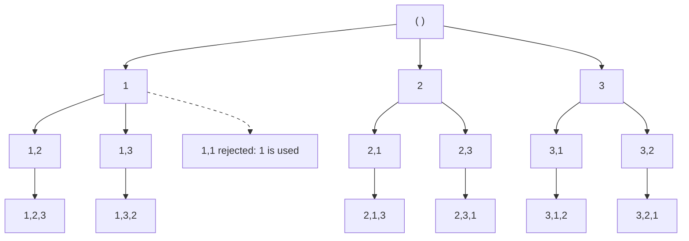

# Permutations

A **permutation** of a collection is an arrangement that uses every item exactly
once, where the order of the items is part of the answer. The list `[1, 2, 3]` has
six permutations, and `[1, 2, 3]` and `[2, 1, 3]` are two different ones even
though they hold the same values

That last sentence is the entire difference from
[subsets and combinations](02_subsets_combinations.md), where `[1, 2]` and
`[2, 1]` are the same answer and only one of them is ever produced. A combination
asks **which items**, and a permutation asks **which items, in which order**. Once
order counts, the number of answers grows from `2^n` subsets to `n!` arrangements

Counting them explains the shape of the recursion. Picture `n` empty slots to fill
left to right. The first slot can take any of the `n` items, the second can take
any of the `n - 1` items that are left, the third any of the `n - 2`, and so on
down to one choice for the last slot. Multiplying those gives
`n * (n - 1) * ... * 1`, which is `n!`. The recursion is that sentence turned into
code, with one slot filled per level of depth and the branching factor shrinking by
one each level

This topic covers filling those slots, the two ways to remember which items are
already spent, what to do when the input repeats a value, how to count
arrangements without listing them, and how the same slot-by-slot frame solves
problems where the "item" being chosen is a piece of a string rather than a number

## Why A Start Index Only Ever Produces The Original Order

The obvious first move is to reuse the combinations template, since a permutation
is just a combination that happens to use all `n` items. That template walks
indices forward with a `start` parameter and recurses on `i + 1`, and forcing the
path to reach full length looks like it should be the only change needed

```python
def permute_with_start(nums: list[int]) -> list[list[int]]:
    n = len(nums)
    path: list[int] = []
    out: list[list[int]] = []

    def backtrack(start: int) -> None:
        if len(path) == n:
            out.append(path[:])
            return
        for i in range(start, n):
            path.append(nums[i])
            backtrack(i + 1)
            path.pop()

    backtrack(0)
    return out


assert permute_with_start([1, 2, 3]) == [[1, 2, 3]]
assert permute_with_start([3, 1, 2]) == [[3, 1, 2]]
assert permute_with_start([1]) == [[1]]
assert permute_with_start([]) == [[]]
```

It returns exactly one answer, which is the input in its original order. The
reason is that `start` is there specifically to forbid going back to a smaller
index, since that is what stops combinations from emitting `[2, 1]` after
`[1, 2]`. Every arrangement except the original one needs a later index followed by
an earlier one, so `start` forbids all of them. The only path that survives is
`0, 1, 2, ..., n - 1`

That failure names the fix. The loop has to consider **every** index at every
depth, and the thing to exclude is not "indices before `i`" but "indices already
sitting in the path". Position in the array stops mattering, and membership in the
current path starts mattering instead

## Marking Which Items Are Already Placed

Keep a parallel boolean array `used`, where `used[i]` is `True` exactly when
`nums[i]` is currently in the path. The loop runs over all `n` indices and skips
the ones already taken, so the branching factor falls from `n` to `n - 1` to
`n - 2` on its own without any index bookkeeping

```python
def permute(nums: list[int]) -> list[list[int]]:
    n = len(nums)
    used = [False] * n
    path: list[int] = []
    out: list[list[int]] = []

    def backtrack() -> None:
        if len(path) == n:
            out.append(path[:])
            return
        for i in range(n):
            if used[i]:
                continue
            used[i] = True
            path.append(nums[i])
            backtrack()
            path.pop()
            used[i] = False

    backtrack()
    return out


assert permute([1, 2, 3]) == [[1, 2, 3], [1, 3, 2], [2, 1, 3], [2, 3, 1], [3, 1, 2], [3, 2, 1]]
assert permute([0, 1]) == [[0, 1], [1, 0]]
assert permute([1]) == [[1]]
assert permute([]) == [[]]
```

**The four lines around the recursive call** are the choose/explore/un-choose
cycle from [backtracking basics](01_backtracking_basics.md), and both halves of the
choice have to be undone. `used[i] = False` is the line people drop, and dropping
it is silent rather than loud, because the recursion still terminates and still
returns arrangements, only far fewer of them. Once an index is never released, the
first completed permutation consumes every item and no later branch can fill its
slots

**`len(path) == n` is the base case, not an index bound.** There is no index
walking forward here, so nothing else measures progress. The path length is the
depth, and depth `n` means every slot is full

**`path[:]` copies before saving.** The same list object is mutated all the way
back up the tree, so appending `path` itself stores a reference that is empty by
the time the function returns

**Tracking `used` as booleans rather than a set of values** matters when the input
repeats. A set of values cannot tell the two copies of `1` in `[1, 1, 2]` apart,
so it would refuse to place the second one and produce nothing of full length

> "Order matters here, so I cannot use the start-index template from combinations.
> I will let every position consider every element and keep a `used` array to
> exclude the ones already in the path. The base case is a path of length `n`, and
> I copy it before saving"

## Dry Run: Every Branch For `[1, 2, 3]`

The recursion tree has one level per slot. The root is the empty path, its three
children fix the first element, each of those has two children for the second, and
each of those has one child for the third, which gives `3 * 2 * 1 = 6` leaves



The dashed branch is the one the `used` check kills. Every level attempts all three
indices, and the ones already in the path are refused before any work happens. Here
is the left third of the tree as the code actually walks it, with the refusals
shown

```text
place nums[0]=1        path=[1]
  skip nums[0]=1       already in path [1]        <- REJECTED
  place nums[1]=2      path=[1, 2]
    skip nums[0]=1     already in path [1, 2]     <- REJECTED
    skip nums[1]=2     already in path [1, 2]     <- REJECTED
    place nums[2]=3    path=[1, 2, 3]  -> saved
    undo  nums[2]=3    path=[1, 2]
  undo  nums[1]=2      path=[1]
  place nums[2]=3      path=[1, 3]
    skip nums[0]=1     already in path [1, 3]     <- REJECTED
    place nums[1]=2    path=[1, 3, 2]  -> saved
    undo  nums[1]=2    path=[1, 3]
    skip nums[2]=3     already in path [1, 3]     <- REJECTED
  undo  nums[2]=3      path=[1]
undo  nums[0]=1        path=[]
```

The `undo` lines are what make the next branch legal. After `[1, 2, 3]` is saved,
the code pops `3` and clears `used[2]`, which is precisely what allows `3` to be
placed again one line later in the path `[1, 3]`. Skipping that reset would leave
`used = [True, True, True]` forever and the run would end with a single answer

Counting the solid nodes in the diagram gives 16, which is `1 + 3 + 6 + 6`, and the
dashed box is a refusal rather than a node the recursion enters. In general the
tree holds `n!/(n-k)!` nodes at depth `k`, and the total across all depths stays
below `e * n!`, so the leaf count `n!` dominates the shape of the cost

## Swapping The Front Instead Of Tracking It

The second standard implementation carries no `used` array. Treat `nums` itself as
the answer being built, and let `first` mark the boundary between the prefix that is
already fixed and the suffix that is still free. To choose an item for slot `first`,
swap it into that slot from anywhere in the suffix, recurse on `first + 1`, and swap
back on the way out

```python
def permute_swap(nums: list[int]) -> list[list[int]]:
    n = len(nums)
    out: list[list[int]] = []

    def backtrack(first: int) -> None:
        if first == n:
            out.append(nums[:])
            return
        for i in range(first, n):
            nums[first], nums[i] = nums[i], nums[first]
            backtrack(first + 1)
            nums[first], nums[i] = nums[i], nums[first]

    backtrack(0)
    return out


assert permute_swap([1, 2, 3]) == [[1, 2, 3], [1, 3, 2], [2, 1, 3], [2, 3, 1], [3, 2, 1], [3, 1, 2]]
assert permute_swap([0, 1]) == [[0, 1], [1, 0]]
assert permute_swap([1]) == [[1]]
assert permute_swap([]) == [[]]
```

The suffix `nums[first:]` holds exactly the unplaced items, which is the same
information `used` was storing, so nothing is lost. The swap back is the un-choose
step, and without it the array arrives at the next iteration scrambled and the
remaining branches enumerate the wrong multiset

Two differences decide which one to write in an interview

- The swap version mutates the caller's list during the run and restores it at the
  end, while the `used` version leaves the input untouched. Say which one you are
  doing out loud, because a mutated input is a real bug in a larger program
- The swap version does not emit permutations in sorted order, since `[3, 2, 1]`
  comes out before `[3, 1, 2]` above. It also cannot use the duplicate-skipping
  rule in the next section, because that rule needs equal values to stay adjacent
  and swapping destroys the sorted layout

Reach for swapping when the interviewer asks for `O(1)` extra state beyond the
recursion, and reach for `used` in every other case, including every problem with
repeated values

## When The Input Repeats A Value

For `[1, 1, 2]` the plain `used` version produces six paths, but only three
distinct arrangements, because swapping the two copies of `1` changes nothing
visible. Collecting the results into a set of tuples does fix the output, and it
still pays for all six branches, so the work grows with `n!` rather than with the
number of real answers. The duplicates have to be refused at the branch, not
filtered at the end

The fix starts by sorting, which puts equal values next to each other so a
duplicate is always detectable by looking one index left. Then add one rule at
every depth, which is that among a run of equal values the copies must be consumed
**left to right**. Index `i` may only be placed if the copy at `i - 1` is already
in the path

```python
def permute_unique(nums: list[int]) -> list[list[int]]:
    nums = sorted(nums)
    n = len(nums)
    used = [False] * n
    path: list[int] = []
    out: list[list[int]] = []

    def backtrack() -> None:
        if len(path) == n:
            out.append(path[:])
            return
        for i in range(n):
            if used[i]:
                continue
            if i > 0 and nums[i] == nums[i - 1] and not used[i - 1]:
                continue
            used[i] = True
            path.append(nums[i])
            backtrack()
            path.pop()
            used[i] = False

    backtrack()
    return out


assert permute_unique([1, 1, 2]) == [[1, 1, 2], [1, 2, 1], [2, 1, 1]]
assert permute_unique([1, 2, 3]) == [[1, 2, 3], [1, 3, 2], [2, 1, 3], [2, 3, 1], [3, 1, 2], [3, 2, 1]]
assert permute_unique([7, 7]) == [[7, 7]]
assert permute_unique([3]) == [[3]]
```

`not used[i - 1]` is the half that gets written wrong, so it is worth being exact
about what each state means

- `nums[i] == nums[i - 1]` and `used[i - 1]` is `False` means an identical value is
  still sitting unplaced to the left. Placing `i` now would build an arrangement
  that the branch starting at `i - 1` will also build, so this branch is a
  duplicate and gets refused
- `nums[i] == nums[i - 1]` and `used[i - 1]` is `True` means the left copy is
  already in the path, so placing `i` is how a permutation gets **both** copies.
  This branch is required

Dropping `and not used[i - 1]` and skipping every repeated value outright returns
an empty list for `[1, 1, 2]`, because the second `1` can then never be placed at
all and no path ever reaches length three. That is the failure to recognize, since
an empty answer looks nothing like a duplicate bug

The trace shows both outcomes of the rule inside one run

```text
i=0 place 1        path=[1]      used=[T, F, F]
  i=1 place 1      path=[1, 1]   used=[T, T, F]   allowed, used[0] is True
    i=2 place 2    path=[1, 1, 2]  -> saved
  i=2 place 2      path=[1, 2]   used=[T, F, T]
    i=1 place 1    path=[1, 2, 1]  -> saved
i=1 DUP-SKIP       nums[1] == nums[0] and used[0] is False   <- REJECTED
i=2 place 2        path=[2]      used=[F, F, T]
  i=0 place 1      path=[2, 1]   used=[T, F, T]
    i=1 place 1    path=[2, 1, 1]  -> saved
  i=1 DUP-SKIP     nums[1] == nums[0] and used[0] is False   <- REJECTED
```

Both rejections sit at the top of a run of equal values with nothing placed yet,
and both would have rebuilt an arrangement the previous branch already covered. The
two allowed uses of the second `1` both happen while the first `1` is in the path

## Counting Arrangements Without Building Them

Some problems want the **number** of sequences rather than the sequences
themselves, and Letter Tile Possibilities is the standard one. It gives a string of
tiles such as `"AAB"` and asks how many non-empty sequences can be made from them,
counting sequences of every length from one up to all the tiles

Two things change from the permutation template. The path never has to be stored,
since only the count matters, and the answer counts **every node** of the tree
rather than only the leaves, since a sequence of any length is a valid answer

Duplicates disappear if the loop runs over distinct letters instead of positions. A
`Counter` gives exactly that, with one key per distinct letter and a remaining
supply attached, so choosing "an `A`" is one branch no matter how many copies of
`A` exist

```python
from collections import Counter


def num_tile_possibilities(tiles: str) -> int:
    counts = Counter(tiles)

    def backtrack() -> int:
        total = 0
        for letter in counts:
            if counts[letter] == 0:
                continue
            counts[letter] -= 1
            total += 1 + backtrack()
            counts[letter] += 1
        return total

    return backtrack()


assert num_tile_possibilities("AAB") == 8
assert num_tile_possibilities("AAABBC") == 188
assert num_tile_possibilities("ABC") == 15
assert num_tile_possibilities("V") == 1
```

`total += 1 + backtrack()` is the whole idea, where the `1` counts the sequence
that ends right here and `backtrack()` counts every longer sequence that extends
it. The `counts[letter] += 1` afterwards is the un-choose step, identical in
purpose to `used[i] = False`

The loop iterates the counter's keys while the values change, which is safe because
no key is ever added or removed. Deleting a key at zero instead of leaving it would
mutate the dictionary mid-iteration and raise

## Jumping Whole Factorial Blocks

Permutation Sequence asks for the `k`th permutation of `1..n` in sorted order,
with `k` counted from one. Generating all `n!` of them and indexing is correct and
dies immediately, because `n` goes up to 9 and `9!` is 362880 arrangements built to
return one of them

The structure of the sorted list is what removes the enumeration. All the
permutations that start with the smallest digit come first, and there are exactly
`(n - 1)!` of them, because the remaining `n - 1` digits are free. The next `(n - 1)!`
start with the second-smallest digit, and so on. The sorted list is therefore `n`
contiguous **blocks** of equal size, so integer division by the block size names
the first digit directly

Switching `k` to a zero-based index makes that division exact, and the remainder is
the same question one size smaller

```python
from math import factorial


def get_permutation(n: int, k: int) -> str:
    digits = [str(d) for d in range(1, n + 1)]
    k -= 1
    out: list[str] = []
    for remaining in range(n - 1, -1, -1):
        block = factorial(remaining)
        index, k = divmod(k, block)
        out.append(digits.pop(index))
    return "".join(out)


assert get_permutation(3, 3) == "213"
assert get_permutation(4, 9) == "2314"
assert get_permutation(3, 1) == "123"
assert get_permutation(3, 6) == "321"
assert get_permutation(1, 1) == "1"
```

`digits.pop(index)` does two jobs at once, since it reads the chosen digit and
removes it so later slots cannot reuse it, which is the `used` array collapsed into
the list itself. Keeping the list sorted is what makes `index` mean "the
`index`-th smallest digit still available"

```text
n=4, k=9  ->  k = 8 after the zero-based shift
remaining=3  block=6  divmod(8, 6) = (1, 2)   digits=[1,2,3,4]  take 2   k=2
remaining=2  block=2  divmod(2, 2) = (1, 0)   digits=[1,3,4]    take 3   k=0
remaining=1  block=1  divmod(0, 1) = (0, 0)   digits=[1,4]      take 1   k=0
remaining=0  block=1  divmod(0, 1) = (0, 0)   digits=[4]        take 4   k=0
answer "2314"
```

The first line skips the six permutations beginning with `1` in one step, which is
the whole point. Nothing in this code backtracks, because counting the size of a
subtree lets you jump past it instead of walking it, and that trade is worth
naming out loud whenever a problem asks for the `k`th item rather than all items

## Choosing How Much To Consume Next

Palindrome Partitioning and Restore IP Addresses look like string problems rather
than permutation problems, and they run on the same slot-by-slot frame. The change
is what a choice is. Instead of picking which unused **item** goes in this slot, you
pick how far the next **segment** reaches, and the recursion continues from the end
of it

No `used` array appears, because a single `start` index already says what is spent.
Everything before `start` is consumed, everything after is free, and there is no way
to go back, so nothing else needs tracking

Restore IP Addresses cuts a digit string into four parts, where each part is between
0 and 255 and carries no leading zero

```python
def restore_ip_addresses(s: str) -> list[str]:
    n = len(s)
    parts: list[str] = []
    out: list[str] = []

    def backtrack(start: int) -> None:
        if len(parts) == 4:
            if start == n:
                out.append(".".join(parts))
            return
        if n - start > 3 * (4 - len(parts)):
            return
        for length in (1, 2, 3):
            end = start + length
            if end > n:
                break
            segment = s[start:end]
            if length > 1 and segment[0] == "0":
                continue
            if int(segment) > 255:
                continue
            parts.append(segment)
            backtrack(end)
            parts.pop()

    backtrack(0)
    return out


assert restore_ip_addresses("25525511135") == ["255.255.11.135", "255.255.111.35"]
assert restore_ip_addresses("101023") == ["1.0.10.23", "1.0.102.3", "10.1.0.23", "10.10.2.3", "101.0.2.3"]
assert restore_ip_addresses("0000") == ["0.0.0.0"]
assert restore_ip_addresses("1111111111111") == []
```

The base case has two conditions and they are separate questions. Four parts is
what makes an address complete, and `start == n` is what says the parts consumed
the whole string, so a run that fills four parts with characters left over is
abandoned rather than saved

Three checks prune, and each cuts a different kind of dead branch

- `if n - start > 3 * (4 - len(parts))` gives up as soon as too many characters
  remain for the parts still available, since no part can exceed three digits. This
  is the prune worth mentioning out loud, because it stops whole subtrees instead
  of rejecting one leaf at a time
- `if length > 1 and segment[0] == "0"` enforces the leading-zero rule, where `"0"`
  is legal and `"01"` is not
- `if int(segment) > 255` enforces the range, and only three-digit segments can
  ever fail it

## Worked Example: [Palindrome Partitioning](https://leetcode.com/problems/palindrome-partitioning/)

Cut a string into consecutive pieces so that every piece reads the same forwards
and backwards, and return every way of doing it. A single character is a palindrome
by itself, so at least one cutting always exists

**Input**: `s`, a `str` of lowercase English letters, where `1 <= len(s) <= 16`

**Output**: a `list[list[str]]`, where each inner list is one complete left-to-right
cutting of `s` into palindromic pieces. Concatenating any inner list reproduces `s`
exactly, every piece in it is a palindrome, and the outer list holds every such
cutting. Any order of the outer list is accepted

The phrase that identifies the technique is "return all the ways", since an
enumeration of every valid configuration is backtracking rather than a greedy scan
or dynamic programming. The naive approach is to place cuts everywhere first and
filter afterwards, which builds all `2^(n-1)` cuttings of the string and checks each
one at the end. That is a wasted subtree per bad prefix, because `"ab"` is not a
palindrome and yet every cutting that begins with it still gets built out to full
length before being thrown away

Rejecting a piece the moment it is formed is what turns this into a real
backtracking solution, and it is the same slot-by-slot frame with segments as the
choices

> "Each recursive call starts at some index and tries every end position from there.
> I only recurse when the piece I just formed is a palindrome, so a bad prefix kills
> its whole subtree instead of being filtered at the leaf. When `start` reaches the
> end of the string, the path is a complete valid cutting"

Therefore,

1. Write a helper that answers whether `s[lo..hi]` is a palindrome by walking two
   pointers inward from both ends, comparing and stopping at the first mismatch.
   Slicing and reversing works too, and the two-pointer version avoids building a
   copy of the piece for every check
2. Recurse on a single `start` index, which is the position the next piece must
   begin at. Everything before it has already been cut into palindromes and stored
   in the path, so no other state is needed
3. Make the base case `start == n`, meaning the whole string has been consumed.
   Save a copy of the path with `path[:]`, since the same list keeps mutating as the
   recursion unwinds
4. In the body, loop `end` from `start` to `n - 1`, where each value of `end` is one
   candidate piece `s[start..end]`. This is the branching, with a short piece and a
   long piece being different arrangements of the same string
5. Skip any `end` whose piece is not a palindrome, which prunes the branch before it
   costs anything. Every surviving `end` gets appended to the path, recursed on from
   `end + 1`, and popped afterwards, which is choose, explore, un-choose
6. Return the collected list. No deduplication is needed, because each cutting is
   determined by where its cuts fall and the loop visits each set of positions once

```python
def partition(s: str) -> list[list[str]]:
    n = len(s)
    path: list[str] = []
    out: list[list[str]] = []

    def is_palindrome(lo: int, hi: int) -> bool:
        while lo < hi:
            if s[lo] != s[hi]:
                return False
            lo += 1
            hi -= 1
        return True

    def backtrack(start: int) -> None:
        if start == n:
            out.append(path[:])
            return
        for end in range(start, n):
            if not is_palindrome(start, end):
                continue
            path.append(s[start : end + 1])
            backtrack(end + 1)
            path.pop()

    backtrack(0)
    return out


assert partition("aab") == [["a", "a", "b"], ["aa", "b"]]
assert partition("aba") == [["a", "b", "a"], ["aba"]]
assert partition("abc") == [["a", "b", "c"]]
assert partition("a") == [["a"]]
assert partition("") == [[]]
```

The trace on `"aab"` shows the pruning doing its job twice

```text
take 'a'  -> recurse from 1   path=['a']
  take 'a'  -> recurse from 2   path=['a', 'a']
    take 'b'  -> recurse from 3   path=['a', 'a', 'b']
      start == 3 == n, save ['a', 'a', 'b']
  reject 'ab'   not a palindrome                <- REJECTED
undo 'a'
take 'aa' -> recurse from 2   path=['aa']
  take 'b'  -> recurse from 3   path=['aa', 'b']
    start == 3 == n, save ['aa', 'b']
undo 'aa'
reject 'aab'    not a palindrome                <- REJECTED
```

Rejecting `'ab'` at depth two costs one comparison and removes the branch that
would otherwise have gone on to try `'ab'` followed by `'b'`. Rejecting `'aab'` at
depth one is the three-piece-in-one branch dying the same way. The filter-at-the-end
version would have built both of those to full length first

- **Time Complexity:** `O(n * 2^n)`, because there are `n - 1` gaps between
  characters and each is either cut or not, which gives `2^(n-1)` candidate
  cuttings, and each surviving path costs `O(n)` to copy plus `O(n)` of palindrome
  checking along the way
- **Space Complexity:** `O(n)` auxiliary, because the recursion goes at most `n`
  deep and the path holds at most `n` pieces, with the output itself taking a
  further `O(n * 2^n)` since a string like `"aaaa"` produces a partition for every
  cut placement

## Time and Space Complexity

`n` is the number of items being arranged. Space is stated as auxiliary space,
excluding the returned list, and the output size is given separately where it
matters

**Permutations of distinct items**

| Approach                                    | Time                                                                                                                                               | Space                                                                                                                            |
| ------------------------------------------- | -------------------------------------------------------------------------------------------------------------------------------------------------- | -------------------------------------------------------------------------------------------------------------------------------- |
| `used` array                                | `O(n * n!)`: there are `n!` leaves, each costing `O(n)` to copy, and the internal nodes total under `e * n!` with an `O(n)` scan of `used` at each | `O(n)`: the `used` array, the path, and the recursion stack are each at most `n`, and the output adds a further `O(n * n!)`      |
| Swapping in place                           | `O(n * n!)`: the same tree with the same `n!` leaves, where a swap replaces the `used` scan and the leaf copy still costs `O(n)`                   | `O(n)`: only the recursion stack, since the arrangement is held in the input array itself, and the output again adds `O(n * n!)` |
| Collecting into a `set` of tuples to dedupe | `O(n * n!)`: the tree is walked in full regardless of how many answers are distinct, which is why duplicates get refused at the branch instead     | `O(n * n!)`: every arrangement is hashed and stored, including the ones that turn out to be duplicates                           |

**Permutations with repeated values**

| Approach                                                 | Time                                                                                                                                                                                                        | Space                                                                                                                |
| -------------------------------------------------------- | ----------------------------------------------------------------------------------------------------------------------------------------------------------------------------------------------------------- | -------------------------------------------------------------------------------------------------------------------- |
| Sort, then skip `nums[i] == nums[i-1] and not used[i-1]` | `O(n * n!/(c1! * c2! * ...))`: proportional to the number of distinct arrangements, where `ci` is the multiplicity of the `i`th distinct value, and it degrades to `O(n * n!)` when every value is distinct | `O(n)`: the sort is in place, and `used`, the path, and the stack are each `n`                                       |
| Counting with a `Counter` over distinct letters          | `O(k * S)`: where `k` is the number of distinct letters and `S` is the number of distinct non-empty sequences, since each node loops over `k` keys and every node contributes exactly one sequence          | `O(k + n)`: `k` counter entries plus a recursion stack at most `n` deep, and nothing stores the sequences themselves |

**Choosing segments rather than items**

| Problem                                  | Time                                                                                                                                                               | Space                                                                                                           |
| ---------------------------------------- | ------------------------------------------------------------------------------------------------------------------------------------------------------------------ | --------------------------------------------------------------------------------------------------------------- |
| Permutation Sequence by factorial blocks | `O(n²)`: `n` slots, each doing one `divmod` and one `list.pop(index)` that shifts up to `n` entries, with no enumeration at all                                    | `O(n)`: the digit list and the output characters, and the recursion is replaced by a loop                       |
| Restore IP Addresses                     | `O(3^4 * n)`: at most three lengths for each of four segments, so under 81 leaves, each costing `O(n)` to join, which is effectively constant since `len(s) <= 20` | `O(1)` auxiliary: at most four segments and four stack frames, with the output bounded by the same 81 addresses |
| Palindrome Partitioning                  | `O(n * 2^n)`: `2^(n-1)` ways to place cuts, with `O(n)` of palindrome checking and copying per completed cutting                                                   | `O(n)` auxiliary: the path and the stack are each at most `n` deep, with the output up to `O(n * 2^n)`          |

## Summary

- A **permutation** is an arrangement of every item where order is part of the
  answer, so `[1, 2]` and `[2, 1]` are two different results. There are `n!` of
  them, because the first slot has `n` choices, the second has `n - 1`, and the
  branching factor drops by one per level
  - Combinations answer "which items" and permutations answer "which items, in
    which order", which is why the count jumps from `2^n` subsets to `n!`
    arrangements
- The start-index template from combinations cannot produce permutations at all,
  since `start` exists to forbid revisiting an earlier index and every arrangement
  except the original order needs exactly that. It returns the input unchanged as
  its only answer
- The fix is to loop over all `n` indices at every depth and exclude the ones
  already in the path, which is what the `used` boolean array records. The base case
  is `len(path) == n` rather than an index bound, because path length is the only
  thing measuring progress
  - `used[i] = False` has to be reset alongside `path.pop()`, and forgetting it
    yields a single answer rather than a crash
  - Save `path[:]` rather than `path`, since one list object is mutated for the
    whole run
- The swap approach keeps no `used` array and instead swaps a suffix element into
  the front position, recurses, and swaps back, so `nums[first:]` is the set of
  unplaced items. It uses `O(n)` stack space and nothing else, and its cost is why
  interviewers ask for it
  - It mutates the caller's list during the run, and it cannot be combined with the
    sort-and-skip duplicate rule, because swapping breaks the sorted layout that
    rule depends on
- With repeated values, sort first and refuse index `i` when
  `nums[i] == nums[i - 1] and not used[i - 1]`, which forces equal copies to be
  consumed left to right so each distinct arrangement is built exactly once
  - Skipping every repeated value without the `used[i - 1]` condition returns an
    empty list, because the second copy can then never be placed and no path
    reaches full length
  - Deduping a full run through a `set` of tuples is correct and still pays the
    full `n!` cost, so it is the fallback rather than the answer
- When the problem asks how many rather than which, recurse over the keys of a
  `Counter` so each distinct letter branches once, and add `1 + backtrack()` at
  every node because a valid sequence ends at each one, not only at the leaves
- Counting a subtree's size can replace walking it. The `k`th permutation of
  `1..n` in sorted order is read off directly, since the arrangements starting with
  a given digit form a contiguous block of `(n - 1)!`, so `divmod(k - 1, (n - 1)!)`
  names the digit and leaves the remainder as the same question one size smaller
  - This runs in `O(n²)` with no recursion, and it is the move to reach for whenever
    a problem wants the `k`th item rather than all items
- Segment problems such as Palindrome Partitioning and Restore IP Addresses use the
  same slot-by-slot frame, where the choice is how far the next piece reaches rather
  than which item to place. A single `start` index replaces `used`, because
  everything before it is consumed and nothing can be revisited
  - Test the piece the moment it is formed rather than filtering complete answers at
    the end, since a rejected prefix kills its entire subtree
  - A length prune such as `n - start > 3 * (4 - len(parts))` abandons a branch as
    soon as the remaining characters cannot fit the remaining slots

## Interview Checklist

Before writing code, make sure you can answer each of these

```text
Does order matter here (permutation) or only membership (combination)?
Am I looping over all n indices with a used array, or swapping the front element?
If I swap, have I said out loud that the input list is mutated during the run?
Is the base case len(path) == n, or start == n for a segment problem?
Am I copying the path with path[:] before appending it to the output?
Is used[i] reset to False on the same line group as path.pop(), on every branch?
Does the input contain repeated values, and did I sort before skipping duplicates?
For the duplicate skip, is the condition nums[i] == nums[i-1] and not used[i-1]?
Does the problem want the count instead of the list, which a Counter recursion gives?
Does it want only the kth arrangement, which factorial blocks give without enumerating?
For segments, can I reject a piece as soon as it is formed rather than at the leaf?
Can I state the branching factor and multiply it out to n! when asked for complexity?
```
