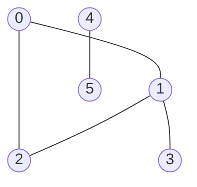
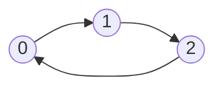
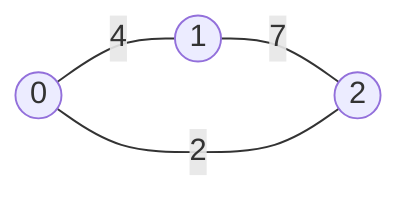
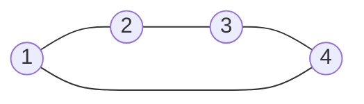

# Graph Basics And Reachability

A **graph** is a set of things plus a set of connections between pairs of them.
The things are called **nodes** (or **vertices**), the connections are called
**edges**, and two nodes joined by an edge are **neighbors**, or equivalently are
**adjacent**. The number of edges touching a node is its **degree**

You have already worked with graphs for three modules without the word.
A [tree](../../07_trees/notes/01_fundamentals.md) is a graph that has been heavily
restricted: it has a designated root, every node has exactly one parent, there is
exactly one path between any two nodes, and there are no cycles. A general graph
throws all four away. There is no root, so there is no natural place to start.
A node can be reached from several directions. And a path can lead back to where
it began

Think of an airline map. Cities are nodes, direct flights are edges, and the
questions you can ask about it are the questions graph problems ask: can I get
from here to there at all, how few hops does it take, which cities form a group
that never connects to the rest



Three more words make the rest of the module readable. A **path** is a sequence
of nodes where each consecutive pair is joined by an edge, so `0, 1, 3` is a path
above. A **cycle** is a path that returns to its starting node without reusing an
edge, and `0, 1, 2, 0` is one. Nodes `4` and `5` can reach each other but nothing
else, so this graph is **disconnected**: it falls into two separate groups, each
called a **connected component**

## Edges Come In Three Flavours

An edge carries up to three pieces of information, and the first question to ask
about any graph problem is which of them apply

**Undirected** edges work both ways, which is the graph drawn above. If `0` is a
neighbor of `1`, then `1` is a neighbor of `0`. Friendships, shared borders, and
two-way roads are undirected

**Directed** edges work one way only. An edge from `0` to `1` says nothing about
whether you can get from `1` back to `0`. Course prerequisites, follower
relationships, and one-way streets are directed. Drawn with arrowheads:



**Weighted** edges carry a number: a distance, a cost, a travel time, a
probability. An unweighted edge is really a weighted edge where every weight is
1, which is why "fewest edges" and "cheapest path" are the same question on an
unweighted graph and different questions the moment weights differ



On that weighted graph the path `0, 2` costs 2 while the path `0, 1, 2` costs 11,
even though both use a small number of edges. Weighted shortest paths need
[Dijkstra](07_weighted_shortest_paths.md) rather than anything in this topic

Two smaller cases are worth naming so they do not surprise you. A **self-loop**
is an edge from a node to itself, and a **parallel edge** is a second edge
between a pair of nodes that already have one. Most interview problems promise
neither exists, and it is a good clarifying question, because a self-loop breaks
a "does this node have a neighbor other than its parent" check written carelessly

## Reading Structure Straight Off The Edge List

The most common way a graph arrives is as an **edge list**: a list of pairs,
where `edges[i] = [u, v]` means there is an edge between `u` and `v`. Node labels
are usually the integers `0` through `n - 1`, with `n` given separately, because
a node with no edges at all appears nowhere in the list and would otherwise be
invisible

Some problems are answered by the edge list alone, with no traversal at all. In
[Find Center Of Star Graph](https://leetcode.com/problems/find-center-of-star-graph/)
you are told the graph is a **star**, meaning one central node is connected to
every other node and no other edges exist. Counting degrees and taking the
maximum works and costs `O(E)`. But the promise is stronger than that: since
every edge touches the center, any two edges both touch it, and two edges share
exactly one node unless they are the same edge

```python
def find_center(edges: list[list[int]]) -> int:
    a, b = edges[0]
    c, d = edges[1]
    return a if a in (c, d) else b


assert find_center([[1, 2], [2, 3], [4, 2]]) == 2
assert find_center([[1, 2], [5, 1], [1, 3], [1, 4]]) == 1
assert find_center([[1, 2], [2, 3]]) == 2
```

Only the first two edges are read, so this is `O(1)` in both time and space. The
third assert is the smallest legal star, with two edges and three nodes, which is
the degenerate input to check because reading `edges[1]` would crash on anything
smaller

That is the exception rather than the rule. Almost every other problem needs to
walk the graph, and the edge list is the wrong shape for walking

## Why Looking Up Neighbors In The Edge List Dies

To walk a graph you repeatedly ask one question: given a node, what are its
neighbors? The edge list can answer it, by scanning every edge and collecting the
other endpoint whenever one endpoint matches

```python
def neighbors_by_scan(edges: list[list[int]], u: int) -> list[int]:
    found: list[int] = []
    for a, b in edges:
        if a == u:
            found.append(b)
        elif b == u:
            found.append(a)
    return found


assert neighbors_by_scan([[0, 1], [0, 2], [1, 2]], 0) == [1, 2]
assert neighbors_by_scan([[0, 1]], 5) == []
```

This is correct and it is the version to never write. One call costs `O(E)`,
where `E` is the number of edges, and a traversal asks the question once per node,
so visiting all `V` nodes costs `O(V * E)`. With 100,000 nodes and 100,000 edges
that is 10^10 comparisons for a problem whose real answer takes 200,000 steps

The waste is specific. Every scan re-reads all `E` edges to extract the handful
that touch one node, and the next scan re-reads the same `E` edges to extract a
different handful. The information is being recomputed on demand when it could be
sorted once

So sort it once. Walk the edge list a single time and drop each edge into a
bucket for each of its endpoints. The result is an **adjacency list**: one list
of neighbors per node, so a neighbor lookup becomes an index into an array

```python
def build_adjacency(n: int, edges: list[list[int]]) -> list[list[int]]:
    adj: list[list[int]] = [[] for _ in range(n)]
    for u, v in edges:
        adj[u].append(v)
        adj[v].append(u)
    return adj


assert build_adjacency(3, [[0, 1], [1, 2]]) == [[1], [0, 2], [1]]
assert build_adjacency(2, []) == [[], []]
assert build_adjacency(1, []) == [[]]
```

**Both `append` lines are the undirected part.** An undirected edge is stored as
two directed ones, because the walk will arrive at `u` sometimes and at `v` other
times and needs to find the edge from either end. For a **directed** graph, delete
the second `append` and store only `adj[u].append(v)`. Forgetting to delete it is
how a one-way prerequisite graph quietly becomes two-way, and every cycle check
built on it then reports a cycle on the first edge it sees

Building costs `O(V + E)`: `O(V)` to allocate the empty buckets and `O(E)` to
place the edges. After that every lookup is `O(1)` to reach the bucket, and the
whole traversal reads each bucket once, so the total is `O(V + E)` rather than
`O(V * E)`

When the nodes are strings, or integers that are not a dense `0..n-1` range, a
`defaultdict(list)` replaces the pre-sized array

```python
from collections import defaultdict


def build_adjacency_labelled(edges: list[tuple[str, str]]) -> dict[str, list[str]]:
    adj: dict[str, list[str]] = defaultdict(list)
    for u, v in edges:
        adj[u].append(v)
        adj[v].append(u)
    return dict(adj)


assert build_adjacency_labelled([("a", "b"), ("b", "c")]) == {
    "a": ["b"],
    "b": ["a", "c"],
    "c": ["b"],
}
assert build_adjacency_labelled([]) == {}
```

The one thing a `defaultdict` loses is isolated nodes, since a node in no edge is
never touched and so never gets a key. If the problem counts isolated nodes, seed
every node explicitly before reading the edges

## Adjacency List Versus Adjacency Matrix

The other representation is an **adjacency matrix**: a `V x V` grid where
`matrix[u][v]` is 1 when the edge exists and 0 when it does not, or the weight
instead of the 1 when the graph is weighted

```python
def build_matrix(n: int, edges: list[list[int]]) -> list[list[int]]:
    matrix = [[0] * n for _ in range(n)]
    for u, v in edges:
        matrix[u][v] = 1
        matrix[v][u] = 1
    return matrix


assert build_matrix(3, [[0, 1], [1, 2]]) == [[0, 1, 0], [1, 0, 1], [0, 1, 0]]
assert build_matrix(1, []) == [[0]]
```

An undirected matrix is symmetric across its diagonal, because the two
assignments write mirrored cells

The tradeoff is between the two questions you can ask:

- "Is there an edge from `u` to `v`?" is `O(1)` on a matrix and `O(degree(u))` on
  an adjacency list, since the list has to be searched
- "What are all the neighbors of `u`?" is `O(degree(u))` on an adjacency list and
  `O(V)` on a matrix, since the whole row must be scanned including all the zeroes

Traversal only ever asks the second question, so the adjacency list wins for
almost every interview problem. A matrix costs `O(V²)` space no matter how few
edges exist, and with `V = 10^5` that is 10^10 cells, which does not fit in
memory. The matrix earns its place only when the graph is **dense**, meaning `E`
is close to `V²`, or when the problem hands you one already, as *Number Of
Provinces* does with its `isConnected` grid. In that case do not convert it,
just treat row `u` as the neighbor list and skip the zeroes

## Walking The Graph With A Visited Set

Tree traversal never needed to remember where it had been, because a tree offers
exactly one path to each node and no path leads backward. Both guarantees are
gone here. Run a plain recursive walk on the triangle `0-1-2` and it goes `0`,
`1`, `2`, `0`, `1`, `2` forever until the recursion limit stops it

The fix is one set. A **visited** set records every node the walk has already
committed to, and a node already in it is never entered again. That single
addition turns an infinite walk into one that touches each node once

```python
def reachable_from(adj: list[list[int]], start: int) -> set[int]:
    visited: set[int] = set()

    def dfs(node: int) -> None:
        visited.add(node)
        for nxt in adj[node]:
            if nxt not in visited:
                dfs(nxt)

    dfs(start)
    return visited


graph = build_adjacency(6, [[0, 1], [0, 2], [1, 2], [1, 3], [4, 5]])

assert reachable_from(graph, 0) == {0, 1, 2, 3}
assert reachable_from(graph, 4) == {4, 5}
assert reachable_from(build_adjacency(1, []), 0) == {0}
```

**`visited.add(node)` runs before the loop, not after it.** Marking a node on the
way out instead of on the way in means a cycle can re-enter it while its own call
is still on the stack, which is the infinite recursion the set was added to
prevent

The same walk without recursion swaps the call stack for an explicit one, which
matters because a graph of 10^5 nodes can form a chain longer than Python's
default recursion limit of 1000 frames

```python
def reachable_iterative(adj: list[list[int]], start: int) -> set[int]:
    visited = {start}
    stack = [start]
    while stack:
        node = stack.pop()
        for nxt in adj[node]:
            if nxt not in visited:
                visited.add(nxt)
                stack.append(nxt)
    return visited


assert reachable_iterative(graph, 0) == {0, 1, 2, 3}
assert reachable_iterative(graph, 4) == {4, 5}
assert reachable_iterative(build_adjacency(1, []), 0) == {0}
```

Here the marking moves to the moment a node is **pushed**, not the moment it is
popped. A node with three neighbors already on the stack would otherwise be
pushed three times and expanded three times, which is correct but does redundant
work, and on a dense graph that redundancy is what turns a passing solution into
a timeout

Reachability questions are this function with a different return value. In
[Find If Path Exists In Graph](https://leetcode.com/problems/find-if-path-exists-in-graph/)
you stop as soon as the destination is popped

```python
def valid_path(n: int, edges: list[list[int]], source: int, destination: int) -> bool:
    adj = build_adjacency(n, edges)
    visited = {source}
    stack = [source]
    while stack:
        node = stack.pop()
        if node == destination:
            return True
        for nxt in adj[node]:
            if nxt not in visited:
                visited.add(nxt)
                stack.append(nxt)
    return False


assert valid_path(3, [[0, 1], [1, 2], [2, 0]], 0, 2) is True
assert valid_path(6, [[0, 1], [0, 2], [3, 5], [5, 4], [4, 3]], 0, 5) is False
assert valid_path(1, [], 0, 0) is True
```

The last assert is the edge case interviewers reach for. With `source` equal to
`destination` and no edges at all, the answer is `True`, and any version that
only checks the destination when it is *discovered as a neighbor* returns `False`
because the source is never anybody's neighbor

## Tracing DFS Across A Cycle And Into A Dead End

Take the six-node graph drawn at the top, whose adjacency list is
`[[1, 2], [0, 2, 3], [0, 1], [1], [5], [4]]`, and start at node `0`. Indentation
is recursion depth

```text
visit 0          visited={0}
  0->1  new, recurse
  visit 1        visited={0,1}
    1->0  REJECTED, already visited
    1->2  new, recurse
    visit 2      visited={0,1,2}
      2->0  REJECTED, already visited
      2->1  REJECTED, already visited
    1->3  new, recurse
    visit 3      visited={0,1,2,3}
      3->1  REJECTED, already visited
  0->2  REJECTED, already visited
```

There are two different kinds of rejection here and they teach different things

The `1->0` rejection is the edge the walk just arrived on, seen from the other
side. Every undirected edge is stored twice, so every recursive call immediately
finds its own parent sitting in the neighbor list. Without the visited set that
alone bounces the walk between two nodes forever, before any real cycle is
involved

The `0->2` rejection at the bottom is the interesting one. Node `0` has a direct
edge to node `2`, but by the time the loop reaches it, `2` has already been
visited the long way around through `1`. DFS reached `2` in two steps when one
was available, and it will never revisit to correct that. **DFS answers whether a
node is reachable and says nothing about how far away it is.** That is the entire
reason the next tool exists

Nodes `4` and `5` are never mentioned in the trace at all, since no edge connects
them to the component containing `0`. A traversal from a single start visits one
component, which is why problems that ask about the whole graph loop over every
node and start a fresh traversal from each unvisited one, covered in
[components and cycles](04_components_cycles_bipartite.md)

## The Same Walk With A Queue

Swap the stack for a queue and depth-first becomes
[breadth-first](../../07_trees/notes/03_bfs.md): all nodes one edge away are
handled before any node two edges away. On a tree that ordering gave you levels.
On a graph it gives you something stronger, which is that the first time BFS
reaches a node, it has reached it by a path with the fewest possible edges

```python
from collections import deque


def edge_distances(adj: list[list[int]], start: int) -> dict[int, int]:
    dist = {start: 0}
    queue = deque([start])
    while queue:
        node = queue.popleft()
        for nxt in adj[node]:
            if nxt not in dist:
                dist[nxt] = dist[node] + 1
                queue.append(nxt)
    return dist


assert edge_distances(graph, 0) == {0: 0, 1: 1, 2: 1, 3: 2}
assert edge_distances(graph, 4) == {4: 0, 5: 1}
assert edge_distances(build_adjacency(1, []), 0) == {0: 0}
```

Node `2` comes back at distance 1, which is the answer DFS got wrong in the trace
above. The `dist` dictionary is doing two jobs at once: it stores the answer and
it *is* the visited set, since a key exists exactly when the node has been
enqueued. Keeping a separate `visited` set alongside it is duplicated state that
can drift out of sync

Why the first arrival is optimal is worth being able to say. The queue holds
nodes in non-decreasing order of distance, because every node enqueued from a
node at distance `d` gets distance `d + 1`, so the queue never contains two
values differing by more than one and never hands back a larger one first. A node
therefore cannot be discovered later by a shorter route

> "The edges are unweighted, so every hop costs the same. That makes BFS the
> right tool rather than DFS, because BFS finishes everything at distance `d`
> before it starts on `d + 1`, so the first time I see the target I already have
> the minimum number of edges."

For a plain yes-or-no reachability question either traversal is fine, and DFS in
its recursive form is three lines shorter. Choose BFS the moment the word
"shortest", "fewest", or "minimum number of steps" appears

## When The Neighbors Are Discovered As You Go

Nothing requires the graph to exist before the traversal starts.
[Keys And Rooms](https://leetcode.com/problems/keys-and-rooms/) gives you
`rooms`, where `rooms[i]` is the list of keys found inside room `i`, and a key
opens the room with that number. That list is already an adjacency list, so
there is nothing to build

```python
def can_visit_all_rooms(rooms: list[list[int]]) -> bool:
    visited = {0}
    stack = [0]
    while stack:
        room = stack.pop()
        for key in rooms[room]:
            if key not in visited:
                visited.add(key)
                stack.append(key)
    return len(visited) == len(rooms)


assert can_visit_all_rooms([[1], [2], [3], []]) is True
assert can_visit_all_rooms([[1, 3], [3, 0, 1], [2], [0]]) is False
assert can_visit_all_rooms([[]]) is True
```

The answer is `len(visited) == len(rooms)`, which is the standard way to phrase
"is everything reachable from here". The second example fails because room `2`
holds the only key to itself and to nothing else, so the component reachable from
room `0` is `{0, 1, 3}` and room `2` is stranded

The graph can also arrive as objects rather than indices.
[Employee Importance](https://leetcode.com/problems/employee-importance/) hands
you a list of `Employee` objects, each holding an `id`, an `importance` value,
and a list of subordinate **ids**. The ids are neighbors but the list is in
arbitrary order, so finding the object for a given id means scanning the list,
which is the `O(V)` lookup from the edge-list problem in a new costume. Index by
id once and the lookup becomes `O(1)`

```python
class Employee:
    def __init__(self, id: int, importance: int, subordinates: list[int]) -> None:
        self.id = id
        self.importance = importance
        self.subordinates = subordinates


def get_importance(employees: list[Employee], id: int) -> int:
    by_id = {e.id: e for e in employees}

    def total(eid: int) -> int:
        node = by_id[eid]
        return node.importance + sum(total(sub) for sub in node.subordinates)

    return total(id)


staff = [Employee(1, 5, [2, 3]), Employee(2, 3, []), Employee(3, 3, [])]

assert get_importance(staff, 1) == 11
assert get_importance(staff, 2) == 3
assert get_importance([Employee(1, 2, [])], 1) == 2
```

There is no visited set here, and that is a deliberate reading of the problem
rather than an oversight. A management chart is a tree, so no employee is
reachable twice and no chain loops back. If an interviewer follows up with "what
if the org chart has a cycle", the answer is to add the visited set back, because
without it the recursion never terminates

## Worked Example: [Clone Graph](https://leetcode.com/problems/clone-graph/)

Given a reference to one node of a connected undirected graph, build a complete
deep copy of it: a whole new set of node objects with the same values, wired
together in the same shape, sharing nothing with the original

**Input**: `node`, a reference to a `Node`, or `None` when the graph is empty.
Each `Node` has `val`, an `int`, and `neighbors`, a `list[Node]`. Values are
unique and, on the LeetCode judge, the node with value `i` sits at index `i - 1`
of the input `adjList`. The graph is connected, so every node is reachable from
the one you are given, and it contains no self-loops or parallel edges

**Output**: a reference to the copy of the node you were given. Every node in the
copy must be a newly allocated object, meaning no object from the original may
appear anywhere in the result, and the neighbor relationships must match exactly.
Returning `None` is correct only when the input was `None`

The phrase "deep copy of a graph" is the signal for a **traversal plus an
old-node-to-new-node map**. The naive attempt is a plain DFS that allocates a new
`Node` on arrival and recurses into the neighbors. It fails on the very first
cycle: cloning `1` recurses into `2`, whose neighbor list contains `1` again, so
it clones a second copy of `1`, which recurses into a second copy of `2`, forever

The map fixes both problems at once. Keying it by the **original** node object
gives an answer to "have I cloned this one already", so it is the visited set,
and it also stores the clone so the walk can wire neighbors to the copy rather
than the original

> "I will keep a dictionary from each original node to its clone. That dictionary
> is my visited set as well as my output, because a node is in it exactly when it
> has already been cloned. I create the clone when I first discover a node, and I
> attach neighbors when I process it, so every edge gets wired exactly once from
> each side."

1. Return `None` immediately for a `None` input, since there is no node to hand
   back and every later line assumes a real node exists
2. Create the clone of the starting node **before** the loop begins and put it in
   the map. The invariant for the rest of the run is that anything in the map has
   a clone allocated, and the start node has to satisfy that from the beginning
3. Push the original start node into a queue. The queue holds original nodes
   waiting to have their neighbor lists copied, not clones, because only the
   originals know the shape being copied
4. Pop an original node. Its clone already exists by the invariant, and what
   remains is to fill in that clone's empty `neighbors` list
5. For each neighbor of the popped node, check the map. If it is absent, this is
   the first time the walk has seen that node, so allocate its clone, record it,
   and enqueue the original so its own neighbors get copied later
6. Whether the neighbor was new or already known, append its clone to the popped
   node's clone's neighbor list. Doing this outside the `if` is what makes edges
   back to already-cloned nodes get wired, which is exactly the cycle case that
   broke the naive version
7. When the queue empties, every reachable node has been cloned and every edge
   copied, so return the clone of the node you started from

```python
from collections import deque


class Node:
    def __init__(self, val: int = 0, neighbors: "list[Node] | None" = None) -> None:
        self.val = val
        self.neighbors = neighbors if neighbors is not None else []


def clone_graph(node: "Node | None") -> "Node | None":
    if node is None:
        return None
    clones: dict[Node, Node] = {node: Node(node.val)}
    queue = deque([node])
    while queue:
        original = queue.popleft()
        for neighbor in original.neighbors:
            if neighbor not in clones:
                clones[neighbor] = Node(neighbor.val)
                queue.append(neighbor)
            clones[original].neighbors.append(clones[neighbor])
    return clones[node]


def build(adj_list: list[list[int]]) -> "Node | None":
    if not adj_list:
        return None
    nodes = [Node(i + 1) for i in range(len(adj_list))]
    for i, neighbors in enumerate(adj_list):
        nodes[i].neighbors = [nodes[j - 1] for j in neighbors]
    return nodes[0]


def to_adj_list(node: "Node | None") -> list[list[int]]:
    if node is None:
        return []
    seen: dict[int, list[int]] = {}
    stack = [node]
    while stack:
        current = stack.pop()
        if current.val in seen:
            continue
        seen[current.val] = [n.val for n in current.neighbors]
        stack.extend(current.neighbors)
    return [seen[v] for v in sorted(seen)]


source = build([[2, 4], [1, 3], [2, 4], [1, 3]])
copy = clone_graph(source)

assert to_adj_list(copy) == [[2, 4], [1, 3], [2, 4], [1, 3]]
assert copy is not source and copy.neighbors[0] is not source.neighbors[0]
assert to_adj_list(clone_graph(build([[]]))) == [[]]
assert clone_graph(None) is None
```

The graph in that test is the four-node square from the problem statement, where
`1` and `3` are opposite corners and so are not neighbors:



Using `Node` objects as dictionary keys works because the class defines neither
`__eq__` nor `__hash__`, so Python falls back to identity, and two distinct nodes
that happen to share a value stay distinct keys. Keying by `node.val` instead
gives the same answer here only because the problem promises unique values, and
it is the shortcut that breaks the moment values repeat

`assert copy is not source` is the check that actually tests the word "deep".
A function that simply returned `node` would satisfy a value-by-value comparison
and fail this line

- **Time Complexity:** `O(V + E)` where `V` is the number of nodes and `E` the
  number of edges, because each node is enqueued exactly once, guarded by the
  membership test on `clones`, and each node's neighbor list is walked exactly
  once when it is popped
- **Space Complexity:** `O(V)` auxiliary, since the map holds one entry per node
  and the queue holds at most every node at once, on top of the `O(V + E)` the
  returned copy occupies by definition

## Time and Space Complexity

Throughout, `V` is the number of nodes and `E` is the number of edges. In an
undirected graph the sum of all degrees is `2E`, since each edge contributes one
to the degree of each endpoint, which is why a traversal that reads every
neighbor list once does `O(E)` work in total and not `O(V * E)`

**Choosing a representation**

| Representation                      | Time                                                                                                                                                  | Space                                                                                                             |
| ----------------------------------- | ----------------------------------------------------------------------------------------------------------------------------------------------------- | ----------------------------------------------------------------------------------------------------------------- |
| Adjacency list                      | `O(V + E)` to build from an edge list, then `O(degree(u))` to list the neighbors of `u` and `O(degree(u))` to test one specific edge                  | `O(V + E)`: one bucket per node plus one entry per edge endpoint, which is `2E` entries when undirected           |
| Adjacency matrix                    | `O(V²)` to build, then `O(V)` to list the neighbors of `u` because the row must be scanned including its zeroes, but `O(1)` to test one specific edge | `O(V²)`: every cell exists whether or not the edge does, so a sparse graph with `V = 10^5` will not fit in memory |
| Raw edge list, rescanned per lookup | `O(E)` per neighbor lookup, so `O(V * E)` for a full traversal, because the same `E` edges are re-read once for every node                            | `O(E)`: the input itself and nothing else, which is the only reason this ever looks tempting                      |

**Traversing from one start node**

| Approach                             | Time                                                                                                       | Space                                                                                                                                                                          |
| ------------------------------------ | ---------------------------------------------------------------------------------------------------------- | ------------------------------------------------------------------------------------------------------------------------------------------------------------------------------ |
| Recursive DFS with a visited set     | `O(V + E)`: each node is entered once because the set blocks re-entry, and each neighbor list is read once | `O(V)`: the visited set holds up to every node, and the call stack holds up to `V` frames on a graph that is one long chain, which is what overflows Python's 1000-frame limit |
| Iterative DFS with an explicit stack | `O(V + E)`: the same one-visit-per-node walk, with pushes replacing call frames                            | `O(V)`: marking on push means each node is pushed at most once, so the stack never exceeds `V` entries                                                                         |
| BFS with a queue                     | `O(V + E)`: identical work, and it additionally yields the minimum edge count to every reachable node      | `O(V)`: the distance map plus a queue that holds at most one full level, and a level can be `V - 1` nodes wide on a star                                                       |

**The two problems that skip traversal entirely**

| Approach                          | Time                                                                                                              | Space                                                                          |
| --------------------------------- | ----------------------------------------------------------------------------------------------------------------- | ------------------------------------------------------------------------------ |
| `find_center` from two edges      | `O(1)`: the star promise means any two edges share exactly the center, so only `edges[0]` and `edges[1]` are read | `O(1)`: four integers unpacked from the input                                  |
| `find_center` by counting degrees | `O(E)`: every edge is read to build a degree count before taking the maximum                                      | `O(V)`: one counter per node, which is the price of not using the star promise |

## Summary

- A **graph** is a set of **nodes** joined by **edges**, where two nodes sharing
  an edge are **neighbors** and a node's **degree** is how many edges touch it.
  A tree is the special case with a root, one parent per node, and exactly one
  path between any two nodes, and a general graph gives up all three
  - A **path** is a sequence of nodes joined consecutively by edges, a **cycle**
    is a path returning to its start, and a **connected component** is a group of
    nodes that can all reach each other but nothing outside the group
- Ask three questions about the edges before writing anything. Are they
  **directed** or **undirected**, are they **weighted**, and can the graph be
  disconnected
  - An undirected edge is stored as two directed ones, `adj[u].append(v)` and
    `adj[v].append(u)`. Leaving the second line in a directed problem silently
    makes every edge two-way and turns every single edge into a false cycle
  - Unweighted means every edge costs the same, which is the precondition that
    makes BFS give shortest paths. The moment weights differ, this module's tools
    stop applying and Dijkstra takes over
- The input is usually an **edge list** of pairs plus a node count `n`, and the
  node count is given separately because a node with no edges appears in no pair
  - Answering "who are the neighbors of `u`" by rescanning the edge list is
    `O(E)` per question and `O(V * E)` for a traversal, which is the mistake this
    whole representation discussion exists to prevent
  - Convert once into an **adjacency list**, an array of `V` neighbor lists, in
    `O(V + E)`. Use a `defaultdict(list)` when node labels are strings or sparse
    integers, and seed every node first if isolated nodes need counting
- An **adjacency matrix** is a `V x V` grid where `matrix[u][v]` marks the edge.
  It answers "does this exact edge exist" in `O(1)` but costs `O(V)` to list one
  node's neighbors and `O(V²)` space regardless of how few edges there are
  - Use it when the graph is dense or when the problem hands you one already, as
    *Number Of Provinces* does, and read its rows directly instead of converting
- Traversal is DFS or BFS plus a **visited set**, and the set is not optional the
  way it was on trees, because a cycle sends an unguarded walk around forever and
  a diamond shape makes it redo work exponentially
  - Mark a node visited at the moment you commit to it, meaning before recursing
    in DFS and at push or enqueue time in the iterative versions. Marking at pop
    time lets the same node be queued many times over
  - Recursive DFS is the shortest to write, and an explicit stack is the version
    to reach for when the graph could be a chain of more than 1000 nodes
- **DFS answers reachability and nothing about distance.** In the traced graph it
  reached node `2` through node `1` and then discarded the direct edge `0-2`,
  because a node already visited is never reconsidered
  - **BFS** with a queue reaches every node by a path with the fewest edges,
    since the queue holds distances in non-decreasing order and a node enqueued
    from distance `d` gets `d + 1`, so nothing can be found later by a shorter
    route
  - Let the distance map double as the visited set, since a key is present
    exactly when the node has been enqueued, and two separate structures can
    drift apart
- Both traversals cost `O(V + E)` time and `O(V)` auxiliary space, and the `E`
  term is there because every edge endpoint is read once across the whole run
  rather than once per node
  - A single traversal only ever covers the component containing the start node,
    so "is everything reachable" is `len(visited) == n` and anything about the
    whole graph needs an outer loop over unvisited nodes
- The graph does not have to be handed to you as edges. `rooms[i]` in *Keys And
  Rooms* is already an adjacency list, an `Employee` list needs an id-to-object
  dictionary before it can be walked, and *Clone Graph* generates its structure
  as it goes
  - When copying a graph, one dictionary from original node to clone serves as
    both the visited set and the output, and wiring the neighbor edge outside the
    "is this new" branch is what makes cycles come out right

## Interview Checklist

Before writing code, make sure you can answer each of these

```text
Are the edges directed or undirected, and does my build loop append once or twice?
Are the edges weighted, which would push this to Dijkstra instead of BFS?
Am I given an edge list, an adjacency list, a matrix, or objects to index by id?
Did I convert the edge list once, rather than rescanning it for every neighbor lookup?
Is the node count given separately, meaning isolated nodes exist that no edge mentions?
Does the question ask "can I reach it" (DFS or BFS) or "how few steps" (BFS only)?
Do I mark visited when I push or enqueue, rather than when I pop?
Can the graph be disconnected, and do I need an outer loop over every unvisited node?
Is the answer a count of visited nodes compared against n?
Could this graph be a 10^5-node chain that overflows recursion, needing an explicit stack?
Are there self-loops or parallel edges, and does my neighbor check survive them?
```
