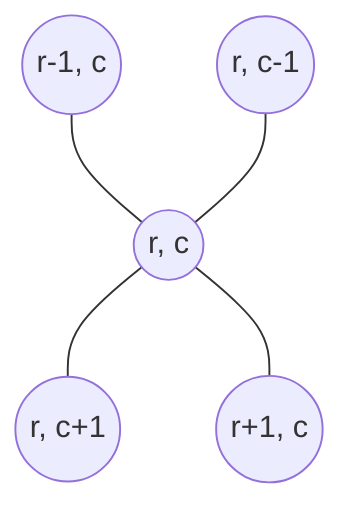

# Grid DFS

A grid of cells is already a graph, and nobody had to hand you one. Take the
usual `list[list[...]]` that a problem calls a board, an image, or a map. Every
cell is a **node**. Every pair of cells that sit side by side is an **edge**. The
whole vocabulary from [graph basics](01_graph_basics.md) applies without changing
a word, so a region of connected land is a connected component and asking whether
water reaches a cell is a reachability question

The one thing that is different is that **the adjacency list is never built**. In
an ordinary graph problem you are given `edges` and you turn it into
`graph[node] = [neighbours]` before you can walk anything. In a grid the
neighbours of `(r, c)` are `(r-1, c)`, `(r+1, c)`, `(r, c-1)`, and `(r, c+1)`, and
that is a fact of arithmetic rather than a fact about this particular input. You
compute the four neighbours on demand and store nothing. A graph whose edges are
implied by the structure of the data instead of listed in it is an **implicit
graph**, and grids are the easiest kind to spot



Those four links are the entire edge set of one node, and there are `R * C` nodes
in an `R`-row, `C`-column grid, so the graph has fewer than `4 * R * C` directed
edge slots no matter what the values in the cells are

If you have ever used the paint bucket in an image editor, you have watched this
run. You click one pixel, and the colour spreads outward through every pixel that
touches it and shares its old colour, stopping wherever the colour changes. That
spread is a depth-first search over an implicit graph, and it is the operation
this whole topic is built on

## Why A Local Test For "New Island" Undercounts

The problem that names this pattern is
[Number of Islands](https://leetcode.com/problems/number-of-islands/): given a
grid of `"1"` for land and `"0"` for water, count how many separate landmasses
there are, where two land cells belong to the same landmass when they touch
horizontally or vertically

The first idea most people have is that you should not need a search at all. Scan
the grid once in reading order, and every time you meet a land cell, ask whether
the cell above it or the cell to its left is also land. If neither is, this cell
is the top-left corner of something new, so add one to the count. Cells that
already have land above or to the left were part of an island you counted earlier

```python
def num_islands_local(grid: list[list[str]]) -> int:
    rows, cols = len(grid), len(grid[0])
    count = 0
    for r in range(rows):
        for c in range(cols):
            if grid[r][c] != "1":
                continue
            up = r > 0 and grid[r - 1][c] == "1"
            left = c > 0 and grid[r][c - 1] == "1"
            if not up and not left:
                count += 1
    return count


assert num_islands_local([["1", "1", "1"]]) == 1
assert num_islands_local([["1", "0", "1"], ["1", "1", "1"]]) == 2
assert num_islands_local([["0"]]) == 0
```

That second assert is the failure, and it is worth reading the grid it describes:

```text
        col 0   col 1   col 2
row 0     1       0       1
row 1     1       1       1
```

This is a single U-shaped island. Every cell is joined to every other through the
bottom row. The local test counts `(0, 0)`, correctly, since it has nothing above
or left of it. Then it reaches `(0, 2)`, sees water to its left and nothing above,
and calls it a second island. It has no way to know that the two arms are joined
three cells away, because the only thing it ever looks at is two adjacent cells

The failure names the fix precisely. Membership in an island is not a property you
can read off a cell and its immediate neighbours, because connection can travel
around a corner and back through an arbitrarily long chain of cells. The only way
to know which cells belong together is to **start at one of them and walk the
entire region**, following the connection as far as it goes

## Reaching A Whole Region From One Cell

That walk is a depth-first search, exactly the shape from
[tree DFS](../../07_trees/notes/02_dfs.md): commit to one neighbour, follow it as
deep as it goes, then back up and try the next one. Python's call stack does the
backing up, so it is a recursive helper again

Two things change compared with a tree. A tree node hands you its children
directly, while a cell's neighbours have to be computed and then checked, because
three of the four may not exist when you are standing on an edge or a corner. And
a tree has no cycles, while a grid is full of them, since stepping right and then
left puts you back where you started. That second difference is what makes a
visited mark mandatory rather than optional

[Flood Fill](https://leetcode.com/problems/flood-fill/) is the walk with nothing
else on top of it. Starting from `(sr, sc)`, recolour every cell reachable through
neighbours that share the starting colour

```python
DIRECTIONS = ((-1, 0), (1, 0), (0, -1), (0, 1))  # up, down, left, right


def flood_fill(image: list[list[int]], sr: int, sc: int, color: int) -> list[list[int]]:
    rows, cols = len(image), len(image[0])
    start = image[sr][sc]
    if start == color:
        return image

    def fill(r: int, c: int) -> None:
        if not (0 <= r < rows and 0 <= c < cols) or image[r][c] != start:
            return
        image[r][c] = color
        for dr, dc in DIRECTIONS:
            fill(r + dr, c + dc)

    fill(sr, sc)
    return image


assert flood_fill([[1, 1, 1], [1, 1, 0], [1, 0, 1]], 1, 1, 2) == [
    [2, 2, 2],
    [2, 2, 0],
    [2, 0, 1],
]
assert flood_fill([[0, 0, 0], [0, 0, 0]], 0, 0, 0) == [[0, 0, 0], [0, 0, 0]]
assert flood_fill([[5]], 0, 0, 9) == [[9]]
```

The `DIRECTIONS` tuple and the guard-first arrangement are the same ones used for
[grid backtracking](../../09_backtracking/notes/04_grid_backtracking.md), and they
are worth restating in this setting because two details decide whether the code
runs at all

**The bounds test comes before the value test, joined by `or` so it
short-circuits.** Writing `image[r][c] != start or not (0 <= r < rows ...)` reads
the same to a human but indexes the grid before it ever reaches the bounds check,
and Python then fails in two different ways depending on which edge you walked
off. Stepping off the bottom or the right gives `r == rows` or `c == cols` and
raises `IndexError`. Stepping off the top or the left gives `-1`, which Python
happily reads as the last row or last column, so the walk silently wraps around
to the far side of the board and corrupts the answer without crashing. The bounds
test first prevents both. There is no base case competing for the first line
here, unlike word search, where the "word is finished" test has to be checked
before bounds

**Every check lives inside the callee, not at the call site.** The recursion fires
four times unconditionally and each child decides for itself whether it is a legal
cell. The alternative, testing the neighbour before recursing into it, is longer
in this problem but becomes necessary when the test compares the child against the
parent, which is what the ocean problem at the end of this topic needs

**The `start == color` guard on line 3 is not a micro-optimisation.** Without it,
recolouring a region to the colour it already has writes `image[r][c] = color`,
which changes nothing, so the cell still equals `start` when its neighbour recurses
back into it and the walk bounces between two cells until the interpreter raises
`RecursionError`. The mark has to actually change the cell, or it is not a mark

## The Mark That Never Comes Off

Now count islands. Scan every cell, and each time you land on unvisited land,
add one to the count and then flood the entire island so that none of its other
cells can ever start a second count. The flood writes `"0"` over the land, which
is why this is usually described as **sinking** the island

```python
def num_islands(grid: list[list[str]]) -> int:
    if not grid or not grid[0]:
        return 0
    rows, cols = len(grid), len(grid[0])

    def sink(r: int, c: int) -> None:
        if not (0 <= r < rows and 0 <= c < cols) or grid[r][c] != "1":
            return
        grid[r][c] = "0"
        for dr, dc in DIRECTIONS:
            sink(r + dr, c + dc)

    islands = 0
    for r in range(rows):
        for c in range(cols):
            if grid[r][c] == "1":
                islands += 1
                sink(r, c)
    return islands


three_islands = [
    ["1", "1", "0", "0", "0"],
    ["1", "1", "0", "0", "0"],
    ["0", "0", "1", "0", "0"],
    ["0", "0", "0", "1", "1"],
]

assert num_islands([["1", "0", "1"], ["1", "1", "1"]]) == 1
assert num_islands([row[:] for row in three_islands]) == 3
assert num_islands([["0"]]) == 0
assert num_islands([]) == 0
```

The U-shaped grid that broke the local test now returns 1, because the search from
`(0, 0)` travels down the left arm, across the bottom row, and up the right arm,
sinking `(0, 2)` on the way, so the outer scan never sees it as land

**The counting happens in the outer loop and the walking happens in the helper**,
and keeping those two jobs apart is what makes this correct. The outer loop asks
"is there any land I have not accounted for yet", and the answer is yes exactly
`islands` times. The helper's only job is to make sure that after it returns, no
cell of that island can answer yes again

**The mark is written into the grid and never restored, and this is the exact
line where grid DFS and grid backtracking part company.** Word search restores the
cell on the way out, because a cell being unusable there is a fact about one path
rather than about the cell. Here it is a fact about the cell: once you know that
`(1, 1)` belongs to island 3, nothing later can change that, so nothing is gained
by making it available again. Adding the restore is not a harmless extra line
either. Putting `grid[r][c] = "1"` after the four recursive calls turns the
U-shaped grid above into an answer of 5, one per land cell, because every cell of
the island is handed back to the outer scan as fresh land

Sinking mutates the caller's grid, which is worth naming out loud since an
interviewer may care:

> "I am going to sink each island by writing water over it as I walk, which uses
> the input grid as my visited set and costs no extra memory. That destroys the
> caller's grid, so if the input has to survive I would keep a separate
> `visited` set of `(row, column)` tuples instead, at the cost of `O(R * C)`
> space"

## Tracing Two Islands On A Three-By-Four Grid

```text
        col 0   col 1   col 2   col 3
row 0     1       1       0       0
row 1     0       1       0       1
row 2     0       0       0       1
```

The outer scan reaches `(0, 0)` first. Each line below is one call to `sink`, with
the step that produced it and what that call did:

```text
cell     arrived by            outcome
(0,0)    outer scan            NEW ISLAND 1, sink it
(-1,0)   up from (0,0)         REJECTED, off the board
(1,0)    down from (0,0)       REJECTED, water
(0,-1)   left from (0,0)       REJECTED, off the board
(0,1)    right from (0,0)      sink it
(-1,1)   up from (0,1)         REJECTED, off the board
(1,1)    down from (0,1)       sink it
(0,1)    up from (1,1)         REJECTED, already sunk
(2,1)    down from (1,1)       REJECTED, water
(1,0)    left from (1,1)       REJECTED, water
(1,2)    right from (1,1)      REJECTED, water
(0,0)    left from (0,1)       REJECTED, already sunk
(0,2)    right from (0,1)      REJECTED, water
(1,3)    outer scan            NEW ISLAND 2, sink it
(0,3)    up from (1,3)         REJECTED, water
(2,3)    down from (1,3)       sink it
(1,3)    up from (2,3)         REJECTED, already sunk
(3,3)    down from (2,3)       REJECTED, off the board
(2,2)    left from (2,3)       REJECTED, water
(2,4)    right from (2,3)      REJECTED, off the board
(1,2)    left from (1,3)       REJECTED, water
(1,4)    right from (1,3)      REJECTED, off the board
```

Twenty-two calls to sink three cells and then two more, which is the normal ratio:
every cell that gets sunk fires four calls of its own, and since a cell can only
be sunk once, exactly five of the twenty-two did any work

Two of the rejections carry the weight. `(0, 1) up from (1, 1)` is the walk trying
to go back to the cell it just came from, and it is turned away only because that
cell was already overwritten. Take the mark out and those two cells recurse into
each other forever. `(0, 0) left from (0, 1)` is the same thing one step later,
which is the cycle that a tree never has and a grid always does

The other rejections are the boundary. Notice that `(3, 3)` and `(2, 4)` are asked
about at all, so a version that indexed the grid before checking bounds would
crash on this input rather than on some rare edge case

## What The Walk Brings Back

Counting islands throws away everything the walk saw. Most problems in this
section want the helper to return something instead, and the return value is
combined across the four neighbours the same way a postorder tree helper combines
its two children

**Size.** [Max Area of Island](https://leetcode.com/problems/max-area-of-island/)
wants the largest island's cell count. Have `area` return `1` for the cell it
sank plus whatever the four neighbours report, and `0` for a call that was
rejected, so a rejected call contributes nothing without needing a special case

```python
def max_area_of_island(grid: list[list[int]]) -> int:
    rows, cols = len(grid), len(grid[0])

    def area(r: int, c: int) -> int:
        if not (0 <= r < rows and 0 <= c < cols) or grid[r][c] != 1:
            return 0
        grid[r][c] = 0
        return 1 + sum(area(r + dr, c + dc) for dr, dc in DIRECTIONS)

    return max(area(r, c) for r in range(rows) for c in range(cols))


assert max_area_of_island([[1, 1, 0], [1, 0, 0], [0, 0, 1]]) == 3
assert max_area_of_island([[0, 0, 0, 0, 0, 0, 0, 0]]) == 0
assert max_area_of_island([[1]]) == 1
```

Calling `area` on every cell rather than only on land is deliberate here, because
a water cell returns `0` immediately and `max` over an all-water grid then answers
`0` instead of raising on an empty sequence

**Boundary length.**
[Island Perimeter](https://leetcode.com/problems/island-perimeter/) counts the
sides of land cells that face water or the outside world. Flip the return value
around: a rejected call now returns `1`, because being rejected is precisely what
"this side is exposed" means, and a land cell returns the sum of its four sides

```python
def island_perimeter(grid: list[list[int]]) -> int:
    rows, cols = len(grid), len(grid[0])

    def edges(r: int, c: int) -> int:
        if not (0 <= r < rows and 0 <= c < cols) or grid[r][c] == 0:
            return 1
        if grid[r][c] == 2:
            return 0
        grid[r][c] = 2
        return sum(edges(r + dr, c + dc) for dr, dc in DIRECTIONS)

    for r in range(rows):
        for c in range(cols):
            if grid[r][c] == 1:
                return edges(r, c)
    return 0


assert island_perimeter([[0, 1, 0, 0], [1, 1, 1, 0], [0, 1, 0, 0], [1, 1, 0, 0]]) == 16
assert island_perimeter([[1]]) == 4
assert island_perimeter([[1, 0]]) == 4
assert island_perimeter([[0]]) == 0
```

This is the one place where the visited mark needs a value of its own. Water must
return `1` and an already-counted land cell must return `0`, so they cannot be the
same symbol, and overwriting land with `0` would make a cell's own neighbour count
its shared side as exposed. Writing `2` keeps the three states apart. The first
land cell found is the only seed needed because the problem guarantees exactly one
island, and returning immediately from inside the loop is what enforces that
assumption rather than silently summing two of them

**A property that must hold everywhere.**
[Count Sub Islands](https://leetcode.com/problems/count-sub-islands/) asks how
many islands of `grid2` sit entirely on top of land in `grid1`. Walk `grid2`
normally and accumulate a boolean that starts as "this cell is land in `grid1`
too" and is combined with the four neighbours' answers

```python
def count_sub_islands(grid1: list[list[int]], grid2: list[list[int]]) -> int:
    rows, cols = len(grid2), len(grid2[0])

    def sink(r: int, c: int) -> bool:
        if not (0 <= r < rows and 0 <= c < cols) or grid2[r][c] != 1:
            return True
        grid2[r][c] = 0
        ok = grid1[r][c] == 1
        for dr, dc in DIRECTIONS:
            ok = sink(r + dr, c + dc) and ok
        return ok

    total = 0
    for r in range(rows):
        for c in range(cols):
            if grid2[r][c] == 1 and sink(r, c):
                total += 1
    return total


g1 = [[1, 1, 1, 0, 0], [0, 1, 1, 1, 1], [0, 0, 0, 0, 0], [1, 0, 0, 0, 0], [1, 1, 0, 1, 1]]
g2 = [[1, 1, 1, 0, 0], [0, 0, 1, 1, 1], [0, 1, 0, 0, 0], [1, 0, 1, 1, 0], [0, 1, 0, 1, 0]]
assert count_sub_islands(g1, g2) == 3
assert count_sub_islands([[0]], [[1]]) == 0
assert count_sub_islands([[1]], [[1]]) == 1
assert count_sub_islands([[0]], [[0]]) == 0
```

A rejected call returns `True`, which looks strange until you read it as "nothing
out here contradicts the claim". Water and the outside of the board are not
evidence against a sub-island, so they must be the identity value for `and`

**The order of `sink(...) and ok` is load-bearing and reversing it is a real
bug.** Python's `and` evaluates its left side first and skips the right side when
the left is falsy, so writing `ok = ok and sink(...)` stops calling `sink` the
moment one cell fails the `grid1` test. The rest of that island is then left
standing in `grid2`, and the outer scan finds it again and counts it as a fresh
island. On the `g1` and `g2` example asserted above, the short-circuiting version
answers 4 where the correct answer is 3. The same trap
kills the obvious-looking `return all(sink(r + dr, c + dc) for dr, dc in DIRECTIONS)`, since `all` short-circuits too

The rule that covers all three is that a grid DFS must always finish sinking the
region, whatever it has already concluded about it. Compute the answer on the way
through, never by leaving early

## Starting From The Border And Working Inward

A family of problems asks about regions that do **not** touch the edge of the
grid: flip the enclosed `"O"` regions, count the land that cannot walk off the
map, count the islands with water all the way around. Attacking those directly
means starting inside and asking "did I escape", which is answerable but harder to
get right than the trick that makes them all easy

Turn the question inside out. What you can identify cheaply is the regions that
**do** touch the border, because you know exactly where to start: seed a DFS from
every cell on all four edges. Whatever survives that sweep is enclosed, by
definition, since a region reachable from the border would have been marked

[Surrounded Regions](https://leetcode.com/problems/surrounded-regions/) is the
clearest case. Rescue every `"O"` connected to the border by marking it `"S"`,
then sweep the grid once turning every surviving `"O"` into `"X"` and every `"S"`
back into `"O"`

```python
def solve(board: list[list[str]]) -> None:
    rows, cols = len(board), len(board[0])

    def rescue(r: int, c: int) -> None:
        if not (0 <= r < rows and 0 <= c < cols) or board[r][c] != "O":
            return
        board[r][c] = "S"
        for dr, dc in DIRECTIONS:
            rescue(r + dr, c + dc)

    for r in range(rows):
        rescue(r, 0)
        rescue(r, cols - 1)
    for c in range(cols):
        rescue(0, c)
        rescue(rows - 1, c)

    for r in range(rows):
        for c in range(cols):
            board[r][c] = "O" if board[r][c] == "S" else "X"


board = [["X", "X", "X", "X"], ["X", "O", "O", "X"], ["X", "X", "O", "X"], ["X", "O", "X", "X"]]
solve(board)
assert board == [
    ["X", "X", "X", "X"],
    ["X", "X", "X", "X"],
    ["X", "X", "X", "X"],
    ["X", "O", "X", "X"],
]
single = [["X"]]
solve(single)
assert single == [["X"]]
all_open = [["O", "O"], ["O", "O"]]
solve(all_open)
assert all_open == [["O", "O"], ["O", "O"]]
```

The third mark is what makes the final sweep a single pass. With only `"O"` and
`"X"` there is no way to tell a rescued cell from a doomed one, so `"S"` is a
temporary third state that the last loop resolves. It never survives the function,
which is why the asserts see only the two original characters

The seeding loops touch each corner twice, once from the row pass and once from
the column pass, and that costs nothing because the second visit finds the cell
already marked and returns immediately

[Number of Enclaves](https://leetcode.com/problems/number-of-enclaves/) is the
same sweep with the arithmetic changed. Sink every land region that reaches the
border, then the answer is however much land is left

```python
def num_enclaves(grid: list[list[int]]) -> int:
    rows, cols = len(grid), len(grid[0])

    def sink(r: int, c: int) -> None:
        if not (0 <= r < rows and 0 <= c < cols) or grid[r][c] != 1:
            return
        grid[r][c] = 0
        for dr, dc in DIRECTIONS:
            sink(r + dr, c + dc)

    for r in range(rows):
        sink(r, 0)
        sink(r, cols - 1)
    for c in range(cols):
        sink(0, c)
        sink(rows - 1, c)
    return sum(sum(row) for row in grid)


assert num_enclaves([[0, 0, 0, 0], [1, 0, 1, 0], [0, 1, 1, 0], [0, 0, 0, 0]]) == 3
assert num_enclaves([[0, 1, 1, 0], [0, 0, 1, 0], [0, 0, 1, 0], [0, 0, 0, 0]]) == 0
assert num_enclaves([[1]]) == 0
assert num_enclaves([[0]]) == 0
```

[Number of Closed Islands](https://leetcode.com/problems/number-of-closed-islands/)
is the one member of the family that wants a **count** of enclosed regions rather
than a total, and counting means you need to know which region each cell came
from, which the border sweep throws away. Here the second shape is better: walk
every region from the inside and let the helper report whether it ever stepped off
the board. Note that `0` is land in this problem and `1` is water

```python
def closed_island(grid: list[list[int]]) -> int:
    rows, cols = len(grid), len(grid[0])

    def sink(r: int, c: int) -> bool:
        if not (0 <= r < rows and 0 <= c < cols):
            return False
        if grid[r][c] != 0:
            return True
        grid[r][c] = 1
        closed = True
        for dr, dc in DIRECTIONS:
            closed = sink(r + dr, c + dc) and closed
        return closed

    total = 0
    for r in range(rows):
        for c in range(cols):
            if grid[r][c] == 0 and sink(r, c):
                total += 1
    return total


two_closed = [
    [1, 1, 1, 1, 1, 1, 1, 0],
    [1, 0, 0, 0, 0, 1, 1, 0],
    [1, 0, 1, 0, 1, 1, 1, 0],
    [1, 0, 0, 0, 0, 1, 0, 1],
    [1, 1, 1, 1, 1, 1, 1, 0],
]

assert closed_island(two_closed) == 2
assert closed_island([[0, 0, 1, 0, 0], [0, 1, 0, 1, 0], [0, 1, 1, 1, 0]]) == 1
assert closed_island([[0]]) == 0
assert closed_island([[1]]) == 0
```

The two rejected cases now return **different** values, and that split is the
whole idea. Walking off the board returns `False`, which poisons the `and` chain
all the way back to the seed, while hitting water returns `True` because water is
what a closed island is supposed to be surrounded by. The same
`sink(...) and closed` ordering from sub-islands applies for the same reason, since
an island that touches the border still has to be fully sunk before the scan moves
on

## Giving Each Island A Number Instead Of Erasing It

[Making a Large Island](https://leetcode.com/problems/making-a-large-island/) asks
for the biggest island you could have after flipping at most one `0` to `1`. The
obvious approach is to try every water cell, flip it, and rerun the island
measurement, but each rerun is a full grid walk, so on an `n` by `n` grid that is
`O(n^4)` and dies on the stated limit of `n = 500`

The reason it is so expensive is that flipping a cell does not change any island
except the ones it touches, and yet the whole grid is re-walked each time. So walk
the grid **once** and keep what you learn. Instead of erasing an island, stamp
every one of its cells with an id, and record that id's size in a dictionary. A
water cell's answer is then `1` plus the sizes of the **distinct** ids around it,
which is a constant-time lookup

```python
def largest_island(grid: list[list[int]]) -> int:
    n = len(grid)
    size: dict[int, int] = {}

    def label(r: int, c: int, island_id: int) -> int:
        if not (0 <= r < n and 0 <= c < n) or grid[r][c] != 1:
            return 0
        grid[r][c] = island_id
        return 1 + sum(label(r + dr, c + dc, island_id) for dr, dc in DIRECTIONS)

    next_id = 2
    for r in range(n):
        for c in range(n):
            if grid[r][c] == 1:
                size[next_id] = label(r, c, next_id)
                next_id += 1

    best = max(size.values(), default=0)
    for r in range(n):
        for c in range(n):
            if grid[r][c] != 0:
                continue
            neighbours = set()
            for dr, dc in DIRECTIONS:
                nr, nc = r + dr, c + dc
                if 0 <= nr < n and 0 <= nc < n and grid[nr][nc] != 0:
                    neighbours.add(grid[nr][nc])
            best = max(best, 1 + sum(size[i] for i in neighbours))
    return best


assert largest_island([[1, 0], [0, 1]]) == 3
assert largest_island([[1, 1], [1, 0]]) == 4
assert largest_island([[1, 1], [1, 1]]) == 4
assert largest_island([[0]]) == 1
```

**Ids start at 2** because `0` and `1` are already taken by water and by unlabelled
land, and reusing either would make `grid[r][c] != 1` in `label` stop recognising
fresh land

**`neighbours` is a set, and using a list here is the standard wrong answer.** A
water cell can touch the same island on two different sides, as in the
`[[1, 1], [1, 0]]` example where the cell at `(1, 1)` has island 2 both above and
to its left. That island has three cells, so a list would add `3` twice and report
`1 + 3 + 3 = 7` for a grid with four cells in it

**`max(size.values(), default=0)` seeds the answer with the best untouched
island**, which is what covers a grid that has no water at all. In that case the
second loop never runs, and without the seed the function would return `0` for a
solid grid of land. The `[[1, 1], [1, 1]]` assert is exactly that case

## When The Grid Is Too Big For The Call Stack

The 1000-frame recursion limit from [graph basics](01_graph_basics.md) is
easier to hit on a grid than on any other input, and it has nothing to do with
whether your logic is right. The recursion goes one frame deep per cell in the
region, so a single island of more than about a thousand cells crashes, and grids
that large are ordinary rather than adversarial. Number of Islands allows a grid
of 300 by 300, and a solid grid of
that size makes the recursive version raise `RecursionError` rather than answer 1

Rewriting the walk with an explicit stack removes the ceiling, since the stack is
an ordinary list on the heap. The structure is the same one from
[iterative tree DFS](../../07_trees/notes/02_dfs.md): pop a cell, push its
eligible neighbours

```python
def num_islands_iterative(grid: list[list[str]]) -> int:
    if not grid or not grid[0]:
        return 0
    rows, cols = len(grid), len(grid[0])
    islands = 0
    for r0 in range(rows):
        for c0 in range(cols):
            if grid[r0][c0] != "1":
                continue
            islands += 1
            grid[r0][c0] = "0"
            stack = [(r0, c0)]
            while stack:
                r, c = stack.pop()
                for dr, dc in DIRECTIONS:
                    nr, nc = r + dr, c + dc
                    if 0 <= nr < rows and 0 <= nc < cols and grid[nr][nc] == "1":
                        grid[nr][nc] = "0"
                        stack.append((nr, nc))
    return islands


assert num_islands_iterative([row[:] for row in three_islands]) == 3
assert num_islands_iterative([["1"] * 300 for _ in range(300)]) == 1
assert num_islands_iterative([["0"]]) == 0
```

**The cell is marked when it is pushed, not when it is popped**, and that is the
one line to get right. If you mark on pop, a cell with two already-stacked
neighbours gets pushed twice, and although the second pop finds it sunk and does
no damage, the stack can grow to hold many copies of the same cells. Marking on
push means each cell enters the stack at most once, which caps the stack at
`O(R * C)` entries

Note that the seed also has to be marked before the loop, on the line above
`stack = [(r0, c0)]`, for the same reason

Either version is acceptable in an interview, and the recursive one is faster to
write and easier to talk through. Saying "this recurses once per cell, so on a
300 by 300 grid I would switch to an explicit stack to stay under Python's
recursion limit" is usually enough, and it is the kind of remark that gets noticed

## Worked Example: [Pacific Atlantic Water Flow](https://leetcode.com/problems/pacific-atlantic-water-flow/)

A rectangular island is described by a grid of cell heights. The Pacific ocean
touches its top edge and its left edge; the Atlantic touches its bottom edge and
its right edge. Rain falling on a cell flows to any neighbouring cell whose height
is less than or equal to the current one, and flows into an ocean from any cell on
that ocean's border. Find every cell from which water can reach both oceans

**Input**: `heights`, a `list[list[int]]` with `m` rows and `n` columns where
`1 <= m, n <= 200` and each height satisfies `0 <= heights[r][c] <= 10^5`. The
grid is always rectangular, so every row has the same length, and a one-by-one
grid is legal

**Output**: a `list[list[int]]` of `[row, column]` pairs, one for each cell that
can drain to both oceans. Each entry is a two-element list rather than a tuple,
the pairs may be returned in any order, and the result is a list of coordinates
rather than of heights. A corner cell always qualifies when it sits on both an
upper or left edge and a lower or right edge, and on a one-by-one grid the single
cell touches all four borders, so the answer is `[[0, 0]]`

**Approach.** The phrase "can reach both oceans" is a reachability question over
an implicit graph, so this is grid DFS. The naive reading is to run a search
outward from every cell, following the downhill rule, and check whether that
search touches both borders. That is correct and it re-walks the island once per
cell, giving `O((m * n)^2)`, which is 1.6 billion cell visits at the stated limit
of 200 by 200

Every one of those searches redoes work the previous ones already did, so run the
searches from the oceans instead. There are only two of them. Water flowing
downhill from a cell into the Pacific is the same relation as climbing uphill from
the Pacific border to that cell, so a DFS that starts on the Pacific edge and
moves only to neighbours that are **at least as high** as the current cell marks
exactly the cells that drain into the Pacific. Do the same from the Atlantic edge,
and the answer is the intersection of the two marked sets

> "I will reverse the flow. Instead of asking where each cell drains to, I will
> start at each ocean's border and climb to every cell that could have drained
> into it, which turns `m * n` searches into two. The comparison flips from
> `neighbour <= current` to `neighbour >= current` because I am walking the edges
> backwards, and the answer is the intersection of the two reachable sets"

1. Create two sets of `(row, column)` tuples, `pacific` and `atlantic`. Each one
   will hold the cells from which water reaches that ocean, and a set is the right
   structure because the final step is an intersection
2. Seed the Pacific search from every cell in column `0` and every cell in row
   `0`, and the Atlantic search from every cell in the last column and every cell
   in the last row. A border cell drains into its ocean directly, so it belongs in
   the set before any climbing starts
3. From a cell, step to a neighbour only when that neighbour is inside the grid,
   is not already in this ocean's set, and is at least as high as the current
   cell. The height comparison is the reason this problem tests the neighbour at
   the call site rather than inside the callee, because the callee alone cannot
   see where it came from
4. Mark on entry by adding the cell to the set as the first statement, which
   guarantees the seed cells are recorded even when they have no eligible
   neighbours, and stops the walk from revisiting a plateau of equal heights
   forever
5. Run the same helper twice with a different set and different seeds. Passing the
   set as a parameter keeps it to one function instead of two near-copies
6. Intersect the two sets with `&` and turn each surviving tuple into a
   `[row, column]` list, which is the return shape the problem asks for

```python
def pacific_atlantic(heights: list[list[int]]) -> list[list[int]]:
    rows, cols = len(heights), len(heights[0])
    pacific: set[tuple[int, int]] = set()
    atlantic: set[tuple[int, int]] = set()

    def climb(r: int, c: int, seen: set[tuple[int, int]]) -> None:
        seen.add((r, c))
        for dr, dc in DIRECTIONS:
            nr, nc = r + dr, c + dc
            if not (0 <= nr < rows and 0 <= nc < cols) or (nr, nc) in seen:
                continue
            if heights[nr][nc] >= heights[r][c]:
                climb(nr, nc, seen)

    for r in range(rows):
        climb(r, 0, pacific)
        climb(r, cols - 1, atlantic)
    for c in range(cols):
        climb(0, c, pacific)
        climb(rows - 1, c, atlantic)

    return [[r, c] for r, c in sorted(pacific & atlantic)]


island = [[1, 2, 2, 3, 5], [3, 2, 3, 4, 4], [2, 4, 5, 3, 1], [6, 7, 1, 4, 5], [5, 1, 1, 2, 4]]
assert pacific_atlantic(island) == [[0, 4], [1, 3], [1, 4], [2, 2], [3, 0], [3, 1], [4, 0]]
assert pacific_atlantic([[1]]) == [[0, 0]]
assert pacific_atlantic([[2, 1], [1, 2]]) == [[0, 0], [0, 1], [1, 0], [1, 1]]
```

The `not in seen` test doing double duty as the visited check is what makes the
plateau case safe. Two neighbouring cells of equal height each satisfy
`>=` in both directions, so without the membership test the two would climb into
each other until the stack ran out. This is the same reason flood fill needed its
`start == color` guard, arriving through a different door

The final `sorted` is only there so the asserts can compare against a fixed list,
since the problem accepts any order and a `set` has none

Take the third assert, the two-by-two grid `[[2, 1], [1, 2]]`. Cell `(0, 1)` holds
a `1` with a `2` to its left and a `2` below it, and it reaches both oceans by
sitting on the top and right borders itself. The interesting rejection is inside
the Pacific climb seeded at `(0, 0)`, which holds `2`. It looks right to `(0, 1)`,
finds height `1`, and `1 >= 2` is false, so that step is discarded and the Pacific
search never reaches `(0, 1)` from the interior. The cell still ends up in the set,
but only because the column loop seeds it directly as a top-row cell, and that is
the distinction between "drains to the ocean through its neighbours" and "is on
the border already"

- **Time Complexity**: `O(m * n)` for an `m` by `n` grid, because each of the two
  searches adds every cell to its set at most once and does `O(1)` work per cell
  for its four neighbour tests, and the seeding loops touch `O(m + n)` cells
- **Space Complexity**: `O(m * n)`, because the two sets hold up to one entry per
  cell each, and the recursion can also reach `m * n` frames deep on a grid where
  every cell is climbable in one long chain

## Time and Space Complexity

Throughout, `R` is the number of rows, `C` the number of columns, and `R * C` the
number of cells, which is the node count of the implicit graph. Every cell has at
most four neighbours, so the edge count is `O(R * C)` as well and the familiar
`O(V + E)` collapses to `O(R * C)`

**Counting or measuring regions with one pass over the grid**

| Approach                                                  | Time                                                                                                                                                 | Space                                                                                                                                                                                                           |
| --------------------------------------------------------- | ---------------------------------------------------------------------------------------------------------------------------------------------------- | --------------------------------------------------------------------------------------------------------------------------------------------------------------------------------------------------------------- |
| Recursive DFS sinking each region as it is found          | `O(R * C)`: the outer scan touches every cell once, and across all the searches each cell is sunk at most once and fires four `O(1)` neighbour calls | `O(R * C)`: the call stack holds one frame per cell of the current region, which is every cell when the grid is one solid island, and nothing else is allocated because the grid is the visited set             |
| Iterative DFS with an explicit stack                      | `O(R * C)`: the same one-visit-per-cell walk, with pushes replacing frames                                                                           | `O(R * C)`: the stack holds each cell at most once given that cells are marked on push, and this version is preferred exactly because heap space is not capped at 1000 the way the interpreter's frame stack is |
| Recursive DFS with a separate `visited` set               | `O(R * C)`: unchanged, since set membership is `O(1)` on average                                                                                     | `O(R * C)`: for the set, on top of the same `O(R * C)` worst-case call stack, which is the price of leaving the caller's grid untouched                                                                         |
| Testing each cell against its up and left neighbours only | `O(R * C)`: one pass, no recursion at all                                                                                                            | `O(1)`: no auxiliary storage, and the reason to reject it is that it is wrong on any island that bends, not that it is slow                                                                                     |

**Making a Large Island on an `n` by `n` grid**

| Approach                                            | Time                                                                                                                         | Space                                                                                                                                                  |
| --------------------------------------------------- | ---------------------------------------------------------------------------------------------------------------------------- | ------------------------------------------------------------------------------------------------------------------------------------------------------ |
| Label every island once, then score each water cell | `O(n^2)`: one labelling pass over all `n^2` cells, then one scoring pass whose per-cell work is four lookups in the size map | `O(n^2)`: the size dictionary holds one entry per island, which is up to `n^2 / 2` islands on a checkerboard, plus the same worst-case recursion depth |
| Flip each water cell and re-measure the islands     | `O(n^4)`: up to `n^2` water cells, each triggering a fresh `O(n^2)` walk of the whole grid                                   | `O(n^2)`: no worse than the fast version, since the cost is repeated work rather than storage                                                          |

**Pacific Atlantic Water Flow on an `m` by `n` grid**

| Approach                                     | Time                                                                                         | Space                                                                                                                                         |
| -------------------------------------------- | -------------------------------------------------------------------------------------------- | --------------------------------------------------------------------------------------------------------------------------------------------- |
| Two climbs inward from the two ocean borders | `O(m * n)`: two searches, each adding every cell to its set at most once                     | `O(m * n)`: two sets of up to `m * n` tuples, plus a recursion depth that reaches `m * n` when the heights ascend along a single snaking path |
| One downhill search from every cell          | `O((m * n)^2)`: each of the `m * n` starting cells can walk the whole island before deciding | `O(m * n)`: one visited set per search, reused or rebuilt, plus the recursion depth                                                           |

## Summary

- A grid is an **implicit graph**, meaning its edges follow from the shape of the
  data rather than being listed in the input. Each cell `(r, c)` is a node and its
  neighbours are `(r-1, c)`, `(r+1, c)`, `(r, c-1)`, and `(r, c+1)`, computed on
  demand from a `DIRECTIONS` tuple, so no adjacency list is ever built
  - Every question the graph module asks translates directly: a landmass is a
    connected component, "can water get here" is reachability, and counting
    islands is counting components
- Deciding whether two cells belong to the same region cannot be done by looking
  at a cell and its immediate neighbours, because two arms of one island can be
  joined by an arbitrarily long path elsewhere in the grid. The U-shaped grid
  `[["1","0","1"],["1","1","1"]]` is the smallest counterexample, and a test
  against the cell above and to the left reports two islands where there is one
  - The consequence is that you must walk the entire region from a single seed,
    which is what a DFS does
- The visited mark in grid DFS is written **once and never restored**, which is
  the opposite of the mark in
  [grid backtracking](../../09_backtracking/notes/04_grid_backtracking.md), where
  the un-choose step puts the cell back
  - There, a cell being unusable is a fact about the current path. Here it is a
    fact about the cell, since once it is known to belong to island 3 nothing
    later can change that
  - Adding the restore does not merely waste time, it produces wrong answers.
    Restoring inside `num_islands` returns 5 on the U-shaped grid instead of 1,
    one count per land cell
- Overwriting the input grid, usually with the water value, is the cheapest
  visited set because it costs no extra memory and the existing value test doubles
  as the visited test. It destroys the caller's data, so say so out loud and offer
  a `set` of `(row, column)` tuples as the alternative when the input must survive
- Guard clauses go inside the helper, with the bounds test first and joined by
  `or` so that Python's short-circuiting stops before the indexing. The reverse
  order raises `IndexError` when the walk steps off the bottom or the right, and
  does something worse off the top or the left, where the `-1` index quietly wraps
  to the far side of the grid instead of failing
  - The exception is a rule that compares a neighbour against the current cell,
    such as the downhill test in Pacific Atlantic, which has to be checked at the
    call site because the callee cannot see where it came from
- The helper's return value is what specialises the walk, and a rejected call's
  return value is the identity element for whatever is being combined
  - Area returns `1 + sum(children)` and a rejected call returns `0`
  - Perimeter returns `sum(children)` and a rejected call returns `1`, because
    being rejected is exactly what an exposed side means, which forces a third
    marker value so that already-counted land can return `0` instead
  - A "holds everywhere" property returns `True` from a rejected call, since
    water and the board's edge are not evidence against the claim
- Never leave a region half-walked. Writing `ok = ok and sink(...)` or
  `all(sink(...) for ...)` short-circuits, leaving the rest of the island unmarked
  for the outer scan to find and count again, which answers 4 instead of 3 on the
  Count Sub Islands example above. Put the recursive call on the left of the
  `and`, or accumulate into a variable
- Problems about enclosed regions are easiest inverted: seed a DFS from every cell
  on the four borders, and whatever the sweep does not reach is enclosed
  - Surrounded Regions rescues border `"O"` cells with a temporary third symbol,
    then resolves the whole grid in one final pass
  - Number of Enclaves sinks border-connected land and sums what is left
  - Number of Closed Islands is the exception that needs per-region counting, so
    it walks from the inside instead and returns `False` from an out-of-bounds
    call and `True` from a water call, letting the `and` chain report whether the
    region escaped
- When a problem asks about the effect of changing the grid, label the components
  instead of erasing them: stamp each island's cells with an id starting at `2`
  and record `size[id]`, so a later question about a cell is a dictionary lookup
  - Making a Large Island scores each water cell as `1` plus the sizes of the
    **distinct** neighbouring ids, and using a list rather than a set double counts
    an island touched on two sides, reporting 7 for `[[1, 1], [1, 0]]`
  - Seed the answer with the largest existing island using
    `max(size.values(), default=0)`, or an all-land grid with no water cell to flip
    returns `0`
- Recursion depth is one frame per cell of the region, and Python's default limit
  is 1000 frames, so a solid 300 by 300 grid raises `RecursionError`. The explicit
  stack version has no such ceiling
  - Mark cells when they are **pushed**, not when they are popped, so a cell with
    two stacked neighbours does not enter the stack twice
- The cost of a grid DFS is `O(R * C)` time, because each cell is entered once and
  does constant work for its four neighbours, and `O(R * C)` auxiliary space in
  the worst case, because a single island covering the whole grid puts every cell
  on the call stack at the same time
  - Quoting `O(R * C)` space and adding "the worst case is one snaking island, not
    a typical one" is the version that survives a follow-up question

## Interview Checklist

Before writing code, make sure you can answer each of these

```text
Is connectivity 4-directional, or do diagonals count as touching too?
Does the bounds test come before any indexing, joined by `or` so it short-circuits?
Am I allowed to mutate the input grid, or do I need a separate visited set?
Is the mark permanent (grid DFS) or restored on the way out (backtracking)?
Does the mark actually change the cell, so the walk cannot bounce back into it?
What does the helper return, and what is the right value for a rejected call?
Do any of my recursive calls sit behind a short-circuiting `and`, `or`, or `all`?
Is this an "enclosed region" question I should invert by seeding from the border?
Do I need to count regions separately, or is a single border sweep enough?
Should I label islands with ids and sizes instead of erasing them?
How big can the grid get, and does one region ever exceed 1000 cells of depth?
```
