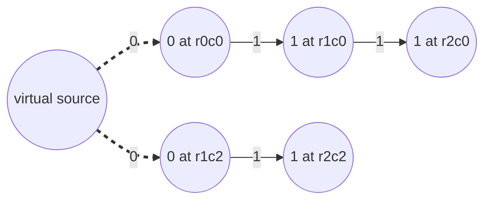

# Grid BFS And Multi-Source BFS

A grid is an implicit graph whose cells are nodes and whose neighbors are edges,
which [grid DFS](02_grid_dfs.md) already established. Every move between two
neighboring cells costs exactly one step, and a graph whose edges all cost the
same is called **unweighted**. That one fact is what this topic is built on,
because when every edge costs the same, the shortest route is simply the route
with the fewest moves, and counting moves is something a traversal can do while
it walks.

**Breadth-first search** on a grid spreads outward from its starting cell like a
drop of ink in water. All the cells one move away are colored, then all the
cells two moves away, then three, and the boundary between colored and uncolored
cells is the **wavefront** (also called the frontier). You met the same expansion
on a tree in [tree BFS](../../07_trees/notes/03_bfs.md), where a level was the set
of nodes at one depth. Here a level is the set of cells at one distance, and the
queue that produces it works identically.

The second idea in this topic has no equivalent in a tree. A tree has one root, so
BFS has one place to start. A grid can have dozens of cells that all count as a
starting point at the same instant, such as every rotten orange in a crate or
every gate in a floor plan, and **multi-source BFS** starts the wave from all of
them simultaneously so that each cell learns its distance to whichever source is
nearest.

## Why Depth-First Search Reaches The Target By The Wrong Route

The obvious first attempt is to reuse the flood fill from the previous topic and
have it count. Walk the grid depth first, carry a step counter down the recursion,
and return that counter when the walk lands on the target.

```python
DIRECTIONS = ((-1, 0), (1, 0), (0, -1), (0, 1))


def dfs_first_arrival(grid: list[list[int]], start: tuple[int, int], goal: tuple[int, int]) -> int:
    rows, cols = len(grid), len(grid[0])
    visited: set[tuple[int, int]] = set()

    def walk(r: int, c: int, steps: int) -> int:
        if not (0 <= r < rows and 0 <= c < cols) or grid[r][c] == 1:
            return -1
        if (r, c) in visited:
            return -1
        if (r, c) == goal:
            return steps
        visited.add((r, c))
        for dr, dc in DIRECTIONS:
            found = walk(r + dr, c + dc, steps + 1)
            if found != -1:
                return found
        return -1

    return walk(start[0], start[1], 0)


open_grid = [[0, 0, 0], [0, 0, 0], [0, 0, 0]]
assert dfs_first_arrival(open_grid, (0, 0), (0, 2)) == 6
assert dfs_first_arrival([[0, 1], [0, 0]], (0, 0), (1, 1)) == 2
assert dfs_first_arrival([[0, 1], [1, 0]], (0, 0), (1, 1)) == -1
assert dfs_first_arrival([[0]], (0, 0), (0, 0)) == 0
```

The first assert is the whole problem. On a completely empty three-by-three grid
the target sits two moves to the right of the start, and this function reports 6.
Nothing is broken, and the path it found is real. It is just the wrong path: the
walk committed to going down first because `(1, 0)` happens to come before
`(0, 1)` in the direction list, so it rode the left column all the way to
`(2, 0)`, stepped right to `(2, 1)`, climbed back up through `(1, 1)` to
`(0, 1)`, and only then stepped right onto the target, six moves later.

Reordering `DIRECTIONS` does not save it, because whichever order you pick, some
grid puts the target on the branch you explore last. The failure is structural.
DFS returns the first path it stumbles onto, and there is no reason for that to be
the shortest one.

The repair that suggests itself is to stop trusting the first arrival. Remove each
cell from `visited` on the way back out, so the walk explores every route rather
than one, and keep the smallest count. That is correct, and it is unusable,
because it enumerates every self-avoiding path across the grid. Counting those
paths from one corner to the other shows the growth directly.

```text
grid size    corner-to-corner paths
  3 x 3                         12
  4 x 4                        184
  5 x 5                      8,512
  6 x 6                  1,262,816
```

Adding one row and one column multiplies the work by roughly a factor of a
hundred, so a fifty-by-fifty grid is out of reach forever. What DFS lacks is not
effort but order. It explores by depth, and the question is asked in terms of
distance, so the traversal has to be reorganized to visit cells in distance order
instead.

## The Wavefront, And Why The First Arrival Is Final

Visit cells strictly in order of their distance from the start. All the cells at
distance 1 are settled before any cell at distance 2 is touched, and the picture
is a set of expanding rings, drawn here on an open grid with the start at the top
left corner.

```text
0  1  2  3        every cell holds its distance from the start
1  2  3  4        cells sharing a number form one wavefront
2  3  4  5        the wave never skips a number, so it never
3  4  5  6        reaches a 4 before every 3 is done
```

A queue produces exactly this order. Pop a cell, and append its unseen neighbors
behind everything already waiting. Since a neighbor of a cell at distance `d` is
at distance `d + 1`, and every cell still queued is at distance `d` or `d + 1`,
the queue is always sorted by distance and pops in non-decreasing distance order.

That gives the property the whole topic rests on. **The first time the search
touches a cell, that cell's distance is final.** Suppose some cell could be
reached in fewer steps by a later route of length `k`. That route's
second-to-last cell is at distance `k - 1`, which is smaller than the distance the
search used, so the search would have popped it earlier and reached the cell
sooner, which contradicts the assumption. No later route can ever improve on a
first arrival, so nothing needs revisiting and no cell is ever written twice.

> "Every move costs one step, so this is an unweighted shortest-path question and
> BFS answers it. The queue pops cells in non-decreasing distance order, so the
> first time I reach a cell I have already reached it by the fewest moves, and I
> can write that distance down and never look at the cell again."

```python
from collections import deque


def shortest_steps(grid: list[list[int]], start: tuple[int, int], goal: tuple[int, int]) -> int:
    rows, cols = len(grid), len(grid[0])
    if grid[start[0]][start[1]] == 1:
        return -1

    queue: deque[tuple[int, int, int]] = deque([(start[0], start[1], 0)])
    visited: set[tuple[int, int]] = {start}

    while queue:
        r, c, steps = queue.popleft()
        if (r, c) == goal:
            return steps
        for dr, dc in DIRECTIONS:
            nr, nc = r + dr, c + dc
            if 0 <= nr < rows and 0 <= nc < cols and grid[nr][nc] == 0 and (nr, nc) not in visited:
                visited.add((nr, nc))
                queue.append((nr, nc, steps + 1))

    return -1


assert shortest_steps([[0, 0, 0], [0, 0, 0], [0, 0, 0]], (0, 0), (0, 2)) == 2
assert shortest_steps([[0, 1], [0, 0]], (0, 0), (1, 1)) == 2
assert shortest_steps([[0, 1], [1, 0]], (0, 0), (1, 1)) == -1
assert shortest_steps([[0]], (0, 0), (0, 0)) == 0
assert shortest_steps([[1]], (0, 0), (0, 0)) == -1
```

The same open grid that made DFS answer 6 now answers 2, and the blocked grid
answers `-1` because the queue empties with the goal never popped. An empty queue
is the only honest signal for "unreachable", so every grid BFS that can fail needs
a `return -1` after the loop rather than inside it.

**`visited.add` sits next to `queue.append`, and never next to `queue.popleft`.**
Marking a cell when it is enqueued rather than when it is popped is the discipline
that keeps the queue clean. A cell has four neighbors, so if it is left unmarked
while it waits, each of those neighbors can enqueue its own copy of it. On an
open fifty-by-fifty grid, marking at enqueue performs 2,500 appends, one per cell,
and its queue never holds more than 50 entries. Marking at pop instead performs
4,901 appends and peaks at 99 entries. That is not a wrong answer, since a
duplicate is harmless as long as the pop side also re-tests whether the cell was
already handled, but it doubles the memory and adds a second guard you now have to
remember. Marking at enqueue removes the second guard entirely.

## Where The Step Count Lives

The counter can ride in three places, and the choice follows from what the problem
asks for rather than from taste.

- **In the queue entry**, as the `(r, c, steps)` tuple above. Use it when the
  answer is a single number attached to one particular cell, such as the length of
  a path to a goal
- **In a parallel grid of distances**, one integer per cell. Use it when the
  problem wants an answer for every cell, which is what
  [01 Matrix](https://leetcode.com/problems/01-matrix/) and
  [Map Of Highest Peak](https://leetcode.com/problems/map-of-highest-peak/) ask
  for. The distance grid then doubles as the visited set, since a cell holding
  its sentinel value is exactly a cell nobody has reached
- **In a counter incremented once per level**, using the frozen `len(queue)` drain
  from [tree BFS](../../07_trees/notes/03_bfs.md). Use it when the answer is a
  number of rounds rather than a property of a cell, which is what
  [Rotting Oranges](https://leetcode.com/problems/rotting-oranges/) asks for, and
  it is the shape to reach for when a round has to finish before you can tell
  whether to keep going

Do not carry two of them at once. Storing a distance in the grid and also pushing
it in the tuple gives two copies of one fact that can disagree after an edit.

## Starting The Wave From Every Source At Once

01 Matrix hands you a grid of zeroes and ones and wants, for every cell, the
number of steps to the nearest zero. The obvious reading is one shortest-path
question per cell, so the obvious solution runs one BFS per cell that holds a one,
stopping as soon as it meets a zero.

That is correct and it is quadratic in the number of cells, because there can be
`R * C` searches and each one can scan most of the grid before it finds a zero.
Counting the pops on a twenty-by-twenty grid whose only zero sits in a corner
gives 114,219 for the per-cell version against 400 for the version below, and
moving to forty-by-forty takes the per-cell version to 1,872,839 while the other
reaches 1,600.

The waste is that all those searches ask overlapping questions and none of them
share an answer. Turn the question around. Instead of asking each `1` where its
nearest `0` is, let every `0` announce itself outward at the same time, and let
each cell keep whichever announcement arrives first. That is legal precisely
because of the first-arrival property, since the wave that reaches a cell first is
by definition the wave that reached it in the fewest steps, and it started at some
source, so its count is the distance to the nearest source.

The formal way to say this out loud is to invent one **virtual source** joined to
every real source by an edge of cost zero. Then the distance from that virtual
node to any cell equals the distance from its nearest real source, and one
ordinary BFS from the virtual node answers everything.



The dashed zero-cost edges are the part you never write down. Seeding the queue
with every source at distance 0 already is that virtual node, expanded one step.

> "Rather than search from each cell to its nearest zero, I will put every zero
> into the queue at distance 0 and run a single BFS. That is the same as one BFS
> from a virtual source wired to all the zeroes with cost-zero edges, so the first
> wave to reach a cell came from its nearest zero."

```python
def update_matrix(mat: list[list[int]]) -> list[list[int]]:
    rows, cols = len(mat), len(mat[0])
    dist: list[list[int]] = [[-1] * cols for _ in range(rows)]
    queue: deque[tuple[int, int]] = deque()

    for r in range(rows):
        for c in range(cols):
            if mat[r][c] == 0:
                dist[r][c] = 0
                queue.append((r, c))

    while queue:
        r, c = queue.popleft()
        for dr, dc in DIRECTIONS:
            nr, nc = r + dr, c + dc
            if 0 <= nr < rows and 0 <= nc < cols and dist[nr][nc] == -1:
                dist[nr][nc] = dist[r][c] + 1
                queue.append((nr, nc))

    return dist


assert update_matrix([[0, 0, 0], [0, 1, 0], [0, 0, 0]]) == [[0, 0, 0], [0, 1, 0], [0, 0, 0]]
assert update_matrix([[0, 0, 0], [0, 1, 0], [1, 1, 1]]) == [[0, 0, 0], [0, 1, 0], [1, 2, 1]]
assert update_matrix([[0, 1, 1, 1, 1]]) == [[0, 1, 2, 3, 4]]
assert update_matrix([[0]]) == [[0]]
```

**The seeding loop is the entire difference from single-source BFS**, and
everything after it is the same loop as before. Three details in it are worth
defending.

- Every source is pushed **before any popping starts**, because a source
  discovered later would be handed a distance by the wave instead of starting one
  of its own
- `dist[nr][nc] == -1` is doing the job of the `visited` set, so `-1` has to be a
  value no real answer can take. Reusing `0` here would mark every source as
  unvisited and re-expand the whole grid
- `dist[r][c] + 1` reads the parent's already-final distance, which is safe only
  because a popped cell can never be improved later

The same seeding turns into four different problems by changing only what counts
as a source and what the caller does with the filled grid.

- [Walls And Gates](https://leetcode.com/problems/walls-and-gates/) seeds every
  gate, treats walls as permanently blocked, and writes the distances into the
  input grid, where the `INF` placeholder plays the role of `-1`
- Map Of Highest Peak seeds every water cell and writes `dist` straight out as the
  heights, since neighboring cells whose distances differ by at most one is
  exactly the height rule the problem asks for
- [As Far From Land As Possible](https://leetcode.com/problems/as-far-from-land-as-possible/)
  seeds every land cell and then returns the **largest** distance in the filled
  grid, which is the water cell the wave reached last. It returns `-1` when the
  grid is all land or all water, because with no source there is no wave, and with
  no non-source cell there is nothing to measure
- Rotting Oranges seeds every rotten orange and counts rounds instead of writing
  cells, which the worked example below builds in full

## Dry Run: Filling A Three-By-Three Grid From Five Sources

The input is the second assert above, a grid with a single `1` in the middle of
the second row and the whole bottom row set to `1`.

```text
mat            dist after seeding      queue after seeding
0 0 0            0  0  0               (0,0) (0,1) (0,2) (1,0) (1,2)
0 1 0            0 -1  0
1 1 1           -1 -1 -1
```

Each line below is one pop, with what it did to each of its in-bounds neighbors.

```text
pop (0,0) d=0   skip (1,0), skip (0,1)                queue = (0,1)(0,2)(1,0)(1,2)
pop (0,1) d=0   SET (1,1)=1, skip (0,0), skip (0,2)   queue = (0,2)(1,0)(1,2)(1,1)
pop (0,2) d=0   skip (1,2), skip (0,1)                queue = (1,0)(1,2)(1,1)
pop (1,0) d=0   skip (0,0), SET (2,0)=1, skip (1,1)   queue = (1,2)(1,1)(2,0)
pop (1,2) d=0   skip (0,2), SET (2,2)=1, skip (1,1)   queue = (1,1)(2,0)(2,2)
pop (1,1) d=1   SET (2,1)=2, skip (0,1)(1,0)(1,2)     queue = (2,0)(2,2)(2,1)
pop (2,0) d=1   skip (1,0), skip (2,1)                queue = (2,2)(2,1)
pop (2,2) d=1   skip (1,2), skip (2,1)                queue = (2,1)
pop (2,1) d=2   skip (1,1), skip (2,0), skip (2,2)    queue = empty
```

The rejection at `pop (1,0)` is the one to look at. Cell `(1,1)` sits directly
right of `(1,0)`, and `(1,0)` is a source at distance 0, so the route through it
would give `(1,1)` a distance of 1. Cell `(1,1)` already holds 1, written moments
earlier by `(0,1)`, so the offer is refused. The refusal costs nothing here
because the two answers happen to tie, and refusing is still correct in general,
since a cell that already holds a value was reached by an earlier or equal wave
and can only be offered something at least as large.

The last three pops are all refusals, and that is the shape of a finished BFS. By
the time the wave reaches distance 2 there is nothing left to claim, so the queue
drains without growing.

Two orderings are visible in the log and both matter. The queue is popped in the
order 0, 0, 0, 0, 0, 1, 1, 1, 2, which never decreases, and that is the property
the correctness argument depends on. The five sources are also popped before any
of their neighbors, which is what makes them behave as one merged source rather
than five competing ones.

## Eight Directions, And Counting Cells Instead Of Moves

[Shortest Path In Binary Matrix](https://leetcode.com/problems/shortest-path-in-binary-matrix/)
changes two things at once, and both are places people lose a submission.

The first is the move set. The path may travel diagonally, so a cell has eight
neighbors rather than four, and the only edit needed is a longer direction tuple.
The wavefront argument does not care how many neighbors a cell has, because it
only ever used the fact that every edge costs the same.

The second is what the answer counts. The problem defines path length as the
number of **cells visited**, not the number of moves made, and those differ by
exactly one. A single-cell grid needs zero moves and has an answer of 1, which is
the assert that catches this.

```python
EIGHT = ((-1, -1), (-1, 0), (-1, 1), (0, -1), (0, 1), (1, -1), (1, 0), (1, 1))


def shortest_path_binary_matrix(grid: list[list[int]]) -> int:
    n = len(grid)
    if grid[0][0] == 1 or grid[n - 1][n - 1] == 1:
        return -1

    queue: deque[tuple[int, int, int]] = deque([(0, 0, 1)])
    grid[0][0] = 1

    while queue:
        r, c, length = queue.popleft()
        if (r, c) == (n - 1, n - 1):
            return length
        for dr, dc in EIGHT:
            nr, nc = r + dr, c + dc
            if 0 <= nr < n and 0 <= nc < n and grid[nr][nc] == 0:
                grid[nr][nc] = 1
                queue.append((nr, nc, length + 1))

    return -1


assert shortest_path_binary_matrix([[0, 1], [1, 0]]) == 2
assert shortest_path_binary_matrix([[0, 0, 0], [1, 1, 0], [1, 1, 0]]) == 4
assert shortest_path_binary_matrix([[1, 0, 0], [1, 1, 0], [1, 1, 0]]) == -1
assert shortest_path_binary_matrix([[0]]) == 1
```

The queue is seeded with a length of 1 rather than 0, which is the whole fix for
the off-by-one. The blocked-endpoint guard is separate and comes first, since a
blocked start would otherwise be enqueued as a legal cell, and a blocked goal
would let the search run to exhaustion before admitting defeat.

Writing `grid[nr][nc] = 1` uses the input as the visited set, turning a walkable
cell into a wall the moment it is claimed. That is the standard grid trick from
[grid DFS](02_grid_dfs.md), and it is worth naming out loud as a mutation of the
caller's data, since some interviewers care and will ask you to keep a separate
set instead.

## Stopping At The First Cell That Answers The Question

[Nearest Exit From Entrance In Maze](https://leetcode.com/problems/nearest-exit-from-entrance-in-maze/)
asks for the fewest steps from an entrance to any empty cell on the border,
excluding the entrance itself even when it sits on the border. There is no single
goal cell here, only a condition, and BFS handles that with no change to its
shape, because the first cell satisfying the condition is reached by the shortest
route for the same reason any first arrival is.

```python
def nearest_exit(maze: list[list[str]], entrance: list[int]) -> int:
    rows, cols = len(maze), len(maze[0])
    start_r, start_c = entrance
    maze[start_r][start_c] = "+"
    queue: deque[tuple[int, int, int]] = deque([(start_r, start_c, 0)])

    while queue:
        r, c, steps = queue.popleft()
        for dr, dc in DIRECTIONS:
            nr, nc = r + dr, c + dc
            if 0 <= nr < rows and 0 <= nc < cols and maze[nr][nc] == ".":
                if nr in (0, rows - 1) or nc in (0, cols - 1):
                    return steps + 1
                maze[nr][nc] = "+"
                queue.append((nr, nc, steps + 1))

    return -1


assert nearest_exit([["+", "+", ".", "+"], [".", ".", ".", "+"], ["+", "+", "+", "."]], [1, 2]) == 1
assert nearest_exit([["+", "+", "+"], [".", ".", "."], ["+", "+", "+"]], [1, 0]) == 2
assert nearest_exit([[".", "+"]], [0, 0]) == -1
```

`maze[start_r][start_c] = "+"` before the loop is how the entrance is excluded.
Walling it off means the border test is never applied to it and the search can
never wander back into it, and both of those are needed. The third assert is the
case that proves it, since a one-by-two maze whose entrance is the only open
border cell has no exit at all and must return `-1` rather than 0.

The border test is applied to the **neighbor**, before that neighbor is
enqueued, which is why the answer is `steps + 1`. Testing the popped cell instead
also works, and then the entrance needs a separate skip, so the version above
trades one branch for one addition.

## Painting One Island Before The Wave Leaves It

[Shortest Bridge](https://leetcode.com/problems/shortest-bridge/) has exactly two
islands and asks for the fewest water cells to flip so they join. The distance
wanted is between two whole regions rather than two cells, and BFS from a single
cell of the first island would count from that cell rather than from the island's
edge.

Multi-source BFS solves it once you notice that an island is just a set of
sources. Find one island with the flood fill from grid DFS, push every one of its
cells into the queue at distance 0, and let the wave leave the island in all
directions at once. The first time the wave touches a cell belonging to the other
island, the number of water cells crossed is the answer.

```python
def shortest_bridge(grid: list[list[int]]) -> int:
    n = len(grid)
    queue: deque[tuple[int, int, int]] = deque()

    def paint(r: int, c: int) -> None:
        if not (0 <= r < n and 0 <= c < n) or grid[r][c] != 1:
            return
        grid[r][c] = 2
        queue.append((r, c, 0))
        for dr, dc in DIRECTIONS:
            paint(r + dr, c + dc)

    start = next((r, c) for r in range(n) for c in range(n) if grid[r][c] == 1)
    paint(*start)

    while queue:
        r, c, steps = queue.popleft()
        for dr, dc in DIRECTIONS:
            nr, nc = r + dr, c + dc
            if 0 <= nr < n and 0 <= nc < n:
                if grid[nr][nc] == 1:
                    return steps
                if grid[nr][nc] == 0:
                    grid[nr][nc] = 2
                    queue.append((nr, nc, steps + 1))

    return -1


assert shortest_bridge([[0, 1], [1, 0]]) == 1
assert shortest_bridge([[0, 1, 0], [0, 0, 0], [0, 0, 1]]) == 2
assert shortest_bridge([[1, 1, 1, 1, 1], [1, 0, 0, 0, 1], [1, 0, 1, 0, 1], [1, 0, 0, 0, 1], [1, 1, 1, 1, 1]]) == 1
```

**`return steps` rather than `steps + 1`** is the line that decides whether this
passes. A cell popped at `steps` is a water cell that has already been flipped, so
`steps` counts the flips made so far, and touching land means no further flip is
needed. Reading the first assert confirms it: the single cell `(0, 1)` is painted
as island one at distance 0, and popping it flips both water cells, `(1, 1)` and
`(0, 0)`, in at distance 1. Popping `(1, 1)` next sees the land at `(1, 0)` and
returns 1, which is the one water cell that had to be filled to reach it.

Painting the island as `2` rather than leaving it as `1` is what makes the
land test unambiguous later, because the wave must be able to tell its own island
from the one it is looking for. This is the pairing worth remembering from this
problem: **DFS to identify a region, BFS to measure a distance**, since each tool
is doing what the other cannot.

## Telling A Real Cycle From The Cell You Came From

[Detect Cycles In 2D Grid](https://leetcode.com/problems/detect-cycles-in-2d-grid/)
asks whether any closed loop of four or more cells sharing one letter exists. The
naive instinct is that meeting an already-visited neighbor proves a loop, and
that is wrong on the smallest possible input, because the cell you just came from
is always visited and is never a loop.

The fix is to carry the parent in the queue entry, skip only that one cell, and
treat any other visited same-letter neighbor as a cycle. A visited neighbor that
is not the parent means the search reached that cell by one route and has now
found a second, and two distinct routes between the same pair of cells close a
loop.

```python
def contains_cycle(grid: list[list[str]]) -> bool:
    rows, cols = len(grid), len(grid[0])
    visited: set[tuple[int, int]] = set()

    for r in range(rows):
        for c in range(cols):
            if (r, c) in visited:
                continue
            value = grid[r][c]
            visited.add((r, c))
            queue: deque[tuple[int, int, int, int]] = deque([(r, c, -1, -1)])
            while queue:
                cr, cc, pr, pc = queue.popleft()
                for dr, dc in DIRECTIONS:
                    nr, nc = cr + dr, cc + dc
                    if not (0 <= nr < rows and 0 <= nc < cols) or grid[nr][nc] != value:
                        continue
                    if (nr, nc) == (pr, pc):
                        continue
                    if (nr, nc) in visited:
                        return True
                    visited.add((nr, nc))
                    queue.append((nr, nc, cr, cc))

    return False


assert contains_cycle([["a", "a", "a", "a"], ["a", "b", "b", "a"], ["a", "b", "b", "a"], ["a", "a", "a", "a"]]) is True
assert contains_cycle([["c", "c", "c", "a"], ["c", "d", "c", "c"], ["c", "c", "e", "c"], ["f", "c", "c", "c"]]) is True
assert contains_cycle([["a", "b", "b"], ["b", "z", "b"], ["b", "b", "a"]]) is False
assert contains_cycle([["a", "a"], ["a", "a"]]) is True
assert contains_cycle([["a"]]) is False
```

**Three things here are different from every other search in this topic.**

- The outer double loop restarts the search at every unvisited cell, because the
  same letter can form several separate regions and a cycle may live in any of
  them. The `visited` set is shared across all those restarts, so no cell is ever
  examined twice and the total work stays linear
- `grid[nr][nc] != value` replaces the usual wall test, since a region here is
  defined by matching letters rather than by a fixed passable value
- The seed entry uses `(-1, -1)` as a parent that no real cell can equal, so the
  starting cell skips nothing

Skipping the single parent cell is enough only because a grid has no repeated
edges between the same pair of cells, so the shortest possible loop is the
four-cell square in the last assert. In a graph that allowed two parallel edges
between two nodes, comparing against the parent cell would wrongly hide a genuine
two-node cycle.

## Worked Example: [Rotting Oranges](https://leetcode.com/problems/rotting-oranges/)

A grid holds empty cells, fresh oranges, and rotten oranges. Every minute, each
rotten orange rots the fresh oranges directly beside it. Report the number of
minutes until nothing fresh is left, or report that it never happens.

**Input**: `grid`, a `list[list[int]]` with `1 <= len(grid)` rows and
`1 <= len(grid[0])` columns, where each cell holds `0` for an empty cell, `1` for
a fresh orange, or `2` for a rotten orange. Rotting spreads only through the four
orthogonal neighbors, never diagonally.

**Output**: a single `int`. It is the number of minutes that pass before the last
fresh orange turns rotten, it is `0` when the grid starts with no fresh oranges at
all, and it is `-1` when at least one fresh orange can never be reached, which
happens when that orange is walled off from every rotten one by empty cells or by
the grid border.

The phrase that identifies the technique is "every minute, each rotten orange
rots its neighbors", because everything rotten acts at the same instant and the
answer is a number of rounds. Running one BFS per rotten orange and taking the
minimum over sources for each fresh cell would work, and it repeats the same
overlapping searches this topic already measured as quadratic. Seeding every
rotten orange at minute 0 gets the same answer in one pass, and here the
per-cell distance is never even needed, since one counter incremented per round is
enough.

> "All the rotten oranges act simultaneously, so this is multi-source BFS with
> every `2` seeded at time 0. One BFS level is one minute, so I will drain the
> queue level by level with a frozen length and count the levels. I also need a
> count of fresh oranges, because an unreachable fresh orange means `-1` and an
> empty queue alone cannot tell me that."

1. Scan the grid once, pushing every rotten cell into the queue and counting the
   fresh ones in `fresh`. The scan does both jobs together because both facts come
   from the same pass, and the fresh count is the only way to distinguish
   "finished" from "stuck" at the end
2. Loop while the queue is non-empty **and** `fresh` is non-zero. The second
   condition is what makes a grid with no fresh oranges return 0 instead of
   counting a wasted round in which the seeded oranges find nothing to rot
3. Inside the loop, freeze `len(queue)` and pop exactly that many cells, which is
   the level drain from tree BFS. Everything appended during those pops belongs to
   the next minute, and the frozen count keeps it out of this one
4. For each popped cell, look at its four neighbors, and for any neighbor that
   is in bounds and holds a `1`, write a `2` into it, decrement `fresh`, and
   append it. Writing the `2` immediately is what marks the cell as claimed, so
   two rotten neighbors in the same minute cannot rot it twice
5. Increment `minutes` once after the level finishes, since one drained level is
   one minute of spreading, and doing it inside the inner loop would count once
   per orange instead
6. When the loop ends, return `-1` if `fresh` is still positive, because a
   remaining fresh orange was never reached by any wave and no further minute will
   change that. Otherwise return `minutes`

```python
def oranges_rotting(grid: list[list[int]]) -> int:
    rows, cols = len(grid), len(grid[0])
    queue: deque[tuple[int, int]] = deque()
    fresh = 0

    for r in range(rows):
        for c in range(cols):
            if grid[r][c] == 2:
                queue.append((r, c))
            elif grid[r][c] == 1:
                fresh += 1

    minutes = 0
    while queue and fresh:
        for _ in range(len(queue)):
            r, c = queue.popleft()
            for dr, dc in DIRECTIONS:
                nr, nc = r + dr, c + dc
                if 0 <= nr < rows and 0 <= nc < cols and grid[nr][nc] == 1:
                    grid[nr][nc] = 2
                    fresh -= 1
                    queue.append((nr, nc))
        minutes += 1

    return -1 if fresh else minutes


assert oranges_rotting([[2, 1, 1], [1, 1, 0], [0, 1, 1]]) == 4
assert oranges_rotting([[2, 1, 1], [0, 1, 1], [1, 0, 1]]) == -1
assert oranges_rotting([[0, 2]]) == 0
assert oranges_rotting([[0]]) == 0
assert oranges_rotting([[1]]) == -1
```

The first example traces one minute per line, listing which cells rotted and which
neighbor offers were refused.

```text
seed      queue = (0,0)                    fresh = 6
minute 1  rots (1,0) and (0,1)             fresh = 4   nothing refused
minute 2  rots (1,1) and (0,2)             fresh = 2   REFUSED (1,1) a second
                                                       time, (2,0) empty, (0,0)
                                                       already rotten
minute 3  rots (2,1)                       fresh = 1   REFUSED (1,2) empty twice
minute 4  rots (2,2)                       fresh = 0   REFUSED (2,0) empty
answer 4
```

Minute 2 contains the refusal that matters. Cell `(1,0)` rots `(1,1)`, and moments
later in the same minute `(0,1)` looks down at `(1,1)` and finds a `2` there
rather than a `1`, so it does nothing. Without that check, `fresh` would be
decremented twice for one orange and the count would fall below zero, which turns
a `-1` grid into a wrong positive answer.

The refused empty cells are the reason the `-1` case exists at all. Cell `(2,0)`
holds a `0` and blocks the wave, and in the second assert that same blocking
pattern isolates the orange at `(2, 0)` so the queue empties with `fresh` still
equal to 1.

- **Time Complexity:** `O(R * C)` for a grid of `R` rows and `C` columns, because
  the initial scan touches every cell once, and each cell is written to `2` at most
  once and therefore enqueued and popped at most once, with four neighbor checks
  per pop
- **Space Complexity:** `O(R * C)`, because the grid is mutated in place and the
  only extra structure is the queue, which in the worst case starts with every
  cell already rotten and so holds all `R * C` of them

## Time and Space Complexity

Throughout, `R` is the number of rows and `C` the number of columns, so the grid
has `R * C` cells, and each cell has at most four neighbors, or eight when
diagonal moves are allowed.

**Shortest distance on an unweighted grid**

| Approach                                       | Time                                                                                                                                                                                              | Space                                                                                                                                                                                   |
| ---------------------------------------------- | ------------------------------------------------------------------------------------------------------------------------------------------------------------------------------------------------- | --------------------------------------------------------------------------------------------------------------------------------------------------------------------------------------- |
| BFS, marking visited at enqueue                | `O(R * C)`: each cell enters the queue at most once, and popping it does a fixed four or eight neighbor checks, so the work is a constant per cell                                                | `O(R * C)`: the visited set or distance grid stores one entry per cell, and the queue holds at most one wavefront plus the part of the next one already built                           |
| BFS, marking visited at pop                    | `O(R * C)`: the same class, since each cell is still expanded once provided the pop side re-tests it, but every constant in it is larger                                                          | `O(R * C)`: the same class with roughly double the constant, measured as 4,901 appends peaking at 99 queued entries on an open fifty-by-fifty grid, against 2,500 appends peaking at 50 |
| DFS returning its first arrival                | `O(R * C)`: it visits each cell once, and the cost is not the problem                                                                                                                             | `O(R * C)`: the recursion can be one long snake through every cell, and the answer it returns is simply not the shortest path                                                           |
| DFS exploring every path by un-marking on exit | `O(3^(R * C))` in the rough: every cell branches into up to three continuations, and the measured corner-to-corner path count rises from 12 on a three-by-three grid to 1,262,816 on a six-by-six | `O(R * C)`: only one path is live at a time, so the space is fine and the time is fatal                                                                                                 |

The single-source queue is smaller than the bound suggests. The cells at a fixed
distance from one start lie along an anti-diagonal, so the wavefront is `O(R + C)`
wide, which the fifty-by-fifty measurement above shows as a peak of 50. The
`O(R * C)` figure is the honest worst case because a multi-source seed can hold
every cell at once.

**Distance from every cell to its nearest source**

| Approach                    | Time                                                                                                                                                                               | Space                                                                                                                            |
| --------------------------- | ---------------------------------------------------------------------------------------------------------------------------------------------------------------------------------- | -------------------------------------------------------------------------------------------------------------------------------- |
| Multi-source BFS            | `O(R * C)`: the seeding scan is one pass, and the wave then assigns each remaining cell exactly once                                                                               | `O(R * C)`: the distance grid, plus a queue that begins holding every source and never exceeds the cell count                    |
| One BFS per non-source cell | `O((R * C)²)`: up to `R * C` searches, each scanning up to `R * C` cells before it meets a source, measured as 114,219 pops against 400 on a twenty-by-twenty grid with one source | `O(R * C)`: only one search runs at a time, so the peak is a single visited set, which is why the cost shows up entirely in time |

**The variants in this topic**

| Problem                       | Time                                                                                                                                           | Space                                                                                                                                           |
| ----------------------------- | ---------------------------------------------------------------------------------------------------------------------------------------------- | ----------------------------------------------------------------------------------------------------------------------------------------------- |
| `shortest_path_binary_matrix` | `O(n²)` on an `n`-by-`n` grid: one visit per cell with eight neighbor checks instead of four, which changes the constant and not the class     | `O(n²)`: the grid is reused as the visited set, so the queue is the only extra structure and it holds at most a wavefront                       |
| `nearest_exit`                | `O(R * C)`: the search stops at the first border cell it reaches, and in the worst case that is after visiting the whole maze                  | `O(R * C)`: the maze is written in place, and the queue carries `(row, col, steps)` triples                                                     |
| `shortest_bridge`             | `O(n²)` on an `n`-by-`n` grid: the flood fill visits one island once and the BFS visits every remaining cell at most once                      | `O(n²)`: the recursion in `paint` can be as deep as the island is large, and the queue holds the island plus a wavefront                        |
| `contains_cycle`              | `O(R * C)`: the shared `visited` set means the restarts never re-examine a cell, so every cell is popped once no matter how many regions exist | `O(R * C)`: the visited set has one entry per cell, and each queue entry carries its parent, which is a constant factor rather than a new class |

## Summary

- A grid is an unweighted graph, meaning every move between neighboring cells
  costs the same one step, and that is the only reason **breadth-first search**
  answers shortest-path questions on it. The search expands in **wavefronts**, so
  every cell at distance `d` is settled before any cell at distance `d + 1` is
  touched
  - Reach for it whenever a problem says shortest, fewest, nearest, minimum
    number of moves, or counts rounds of something spreading
  - Reach for [DFS](02_grid_dfs.md) instead when the question is about a region
    rather than a distance, such as counting islands or measuring an area
- Depth-first search finds *a* path and almost never the shortest one, because it
  returns the first route it stumbles onto, which depends only on the order of the
  direction list. On an empty three-by-three grid it reports 6 for a target that
  is 2 moves away
  - Making DFS correct means exploring every route by un-marking cells on the way
    out, which enumerates self-avoiding paths and rises from 12 of them on a
    three-by-three grid to over a million on a six-by-six
- The first time BFS touches a cell, that cell's distance is final, because the
  queue pops in non-decreasing distance order and any shorter route would have had
  its second-to-last cell popped earlier. Nothing is ever revisited or rewritten
- Mark a cell visited at the moment it is **enqueued**, never when it is popped,
  since a cell left unmarked while it waits can be enqueued once per neighbor
  - This is not a wrong answer as long as the pop side also re-tests the cell, but
    it roughly doubles both the number of appends and the peak queue size, and it
    costs you a second guard to remember
- The step count can live in the queue entry as `(r, c, steps)`, in a parallel
  distance grid, or in a counter bumped once per drained level. Choose by what the
  problem returns, which is one number for one cell, a number for every cell, or a
  number of rounds
  - A distance grid doubles as the visited set when its sentinel value is one no
    real distance can take, which is why `-1` works and `0` does not
- **Multi-source BFS** seeds the queue with every source at distance 0 before any
  popping starts, and each cell then keeps the first wave that reaches it, which
  by the first-arrival property came from the nearest source
  - The justification to say out loud is a **virtual source** joined to every real
    source by cost-zero edges, which makes it one ordinary BFS from one node
  - Searching separately from each cell is the version to reject, since it is
    quadratic in the cell count and measures as 114,219 pops against 400 on a
    twenty-by-twenty grid with a single source
  - The sources are gates in Walls And Gates, zeroes in 01 Matrix, water in Map Of
    Highest Peak, land in As Far From Land As Possible, and rotten oranges in
    Rotting Oranges, and the loop is identical in all five
- Two edits cover most disguises of the template. Extending the direction tuple
  from four entries to eight allows diagonal movement and changes nothing else,
  and starting the counter at 1 instead of 0 answers problems that count cells
  visited rather than moves made
- An unreachable answer has to be detected after the queue empties, and the signal
  depends on the problem. Shortest Path In Binary Matrix returns `-1` when the goal
  was never popped, Rotting Oranges returns `-1` when its fresh counter is still
  positive, and As Far From Land As Possible returns `-1` when the grid has no land
  or no water at all
  - A counter such as `fresh` is worth keeping precisely because an empty queue on
    its own cannot distinguish "everything is done" from "the rest is walled off"
- Distance between two whole regions is multi-source BFS with a flood fill in
  front of it, which is what **Shortest Bridge** needs. Paint one island with DFS
  and push all of its cells at distance 0, then return `steps` and not `steps + 1`
  when the wave first touches the other island, because the popped cell is a water
  cell already counted
- Grid cycle detection carries the parent cell in each queue entry and skips only
  that one cell, so any other visited same-letter neighbor proves two distinct
  routes to one cell and therefore a loop
  - The outer restart loop shares one `visited` set across every region, which is
    what keeps the whole scan linear rather than quadratic
- Every technique in this topic costs `O(R * C)` time, because each cell is
  enqueued at most once and each pop does a constant number of neighbor checks
  - Space is `O(R * C)` for the visited set or distance grid. The queue itself is
    only `O(R + C)` for a single source, since cells at one distance lie on an
    anti-diagonal, but a multi-source seed can hold every cell at once

## Interview Checklist

Before writing code, make sure you can answer each of these

```text
Does the question ask for a shortest, fewest, nearest, or minimum number of moves?
Does every move cost the same, so plain BFS is enough rather than a weighted search?
Is there one source, or does everything of some kind start at distance 0 at once?
Am I seeding every source before the first pop, not discovering sources mid-wave?
Am I marking visited at enqueue, so no cell can be queued twice by two neighbors?
Where does the step count live: the queue entry, a distance grid, or a level counter?
If it is a distance grid, is my sentinel a value no real distance can equal?
Is the answer counting moves or cells, and does my seed start at 0 or at 1?
Is movement four-directional or eight-directional in this problem?
What does unreachable look like, and which counter or empty queue tells me?
Am I mutating the caller's grid as my visited marker, and have I said so out loud?
Can I state why the first arrival at a cell is already the shortest one?
```
