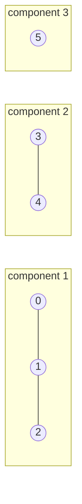
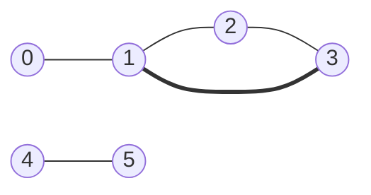
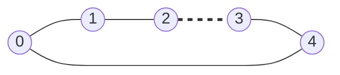
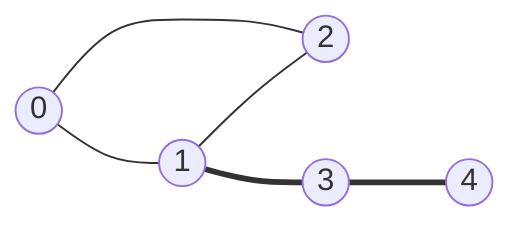
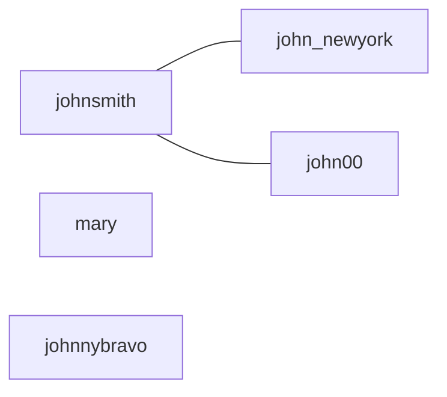

# Components, Cycles, And Bipartite Graphs

Reachability asks a question about one starting point, which is whether some
target can be reached from it. The three questions in this topic are questions
about the **shape of the whole graph** instead, and none of them names a start
node at all

A **connected component** is a maximal group of nodes in which every node can
reach every other one. Maximal is the word doing the work, since it means the
group cannot be extended: no node outside the component has an edge into it. A
graph is not one object so much as a pile of components that happen to be stored
in the same adjacency list, and "how many pieces is this thing in" is a question
you can only answer by touching every node

A **cycle** is a path that leaves a node and returns to it without reusing an
edge. A graph with no cycle anywhere is a **forest**, and a forest that is also
connected, meaning it has exactly one component, is a **tree**. That is where the
familiar edge count comes from: a tree over `V` nodes has exactly `V - 1` edges,
because every node except the one you started from is entered by exactly one edge
of the traversal

A graph is **bipartite** when its nodes can be split into two groups such that
every edge runs between the groups and no edge stays inside one. The same
statement in the form you will code is **2-coloring**, where you paint every node
one of two colors and no edge is allowed to join two nodes of the same color



Node 5 has no edges at all, and it is still a component, which is the case a
solution that only traverses from node 0 silently loses

All three questions come out of the same walk, and the walk is one you already
know. An outer loop runs over every node so nothing is missed, a traversal starts
from each node the outer loop finds unvisited, and each node carries one extra
piece of state. That state is the entire difference between the three problems. A
bare visited flag counts components, visited plus the node you arrived from finds
cycles, and a color in place of the flag tests bipartiteness

## Counting The Pieces A Graph Breaks Into

The definition of a component suggests an algorithm directly. Run a full
traversal from node 0 and collect everything it reaches, then run one from node 1
and collect that, and so on for every node, then count how many distinct
collections you ended up with

That is correct and it is wasteful in a specific way. Every node in the same
component produces the identical set, so a component of size 500 gets discovered
500 times, and you then need set-of-sets bookkeeping to notice they were the same
answer. For `V` nodes and `E` edges each traversal is `O(V + E)`, so the whole
thing is `O(V * (V + E))`, and the deduplication needs `O(V²)` space in the worst
case because you may be storing `V` reachable sets

The waste points straight at the fix. If a node has already been reached by an
earlier traversal, it is already inside a component you have counted, so there is
nothing to learn by starting again from it. Share **one** `visited` array across
the outer loop rather than resetting it per start, and the answer becomes the
number of times the outer loop actually had to start a traversal

```python
def count_components(n: int, edges: list[list[int]]) -> int:
    graph: list[list[int]] = [[] for _ in range(n)]
    for a, b in edges:
        graph[a].append(b)
        graph[b].append(a)

    visited = [False] * n
    components = 0
    for start in range(n):
        if visited[start]:
            continue
        components += 1
        visited[start] = True
        stack = [start]
        while stack:
            node = stack.pop()
            for nxt in graph[node]:
                if not visited[nxt]:
                    visited[nxt] = True
                    stack.append(nxt)
    return components


assert count_components(5, [[0, 1], [1, 2], [3, 4]]) == 2
assert count_components(5, [[0, 1], [1, 2], [2, 3], [3, 4]]) == 1
assert count_components(3, []) == 3
assert count_components(1, []) == 1
```

**The two lines that decide whether this is right**:

- `visited` is created once, outside the `for start` loop. Moving it inside gives
  every node its own fresh traversal and returns `V` instead of the component
  count, and the damage is quiet because the code still runs and still returns a
  plausible number
- `components += 1` sits next to the `continue` guard rather than inside the
  traversal, because a component is counted when a traversal **begins**, not once
  per node it visits

The traversal itself is an explicit stack rather than recursion, since a
component can be a chain of `10^5` nodes and Python's default limit is 1000
frames, which
[the tree DFS topic](../../07_trees/notes/02_dfs.md) covers. A `deque` used as a
queue would work identically here, because nothing in the question depends on the
order the nodes come out

*Number of Provinces* is the same function with the input in matrix form. There
is no edge list to convert, since `is_connected[i][j] == 1` **is** the edge, so
the neighbor loop becomes a scan over every column:

```python
def find_circle_num(is_connected: list[list[int]]) -> int:
    n = len(is_connected)
    visited = [False] * n
    provinces = 0
    for start in range(n):
        if visited[start]:
            continue
        provinces += 1
        visited[start] = True
        stack = [start]
        while stack:
            node = stack.pop()
            for nxt in range(n):
                if is_connected[node][nxt] and not visited[nxt]:
                    visited[nxt] = True
                    stack.append(nxt)
    return provinces


assert find_circle_num([[1, 1, 0], [1, 1, 0], [0, 0, 1]]) == 2
assert find_circle_num([[1, 0, 0], [0, 1, 0], [0, 0, 1]]) == 3
assert find_circle_num([[1]]) == 1
```

That inner loop costs `O(V)` per node whether or not the neighbors exist, so the
matrix version is `O(V²)` rather than `O(V + E)`. Say that out loud when you take
a matrix input, because it is the one place the representation, and not the
algorithm, sets the bound

> "I will keep one visited array outside the loop over start nodes, so each node
> is explored exactly once no matter which component it lands in, and I will
> increment the counter only when the loop finds a node it has not seen. That
> makes it `O(V + E)` rather than one traversal per node."

## Adding Bricks Back Instead Of Knocking Them Down

*Bricks Falling When Hit* is a components problem with the arrow of time
reversed, and it is worth seeing because the trick generalizes. Bricks are stable
when they connect to the top row of the grid, each hit erases one brick, and you
report how many bricks fall as a result of each hit

Erasing a brick can split one component into two, and there is no cheap way to
split a component, since finding out what is left connected means re-running the
traversal. Adding a brick can only ever **join** components, which is cheap.
Therefore, apply all the hits first, find the bricks still hanging from the top
row, and then restore the hit bricks in reverse order. Restoring a brick that
does not touch the stable set changes nothing and answers 0 for that hit.
Restoring one that does touch it stabilizes a whole region, and the size of that
region, minus the restored brick itself, is the answer for that hit

The reverse direction is what makes the cost acceptable. Going forward a brick
can become unstable at any hit, but going backward a brick that becomes stable
stays stable for the rest of the run, so each cell is added to the stable set at
most once and the traversal work across every hit totals `O(rows * cols)`. The
same reverse-time reasoning reappears with [union-find](../../17_advanced/notes/01_union_find.md),
which is the structure normally used to implement it

## Why "I Have Seen This Node Before" Is Not Yet A Cycle

For cycles the tempting rule is that if a traversal reaches a node it has already
visited, the graph has a cycle. On a directed graph that rule is wrong for one
reason and on an undirected graph it is wrong for a different one, and the
undirected case comes first because it is the one the ladder leans on

Every undirected edge is stored twice, once in each endpoint's neighbor list, so
walking from `0` to `1` leaves `0` sitting in `1`'s list. The traversal
immediately looks at `0`, finds it visited, and reports a cycle on a graph that is
a single edge. The false alarm is always the same edge, namely the one you just
walked along, so pass the node you came from and skip exactly that neighbor

```python
def has_cycle_undirected(n: int, edges: list[list[int]]) -> bool:
    graph: list[list[int]] = [[] for _ in range(n)]
    for a, b in edges:
        graph[a].append(b)
        graph[b].append(a)

    visited = [False] * n

    def visit(node: int, parent: int) -> bool:
        visited[node] = True
        for nxt in graph[node]:
            if nxt == parent:
                continue
            if visited[nxt]:
                return True
            if visit(nxt, node):
                return True
        return False

    return any(not visited[node] and visit(node, -1) for node in range(n))


assert has_cycle_undirected(3, [[0, 1], [1, 2], [2, 0]]) is True
assert has_cycle_undirected(4, [[0, 1], [1, 2], [1, 3]]) is False
assert has_cycle_undirected(6, [[0, 1], [1, 2], [2, 3], [3, 1], [4, 5]]) is True
assert has_cycle_undirected(3, []) is False
```

**Three details worth defending out loud**:

- `parent` is a node, not an edge, and skipping it is only safe when the graph
  has no repeated edge between the same pair. Two parallel edges between `0` and
  `1` genuinely are a cycle, and this code calls them a tree, so if the problem
  allows duplicates you must skip the specific edge you arrived on rather than
  the neighbor
- The root call passes `-1`, a value no node can equal, so the start node skips
  nothing
- The outer `any(...)` runs the same start-from-every-unvisited-node loop as the
  component counter, because a cycle can live in a component that node `0` never
  reaches, and `not visited[node]` is evaluated before `visit` is called, so
  short-circuiting never re-explores anything

Recursion is the natural shape here rather than an explicit stack, because the
parent has to travel with the node and the recursive call carries it as an
argument for free

### Tracing The Parent Skip On Six Nodes



Nodes 1, 2 and 3 form a triangle, node 0 hangs off it, and nodes 4 and 5 sit in a
separate component. The highlighted edge is the one that closes the cycle:

```text
outer: node 0 unvisited, start
visit(0, parent=-1)   mark 0
  nbr 1 unvisited -> recurse
  visit(1, parent=0)  mark 1
    nbr 0 == parent -> SKIP, this is the edge we arrived on
    nbr 2 unvisited -> recurse
    visit(2, parent=1)  mark 2
      nbr 1 == parent -> SKIP
      nbr 3 unvisited -> recurse
      visit(3, parent=2)  mark 3
        nbr 2 == parent -> SKIP
        nbr 1 visited, not parent -> CYCLE
```

The three skipped neighbors are the whole point of the trace. Each one is a
visited node sitting in the current node's list, and each one would have been
reported as a cycle by the naive rule, on a graph where the first two of them
came from a plain path. The fourth encounter is different in a way the code can
see, because node 1 is visited and is not the node we arrived from, so there are
two distinct routes from 1 to 3 and that is a cycle by definition

Notice also that the outer loop never got to nodes 4 and 5. The function returned
`True` at the first cycle it found, and had the triangle not been there, the loop
would have resumed at node 4 and started a fresh traversal, which is the same
disconnected-component guard as before

### Trees And The One Extra Edge

Two problems in the ladder are this test wearing a costume

*Graph Valid Tree* asks whether the graph is connected and acyclic. Both halves
can be replaced by counting, since a connected graph with `V` nodes and exactly
`V - 1` edges cannot contain a cycle. Any cycle would need an extra edge beyond
the `V - 1` the traversal uses, so checking the edge count and the component count
is enough and no cycle logic is needed:

```python
def valid_tree(n: int, edges: list[list[int]]) -> bool:
    if len(edges) != n - 1:
        return False
    return count_components(n, edges) == 1


assert valid_tree(5, [[0, 1], [0, 2], [0, 3], [1, 4]]) is True
assert valid_tree(5, [[0, 1], [1, 2], [2, 3], [1, 3], [1, 4]]) is False
assert valid_tree(4, [[0, 1], [2, 3]]) is False
assert valid_tree(1, []) is True
```

The `4, [[0, 1], [2, 3]]` case is the one that catches a solution that only
checks for cycles, since that graph is acyclic and is still not a tree because it
is in two pieces

*Redundant Connection* gives you a tree plus one extra edge and asks which edge to
remove. The extra edge is exactly the one that arrives when both of its endpoints
are already in the same component, so add the edges one at a time and test
reachability before each insertion:

```python
from collections import defaultdict


def find_redundant_connection(edges: list[list[int]]) -> list[int]:
    graph: dict[int, list[int]] = defaultdict(list)

    def connected(source: int, target: int) -> bool:
        seen = {source}
        stack = [source]
        while stack:
            node = stack.pop()
            if node == target:
                return True
            for nxt in graph[node]:
                if nxt not in seen:
                    seen.add(nxt)
                    stack.append(nxt)
        return False

    for a, b in edges:
        if connected(a, b):
            return [a, b]
        graph[a].append(b)
        graph[b].append(a)
    return []


assert find_redundant_connection([[1, 2], [1, 3], [2, 3]]) == [2, 3]
assert find_redundant_connection([[1, 2], [2, 3], [3, 4], [1, 4], [1, 5]]) == [1, 4]
assert find_redundant_connection([[1, 2], [2, 1]]) == [2, 1]
```

The reachability check runs before the edge is added, which is what lets it mean
"were these two already connected without this edge". Adding first and then
searching would find a path through the new edge itself and report every edge as
redundant. The final `return []` is unreachable given the problem's promise that
one such edge exists, and it is there so the function has a return value on every
path. Running one traversal per edge makes this `O(V²)` for a graph whose edge
count equals its node count, which is fine at the sizes this problem uses and is
the bound you should volunteer, along with the fact that
[union-find](../../17_advanced/notes/01_union_find.md) answers the same question
in near-constant time per edge

## The Parent Trick Is Wrong The Moment Edges Have Arrows

Carry the parent skip into a directed graph and it breaks in both directions,
which is why directed cycle detection is a separate piece of code rather than a
tweak

Consider the edges `0 -> 1`, `0 -> 2` and `1 -> 2`. There is no directed cycle,
because no walk returns to where it started, and yet node 2 gets reached twice.
The plain "already visited" rule reports a cycle that is not there. The parent
skip does not rescue it either, since 2 is reached from 1 the second time and its
parent on that visit is 1, not 0

What distinguishes a real directed cycle is that you come back to a node that is
still **open**, meaning the recursive call that entered it has not returned yet,
so it is an ancestor of the current node on the current path. A node that was
fully explored and returned is finished, and reaching it again is just a second
route into a settled region. Three states rather than a boolean capture that:

```python
def has_cycle_directed(n: int, edges: list[list[int]]) -> bool:
    graph: list[list[int]] = [[] for _ in range(n)]
    for a, b in edges:
        graph[a].append(b)

    WHITE, GRAY, BLACK = 0, 1, 2
    color = [WHITE] * n

    def visit(node: int) -> bool:
        color[node] = GRAY
        for nxt in graph[node]:
            if color[nxt] == GRAY:
                return True
            if color[nxt] == WHITE and visit(nxt):
                return True
        color[node] = BLACK
        return False

    return any(color[node] == WHITE and visit(node) for node in range(n))


assert has_cycle_directed(3, [[0, 1], [0, 2], [1, 2]]) is False
assert has_cycle_directed(2, [[0, 1], [1, 0]]) is True
assert has_cycle_directed(4, [[0, 1], [1, 2], [2, 3], [3, 1]]) is True
assert has_cycle_directed(1, [[0, 0]]) is True
assert has_cycle_directed(3, []) is False
```

`WHITE` means never touched, `GRAY` means on the current recursion path, and
`BLACK` means finished. The assignment `color[node] = BLACK` runs after the loop
over neighbors, so a node stops being gray at exactly the moment it stops being
an ancestor. Deleting that line turns the function into the naive already-visited
rule, and it would then answer `True` for the first assert

The undirected version needs the parent because each edge appears twice, and the
directed version needs three colors because each edge appears once but a node can
be re-entered legitimately. Those are different bugs with different fixes, and
mixing them up is the standard way this gets written wrong under time pressure.
Kahn's algorithm reaches the same conclusion by counting in-degrees instead, and
that is the subject of
[topological sort](05_topological_sort.md)

## Two Colors, And The Edge That Refuses Both

Bipartite is a yes-or-no question about the whole graph, and the brute force is to
try every assignment of two colors to `V` nodes, which is `2^V` assignments. That
is unusable, and more importantly it is doing work that is not needed, because
after you color the first node of a component **every other color in that
component is forced**. A node adjacent to a red node has to be blue, its
neighbors have to be red, and so on outward. There is no choice left to search
over

So do not search. Color the start node arbitrarily, then propagate: every neighbor
of a colored node takes the opposite color. Only two things can happen when you
look at an edge. Either the far end is uncolored, in which case you color it and
continue, or it already has a color, in which case that color is either the
opposite one, which is consistent and needs no action, or the same one, which is a
contradiction that no other coloring could have avoided

```python
from collections import deque


def is_bipartite(graph: list[list[int]]) -> bool:
    color = [0] * len(graph)
    for start in range(len(graph)):
        if color[start] != 0:
            continue
        color[start] = 1
        queue = deque([start])
        while queue:
            node = queue.popleft()
            for nxt in graph[node]:
                if color[nxt] == color[node]:
                    return False
                if color[nxt] == 0:
                    color[nxt] = -color[node]
                    queue.append(nxt)
    return True


assert is_bipartite([[1, 2, 3], [0, 2], [0, 1, 3], [0, 2]]) is False
assert is_bipartite([[1, 3], [0, 2], [1, 3], [0, 2]]) is True
assert is_bipartite([[1, 4], [0, 2], [1, 3], [2, 4], [3, 0]]) is False
assert is_bipartite([[]]) is True
```

Using `1` and `-1` for the two colors and `0` for uncolored means the flip is
`-color[node]` and the uncolored test is `color[nxt] == 0`, so one array does both
jobs and no separate visited set is needed. A `visited` set plus a boolean color
array works too and is two things to keep in sync instead of one

The starting color is arbitrary, and this is worth saying in an interview.
Swapping every color in a component gives an equally valid bipartition, so the
first node of each component can be painted either color and the answer is the
same

### Tracing A Five Node Cycle



A ring of five nodes, with `+` and `-` written for the two colors. The dashed edge
is where it falls apart:

```text
outer start 0: color +1
  pop 0 (+1)   colors=[+1,  0,  0,  0,  0]
    nbr 1 uncolored -> -1, push
    nbr 4 uncolored -> -1, push
  pop 1 (-1)   colors=[+1, -1,  0,  0, -1]
    nbr 0 already +1, opposite -> ok, NOT pushed
    nbr 2 uncolored -> +1, push
  pop 4 (-1)   colors=[+1, -1, +1,  0, -1]
    nbr 3 uncolored -> +1, push
    nbr 0 already +1, opposite -> ok, NOT pushed
  pop 2 (+1)   colors=[+1, -1, +1, +1, -1]
    nbr 1 already -1, opposite -> ok, NOT pushed
    nbr 3 already +1, SAME -> CONFLICT, return False
```

The two "already colored, opposite" lines are the discarded steps that make the
loop terminate. Each one is an edge being checked and then contributing nothing,
because re-pushing an already-colored node would run forever around the ring

The conflict is on the edge from 2 to 3, and the reason is structural rather than
unlucky. BFS colors a node by the parity of its distance from the start, so nodes
1 and 4 sit at distance 1 and nodes 2 and 3 sit at distance 2. Node 3 was reached
going one way around the ring and node 2 the other way, and because the ring has
an odd number of edges the two routes cannot both end on the correct parity. Every
failure has this shape, which gives the theorem worth quoting out loud: **a graph
is bipartite exactly when it contains no cycle of odd length**. The forward
direction is the trace above, since a same-color edge between two nodes at
distance `d` closes a walk of length `d + d + 1`, which is odd. The reverse is
easier, because colors alternate along a cycle, so an odd cycle returns to its
start on the wrong color no matter which color you began with

*Possible Bipartition* is this function with a modeling step in front of it. The
dislikes are the edges of a **conflict graph**, and "split the group into two
sets so no two people who dislike each other share a set" is the definition of
bipartite restated in words:

```python
def possible_bipartition(n: int, dislikes: list[list[int]]) -> bool:
    graph: list[list[int]] = [[] for _ in range(n + 1)]
    for a, b in dislikes:
        graph[a].append(b)
        graph[b].append(a)
    return is_bipartite(graph)


assert possible_bipartition(4, [[1, 2], [1, 3], [2, 4]]) is True
assert possible_bipartition(3, [[1, 2], [1, 3], [2, 3]]) is False
assert possible_bipartition(5, [[1, 2], [3, 4], [4, 5], [3, 5]]) is False
assert possible_bipartition(1, []) is True
```

The `n + 1` sizing is because the people are numbered from 1, and the unused slot
0 is an isolated node that is trivially colorable and changes no answer. The third
assert is the case that punishes coloring only the component containing person 1,
since the odd triangle sits in the second component

> "Two groups with no edge inside a group is the definition of a bipartite graph,
> so I will build the conflict graph and 2-color it with BFS. If I ever find an
> edge whose endpoints already share a color, the split is impossible, because
> once the first node of a component is colored every other color in it is
> forced."

## Reading The Arrow Direction Off An Undirected Walk

Three problems in the ladder are traversals where the **direction** of an edge is
data rather than a constraint on movement

*Reorder Routes To Make All Paths Lead To The City Zero* gives `n` cities joined
by `n - 1` directed roads that would form a tree if you ignored the arrows, and
asks how many roads must be flipped so that every city can reach city 0. Walking
from city 0 outward is impossible if you obey the arrows, since some of them point
the wrong way, and that is the whole difficulty. Store every road **twice**, once
in each direction, and attach a flag saying whether that copy is the original
orientation. Then walk the tree as if it were undirected and count the edges that
point away from the city you came from, because those are precisely the ones
whose arrow leads away from 0:

```python
def min_reorder(n: int, connections: list[list[int]]) -> int:
    graph: list[list[tuple[int, int]]] = [[] for _ in range(n)]
    for a, b in connections:
        graph[a].append((b, 1))
        graph[b].append((a, 0))

    visited = [False] * n
    visited[0] = True
    stack = [0]
    changes = 0
    while stack:
        node = stack.pop()
        for nxt, points_away in graph[node]:
            if not visited[nxt]:
                visited[nxt] = True
                changes += points_away
                stack.append(nxt)
    return changes


assert min_reorder(6, [[0, 1], [1, 3], [2, 3], [4, 0], [4, 5]]) == 3
assert min_reorder(5, [[1, 0], [1, 2], [3, 2], [3, 4]]) == 2
assert min_reorder(3, [[1, 0], [2, 0]]) == 0
assert min_reorder(2, [[0, 1]]) == 1
```

The `1` on the forward copy and the `0` on the reverse copy are the entire
algorithm. Reaching `nxt` through the forward copy means the road runs from the
node nearer 0 to the node further from it, which is backwards for a journey to 0,
so that road is counted. One traversal from city 0 reaches everything exactly
once because the underlying graph is a tree

*Minimum Number Of Vertices To Reach All Nodes* needs no traversal at all, which
is the point of including it. A node with an incoming edge is reachable from
somewhere else, so it never has to be a start, and a node with no incoming edge
can only be reached by starting there. Since the graph is acyclic, starting from
every zero-in-degree node covers everything:

```python
def find_smallest_set_of_vertices(n: int, edges: list[list[int]]) -> list[int]:
    has_incoming = [False] * n
    for _, target in edges:
        has_incoming[target] = True
    return [node for node in range(n) if not has_incoming[node]]


assert find_smallest_set_of_vertices(6, [[0, 1], [0, 2], [2, 5], [3, 4], [4, 2]]) == [0, 3]
assert find_smallest_set_of_vertices(5, [[0, 1], [2, 1], [3, 1], [1, 4], [2, 4]]) == [0, 2, 3]
assert find_smallest_set_of_vertices(2, []) == [0, 1]
```

The acyclicity is load-bearing and is worth naming out loud, because in a graph
with a cycle every node on that cycle has an incoming edge and the answer would
wrongly be empty

*Find Closest Node To Given Two Nodes* runs on a graph where every node has **at
most one outgoing edge**, given as `edges[i]` with `-1` meaning none. Such a graph
is called a **functional graph**, and from any start there is exactly one path,
which eventually either stops or runs into a cycle and loops forever. So there is
no branching to explore, and a plain walk collecting distances is the traversal:

```python
def closest_meeting_node(edges: list[int], node1: int, node2: int) -> int:
    def distances(start: int) -> dict[int, int]:
        dist: dict[int, int] = {}
        node, steps = start, 0
        while node != -1 and node not in dist:
            dist[node] = steps
            node = edges[node]
            steps += 1
        return dist

    from_one, from_two = distances(node1), distances(node2)
    best_node, best_dist = -1, float("inf")
    for node in sorted(from_one.keys() & from_two.keys()):
        reachable_at = max(from_one[node], from_two[node])
        if reachable_at < best_dist:
            best_dist = reachable_at
            best_node = node
    return best_node


assert closest_meeting_node([2, 2, 3, -1], 0, 1) == 2
assert closest_meeting_node([1, 2, -1], 0, 2) == 2
assert closest_meeting_node([4, 4, 8, -1, 9, 8, 4, 4, 1, 1], 5, 6) == 1
assert closest_meeting_node([-1, -1], 0, 1) == -1
```

`node not in dist` is the cycle guard, and without it the walk never ends on a
graph whose path closes into a loop. `max` is the right combiner because both
walkers have to arrive, so the meeting time at a node is the later of the two
arrivals, and `sorted` on the shared nodes settles the tie in favor of the
smallest index, which is what the problem asks for

## The Edges Whose Removal Disconnects The Graph

A **bridge**, also called a critical connection, is an edge whose removal
increases the number of components. The obvious algorithm is to delete each edge
in turn and count components, and at `O(E * (V + E))` it is too slow once the
graph has `10^5` edges, but it is worth stating because it defines the target
precisely

The improvement comes from one observation about DFS. The traversal turns the
graph into a tree of the edges it walked along, and every remaining edge, called a
**back edge**, joins a node to one of its own ancestors. An edge of the DFS tree
is a bridge exactly when the subtree below it has no back edge escaping upward,
because such a back edge would be a second route around and the edge would not be
critical

Making that testable needs two numbers per node. `disc[node]` is the time the node
was first entered, which acts as a depth stamp, and `low[node]` is the smallest
`disc` reachable from that node's subtree using tree edges downward plus at most
one back edge. The edge from `node` to a child `nxt` is a bridge when
`low[nxt] > disc[node]`, since the child's whole subtree cannot reach anything at
or above the parent

```python
def critical_connections(n: int, connections: list[list[int]]) -> list[list[int]]:
    graph: list[list[int]] = [[] for _ in range(n)]
    for a, b in connections:
        graph[a].append(b)
        graph[b].append(a)

    disc = [-1] * n
    low = [0] * n
    bridges: list[list[int]] = []
    timer = 0

    def visit(node: int, parent: int) -> None:
        nonlocal timer
        disc[node] = low[node] = timer
        timer += 1
        for nxt in graph[node]:
            if nxt == parent:
                continue
            if disc[nxt] == -1:
                visit(nxt, node)
                low[node] = min(low[node], low[nxt])
                if low[nxt] > disc[node]:
                    bridges.append([node, nxt])
            else:
                low[node] = min(low[node], disc[nxt])

    for node in range(n):
        if disc[node] == -1:
            visit(node, -1)
    return bridges


assert critical_connections(4, [[0, 1], [1, 2], [2, 0], [1, 3]]) == [[1, 3]]
assert critical_connections(5, [[0, 1], [1, 2], [2, 0], [1, 3], [3, 4]]) == [[3, 4], [1, 3]]
assert critical_connections(2, [[0, 1]]) == [[0, 1]]
assert critical_connections(1, []) == []
```

**The one line people get wrong** is the back-edge update, which uses
`disc[nxt]` and not `low[nxt]`. A back edge lets you jump to that ancestor, and
what the ancestor can further reach is not available to you through it, so taking
its `low` would let information travel down a path it cannot actually take and
would hide real bridges. The tree-edge update above it does use `low[nxt]`,
because everything the child's subtree can reach, this node can reach through the
child. The parent skip is the same one from undirected cycle detection and is
needed for the same reason, which is that the edge you arrived on appears in both
neighbor lists



Nodes 0, 1 and 2 form a triangle and nodes 3 and 4 hang off it in a line. The two
highlighted edges are the answers, and the trace shows how each verdict is
reached:

```text
enter 0: disc=0 low=0
  enter 1: disc=1 low=1
    nbr 0 is parent -> skip
    enter 2: disc=2 low=2
      nbr 1 is parent -> skip
      back edge to 0 (disc=0) -> low[2]=0
    finish 2: low=0
    back from 2: low[2]=0 vs disc[1]=1 -> NOT a bridge; low[1]=0
    enter 3: disc=3 low=3
      enter 4: disc=4 low=4
        nbr 3 is parent -> skip
      finish 4: low=4
      back from 4: low[4]=4 vs disc[3]=3 -> BRIDGE 3-4; low[3]=3
    finish 3: low=3
    back from 3: low[3]=3 vs disc[1]=1 -> BRIDGE 1-3; low[1]=0
  finish 1: low=0
  back from 1: low[1]=0 vs disc[0]=0 -> NOT a bridge; low[0]=0
  back edge to 2 (disc=2) -> low[0]=0
finish 0: low=0

disc = [0, 1, 2, 3, 4]
low  = [0, 0, 0, 3, 4]
```

The rejected verdict at edge 1-2 is the instructive one. Node 2 reported
`low = 0`, meaning its subtree can climb back to node 0 without using the edge it
came in on, so cutting 1-2 leaves the triangle connected the long way round and
the edge is discarded. Compare node 4, whose `low` of 4 is its own stamp, meaning
nothing under it escapes at all, and edge 3-4 is therefore critical. The final
line for node 1 is worth reading twice, because `low[1]` had already dropped to 0
through the triangle even though it just found a bridge below it, and those two
facts are about different subtrees

## Worked Example: [Accounts Merge](https://leetcode.com/problems/accounts-merge/)

Each account is a person's name followed by a list of their email addresses. Two
accounts belong to the same person when they share at least one email, and the
same name alone proves nothing since different people can share a name. Merge the
accounts that belong to one person and return the merged list

**Input**: `accounts`, a `list[list[str]]`. Each inner list holds a name at index
0 and one or more email addresses after it. The same email may appear in several
accounts, and it always belongs to the same person, so all accounts sharing it
carry the same name

**Output**: a `list[list[str]]` in the same shape, one inner list per real person,
each holding that person's name at index 0 followed by **all** of their email
addresses in sorted order with no duplicates. The order of the people in the outer
list does not matter, so any permutation is accepted

The phrase "belong to the same person when they share an email" is a
transitive-grouping signal, which is a connected components question in disguise.
Merging pairwise is the naive reading, meaning compare every account against every
other one and combine when their email sets intersect, and it is both `O(n²)` in
the number of accounts and wrong if written as a single pass, because two accounts
with no shared email can still belong to one person through a third account that
bridges them. Transitive merging is what a traversal does for free

The modeling decision is what the nodes are. Making each **email** a node and each
account a set of edges among its own emails turns the whole thing into the
component counter from the top of this topic. An account with `k` emails does not
need all `k * (k - 1) / 2` pairs, since joining the first email to each of the
others already puts all of them in one component, which keeps the edge count
linear in the input size

> "I will treat every email as a node and connect the first email of each account
> to the rest of that account's emails, so one account becomes a star rather than
> a clique. Two accounts sharing an email are then automatically in the same
> component, and one component is one person. I also record the name for each
> email while building, since any email in a component can supply it."

1. Build an adjacency map keyed by email. For each account, take its first email
   and add an edge between that email and every email in the account, including
   itself, because the self-edge costs nothing and guarantees a one-email account
   still appears as a node in the map
2. While building, record `owner[email] = name`. Every account containing a given
   email carries the same name, so overwriting is harmless, and this saves
   searching for the name later
3. Sweep every email in the map with the outer loop and one shared `visited` set,
   exactly as in the component counter, so each component is discovered from
   whichever of its emails the loop reaches first
4. For each unvisited email, run a traversal that collects every email it can
   reach into one list. That list is one person's complete set of addresses,
   gathered across however many accounts they were split over
5. Emit `[owner[start]] + sorted(component)`, taking the name from the email the
   traversal started at, since every email in the component maps to the same name.
   The sort is required by the output format and is where most of the running time
   goes
6. Mark nodes visited at the moment they are pushed rather than when they are
   popped, because an email can sit in several neighbor lists and would otherwise
   be pushed twice and appear twice in the output

```python
from collections import defaultdict


def accounts_merge(accounts: list[list[str]]) -> list[list[str]]:
    graph: dict[str, list[str]] = defaultdict(list)
    owner: dict[str, str] = {}
    for account in accounts:
        name, first = account[0], account[1]
        for email in account[1:]:
            owner[email] = name
            graph[first].append(email)
            graph[email].append(first)

    merged: list[list[str]] = []
    visited: set[str] = set()
    for email in graph:
        if email in visited:
            continue
        visited.add(email)
        stack, component = [email], []
        while stack:
            current = stack.pop()
            component.append(current)
            for nxt in graph[current]:
                if nxt not in visited:
                    visited.add(nxt)
                    stack.append(nxt)
        merged.append([owner[email]] + sorted(component))
    return merged


example = [
    ["John", "johnsmith@mail.com", "john_newyork@mail.com"],
    ["John", "johnsmith@mail.com", "john00@mail.com"],
    ["Mary", "mary@mail.com"],
    ["John", "johnnybravo@mail.com"],
]
assert sorted(accounts_merge(example)) == sorted(
    [
        ["John", "john00@mail.com", "john_newyork@mail.com", "johnsmith@mail.com"],
        ["Mary", "mary@mail.com"],
        ["John", "johnnybravo@mail.com"],
    ]
)
assert accounts_merge([["Alex", "alex@mail.com"]]) == [["Alex", "alex@mail.com"]]
```

The graph built from that example is three components, and the two `John`
accounts have already merged before any traversal runs, because both listed
`johnsmith`:



The fourth account is the case to check against a solution that groups by name,
since `johnnybravo` is a third John who shares no email and must stay separate

- **Time Complexity:** `O(k log k)` where `k` is the total number of emails across
  all accounts, because building the graph and traversing it are `O(k)` overall,
  since each account contributes edges linear in its own size and every email is
  visited once, and the sorting of the components dominates at `O(k log k)` in
  total
- **Space Complexity:** `O(k)`, because the adjacency map holds a constant number
  of entries per email, and the owner map, the visited set, and the explicit stack
  are each one entry per email at most

## Time and Space Complexity

Throughout, `V` is the number of nodes and `E` is the number of edges. Every
bound below excludes the adjacency list itself, which is `O(V + E)` to store for
any of these algorithms because an undirected graph records each edge twice

**Counting components**

| Approach                                                            | Time                                                                                                                             | Space                                                                                                      |
| ------------------------------------------------------------------- | -------------------------------------------------------------------------------------------------------------------------------- | ---------------------------------------------------------------------------------------------------------- |
| One outer loop with a single shared `visited` array                 | `O(V + E)`: every node is pushed and popped once, and every edge is inspected once from each endpoint                            | `O(V)`: the `visited` array plus a stack that in the worst case holds every node of one component          |
| A fresh traversal from every node, deduplicating the reachable sets | `O(V * (V + E))`: each of the `V` starts re-walks its whole component, so a single component of size `V` is discovered `V` times | `O(V²)`: up to `V` reachable sets are held at once, and each can name up to `V` nodes                      |
| Adjacency matrix input, as in *Number of Provinces*                 | `O(V²)`: the neighbor loop scans a full row of the matrix for every node, whether or not the edges exist                         | `O(V)`: the same visited array and stack, since the matrix is the input rather than something you allocate |

**Cycle detection**

| Approach                                                | Time                                                                                                       | Space                                                                                                        |
| ------------------------------------------------------- | ---------------------------------------------------------------------------------------------------------- | ------------------------------------------------------------------------------------------------------------ |
| Undirected, parent-tracking DFS                         | `O(V + E)`: one visit per node and one look per stored edge, and it returns early on the first cycle found | `O(V)`: the visited array plus the recursion stack, which is `V` frames deep when the graph is one long path |
| Directed, three-color DFS                               | `O(V + E)`: identical accounting, with each node turning gray once and black once                          | `O(V)`: the color array plus the same worst-case recursion depth                                             |
| *Redundant Connection*, one reachability check per edge | `O(E * (V + E))`, which is `O(V²)` here because this input has one more edge than it has nodes             | `O(V)` per check for the seen set and stack, reused across the edges rather than accumulated                 |

**Bipartite testing**

| Approach                                          | Time                                                                                                                    | Space                                                                                                          |
| ------------------------------------------------- | ----------------------------------------------------------------------------------------------------------------------- | -------------------------------------------------------------------------------------------------------------- |
| BFS 2-coloring over every component               | `O(V + E)`: each node is colored once and enqueued once, and each edge is examined from both ends                       | `O(V)`: one color slot per node plus a queue that can hold an entire BFS layer, which is `V` in the worst case |
| Trying both colors for each node and backtracking | `O(2^V)`: it searches assignments that propagation makes unnecessary, since one node's color forces its whole component | `O(V)`: the recursion depth of the search, which is the one thing it does not do badly                         |

**Finding bridges**

| Approach                                     | Time                                                                                                | Space                                                                                                               |
| -------------------------------------------- | --------------------------------------------------------------------------------------------------- | ------------------------------------------------------------------------------------------------------------------- |
| Tarjan's `disc` and `low` values in one DFS  | `O(V + E)`: a single traversal, with each edge either recursing once or performing one `min` update | `O(V)`: the two integer arrays and the recursion stack, plus `O(V)` for the output since a tree has `V - 1` bridges |
| Removing each edge and recounting components | `O(E * (V + E))`: a full component count for every one of the `E` candidate edges                   | `O(V)`: each recount reuses one visited array, so the space never reveals the problem                               |

## Summary

- A **connected component** is a maximal set of mutually reachable nodes, and
  every one of these problems needs an outer loop over all nodes because a
  traversal from a single start only ever sees its own component
  - The counter increments when a traversal **begins**, not once per node, and
    the `visited` structure is created once outside that loop. Rebuilding it per
    start returns the node count instead of the component count
  - An isolated node with no edges is still a component, and a graph handed to
    you as an adjacency matrix costs `O(V²)` to sweep rather than `O(V + E)`,
    because the neighbor loop reads a full row per node
- **Cycle detection in an undirected graph** cannot use the rule "I reached a
  node I have already visited", because every edge is stored in both endpoints'
  lists, so the edge you just walked along reports itself as a cycle
  - Pass the node you came from and skip exactly that neighbor. A visited
    neighbor that is not the parent means two distinct routes reach it, which is
    a cycle
  - This skip assumes no repeated edge between the same pair of nodes, since two
    parallel edges are a real cycle that the parent test will miss
- **Cycle detection in a directed graph** needs three states instead, where white
  is untouched, gray is on the current recursion path, and black is finished. A
  cycle is an edge into a gray node, meaning an ancestor whose call has not
  returned
  - Reaching a black node is legitimate and common, as in the edges `0 -> 1`,
    `0 -> 2` and `1 -> 2`, which has no cycle even though node 2 is reached twice
  - The line that marks a node black must run after its neighbor loop, since that
    is the moment it stops being an ancestor
- A graph is **bipartite** when its nodes split into two groups with every edge
  crossing between them, which is the same as coloring it with two colors so no
  edge joins two nodes of one color
  - Once the first node of a component is colored, every other color in that
    component is forced, so this is propagation rather than search and one BFS or
    DFS settles it in `O(V + E)`
  - Storing colors as `1`, `-1` and `0` for uncolored lets `-color[node]` be the
    flip and removes the need for a separate visited set
  - A graph is bipartite exactly when it has **no odd-length cycle**, since a
    conflicting edge between two nodes at equal BFS distance `d` closes a walk of
    length `2d + 1`. *Possible Bipartition* is this test applied to a conflict
    graph built from the dislike pairs
- When edges are directed but the traversal should ignore the direction, store
  each edge twice with a flag recording which copy is the original. *Reorder
  Routes* counts the copies that point away from city 0 during one walk over the
  tree
  - Some direction problems need no traversal at all. The answer to *Minimum
    Number Of Vertices To Reach All Nodes* is the set of nodes with zero
    in-degree, which is correct only because the graph is acyclic
  - A **functional graph**, where each node has at most one outgoing edge, has
    exactly one path from any start, so the walk is a `while` loop and the loop
    guard is whether the current node has already been recorded
- A **bridge** is an edge whose removal splits a component, and one DFS finds all
  of them by recording `disc[node]`, the entry time, and `low[node]`, the smallest
  entry time reachable from that subtree using at most one back edge
  - The edge to a child is a bridge when `low[child] > disc[node]`, because
    nothing under the child can climb back to the node or above it
  - The back-edge update takes `disc[nxt]` and never `low[nxt]`, since a back edge
    only buys you the ancestor itself and not whatever that ancestor can reach
- All of these run in `O(V + E)` time and `O(V)` auxiliary space on an adjacency
  list, so the interesting part of the analysis is usually the input format rather
  than the algorithm
  - The recursive versions use `O(V)` stack frames on a path-shaped graph, which
    overflows Python's default limit of 1000 on inputs of `10^5` nodes, so an
    explicit stack is the safe choice wherever the recursion is not carrying
    state such as the parent or the `low` value

## Interview Checklist

Before writing code, make sure you can answer each of these

```text
Am I counting components, detecting a cycle, or 2-coloring, and what state does each node carry?
Is there an outer loop over every node, so isolated nodes and extra components are not skipped?
Is the visited structure created once outside that loop rather than per start node?
Is the graph directed or undirected, since the parent skip and the three colors are not interchangeable?
For an undirected cycle test, can the input contain two edges between the same pair of nodes?
For a directed cycle test, does the node get marked finished after its neighbor loop rather than before?
For coloring, what happens on an edge to an already-colored node, and do I re-push it?
Does the problem hand me an adjacency matrix, which makes the sweep O(V^2) instead of O(V + E)?
Is a node here really an index, or is it an email, a person, or a grid cell I have to model?
Could this component be a chain of 10^5 nodes, and does my recursion survive that?
Am I asked for the tree property, where checking V - 1 edges plus one component beats a cycle search?
```
