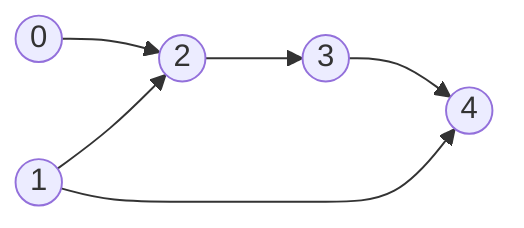
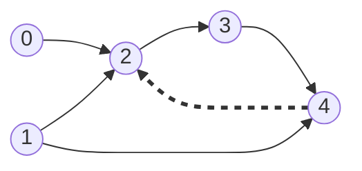
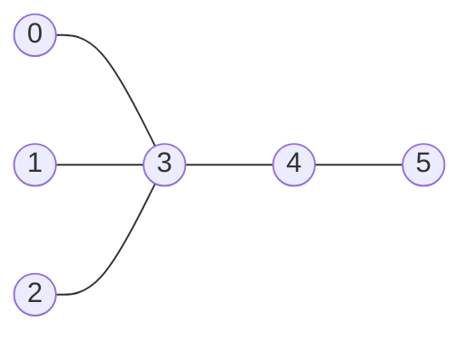

# Topological Sort

A **topological sort** of a directed graph is an ordering of all its nodes in
which every edge points forward. If there is an edge from `u` to `v`, then `u`
appears somewhere before `v` in the list. Nothing else is required, so the order
is not unique

That last point is the difference from sorting a list of numbers. Sorting can
compare any two values and produces one answer, whereas here two nodes are only
ordered relative to each other when a chain of edges connects them. Nodes with no
chain between them may appear in either order, so a graph normally has many valid
topological orders and any one of them is a correct answer

The word *topological* is doing real work in the name. The ordering comes from the
shape of the graph, meaning which node points at which, and not from any value
stored in the nodes

A directed graph has a topological order exactly when it contains no directed
cycle, and a directed graph with no cycle is called a **DAG**, short for
**directed acyclic graph**. The three parts of that name each mean something:
*directed* because every edge is one-way, *acyclic* because you can never follow
edges out of a node and arrive back at it, and *graph* in the ordinary sense from
[graph basics](01_graph_basics.md). A cycle makes an ordering impossible, because
each node on the cycle would have to come before the next one and, going the long
way around, also after it



Both `0, 1, 2, 3, 4` and `1, 0, 2, 3, 4` are valid orders for that graph, because
nodes 0 and 1 have no path between them in either direction and so are free to
appear in either order. What is fixed is that 2 comes after both of them, since
both point at it

## Where The Answer Is An Order, Not A Path

The direct signal is a problem that hands you pairs meaning "this must happen
before that" and asks whether a schedule exists or what one looks like. Course
prerequisites, build dependencies, task scheduling, and recipe steps are all the
same problem wearing different words

The disguised ones are more common in interviews than the direct ones, and they
share a single tell: **the value at a node depends only on the nodes that point
into it**. Once that is true, processing nodes in topological order means every
input to a node is final before the node is reached

- *Course Schedule* asks only whether an order exists, which is the same question
  as whether the graph has a cycle
- *Parallel Courses III* asks for the longest weighted path in a DAG, which is a
  value each node computes from its predecessors
- *Course Schedule IV* and *All Ancestors Of A Node In A Directed Acyclic Graph*
  both ask which nodes can reach which, and a node's ancestor set is the union of
  its predecessors' ancestor sets
- *Largest Color Value In A Directed Graph* carries 26 running counts per node
  instead of one number, and is otherwise the same loop
- *Alien Dictionary* extracts the edges first by comparing adjacent words, and the
  hard part is building the graph rather than ordering it

Two problems that sit in this section are not topological sorts, and knowing why
is worth as much as knowing when it applies. *All Paths From Source To Target*
wants every path rather than one order, so it is
[backtracking](../../09_backtracking/notes/01_backtracking_basics.md) over a DAG,
and the acyclicity only matters because it means no visited set is needed. *Time
Needed To Inform All Employees* is a management tree, so plain
[DFS](../../07_trees/notes/02_dfs.md) from the head answers it and no ordering is
involved

An undirected graph has no topological order at all, because an undirected edge
states that two nodes are related without saying which comes first. The one
undirected problem here, *Minimum Height Trees*, borrows the machinery rather than
the meaning, and that is its own section below

## Why Rescanning For A Ready Node Dies

Start from the definition and do the obvious thing. A node can be output as soon
as every node pointing into it has already been output, so scan all `V` nodes,
find one that is ready, output it, mark it done, and repeat until nothing is left

That algorithm is correct. It is also slow in a way that is easy to state: each of
the `V` rounds walks every node and, for each one, checks every incoming edge to
see whether all its sources are done. One round therefore costs `O(V + E)` for `V`
nodes and `E` edges, and the whole run costs `O(V * (V + E))`. On a graph with a
few thousand nodes and edges that is millions of checks to produce a few thousand
outputs

Look at where the work goes rather than at the exponent. When node `u` is output,
the only nodes whose readiness can possibly have changed are the ones `u` points
at directly, because nothing else lost a prerequisite. Every other check in that
round re-derived an answer that was already known and had not changed

So stop deriving readiness and store it. Give every node a counter holding how
many of its prerequisites are still outstanding, and when a node is output, walk
only its outgoing edges and decrement the counters at the far end. A node becomes
ready exactly when its counter reaches zero

## Kahn's Algorithm: Counting Unmet Prerequisites

The counter has a name. The **in-degree** of a node is the number of edges
pointing into it, so a node whose in-degree is zero has no prerequisites and can
go first. Nodes with in-degree zero are also called **sources**

The algorithm, which is **Kahn's algorithm**, keeps every currently-ready node in
a queue, since a node stays ready once it becomes ready and the order among ready
nodes does not matter:

```python
from collections import deque


def topological_order(n: int, edges: list[list[int]]) -> list[int]:
    adj: list[list[int]] = [[] for _ in range(n)]
    indegree = [0] * n
    for u, v in edges:
        adj[u].append(v)
        indegree[v] += 1

    ready = deque(node for node in range(n) if indegree[node] == 0)
    order: list[int] = []
    while ready:
        node = ready.popleft()
        order.append(node)
        for nxt in adj[node]:
            indegree[nxt] -= 1
            if indegree[nxt] == 0:
                ready.append(nxt)

    return order if len(order) == n else []


assert topological_order(5, [[0, 2], [1, 2], [2, 3], [3, 4], [1, 4]]) == [0, 1, 2, 3, 4]
assert topological_order(5, [[0, 2], [1, 2], [2, 3], [3, 4], [1, 4], [4, 2]]) == []
assert topological_order(2, [[1, 0]]) == [1, 0]
assert topological_order(3, []) == [0, 1, 2]
assert topological_order(1, [[0, 0]]) == []
assert topological_order(0, []) == []
```

**The four lines people get wrong**:

- `indegree[v] += 1` counts the arrow's **head**, never its tail. Incrementing
  `indegree[u]` instead builds the reverse graph, which produces a perfectly valid
  topological order of a graph you were not asked about, and the asserts are the
  only thing that catches it
- `if indegree[nxt] == 0` tests equality rather than `<= 0`, which is what
  guarantees each node is enqueued exactly once. The counter passes through zero
  once and then never returns to it, since only the edges into `nxt` decrement it
  and each of them fires once
- `len(order) == n` is the cycle test, and it is why the function returns a list
  rather than raising. Any node still carrying a positive in-degree when the queue
  empties never made it into `order`, and the next section proves that happens
  exactly when a cycle exists
- The seeding loop runs over `range(n)` rather than over the nodes mentioned in
  `edges`, because a node with no edges at all is still part of the answer and
  would otherwise be silently dropped

A `deque` is used because the algorithm only ever adds at one end and removes from
the other, which is the [queue](../../03_stacks_and_queues/notes/02_queue_and_deque.md)
access pattern. A plain list used as a stack works just as well and yields a
different, equally valid order, so choose whichever the problem's tie-breaking
rule wants. When the problem asks for the lexicographically smallest valid order,
swap the queue for a [heap](../../08_heaps/notes/01_heap_basics.md) and the
smallest ready node comes out first

> "I'll count, for each node, how many prerequisites it still has. Every node with
> a count of zero goes in a queue. I pop one, append it to the order, and
> decrement the count of everything it points at, pushing any node that hits zero.
> If the order ends up shorter than the node count, the leftovers are stuck in a
> cycle."

**Course Schedule II** is this function plus one clarifying question, and the
question is which way the pairs point. LeetCode gives `[a, b]` meaning you must
take `b` before `a`, so the edge runs from `b` to `a` and the pairs have to be
flipped before they are used as edges:

```python
def find_order(num_courses: int, prerequisites: list[list[int]]) -> list[int]:
    return topological_order(num_courses, [[b, a] for a, b in prerequisites])


assert find_order(2, [[1, 0]]) == [0, 1]
assert find_order(4, [[1, 0], [2, 0], [3, 1], [3, 2]]) == [0, 1, 2, 3]
assert find_order(1, []) == [0]
assert find_order(2, [[0, 1], [1, 0]]) == []
```

Ask about edge direction out loud before writing the build loop. A reversed
adjacency list still runs, still terminates, and still returns something that
looks like an answer, so it is the failure most likely to survive until the
interviewer points at a test case

## Dry Run: Five Courses And One That Is Never Ready

Take the graph from the top, with edges `0->2`, `1->2`, `2->3`, `3->4`, and
`1->4`. Building the adjacency list gives in-degrees of `[0, 0, 2, 1, 2]`, so
nodes 0 and 1 seed the queue

```text
initial   indegree=[0, 0, 2, 1, 2]   order=[]           queue=[0, 1]
pop 0     edge 0->2   indegree[2]=1  not ready          queue=[1]
pop 1     edge 1->2   indegree[2]=0  ENQUEUE            queue=[2]
pop 1     edge 1->4   indegree[4]=1  not ready          queue=[2]
pop 2     edge 2->3   indegree[3]=0  ENQUEUE            queue=[3]
pop 3     edge 3->4   indegree[4]=0  ENQUEUE            queue=[4]
pop 4     no outgoing edges                             queue=[]
order = [0, 1, 2, 3, 4]      len 5 == 5, so no cycle
```

The two `not ready` lines are the mechanism. When node 0 was popped, node 2's
count fell from 2 to 1, and node 2 was **not** enqueued even though one of its
prerequisites was now satisfied. Enqueuing on any decrement rather than on
reaching zero is the standard bug, and it emits node 2 before node 1, which
violates the `1->2` edge

Node 4 is the same story stretched further. It was decremented once at step three
and had to wait through two more pops before its second prerequisite cleared

Now add one edge, `4->2`, which turns `2 -> 3 -> 4 -> 2` into a cycle:



```text
initial   indegree=[0, 0, 3, 1, 2]   order=[]           queue=[0, 1]
pop 0     edge 0->2   indegree[2]=2  not ready          queue=[1]
pop 1     edge 1->2   indegree[2]=1  not ready          queue=[]
pop 1     edge 1->4   indegree[4]=1  not ready          queue=[]
order = [0, 1]               len 2 != 5, so a cycle exists
```

The queue drained with three nodes still holding positive counts. Node 2 got down
to 1 and stopped, because its third prerequisite is node 4, which needs node 3,
which needs node 2. The algorithm does not find the cycle or report which nodes
are on it, it just runs out of ready work, and the length check is what turns that
into an answer

## Why A Short Order Is Exactly A Cycle

The length check deserves the argument, because "compare the lengths" is easy to
memorize and hard to defend when asked why it is sufficient

If the graph **has** a cycle, take any node on it. Each node on a cycle has a
predecessor that is also on the cycle, and that predecessor can itself never be
output for the same reason, going around forever. So no node on the cycle is ever
output, its in-degree never reaches zero, and `order` is short

If the graph has **no** cycle, then the queue can only empty after every node has
been output. Suppose otherwise, and let `S` be the non-empty set of nodes left
over when the queue empties. Every node in `S` has a positive in-degree, meaning
some predecessor that was never output, and a node that was never output is itself
in `S`. Walking backwards from any node in `S` therefore never leaves `S`, and
since `S` is finite that walk must eventually repeat a node, which is a cycle and
contradicts the assumption

That is *Course Schedule* in full: build, run, and return `len(order) == n` instead
of the order

*Find Eventual Safe States* is the same idea pointed the other way. A node is safe
when every path leaving it ends at a node with no outgoing edges, so it is unsafe
exactly when it can reach a cycle. Reverse every edge and run Kahn on the reversed
graph, where in-degree in the reversed graph is out-degree in the original. The
nodes that come out are precisely the safe ones, since a node is released only
after all of its original successors have been released, and the answer is that
set sorted

## Reverse Postorder: The DFS Version

Kahn's algorithm builds the order front to back, taking whatever is ready. Depth-first
search builds it back to front, which is often less code when the graph is already
an adjacency list you are recursing over anyway

The observation is that a node is **finished** in a DFS only after every node
reachable from it has been finished, which is exactly the postorder position from
[tree DFS](../../07_trees/notes/02_dfs.md) applied to a graph. So the finish order
lists every node after all of its descendants, and reversing it lists every node
before all of its descendants, which is a topological order

Cycle detection is the three-color DFS from
[components and cycles](04_components_cycles_bipartite.md), with `WHITE`, `GRAY`,
and `BLACK` renamed to `UNSEEN`, `ACTIVE`, and `DONE` to say what they mean here,
and with each node appended to a list at the moment it turns `DONE`:

```python
def topological_order_dfs(n: int, edges: list[list[int]]) -> list[int]:
    adj: list[list[int]] = [[] for _ in range(n)]
    for u, v in edges:
        adj[u].append(v)

    UNSEEN, ACTIVE, DONE = 0, 1, 2
    state = [UNSEEN] * n
    finished: list[int] = []

    def visit(node: int) -> bool:
        if state[node] == ACTIVE:
            return False
        if state[node] == DONE:
            return True
        state[node] = ACTIVE
        for nxt in adj[node]:
            if not visit(nxt):
                return False
        state[node] = DONE
        finished.append(node)
        return True

    for node in range(n):
        if not visit(node):
            return []
    finished.reverse()
    return finished


assert topological_order_dfs(5, [[0, 2], [1, 2], [2, 3], [3, 4], [1, 4]]) == [1, 0, 2, 3, 4]
assert topological_order_dfs(5, [[0, 2], [1, 2], [2, 3], [3, 4], [1, 4], [4, 2]]) == []
assert topological_order_dfs(2, [[1, 0]]) == [1, 0]
assert topological_order_dfs(1, [[0, 0]]) == []
assert topological_order_dfs(0, []) == []
```

Notice the first assert returns `1, 0, 2, 3, 4` where Kahn returned `0, 1, 2, 3, 4`.
Both are correct, because nodes 0 and 1 are unrelated, and an interviewer who asks
for "a" valid order has to accept either

Hitting an `ACTIVE` node still means a cycle, since it is a node the walk is
currently standing inside. What changed is where the state is read: `visit` checks
it on entry rather than at the call site, so `if state[node] == DONE: return True`
is the line carrying the whole memo. Delete it and a settled node gets re-entered,
which both appends it to `finished` a second time and re-walks everything beneath
it, turning a chain of diamonds exponential

Two costs come with the recursive version. Python's default recursion limit of
1000 frames makes a graph shaped like a long chain overflow, which is a genuine
risk when a problem allows `10^5` nodes, and Kahn's algorithm has no such limit
because it is a loop. The recursion also makes it awkward to answer follow-ups
about which nodes are ready simultaneously, which Kahn answers for free by looking
at one queue level at a time

*Reconstruct Itinerary* is the same append-after-finishing-then-reverse shape used
for a different purpose. Tickets are consumed as they are walked, each airport
appends itself to the output only once all of its outgoing tickets are used up,
and reversing the result gives the itinerary. That is Hierholzer's algorithm for an
Eulerian path, and it works even though the ticket graph normally does contain
cycles, which is why the finish-order trick is worth recognizing on its own rather
than only as "the DFS topological sort"

## Peeling Leaves Instead Of Sources

*Minimum Height Trees* asks, given an undirected tree, which nodes make the height
smallest when the tree is rooted there. There is no direction and therefore no
topological order, but the counting machinery transfers exactly

The naive reading is to root the tree at each of the `n` nodes and measure the
height, which is `O(n)` per root and `O(n²)` overall. Instead, notice that the best
root is as far from the outside as possible, so strip the outside away. Every leaf,
meaning every node of degree 1, is the worst possible root among its remaining
neighbours, so delete all current leaves at once, then all the leaves of what is
left, and keep going. The last one or two nodes standing are the centres

It stops at two rather than one because the longest path in the tree shrinks by one
node at each end per round, so a path with an odd node count collapses to a single
middle node and one with an even count collapses to two adjacent middles



```python
def find_min_height_trees(n: int, edges: list[list[int]]) -> list[int]:
    if n <= 2:
        return list(range(n))

    adj: list[set[int]] = [set() for _ in range(n)]
    for u, v in edges:
        adj[u].add(v)
        adj[v].add(u)

    remaining = n
    leaves = [node for node in range(n) if len(adj[node]) == 1]
    while remaining > 2:
        remaining -= len(leaves)
        next_leaves: list[int] = []
        for leaf in leaves:
            neighbor = adj[leaf].pop()
            adj[neighbor].discard(leaf)
            if len(adj[neighbor]) == 1:
                next_leaves.append(neighbor)
        leaves = next_leaves

    return leaves


assert find_min_height_trees(4, [[1, 0], [1, 2], [1, 3]]) == [1]
assert sorted(find_min_height_trees(6, [[3, 0], [3, 1], [3, 2], [3, 4], [5, 4]])) == [3, 4]
assert find_min_height_trees(1, []) == [0]
assert find_min_height_trees(2, [[0, 1]]) == [0, 1]
```

On the six-node tree drawn above, the first round peels nodes 0, 1, 2, and 5,
leaving 3 and 4, and the loop stops with two centres. The degree count is playing
the role in-degree plays in Kahn's algorithm, the `while` loop is peeling whole
layers rather than popping one node at a time, and `remaining > 2` replaces the
"until the queue is empty" condition because the last two nodes are the answer
rather than the leftovers

The `n <= 2` guard is not decoration. A single node has degree 0, so it is never
collected as a leaf and the loop would never run, and two nodes joined by an edge
are both leaves and are both answers

## Computing Along The Order

The reason topological sort appears in so many disguised problems is that it turns
a graph into a sequence in which every node's inputs are already final. A value
that depends only on a node's predecessors can then be filled in during the same
loop that produces the order, with no recursion and no memo table

*Parallel Courses III* is the clearest case. Every course takes `time[i]` months,
a course starts the moment all its prerequisites are done, and unlimited courses
may run at once, so the answer is the earliest month everything is finished. For
one course that is `time[i]` plus the latest finish among its prerequisites, which
is the **longest path** through the DAG measured with weights on the nodes

```python
from collections import deque


def minimum_time(n: int, relations: list[list[int]], time: list[int]) -> int:
    adj: list[list[int]] = [[] for _ in range(n + 1)]
    indegree = [0] * (n + 1)
    for prev, nxt in relations:
        adj[prev].append(nxt)
        indegree[nxt] += 1

    finish = [0] * (n + 1)
    ready: deque[int] = deque()
    for course in range(1, n + 1):
        if indegree[course] == 0:
            finish[course] = time[course - 1]
            ready.append(course)

    while ready:
        course = ready.popleft()
        for nxt in adj[course]:
            finish[nxt] = max(finish[nxt], finish[course] + time[nxt - 1])
            indegree[nxt] -= 1
            if indegree[nxt] == 0:
                ready.append(nxt)

    return max(finish)


assert minimum_time(3, [[1, 3], [2, 3]], [3, 2, 5]) == 8
assert minimum_time(5, [[1, 5], [2, 5], [3, 5], [3, 4], [4, 5]], [1, 2, 3, 4, 5]) == 12
assert minimum_time(1, [], [7]) == 7
```

`finish[nxt] = max(...)` sits **outside** the `if indegree[nxt] == 0` check, and
that placement is the whole algorithm. Every predecessor must get a chance to raise
the finish time, and only the last one to arrive gets to release the node, so the
value is complete precisely when the node is enqueued

Running it on the graph of the second assert, `1->5`, `2->5`, `3->5`, `3->4`, and
`4->5`, but with weights `[5, 2, 3, 4, 5]` instead, shows candidates losing:

```text
seed      finish[1..5]=[5, 2, 3, 0, 0]                   queue=[1, 2, 3]
pop 1     1->5   candidate 5 + 5 = 10   finish[5] = 10   not ready
pop 2     2->5   candidate 2 + 5 = 7    finish[5] = 10   DISCARDED, 7 < 10
pop 3     3->5   candidate 3 + 5 = 8    finish[5] = 10   DISCARDED, 8 < 10
pop 3     3->4   candidate 3 + 4 = 7    finish[4] = 7    ENQUEUE
pop 4     4->5   candidate 7 + 5 = 12   finish[5] = 12   ENQUEUE
answer = max(finish) = 12
```

Course 5 was offered four candidate finish times before it was released, and the
two middle ones were thrown away for being smaller than the running maximum.
Reading `finish[5]` once course 3 had been popped, while its in-degree was still
positive, would have given 10, which is wrong, and this is why the answer is read
after the loop rather than during it

Two other problems in this section are the same loop with a different payload
carried along the edges. *All Ancestors Of A Node In A Directed Acyclic Graph* and
*Course Schedule IV* carry a set of reachable-from nodes, which the worked example
below builds. *Largest Color Value In A Directed Graph* carries an array of 26
counts per node, taking the elementwise maximum over predecessors and then adding
one to the slot for the node's own colour, and it returns `-1` when the order comes
up short, which is the cycle check doing double duty

## When The DAG Is Never Built

*Longest Increasing Path In A Matrix* is a DAG problem where no edges are given
and none should be materialized. Draw an edge from each cell to any orthogonally
adjacent cell holding a strictly larger value, and that graph cannot contain a
cycle, because following an edge always increases the value and a cycle would have
to return to a value smaller than itself

With an implicit graph, building in-degrees means walking every cell's four
neighbours anyway, so recursion plus a memo is shorter. The recursion is a
topological order in disguise, since a cell's answer is only written after every
cell it points at has returned, which is the same finish-order guarantee the DFS
version relies on

```python
def longest_increasing_path(matrix: list[list[int]]) -> int:
    if not matrix or not matrix[0]:
        return 0
    rows, cols = len(matrix), len(matrix[0])
    memo: dict[tuple[int, int], int] = {}

    def best_from(r: int, c: int) -> int:
        if (r, c) in memo:
            return memo[(r, c)]
        longest = 1
        for dr, dc in ((1, 0), (-1, 0), (0, 1), (0, -1)):
            nr, nc = r + dr, c + dc
            if 0 <= nr < rows and 0 <= nc < cols and matrix[nr][nc] > matrix[r][c]:
                longest = max(longest, 1 + best_from(nr, nc))
        memo[(r, c)] = longest
        return longest

    return max(best_from(r, c) for r in range(rows) for c in range(cols))


assert longest_increasing_path([[9, 9, 4], [6, 6, 8], [2, 1, 1]]) == 4
assert longest_increasing_path([[3, 4, 5], [3, 2, 6], [2, 2, 1]]) == 4
assert longest_increasing_path([[1]]) == 1
assert longest_increasing_path([]) == 0
```

There is no visited set and none is needed, because the strict `>` comparison is
what prevents the walk from revisiting a cell, and that is exactly the acyclicity
argument restated in code. The comparison must stay strict, since equal neighbours
would create two-way edges and the recursion would not terminate

## Worked Example: [Course Schedule IV](https://leetcode.com/problems/course-schedule-iv/)

You are given a set of courses and their direct prerequisite pairs, and then a
list of yes-or-no questions of the form "is course `u` a prerequisite of course
`v`, directly or through a chain of other courses?"

**Input**:

- `num_courses`, an `int` giving the number of courses, labelled `0` through
  `num_courses - 1`, where `2 <= num_courses <= 100`
- `prerequisites`, a `list[list[int]]` where each entry is a pair `[a, b]` meaning
  course `a` must be taken before course `b`, so the edge runs from `a` to `b`.
  The pairs are distinct and the resulting graph is guaranteed to be a DAG
- `queries`, a `list[list[int]]` where each entry is a pair `[u, v]` asking whether
  `u` is a prerequisite of `v`, with up to `10^4` queries

**Output**: a `list[bool]` of the same length as `queries`, where position `j` is
`True` when there is a directed path from `queries[j][0]` to `queries[j][1]` of one
or more edges, and `False` otherwise. A course is not a prerequisite of itself, so
a query `[x, x]` answers `False`

The phrase "directly or indirectly" is the tell, because it turns each query into a
reachability question rather than an edge lookup. Answering each query with its own
traversal costs `O(V + E)` per query and there can be `10^4` of them, which does far
more work than necessary given that many queries revisit the same courses

The better idea is to compute, once, the full set of ancestors for every course.
An ancestor of `v` is either a direct predecessor of `v` or an ancestor of a direct
predecessor, so `ancestors[v]` is the union of `ancestors[u]` and `{u}` over all
edges `u -> v`. That definition is only usable if `ancestors[u]` is already
complete when the edge is processed, which is precisely the guarantee Kahn's
algorithm provides

> "I'll compute the ancestor set of every course in one topological pass. When I
> pop a course, its own ancestor set is final, so I push that set plus the course
> itself into each successor. Then every query is a single set membership test."

1. Build the adjacency list with an edge from `a` to `b` for each pair `[a, b]`,
   and increment `indegree[b]`, because `a` comes first and the arrow's head is
   what gets counted
2. Create `ancestors` as one empty set per course. A course with no prerequisites
   keeps its empty set, which is correct rather than a placeholder
3. Seed the queue with every course whose in-degree is zero, using `range` over
   all courses so that a course appearing in no pair is still included
4. Pop a course. Because it is only popped once all of its own predecessors have
   been popped, and each of those pushed its contribution at that time,
   `ancestors[course]` is now final and will never change again
5. For each successor, union `ancestors[course]` into `ancestors[successor]` and
   then add `course` itself, which covers the indirect and the direct case in that
   order. Decrement the successor's in-degree and enqueue it if it reached zero
6. After the loop, answer each query `[u, v]` with `u in ancestors[v]`, which is
   an average `O(1)` set lookup. A self-query answers `False` for free, since a
   course is never added to its own set

```python
from collections import deque


def check_if_prerequisite(
    num_courses: int,
    prerequisites: list[list[int]],
    queries: list[list[int]],
) -> list[bool]:
    adj: list[list[int]] = [[] for _ in range(num_courses)]
    indegree = [0] * num_courses
    for before, after in prerequisites:
        adj[before].append(after)
        indegree[after] += 1

    ancestors: list[set[int]] = [set() for _ in range(num_courses)]
    ready = deque(c for c in range(num_courses) if indegree[c] == 0)
    while ready:
        course = ready.popleft()
        for nxt in adj[course]:
            ancestors[nxt] |= ancestors[course]
            ancestors[nxt].add(course)
            indegree[nxt] -= 1
            if indegree[nxt] == 0:
                ready.append(nxt)

    return [u in ancestors[v] for u, v in queries]


assert check_if_prerequisite(2, [[1, 0]], [[0, 1], [1, 0]]) == [False, True]
assert check_if_prerequisite(2, [], [[1, 0], [0, 1]]) == [False, False]
assert check_if_prerequisite(3, [[1, 2], [1, 0], [2, 0]], [[1, 0], [1, 2]]) == [True, True]
assert check_if_prerequisite(5, [[0, 1], [1, 2], [2, 3], [3, 4]], [[0, 4], [4, 0]]) == [True, False]
assert check_if_prerequisite(3, [], [[0, 0]]) == [False]
```

Tracing four courses with edges `0->1`, `1->3`, and `2->3` shows a set being built
in two instalments:

```text
initial   indegree=[0, 1, 0, 2]   queue=[0, 2]
pop 0     0->1   ancestors[1] = {0}         indegree[1]=0   ENQUEUE
pop 2     2->3   ancestors[3] = {2}         indegree[3]=1   not ready
pop 1     1->3   ancestors[3] = {0, 1, 2}   indegree[3]=0   ENQUEUE
pop 3     no successors
final     ancestors = [set(), {0}, set(), {0, 1, 2}]
```

The `not ready` line is where the correctness argument lives. Course 3 already held
`{2}` at that point, and reading its set right then would have wrongly answered
`False` for the query `[0, 3]`. Only the pop of course 1 completed it, contributing
both course 1 and, through the union, course 0, which course 1 had itself received
earlier

- **Time Complexity:** `O(V * E + q)` for `V` courses, `E` prerequisite pairs, and
  `q` queries, because each edge performs one set union costing up to `O(V)`, and
  each query is one average `O(1)` membership test afterwards
- **Space Complexity:** `O(V² + E)` because each of the `V` courses stores an
  ancestor set holding up to `V - 1` entries, on top of the adjacency list holding
  `E` edges and the queue holding at most `V` courses

## Time and Space Complexity

Throughout, `V` is the number of nodes and `E` is the number of edges

**Producing one topological order**

| Approach                               | Time                                                                                                                                                | Space                                                                                                                                                 |
| -------------------------------------- | --------------------------------------------------------------------------------------------------------------------------------------------------- | ----------------------------------------------------------------------------------------------------------------------------------------------------- |
| Kahn's algorithm                       | `O(V + E)`: building the graph touches each edge once, then each node is enqueued and popped exactly once and each edge is decremented exactly once | `O(V + E)`: the adjacency list is `O(V + E)`, and the in-degree array, queue, and output are each `O(V)`                                              |
| DFS reverse postorder                  | `O(V + E)`: each node is entered once thanks to the `DONE` state, and each edge is followed once from its tail                                      | `O(V + E)`: the adjacency list plus the state array and output, plus `O(V)` of call stack, which reaches `V` frames on a graph that is one long chain |
| Rescanning for a ready node each round | `O(V * (V + E))`: `V` rounds, each re-checking every node and every incoming edge, almost all of which cannot have changed                          | `O(V + E)`: the same storage as Kahn's, since the cost is repeated work rather than memory                                                            |

**Variants built on the same loop**

| Problem shape                                                    | Time                                                                                                                     | Space                                                                                                                         |
| ---------------------------------------------------------------- | ------------------------------------------------------------------------------------------------------------------------ | ----------------------------------------------------------------------------------------------------------------------------- |
| Cycle detection only, as in *Course Schedule*                    | `O(V + E)`: identical to producing the order, since the answer is the order's length                                     | `O(V + E)`: the order list can be replaced by a counter, which changes nothing asymptotically                                 |
| Leaf peeling, as in *Minimum Height Trees*                       | `O(V)`: a tree on `V` nodes has exactly `V - 1` edges, and each node is removed once and each edge is deleted once       | `O(V)`: the adjacency sets hold `2(V - 1)` entries across all nodes, plus one leaf list per round                             |
| Longest path with node weights, as in *Parallel Courses III*     | `O(V + E)`: the Kahn loop plus one `max` per edge                                                                        | `O(V + E)`: the adjacency list plus one finish time per node                                                                  |
| Reachability sets, as in *Course Schedule IV*                    | `O(V * E + q)`: each edge unions two sets of up to `V` elements, and each of the `q` queries is an average `O(1)` lookup | `O(V² + E)`: one ancestor set per node, each holding up to `V - 1` nodes                                                      |
| Memoized DFS on an implicit DAG, as in *Longest Increasing Path* | `O(R * C)`: for an `R` by `C` grid, each cell's value is computed once and looks at four neighbours                      | `O(R * C)`: the memo holds one entry per cell, and the recursion can reach `R * C` frames deep on a strictly increasing snake |

## Summary

- A **topological sort** of a directed graph lists every node before all the nodes
  it points at, so each edge runs forward in the list. The order is not unique,
  because two nodes with no chain of edges between them may appear either way
  round, and any valid order is an acceptable answer
  - It exists exactly when the graph is a **DAG**, a directed acyclic graph, since
    a node on a cycle would have to come both before and after itself
- The signal in a problem is a set of "this before that" pairs, as in course
  prerequisites, build dependencies, or task scheduling. The disguised signal is
  that a node's value depends only on the nodes pointing into it, which is what
  makes longest paths, ancestor sets, and per-node counters fall out of the same
  loop
- **Kahn's algorithm** stores, for each node, its **in-degree**, meaning the number
  of prerequisites it is still waiting on. Seed a queue with every zero, then pop a
  node, append it to the order, and decrement each successor, enqueuing any
  successor whose count reaches zero
  - The naive alternative rescans every node each round looking for one that is
    ready, which costs `O(V * (V + E))` because it re-derives readiness for nodes
    that could not possibly have changed
  - Enqueue on `== 0`, never on `<= 0` or on any decrement, since equality is what
    makes each node enter the queue exactly once
- **Cycle detection is the same run.** If `len(order) < V` the leftovers are stuck,
  because every node on a cycle always has an unprocessed predecessor and so never
  reaches in-degree zero. *Course Schedule* is Kahn's algorithm returning that
  comparison instead of the order
  - The algorithm does not report which nodes form the cycle, only that the order
    came up short
- The **DFS version** appends each node after all of its successors have finished,
  then reverses the list, which is postorder applied to a graph. Cycle detection
  needs three states rather than a visited set, because an `ACTIVE` node is one the
  walk is currently inside and reaching it again means an edge points backwards
  - `DONE` is what keeps it linear, since without it every path into a node
    re-explores everything beneath that node
  - The undirected trick of skipping the edge back to the parent does not apply,
    because `u -> v -> u` is a genuine cycle in a directed graph
  - Recursion depth is the practical risk, since a chain of more than 1000 nodes
    exceeds Python's default limit while the Kahn loop has no such ceiling
- **Leaf peeling** solves *Minimum Height Trees* with the same counter, using
  degree in an undirected tree instead of in-degree. Remove all degree-1 nodes at
  once, repeat on what remains, and stop when two or fewer nodes are left
  - It stops at two rather than one because the longest path loses a node from each
    end per round, so an even-length path leaves two adjacent middles
  - Guard `n <= 2` separately, since a lone node has degree 0 and is never
    collected as a leaf
- **Computing along the order** works because every predecessor of a node is
  finalized before that node is popped. *Parallel Courses III* keeps a finish time
  and takes a `max` on every edge, *Course Schedule IV* and *All Ancestors* union a
  set on every edge, and *Largest Color Value* carries 26 counters per node
  - The update must happen on every incoming edge, outside the zero test, and the
    value may only be read after the node is released, because earlier reads see a
    partial answer
- When the DAG is implicit, as in *Longest Increasing Path In A Matrix* where an
  edge means a strictly larger neighbour, skip the in-degree build and use a
  memoized DFS instead. The recursion finishes every successor before writing a
  cell's answer, which is the same ordering guarantee obtained without materializing
  the graph
- Both algorithms cost `O(V + E)` time and `O(V + E)` space for `V` nodes and `E`
  edges, which is dominated by the adjacency list rather than by the queue
  - The variants change that. Reachability sets cost `O(V * E)` time and `O(V²)`
    space because each edge copies a set, so quoting `O(V + E)` for *Course
    Schedule IV* is wrong

## Interview Checklist

Before writing code, make sure you can answer each of these

```text
Which way does each input pair point, and did I build the adjacency list that way?
Am I incrementing the in-degree of the arrow's head, not its tail?
Did I seed the queue from every node, including nodes that appear in no edge at all?
Do I enqueue only when the in-degree hits exactly zero, rather than on any decrement?
Is the graph guaranteed acyclic, or do I have to detect a cycle and say what to return?
Does len(order) == V get compared, and can I explain why a short order proves a cycle?
Does the problem want any valid order, or a specific one such as lexicographically smallest?
If I use DFS, do I have three states, and is DONE short-circuiting repeated subtrees?
Could the graph be a 10^5-node chain, which would blow the recursion limit but not Kahn's loop?
Is a per-node value being updated on every incoming edge, and only read after the node is popped?
Is the graph implicit, meaning I should memoize a DFS rather than build in-degrees?
```
