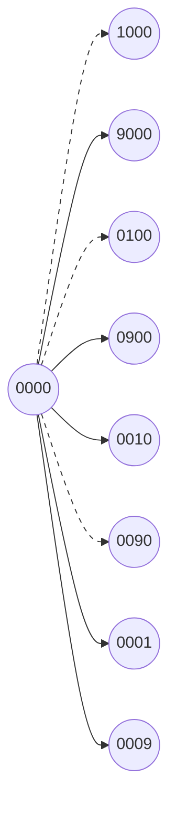
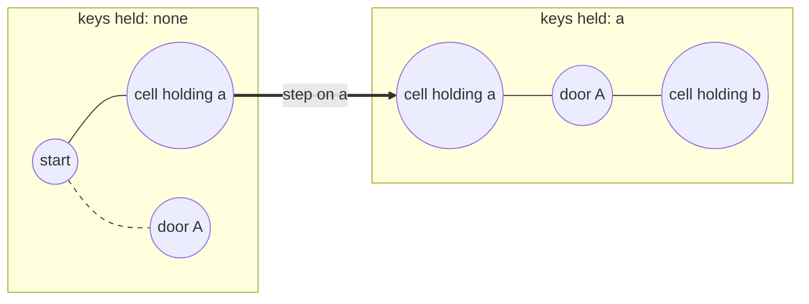

# BFS Over States You Generate

A **state** is a complete snapshot of a situation: the four digits currently
showing on a combination lock, the word you are currently standing on, the square
your token occupies on a board. A **transition** is one legal move that turns one
state into another, such as clicking one wheel up by one notch. Put those two
together and you have a graph, where the nodes are all the states the thing can
be in and the edges are the legal moves between them. That graph is called the
**state graph**, and the full set of nodes in it is the **state space**

The graphs you have seen so far arrived as data. An
[adjacency list](01_graph_basics.md) is handed to you as a list of lists, and a
grid is handed to you as a rectangle of cells you can index into. A state graph is
different, because nobody hands it to you at all. What you get is a starting
state, a rule that says which moves are legal, and a description of what you are
trying to reach. The graph exists, it just has never been written down anywhere.
That is why it is called an **implicit graph**

A four-wheel lock has 10,000 possible states and 40,000 edges between them, and no
interviewer will ever give you that list. They will give you the word "turn". The
useful reframe is that you do not need the list, because a traversal only ever
asks one question at a time: *given the node I am standing on, what are its
neighbors?* Answering that from a rule instead of from a stored list costs you a
few lines of code and nothing else. The traversal cannot tell the difference



Those eight nodes are the neighbors of `"0000"` on a four-wheel lock, one per
wheel per direction. The three dashed edges lead into states the problem has
declared forbidden, so the rule that generates neighbors has to know about them.
Nothing was built ahead of time, and only the states actually reached will ever be
constructed

## Three Ingredients Instead Of An Adjacency List

Every implicit-state problem hands you exactly three things, and naming them out
loud is most of the work of solving one

- A **start state**, which is sometimes given directly, as with the lock's fixed
  `"0000"`, and sometimes has to be located first, as with the `@` cell in a grid
- A **transition rule**, which takes a state and produces the states reachable in
  one move. This is the part that replaces the adjacency list
- A **goal test**, which takes a state and says whether you are done. Often it is
  an equality check against a target, but it can be a property, such as "the mask
  of collected keys is now complete"

The signal that you are in this territory is a question that asks for a
**minimum number of moves** over things that are not obviously nodes: the fewest
turns, the fewest mutations, the shortest transformation sequence, the least
number of buses. If the question asks for a minimum count of equal-cost steps,
every edge weighs the same, and BFS reaching a node first means it reached it by
the fewest edges, which the [queue walk](01_graph_basics.md) already established

Three things this is not:

- If the moves cost **different** amounts, first arrival is no longer cheapest
  arrival and BFS gives a wrong answer, which is what
  [weighted shortest paths](07_weighted_shortest_paths.md) exists to fix
- If the question asks you to **count** or **list** all the ways rather than find
  the shortest one, BFS is the wrong shape and you want
  [backtracking](../../09_backtracking/notes/01_backtracking_basics.md)
- If the state space is unbounded, BFS never terminates on a failure. Before
  coding, multiply out how many states exist and confirm the number is small
  enough to visit, since that estimate is also your complexity answer

## Why Turning Each Wheel The Short Way Fails

[Open The Lock](https://leetcode.com/problems/open-the-lock/) starts at `"0000"`
and asks for the fewest single-notch turns to reach a target, except that certain
combinations are **deadends** and the lock jams the moment any of them is
displayed

The cheap idea is arithmetic. Wheels are independent, and turning one wheel never
changes another, so the cost for each wheel is just the shorter way around the
circle, which is `min(d, 10 - d)` for a target digit `d`. Sum that over four
wheels and you are done in `O(1)` with no search at all

For target `"0202"` that gives `0 + 2 + 0 + 2 = 4`, and running BFS with an empty
deadend list agrees: the answer really is 4. The formula is not nonsense

Now switch on the deadends from the problem's own first example, which are
`["0201", "0101", "0102", "1212", "2002"]`. The true answer becomes **6**, not 4.
Every four-turn route to `"0202"` passes through `"0201"` or `"0102"`, both of
which are jammed, so the lock has to be walked around the blockage by a longer
route. The formula cannot see this, because it never asks which intermediate
combinations it passed through

That failure is specific and it hands you the algorithm. The moment intermediate
positions can be forbidden, the cost of getting somewhere depends on the whole
route rather than on the endpoints, and finding a cheapest route through a set of
allowed positions is a shortest-path question over the graph of positions. Each
turn is one move and every move costs the same, so it is the unweighted case, and
BFS answers it

> "Independent wheels would let me compute this arithmetically, but a deadend can
> block the direct route, so I have to search. Each turn costs one, so the edges
> are unweighted and BFS gives the minimum number of turns rather than Dijkstra."

## Open The Lock, With Neighbors Made Up On Demand

The transition rule is eight strings built from the current one, and the deadends
are handled by a trick worth remembering: a deadend is a state you must never
enter, and the `seen` set is already the machinery for "never enter this", so
**seed the set with the deadends** instead of writing a second check

```python
from collections import deque


def open_lock(deadends: list[str], target: str) -> int:
    dead = set(deadends)
    if "0000" in dead:
        return -1
    seen = {"0000"}
    queue = deque([("0000", 0)])
    while queue:
        state, turns = queue.popleft()
        if state == target:
            return turns
        for i in range(4):
            digit = int(state[i])
            for step in (1, -1):
                nxt = state[:i] + str((digit + step) % 10) + state[i + 1 :]
                if nxt not in seen and nxt not in dead:
                    seen.add(nxt)
                    queue.append((nxt, turns + 1))
    return -1


assert open_lock(["0201", "0101", "0102", "1212", "2002"], "0202") == 6
assert open_lock(["8888"], "0009") == 1
assert open_lock(["8887", "8889", "8878", "8898", "8788", "8988", "7888", "9888"], "8888") == -1
assert open_lock([], "0000") == 0
assert open_lock(["0000"], "8888") == -1
```

**The lines that decide whether this is right**:

- `state[:i] + str(...) + state[i + 1 :]` is the whole transition rule. Python
  strings are immutable, so a "turn" is really the construction of a new string
  that differs in one position, and that new string is both the neighbor and its
  own key in the `seen` set
- `(digit + step) % 10` is what makes the wheel a wheel. Without the modulo, `9`
  turning up would produce the character `:` and `0` turning down would produce
  `/`, and the search would wander into states that do not exist
- `if "0000" in dead` is the guard that fails every test suite that omits it. The
  start is never generated as anybody's neighbor, so it is never checked against
  the deadends, and a lock that is jammed before you touch it must return `-1`
  even when the target is reachable on paper
- `assert open_lock([], "0000") == 0` is the other edge the goal test has to
  survive, since a target equal to the start needs zero turns and only the check
  at the top of the loop catches it
- Marking `seen` at **enqueue** time rather than at dequeue time is the same rule
  as in [plain graph traversal](01_graph_basics.md), and here it matters more,
  because a state has eight neighbors and each of them has eight, so a state
  enqueued from several directions would be expanded several times

## Dry Run: Two Kinds Of Rejected Neighbor

Take a smaller deadend list, `["1000", "0100", "0090"]`, with target `"0002"`, so
that a blocked move shows up on the very first expansion. The answer is 2, since
`"0000"` goes to `"0001"` and then to `"0002"`. Here are the first two states
popped, with every generated neighbor and what happened to it:

```text
pop 0000  turns=0
   1000   REJECTED  deadend
   9000   enqueued  turns=1
   0100   REJECTED  deadend
   0900   enqueued  turns=1
   0010   enqueued  turns=1
   0090   REJECTED  deadend
   0001   enqueued  turns=1
   0009   enqueued  turns=1

pop 9000  turns=1
   0000   REJECTED  already generated
   8000   enqueued  turns=2
   9100   enqueued  turns=2
   9900   enqueued  turns=2
   9010   enqueued  turns=2
   9090   enqueued  turns=2
   9001   enqueued  turns=2
   9009   enqueued  turns=2
```

The two rejection reasons look identical in the code, since both are a membership
test that skips the enqueue, but they mean different things

A **deadend rejection** prunes a node out of the graph permanently. The state
`"1000"` is not merely visited already, it is a place the lock may never occupy,
so nothing beyond it is reachable through it. Notice this also silently removes
seven of its own neighbors from consideration, which is why a handful of deadends
can lengthen the answer by more than one turn

An **already-generated rejection** is the ordinary cycle guard. Popping `"9000"`
immediately regenerates `"0000"`, because turning a wheel up and then back down
returns you to where you started. Every state in this graph has this property with
all eight of its neighbors, so without the `seen` check the queue would grow
without bound and the search would never finish

The generation order also shows why the answer is a minimum. Everything reachable
in one turn is enqueued before any two-turn state, so `"0002"` cannot be found at
turn 3 by some longer route once it has already been discovered at turn 2

## What Belongs In A State, And What Does Not

A state has to satisfy two properties, and getting either one wrong produces a
bug that looks like a logic error rather than a modelling error

**It must be hashable**, because it goes into a set. Strings and integers already
are. A grid position must be the tuple `(r, c)` rather than the list `[r, c]`,
since a list cannot be a set member. An unordered collection must be a `frozenset`
rather than a `set` for the same reason

**It must be complete**, meaning it contains everything about the situation that
affects what happens next, and nothing that does not. This is the real design
decision. If two situations have the same state but different futures, the search
will treat the second one as already explored and discard a route it needed. If
the state carries irrelevant extras, the state space multiplies and the search
slows down or runs out of memory for no benefit

The set of items you have picked up is the usual extra dimension, and there are
two ways to store it. A `frozenset` of the items is the plain option and needs
nothing new. The compact option is an integer used as a **bitmask**, where bit `i`
is on when item `i` is held:

```python
def add_item(mask: int, index: int) -> int:
    return mask | (1 << index)


def has_item(mask: int, index: int) -> bool:
    return (mask >> index) & 1 == 1


empty = 0
with_a = add_item(empty, 0)
with_ab = add_item(with_a, 1)

assert (with_a, with_ab) == (1, 3)
assert has_item(with_ab, 0) and has_item(with_ab, 1)
assert not has_item(with_a, 1)
assert not has_item(empty, 0)
assert add_item(with_a, 0) == with_a
```

`1 << index` is the number with a single one-bit at position `index`, so `1 << 0`
is 1, `1 << 1` is 2, and `1 << 2` is 4. Combining with `|` turns a bit on and
leaves the others alone, which is why adding an item you already hold changes
nothing. Testing with `(mask >> index) & 1` shifts the bit you care about down to
the bottom and reads it. A set of `k` distinct items becomes a plain integer
between `0` and `2^k - 1`, which is cheap to hash and easy to compare against
`(1 << k) - 1` for "I have all of them". The mechanics of these operators are
covered properly in [bit manipulation](../../15_bit_manipulation/notes/02_masks.md),
and the two functions above are all this topic needs

## Generating Word Neighbors Without Comparing Every Pair

[Word Ladder](https://leetcode.com/problems/word-ladder/) asks for the length of
the shortest chain from `beginWord` to `endWord` where consecutive words differ by
exactly one letter and every word after the first must be in the given list

Here the states are the words themselves, so the obvious move is to build the
adjacency list first: for each pair of words, count differing positions and record
an edge when the count is 1. That is `N` words compared against `N` words at `L`
characters each, which is `O(N² * L)`. With the 5,000 words the problem allows,
that is 25 million comparisons before the search even starts

The alternative is to never build it. For a word of length `L`, generate all `26 * L`
one-letter variations and keep the ones that are in the word set, which is a
hash lookup rather than a scan. That is `O(26 * L)` work with an `O(L)` hash per
candidate, independent of how many words the list holds

> "Rather than comparing every pair of words to build an adjacency list, I'll
> generate neighbors by changing one letter at a time and testing membership in a
> set. That trades `O(N²·L)` up front for `O(26·L²)` per word actually visited,
> and I only pay it for words the search reaches."

```python
from collections import deque


def ladder_length(begin_word: str, end_word: str, word_list: list[str]) -> int:
    words = set(word_list)
    if end_word not in words:
        return 0
    seen = {begin_word}
    queue = deque([(begin_word, 1)])
    while queue:
        word, length = queue.popleft()
        if word == end_word:
            return length
        for i in range(len(word)):
            for code in range(ord("a"), ord("z") + 1):
                nxt = word[:i] + chr(code) + word[i + 1 :]
                if nxt in words and nxt not in seen:
                    seen.add(nxt)
                    queue.append((nxt, length + 1))
    return 0


assert ladder_length("hit", "cog", ["hot", "dot", "dog", "lot", "log", "cog"]) == 5
assert ladder_length("hit", "cog", ["hot", "dot", "dog", "lot", "log"]) == 0
assert ladder_length("a", "c", ["a", "b", "c"]) == 2
assert ladder_length("hit", "cog", []) == 0
```

The distance starts at 1 rather than 0 because this problem counts **words in the
sequence** and not moves between them, so `hit -> hot -> dot -> dog -> cog` is
length 5 while only four letters ever changed. Read that off the examples rather
than assuming, since the sibling problem below counts the other way

`if end_word not in words: return 0` is an early exit rather than a correctness
fix, because the search would fail to find it anyway. It is worth keeping because
it turns a full sweep of the reachable component into an immediate answer on the
common bad input

[Minimum Genetic Mutation](https://leetcode.com/problems/minimum-genetic-mutation/)
is the same function with two substitutions. The alphabet is `"ACGT"` instead of
26 letters, and the count is of mutations rather than of genes, so the distance
starts at 0 and failure returns `-1`

```python
from collections import deque


def min_mutation(start_gene: str, end_gene: str, bank: list[str]) -> int:
    genes = set(bank)
    if end_gene not in genes:
        return -1
    seen = {start_gene}
    queue = deque([(start_gene, 0)])
    while queue:
        gene, steps = queue.popleft()
        if gene == end_gene:
            return steps
        for i in range(len(gene)):
            for base in "ACGT":
                nxt = gene[:i] + base + gene[i + 1 :]
                if nxt in genes and nxt not in seen:
                    seen.add(nxt)
                    queue.append((nxt, steps + 1))
    return -1


assert min_mutation("AACCGGTT", "AACCGGTA", ["AACCGGTA"]) == 1
assert min_mutation("AACCGGTT", "AAACGGTA", ["AACCGGTA", "AACCGCTA", "AAACGGTA"]) == 2
assert min_mutation("AAAAACCC", "AACCCCCC", ["AAAACCCC", "AAACCCCC", "AACCCCCC"]) == 3
assert min_mutation("AACCGGTT", "AACCGGTA", []) == -1
```

Two follow-ups come up often enough to have an answer ready. The first is **path
reconstruction**, wanted by
[Word Ladder II](https://leetcode.com/problems/word-ladder-ii/): store a parent
for each state as you enqueue it and walk the chain backwards from the target,
which is `O(S)` extra space for `S` states and does not change the search. The
second is **bidirectional BFS**, where you expand alternately from the start and
from the target and stop when the two frontiers meet. If the branching factor is
`b` and the answer is `d` moves, one-directional search touches roughly `b^d`
states while two searches of depth `d / 2` touch roughly `2 * b^(d/2)`, so it is a
real win. It also needs both endpoints known up front, which rules it out for a
goal test that is a property rather than a specific state

## Carrying The Keys You Have Collected

[Shortest Path To Get All Keys](https://leetcode.com/problems/shortest-path-to-get-all-keys/)
puts you in a grid with lowercase keys, uppercase doors, and walls, and asks for
the fewest steps to collect every key. A door may only be entered when you already
hold its matching key

The instinct from [grid BFS](03_grid_bfs.md) is to make the state `(r, c)` and
mark each cell visited once. That is wrong here, and it is wrong in a way worth
seeing rather than being told. Running exactly that version on the problem's own
second example, `["@..aA", "..B#.", "....b"]`, returns `-1` where the answer is 6.
The search walks past a cell early while holding nothing, marks it used up, and
later cannot walk back through it holding the key that would have opened the door
behind it

A cell visited without a key and the same cell visited holding key `a` are
genuinely different situations, because the moves available from them differ. So
they must be different nodes:



The grid is effectively stacked into `2^k` copies of itself, one per set of keys
you might be holding, with `k` the number of distinct keys. Picking up a key is the
only move that crosses between layers, and it is one-way, since a key is never put
down. The dashed edge is the door refusing entry on the bottom layer while the
identical edge one layer up is allowed

```python
from collections import deque


def shortest_path_all_keys(grid: list[str]) -> int:
    rows, cols = len(grid), len(grid[0])
    all_keys = 0
    start = (0, 0)
    for r in range(rows):
        for c in range(cols):
            ch = grid[r][c]
            if ch == "@":
                start = (r, c)
            elif ch.islower():
                all_keys |= 1 << (ord(ch) - ord("a"))
    seen = {(start[0], start[1], 0)}
    queue = deque([(start[0], start[1], 0, 0)])
    while queue:
        r, c, keys, steps = queue.popleft()
        if keys == all_keys:
            return steps
        for dr, dc in ((1, 0), (-1, 0), (0, 1), (0, -1)):
            nr, nc = r + dr, c + dc
            if not (0 <= nr < rows and 0 <= nc < cols):
                continue
            ch = grid[nr][nc]
            if ch == "#":
                continue
            if ch.isupper() and not (keys >> (ord(ch) - ord("A"))) & 1:
                continue
            nkeys = keys | (1 << (ord(ch) - ord("a"))) if ch.islower() else keys
            if (nr, nc, nkeys) not in seen:
                seen.add((nr, nc, nkeys))
                queue.append((nr, nc, nkeys, steps + 1))
    return -1


assert shortest_path_all_keys(["@.a..", "###.#", "b.A.B"]) == 8
assert shortest_path_all_keys(["@..aA", "..B#.", "....b"]) == 6
assert shortest_path_all_keys(["@#a"]) == -1
```

**Three details carry this**:

- `all_keys` is computed by scanning the grid once, rather than assumed to be
  `(1 << 6) - 1`, because the number of keys varies per input and the goal test
  `keys == all_keys` is only correct against the keys that actually exist
- The `seen` entry is `(nr, nc, nkeys)` and the queue entry is that plus the step
  count. The step count is deliberately **not** part of the state, since two
  arrivals at the same cell with the same keys are the same situation regardless
  of how long they took, and including it would make every state unique and defeat
  the set entirely
- Stepping onto a key cell updates the mask in the same move as the step, so
  picking up a key is free rather than costing an extra move, which matches the
  problem's own step counting

The identical structure covers
[Minimum Moves To Reach Target With Rotations](https://leetcode.com/problems/minimum-moves-to-reach-target-with-rotations/),
where a snake occupies two cells and the state is `(r, c, orientation)` with
`orientation` a single bit for horizontal or vertical. Two of the moves change
only the position, and the rotations change only the orientation, so a position
alone would merge two situations from which entirely different moves are legal.
The same question settles both problems: *does anything besides my position change
which moves I can make next?*

## Starting From Every Node At Once

[Shortest Path Visiting All Nodes](https://leetcode.com/problems/shortest-path-visiting-all-nodes/)
gives a small connected undirected graph and asks for the shortest walk that
visits every node, starting anywhere and allowed to revisit nodes and edges freely

Revisiting is what breaks the usual setup, because "visited" can no longer mean
"never come back here". What actually stops the search from looping forever is
that returning to a node **having already seen the same set of nodes** is a
repeat, while returning to it having seen more is progress. So the state is
`(node, mask)`, where the mask records which nodes the walk has touched, and the
goal test is `mask == (1 << n) - 1`, meaning every bit is on

The other twist is the start. The problem lets the walk begin anywhere, and
running `n` separate searches would repeat almost all the work, so put all `n`
starting states into the queue at distance 0. That is the **multi-source** setup
from [grid BFS](03_grid_bfs.md), reused with generated states instead of cells

```python
from collections import deque


def shortest_path_length(graph: list[list[int]]) -> int:
    n = len(graph)
    full = (1 << n) - 1
    queue = deque((node, 1 << node, 0) for node in range(n))
    seen = {(node, 1 << node) for node in range(n)}
    while queue:
        node, mask, steps = queue.popleft()
        if mask == full:
            return steps
        for nxt in graph[node]:
            nmask = mask | (1 << nxt)
            if (nxt, nmask) not in seen:
                seen.add((nxt, nmask))
                queue.append((nxt, nmask, steps + 1))
    return -1


assert shortest_path_length([[1, 2, 3], [0], [0], [0]]) == 4
assert shortest_path_length([[1], [0, 2, 4], [1, 3, 4], [2], [1, 2]]) == 4
assert shortest_path_length([[]]) == 0
```

Each start begins with the single bit for its own node already set, since a walk
that starts at node 3 has visited node 3. The last assert is the degenerate case:
a graph with one node and no edges is complete before the first move, so the
answer is 0, and the goal test at the top of the loop is what makes that fall out

## When The Node Is A Bus Route, Not A Bus Stop

[Bus Routes](https://leetcode.com/problems/bus-routes/) gives a list of routes,
each a list of stops served in a loop, and asks for the fewest buses you must take
to get from one stop to another

Making a stop the node is the natural reading and it is the expensive one, because
two stops on the same route are joined by an edge, so a route with `m` stops
contributes `m²` edges and the graph blows up. It also makes the answer awkward,
since the quantity being minimized is buses boarded rather than stops passed

Turn it around and make the **route** the node. Two routes are adjacent when they
share any stop, since sharing a stop is exactly the condition for transferring
between them, and the number of edges traversed is then the number of transfers.
Boarding the first bus costs 1, so a search that starts with every route serving
the source at distance 1 reports the answer directly

```python
from collections import defaultdict, deque


def num_buses_to_destination(routes: list[list[int]], source: int, target: int) -> int:
    if source == target:
        return 0
    stop_routes: dict[int, list[int]] = defaultdict(list)
    for index, route in enumerate(routes):
        for stop in route:
            stop_routes[stop].append(index)
    queue = deque((r, 1) for r in stop_routes[source])
    seen_routes = set(stop_routes[source])
    seen_stops = {source}
    while queue:
        route, buses = queue.popleft()
        for stop in routes[route]:
            if stop == target:
                return buses
            if stop in seen_stops:
                continue
            seen_stops.add(stop)
            for nxt in stop_routes[stop]:
                if nxt not in seen_routes:
                    seen_routes.add(nxt)
                    queue.append((nxt, buses + 1))
    return -1


assert num_buses_to_destination([[1, 2, 7], [3, 6, 7]], 1, 6) == 2
assert num_buses_to_destination([[7, 12], [4, 5, 15], [6], [15, 19], [9, 12, 13]], 15, 12) == -1
assert num_buses_to_destination([[1, 2, 7], [3, 6, 7]], 6, 6) == 0
assert num_buses_to_destination([[2]], 1, 2) == -1
```

`stop_routes` is the index that makes the route graph implicit. It is built once
in a pass over every stop of every route, and it answers "which routes can I
transfer to from here" in `O(1)`, which is the same
[index-it-once move](01_graph_basics.md) that turns an edge list into an adjacency
list

Two `seen` sets are needed rather than one, and they do different jobs.
`seen_routes` stops a route being boarded twice. `seen_stops` stops a stop's
transfer list being scanned twice, which is what keeps the total work linear in the
number of stop entries rather than quadratic. The `source == target` guard at the
top is the edge case, since the answer is 0 buses and the loop below would report
1 by finding the target on the first route it boards

## Worked Example: [Snakes and Ladders](https://leetcode.com/problems/snakes-and-ladders/)

You have an `n x n` board whose squares are numbered `1` to `n²` in boustrophedon
order, which means the numbering starts in the bottom-left corner, runs left to
right along the bottom row, then right to left along the row above it, alternating
all the way up. From square `x` you roll a die and move to any of `x + 1` through
`x + 6`, and if the square you land on holds a snake or ladder, you are
immediately moved to the destination it names. Return the fewest die rolls needed
to reach square `n²`, or `-1` if that is impossible

**Input**: `board`, a `list[list[int]]` of size `n x n` with `2 <= n <= 20`, given
in the usual top-row-first order that a matrix is printed in. A cell holds `-1`
when the square is ordinary, or the number of the destination square when it holds
a snake or a ladder. The board's first square and its last square never hold a
snake or ladder

**Output**: an `int`, the minimum number of die rolls to get from square `1` to
square `n²`. Since `n` is at least 2 those are always different squares, so the
answer is at least 1, and it is `-1` when no sequence of rolls reaches the end,
which can happen because snakes send you backwards

The phrase "fewest rolls" over positions generated by a movement rule is the
implicit-state signal, and the state here is a single integer: the square you are
standing on. Nothing else matters, since the legal rolls from a square depend only
on the square. The naive alternative is to try every sequence of rolls, which
branches six ways per roll and revisits squares endlessly, so it never terminates
on a board with a snake

The one real difficulty is that the board is indexed by row and column while the
game is played in square numbers, so the transition rule needs a conversion
between them. That conversion is the
[flattened-matrix index](../../05_binary_search/notes/01_binary_search_basics.md)
you have already seen, with two adjustments for this board's numbering

> "The state is just the square number, from 1 to `n²`. Each roll is one move and
> every roll costs the same, so this is unweighted and BFS gives the minimum. A
> snake or ladder is not an extra move, it is part of the same transition, so I
> apply it while computing the neighbor rather than enqueueing the intermediate
> square."

1. Write a small helper that reads the board value for a square number, because
   every neighbor lookup needs it. Subtract 1 to get a zero-based index, then
   `divmod` it by `n` to split it into a row counted from the bottom and a column
2. Flip the row, using `n - 1 - row`, since square 1 is at the bottom of the board
   while `board[0]` is the top row. Then flip the column whenever the row index
   from the bottom is odd, using `n - 1 - col`, because those rows are numbered
   right to left
3. Start the search at square 1 with 0 rolls, and mark it in the `seen` set
   immediately so that a snake sending you back to it later is rejected rather than
   restarting the search
4. On popping a square, check the goal first. Reaching `n²` is the answer and the
   rolls already counted are the minimum, because BFS finishes every square
   reachable in `k` rolls before touching any square that needs `k + 1`
5. Generate neighbors by rolling 1 through 6. Break out of the loop as soon as
   `square + step` passes `n²`, since the remaining rolls only go further past the
   end and the problem does not let you overshoot
6. Apply the snake or ladder while generating. If the landing square's cell is not
   `-1`, replace the destination with the number it names. The move still costs one
   roll, so the intermediate square is never enqueued and never marked seen
7. Enqueue the final destination with one more roll if it has not been seen. This
   is where a snake gets absorbed harmlessly, since a snake that returns you to an
   already-visited square produces nothing new
8. Return `-1` when the queue empties, which means every square reachable from
   square 1 has been expanded and `n²` was not among them

```python
from collections import deque


def snakes_and_ladders(board: list[list[int]]) -> int:
    n = len(board)
    target = n * n

    def value_at(square: int) -> int:
        row, col = divmod(square - 1, n)
        r = n - 1 - row
        c = col if row % 2 == 0 else n - 1 - col
        return board[r][c]

    seen = {1}
    queue = deque([(1, 0)])
    while queue:
        square, moves = queue.popleft()
        if square == target:
            return moves
        for step in range(1, 7):
            nxt = square + step
            if nxt > target:
                break
            jump = value_at(nxt)
            if jump != -1:
                nxt = jump
            if nxt not in seen:
                seen.add(nxt)
                queue.append((nxt, moves + 1))
    return -1


example = [
    [-1, -1, -1, -1, -1, -1],
    [-1, -1, -1, -1, -1, -1],
    [-1, -1, -1, -1, -1, -1],
    [-1, 35, -1, -1, 13, -1],
    [-1, -1, -1, -1, -1, -1],
    [-1, 15, -1, -1, -1, -1],
]

assert snakes_and_ladders(example) == 4
assert snakes_and_ladders([[-1, -1], [-1, 3]]) == 1
assert snakes_and_ladders([[-1, -1], [-1, -1]]) == 1
```

Tracing the first three squares popped on that six-by-six board shows both the
jump and the rejections:

```text
pop 1 moves=0
  roll 1 -> 2   jump=15   land=15   enqueued moves=1
  roll 2 -> 3   jump=-1   land=3    enqueued moves=1
  roll 3 -> 4   jump=-1   land=4    enqueued moves=1
  roll 4 -> 5   jump=-1   land=5    enqueued moves=1
  roll 5 -> 6   jump=-1   land=6    enqueued moves=1
  roll 6 -> 7   jump=-1   land=7    enqueued moves=1

pop 15 moves=1
  roll 1 -> 16  jump=-1   land=16   enqueued moves=2
  roll 2 -> 17  jump=13   land=13   enqueued moves=2
  roll 3 -> 18  jump=-1   land=18   enqueued moves=2
  ...

pop 3 moves=1
  roll 1 -> 4   jump=-1   land=4    REJECTED  already seen
  roll 2 -> 5   jump=-1   land=5    REJECTED  already seen
  roll 3 -> 6   jump=-1   land=6    REJECTED  already seen
  roll 4 -> 7   jump=-1   land=7    REJECTED  already seen
  roll 5 -> 8   jump=-1   land=8    enqueued moves=2
  roll 6 -> 9   jump=-1   land=9    enqueued moves=2
```

The very first roll is the ladder from square 2 to square 15, and it is enqueued
as square 15 at one move rather than as square 2, so the ladder was climbed for
free. Square 2 itself never enters the queue at all

The step at square 17 goes the other way and is a snake back to 13, which is
behind where the token already stands. It is still enqueued, because 13 had not
been reached yet and might be the only way into some part of the board. Nothing in
the code treats snakes and ladders differently, and nothing needs to

The four rejections at square 3 are the wasted work that the `seen` set is there to
prevent. Squares 4 through 7 were all reachable in one roll directly from square 1,
so reaching them again from square 3 would cost two, and BFS has already recorded
the better answer. Without the check, each of those would be re-expanded with an
inflated distance and the first arrival at the target could be wrong

- **Time Complexity:** `O(n²)`, because the board has `n²` squares, each square is
  enqueued at most once thanks to the `seen` set, and expanding one square does at
  most 6 constant-time neighbor computations
- **Space Complexity:** `O(n²)`, because the `seen` set can hold every square, and
  the queue holds at most one BFS layer, which is itself bounded by the number of
  squares

## Time and Space Complexity

Throughout, `S` is the number of **reachable states**, which is what the search
actually touches rather than the number of states that exist, and `T` is the
number of transitions generated per state. Every BFS in this topic costs
`O(S * T * C)` time, where `C` is the cost of building one neighbor and hashing
it, and `O(S)` space for the `seen` set and the queue. The table below is that
formula with the symbols filled in per problem

**Open The Lock**, where a state is a 4-character string

| Approach                      | Time                                                                                                                              | Space                                                                                             |
| ----------------------------- | --------------------------------------------------------------------------------------------------------------------------------- | ------------------------------------------------------------------------------------------------- |
| BFS over generated states     | `O(10^4 * 8 * 4)`: there are `10^4` states, each generating 8 neighbors, and building plus hashing a 4-character string is `O(4)` | `O(10^4)`: the `seen` set can hold every combination, and each entry is a fixed-length string     |
| Summing per-wheel turn counts | `O(1)`: four `min(d, 10 - d)` computations with no search at all                                                                  | `O(1)`: nothing is stored, but the answer is wrong whenever a deadend blocks every shortest route |

**Word Ladder**, for `N` words of length `L` over an alphabet of 26 letters

| Approach                                    | Time                                                                                                                             | Space                                                                                                      |
| ------------------------------------------- | -------------------------------------------------------------------------------------------------------------------------------- | ---------------------------------------------------------------------------------------------------------- |
| BFS generating one-letter variations        | `O(26 * N * L²)`: each of `N` words is expanded once into `26 * L` candidates, and building and hashing each candidate is `O(L)` | `O(N * L)`: the word set and the `seen` set each hold up to `N` strings of length `L`                      |
| Building an adjacency list by pairing words | `O(N² * L)`: every pair of words is compared position by position before the search starts, whether or not it is ever reached    | `O(N²)`: the adjacency list can hold an edge for every pair, which is the cost the implicit version avoids |

**State with an extra dimension**, for `k` keys and `n` nodes

| Problem                          | Time                                                                                                                      | Space                                                                                                       |
| -------------------------------- | ------------------------------------------------------------------------------------------------------------------------- | ----------------------------------------------------------------------------------------------------------- |
| Shortest Path To Get All Keys    | `O(R * C * 2^k * 4)`: the grid is stacked into `2^k` key-set layers of `R * C` cells, and each cell has 4 neighbors       | `O(R * C * 2^k)`: one `seen` entry per cell per key set, which is why `k` is capped at 6 in the constraints |
| Shortest Path Visiting All Nodes | `O(2^n * n²)`: there are `n * 2^n` states, and expanding one walks that node's neighbor list, which holds up to `n` nodes | `O(2^n * n)`: one `seen` entry per `(node, mask)` pair                                                      |

**Bus Routes**, where `M` is the total number of stop entries across all routes

| Approach                 | Time                                                                                                                                                                                     | Space                                                                                                |
| ------------------------ | ---------------------------------------------------------------------------------------------------------------------------------------------------------------------------------------- | ---------------------------------------------------------------------------------------------------- |
| BFS with routes as nodes | `O(M)`: building the stop-to-routes index touches each stop entry once, and `seen_routes` and `seen_stops` together ensure each route body and each stop's transfer list is scanned once | `O(M)`: the index stores one entry per stop occurrence, and the two `seen` sets are smaller than it  |
| BFS with stops as nodes  | `O(M * R)`: a route of `m` stops makes all `m` of them mutually adjacent, so a stop's neighbor list is rebuilt from every route it belongs to, where `R` is the number of routes         | `O(M²)` in the worst case: materializing those all-pairs edges is what the route-node version avoids |

## Summary

- An **implicit graph** is one that is never written down. Its nodes are **states**,
  meaning complete snapshots of a situation, and its edges are **transitions**,
  meaning single legal moves. You are given a start state, a rule that generates
  the legal moves, and a goal test, and you generate each node's neighbors at the
  moment the traversal asks for them
  - The traversal code is unchanged from an ordinary BFS. The only difference is
    that `for nxt in adj[node]` becomes a few lines that construct the neighbors
- The signal is a question asking for the **minimum number of moves** over things
  that are not obviously nodes: fewest turns of a lock, fewest gene mutations,
  shortest word transformation, fewest buses boarded, fewest die rolls
  - BFS is correct because each move costs one, so first arrival is fewest-edge
    arrival. When the moves cost different amounts this breaks, and the problem is
    a weighted shortest path instead
  - When the question asks to count or list all the ways rather than find the
    shortest, this is the wrong tool and backtracking is the right one
- Designing the state is the whole problem, and the state must be **hashable**, so
  a tuple rather than a list and a `frozenset` rather than a `set`, and **complete**,
  meaning it holds everything that changes which moves are legal next
  - Leaving something out merges two genuinely different situations, and the search
    then discards a route it needed. Marking cells visited by `(r, c)` alone in
    Shortest Path To Get All Keys returns `-1` on an input whose answer is 6
  - Putting something extra in, such as the step count, makes every state unique,
    so the `seen` set stops working and the search degenerates
  - Never include the distance travelled in the state. It belongs in the queue
    entry alongside the state, not in the key
- A set of collected items becomes an extra dimension of the state, stored either
  as a `frozenset` or as an integer **bitmask** where bit `i` means item `i` is
  held. Turn a bit on with `mask | (1 << i)`, read it with `(mask >> i) & 1`, and
  test for a full set with `mask == (1 << k) - 1`
  - This is what makes the grid in Shortest Path To Get All Keys into `2^k` stacked
    copies of itself, with picking up a key as the only one-way move between layers
  - The same shape covers an orientation bit for the rotating snake, and the
    visited-node mask in Shortest Path Visiting All Nodes
- Choosing **what the node is** can change the problem's difficulty more than any
  optimization. In Bus Routes the routes are the nodes rather than the stops,
  because two stops on one route would be mutually adjacent and produce `m²` edges,
  while route-to-route edges are exactly the transfers being counted
- Generating neighbors beats materializing the adjacency list when the state space
  is large. Word Ladder generates `26 * L` candidate words and tests each against a
  set, which is `O(26 * L²)` per visited word, instead of comparing every pair up
  front at `O(N² * L)` whether or not those words are ever reached
- Forbidden states are handled by **seeding the `seen` set** with them before the
  search starts, so one membership test rejects both the states already visited and
  the states that may never be entered
  - Check separately whether the **start itself** is forbidden, because the start is
    never generated as anyone's neighbor and so never meets that test
- The cost is `O(S * T * C)` time and `O(S)` space, where `S` is the number of
  reachable states, `T` is the transitions generated per state, and `C` is the cost
  of building and hashing one neighbor
  - Multiply out `S` before you start coding, since a state space of `10^4` for the
    lock is trivial while `R * C * 2^k` for the keys grid is only tractable because
    the problem caps `k` at 6
- A follow-up worth having ready is **bidirectional BFS**, expanding from the start
  and the target alternately and stopping when the frontiers meet, which turns
  roughly `b^d` states into roughly `2 * b^(d/2)` for branching factor `b` and
  answer depth `d`. It needs both endpoints known up front, so it does not apply
  when the goal is a property rather than a specific state

## Interview Checklist

Before writing code, make sure you can answer each of these

```text
What is one state, exactly, and can I write it as a hashable Python value?
Does my state hold everything that changes which moves are legal from here?
Am I about to put the step count inside the state, which would break the seen set?
What is the start state, and is it possible that the start is itself forbidden?
What is the goal test: equality with a target, or a property like "mask is full"?
How many states exist, and is that number small enough to visit them all?
How many neighbors does one state generate, and what does building one cost?
Am I generating neighbors on demand, or wasting time materializing an adjacency list?
Are all moves the same cost, so BFS is right, or do I need weighted shortest paths?
Is the obvious object the right node, or should something else be the node entirely?
Am I marking states seen when I enqueue them rather than when I dequeue them?
If the search finishes without reaching the goal, what does the problem want returned?
```
