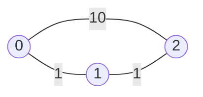
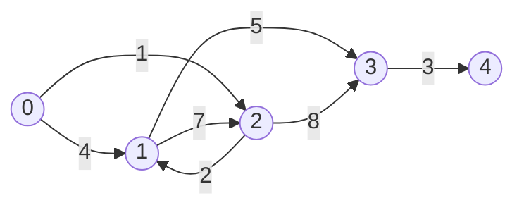

# Weighted Shortest Paths

Every edge in this topic carries a **weight**, which is a number attached to the
edge saying what it costs to cross: a travel time, a toll, a distance, a
probability of success. The **cost of a path** is what you get by combining the
weights along it, which is usually the sum. A **shortest path** from `s` to `v`
is the path of minimum cost among all paths from `s` to `v`, and `dist[v]` is
that minimum cost

The word "shortest" is doing something different here than it did in the last
three topics. [BFS](03_grid_bfs.md) answers "fewest edges", and on an unweighted
graph that is the same question as "cheapest", because every edge costs 1. The
moment weights differ the two questions come apart, and a three-hop path can
easily beat a one-hop path



Going straight from `0` to `2` is one edge and costs 10. Going `0, 1, 2` is two
edges and costs 2. Fewest edges and cheapest total disagree, and this topic is
about the second one

Think of it as water spreading out from the start node at a constant speed, where
an edge of weight `w` takes `w` seconds to flow along. BFS is the special case
where every pipe is the same length, so the wet region is a set of clean rings.
With unequal lengths the wet region deforms, but one thing survives: **nodes get
wet in nondecreasing order of distance**. That single fact is the whole algorithm

## Why The First Arrival Is Not The Cheapest Arrival

BFS works by trusting its first look. The first time it reaches a node, it writes
down the distance and never revisits, and on an unweighted graph that is provably
correct because the queue hands out nodes in order of hop count

Try that rule on the three-node graph above, exploring from `0`. The neighbors of
`0` are `1` at cost 1 and `2` at cost 10. BFS marks both, records `dist[2] = 10`,
and considers node `2` finished. Later it expands node `1` and discovers a path
into `2` costing `1 + 1 = 2`, but node `2` is already marked visited so the
discovery is thrown away. The answer comes out as 10 when it should be 2

The failure is specific and worth naming, because it is what the rest of the
topic is built to avoid. **A node's first discovery is not its cheapest
discovery.** Marking on first sight is exactly the move that has to go

## Chopping Every Edge Into Unit Steps

There is a repair that needs no new algorithm at all. If BFS is only correct when
every edge costs 1, then make every edge cost 1. Replace the weight-10 edge from
`0` to `2` with a chain of nine dummy nodes joined by ten weight-1 edges, do the
same to every other edge, and run ordinary BFS on the result

```text
original      0 --10-- 2
subdivided    0 -- x1 -- x2 -- x3 -- x4 -- x5 -- x6 -- x7 -- x8 -- x9 -- 2
```

This is correct, and you should be able to say why in one sentence: a path's hop
count in the subdivided graph is exactly its total weight in the original, so
fewest hops and cheapest total are once again the same question. On the picture
above, BFS reaches `2` through node `1` at hop 2, long before the ten-hop chain
finishes, so `dist[2] = 2` falls out

It is also unusable. A graph with `E` edges and weights up to `10^6` turns into a
graph with up to `E * 10^6` nodes, so the running time becomes proportional to
the **sum of the weights** rather than to the size of the input. An edge list of
200 rows can produce hundreds of millions of dummy nodes

The idea to keep is not the dummy nodes but the **order** in which BFS visits the
real ones. Those dummy chains do nothing except delay a node until its distance
comes up, so BFS on the subdivided graph is really just "handle the real nodes in
nondecreasing order of distance". You do not need the chains to get that order.
You need a structure that hands back the smallest tentative distance seen so far,
and that is a [min-heap](../../08_heaps/notes/01_heap_basics.md)

## Dijkstra: Settling The Cheapest Unsettled Node

**Dijkstra's algorithm** keeps a table `dist` of the best cost known so far to
each node, and a heap of candidate arrivals ordered by cost. Repeatedly pop the
cheapest candidate, declare that node **settled** so its distance is final, and
use it to improve the table entries of its neighbors

Improving a neighbor has a name you should use out loud. **Relaxing** the edge
`u -> v` means checking whether going to `u` and then crossing that edge beats the
best route to `v` found so far, and writing the smaller number down if it does

```python
import heapq
import math


def dijkstra(adj: list[list[tuple[int, int]]], src: int) -> list[float]:
    dist: list[float] = [math.inf] * len(adj)
    dist[src] = 0
    heap: list[tuple[float, int]] = [(0, src)]
    while heap:
        d, u = heapq.heappop(heap)
        if d > dist[u]:
            continue
        for v, w in adj[u]:
            nd = d + w
            if nd < dist[v]:
                dist[v] = nd
                heapq.heappush(heap, (nd, v))
    return dist


demo = [
    [(1, 4), (2, 1)],
    [(2, 7), (3, 5)],
    [(1, 2), (3, 8)],
    [(4, 3)],
    [],
]

assert dijkstra(demo, 0) == [0, 3, 1, 8, 11]
assert dijkstra([[(1, 3)], [], []], 0) == [0, 3, math.inf]
assert dijkstra([[]], 0) == [0]
```

`adj[u]` holds `(neighbor, weight)` pairs rather than bare neighbors, which is the
one change to the adjacency list from
[graph basics](01_graph_basics.md). Build it the same way, appending in both
directions when the graph is undirected

**Four lines decide whether this is correct**:

- `heap: list[tuple[float, int]]` stores the **cost first** in each tuple, because
  a heap compares tuples left to right, so cost has to be the leading element for
  the pop to return the cheapest arrival. Writing `(node, cost)` gives you a heap
  ordered by node id, which runs, terminates, and answers nonsense
- `if d > dist[u]: continue` throws away a **stale entry**. Nothing removes an old
  candidate from the heap when a cheaper route to the same node is found, so the
  heap can hold several entries for one node and only the smallest is real. This
  is [lazy deletion](../../08_heaps/notes/03_two_heaps.md), and the guard is how
  the outdated copies get ignored when they eventually surface
- `if nd < dist[v]` is a strict comparison, so an equal-cost route is not written
  and not pushed. Allowing `<=` would push a fresh heap entry for every tie and
  can loop forever on a zero-weight edge, since the same cost keeps qualifying
- `dist[v] = nd` happens **at push time**, not at pop time. That is what lets a
  later, cheaper discovery of `v` overwrite an earlier one, which is precisely the
  update BFS refused to make

**Why the first pop of a node is final** is the property to state in an interview,
and it is a short argument. Say `(d, u)` is popped and `d == dist[u]`. Any other
path from the source to `u` has to leave the settled region at some point, so it
crosses into some node `x` that is still sitting in the heap, meaning
`dist[x] >= d`, because `u` was the cheapest thing in the heap. From `x` that path
still has to reach `u`, and every remaining edge adds a nonnegative amount, so its
total is at least `d`. No path beats `d`, so `d` is the answer

That argument uses **nonnegative weights** in exactly one place: "every remaining
edge adds a nonnegative amount". Give one edge a weight of `-5` and a longer
detour can come back cheaper after `u` has already been settled, which is why
Dijkstra is simply wrong on graphs with negative edges rather than merely slow.
Negative weights need
[Bellman-Ford](../../17_advanced/notes/02_shortest_paths.md), which arrives in
17_advanced

> "All the weights are nonnegative, so I will run Dijkstra. I keep a `dist` array
> and a min-heap of `(cost, node)`. When I pop a node whose recorded cost is worse
> than `dist[node]`, that is a stale entry from before I found a cheaper route, and
> I skip it. The first time I pop a node with its current best cost, that cost is
> final."

## Tracing Five Nodes, One Stale Pop, And One Rejected Relaxation

The `demo` graph above, drawn out, with all edges directed:



Each block below is one pop. `dist` starts as all infinite except the source:

```text
pop (0,0)   settle dist[0]=0
   relax 0->1 w=4    4 < inf   ACCEPT   push (4,1)
   relax 0->2 w=1    1 < inf   ACCEPT   push (1,2)
   heap [(1,2), (4,1)]              dist [0, 4, 1, inf, inf]

pop (1,2)   settle dist[2]=1
   relax 2->1 w=2    3 < 4     ACCEPT   push (3,1)
   relax 2->3 w=8    9 < inf   ACCEPT   push (9,3)
   heap [(3,1), (4,1), (9,3)]      dist [0, 3, 1, 9, inf]

pop (3,1)   settle dist[1]=3
   relax 1->2 w=7   10 >= 1    REJECT
   relax 1->3 w=5    8 < 9     ACCEPT   push (8,3)
   heap [(4,1), (8,3), (9,3)]      dist [0, 3, 1, 8, inf]

pop (4,1)   STALE, dist[1] is already 3, skipped entirely
pop (8,3)   settle dist[3]=8
   relax 3->4 w=3   11 < inf   ACCEPT   push (11,4)
pop (9,3)   STALE, dist[3] is already 8, skipped entirely
pop (11,4)  settle dist[4]=11           dist [0, 3, 1, 8, 11]
```

Three lines are worth staring at. The **rejected relaxation** `1->2` proposed
reaching node `2` at cost 10 when it was already settled at 1, and the strict
`<` threw it away without a push. Nothing special guards against relaxing back
into a settled node, and nothing needs to, because a settled node's distance can
never be beaten

The **stale pop** `(4,1)` is the entry pushed at the very first step, back when
the only known route into node `1` was the direct weight-4 edge. Node `1` was
later improved to 3 and pushed again, and both entries stayed in the heap. When
the obsolete one finally surfaces, `d > dist[u]` catches it. Delete that guard
and node `1` gets expanded a second time with the wrong `d`, which pushes
inflated candidates like `(4 + 5, 3)` and wastes work

Node `3` shows the update BFS could not make. It was first written as 9 through
node `2`, then rewritten as 8 through node `1`, which was discovered later but
turned out cheaper. A first-arrival-wins rule would have frozen 9

## Reading An Answer Off The Distance Array

Most weighted problems do not ask for one number in `dist`, they ask a question
about the whole array. In
[Network Delay Time](https://leetcode.com/problems/network-delay-time/) a signal
starts at node `k` and you want the moment the last node hears it, which is the
**maximum** entry in `dist`, or `-1` when some node never hears it at all

```python
def network_delay_time(times: list[list[int]], n: int, k: int) -> int:
    adj: list[list[tuple[int, int]]] = [[] for _ in range(n + 1)]
    for u, v, w in times:
        adj[u].append((v, w))
    dist = dijkstra(adj, k)[1:]
    slowest = max(dist)
    return -1 if slowest == math.inf else int(slowest)


assert network_delay_time([[2, 1, 1], [2, 3, 1], [3, 4, 1]], 4, 2) == 2
assert network_delay_time([[1, 2, 1]], 2, 1) == 1
assert network_delay_time([[1, 2, 1]], 2, 2) == -1
assert network_delay_time([], 1, 1) == 0
```

The nodes are numbered from 1, so the adjacency list is built with `n + 1` slots
and index 0 is left empty and sliced off before taking the maximum. That
off-by-one is the only real trap in the problem. `math.inf` doing double duty as
"unreachable" is why the reachability check is a comparison against infinity
rather than a separate visited set, and it is why `dist` is initialized to
infinity rather than to `-1` or `0`

## When Cost Is A Maximum Instead Of A Sum

Some problems define the cost of a path as the **worst single edge on it** rather
than the total. In
[Path With Minimum Effort](https://leetcode.com/problems/path-with-minimum-effort/)
you walk a grid of heights, the effort of a step is the absolute height
difference, and the effort of a route is the largest step it contains. The
cheapest such route is called a **minimax** or **bottleneck** path

Nothing about the algorithm changes except the line that combines a path with an
edge. Instead of `d + w` you write `max(d, w)`

```python
def minimum_effort_path(heights: list[list[int]]) -> int:
    rows, cols = len(heights), len(heights[0])
    effort: list[list[float]] = [[math.inf] * cols for _ in range(rows)]
    effort[0][0] = 0
    heap: list[tuple[int, int, int]] = [(0, 0, 0)]
    while heap:
        e, r, c = heapq.heappop(heap)
        if e > effort[r][c]:
            continue
        for nr, nc in ((r + 1, c), (r - 1, c), (r, c + 1), (r, c - 1)):
            if 0 <= nr < rows and 0 <= nc < cols:
                step = abs(heights[nr][nc] - heights[r][c])
                worst = max(e, step)
                if worst < effort[nr][nc]:
                    effort[nr][nc] = worst
                    heapq.heappush(heap, (worst, nr, nc))
    return int(effort[rows - 1][cols - 1])


assert minimum_effort_path([[1, 2, 2], [3, 8, 2], [5, 3, 5]]) == 2
assert minimum_effort_path([[1, 2, 3], [3, 8, 4], [5, 3, 5]]) == 1
assert minimum_effort_path([[1, 2, 1, 1, 1], [1, 2, 1, 2, 1], [1, 2, 1, 2, 1], [1, 2, 1, 2, 1], [1, 1, 1, 2, 1]]) == 0
assert minimum_effort_path([[3]]) == 0
```

The grid is an implicit graph, so there is no adjacency list to build: the
neighbors of `(r, c)` are the four cells around it, filtered by the bounds check,
which is the same modeling as [grid BFS](03_grid_bfs.md). The heap entry grows to
a triple `(cost, row, col)` because a node now needs two coordinates to name, and
cost still leads

**The condition that lets you swap the combine step** is that combining must never
make a path cheaper. Extending a route can only leave the worst edge alone or
raise it, exactly as adding a nonnegative weight can only leave a total alone or
raise it, so the argument that the first pop is final survives word for word. If
you ever invent a combine rule where extending a path can lower its cost, Dijkstra
stops being correct and you have to say so

[Swim In Rising Water](https://leetcode.com/problems/swim-in-rising-water/) is the
same function with the cost of a step redefined as the height of the cell being
entered rather than the difference, so `worst = max(e, grid[nr][nc])`, and the
answer is the bottleneck value at the bottom-right corner

## When Cost Is A Product You Want To Maximize

In
[Path With Maximum Probability](https://leetcode.com/problems/path-with-maximum-probability/)
each edge carries a success probability, the reliability of a path is the
**product** of its edges, and you want the largest product rather than the
smallest sum. Two things flip: the combine step becomes multiplication, and the
comparison reverses everywhere

Python's `heapq` is a min-heap only, so push the **negated** probability to make
it pop the largest first, which is the standard max-heap trick from
[heap basics](../../08_heaps/notes/01_heap_basics.md)

```python
def max_probability(
    n: int,
    edges: list[list[int]],
    succ_prob: list[float],
    start: int,
    end: int,
) -> float:
    adj: list[list[tuple[int, float]]] = [[] for _ in range(n)]
    for (u, v), p in zip(edges, succ_prob):
        adj[u].append((v, p))
        adj[v].append((u, p))
    best = [0.0] * n
    best[start] = 1.0
    heap: list[tuple[float, int]] = [(-1.0, start)]
    while heap:
        neg, u = heapq.heappop(heap)
        prob = -neg
        if prob < best[u]:
            continue
        if u == end:
            return prob
        for v, edge_p in adj[u]:
            extended = prob * edge_p
            if extended > best[v]:
                best[v] = extended
                heapq.heappush(heap, (-extended, v))
    return 0.0


assert max_probability(3, [[0, 1], [1, 2], [0, 2]], [0.5, 0.5, 0.2], 0, 2) == 0.25
assert max_probability(3, [[0, 1], [1, 2], [0, 2]], [0.5, 0.5, 0.3], 0, 2) == 0.3
assert max_probability(3, [[0, 1]], [0.5], 0, 2) == 0.0
assert max_probability(1, [], [], 0, 0) == 1.0
```

Every comparison flipped together, and mixing them is the bug to watch for. `best`
starts at `0.0` instead of infinity because zero is the worst possible
probability, the source starts at `1.0` because an empty path succeeds with
certainty, and the improvement test is `>` instead of `<`. The monotonicity
condition still holds, since probabilities are at most 1 and multiplying by one of
them can only shrink a product, never grow it

The early `return prob` when `u` is the target is safe for the same reason the
whole algorithm works: a popped node is settled, so nothing later can improve it.
That shortcut is available in every version above, and it matters most on large
graphs where the target is found early

## When Any Path Will Do

Not every weighted graph problem is an optimization.
[Evaluate Division](https://leetcode.com/problems/evaluate-division/) gives you
ratios like `a / b = 2.0` and asks for `a / c`. Model each variable as a node and
each equation as two edges, `a -> b` with weight `2.0` and `b -> a` with weight
`0.5`, and the answer to a query is the product along any path from one to the
other

There is no heap here, and the reason is worth saying out loud in an interview.
The input is guaranteed consistent, so **every** path between two variables
multiplies to the same number, which means there is nothing to optimize and a
plain DFS carrying a running product is enough

```python
from collections import defaultdict


def calc_equation(
    equations: list[list[str]],
    values: list[float],
    queries: list[list[str]],
) -> list[float]:
    adj: dict[str, list[tuple[str, float]]] = defaultdict(list)
    for (a, b), v in zip(equations, values):
        adj[a].append((b, v))
        adj[b].append((a, 1 / v))

    def ratio(src: str, dst: str) -> float:
        if src not in adj or dst not in adj:
            return -1.0
        seen = {src}
        stack: list[tuple[str, float]] = [(src, 1.0)]
        while stack:
            node, product = stack.pop()
            if node == dst:
                return product
            for nxt, w in adj[node]:
                if nxt not in seen:
                    seen.add(nxt)
                    stack.append((nxt, product * w))
        return -1.0

    return [ratio(a, b) for a, b in queries]


assert calc_equation(
    [["a", "b"], ["b", "c"]],
    [2.0, 3.0],
    [["a", "c"], ["b", "a"], ["a", "e"], ["a", "a"], ["x", "x"]],
) == [6.0, 0.5, -1.0, 1.0, -1.0]
assert calc_equation([["a", "b"]], [0.5], [["a", "b"], ["b", "a"], ["x", "y"]]) == [0.5, 2.0, -1.0]
```

The `src not in adj` check is the edge case the examples are built to catch. A
query about a variable that never appeared in any equation answers `-1.0`, and
that includes `x / x`, so the identity shortcut has to come *after* the membership
test rather than before it. Nodes here are strings, so `adj` is a dict and `seen`
is a set instead of arrays indexed by node number, which is the usual adjustment
when nodes are not integers

## Weights Of Only Zero And One: A Deque Instead Of A Heap

When every weight is either 0 or 1, the heap is more machinery than the problem
needs. **0-1 BFS** replaces it with a `deque`: relaxing across a weight-0 edge
puts the node on the **front**, and relaxing across a weight-1 edge puts it on the
**back**

That works because the structure only ever holds nodes at two distinct distances,
`d` and `d + 1`, so keeping it sorted needs nothing more than a choice of end. A
zero-weight step produces a node at the current distance, which belongs ahead of
everything already queued at `d + 1`, and a one-weight step produces a node at
`d + 1`, which belongs behind them. Popping from the front therefore still hands
back the cheapest node, at `O(1)` per operation instead of `O(log V)`

[Minimum Obstacle Removal To Reach Corner](https://leetcode.com/problems/minimum-obstacle-removal-to-reach-corner/)
is the pure form: walking into an empty cell costs 0 and walking into an obstacle
costs 1, since the obstacle has to be removed

```python
from collections import deque


def minimum_obstacles(grid: list[list[int]]) -> int:
    rows, cols = len(grid), len(grid[0])
    dist: list[list[float]] = [[math.inf] * cols for _ in range(rows)]
    dist[0][0] = grid[0][0]
    dq: deque[tuple[int, int]] = deque([(0, 0)])
    while dq:
        r, c = dq.popleft()
        for nr, nc in ((r + 1, c), (r - 1, c), (r, c + 1), (r, c - 1)):
            if 0 <= nr < rows and 0 <= nc < cols:
                nd = dist[r][c] + grid[nr][nc]
                if nd < dist[nr][nc]:
                    dist[nr][nc] = nd
                    if grid[nr][nc] == 0:
                        dq.appendleft((nr, nc))
                    else:
                        dq.append((nr, nc))
    return int(dist[rows - 1][cols - 1])


assert minimum_obstacles([[0, 1, 1], [1, 1, 0], [1, 1, 0]]) == 2
assert minimum_obstacles([[0, 1, 0, 0, 0], [0, 1, 0, 1, 0], [0, 0, 0, 1, 0]]) == 0
assert minimum_obstacles([[0]]) == 0
```

The `if nd < dist[nr][nc]` test is still doing the work a visited set does in
plain BFS, and it cannot be replaced by one, because a cell reached first through
an obstacle may be reached again later for free. `appendleft` versus `append` is
the entire difference from a normal BFS, and getting them backwards produces a
queue that is no longer sorted by distance, which fails silently on some inputs
and passes on others

[Minimum Cost To Make At Least One Valid Path In A Grid](https://leetcode.com/problems/minimum-cost-to-make-at-least-one-valid-path-in-a-grid/)
is the same shape with the 0 and 1 assigned differently. Each cell already points
in some direction, so moving the way the arrow points costs 0 and any of the other
three directions costs 1, because the sign has to be rewritten

## The One-Line Edit That Answers A Different Question

Four versions of the same loop have now appeared, and they differ only in how a
path is combined with the next edge:

```text
nd = d + w                 cheapest total          Dijkstra
nd = max(d, w)             cheapest worst edge     minimax / bottleneck
nd = d * p, maximizing     most reliable path      probability
nd = w                     cheapest edge           NOT a shortest path
```

The last line is the near-miss to be careful about. Dropping `d` entirely and
comparing the raw edge weight builds a **minimum spanning tree** instead, which
answers "connect everything as cheaply as possible" rather than "get from the
source to each node as cheaply as possible". That algorithm is
[Prim's](../../17_advanced/notes/03_mst.md), it is one character away from this
one, and it is covered in 17_advanced.
[Min Cost To Connect All Points](https://leetcode.com/problems/min-cost-to-connect-all-points/)
is that problem wearing a shortest-path costume, and running Dijkstra on it
returns a real number that answers the wrong question

## When The Node Alone Is Not The State

Dijkstra assumes one number per node is enough to summarize everything you need to
know about how you got there. Some problems break that assumption directly by
adding a constraint that a cheaper route can violate

The repair is **state augmentation**: make the node of the graph a tuple instead
of a bare id, so `dist` is keyed by `(node, extra)` and the extra component
carries whatever the constraint needs. Nothing else changes, and the algorithm
never learns that its nodes have structure

- [Cheapest Flights Within K Stops](https://leetcode.com/problems/cheapest-flights-within-k-stops/)
  adds a cap on the number of edges, so the state is `(city, flights used)` and
  the worked example below builds it in full
- [Minimum Cost To Reach Destination In Time](https://leetcode.com/problems/minimum-cost-to-reach-destination-in-time/)
  pays a fee per city while a separate time budget ticks down, so the state is
  `(city, time spent)` and the priority is the fee. The two quantities are
  genuinely independent, since the cheapest route may be too slow and the fastest
  route may be too expensive
- [Second Minimum Time To Reach Destination](https://leetcode.com/problems/second-minimum-time-to-reach-destination/)
  wants the second-smallest distinct arrival time, so keep two arrays, `best1` and
  `best2`, and accept an arrival when it beats `best1`, or when it is strictly
  greater than `best1` and beats `best2`. The state is effectively
  `(node, rank)` with a rank of only 1 or 2
- [The Maze II](https://leetcode.com/problems/the-maze-ii/) has a ball that rolls
  until it hits a wall, so an "edge" is a whole roll and its weight is the number
  of squares travelled. The state stays a bare cell, but the neighbor function has
  to roll rather than step, and only stopping points are nodes.
  [The Maze](https://leetcode.com/problems/the-maze/) asks only whether the
  destination is reachable, so it needs no heap at all
- [Find The City With The Smallest Number Of Neighbors At A Threshold Distance](https://leetcode.com/problems/find-the-city-with-the-smallest-number-of-neighbors-at-a-threshold-distance/)
  needs distances between every pair, and the simplest correct answer is to run
  Dijkstra `V` times, once from each node. There is an algorithm built for
  all-pairs on small dense graphs,
  [Floyd-Warshall](../../17_advanced/notes/02_shortest_paths.md), and it appears
  in 17_advanced

The cost of augmenting is that the state space multiplies. A graph of `V` nodes
with a budget of `k` becomes a graph of `V * k` states, so the same `k` that makes
the problem interesting is also what decides whether the approach fits in time

## Worked Example: [Cheapest Flights Within K Stops](https://leetcode.com/problems/cheapest-flights-within-k-stops/)

You are given one-way flights between cities, each with a price, and you want the
cheapest way to get from `src` to `dst` using at most `k` intermediate stops. "At
most `k` stops" means at most `k + 1` flights, since a direct flight uses zero
stops

**Input**:

- `n`, an `int`, the number of cities, labelled `0` through `n - 1`
- `flights`, a `list[list[int]]` where each entry is `[from, to, price]`, a
  one-way flight with a nonnegative price. There is at most one flight for a given
  ordered pair of cities
- `src` and `dst`, two `int` city labels, guaranteed different
- `k`, an `int` that is at least 0, the maximum number of intermediate stops

**Output**: an `int`, the total price of the cheapest itinerary from `src` to
`dst` using at most `k` intermediate stops, or `-1` when no itinerary respects the
limit. The number returned is a sum of prices, not a count of flights, and `-1`
means "no such itinerary" rather than "no route exists at all", since a cheap
route may exist and simply use too many hops

The phrase "cheapest way" says weighted shortest path and the phrase "within K
stops" says that a bare city is not enough state. Plain Dijkstra fails here for a
concrete reason rather than a vague one: it settles a city the first time it pops
it, so a city reached cheaply after four flights is frozen at that price, and the
two-flight route that costs more but respects the limit is thrown away. The
cheapest way to reach a city and the cheapest *legal* way to reach it are
different numbers, and only the second one composes into an answer

> "A city on its own is not enough state, because how many flights I have already
> taken changes which continuations are legal. I will run Dijkstra over
> `(city, flights used)` pairs and keep a best-cost table indexed by both, so the
> same city can be settled once per flight count."

1. Build an adjacency list of `(destination, price)` pairs from `flights`. The
   flights are one-way, so append in one direction only, and adding the reverse
   edge is the classic silent wrong answer here
2. Allocate `best` as a table of size `n` by `k + 2`, holding the cheapest cost
   known for reaching each city with each number of flights used, filled with
   infinity. The second dimension is `k + 2` rather than `k + 1` because the legal
   flight counts run from 0 to `k + 1` inclusive
3. Seed `best[src][0] = 0` and push `(0, src, 0)`, which reads as "cost 0, at the
   source, having used 0 flights". Cost leads the tuple so the heap still pops the
   cheapest itinerary, and the other two components are along for the ride
4. On each pop, return immediately if the city is `dst`. This is safe for exactly
   the reason the plain algorithm is safe: the heap is ordered by cost, so the
   first legal itinerary that reaches `dst` is the cheapest one, whatever flight
   count it used
5. Otherwise discard the entry if it used more than `k` intermediate stops, since
   `used > k` means no further flight is allowed from here, or if it is a stale
   copy whose cost is worse than the table entry it belongs to
6. Relax each outgoing flight into the state one flight further along, writing
   `best[v][used + 1]` and pushing only when the new total is strictly cheaper than
   what that exact pair already holds. Comparing against `best[v]` as a whole
   instead of the specific flight count is the mistake that reintroduces the bug
   the second dimension was added to fix
7. If the loop drains the heap without ever popping `dst`, no itinerary satisfies
   the limit, so return `-1`

```python
def find_cheapest_price(n: int, flights: list[list[int]], src: int, dst: int, k: int) -> int:
    adj: list[list[tuple[int, int]]] = [[] for _ in range(n)]
    for u, v, w in flights:
        adj[u].append((v, w))

    best: list[list[float]] = [[math.inf] * (k + 2) for _ in range(n)]
    best[src][0] = 0
    heap: list[tuple[int, int, int]] = [(0, src, 0)]
    while heap:
        cost, u, used = heapq.heappop(heap)
        if u == dst:
            return cost
        if used > k or cost > best[u][used]:
            continue
        for v, w in adj[u]:
            if cost + w < best[v][used + 1]:
                best[v][used + 1] = cost + w
                heapq.heappush(heap, (cost + w, v, used + 1))
    return -1


assert find_cheapest_price(4, [[0, 1, 100], [1, 2, 100], [2, 0, 100], [1, 3, 600], [2, 3, 200]], 0, 3, 1) == 700
assert find_cheapest_price(3, [[0, 1, 100], [1, 2, 100], [0, 2, 500]], 0, 2, 1) == 200
assert find_cheapest_price(3, [[0, 1, 100], [1, 2, 100], [0, 2, 500]], 0, 2, 0) == 500
assert find_cheapest_price(2, [[0, 1, 5]], 0, 1, 0) == 5
assert find_cheapest_price(2, [], 0, 1, 0) == -1
```

The second and third asserts are the same graph with different limits, and they
are the pair to walk through out loud. With `k = 1` the two-flight route
`0 -> 1 -> 2` costs 200 and is legal, so the direct 500 loses. With `k = 0` that
route needs one intermediate stop and is rejected before it can relax anything, so
the answer jumps to the direct flight at 500. A solution that ignores `used` gives
200 for both and looks right on the first example

- **Time Complexity:** `O(E * k * log(E * k))` where `E` is the number of flights
  and `k` the stop limit, because the augmented graph has `V * (k + 2)` states and
  each flight can be relaxed once per flight count, so at most `O(E * k)` entries
  ever enter the heap and each push and pop costs `O(log(E * k))`
- **Space Complexity:** `O(V * k + E)` where `V` is the number of cities, because
  the `best` table has one cell per `(city, flight count)` pair and the heap holds
  at most one entry per relaxation, on top of the adjacency list

## Time and Space Complexity

Throughout, `V` is the number of nodes, `E` is the number of edges, and `W` is the
sum of all the edge weights. On an `R` by `C` grid, `V` is `R * C` and `E` is at
most `4 * R * C`, so a grid version of any row below is that row with
`V = R * C`

**Single-source shortest paths with nonnegative weights**

| Approach                                                              | Time                                                                                                                                                                                                                    | Space                                                                                                                              |
| --------------------------------------------------------------------- | ----------------------------------------------------------------------------------------------------------------------------------------------------------------------------------------------------------------------- | ---------------------------------------------------------------------------------------------------------------------------------- |
| Dijkstra with a binary heap and lazy deletion                         | `O((V + E) log V)`: each edge causes at most one push, so `O(E)` entries pass through the heap at `O(log E)` each, and `log E` is at most `2 log V` because `E < V²`                                                    | `O(V + E)`: the `dist` array is `O(V)`, the adjacency list is `O(V + E)`, and the heap can hold one live entry per edge relaxation |
| 0-1 BFS with a deque, when every weight is 0 or 1                     | `O(V + E)`: no logarithm at all, because a deque holding only two distinct distances stays sorted by choosing an end, and each edge is relaxed at most once                                                             | `O(V + E)`: the `dist` array plus a deque that can hold repeated entries for a node until the cheaper one is popped                |
| BFS on the graph with every weight-`w` edge split into `w` unit edges | `O(V + W)`: correct, since hop count in the split graph equals total weight in the original, but the size is driven by the weights rather than the input, so a weight of `10^6` on one edge alone costs a million steps | `O(V + W)`: every dummy node is materialized and sits in memory alongside the real ones                                            |
| Plain BFS ignoring the weights                                        | `O(V + E)`: fast and wrong, since it settles a node on first discovery and so answers "fewest edges" rather than "cheapest total"                                                                                       | `O(V)`: the visited set and the queue, which is the only respect in which it beats Dijkstra                                        |

**Variations on the relaxation step**

| Approach                                                        | Time                                                                                                                                               | Space                                                                                                                             |
| --------------------------------------------------------------- | -------------------------------------------------------------------------------------------------------------------------------------------------- | --------------------------------------------------------------------------------------------------------------------------------- |
| Minimax with `max(d, w)`, as in *Path With Minimum Effort*      | `O(V log V)` on a grid where `E` is `O(V)` because every cell has at most four neighbors, so on an `R` by `C` grid this is `O(R * C * log(R * C))` | `O(V)`: one effort value per cell plus the heap, which holds at most one entry per relaxation                                     |
| Maximum-probability with `d * p` and a negated max-heap         | `O((V + E) log V)`: identical to Dijkstra, since negating a float changes the comparison and not the amount of work                                | `O(V + E)`: the `best` array and the heap, exactly as before                                                                      |
| State-augmented over `(node, extra)` with `k` values of `extra` | `O(E * k * log(E * k))`: the state graph has `V * k` nodes and `E * k` transitions, so both the heap traffic and the work per pop scale with `k`   | `O(V * k + E)`: the table now has a cell per state rather than per node, which is usually the binding constraint rather than time |
| Dijkstra run once from every node, for all pairs                | `O(V * (V + E) log V)`: `V` independent runs with no sharing between them, which is fine when `V` is a few hundred and hopeless when it is `10^5`  | `O(V²)`: the answer itself is a distance for every ordered pair, and that output dominates everything the runs allocate           |

## Summary

- A **weighted** graph attaches a number to each edge, the **cost of a path** is
  those numbers combined along it, and a **shortest path** is the one of minimum
  cost. This is a different question from the fewest-edges question BFS answers,
  and the two only coincide when every weight is equal
  - `dist[v]` means the cheapest cost known so far to reach `v`, and it starts at
    infinity for every node except the source, which starts at 0
- BFS is wrong on a weighted graph because it settles a node the first time it
  sees it, and the first arrival is routinely not the cheapest arrival. A direct
  edge of weight 10 gets recorded before a two-hop route of total weight 2 is ever
  discovered
- **Dijkstra's algorithm** repeatedly pops the cheapest unsettled node from a
  min-heap, declares its distance final, and **relaxes** its outgoing edges,
  meaning it overwrites a neighbor's `dist` whenever going through this node is
  cheaper
  - The heap entry is `(cost, node)` with cost first, because a tuple heap
    compares left to right and the pop has to return the cheapest arrival
  - The first pop of a node is final because any rival path must exit the settled
    region through a node whose cost is already at least as large, and the
    remaining edges only add more. That argument uses **nonnegative weights**, so
    a single negative edge makes Dijkstra wrong rather than slow, and Bellman-Ford
    is what handles that case
- Nothing removes an outdated heap entry when a node's distance improves, so the
  heap holds several entries per node and `if d > dist[u]: continue` is what
  ignores the obsolete ones. That is **lazy deletion**, and dropping the guard
  expands nodes a second time with inflated costs
  - The improvement test `if nd < dist[v]` must be strict, since accepting ties
    pushes an entry on every equal-cost rediscovery and can loop on a zero-weight
    edge
- Only the line combining a path with its next edge changes across the variants,
  and the combine must never make a path cheaper or the finality argument breaks
  - `d + w` is the ordinary cheapest total
  - `max(d, w)` gives the **minimax** or bottleneck path, where a route costs
    whatever its single worst edge costs, which is *Path With Minimum Effort* and
    *Swim In Rising Water*
  - `d * p` with the probabilities negated in the heap maximizes reliability,
    where `best` starts at `0.0`, the source starts at `1.0`, and every comparison
    reverses
  - `w` alone, with `d` dropped, is Prim's algorithm and builds a minimum spanning
    tree, which answers a different question and is the near-miss to avoid on
    *Min Cost To Connect All Points*
- **0-1 BFS** replaces the heap with a `deque` when every weight is 0 or 1,
  pushing to the front across a 0-edge and to the back across a 1-edge. It runs in
  `O(V + E)` because the structure only ever holds two distinct distances, so
  choosing an end is enough to keep it sorted
  - The `if nd < dist[...]` test still cannot be replaced by a visited set, since
    a cell first reached expensively may be reached again for free
- When a constraint makes one number per node insufficient, use **state
  augmentation** and key `dist` by a tuple such as `(city, flights used)` or
  `(city, time spent)`. The algorithm is unchanged and only the node type grows
  - The classic failure is *Cheapest Flights Within K Stops*, where the cheapest
    route to a city and the cheapest route obeying the stop limit are different
    numbers, so settling by city alone discards the legal answer
  - The state space multiplies by the size of the extra component, so a budget of
    `k` turns `V` nodes into `V * k` states and both time and space scale with it
- Not every weighted problem is an optimization. *Evaluate Division* has
  consistent ratios, so every path between two variables gives the same product
  and a plain DFS carrying a running product answers it with no heap at all

## Interview Checklist

Before writing code, make sure you can answer each of these

```text
Are the edges weighted at all, and if every weight is equal, is this just BFS?
Are all the weights nonnegative, and can I say why Dijkstra breaks if one is not?
Are the weights only 0 and 1, which makes a deque cheaper than a heap?
What is in my heap tuple, and is the cost the first element so the pop is by cost?
Do I skip stale entries with `if d > dist[u]: continue`, and can I say why they exist?
Is my improvement test strict, so equal-cost rediscoveries do not get pushed again?
How does a path combine with its next edge here: a sum, a maximum, or a product?
Does that combine ever make a path cheaper, which would break the finality argument?
Is a bare node enough state, or does a constraint like stops or time have to go in the key?
Does my dist table have an entry per state rather than per node once I augment?
Am I actually being asked to connect everything (an MST) rather than to leave one source?
What do I return when the target is unreachable, and does infinity survive to that check?
```
