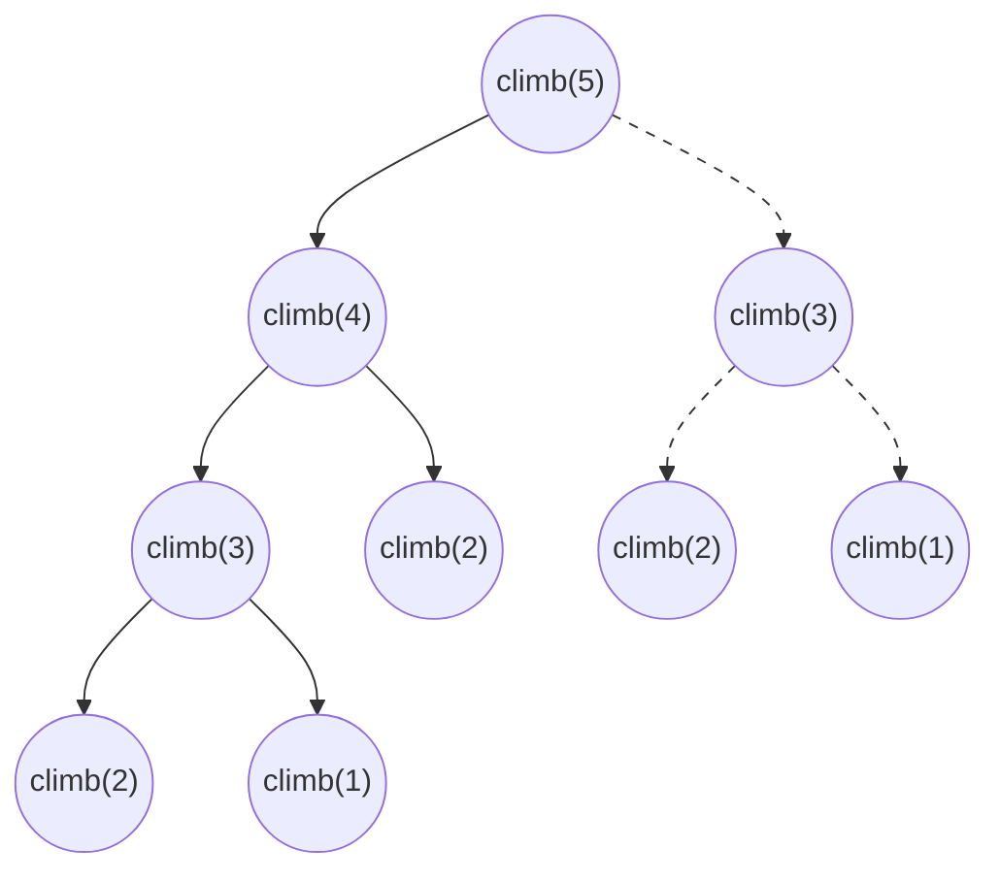

# Dynamic Programming Fundamentals

**Dynamic programming** is a way of solving a problem by solving smaller versions
of the same problem, writing each smaller answer down the first time it is
computed, and reading it back instead of computing it again. That is the whole
idea, and the name is no help in remembering it, because Richard Bellman picked
"dynamic programming" in the 1950s to sound impressive to a government funding
office rather than to describe anything. Read it as **recursion with a notebook**

You have already written the recursion half. A
[tree DFS](../../07_trees/notes/02_dfs.md) asks each child for a fact about its
subtree and combines the two answers, and
[backtracking](../../09_backtracking/notes/01_backtracking_basics.md) tries every
choice at every step and undoes each one. Both explore, and every call in them
does fresh work. Dynamic programming is what you reach for when those
explorations start asking the *same question twice*, which is the moment writing
the answer down beats recomputing it

The notebook is indexed by something, and that index is the vocabulary this
module runs on:

- A **state** is one subproblem, named by whatever information distinguishes it
  from the others. "How many ways are there to reach step 4" is a state, and its
  name is the number 4
- A **transition** is the rule that builds one state's answer out of smaller
  states' answers, such as "the ways to reach step 4 are the ways to reach step 3
  plus the ways to reach step 2"
- A **base case** is a state small enough to answer with no transition at all
- The table, usually called `dp`, is the notebook itself, with one entry per state

Get those four right and the code writes itself. Get the state wrong and no
amount of clever coding rescues it, which is why most of this topic is about
choosing the state

## Two Things A Problem Needs Before Dynamic Programming Helps

**Overlapping subproblems** means the same smaller question comes up more than
once while solving the big one. This is the condition that makes the notebook pay
for itself, because a note you never read back is wasted paper. Merge sort splits
an array into two halves and never asks about the same half twice, so caching its
results buys nothing, and that is exactly why merge sort is called divide and
conquer rather than dynamic programming

**Optimal substructure** means the best answer to the whole problem is built out
of best answers to its parts. It sounds obvious and it is not always true. The
longest path in a graph that visits no node twice does not have it: gluing the
longest simple path from `A` to `B` onto the longest simple path from `B` to `C`
can revisit a node, so the two best pieces do not combine into a legal whole. When
substructure fails, a `dp` entry that stores only the best answer is throwing away
information the larger problem still needs, and the usual fix is to enlarge the
state until the pieces do combine

Both conditions are things to check out loud before writing code, since a problem
that fails the first one wants a different technique entirely

## Counting Stair Climbs, And Why The Recursion Explodes

[Climbing Stairs](https://leetcode.com/problems/climbing-stairs/) is the smallest
honest example. You are at the bottom of a staircase with `n` steps, and each move
takes you up either one step or two. How many distinct sequences of moves reach
the top?

The recursion comes from looking at the **last** move rather than the first. Any
sequence that ends on step `n` got there either by a single step from `n - 1` or
by a double step from `n - 2`, and those two groups share nothing, because they
differ in their final move. So the count for `n` is the count for `n - 1` plus the
count for `n - 2`. One step can be reached one way, and two steps can be reached
two ways, by two singles or one double, which gives the base cases

```python
def climb_naive(n: int) -> int:
    if n <= 2:
        return n
    return climb_naive(n - 1) + climb_naive(n - 2)


assert climb_naive(1) == 1
assert climb_naive(2) == 2
assert climb_naive(3) == 3
assert climb_naive(5) == 8
assert climb_naive(10) == 89
```

This is correct and it is unusable past about 35 steps. Draw what the calls
actually do for `n = 5`, where the dashed subtree is work that has already been
done elsewhere in the picture:



`climb(3)` appears twice and `climb(2)` appears three times, and each duplicate
regrows its entire subtree from scratch. There are only `n` genuinely different
questions here, one per step, and the recursion is asking them an exponential
number of times

Instrumenting the function with a counter shows the shape. `climb_naive(5)` makes
9 calls, `climb_naive(30)` makes 1,664,079, and `climb_naive(35)` makes
18,454,929. Five extra steps multiplied the work by about 11, because each extra
step multiplies it by roughly 1.6, and the answer itself grows at that same rate.
That is the specific failure that hands you the fix: the work is proportional to
the *answer* rather than to the *input*, and the only reason is repetition

## Storing Each Answer The First Time: Memoization

**Memoization** is the direct repair. Keep a dictionary from state to answer, look
in it before doing any work, and write to it before returning. Nothing else about
the recursion changes

```python
def climb_memo(n: int) -> int:
    memo: dict[int, int] = {}

    def ways(step: int) -> int:
        if step <= 2:
            return step
        if step in memo:
            return memo[step]
        memo[step] = ways(step - 1) + ways(step - 2)
        return memo[step]

    return ways(n)


assert climb_memo(1) == 1
assert climb_memo(2) == 2
assert climb_memo(5) == 8
assert climb_memo(45) == 1836311903
```

**The two added lines are the whole technique**:

- `if step in memo: return memo[step]` sits *after* the base cases and *before*
  any recursive call, because a lookup that happens after the recursion has
  already run saves nothing
- `memo[step] = ...` stores the result before returning it, and storing on the
  way out rather than on the way in is what makes the entry final. Every state is
  computed at most once, so the total work drops from "one unit per call" to "one
  unit per distinct state"

Counting calls again makes the change concrete. For `n = 35` the memoized version
makes 67 calls and stores 33 entries, against 18,454,929 calls for the naive one.
The tree is still walked, but every repeated branch is now cut at its root

Here is the order the calls happen in for `n = 6`, with the cache hits marked:

```text
ways(6)   miss, needs ways(5) and ways(4)
ways(5)   miss, needs ways(4) and ways(3)
ways(4)   miss, needs ways(3) and ways(2)
ways(3)   miss, needs ways(2) and ways(1)
ways(2)   base case, returns 2
ways(1)   base case, returns 1
ways(3)   stores 3
ways(2)   base case, returns 2
ways(4)   stores 5
ways(3)   CACHE HIT, returns 3 without recursing        <- subtree discarded
ways(5)   stores 8
ways(4)   CACHE HIT, returns 5 without recursing        <- subtree discarded
ways(6)   stores 13
```

The two cache hits are the interesting lines. Each one is a recursive call that
was about to regrow a whole subtree and instead returned in constant time from the
dictionary. In the naive version the second `ways(3)` would have spawned two more
calls and the second `ways(4)` four more, and on larger inputs those discarded
subtrees are where all the missing time went

Python can supply the dictionary for you. `functools.cache` wraps a function so
that repeated calls with the same arguments return the stored result, which is
fine in an interview as long as you can say what it is doing:

```python
from functools import cache


def climb_cached(n: int) -> int:
    @cache
    def ways(step: int) -> int:
        if step <= 2:
            return step
        return ways(step - 1) + ways(step - 2)

    return ways(n)


assert climb_cached(1) == 1
assert climb_cached(5) == 8
assert climb_cached(45) == 1836311903
```

The decorator only works when the arguments are hashable, so a `list` argument has
to become a `tuple` or an index into a list stored outside the helper. Defining
the cached helper *inside* the outer function also matters, because a `@cache` on
a module-level function keeps its entries between separate test cases and will
happily return an answer computed for a different input

One real limit stays. Memoization is still recursion, so a problem with 100,000
states is 100,000 nested frames, which blows past Python's default recursion limit
of 1000 in the same way a
[deep tree](../../07_trees/notes/02_dfs.md) does. That limit is the main practical
reason to rewrite a memoized solution as a loop

## Choosing What A Table Entry Means

Everything above assumed the state was obvious. It usually is not, and this is the
step that decides whether the rest of the problem is easy or impossible

A state is the **minimum bundle of facts that determines the rest of the answer**.
The test is a question you can ask yourself at the whiteboard: if I told you only
these numbers and nothing about how you got here, could you finish the problem? If
yes, the bundle is a state. If you would need to ask "wait, what did I pick
earlier", the bundle is missing something

Before writing any code, fix four things and say them out loud:

```text
state       what dp[...] means, as one English sentence with no "somehow" in it
transition  which smaller states dp[...] is built from, and how they combine
base case   the states you can answer with no transition
answer      which entry, or which combination of entries, is the final result
```

The state sentence is the one people skip, and it is the one that catches the
error. "`dp[i]` is the answer for `i`" is not a sentence, since it says nothing
about what "the answer" is. "`dp[i]` is the number of distinct ways to reach step
`i`" is, and it immediately tells you the base cases and where the result lives

**Two sentences compete for almost every one-dimensional problem**, and picking
the wrong one is the most common way to lose ten minutes:

- **"using the first `i` items"** makes `dp[i]` a running best over a prefix, so
  the entries never decrease and the answer is the last entry
- **"ending exactly at index `i`"** forces the item at `i` to be used, so entries
  bounce up and down and the answer is the maximum over the whole table

[House Robber](https://leetcode.com/problems/house-robber/) wants the first,
because you are free to skip the last house.
[Longest Increasing Subsequence](https://leetcode.com/problems/longest-increasing-subsequence/)
wants the second, because a subsequence has to end somewhere and each ending needs
its own entry before you can extend it

```python
def rob(nums: list[int]) -> int:
    n = len(nums)
    if n == 0:
        return 0
    dp = [0] * (n + 1)  # dp[i] = most money from the first i houses
    dp[1] = nums[0]
    for i in range(2, n + 1):
        dp[i] = max(dp[i - 1], dp[i - 2] + nums[i - 1])
    return dp[n]


def length_of_lis(nums: list[int]) -> int:
    if not nums:
        return 0
    dp = [1] * len(nums)  # dp[i] = longest increasing subsequence ending at i
    for i in range(len(nums)):
        for j in range(i):
            if nums[j] < nums[i]:
                dp[i] = max(dp[i], dp[j] + 1)
    return max(dp)


assert rob([1, 2, 3, 1]) == 4
assert rob([2, 7, 9, 3, 1]) == 12
assert rob([5]) == 5
assert rob([]) == 0
assert length_of_lis([10, 9, 2, 5, 3, 7, 101, 18]) == 4
assert length_of_lis([0, 1, 0, 3, 2, 3]) == 4
assert length_of_lis([7, 7, 7, 7]) == 1
assert length_of_lis([]) == 0
```

The two endings are the tell. `rob` returns `dp[n]` because a prefix state already
folds in every skip, while `length_of_lis` returns `max(dp)` because the longest
subsequence may end in the middle of the array and `dp[-1]` only knows about
subsequences forced to end at the last element. Returning `dp[-1]` from an
"ending at `i`" table is a bug that passes the first example and fails the second

**A state that is missing information** is the other standard failure, and it looks
like a correct solution that is quietly wrong on some inputs. In
[Maximum Product Subarray](https://leetcode.com/problems/maximum-product-subarray/),
a single "best product ending here" entry is not enough, because multiplying by a
negative number turns the *worst* product into the best one, so the state has to
carry a pair of a maximum and a minimum. In the stock problems with a cooldown or a
fee, an index alone cannot say whether you are currently holding a share, so the
state grows a second dimension for that flag. Both are the same repair: when the
transition needs a fact the state does not carry, put the fact in the state

Enlarging the state is not free, since the number of entries is what you pay in
time and space, so add a dimension only when you can name the transition that
needed it. These are the shapes that cover nearly every problem in this module:

```text
dp[i]              one index      House Robber, Decode Ways, Word Break
dp[r][c]           grid cell      Unique Paths, Minimum Path Sum, Maximal Square
dp[i][cap]         item + budget  Partition Equal Subset Sum, Coin Change II
dp[i][j]           two sequences  Longest Common Subsequence, Edit Distance
dp[i][j]           a span i..j    Longest Palindromic Substring, Burst Balloons
dp[i][flag]        index + mode   stock problems with holding or cooldown
```

## Filling The Table Forward Instead Of Recursing Backward

Memoization is **top-down**: it starts at the answer you want and recurses toward
the base cases, filling entries in whatever order the recursion happens to reach
them. **Tabulation** is **bottom-up**: it starts at the base cases and fills the
table forward with a loop, so that by the time any entry is written, everything it
reads has already been written

The translation is mechanical once the four things are fixed. Allocate an array
indexed by state, write the base cases into it, loop over the states in an order
that respects the transition, and return the answer entry

```python
def climb_table(n: int) -> int:
    if n <= 2:
        return n
    dp = [0] * (n + 1)
    dp[1] = 1
    dp[2] = 2
    for step in range(3, n + 1):
        dp[step] = dp[step - 1] + dp[step - 2]
    return dp[n]


assert climb_table(1) == 1
assert climb_table(2) == 2
assert climb_table(5) == 8
assert climb_table(45) == 1836311903
```

`dp` is sized `n + 1` rather than `n` so that `dp[step]` means "step number
`step`" with no off-by-one arithmetic in the loop, and index 0 is left unused.
Paying one wasted slot to make the index mean the obvious thing is almost always
the right trade

**The loop order is the part that has to be argued.** The transition reads
`dp[step - 1]` and `dp[step - 2]`, both of which are smaller than `step`, so
ascending order is safe. Get this backwards and you read zeros instead of answers,
which produces a wrong result rather than an error

In two dimensions the same argument has two directions to satisfy. In
[Unique Paths](https://leetcode.com/problems/unique-paths/), a robot at the top
left of an `m` by `n` grid moves only right or down, and `dp[r][c]` is the number
of distinct paths to that cell. Each cell is entered from above or from the left,
so `dp[r][c] = dp[r - 1][c] + dp[r][c - 1]`, and the whole top row and left column
are 1 because there is exactly one way to walk along an edge

```text
        c=0   c=1   c=2   c=3
r=0      1     1     1     1
                     |
                     v
r=1      1     2 --> 3     4
                     |
                     v
r=2      1     3     6    10

dp[2][2] = dp[1][2] + dp[2][1] = 3 + 3 = 6
```

Row by row from the top, left to right within each row, is one valid order,
because it guarantees the cell above and the cell to the left are already filled
when the arrows are followed. Column by column would work equally well. What does
not work is filling the bottom row first, since every one of its cells would read
an empty cell above it

## Top-Down Or Bottom-Up

Both give the same answers, so the choice is about the problem and about you

|                  | Memoization (top-down)                                                               | Tabulation (bottom-up)                                            |
| ---------------- | ------------------------------------------------------------------------------------ | ----------------------------------------------------------------- |
| How you write it | write the recursion, then add two lines                                              | design the fill order, then write the loop                        |
| States visited   | only the ones actually reachable from the goal, which can be far fewer               | all of them, whether or not the answer needs them                 |
| Order            | handled for you by the recursion                                                     | your responsibility, and wrong order gives wrong answers silently |
| Depth            | one frame per state on the current chain, so it can exceed Python's 1000-frame limit | no recursion at all                                               |
| Space trimming   | hard, since the cache is a dictionary                                                | easy, since you can drop rows you will not read again             |

In an interview, deriving the recursion first and adding `@cache` is the faster
path to a working solution, and it is also easier to narrate, because the
recurrence is the thing the interviewer wants to hear. Convert to a table
afterwards if the state count is large enough that recursion depth is a real risk,
or if you are asked to reduce the space

## Keeping Only The Rows You Still Need

The table for climbing stairs is `n` entries long, and the transition never looks
back further than two. Everything before `step - 2` is dead the moment it is read
for the last time, so there is no reason to keep it

```python
def climb_rolling(n: int) -> int:
    one_back, two_back = 1, 0
    for _ in range(n):
        one_back, two_back = one_back + two_back, one_back
    return one_back


assert climb_rolling(1) == 1
assert climb_rolling(2) == 2
assert climb_rolling(5) == 8
assert climb_rolling(45) == 1836311903
```

The tuple assignment is doing real work, since both new values are computed from
the old pair before either name is rebound. Writing it as two separate statements
overwrites `one_back` first and then feeds the *new* value into `two_back`, which
silently computes something else

The same trick scales up. A grid DP whose transition reads only the row above can
keep one row of length `n` instead of the full `m` by `n` table, which turns
`O(m * n)` space into `O(n)`. Once a single row is being overwritten in place, the
direction of the inner loop starts to change the meaning of the entries, which is
the subtlety [knapsack](04_knapsack.md) deals with in detail

Do this last. Rolling variables destroy the table, so any follow-up that asks you
to reconstruct *which* choices produced the answer needs the full table back. Get
the plain version correct and stated, then offer the space reduction as an
improvement

## Counting States To Get The Cost

Dynamic programming complexity is a multiplication rather than an analysis:

```text
time  = number of states  ×  work done per transition
space = number of states stored  (+ the recursion depth if it is top-down)
```

Climbing stairs has `n` states and each transition adds two numbers, so it is
`O(n)` time. Unique Paths has `m * n` states and each adds two numbers, so it is
`O(m * n)`. Coin Change over a target of `amount` with `c` denominations has
`amount` states and tries every coin at each one, so it is `O(amount * c)`

The multiplication is also how you check a state design before committing to it.
If a proposed state has `2^n` values, as it does when you try to remember the exact
set of items used, the DP is exponential and the state is wrong for a large input,
which is the argument that pushes you toward remembering only the *sum* of the
items instead of the set

## Worked Example: [Coin Change](https://leetcode.com/problems/coin-change/)

Given a list of coin denominations and a target amount, return the fewest coins
that add up to exactly that amount. You have an unlimited supply of every
denomination, and if no combination reaches the amount you return `-1`

**Input**:

- `coins`, a `list[int]` of distinct denominations, with between 1 and 12 entries,
  each at least 1
- `amount`, an `int` between 0 and 10,000, the total the coins must sum to exactly

**Output**: an `int`, the smallest number of coins whose values sum to `amount`,
or `-1` when no combination of the available denominations sums to it. The count
is of coins used, not of denominations used, so the same coin may be counted many
times. An `amount` of 0 is reachable with zero coins, so the answer there is 0
rather than `-1`

The phrase "fewest" over "unlimited supply" is the signal for an optimization DP
over the amount. The tempting cheap idea is to take the largest coin that still
fits, over and over, which is fast and wrong. With `coins = [1, 3, 4]` and
`amount = 6`, that rule takes a 4, then cannot use another 4, so it takes two 1s
and reports 3 coins, while `3 + 3` does it in 2. The largest coin is not always in
the best answer, so every denomination has to be tried at every amount, and trying
them recursively re-asks the same "how do I make 3" question on many different
branches, which is the overlap that makes this a DP

> "I will define `dp[t]` as the fewest coins that make exactly `t`. For each `t` I
> try every coin that fits and take `dp[t - coin] + 1`, the best way to make the
> rest plus this one coin. `dp[0]` is 0, and any amount I cannot make stays at an
> impossible marker so it never gets chosen."

1. Define the state as one number, the amount still to be made, since nothing
   about which coins were already spent changes how to make the rest. That is the
   whole reason a single index suffices here rather than an index per coin
2. Set `dp[0] = 0`, because making zero takes zero coins, and this is the base case
   every other entry eventually bottoms out on
3. Fill every other entry with a marker meaning unreachable. Use `amount + 1`
   rather than infinity, because no real answer can exceed `amount` coins, since
   the smallest possible coin is 1, so any entry still holding `amount + 1` at the
   end is provably unreachable and the comparison stays in plain integers
4. Loop `t` from 1 up to `amount`, so that every entry a transition reads is
   already final. Each `dp[t - coin]` is strictly smaller than `t` because every
   coin is at least 1
5. For each `t`, try every coin. Skip a coin larger than `t`, since spending it
   would overshoot into a negative amount. Otherwise the candidate is
   `dp[t - coin] + 1`, meaning make the remainder the best way already known and
   add this one coin, and keep it only if it beats what `dp[t]` already holds
6. An unreachable remainder needs no special case. `dp[t - coin]` is `amount + 1`
   there, so the candidate is at least `amount + 2`, which never wins against the
   marker and never wins against a real answer
7. At the end, return `dp[amount]`, unless it is still above `amount`, which means
   nothing ever improved it and the target is unreachable, so return `-1`

```python
def coin_change(coins: list[int], amount: int) -> int:
    dp = [0] + [amount + 1] * amount  # dp[t] = fewest coins summing to exactly t
    for target in range(1, amount + 1):
        for coin in coins:
            if coin <= target:
                dp[target] = min(dp[target], dp[target - coin] + 1)
    return -1 if dp[amount] > amount else dp[amount]


assert coin_change([1, 2, 5], 11) == 3
assert coin_change([2], 3) == -1
assert coin_change([1], 0) == 0
assert coin_change([1, 3, 4], 6) == 2
assert coin_change([2, 5], 0) == 0
```

Tracing `coins = [1, 3, 4]` and `amount = 6` shows every candidate that was
considered and what happened to it:

```text
t=1   coin 1: dp[0]+1 = 1  take     coin 3: skip, 3 > 1     coin 4: skip, 4 > 1
t=2   coin 1: dp[1]+1 = 2  take     coin 3: skip, 3 > 2     coin 4: skip, 4 > 2
t=3   coin 1: dp[2]+1 = 3  take     coin 3: dp[0]+1 = 1 take  coin 4: skip, 4 > 3
t=4   coin 1: dp[3]+1 = 2  take     coin 3: dp[1]+1 = 2 REJECT  coin 4: dp[0]+1 = 1 take
t=5   coin 1: dp[4]+1 = 2  take     coin 3: dp[2]+1 = 3 REJECT  coin 4: dp[1]+1 = 2 REJECT
t=6   coin 1: dp[5]+1 = 3  take     coin 3: dp[3]+1 = 2 take    coin 4: dp[2]+1 = 3 REJECT

final dp = [0, 1, 2, 1, 1, 2, 2]
```

Two of the rejections are ties, where the candidate equalled the current entry and
`min` correctly kept what was there: coin 3 at `t = 4`, and coin 4 at `t = 5`.
Coin 3 at `t = 5` is a genuine loss, since `dp[2] + 1` is 3 against an entry of 2.
The one at `t = 6` is the interesting one: using a 4 leaves a remainder of 2,
which needs two 1-coins, for 3 coins in total, and it loses to spending a 3, whose
remainder of 3 is one `dp[3]` already makes with a single coin, for 2 in total.
That is the same comparison the greedy rule got wrong, and the table gets it right
because `dp[2]` and `dp[3]` were both already settled before `t = 6` was touched

- **Time Complexity:** `O(amount * c)` where `c` is the number of denominations,
  because there is one state per amount from 1 to `amount` and each state tries
  every coin once, doing constant work per coin
- **Space Complexity:** `O(amount)` for the table, because one entry is stored per
  amount and nothing else is allocated. It cannot be rolled down to a few
  variables, since a transition can read as far back as the largest coin

## Time and Space Complexity

**Counting the ways to climb `n` stairs**

| Approach           | Time                                                                                                                                                               | Space                                                                                                                           |
| ------------------ | ------------------------------------------------------------------------------------------------------------------------------------------------------------------ | ------------------------------------------------------------------------------------------------------------------------------- |
| Plain recursion    | `O(1.6^n)`: the call count grows at the same rate as the answer, since almost every call is a duplicate, measured as 9 calls at `n = 5` and 18,454,929 at `n = 35` | `O(n)`: no table, but the call stack holds one frame per step on the current chain down to the base case                        |
| Memoized recursion | `O(n)`: there are `n` distinct states and each is computed once, with each computation adding two cached numbers                                                   | `O(n)`: `n` dictionary entries plus `O(n)` call frames, because the first descent reaches the base case before anything returns |
| Tabulation         | `O(n)`: one loop iteration per state doing constant work                                                                                                           | `O(n)`: the array of `n + 1` entries, with no recursion at all                                                                  |
| Rolling variables  | `O(n)`: the same loop, unchanged                                                                                                                                   | `O(1)`: two integers, because the transition never reads further back than two steps                                            |

**Coin Change over a target of `amount` with `c` denominations**

| Approach                   | Time                                                                                                                                                        | Space                                                                                                                         |
| -------------------------- | ----------------------------------------------------------------------------------------------------------------------------------------------------------- | ----------------------------------------------------------------------------------------------------------------------------- |
| Recursion with no cache    | exponential: the tree branches `c` ways at every node and is up to `amount` deep when a 1-coin exists, and the same remainders recur on nearly every branch | `O(amount)`: the recursion depth, which is at most one frame per unit of the target                                           |
| Tabulation over the amount | `O(amount * c)`: `amount` states, each trying all `c` coins with constant work per coin                                                                     | `O(amount)`: one table entry per amount, and a transition can read back as far as the largest coin, so nothing can be dropped |

The general rule those tables are instances of is that the time is the number of
states multiplied by the work per transition, and the space is the number of
states stored, plus the recursion depth when the solution is top-down

## Summary

- **Dynamic programming** solves a problem by solving smaller versions of the same
  problem and storing each smaller answer the first time it is computed, so it is
  never computed twice. Treat the name as meaningless and think of it as recursion
  with a notebook
  - It is worth using only when the same subproblem is asked repeatedly. That
    condition is called **overlapping subproblems**, and without it a cache is
    written and never read, which is why merge sort is not dynamic programming
  - It also needs **optimal substructure**, meaning the best whole answer is built
    from best answers to the parts. Longest simple path in a graph fails this,
    since two best halves can revisit a node and not form a legal path
- Four things have to be pinned down before any code, and saying them out loud is
  the fastest way to catch a bad design: what one `dp` entry **means** as an English
  sentence, the **transition** that builds it from smaller entries, the **base
  cases** that need no transition, and **where the final answer lives**
  - A **state** is the minimum bundle of facts that determines the rest of the
    answer. If finishing the problem would require knowing what you picked earlier,
    the state is missing that fact and has to grow a dimension
  - "Best using the first `i` items" and "best ending exactly at index `i`" are
    different states with different answer extractions. House Robber is the first
    and returns `dp[n]`; Longest Increasing Subsequence is the second and returns
    `max(dp)`, since the winning subsequence can end anywhere
  - Growing the state costs time and space directly, so add a dimension only when
    you can name the transition that needed it, as with the maximum-and-minimum
    pair in Maximum Product Subarray or the holding flag in the stock problems
- **Memoization** is top-down: write the natural recursion, then check a cache
  before doing work and store the result before returning. Those two lines are the
  entire change, and the check must come after the base cases and before any
  recursive call
  - `functools.cache` supplies the dictionary, but it needs hashable arguments and
    should be applied to a helper defined inside the function, or its entries leak
    between separate inputs
  - It is still recursion, so a problem with 100,000 states nests 100,000 frames
    and hits Python's default limit of 1000, which is the usual reason to rewrite
    it as a loop
- **Tabulation** is bottom-up: allocate the table, write the base cases, and loop
  over the states in an order where everything a transition reads is already final
  - The loop order is a claim you have to be able to defend. Climbing stairs goes
    upward because it reads `step - 1` and `step - 2`, and a grid goes top to
    bottom and left to right because each cell reads the one above and the one to
    its left. A wrong order reads zeros and produces a wrong answer with no error
- Space often collapses once the plain version is correct, because a transition
  that looks back only a fixed distance makes older entries dead. Climbing stairs
  becomes two integers, and a grid DP that reads only the row above becomes one row
  - Do it last, and remember that discarding the table also discards the ability
    to reconstruct which choices produced the answer, which is a common follow-up
- The cost is always **the number of states multiplied by the work per
  transition**, with space equal to the number of stored states plus the recursion
  depth when the solution is top-down
  - Climbing stairs is `n` states and constant work, so `O(n)`. Unique Paths is
    `m * n` states and constant work. Coin Change is `amount` states each trying
    `c` coins, so `O(amount * c)`
  - The same multiplication is how you reject a state design early, since a state
    that remembers an exact subset has `2^n` values and is exponential before a
    line is written
- The mistakes that cost the most time are coding before the state sentence is
  finished, returning `dp[-1]` from an "ending at `i`" table when the answer is
  `max(dp)`, filling a table in an order whose dependencies are not ready, and
  optimizing the space before the ordinary version is known to be correct

## Interview Checklist

Before writing code, make sure you can answer each of these

```text
Is the same subproblem really asked more than once, or is this divide and conquer?
Can I finish the sentence "dp[...] is the ..." without using the word somehow?
Is my state "using the first i" or "ending exactly at i", and which answer does that imply?
Does the transition ever need a fact my state does not carry, such as a sign or a flag?
What are the base cases, and does the unreachable or impossible case have a marker?
Where does the final answer live: the last entry, the max over the table, or a combination?
In what order can I fill this so every entry a transition reads is already final?
How many states are there, and what is the work per transition, and what is their product?
Is the number of states exponential in the input, which means the state is wrong?
Could this need 10^5 nested frames, so a memoized recursion has to become a loop?
Have I got the plain table correct before trying to roll it into a few variables?
```
