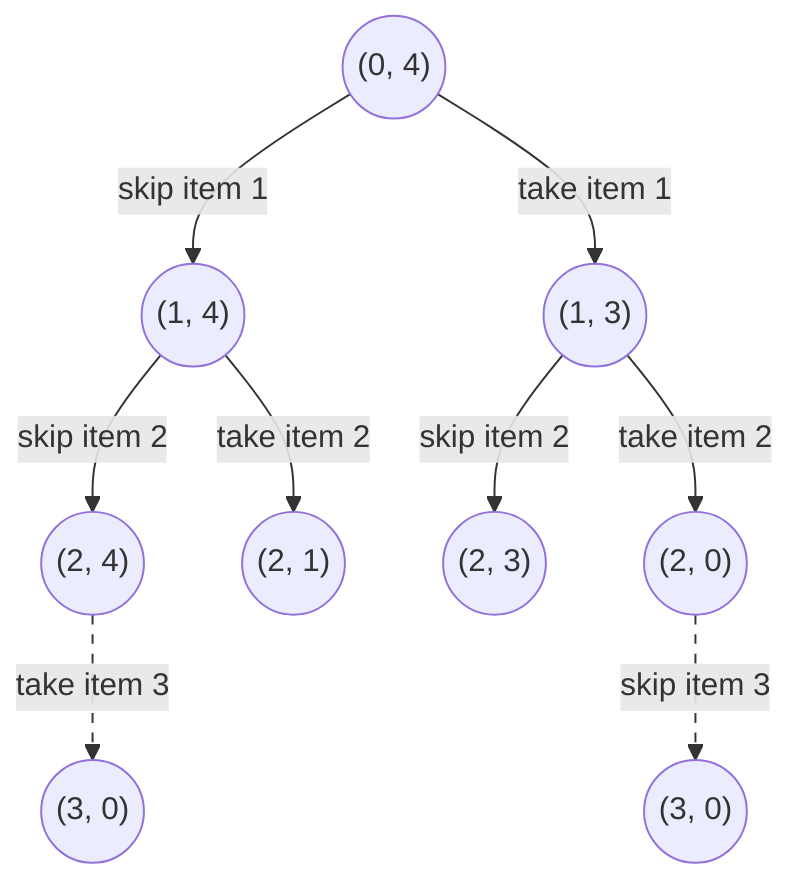

# Knapsack: Dynamic Programming Under A Budget

A **knapsack problem** hands you a collection of items, each with a **weight** and
a **value**, plus a bag that can carry only so much total weight. That limit is
the **capacity**. You choose which items to put in, and you want the most total
value that still fits. The name is literal, since the original phrasing really was
about packing a bag

Every dynamic programming problem so far has been indexed by position. In
[1D DP](02_1d_dp.md) the state was one index into the array, and in
[grid DP](03_2d_grid_dp.md) it was a row and a column. Knapsack breaks that,
because knowing which item you are looking at tells you nothing about whether you
can afford it. Two people standing at item 5 are in completely different
situations if one of them has 3 kilograms of room left and the other has 30. The
budget is a fact the transition needs, so by the rule from
[the fundamentals topic](01_dp_fundamentals.md) the budget has to live in the
state

That gives the shape the whole module section is named after:

```text
dp[i][cap]   the best you can do considering only the first i items,
             if the bag you were handed held cap
```

The second index is the surprising part. You are not solving the problem for the
bag you were given. You are solving it for **every smaller bag at the same time**,
from an empty one up to the real one, because when you decide to take an item you
immediately need the answer for a bag that is smaller by that item's weight

Two versions of the problem come up, and they differ by one word:

- **0/1 knapsack** gives you one copy of each item, so each item is either in the
  bag or out of it, which is where the name comes from
- **Unbounded knapsack** gives you unlimited copies of each item, so the same item
  can be used many times

They share a table and differ by the **direction of one loop**, which is the
single most valuable thing in this topic to get right

## Why Filling The Bag By Value Per Kilogram Picks The Wrong Items

The tempting cheap idea is to rank items by how much value they carry per unit of
weight and grab them in that order until nothing else fits. It is fast, it feels
principled, and it is wrong

```text
capacity 50

item      weight   value   value per unit
A             10      60              6.0
B             20     100              5.0
C             30     120              4.0
```

The ranking says take A, then B, which uses 30 of the 50 and leaves 20 of room. C
weighs 30, so it does not fit, and the total is 160. But B and C together weigh
exactly 50 and are worth 220, which beats it by a wide margin. The greedy rule
lost because taking A used up 10 units of room that the better combination needed,
and by the time that becomes visible A is already in the bag

The failure is specific, and it is the whole reason a single pass of "always grab
the best-looking item" cannot work here. Whether an item belongs in the answer
depends on what the *remaining* capacity can then be filled with, and no ranking
fixed in advance can know that. So both possibilities have to be explored for every
item, and the exploration has to remember the capacity it is exploring under

## Take It Or Leave It, And How Much Room Is Left

Look at one item at a time and ask the only two questions available. Either the
item stays out, and you face the remaining items with the same room you had, or
the item goes in, and you face the remaining items with that much less room and
that much more value banked. The better of those two is the answer

```text
best(i, room) = max( best(i + 1, room),                          skip item i
                     values[i] + best(i + 1, room - weights[i]) )   take item i
```

The take branch is only legal when `weights[i] <= room`, since a bag cannot hold a
negative amount. When you run out of items there is nothing left to gain, so
`best(n, room)` is 0 for every `room`, which is the base case

Draw the top of that recursion for the items `(1, 15)`, `(3, 20)`, and `(4, 30)`
written as weight and value, with a capacity of 4. Each node is a state written as
`(item index, room left)`, and most branches are cut off to keep the picture small:



The two dashed edges land on the same state `(3, 0)` by different routes. The left
one skipped both cheap items and then spent the whole bag on the weight-4 item,
while the right one took the weight-1 and weight-3 items and had no room left for
the third. Both arrive with the same question remaining, so the second one to get
there is redoing settled work. That is the overlap that makes caching pay, and it
multiplies fast, because a tree that branches twice per item has `2^n` leaves while
there are only `n` items and `capacity + 1` possible values of `room`

```python
from functools import cache


def knapsack(weights: list[int], values: list[int], capacity: int) -> int:
    n = len(weights)

    @cache
    def best(i: int, room: int) -> int:
        if i == n:
            return 0
        skip = best(i + 1, room)
        if weights[i] > room:
            return skip
        take = values[i] + best(i + 1, room - weights[i])
        return max(skip, take)

    return best(0, capacity)


assert knapsack([10, 20, 30], [60, 100, 120], 50) == 220
assert knapsack([1, 3, 4], [15, 20, 30], 4) == 35
assert knapsack([5], [99], 4) == 0
assert knapsack([], [], 10) == 0
```

The first assert is the case the ratio rule got wrong, and it now returns 220. The
third one is the edge case worth stating out loud, since an item heavier than the
whole bag must never be taken, and the `weights[i] > room` guard is what enforces
that

The state carries `room` rather than the set of items already chosen, and that
choice is the whole algorithm. A set of chosen items has `2^n` possible values, so
a cache keyed on it would almost never hit, while `room` has only `capacity + 1`
values. The two are interchangeable for deciding what to do next, because the only
thing past choices do to the future is consume space, and the sum they consumed is
all of that information. Noticing that a fat piece of history collapses into one
small number is what turns an exponential search into a polynomial one, and it is
worth saying in exactly those words

## Filling The Grid Of Items Against Capacities

Turning that into a table is mechanical. One row per item processed, one column
per capacity, filled top to bottom so that every entry a row reads has already
been written by the row above

```python
def knapsack_table(weights: list[int], values: list[int], capacity: int) -> int:
    n = len(weights)
    dp = [[0] * (capacity + 1) for _ in range(n + 1)]  # dp[i][cap] = best from first i items
    for i in range(1, n + 1):
        weight, value = weights[i - 1], values[i - 1]
        for cap in range(capacity + 1):
            dp[i][cap] = dp[i - 1][cap]
            if weight <= cap:
                dp[i][cap] = max(dp[i][cap], value + dp[i - 1][cap - weight])
    return dp[n][capacity]


assert knapsack_table([10, 20, 30], [60, 100, 120], 50) == 220
assert knapsack_table([1, 3, 4], [15, 20, 30], 4) == 35
assert knapsack_table([5], [99], 4) == 0
assert knapsack_table([], [], 10) == 0
```

Row 0 is all zeros because zero items are worth nothing whatever the bag holds,
and column 0 is all zeros because a bag with no room holds nothing. Here is the
finished table for weights `[1, 3, 4]`, values `[15, 20, 30]`, and a capacity of 4:

```text
             cap:  0    1    2    3    4
i=0  no items      0    0    0    0    0
i=1  w=1 v=15      0   15   15   15   15
                        ^              ^
                        |              |
i=2  w=3 v=20      0   15   15   20   35
i=3  w=4 v=30      0   15   15   20   35

dp[2][4] = max( dp[1][4],           skip item 2, giving 15
                20 + dp[1][4 - 3])  take item 2, giving 20 + 15 = 35
         = 35
```

The two marked cells are the only two the write to `dp[2][4]` looks at. The one
directly above is the skip branch, which copies the answer down unchanged because
not taking an item changes nothing about what the earlier items could do. The one
three columns to the left is the take branch, and it sits three columns over
because the item weighs 3, so it banks its value of 20 on top of the best a bag of
size 1 could already hold. Every cell in the table is one of those two candidates
winning

The last row is identical to the one above it, which is the weight-4 item losing
everywhere. It is worth 30 on its own, and at capacity 4 the two cheaper items
together are already worth 35

## One Row Instead Of The Whole Grid

Look at which cells row `i` actually reads. It reads `dp[i - 1][cap]` and
`dp[i - 1][cap - weight]`, both from the row directly above, and it never looks at
row `i - 2` or higher. As the fundamentals topic put it, everything older than the
previous row is dead, so a single row of `capacity + 1` numbers is enough if that
row is overwritten in place

Overwriting in place creates a problem the grid version did not have. Halfway
through processing an item, the row is a mixture: the cells already visited hold
new values that include this item, and the cells not yet visited still hold old
values from before it. Whether a transition reads a fresh cell or a stale one now
depends entirely on the direction of the sweep

For 0/1 knapsack you need the stale value, because `dp[cap - weight]` has to mean
"the best without this item". Since `cap - weight` is always to the **left** of
`cap`, sweeping from high capacity down to low guarantees the left-hand cell has
not been touched yet on this item's pass

```python
def knapsack_rolling(weights: list[int], values: list[int], capacity: int) -> int:
    dp = [0] * (capacity + 1)  # dp[cap] = best from the items processed so far
    for weight, value in zip(weights, values):
        for cap in range(capacity, weight - 1, -1):
            dp[cap] = max(dp[cap], value + dp[cap - weight])
    return dp[capacity]


def knapsack_ascending_bug(weights: list[int], values: list[int], capacity: int) -> int:
    dp = [0] * (capacity + 1)
    for weight, value in zip(weights, values):
        for cap in range(weight, capacity + 1):
            dp[cap] = max(dp[cap], value + dp[cap - weight])
    return dp[capacity]


assert knapsack_rolling([10, 20, 30], [60, 100, 120], 50) == 220
assert knapsack_rolling([1, 3, 4], [15, 20, 30], 4) == 35
assert knapsack_rolling([], [], 10) == 0

# one item of weight 3 and value 4, in a bag of capacity 6
assert knapsack_rolling([3], [4], 6) == 4
assert knapsack_ascending_bug([3], [4], 6) == 8
```

The last two asserts are the entire lesson. With one item available, the honest
answer is 4, and the ascending version reports 8 because it used that single item
twice. Sweeping upward, `dp[3]` becomes 4, and then `dp[6]` reads `dp[3]`, which
already contains the item, and adds the item again

Two details in `range(capacity, weight - 1, -1)` are easy to get wrong. It stops at
`weight` rather than 0, because a capacity below the item's weight cannot fit it
and the transition would index negatively, which in Python wraps around to the far
end of the list and silently produces nonsense instead of an error. The `- 1` is
there because the stop value of `range` is exclusive, so `weight - 1` is what makes
`weight` itself the last capacity visited

## Tracing The Backward Sweep

Weights `[1, 3, 4]`, values `[15, 20, 30]`, capacity 4, one line per capacity the
sweep touches:

```text
start                dp = [0, 0, 0, 0, 0]

item w=1 v=15
  cap=4   15 + dp[3]=0  -> 15  beats 0    take
  cap=3   15 + dp[2]=0  -> 15  beats 0    take
  cap=2   15 + dp[1]=0  -> 15  beats 0    take
  cap=1   15 + dp[0]=0  -> 15  beats 0    take
                     dp = [0, 15, 15, 15, 15]

item w=3 v=20
  cap=4   20 + dp[1]=15 -> 35  beats 15   take
  cap=3   20 + dp[0]=0  -> 20  beats 15   take
  cap=2 and cap=1 are never visited, both being below this item's weight
                     dp = [0, 15, 15, 20, 35]

item w=4 v=30
  cap=4   30 + dp[0]=0  -> 30  loses to 35   REJECTED
                     dp = [0, 15, 15, 20, 35]

answer dp[4] = 35
```

The rejected step at the end is the one to study. Taking the weight-4 item fills
the bag completely and leaves room for nothing else, so its candidate value is its
own 30, and that loses to the 35 already sitting in `dp[4]` from combining the
weight-1 and weight-3 items. `max` keeps the old entry, and because the item was
rejected at capacity 4 it is rejected everywhere, which is why the row does not
change at all

The step above it shows the backward sweep earning its keep. At `cap = 4` the
weight-3 item read `dp[1]`, and `dp[1]` still held 15 from the *previous* item
rather than anything this item had written, which is what makes 35 mean "one
weight-1 item and one weight-3 item". The same read in the single-item case
`knapsack_ascending_bug([3], [4], 6)` above goes the other way, where `dp[6]` reads
a `dp[3]` the sweep has already filled with this very item and reports 8 for an
item you only own one of

## Sweeping Forward When Every Item Is Unlimited

The ascending sweep is not only a bug. It is exactly the algorithm you want when
copies are unlimited, because "the smaller answer I am reading may already contain
this item" is precisely what unbounded means

```python
def unbounded_knapsack(weights: list[int], values: list[int], capacity: int) -> int:
    dp = [0] * (capacity + 1)
    for weight, value in zip(weights, values):
        for cap in range(weight, capacity + 1):
            dp[cap] = max(dp[cap], value + dp[cap - weight])
    return dp[capacity]


assert unbounded_knapsack([3], [4], 6) == 8
assert unbounded_knapsack([1, 3, 4], [15, 20, 30], 4) == 60
assert unbounded_knapsack([5], [99], 4) == 0
assert unbounded_knapsack([], [], 10) == 0
```

The second assert is the same three items as before, and the answer jumps from 35
to 60 because four copies of the weight-1 item now beat any mix. Nothing changed
except the direction of `range`

You have already written an unbounded knapsack without it being called that.
[Coin Change](https://leetcode.com/problems/coin-change/), solved in full in
[the fundamentals topic](01_dp_fundamentals.md), is this table with the values
replaced by a count of 1 per coin and `max` replaced by `min`. The coins are items
of unlimited supply, the amount is the capacity, and the loop over amounts runs
upward for exactly the reason above. That is why the same table appears there with
the two loops written in the opposite nesting order, which is legal for
maximization and minimization and is emphatically not legal for counting, as the
next two sections show

## Counting Ways Instead Of Keeping The Best

Swap `max` for `+` and the same table counts instead of optimizes. The optimizing
version asked which of skip and take is better. The counting version observes that
every way of reaching a total either uses this item or does not, and that those two
groups share nothing, so the count is their sum rather than their maximum

[Coin Change II](https://leetcode.com/problems/coin-change-ii/) asks how many
distinct combinations of coins add up to an amount, where two combinations are the
same if they use the same multiset of coins regardless of order

```python
def change(amount: int, coins: list[int]) -> int:
    dp = [0] * (amount + 1)  # dp[t] = combinations making exactly t
    dp[0] = 1
    for coin in coins:
        for total in range(coin, amount + 1):
            dp[total] += dp[total - coin]
    return dp[amount]


assert change(5, [1, 2, 5]) == 4
assert change(3, [2]) == 0
assert change(0, [7]) == 1
assert change(10, [10]) == 1
```

`dp[0] = 1` is the base case that carries the whole thing, and it says there is
exactly one way to make nothing, namely by taking no coins. Setting it to 0 makes
every entry 0 forever, since nothing ever has a nonzero source to add. The
`change(0, [7]) == 1` assert pins that down, and an interviewer will ask about it

Watch the row after each coin is folded in, with `amount = 5` and
`coins = [1, 2, 5]`:

```text
                 t=0  1  2  3  4  5
start              1  0  0  0  0  0
after coin 1       1  1  1  1  1  1
after coin 2       1  1  2  2  3  3
after coin 5       1  1  2  2  3  4
```

The `after coin 1` line says every total has exactly one way when 1 is the only
coin available, which is right. Once the 2 is folded in, `dp[4]` is 3, counting
`1+1+1+1`, `2+1+1`, and `2+2`. The coin 5 is large enough to touch only `dp[5]`,
where it adds the single-coin solution, and that last increment is where the answer
of 4 comes from

## Combinations Or Ordered Sequences: The Loop Order Decides

[Combination Sum IV](https://leetcode.com/problems/combination-sum-iv/) looks
identical to Coin Change II and is not, because it counts `1 + 2` and `2 + 1` as
two different answers. Its name is misleading, since it is counting ordered
sequences rather than combinations

The code is the same three lines with the two loops swapped, and that swap is the
entire difference:

```python
def combination_sum4(nums: list[int], target: int) -> int:
    dp = [0] * (target + 1)  # dp[t] = ordered sequences summing to t
    dp[0] = 1
    for total in range(1, target + 1):
        for num in nums:
            if num <= total:
                dp[total] += dp[total - num]
    return dp[target]


assert combination_sum4([1, 2, 3], 4) == 7
assert combination_sum4([1, 2], 3) == 3
assert combination_sum4([3], 3) == 1
assert combination_sum4([9], 3) == 0
```

With `nums = [1, 2]` and a target of 3, this returns 3 for `1+1+1`, `1+2`, and
`2+1`, while `change(3, [1, 2])` returns 2 because it treats the last two as the
same combination

**Why the nesting decides it**:

- **Item on the outside** means each coin is considered once, for all totals, and
  then never revisited. A solution is therefore built in a fixed coin order, so
  `2+1` can never be constructed after the 1 has already been processed, and each
  multiset is counted exactly once
- **Total on the outside** means every total independently tries every item as its
  *last* element. Sequences ending in 1 and sequences ending in 2 are counted
  separately, which is exactly what ordering means

The trace makes the second one visible. With `nums = [1, 2]` and a target of 3,
each row is one complete total rather than one complete item:

```text
                 t=0  1  2  3
start              1  0  0  0
after t=1          1  1  0  0     dp[1] = dp[0]
after t=2          1  1  2  0     dp[2] = dp[1] + dp[0]
after t=3          1  1  2  3     dp[3] = dp[2] + dp[1]
```

`dp[3]` is built from `dp[2]` by appending a 1 and from `dp[1]` by appending a 2,
so the two ways of writing three as one plus two land in different terms and both
survive. Fold the coins in on the outside instead and the `2+1` version is never
constructed at all

Say which one the problem wants out loud before writing either loop, since reading
the question as combinations when it means sequences produces a plausible smaller
number rather than an error, and there is nothing in the code to point at
afterwards

## Reaching An Exact Sum: A Table Of Yes And No

[Partition Equal Subset Sum](https://leetcode.com/problems/partition-equal-subset-sum/)
asks whether an array can be split into two groups with equal sums. It has no
weights or values in sight, which is the disguise, and the translation is short.
If the two halves are equal then each is `sum(nums) / 2`, so the question is
whether some subset hits that number exactly. That is a 0/1 knapsack where each
number is both the weight and the value, the capacity is the half sum, and the only
thing you record is whether a capacity is reachable

```python
def can_partition(nums: list[int]) -> bool:
    total = sum(nums)
    if total % 2 == 1:
        return False
    target = total // 2
    reachable = [False] * (target + 1)  # reachable[cap] = some subset sums to cap
    reachable[0] = True
    for num in nums:
        for cap in range(target, num - 1, -1):
            if reachable[cap - num]:
                reachable[cap] = True
    return reachable[target]


assert can_partition([1, 5, 11, 5]) is True
assert can_partition([1, 2, 3, 5]) is False
assert can_partition([1, 1]) is True
assert can_partition([1]) is False
assert can_partition([100]) is False
```

The parity check comes first and it is free. An odd total cannot split into two
equal integer halves, so the answer is `False` without touching the table, and
skipping the check leaves `total // 2` silently rounding down and answering a
different question

`reachable[0] = True` is the same base case as the counting version, saying the
empty subset sums to zero. The sweep still runs backward, because each number may
be used at most once and reading a cell this number has already updated would let
it be spent twice

Tracing `nums = [2, 3, 5]`, where the total is 10 and the target is 5:

```text
start           reachable = {0}

num = 2
  cap=5   reachable[3] is False   nothing happens
  cap=4   reachable[2] is False   nothing happens
  cap=3   reachable[1] is False   nothing happens
  cap=2   reachable[0] is True    set reachable[2]
                reachable = {0, 2}

num = 3
  cap=5   reachable[2] is True    set reachable[5]
  cap=4   reachable[1] is False   nothing happens
  cap=3   reachable[0] is True    set reachable[3]
                reachable = {0, 2, 3, 5}

num = 5
  cap=5   reachable[0] is True    already True, no change
                reachable = {0, 2, 3, 5}

answer reachable[5] = True, from the subset 2 + 3
```

The three dead capacities on the first number are the point of the trace. Nothing
in the array can make 1, so `reachable[1]` stays `False` forever, and every
capacity whose source cell is `False` is quietly skipped rather than wrongly
marked. The final number changes nothing, since 5 was already reachable by 2 + 3,
which is a reminder that this table answers whether a sum is achievable and not
which items achieved it

## Two Budgets At Once

[Ones and Zeroes](https://leetcode.com/problems/ones-and-zeroes/) gives binary
strings and two separate allowances, at most `m` zeros and at most `n` ones across
everything you pick, and asks for the largest number of strings you can take. Each
string costs zeros and ones simultaneously, so one capacity number is not enough
and the table grows a second capacity dimension

Nothing conceptual changes. The state is "the most strings I can take from those
processed so far, with `z` zeros and `o` ones of allowance", each string is still
either in or out, and both capacity loops run backward for the same one-copy reason

```python
def find_max_form(strs: list[str], m: int, n: int) -> int:
    dp = [[0] * (n + 1) for _ in range(m + 1)]  # dp[z][o] = most strings within z zeros, o ones
    for word in strs:
        zeros = word.count("0")
        ones = len(word) - zeros
        for z in range(m, zeros - 1, -1):
            for o in range(n, ones - 1, -1):
                dp[z][o] = max(dp[z][o], 1 + dp[z - zeros][o - ones])
    return dp[m][n]


assert find_max_form(["10", "0001", "111001", "1", "0"], 5, 3) == 4
assert find_max_form(["10", "0", "1"], 1, 1) == 2
assert find_max_form(["111"], 1, 2) == 0
assert find_max_form([], 5, 3) == 0
```

The value of every item is 1, since the goal counts strings rather than weighing
them, which is why the take branch is `1 + dp[...]`. The loop over the strings has
to stay outermost, because the two inner loops together are what "process one item
across the whole table" means, and moving a capacity loop outside would interleave
items and reuse them

## Worked Example: [Target Sum](https://leetcode.com/problems/target-sum/)

You are given an array of non-negative integers, and you must write either a `+` or
a `-` in front of every one of them, using all of them, then add the signed values
up. Count how many of those sign assignments come out equal to a given target

**Input**:

- `nums`, a `list[int]` of non-negative integers, with between 1 and 20 entries,
  each between 0 and 1000, and a total sum of at most 1000
- `target`, an `int` that may be negative, with absolute value at most 1000

**Output**: an `int`, the number of distinct assignments of `+` and `-` to the
elements of `nums` that make the expression equal `target`. Distinct means distinct
by position rather than by value, so `nums = [1, 1]` with `target = 0` has two
answers, `+1 -1` and `-1 +1`, even though the two ones are identical. Every element
must receive a sign, and the count is 0 when no assignment works

The phrase "count the assignments" over a fixed set of items each used exactly once
is the 0/1 knapsack counting signal. The naive version tries both signs for every
element, which is `2^n` expressions, and at the maximum of 20 elements that is
about a million, so it is survivable here and immediately hopeless if the
constraint moves. It also recomputes the same question constantly, since many
different sign prefixes leave the same amount still to be made

The reframing is what makes this a knapsack rather than a search. Split the numbers
into the group `P` that gets a plus and the group `N` that gets a minus. Then
`P - N = target` by the problem statement and `P + N = total` because every number
is in exactly one group. Adding those two equations gives `2P = total + target`, so
`P = (total + target) / 2`. The signs have disappeared, and what is left is a count
of subsets that sum to a fixed number

> "Let `P` be the sum of the numbers I make positive. Since `P` minus the rest
> equals the target and `P` plus the rest equals the total, `P` is `(total + target) / 2`. So I will count the subsets summing to `P` with a 0/1 knapsack. If
> that quantity is negative or odd, no assignment exists and the answer is 0."

1. Compute `total + target` and check it before anything else. If it is negative,
   the target is further below zero than making everything negative can reach, and
   if it is odd, then `P` would not be a whole number, so in both cases return 0
   immediately rather than letting the table produce garbage
2. Set `subset = (total + target) // 2`, which is now the exact sum you are hunting
   for, and treat it as the knapsack capacity
3. Allocate `dp` of length `subset + 1`, where `dp[cap]` is the number of subsets of
   the numbers processed so far that sum to exactly `cap`, and set `dp[0] = 1`
   because the empty subset makes zero in exactly one way and every other entry
   starts at zero because nothing has been processed
4. For each number, sweep the capacities from `subset` down to the number itself.
   Backward is required because each number carries one sign and may be counted
   once, and stopping at the number keeps the read index non-negative
5. At each capacity do `dp[cap] += dp[cap - num]`, which says every subset that
   made `cap - num` without this number becomes a subset that makes `cap` with it,
   and those are all new and distinct from the subsets already counted in `dp[cap]`
6. Return `dp[subset]`. Zeros in the input need no special handling, because a zero
   makes the sweep read `dp[cap - 0]`, which doubles every entry, and that is
   correct since a zero can carry either sign without changing the value

```python
def find_target_sum_ways(nums: list[int], target: int) -> int:
    need = sum(nums) + target
    if need < 0 or need % 2 == 1:
        return 0
    subset = need // 2
    dp = [0] * (subset + 1)  # dp[cap] = subsets of the numbers so far summing to cap
    dp[0] = 1
    for num in nums:
        for cap in range(subset, num - 1, -1):
            dp[cap] += dp[cap - num]
    return dp[subset]


assert find_target_sum_ways([1, 1, 1, 1, 1], 3) == 5
assert find_target_sum_ways([1], 1) == 1
assert find_target_sum_ways([1], -1) == 1
assert find_target_sum_ways([1], 2) == 0
assert find_target_sum_ways([100], -200) == 0
assert find_target_sum_ways([0, 0, 0, 0, 0], 0) == 32
```

The official first example has a total of 5 and a target of 3, so `need` is 8 and
`subset` is 4, meaning four of the five ones get a plus and the remaining one gets
a minus. Each row below is the table after folding in one more `1`:

```text
                cap=0  1   2   3   4
start             1    0   0   0   0
after the 1st     1    1   0   0   0
after the 2nd     1    2   1   0   0
after the 3rd     1    3   3   1   0
after the 4th     1    4   6   4   1
after the 5th     1    5  10  10   5

answer dp[4] = 5
```

The entries are binomial coefficients, which is the sanity check that the table is
counting what it claims, since choosing which of the five ones sum to 4 is choosing
4 items out of 5, and that is 5 ways. The `find_target_sum_ways([100], -200)` case
is the rejected branch worth narrating, where `need` is `100 + (-200) = -100`, so
the guard returns 0 without allocating a table at all. Without that guard, `subset`
would be `-50`, `[0] * -49` would give an empty list rather than an error, and the
very next line `dp[0] = 1` would raise an `IndexError` on a perfectly legal input

- **Time Complexity:** `O(n * subset)` where `n` is the number of elements and
  `subset` is `(sum(nums) + target) / 2`, because each of the `n` numbers sweeps at
  most `subset + 1` capacities doing one addition each. Since `subset` is bounded by
  the total sum, this is `O(n * sum(nums))`
- **Space Complexity:** `O(subset)` for the single rolling row, because the
  transition only reads the previous item's row and that row is overwritten in
  place, which is safe here precisely because the sweep runs backward

## Time and Space Complexity

Throughout, `n` is the number of items and `C` is the capacity, meaning the target
sum, the amount, or the weight limit depending on the problem

**0/1 knapsack, maximizing value**

| Approach                  | Time                                                                                                                                             | Space                                                                                               |
| ------------------------- | ------------------------------------------------------------------------------------------------------------------------------------------------ | --------------------------------------------------------------------------------------------------- |
| Trying every subset       | `O(2^n)`: each item independently is in or out, so the search tree doubles per item and repeats the same `(index, room)` states on many branches | `O(n)`: only the recursion stack, since nothing is stored, which is why this looks cheap and is not |
| Memoized `best(i, room)`  | `O(n * C)`: there are `n * (C + 1)` distinct states and each is computed once with constant work                                                 | `O(n * C)`: one cache entry per state, plus `O(n)` stack frames for the deepest chain of items      |
| Full `dp[i][cap]` table   | `O(n * C)`: one loop iteration per cell doing a comparison of two numbers                                                                        | `O(n * C)`: every row is kept, which is what you need if a follow-up asks *which* items were chosen |
| Single row swept backward | `O(n * C)`: identical loop count, since collapsing rows saves memory and not time                                                                | `O(C)`: one row of `C + 1` numbers, because a row only ever reads the row directly above it         |

**The counting and reachability variants**

| Problem                    | Time                                                                                                                                                                                                  | Space                                                                                                              |
| -------------------------- | ----------------------------------------------------------------------------------------------------------------------------------------------------------------------------------------------------- | ------------------------------------------------------------------------------------------------------------------ |
| Partition Equal Subset Sum | `O(n * S)`: where `S` is half the total sum, because each of the `n` numbers sweeps that many capacities doing one boolean read                                                                       | `O(S)`: one boolean row of length `S + 1`, and the parity check rejects odd totals before any of it is allocated   |
| Coin Change II             | `O(A * c)`: where `A` is the amount and `c` is the number of denominations, since each coin sweeps every amount once                                                                                  | `O(A)`: one row of counts, with no dependence on `c` because coins are folded in one at a time                     |
| Combination Sum IV         | `O(A * c)`: the same product with the loops nested the other way, since every amount tries every number as its last element                                                                           | `O(A)`: one row of counts, unchanged by the loop swap                                                              |
| Ones and Zeroes            | `O(L + k * m * n)`: where `k` is the number of strings and `L` is their total length, because counting the zeros in every string costs `L` once and then each string sweeps the whole `m` by `n` grid | `O(m * n)`: the two-dimensional allowance grid, which cannot collapse further since both budgets are live at once  |
| Target Sum                 | `O(n * S)`: where `S` is `(sum(nums) + target) / 2`, and since `S` is at most the total sum this is `O(n * sum(nums))`                                                                                | `O(S)`: one row of counts, and the negative or odd guard means the row is never allocated for an impossible target |

Every bound in both tables is **pseudo-polynomial**, which is the word to use out
loud. The time is linear in the *value* of `C` rather than in the number of digits
it takes to write `C` down, so a capacity of one billion is intractable with only a
handful of items even though `n` is tiny. Interview inputs cap the sum for exactly
this reason, and noticing that cap in the constraints is often the hint that a
knapsack is intended

## Summary

- A **knapsack** problem asks you to choose items under a budget, where each item
  costs some amount of that budget and pays some amount of value. The index of the
  item is not enough to be a state on its own, so the remaining capacity joins it
  and the table becomes `dp[i][cap]`, the best result from the first `i` items in a
  bag of size `cap`
  - The second dimension means you are solving the problem for every bag size from
    0 up to the real one at once, which is what makes the take branch answerable
  - The budget is almost never called a weight in an interview. It shows up as a
    target sum, an amount of money, a count of zeros you may spend, or a number of
    operations allowed
- The greedy idea of ranking items by value per unit of weight is the natural first
  attempt and it fails, because taking a high-ratio item can consume the room a
  better pair needed. With a capacity of 50 and items weighing 10, 20, and 30 worth
  60, 100, and 120, the ratio rule scores 160 while the best packing scores 220
- Every item has exactly two branches, which is where 0/1 gets its name. Skipping
  gives `dp[i - 1][cap]` and taking gives `value + dp[i - 1][cap - weight]`, and the
  answer is whichever is better
  - Only the *sum* of what you have spent matters for the future, not which items
    you spent it on, and that collapse from `2^n` subsets to `C + 1` capacities is
    the entire reason the problem is tractable
  - The take branch is legal only when the item fits, and the base case is that zero
    items are worth zero at every capacity
- Collapsing the grid to one row works because a row only reads the row above it,
  and the **direction of the capacity sweep** then decides which problem you solve
  - **0/1 sweeps downward**, from `capacity` to the item's weight, so that
    `dp[cap - weight]` still holds the value from before this item and the item
    cannot be taken twice
  - **Unbounded sweeps upward**, so that `dp[cap - weight]` may already include this
    item, which is exactly what unlimited copies means. Coin Change is this table
    with `min` and a value of one per coin
  - Range the loop as `range(capacity, weight - 1, -1)`, since stopping at `weight`
    avoids a negative index, which in Python wraps to the end of the list and gives
    a wrong answer with no error
- Replacing `max` with `+` turns the same table into a counter, where `dp[0] = 1`
  says the empty selection makes zero exactly one way. Leaving that base at 0 makes
  every entry zero forever
  - **Putting the items on the outer loop counts combinations**, since each item is
    folded in once and a multiset can then only be built in one fixed order, which
    is what Coin Change II wants
  - **Putting the totals on the outer loop counts ordered sequences**, since every
    total tries every item as its last element, which is what Combination Sum IV
    wants. With `[1, 2]` and a target of 3 the first gives 2 and the second gives 3
- Several problems are knapsacks in disguise, and spotting the translation is most
  of the work
  - Partition Equal Subset Sum is a reachability knapsack for half the total sum,
    with an odd total rejected on parity before the table is built
  - Target Sum becomes "count the subsets summing to `(total + target) / 2`", found
    by adding the equations `P - N = target` and `P + N = total`, with a negative or
    odd numerator meaning zero ways
  - Ones and Zeroes is a knapsack with two capacities at once, so the row becomes a
    grid and both inner loops sweep backward
- The cost is `O(n * C)` time and `O(C)` space for the rolling row, or `O(n * C)`
  space if the full table is kept
  - Keep the full table when a follow-up may ask which items were chosen, since a
    rolling row throws that away
  - These bounds are **pseudo-polynomial**, meaning they scale with the numeric
    value of `C` rather than its size in digits, so a huge capacity is fatal even
    with few items
- The mistakes that cost the most time are sweeping the capacity upward in a 0/1
  problem so an item is silently reused, writing `dp[0] = 0` in a counting problem
  so everything stays zero, and using the combinations loop order on a problem that
  counts ordered sequences, which returns a smaller number that looks reasonable

## Interview Checklist

Before writing code, make sure you can answer each of these

```text
What plays the role of capacity here: a target sum, an amount, a count, a budget?
Is each item usable once (0/1) or unlimited times (unbounded)?
Does that make my capacity sweep run downward or upward, and can I say why?
Am I maximizing, minimizing, counting ways, or just asking whether a sum is reachable?
If counting, is dp[0] set to 1, and do combinations or ordered sequences count as distinct?
If order matters, is the total on the outer loop rather than the item?
Does the capacity loop stop at the item's weight so no index goes negative?
Is there a parity, negativity, or overflow check that rules the target out before the table?
Are there two budgets, which would make the row a grid?
Do I need the full dp[i][cap] table to reconstruct which items were chosen?
Is the capacity small enough that a pseudo-polynomial O(n * C) actually passes?
```
