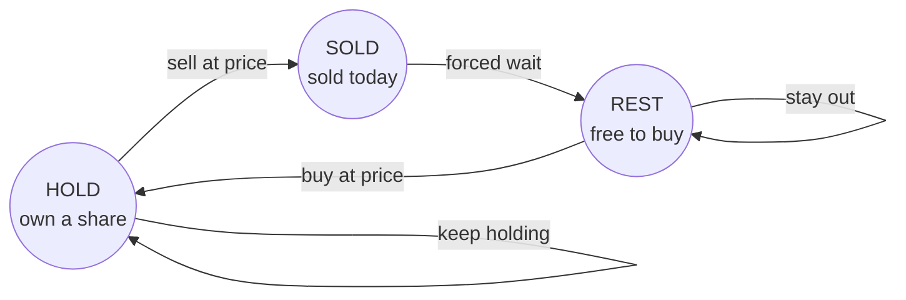

# Sequence DP

A **subsequence** is what is left after you delete some elements from a sequence
and keep the rest in their original order. Deleting `b` and `d` from `"abcde"`
leaves `"ace"`, and those three letters still read left to right in the order they
had. A **substring** or **subarray** is stricter, because it forbids deleting from
the middle: its elements have to sit next to each other in the original. So
`"ace"` is a subsequence of `"abcde"` but not a substring of it, while `"bcd"` is
both

That distinction decides which technique the problem wants, so it is the first
thing to pin down. Contiguous questions are often answered by a
[sliding window](../../04_sliding_window/notes/02_variable_size_window.md) or by
[prefix sums](../../01_arrays_and_hashing/notes/03_prefix_suffix_sums.md), and both
of those lean on elements being adjacent. Subsequence questions cannot use either,
because a valid answer might take element 0, skip nine elements, and then take
element 10, and no window can describe that

**Sequence DP** is the family of dynamic programming whose state is a position in a
sequence, or a pair of positions in two sequences, and whose table entry means
"the answer for everything consumed so far". Grid DP indexes `dp[r][c]` by a cell
of a grid the input actually contains, so both axes are handed to you.
[Knapsack](04_knapsack.md) invents one axis, the capacity still available, which is
nowhere in the input as a list. Sequence DP invents its second axis out of a second
sequence

Picture writing one string down the left edge of a page and the other across the
top, then filling in the rectangle between them. Each cell answers one question:
*if I have committed to consuming the first `i` characters of one string and the
first `j` characters of the other, what is the answer to that smaller problem?*
Walking from the top-left corner to the bottom-right one is walking through both
strings at once, and the rectangle is the whole technique

## Why There Is No Rule For Which Character To Skip

[Longest Common Subsequence](https://leetcode.com/problems/longest-common-subsequence/)
is the problem the rest of this builds on. Given two strings, find the length of
the longest string that is a subsequence of both. For `"abcde"` and `"ace"` the
answer is 3, since `"ace"` sits inside `"abcde"` in order

Start from the last character of each string, because that is the choice that
either goes into the answer or does not. If the two last characters are equal,
taking both is free and correct, since any common subsequence that does not use
them can be rewritten to use them without getting shorter. If they differ, then at
least one of them is not in the answer, so one of them gets thrown away

The cheap idea is that there should be a rule for which one to throw away, such
as "skip from the longer string" or "skip from the left string". There is not, and
the counterexample is three characters long. Take `a = "abc"` and `b = "bca"`,
whose last characters are `c` and `a` and do not match:

```text
drop the last of a   ->  LCS("ab",  "bca")  =  1     only "b" survives
drop the last of b   ->  LCS("abc", "bc")   =  2     "bc" survives
```

The two branches give different answers, and nothing visible at the point of the
decision says which is which. The lengths are the same, the dropped characters are
both single letters, and the payoff only shows up several characters later. So
both branches have to be explored and the better one kept, which turns the rule
into a recursion:

```text
lcs(i, j)   the length of the longest common subsequence of a[:i] and b[:j]

  i == 0 or j == 0        ->  0
  a[i-1] == b[j-1]        ->  1 + lcs(i-1, j-1)
  otherwise               ->  max(lcs(i-1, j), lcs(i, j-1))
```

Written out and run, that recursion is correct and unusable. Two strings of ten
characters with nothing in common cost 369,511 calls, while eight-character
versions of the same pair cost 25,739 of them, so adding two characters to each
string multiplies the work by about fourteen

The specific waste is worth naming, because it is what hands you the fix. A call
is completely described by the pair `(i, j)`, since the recursion never looks at
which characters were skipped on the way in, only at how far into each string it
now stands. For two ten-character strings there are `11 * 11 = 121` such pairs and
369,511 calls, so on average each distinct question is asked over three thousand
times. Two different branches reach the same pair constantly:

```text
lcs(4, 3)                      lcs(3, 4)
    drops a[3]  \             /  drops b[3]
                 -> lcs(3, 3) <-
```

**The pair of positions is the state.** Everything past that point is the
[memo-or-table machinery](01_dp_fundamentals.md) you already have, applied to a
two-dimensional index instead of a one-dimensional one

## Filling The Prefix Rectangle

Make the state explicit: `dp[i][j]` is the length of the longest common
subsequence of the first `i` characters of `text1` and the first `j` characters of
`text2`. The table gets `m + 1` rows and `n + 1` columns so that row 0 and column
0 can mean "this string contributes nothing", which is where the base cases live
and costs one wasted row and column to avoid every off-by-one in the loop

```python
def longest_common_subsequence(text1: str, text2: str) -> int:
    m, n = len(text1), len(text2)
    dp = [[0] * (n + 1) for _ in range(m + 1)]
    for i in range(1, m + 1):
        for j in range(1, n + 1):
            if text1[i - 1] == text2[j - 1]:
                dp[i][j] = dp[i - 1][j - 1] + 1
            else:
                dp[i][j] = max(dp[i - 1][j], dp[i][j - 1])
    return dp[m][n]


assert longest_common_subsequence("abcde", "ace") == 3
assert longest_common_subsequence("abc", "abc") == 3
assert longest_common_subsequence("abc", "def") == 0
assert longest_common_subsequence("", "abc") == 0
```

Here is the finished table for `"abcde"` and `"ace"`, with arrows on the two cells
worth understanding:

```text
              j=0    j=1    j=2    j=3
              ""     a      c      e
    i=0  ""    0      0      0      0
                        \
    i=1  a     0      1      1      1
    i=2  b     0      1 ---> 1      1
                              \
    i=3  c     0      1      2      2
    i=4  d     0      1      2      2
                                     \
    i=5  e     0      1      2      3

dp[1][1]:  'a' == 'a', so it takes dp[0][0] + 1 = 1        (diagonal)
dp[2][2]:  'b' != 'c', so it takes max(dp[1][2], dp[2][1]) = 1   (up or left)
dp[5][3]:  'e' == 'e', so it takes dp[4][2] + 1 = 3        (diagonal)
```

**Why the match case reads the diagonal and nothing else** is the line people get
wrong. Once `text1[i-1]` and `text2[j-1]` are paired up, both are spent, so the
rest of the answer must come from a state where both have been consumed, which is
`dp[i-1][j-1]`. Reaching for `max(dp[i-1][j], dp[i][j-1]) + 1` looks safer and is
wrong, because those states have only consumed one of the two characters, and the
other is still available to be matched a second time

**Why the mismatch case is a `max` of exactly two cells** follows from the branch
argument above. One of the two characters is unusable, so either discard the row
character and look at `dp[i-1][j]`, or discard the column character and look at
`dp[i][j-1]`. There is no need for a third candidate `dp[i-1][j-1]`, because
discarding both is never better than discarding one and it is already covered:
`dp[i-1][j]` is at least `dp[i-1][j-1]`, since a table entry can only grow as its
prefixes grow

The loop order is forced by the arrows. Every cell reads the one above it, the one
to its left, and the one diagonally up-left, all of which are complete once you
fill row by row from the top and left to right within each row

> "I will define `dp[i][j]` as the longest common subsequence of the first `i`
> characters of one string and the first `j` of the other. When the two current
> characters match I take the diagonal plus one, because both characters are now
> spent. When they do not match I take the better of dropping one character from
> either side. Row 0 and column 0 are all zeroes, since an empty prefix shares
> nothing."

## Recovering The Subsequence Instead Of Its Length

"Now return the actual string" is the standard follow-up, and it needs no extra
table. Start at `dp[m][n]` and walk backwards, reversing the decision each cell
made. A cell whose two characters matched was built from the diagonal, so record
that character and step diagonally. A cell that did not match came from whichever
neighbour was larger, so step there

```python
def lcs_string(text1: str, text2: str) -> str:
    m, n = len(text1), len(text2)
    dp = [[0] * (n + 1) for _ in range(m + 1)]
    for i in range(1, m + 1):
        for j in range(1, n + 1):
            if text1[i - 1] == text2[j - 1]:
                dp[i][j] = dp[i - 1][j - 1] + 1
            else:
                dp[i][j] = max(dp[i - 1][j], dp[i][j - 1])
    out: list[str] = []
    i, j = m, n
    while i > 0 and j > 0:
        if text1[i - 1] == text2[j - 1]:
            out.append(text1[i - 1])
            i -= 1
            j -= 1
        elif dp[i - 1][j] >= dp[i][j - 1]:
            i -= 1
        else:
            j -= 1
    return "".join(reversed(out))


assert lcs_string("abcde", "ace") == "ace"
assert lcs_string("abc", "def") == ""
assert lcs_string("", "abc") == ""
```

The characters come out in reverse order because the walk runs from the end of
both strings toward the front, which is what the final `reversed` fixes. The tie
in `dp[i-1][j] >= dp[i][j-1]` can go either way and still produce a correct answer
of the right length, since a tie means both neighbours lead to equally long
subsequences, though the two choices can produce different strings

This is also the concrete reason to keep the full table rather than rolling it
down to two rows. The rolling version computes the same number and throws away
every decision that produced it, so it cannot answer this follow-up

## The Same Rectangle Counting And Testing

The prefix rectangle is not tied to `max`. Swap the combine step and the same
table answers a different kind of question, which is why these problems feel
identical once you have written one of them

[Distinct Subsequences](https://leetcode.com/problems/distinct-subsequences/) asks
how many distinct ways `t` appears as a subsequence of `s`, so the combine step is
addition rather than a maximum. The asymmetry is the interesting part: `t` must be
consumed completely, while `s` is free to donate characters or skip them. So
`dp[i][j]` always inherits `dp[i-1][j]`, which is the count where `s`'s current
character is unused, and *adds* `dp[i-1][j-1]` when the characters match, which is
the count where it is used

[Interleaving String](https://leetcode.com/problems/interleaving-string/) asks
whether `s3` can be built by shuffling `s1` and `s2` while keeping each one's
internal order, so the combine step is a boolean `or`. Here the third string needs
no dimension of its own, because after consuming `i` characters of `s1` and `j` of
`s2` you have necessarily consumed exactly `i + j` characters of `s3`, so its
position is determined by the other two

```python
def num_distinct(s: str, t: str) -> int:
    m, n = len(s), len(t)
    dp = [[0] * (n + 1) for _ in range(m + 1)]
    for i in range(m + 1):
        dp[i][0] = 1  # exactly one way to build the empty t: use nothing
    for i in range(1, m + 1):
        for j in range(1, n + 1):
            dp[i][j] = dp[i - 1][j]
            if s[i - 1] == t[j - 1]:
                dp[i][j] += dp[i - 1][j - 1]
    return dp[m][n]


def is_interleave(s1: str, s2: str, s3: str) -> bool:
    m, n = len(s1), len(s2)
    if m + n != len(s3):
        return False
    dp = [[False] * (n + 1) for _ in range(m + 1)]
    dp[0][0] = True
    for i in range(m + 1):
        for j in range(n + 1):
            if i > 0 and dp[i - 1][j] and s1[i - 1] == s3[i + j - 1]:
                dp[i][j] = True
            if j > 0 and dp[i][j - 1] and s2[j - 1] == s3[i + j - 1]:
                dp[i][j] = True
    return dp[m][n]


assert num_distinct("rabbbit", "rabbit") == 3
assert num_distinct("babgbag", "bag") == 5
assert num_distinct("a", "") == 1
assert num_distinct("", "a") == 0
assert is_interleave("aabcc", "dbbca", "aadbbcbcac") is True
assert is_interleave("aabcc", "dbbca", "aadbbbaccc") is False
assert is_interleave("", "", "") is True
```

**The base cases carry the meaning of the count.** In `num_distinct`, `dp[i][0]`
is 1 for every `i` because there is exactly one way to spell the empty string, by
using nothing, and setting that column to 0 makes the whole table collapse to
zeroes. In the other direction `dp[0][j]` stays 0 for `j > 0`, because an empty
`s` cannot produce a non-empty `t`

The length guard in `is_interleave` is not a nicety. Without it, `s3` being too
short makes `s3[i + j - 1]` read the wrong character or raise, and `s3` being too
long lets a prefix match report `True` for a string that was never fully consumed

The same two-index shape appears where neither index is a string at all.
[Cherry Pickup](https://leetcode.com/problems/cherry-pickup/) walks two paths
across one grid simultaneously and indexes the state by both positions, using the
fact that after `t` steps both walkers sit on the same diagonal, so one shared
step counter plus two row numbers is enough

## Patterns That Can Consume Any Number Of Characters

[Wildcard Matching](https://leetcode.com/problems/wildcard-matching/) and
[Regular Expression Matching](https://leetcode.com/problems/regular-expression-matching/)
are the same rectangle with `i` indexing the text and `j` indexing the pattern.
What changes is that one pattern character can now swallow many text characters,
so a cell reads a neighbour on the *same* row

In wildcard matching `?` matches exactly one character and `*` matches any run,
including the empty one. That gives `*` two options, and the whole difficulty is
seeing that they are only two:

- `dp[i][j-1]` means the star matches nothing at all, so the pattern moves on and
  the text stays put
- `dp[i-1][j]` means the star swallows `s[i-1]` and stays available for more, so
  the text moves on and the pattern stays put

Regular expression matching differs because its `*` attaches to the *previous*
pattern character, so a star is really a two-character unit `x*` and skipping it
means jumping back two columns rather than one. Its "swallow one more" branch is
also conditional, since `x*` can only absorb a text character when `x` matches
that character

```python
def is_match_wildcard(s: str, p: str) -> bool:
    m, n = len(s), len(p)
    dp = [[False] * (n + 1) for _ in range(m + 1)]
    dp[0][0] = True
    for j in range(1, n + 1):
        if p[j - 1] == "*":
            dp[0][j] = dp[0][j - 1]  # a leading run of stars can match ""
    for i in range(1, m + 1):
        for j in range(1, n + 1):
            if p[j - 1] == "*":
                dp[i][j] = dp[i - 1][j] or dp[i][j - 1]
            elif p[j - 1] == "?" or p[j - 1] == s[i - 1]:
                dp[i][j] = dp[i - 1][j - 1]
    return dp[m][n]


def is_match_regex(s: str, p: str) -> bool:
    m, n = len(s), len(p)
    dp = [[False] * (n + 1) for _ in range(m + 1)]
    dp[0][0] = True
    for j in range(2, n + 1):
        if p[j - 1] == "*":
            dp[0][j] = dp[0][j - 2]  # "x*" contributes nothing
    for i in range(1, m + 1):
        for j in range(1, n + 1):
            if p[j - 1] == "*":
                dp[i][j] = dp[i][j - 2]
                if p[j - 2] == "." or p[j - 2] == s[i - 1]:
                    dp[i][j] = dp[i][j] or dp[i - 1][j]
            elif p[j - 1] == "." or p[j - 1] == s[i - 1]:
                dp[i][j] = dp[i - 1][j - 1]
    return dp[m][n]


assert is_match_wildcard("aa", "a") is False
assert is_match_wildcard("aa", "*") is True
assert is_match_wildcard("cb", "?a") is False
assert is_match_wildcard("adceb", "*a*b") is True
assert is_match_wildcard("", "*") is True
assert is_match_wildcard("", "") is True
assert is_match_regex("aa", "a") is False
assert is_match_regex("aa", "a*") is True
assert is_match_regex("ab", ".*") is True
assert is_match_regex("aab", "c*a*b") is True
assert is_match_regex("mississippi", "mis*is*p*.") is False
assert is_match_regex("", "a*") is True
```

**Row 0 is where these are usually broken.** An empty text can still match a
non-empty pattern, so that row is not all `False`, and both functions fill it in a
separate loop before the main one. In wildcard matching the run of `True` ends at
the first non-star, since `dp[0][j]` copies `dp[0][j-1]` only for a star and is
left `False` otherwise. In regex the loop steps over `x*` units
and reads `dp[0][j-2]`, which is why it starts at `j = 2`

## One Sequence, Looking Back At Every Earlier Position

Not every sequence DP has two sequences. When there is only one, the state is a
single index and the transition scans backwards over earlier indices, which makes
the inner loop the cost rather than a second dimension

[Longest Increasing Subsequence](https://leetcode.com/problems/longest-increasing-subsequence/)
has the quadratic version already built in
[dp fundamentals](01_dp_fundamentals.md), where `dp[i]` is the longest increasing
subsequence *ending at* index `i` and the answer is `max(dp)`. The follow-up that
comes with it is to do better than `O(n²)`, and the answer is a different state
entirely

Keep a list `tails`, where `tails[k]` is the **smallest possible last value** of
any increasing subsequence of length `k + 1` seen so far. This list is
automatically sorted, because a longer subsequence's last value is at least as
large as the value that ended its own prefix of one shorter. For each new number,
find where it belongs and either extend the list or lower one of its entries

```python
from bisect import bisect_left


def length_of_lis(nums: list[int]) -> int:
    tails: list[int] = []
    for value in nums:
        pos = bisect_left(tails, value)
        if pos == len(tails):
            tails.append(value)
        else:
            tails[pos] = value
    return len(tails)


assert length_of_lis([10, 9, 2, 5, 3, 7, 101, 18]) == 4
assert length_of_lis([0, 1, 0, 3, 2, 3]) == 4
assert length_of_lis([7, 7, 7, 7]) == 1
assert length_of_lis([]) == 0
```

Tracing `[10, 9, 2, 5, 3, 7, 101, 18]` shows what the replacements are doing:

```text
value   action                              tails after
  10    append, first subsequence           [10]
   9    REPLACE 10 at index 0               [9]
   2    REPLACE 9 at index 0                [2]
   5    append, length 2 now possible       [2, 5]
   3    REPLACE 5 at index 1                [2, 3]
   7    append, length 3 now possible       [2, 3, 7]
 101    append, length 4 now possible       [2, 3, 7, 101]
  18    REPLACE 101 at index 3              [2, 3, 7, 18]
```

The last line is the one that explains the whole method. Replacing 101 with 18
does not change the answer, which stays 4, and it discards a subsequence that was
perfectly valid. What it buys is a cheaper *ending*, so a future value between 18
and 101 could extend it. Because a replacement never changes the length of the
list, `len(tails)` is a running answer, and because every step is one binary
search, the total is `O(n log n)`

**`tails` need not be an increasing subsequence of the input at all.** Run
`[1, 3, 5, 2]` through the loop and the list ends as `[1, 2, 5]`, which no
subsequence of the input can be, since the only `2` sits after the `5` in the
original. Only its length is meaningful, so returning the list itself is wrong.
The choice between `bisect_left` and `bisect_right` is the other place to be
careful, and the [two functions differ exactly on equal values](../../05_binary_search/notes/02_boundary_search.md):
`bisect_left` overwrites an equal entry and so demands strictly increasing values,
while `bisect_right` would append past it and allow a non-decreasing run

[Word Break](https://leetcode.com/problems/word-break/) is the same one-index
shape with a different question. Let `dp[i]` be true when the first `i` characters
split cleanly into dictionary words. To settle position `i`, try every earlier
split point `j`, and if the prefix up to `j` was already good and `s[j:i]` is a
word, then `i` is good too

```python
def word_break(s: str, word_dict: list[str]) -> bool:
    words = set(word_dict)
    dp = [False] * (len(s) + 1)
    dp[0] = True  # the empty prefix is trivially splittable
    for i in range(1, len(s) + 1):
        for j in range(i):
            if dp[j] and s[j:i] in words:
                dp[i] = True
                break
    return dp[len(s)]


assert word_break("leetcode", ["leet", "code"]) is True
assert word_break("applepenapple", ["apple", "pen"]) is True
assert word_break("catsandog", ["cats", "dog", "sand", "and", "cat"]) is False
assert word_break("a", []) is False
```

The dictionary becomes a `set` because the inner loop does one membership test per
split point, and a list would make each of those a scan. `dp[j]` is checked before
the slice for the same reason, since a false `dp[j]` makes the slice pointless.
The `catsandog` case is the one that shows why greedy fails here: matching `"cats"`
first leaves `"andog"`, which does not split, and only backing up to `"cat"` and
then `"sand"` gets as far as `"og"`, which also fails, so the honest answer needs
every split point tried

[Longest Valid Parentheses](https://leetcode.com/problems/longest-valid-parentheses/)
uses the same "ending at `i`" state with a jump instead of a scan. `dp[i]` is the
length of the longest valid substring ending exactly at `i`, which is 0 at every
`(` because nothing valid ends on an opening bracket. At a `)` there are two
shapes: the pair closes immediately as `()`, or it closes a nested block, in which
case the matching `(` sits just before that block at index `i - dp[i-1] - 1`

```python
def longest_valid_parentheses(s: str) -> int:
    dp = [0] * len(s)
    best = 0
    for i in range(1, len(s)):
        if s[i] == ")":
            if s[i - 1] == "(":
                dp[i] = (dp[i - 2] if i >= 2 else 0) + 2
            else:
                start = i - dp[i - 1] - 1
                if start >= 0 and s[start] == "(":
                    dp[i] = dp[i - 1] + 2 + (dp[start - 1] if start >= 1 else 0)
            best = max(best, dp[i])
    return best


assert longest_valid_parentheses("(()") == 2
assert longest_valid_parentheses(")()())") == 4
assert longest_valid_parentheses("()(())") == 6
assert longest_valid_parentheses("") == 0
```

Both branches end by adding whatever valid run sat immediately before the newly
closed block, which is `dp[i-2]` in the first case and `dp[start-1]` in the
second. Dropping either term is the standard bug, because two adjacent valid
blocks then never get joined into one. Without the `dp[i-2]` term `"()()"` reports
2 instead of 4, and without the `dp[start-1]` term `"()(())"` reports 4 instead
of 6

## Spans Instead Of Prefixes

Palindrome problems break the prefix model, because whether `s[i..j]` is a
palindrome depends on both of its ends at once and cannot be decided from a
prefix. The repair is to index the table by a **span**, so `dp[i][j]` describes
the piece of the string from `i` to `j` inclusive rather than a prefix of it

The recurrence is short. `s[i..j]` is a palindrome when its two outer characters
are equal *and* the span strictly inside them is already known to be one. Spans of
length 1 and 2 have no meaningful inside, so `j - i < 2` short-circuits them

```python
def count_substrings(s: str) -> int:
    n = len(s)
    dp = [[False] * n for _ in range(n)]
    total = 0
    for i in range(n - 1, -1, -1):
        for j in range(i, n):
            if s[i] == s[j] and (j - i < 2 or dp[i + 1][j - 1]):
                dp[i][j] = True
                total += 1
    return total


def longest_palindrome(s: str) -> str:
    n = len(s)
    dp = [[False] * n for _ in range(n)]
    start, length = 0, 0
    for i in range(n - 1, -1, -1):
        for j in range(i, n):
            if s[i] == s[j] and (j - i < 2 or dp[i + 1][j - 1]):
                dp[i][j] = True
                if j - i + 1 > length:
                    start, length = i, j - i + 1
    return s[start : start + length]


assert count_substrings("abc") == 3
assert count_substrings("aaa") == 6
assert count_substrings("") == 0
assert longest_palindrome("babad") == "aba"
assert longest_palindrome("cbbd") == "bb"
assert longest_palindrome("a") == "a"
assert longest_palindrome("") == ""
```

**The outer loop runs downward and that is not cosmetic.** `dp[i][j]` reads
`dp[i+1][j-1]`, which lives one row *below* and one column to the left, so the
rows have to be filled from the bottom up for the inside of a span to be settled
before its outside is asked about. Filling top-down reads `False` from an
untouched cell and so misses every palindrome longer than two characters, which
turns `count_substrings("aaa")` into 5 instead of 6 by losing the whole string

Tracing `"aba"` shows the order and the one rejection:

```text
i=2 j=2   span "a"    ends match, length 1        -> True
i=1 j=1   span "b"    ends match, length 1        -> True
i=1 j=2   span "ba"   'b' != 'a'                  -> REJECTED
i=0 j=0   span "a"    ends match, length 1        -> True
i=0 j=1   span "ab"   'a' != 'b'                  -> REJECTED
i=0 j=2   span "aba"  ends match, inside dp[1][1] -> True
```

The final cell is the payoff. It never re-examines the middle character, because
`dp[1][1]` was settled back on the second line of the trace, and that reuse is the
entire reason this beats checking each of the `O(n²)` substrings character by
character for `O(n³)`

The `"babad"` and `"cbbd"` asserts also fix the two shapes of palindrome. The odd
case grows from a single centre, as `"aba"` does, and the even case grows from a
matching pair, as `"bb"` does, and the `j - i < 2` guard is what covers both
without separate code. `"babad"` has two answers of length 3, and this loop order
returns `"aba"` because it reaches that span before `"bab"` can tie it, while
LeetCode accepts either

The palindrome table then becomes a subroutine.
[Palindrome Partitioning II](https://leetcode.com/problems/palindrome-partitioning-ii/)
asks for the fewest cuts that split a string into palindromes, which is a
prefix DP sitting on top of a span DP

```python
def min_cut(s: str) -> int:
    n = len(s)
    if n == 0:
        return 0
    pal = [[False] * n for _ in range(n)]
    for i in range(n - 1, -1, -1):
        for j in range(i, n):
            if s[i] == s[j] and (j - i < 2 or pal[i + 1][j - 1]):
                pal[i][j] = True
    cuts = [0] * n  # cuts[i] = fewest cuts needed for s[:i + 1]
    for i in range(n):
        if pal[0][i]:
            cuts[i] = 0
        else:
            cuts[i] = min(cuts[j - 1] + 1 for j in range(1, i + 1) if pal[j][i])
    return cuts[n - 1]


assert min_cut("aab") == 1
assert min_cut("ab") == 1
assert min_cut("a") == 0
assert min_cut("") == 0
```

The `if pal[0][i]` branch is doing real work rather than saving a step. When the
whole prefix is already a palindrome the answer is 0 cuts, and there is no split
point `j` that would produce that, since every candidate in the `min` adds one.
That `min` is also never taken over an empty sequence, because `j = i` is always a
candidate: a single character is a palindrome, so cutting just before the last
character is always legal

[Maximal Rectangle](https://leetcode.com/problems/maximal-rectangle/) is the
outlier in this family. Its per-row state is a histogram of consecutive ones above
each column, built with a one-line DP, but the row is then solved with the
[monotonic stack](../../03_stacks_and_queues/notes/03_monotonic_stack.md) rather
than another table

## Choosing The Last Move Inside A Span

[Burst Balloons](https://leetcode.com/problems/burst-balloons/) is the problem
that teaches why interval DP splits on the *last* decision. You pop balloons one
at a time, and popping balloon `k` pays `left * k * right` using its current
neighbours, which change as balloons disappear

Splitting on the balloon popped **first** does not work, because after that pop
the two remaining sides are not independent: a balloon on the left can later end
up adjacent to one on the right, so the two halves cannot be solved separately.
Splitting on the balloon popped **last** inside a span fixes exactly that. If `k`
is last in the open range `(left, right)`, then everything strictly between
`left` and `k` was gone before it, everything between `k` and `right` was gone
before it, and neither group ever touched the other. When `k` finally pops, its
neighbours are `left` and `right` themselves, because nothing else is left

```python
def max_coins(nums: list[int]) -> int:
    vals = [1] + nums + [1]  # padded walls, worth 1, never popped
    n = len(vals)
    dp = [[0] * n for _ in range(n)]
    for span in range(2, n):
        for left in range(0, n - span):
            right = left + span
            for k in range(left + 1, right):
                dp[left][right] = max(
                    dp[left][right],
                    vals[left] * vals[k] * vals[right] + dp[left][k] + dp[k][right],
                )
    return dp[0][n - 1]


assert max_coins([3, 1, 5, 8]) == 167
assert max_coins([1, 5]) == 10
assert max_coins([7]) == 7
assert max_coins([]) == 0
```

`dp[left][right]` is the best score from bursting everything strictly between
those two indices, leaving both endpoints untouched, which is why the answer is
`dp[0][n-1]` over the padded array. The padding with `1` at each end removes every
boundary special case, since a balloon at the edge of the original array now has a
neighbour worth 1, which is the multiplier the problem specifies for a missing
neighbour

The loop is driven by `span` rather than by `left` because `dp[left][right]` reads
`dp[left][k]` and `dp[k][right]`, and both of those are strictly shorter spans, so
filling in increasing span length guarantees they are final. This is the ordering
argument every interval DP needs

The top-level choice on `[3, 1, 5, 8]` shows the rejections:

```text
last balloon popped   score
   k = 1  (value 3)    162     rejected
   k = 2  (value 1)     52     rejected
   k = 3  (value 5)     75     rejected
   k = 4  (value 8)    167     kept
```

Popping the 8 last is worth 167 and popping the 3 last is worth 162, and the gap
is small enough that no greedy rule about picking the biggest or smallest balloon
would reliably find it

[Minimum Cost to Merge Stones](https://leetcode.com/problems/minimum-cost-to-merge-stones/)
is the same span DP with an extra dimension for how many piles a span has been
reduced to, since a merge there takes exactly `k` piles rather than any two

## An Index Plus A Mode

The last shape in this module keeps a single index over time but adds a small
dimension for *which situation you are in*, and each situation is one running
value rather than an array. The stock problems are the canonical case, because a
day's price alone does not tell you whether you currently own a share

[Best Time to Buy and Sell Stock with Cooldown](https://leetcode.com/problems/best-time-to-buy-and-sell-stock-with-cooldown/)
has three situations, since after selling you are barred from buying for one day:



Each state holds the best cash balance achievable while in that state at the end
of the current day, where holding a share shows as a negative balance because the
purchase has been paid for and not yet recovered

```python
def max_profit_with_cooldown(prices: list[int]) -> int:
    if not prices:
        return 0
    hold, sold, rest = -prices[0], 0, 0
    for price in prices[1:]:
        hold, sold, rest = max(hold, rest - price), hold + price, max(rest, sold)
    return max(sold, rest)


def max_profit_with_fee(prices: list[int], fee: int) -> int:
    if not prices:
        return 0
    hold, free = -prices[0], 0
    for price in prices[1:]:
        hold, free = max(hold, free - price), max(free, hold + price - fee)
    return free


assert max_profit_with_cooldown([1, 2, 3, 0, 2]) == 3
assert max_profit_with_cooldown([1]) == 0
assert max_profit_with_cooldown([]) == 0
assert max_profit_with_fee([1, 3, 2, 8, 4, 9], 2) == 8
assert max_profit_with_fee([1, 3, 7, 5, 10, 3], 3) == 6
assert max_profit_with_fee([], 1) == 0
```

**The simultaneous tuple assignment is required, not stylistic.** All three new
values are computed from yesterday's three before any name is rebound, which is
the same reason the [rolling variables](01_dp_fundamentals.md) in the fundamentals
had to be assigned together. Splitting these into three statements lets the new
`hold` feed into `sold`, which quietly allows buying and selling on the same day
and answers 4 instead of 3 on `[1, 2, 3, 0, 2]`

The fee version needs only two states, because there is no forced wait, and the
fee is charged on the sell transition so that it is paid once per completed round
trip rather than twice. Charging it on the buy instead gives the same answer, and
charging it on both is the mistake to avoid. The answer is `free` rather than
`max(free, hold)`, since ending the last day still holding a share is never better
than never having bought it

[Best Time to Buy and Sell Stock IV](https://leetcode.com/problems/best-time-to-buy-and-sell-stock-iv/)
scales this up by adding a third axis for transactions still allowed, giving a
state of day, transactions remaining, and whether a share is held, which is
`O(n * k)` states and the same two transitions at each

## Worked Example: [Edit Distance](https://leetcode.com/problems/edit-distance/)

Given two strings, return the minimum number of single-character edits that turn
the first into the second. The allowed edits are inserting a character, deleting a
character, and replacing one character with another, each costing 1

**Input**:

- `word1`, a `str` of length 0 to 500, made of lowercase English letters
- `word2`, a `str` of length 0 to 500, made of lowercase English letters

**Output**: an `int`, the fewest edit operations that transform `word1` into
`word2`. It is a count of operations rather than of differing positions, so two
strings of very different lengths can still be close, and the value is 0 exactly
when the two strings are equal. Either string may be empty, in which case the
answer is the length of the other, since every character has to be inserted or
deleted

"Convert one string into another" over two independent strings is the two-sequence
prefix rectangle again, with `min` in place of `max`. The naive reading is to try
every sequence of edits, which branches three ways at every position and revisits
the same pair of remaining suffixes on nearly every branch, exactly as the common
subsequence recursion did. Since a partially edited state is described entirely by
how much of each string has been dealt with, the pair `(i, j)` is again the state

The three operations map onto the three neighbouring cells, and getting that
mapping right is the whole problem. Deleting from `word1` consumes a row character
and no column character, so it reads the cell above. Inserting into `word1`
consumes a column character and no row character, so it reads the cell to the
left. Replacing consumes one of each, so it reads the diagonal

> "`dp[i][j]` is the edit distance between the first `i` characters of `word1` and
> the first `j` of `word2`. If the current characters are equal there is nothing to
> pay and I take the diagonal unchanged. Otherwise I pay 1 and take the best of
> replace, which is the diagonal, delete, which is above, and insert, which is to
> the left."

1. Allocate a table with `m + 1` rows and `n + 1` columns, where `m` and `n` are
   the two lengths, so that index 0 on each axis can mean an empty prefix and no
   arithmetic is needed inside the loop
2. Fill the first column with `dp[i][0] = i`, because turning the first `i`
   characters of `word1` into the empty string takes exactly `i` deletions and
   there is no cheaper way
3. Fill the first row with `dp[0][j] = j` for the mirror reason, since building
   `j` characters out of nothing takes exactly `j` insertions. These two lines are
   what makes every other cell's arithmetic work, and leaving the table at zero
   understates every answer, giving 2 for `"horse"` and `"ros"` and 0 for any
   string against the empty one
4. Loop over the cells row by row from the top, left to right within each row, so
   the cell above, the cell to the left, and the diagonal are all final before
   they are read
5. When `word1[i-1] == word2[j-1]`, copy the diagonal with no cost added, because
   the two characters already agree and neither one needs an operation. Adding 1
   here anyway charges for characters that already match and inflates the answer,
   turning `"horse"` and `"ros"` into 5 and `"intention"` and `"execution"`
   into 9
6. When they differ, take `1 + min(diagonal, above, left)`. All three are legal, so
   the `min` is what picks the cheapest route rather than committing to one edit
   type
7. Return `dp[m][n]`, which is the cell describing both strings in full

```python
def min_distance(word1: str, word2: str) -> int:
    m, n = len(word1), len(word2)
    dp = [[0] * (n + 1) for _ in range(m + 1)]
    for i in range(m + 1):
        dp[i][0] = i  # delete every character of word1's prefix
    for j in range(n + 1):
        dp[0][j] = j  # insert every character of word2's prefix
    for i in range(1, m + 1):
        for j in range(1, n + 1):
            if word1[i - 1] == word2[j - 1]:
                dp[i][j] = dp[i - 1][j - 1]
            else:
                dp[i][j] = 1 + min(dp[i - 1][j - 1], dp[i - 1][j], dp[i][j - 1])
    return dp[m][n]


assert min_distance("horse", "ros") == 3
assert min_distance("intention", "execution") == 5
assert min_distance("", "abc") == 3
assert min_distance("abc", "") == 3
assert min_distance("", "") == 0
```

The finished table for `"horse"` and `"ros"`:

```text
              j=0    j=1    j=2    j=3
              ""     r      o      s
    i=0  ""    0      1      2      3
    i=1  h     1      1      2      3
    i=2  o     2      2      1      2
    i=3  r     3      2      2      2
    i=4  s     4      3      3      2
    i=5  e     5      4      4      3
```

Four cells are worth walking through, and two of them are decided by a rejection:

```text
(1,1)  'h' vs 'r'  differ   diag 0, up 1, left 1   ->  1 + 0 = 1, replace h with r
(2,2)  'o' vs 'o'  equal    diag 1                 ->  1, free, no candidates compared
(4,2)  's' vs 'o'  differ   diag 2, up 2, left 3   ->  1 + 2 = 3, left REJECTED
(5,3)  'e' vs 's'  differ   diag 3, up 2, left 4   ->  1 + 2 = 3, diag and left REJECTED
```

The last cell is the interesting one. Replacing `e` with `s` would cost
`1 + dp[4][2] = 4`, and inserting would cost `1 + dp[5][2] = 5`, while deleting
the `e` costs `1 + dp[4][3] = 3` and wins. That is `"horse"` becoming `"ros"` by
replacing `h` with `r`, deleting the `r`, and deleting the `e`, which is three
operations and matches the official answer. Cell `(2,2)` shows the other half of
the mechanism, where a matching `o` costs nothing at all and simply inherits the
diagonal

- **Time Complexity:** `O(m * n)` where `m` and `n` are the two string lengths,
  because the table has `(m + 1) * (n + 1)` cells and each one does a comparison
  and a `min` over three values, which is constant work
- **Space Complexity:** `O(m * n)` for the full table, which drops to
  `O(min(m, n))` if you keep only the previous row and the one being built, since
  no cell ever reads further back than one row. The full table is what a
  "show me the actual edits" follow-up needs, so reduce it only after the plain
  version is correct

## Time and Space Complexity

Throughout, `m` and `n` are the lengths of the two sequences involved, and `n`
alone is the length when there is only one

**Two-sequence prefix rectangles**

| Approach                                                                                      | Time                                                                                                                                                                                        | Space                                                                                                      |
| --------------------------------------------------------------------------------------------- | ------------------------------------------------------------------------------------------------------------------------------------------------------------------------------------------- | ---------------------------------------------------------------------------------------------------------- |
| Recursion with no cache, as in the LCS derivation                                             | exponential: every mismatch branches two ways and the same `(i, j)` pair recurs on almost every branch, measured as 369,511 calls against 121 distinct states for two ten-character strings | `O(m + n)`: no table, but the call stack holds one frame per character consumed on the current chain       |
| Full `dp[i][j]` table, for LCS, Edit Distance, Distinct Subsequences, and Interleaving String | `O(m * n)`: one cell per pair of prefixes, each doing constant work over at most three neighbours                                                                                           | `O(m * n)`: every cell is stored, which is what lets you walk backwards to recover the answer itself       |
| Same table rolled to two rows                                                                 | `O(m * n)`: identical loop, since rolling changes storage and not the number of cells computed                                                                                              | `O(min(m, n))`: only the previous row and the current one, after making the shorter string the column axis |
| Pattern matching, wildcard and regex                                                          | `O(m * n)`: `m` text positions by `n` pattern positions, and a star cell still reads only two neighbours                                                                                    | `O(m * n)`: the full table, reducible to two rows for the same reason as above                             |

**One sequence**

| Approach                                                   | Time                                                                                                                                                                                                   | Space                                                                                                |
| ---------------------------------------------------------- | ------------------------------------------------------------------------------------------------------------------------------------------------------------------------------------------------------ | ---------------------------------------------------------------------------------------------------- |
| Longest increasing subsequence, quadratic table            | `O(n²)`: each of the `n` entries scans every earlier index to find an extendable ending                                                                                                                | `O(n)`: one entry per index, and keeping it is what allows reconstructing the subsequence            |
| Longest increasing subsequence, `tails` with binary search | `O(n log n)`: one binary search over a list of at most `n` entries per element                                                                                                                         | `O(n)`: `tails` grows to the length of the answer, which is `n` when the input is already increasing |
| Word Break                                                 | `O(n³ + W)`: `n` positions each trying `n` split points, and each candidate slice costs `O(n)` to build and hash rather than `O(1)`, plus `O(W)` to build the set over `W` total dictionary characters | `O(n + W)`: the boolean table plus the word set, and each slice is temporary                         |
| Longest Valid Parentheses                                  | `O(n)`: each index does constant work, since the nested case jumps straight to the matching bracket instead of scanning                                                                                | `O(n)`: one entry per index, because the jump can reach arbitrarily far back                         |
| Stock with cooldown or with a fee                          | `O(n)`: one pass over the prices doing a fixed number of comparisons per day                                                                                                                           | `O(1)`: two or three running integers, since only yesterday's states are ever read                   |

**Spans**

| Approach                                                                            | Time                                                                                                             | Space                                                                                                         |
| ----------------------------------------------------------------------------------- | ---------------------------------------------------------------------------------------------------------------- | ------------------------------------------------------------------------------------------------------------- |
| Palindrome span table, for Palindromic Substrings and Longest Palindromic Substring | `O(n²)`: one cell per span, each answering in constant time from the span one shorter at both ends               | `O(n²)`: the full boolean table, which is the price of reusing shorter spans instead of rechecking characters |
| Checking every substring character by character                                     | `O(n³)`: `O(n²)` substrings each verified in `O(n)`, which is what the table's constant-time inner check removes | `O(1)`: nothing is stored beyond the current best, which is the only respect in which it wins                 |
| Palindrome Partitioning II                                                          | `O(n²)`: the palindrome table plus one prefix pass that tries every split point                                  | `O(n²)`: dominated by the palindrome table, since the cut array itself is only `O(n)`                         |
| Burst Balloons and other interval DP                                                | `O(n³)`: `O(n²)` spans, each trying every interior index as the last move                                        | `O(n²)`: one entry per span of the padded array                                                               |

## Summary

- A **subsequence** keeps the original order but allows gaps, so `"ace"` is a
  subsequence of `"abcde"`, while a **substring** or subarray also requires the
  elements to be adjacent. Decide which one the problem means before anything else,
  because a contiguous question often yields to a sliding window and a subsequence
  question never does
- **Sequence DP** makes the state a position in a sequence, or a pair of positions
  in two sequences, and defines `dp[i][j]` as the answer once the first `i` and
  first `j` elements have been consumed. The table is invented rather than given,
  unlike grid DP where the two indices are real coordinates in a real grid
  - The state is the pair of positions and nothing more, because the recursion
    never needs to know *which* earlier characters were skipped, only how far into
    each sequence it now stands
- At a mismatch there is no local rule for which side to skip, which is what forces
  the branching. With `a = "abc"` and `b = "bca"`, dropping the last character of
  `a` leaves an answer of 1 and dropping the last of `b` leaves 2, and nothing
  visible at the decision point distinguishes them
  - Both branches then have to be explored, and the same `(i, j)` pair is reached
    from many of them, which is the overlap that makes it a DP rather than a search
- The **Longest Common Subsequence** rectangle is the base template. A match takes
  `dp[i-1][j-1] + 1`, and a mismatch takes `max(dp[i-1][j], dp[i][j-1])`, with row
  0 and column 0 filled with zeroes for the empty prefixes
  - On a match the diagonal is the only legal source, because both characters are
    now spent, and reaching for `max(dp[i-1][j], dp[i][j-1]) + 1` leaves one of
    them free to be matched twice
  - Recovering the subsequence itself needs no extra structure, only a backwards
    walk from `dp[m][n]` that reverses each cell's decision, which is why the full
    table is worth keeping until the answer is known to be right
- Swapping the combine step reuses the identical rectangle for other questions.
  **Distinct Subsequences** adds instead of maximizing and starts `dp[i][0]` at 1,
  since there is exactly one way to spell the empty string. **Interleaving String**
  uses boolean `or`, and needs no third dimension because consuming `i` and `j`
  characters means exactly `i + j` of the target have been consumed
  - **Edit Distance** is the same shape with `min` over three neighbours, where
    above is a deletion, left is an insertion, and the diagonal is a replacement,
    and a matching pair copies the diagonal with no cost added
  - **Wildcard** and **regex matching** put the text on one axis and the pattern on
    the other, and their `*` reads a neighbour on the same row, since one pattern
    character can consume many text characters. Row 0 must be filled separately,
    because an empty text can still match a pattern made of stars
- With only one sequence the state is a single index and the inner loop scans
  backwards. **Longest Increasing Subsequence** ends at index `i` and answers
  `max(dp)`, and **Word Break** tries every split point `j` and asks whether
  `s[j:i]` is a dictionary word
  - The `O(n log n)` version of LIS keeps `tails`, where `tails[k]` is the smallest
    last value of any increasing subsequence of length `k + 1`, appending when a
    value exceeds everything and overwriting with `bisect_left` otherwise
  - `tails` need not be a valid subsequence of the input, since `[1, 3, 5, 2]`
    leaves it holding `[1, 2, 5]`, and only its length means anything, so
    returning its contents is wrong. `bisect_left` enforces
    strictly increasing values and `bisect_right` would allow equal ones
- Palindrome problems need a **span** state, where `dp[i][j]` describes `s[i..j]`
  rather than a prefix, since both ends matter at once. A span is a palindrome when
  its ends match and the span strictly inside is one, with `j - i < 2` covering the
  one- and two-character cases that have no inside
  - The rows must be filled from the bottom up, because `dp[i][j]` reads
    `dp[i+1][j-1]`, and the wrong direction silently reports that no long
    palindrome exists
  - That table becomes a subroutine for **Palindrome Partitioning II**, which lays
    an ordinary prefix DP over it to count the fewest cuts
- **Interval DP** splits a span on the move made *last* rather than first.
  In **Burst Balloons** the two sides of a first pop can later become neighbours
  and so are not independent, while choosing the last balloon guarantees its
  neighbours are the span's own endpoints and the two halves never interact
  - The loop runs over increasing span length, because `dp[left][right]` reads two
    strictly shorter spans, and padding the array with sentinel values worth 1 at
    both ends removes every boundary case
- **Index plus mode** covers the stock problems, where a day number alone cannot
  say whether a share is held, so each situation gets its own running value and the
  transitions between them form a small state machine
  - All the new values must be assigned in one simultaneous tuple assignment, or a
    freshly updated state feeds into another one in the same day, which permits
    buying and selling on the same price
- The cost of a sequence DP is the number of cells multiplied by the work per cell,
  so two prefixes give `O(m * n)`, one index with a backward scan gives `O(n²)`,
  and a span with an interior choice gives `O(n³)`
  - Space equals the cells stored, which usually collapses to two rows because
    nothing reads further back than one row, at the cost of losing the ability to
    reconstruct the answer

## Interview Checklist

Before writing code, make sure you can answer each of these

```text
Is this a subsequence problem (gaps allowed) or a substring one (contiguous)?
Is the state a prefix of each sequence, a span i..j, or an index plus a mode flag?
Can I say "dp[i][j] is ..." as one sentence that mentions both prefixes explicitly?
On a match, am I taking the diagonal only, since both characters are now spent?
On a mismatch, which neighbours are legal, and is it max, min, sum, or or?
Is row 0 and column 0 really all zeroes, or does an empty prefix have a real answer?
Does the third string need its own dimension, or is its position i + j implied?
For a span table, does my loop fill shorter spans before longer ones?
For interval DP, am I splitting on the last move rather than the first?
Is the answer dp[m][n], max over the table, or a value carried alongside it?
Will a follow-up ask for the actual subsequence or the actual edits, which needs the full table?
Can I state the state count times the work per state, and does that match my quoted bound?
```
