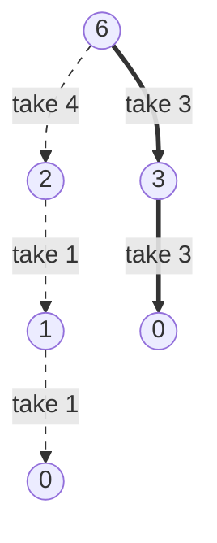

# Greedy Fundamentals

A **greedy algorithm** builds an answer one commitment at a time. At every step
it looks at the options in front of it, picks the one that scores best under a
fixed local rule, and never revisits that pick. There is no table of
alternatives and no undo, so the whole algorithm is usually a sort followed by a
single pass

That makes greedy the cheapest of the three general strategies you have already
met, and the only one whose correctness is not automatic.
[Backtracking](../../09_backtracking/notes/01_backtracking_basics.md) tries a
choice, explores it, and un-chooses when the branch fails, so it is correct by
construction because it eventually looks at everything.
[Dynamic programming](../../11_dp/notes/01_dp_fundamentals.md) keeps every
subproblem's answer in a table, so it is also correct by construction because
nothing is thrown away. Greedy throws away every option it did not pick, the
moment it does not pick it. If the discarded option was the one the optimal
answer needed, the algorithm is simply wrong, and it will be wrong quietly, at
full speed, on an input you did not test

The mental picture is paying for something with coins. You want the fewest
coins, so you hand over the biggest coin that still fits, then the biggest that
fits the remainder, and so on. With US denominations that is optimal. Change the
coin set and the same rule starts losing, which is the first thing to see

> This topic covers what a **greedy choice rule** is, how to prove one correct
> with an **exchange argument**, the concrete case where greedy loses and DP is
> the only way out, and the four shapes greedy takes in the fundamentals section
> of this module

## Where Taking The Biggest Coin Gives The Wrong Answer

Take coins of value 1, 3, and 4, and try to pay 6 with as few as possible. The
greedy rule takes the 4 first, because it is the biggest coin that fits. That
leaves 2, which no single coin covers, so it pays two 1s and finishes with three
coins. Starting with the 3 instead leaves 3, which one more coin covers exactly,
so the real answer is two coins



The dashed path is what greedy does, and the solid path is the answer. Greedy
takes the larger first step and lands on a remainder that is expensive to
finish, which is the entire failure mode in one picture. The local score, "how
much of the bill does this coin clear", says nothing about what the leftover
costs

```python
def greedy_coins(coins: list[int], amount: int) -> int:
    remaining = amount
    used = 0
    for coin in sorted(coins, reverse=True):
        take, remaining = divmod(remaining, coin)
        used += take
    return used if remaining == 0 else -1


def dp_coins(coins: list[int], amount: int) -> int:
    best = [0] + [amount + 1] * amount
    for value in range(1, amount + 1):
        for coin in coins:
            if coin <= value:
                best[value] = min(best[value], best[value - coin] + 1)
    return -1 if best[amount] > amount else best[amount]


assert greedy_coins([1, 3, 4], 6) == 3
assert dp_coins([1, 3, 4], 6) == 2
assert greedy_coins([1, 5, 10, 25], 30) == dp_coins([1, 5, 10, 25], 30) == 2
assert greedy_coins([1, 5, 10, 25], 0) == dp_coins([1, 5, 10, 25], 0) == 0
assert greedy_coins([3], 5) == dp_coins([3], 5) == -1
```

The two functions disagree on `[1, 3, 4]` and agree on `[1, 5, 10, 25]`, which
is the point worth carrying out of this section. **Whether a greedy rule is
correct is a fact about the input, not about the code.** Nothing in
`greedy_coins` looks broken, and no amount of staring at it reveals the bug,
because the bug is in the claim that the biggest coin belongs in the answer

`dp_coins` is the repair, and it is the repair precisely because it refuses to
commit. At each amount it tries every coin as the last one and keeps the best
result, so no branch is ever discarded on a guess. That costs `O(C * d)` time
for an amount `C` and `d` denominations instead of one pass, and that extra cost
is exactly what buys the correctness

Greedy is not a lesser technique for it. When a greedy rule is provably safe it
turns a table-sized DP into a single scan, which is often the difference between
the intended solution and the one that times out. The skill this module is
teaching is telling the two cases apart

## Proving A Rule Safe With An Exchange Argument

An **exchange argument** proves that committing to the greedy choice costs
nothing. It never claims the greedy answer is *the* optimal answer, only that
*some* optimal answer agrees with it, which is enough

The argument always has the same three moves:

1. Let `G` be the first thing the greedy rule picks, and let `O` be any optimal
   solution, chosen by an adversary who is trying to beat you
2. If `O` already contains `G`, there is nothing to do. Otherwise **exchange**:
   modify `O` so that it does contain `G`, and show the modified solution is
   still valid and still scores at least as well. Because `O` was optimal and
   the new one is no worse, the new one is optimal too
3. Now delete `G` and everything it consumed from the problem, and repeat the
   argument on what remains. Each round fixes one more of greedy's choices
   inside an optimal solution, so after every round is done, greedy's complete
   answer is optimal

The load-bearing move is step 2, and everything interesting is in the phrase
"still valid". You have to name the property that survives the swap

**[Assign Cookies](https://leetcode.com/problems/assign-cookies/)** is the
smallest problem where the whole argument fits in a paragraph. Each child `i`
has a greed factor `g[i]`, each cookie `j` has a size `s[j]`, one cookie goes to
at most one child, and a child is content when the cookie they get is at least
their greed factor. Maximize the number of content children

Sort both lists ascending. The greedy rule is to hand the smallest cookie that
fits the least greedy child to that child

Here is the exchange. Let child 0 be the least greedy child and let cookie `k`
be the smallest cookie that satisfies it. Take any optimal assignment `O`

- If `O` gives child 0 some other cookie `j`, then `s[j] >= g[0]` and therefore
  `s[j] >= s[k]`, since `k` is the smallest cookie that clears `g[0]`. If cookie
  `k` is unused in `O`, hand it to child 0 instead of `j` and the count is
  unchanged. If cookie `k` is being used by some other child `c`, swap the two
  cookies, which keeps child 0 content because `s[k] >= g[0]`, and keeps child
  `c` content because `s[j] >= s[k] >= g[c]`
- If `O` leaves child 0 with nothing, it must still satisfy someone, because
  greedy satisfies at least one child whenever a fitting cookie exists and `O`
  is optimal. Say `O` satisfies child `c` with cookie `j`. Then
  `s[j] >= g[c] >= g[0]`, because child 0 is the least greedy of all, so moving
  cookie `j` to child 0 keeps the count identical. Now the first case applies

Either way an optimal assignment exists that pairs child 0 with cookie `k`.
Remove both from the instance and the same reasoning applies to the next
child, which is step 3

```python
def assign_cookies(greed: list[int], sizes: list[int]) -> int:
    children = sorted(greed)
    cookies = sorted(sizes)
    served = 0
    for size in cookies:
        if served < len(children) and size >= children[served]:
            served += 1
    return served


assert assign_cookies([1, 2, 3], [1, 1]) == 1
assert assign_cookies([1, 2], [1, 2, 3]) == 2
assert assign_cookies([10, 9, 8, 7], [5, 6, 7, 8]) == 2
assert assign_cookies([], [1, 2]) == 0
assert assign_cookies([5], [1, 2]) == 0
```

The loop walks the cookies rather than the children, which is what makes a
too-small cookie cost nothing. When `size < children[served]` the loop simply
moves to the next cookie and `served` does not advance, so that cookie is thrown
away and the same child is offered the next one up. Walking children instead
forces you to write the discard by hand

> "Sorting both sides, the least greedy child should get the smallest cookie
> that fits. If an optimal solution gave that child a bigger cookie, I can swap
> the two cookies and nobody becomes unhappy, because the bigger cookie still
> clears whatever the other child needed. So committing to the smallest fitting
> cookie never costs me a satisfied child, and I can peel the problem down one
> child at a time."

That is the sentence an interviewer is listening for. Saying "I'll sort both
and use two pointers" describes the code, and saying the swap describes why the
code is right

## The One Property That Separates Greedy From DP

Both greedy and DP need **optimal substructure**, which the
[DP fundamentals](../../11_dp/notes/01_dp_fundamentals.md) topic established as
the property that an optimal answer is built from optimal answers to
subproblems. The coin problem has it, since the cheapest way to pay 6 that
starts with a 3 is a 3 plus the cheapest way to pay 3

What greedy needs on top of that is the **greedy choice property**, which says
there is a first choice you can identify from local information alone that some
optimal solution contains. Coin change with 1, 3, and 4 has optimal substructure
and no greedy choice property, because "biggest coin that fits" is local
information that leads away from every optimal answer at amount 6

In an interview you will not have time for a proof before you write code, so
run this two-step check instead:

- **Try to break the rule on three or four elements first.** Aim the
  counterexample at the seam, which is a large item that blocks two small ones,
  a step that is cheap now and expensive later, or a tie. If you find a
  counterexample in a minute, greedy is dead and you should be reaching for
  DP
- **If you cannot break it, say the exchange out loud before coding.** One
  sentence in the shape "if an optimal answer did something else here, I could
  swap my choice in without making it worse, because ..." is the whole
  justification. If you cannot finish the "because", you do not have a greedy
  rule, you have a guess

Two signals push toward greedy in the first place. Sorting the input by some key
makes the right choice obvious at every position, which is the sorted-scan
family. Alternatively the problem asks for a count or a total rather than the
actual arrangement, so the many arrangements that score the same collapse into
one. Two signals push away from it. If a choice's cost depends on choices made
much earlier, or if the problem asks for the number of ways to do something,
that is DP

## Choosing The Sort Key

Most greedy problems are decided before the loop starts, in the sort key. Get
the key right and the loop is three lines, so spend the thinking there

**[Maximum Units on a Truck](https://leetcode.com/problems/maximum-units-on-a-truck/)**
is the easy shape. The truck holds `truck_size` boxes and every box takes
exactly one slot regardless of what is inside it, so slots are interchangeable
and the key is units per box, descending. The exchange is immediate. If an
optimal loading contains a box worth 3 while a box worth 7 is left behind, swap
them, which uses the same one slot and gains 4

**[Two City Scheduling](https://leetcode.com/problems/two-city-scheduling/)** is
the shape worth practising, because the useful key is not any number in the
input. There are `2n` people, `costs[i] = [a_i, b_i]` is the price of flying
person `i` to city A or city B, and exactly `n` people must go to each. Sorting
by `a_i` is wrong, because a person who is cheap to send to A may be even
cheaper to send to B

Rewrite the total instead. Send everyone to B, which costs `sum(b_i)`, then pick
`n` people to move to A, which changes the bill by `a_i - b_i` for each one
moved. The total is therefore

```text
sum of all b_i  +  sum of (a_i - b_i) over the n people sent to A
```

The first term is fixed, so minimizing the total means picking the `n` smallest
values of `a_i - b_i`. That is the key, and once the difference is written down
the algorithm is a sort and a slice

```python
def maximum_units(box_types: list[list[int]], truck_size: int) -> int:
    total = 0
    for count, units in sorted(box_types, key=lambda box: -box[1]):
        take = min(count, truck_size)
        total += take * units
        truck_size -= take
        if truck_size == 0:
            break
    return total


def two_city_sched_cost(costs: list[list[int]]) -> int:
    ordered = sorted(costs, key=lambda pair: pair[0] - pair[1])
    half = len(ordered) // 2
    return sum(a for a, _ in ordered[:half]) + sum(b for _, b in ordered[half:])


assert maximum_units([[1, 3], [2, 2], [3, 1]], 4) == 8
assert maximum_units([[5, 10], [2, 5], [4, 7], [3, 9]], 10) == 91
assert maximum_units([[1, 1]], 0) == 0
assert two_city_sched_cost([[10, 20], [30, 200], [400, 50], [30, 20]]) == 110
assert two_city_sched_cost(
    [[259, 770], [448, 54], [926, 667], [184, 139], [840, 118], [577, 469]]
) == 1859
assert two_city_sched_cost([]) == 0
```

`take = min(count, truck_size)` is there because a box *type* carries a count,
so the last type loaded is usually loaded partially. Dropping the `min` and
loading whole types only is the common wrong version, and it fails whenever the
truck fills mid-type

Two more problems in this section are decided by their key alone. **Minimum
Deletions to Make Character Frequencies Unique** sorts the frequencies
descending and lowers each clashing count to the next free value below it,
because lowering the larger of two equal counts costs the same as lowering the
smaller and leaves more free values underneath. **Bag of Tokens** sorts the
tokens and then works from both ends with the
[opposite-end two pointers](../../02_two_pointers/notes/01_opposite_end_pointers.md)
you already know, spending power on the cheapest token to gain a score and
trading a score back for the most expensive token when power runs out, since
those two ends are the best exchange rate available in each direction

## Committing In One Left-To-Right Pass

When the input already has a meaningful order, usually time or position, there
is nothing to sort and the greedy rule fires once per element

**[Best Time to Buy and Sell Stock II](https://leetcode.com/problems/best-time-to-buy-and-sell-stock-ii/)**
lets you buy and sell as often as you like, holding at most one share. The rule
is to add up every positive day-to-day change. The reason is that holding from
day `i` to day `j` earns `prices[j] - prices[i]`, which telescopes into the sum
of the daily changes in between, so any strategy's profit is a sum of daily
changes. Taking exactly the positive ones is therefore an upper bound that is
also achievable, by buying the evening before each rise and selling the evening
after

**[Lemonade Change](https://leetcode.com/problems/lemonade-change/)** hands you
bills of 5, 10, and 20 and asks whether you can always give the correct change
of 15 or 5. A twenty can be changed as a ten plus a five, or as three fives. The
rule is to prefer the ten. A five can do everything a ten can do and more,
because a ten only ever pays part of a twenty's change while a five also pays a
ten's change, so keeping fives is never worse. That is an exchange argument on
the register rather than on the answer

**[Can Place Flowers](https://leetcode.com/problems/can-place-flowers/)** plants
at the first legal slot scanning left to right. Planting earlier is never worse,
because a flower at position `i` blocks positions `i - 1` and `i + 1`, and any
later legal position blocks a set of slots that starts further right, so shifting
a planting leftward can only free space rather than consume it

```python
def max_profit(prices: list[int]) -> int:
    return sum(max(prices[i] - prices[i - 1], 0) for i in range(1, len(prices)))


def lemonade_change(bills: list[int]) -> bool:
    fives = tens = 0
    for bill in bills:
        if bill == 5:
            fives += 1
        elif bill == 10:
            if fives == 0:
                return False
            fives -= 1
            tens += 1
        elif tens > 0 and fives > 0:
            tens -= 1
            fives -= 1
        elif fives >= 3:
            fives -= 3
        else:
            return False
    return True


def can_place_flowers(flowerbed: list[int], n: int) -> bool:
    bed = flowerbed[:]
    planted = 0
    for i, slot in enumerate(bed):
        left_free = i == 0 or bed[i - 1] == 0
        right_free = i == len(bed) - 1 or bed[i + 1] == 0
        if slot == 0 and left_free and right_free:
            bed[i] = 1
            planted += 1
    return planted >= n


assert max_profit([7, 1, 5, 3, 6, 4]) == 7
assert max_profit([1, 2, 3, 4, 5]) == 4
assert max_profit([7, 6, 4, 3, 1]) == 0
assert max_profit([5]) == 0
assert lemonade_change([5, 5, 5, 10, 20]) is True
assert lemonade_change([5, 5, 10, 10, 20]) is False
assert lemonade_change([10]) is False
assert can_place_flowers([1, 0, 0, 0, 1], 1) is True
assert can_place_flowers([1, 0, 0, 0, 1], 2) is False
assert can_place_flowers([0], 0) is True
```

The order of the two twenty-dollar branches in `lemonade_change` is the whole
algorithm. Putting `fives >= 3` first still returns the right answer on
`[5, 5, 5, 10, 20]`, and it fails on inputs where those three fives are needed
later. `can_place_flowers` writes into a copy because mutating the caller's list
is a side effect the problem never asked for, and the write itself is required,
since the next iteration reads `bed[i - 1]` and has to see the flower just
planted

Two more one-pass rules live here. **Minimum Add to Make Parentheses Valid**
carries an open-paren balance, counting a fix every time a `)` would push the
balance below zero and adding the leftover balance at the end, because an
unmatched `)` can only be fixed by an insertion in front of it. **Wiggle
Subsequence** counts direction changes in the consecutive differences, because
at a run of increases only the last, highest value is worth keeping, since it
leaves the most room for the decrease that has to follow

## Greedy That Buys Back Its Own Choices

The last shape looks like it breaks the no-undo rule, and it is worth being
precise about why it does not. The algorithm still commits with one fixed rule
and never explores an alternative branch. What it adds is a **repair rule**: the
choice it regrets most is identified in `O(log n)` and dropped, and the drop is
as mechanical as the commit. Nothing is searched

**[Course Schedule III](https://leetcode.com/problems/course-schedule-iii/)** is
the clearest instance. Each course has a duration and a deadline, courses are
taken one at a time starting on day 1, and a course must finish on or before its
deadline. Maximize how many you take

Process the courses in deadline order, because a course with an early deadline
constrains everything and a course with a late one can be fitted around anything.
Take every course as it arrives. When the running day count passes the current
deadline, drop the longest course taken so far, which is what a max-heap of
durations hands you

Dropping the longest is the exchange. Whichever course you drop, the count after
the take-and-drop equals the count before the new course arrived, so the only
thing separating the candidates is how many days come back. The longest course
returns the most, which leaves the schedule at least as roomy as any other
single drop. When the newest course is itself the longest, the drop cancels the
take and the course is simply refused

```python
import heapq


def schedule_course(courses: list[list[int]]) -> int:
    taken: list[int] = []
    day = 0
    for duration, deadline in sorted(courses, key=lambda course: course[1]):
        heapq.heappush(taken, -duration)
        day += duration
        if day > deadline:
            day += heapq.heappop(taken)
    return len(taken)


assert schedule_course([[100, 200], [200, 1300], [1000, 1250], [2000, 3200]]) == 3
assert schedule_course([[1, 2]]) == 1
assert schedule_course([[3, 2], [4, 3]]) == 0
assert schedule_course([]) == 0
```

Durations are pushed negated, which is the standard
[max-heap through a min-heap](../../08_heaps/notes/01_heap_basics.md) trick, so
`heapq.heappop` returns the negative of the longest duration and
`day += heapq.heappop(taken)` subtracts it. The `if` runs once per course rather
than in a loop, because one course adds one course's worth of overrun, so one
drop is always enough to restore the schedule

### Tracing The Drop On Three Courses

Courses `[[5, 5], [4, 6], [2, 6]]`, already in deadline order:

```text
course   day  taken durations  outcome
(5,5)      5  [5]              kept, day 5 <= deadline 5
(4,6)      4  [4]              day would be 9 > 6, DROP the longest, which is 5
(2,6)      6  [2, 4]           kept, day 6 <= deadline 6
```

The middle line is the one to study. The 5-day course had already been accepted,
and taking the 4-day course pushes the schedule to day 9 against a deadline of
6, so the heap gives back the 5 and the day count falls to 4. The trade swapped
one course for one course and bought a day back, which is why the third course
then fits and the answer is 2 rather than 1. A version that refused the 4-day
course instead of dropping the 5-day one would sit on day 5 with one course
taken, and the 2-day course would push it to day 7 and be refused too

Three more problems in this section are the same shape with a different regret:

- **Furthest Building You Can Reach** uses a ladder on every climb and, once the
  ladders run out, converts the smallest laddered climb into bricks. The
  smallest is the cheapest to pay for in bricks, so a min-heap of the climbs
  currently on ladders is the structure
- **IPO** keeps a max-heap of profits over the projects whose capital
  requirement you can already afford, and takes the most profitable one each
  round. Capital only ever grows, so a project that becomes affordable stays
  affordable, and no unlock is ever wasted
- **Minimum Number of Refueling Stops** drives past every station while banking
  its fuel in a max-heap and only refuels, from the largest banked tank, at the
  moment the car would run dry. Deferring the decision costs nothing because a
  station's fuel is available in the same amount whenever you decide to use it

Two heap problems here use the plain version with no regret at all. **Minimum
Cost to Connect Sticks** repeatedly merges the two smallest sticks, because
every stick's length is paid again at each merge it takes part in, so the
longest sticks must join last. **Reorganize String** repeatedly places the most
frequent remaining character that is not the one just placed, because the most
frequent character is the one that will otherwise be forced into a pair at the
end

The same take-back idea also appears with a stack instead of a heap. **Remove K
Digits** and **Remove Duplicate Letters** both scan left to right building the
answer, and both pop a previously accepted character when the new one improves
the result, which is a
[monotonic stack](../../03_stacks_and_queues/notes/03_monotonic_stack.md). The
greedy rule is that an earlier position dominates every later one in a
lexicographic comparison, so lowering the leftmost digit you can is always worth
more than anything you might do later

## Worked Example: [Gas Station](https://leetcode.com/problems/gas-station/)

Stations are arranged in a circle. Station `i` gives you `gas[i]` units of fuel,
and driving from station `i` to the next one burns `cost[i]`. Starting with an
empty tank, find a station you can start at and drive all the way around from,
or report that no such station exists

**Input**:

- `gas`, a `list[int]` where `gas[i]` is the fuel available at station `i`
- `cost`, a `list[int]` of the same length, where `cost[i]` is the fuel burned
  driving from station `i` to station `i + 1`, and the last station wraps around
  to station 0
- Both lists have the same length `n`, with `1 <= n <= 10^5`, and every value
  satisfies `0 <= gas[i], cost[i] <= 10^4`
- The tank has unlimited capacity, so fuel is never wasted, and it may never go
  negative at any point on the trip

**Output**: an `int`, the index of a station you can complete the full circuit
from, or `-1` when no station works. The answer is guaranteed to be unique when
one exists, so there is no tie-breaking rule to worry about

The naive reading is to try each station as a start and simulate `n` steps from
it, which is `O(n²)` and times out at `n = 10^5`. Every one of those simulations
re-drives roads the earlier ones already drove, and the phrase that says greedy
is available is "**find a valid start**" rather than "count the valid starts",
since one witness is enough

Two observations kill the quadratic version. First, the whole trip is possible
only when `sum(gas) >= sum(cost)`, because the circuit burns every `cost[i]` and
collects every `gas[i]` exactly once, and conversely if the totals allow it then
some start works. Second, and this is the greedy part, suppose you start at `s`
and run dry on the road out of station `j`. Then no station between `s` and `j`
can be a valid start either. Reaching any station `i` in that range left you
with a tank of at least zero, so a driver who starts fresh at `i` has no more
fuel there than you did, and you failed on the road out of `j`, so they fail at
or before `j` too

That turns the whole search into one pass, because failing at `j` eliminates
every candidate up to `j` at once and the next candidate is `j + 1`

> "If I run out of fuel going from station j to the next one, then every station
> from my current candidate through j is also a dead start, because arriving at
> any of them I had a non-negative tank and they would begin with an empty one.
> So I can skip the whole block and restart the candidate at j plus one. A
> separate running total over all the stations tells me whether any start exists
> at all."

1. Keep three numbers, and nothing else. `total` accumulates `gas[i] - cost[i]`
   over every station and never resets, `tank` is the fuel in hand since the
   current candidate start, and `start` is the current candidate
2. Walk the stations once from index 0, and at each one compute the net gain
   `gas[i] - cost[i]`, which is what that station contributes after paying for
   the road out of it. Add the gain to both `total` and `tank`
3. If `tank` is still non-negative, the candidate start is still alive, so move
   on without changing anything
4. If `tank` has gone negative, the candidate failed on the road out of station
   `i`. By the observation above, every station from `start` through `i` is
   eliminated together, so set `start = i + 1` and reset `tank` to zero, which
   is the empty tank the new candidate begins with
5. Because each failure moves `start` past the station that caused it, the loop
   never re-examines an eliminated candidate, which is what turns `O(n²)` into
   one pass
6. After the loop, check `total`. If it is negative, the circuit burns more than
   it supplies and no start can work, so return `-1`
7. Otherwise return `start`. The final candidate has not failed on anything from
   `start` to the end of the array, and a non-negative `total` guarantees the
   wrap-around segment from index 0 back to `start` supplies at least the
   shortfall it costs, so the trip closes

```python
def can_complete_circuit(gas: list[int], cost: list[int]) -> int:
    total = 0
    tank = 0
    start = 0
    for i in range(len(gas)):
        gain = gas[i] - cost[i]
        total += gain
        tank += gain
        if tank < 0:
            start = i + 1
            tank = 0
    return start if total >= 0 else -1


assert can_complete_circuit([1, 2, 3, 4, 5], [3, 4, 5, 1, 2]) == 3
assert can_complete_circuit([2, 3, 4], [3, 4, 3]) == -1
assert can_complete_circuit([5], [4]) == 0
assert can_complete_circuit([3], [3]) == 0
```

Running the first example prints the state after each station, with the net gain
per station being `-2, -2, -2, +3, +3`:

```text
i  gain  tank  total  action
0   -2     0    -2    REJECT start 0, candidate -> 1
1   -2     0    -4    REJECT start 1, candidate -> 2
2   -2     0    -6    REJECT start 2, candidate -> 3
3   +3     3    -3    keep going
4   +3     6     0    keep going
```

The three rejections are the algorithm. Station 0 fails on its own first road,
so the candidate moves to 1, which fails immediately as well, and so does 2.
Station 3 is the first candidate that survives, and it is never re-checked
against stations 0 through 2 even though the trip has to drive through them,
because `total` reaching 0 is the proof that the wrap-around works. Notice that
`total` is `-3` at the moment the surviving candidate is found, so reading the
answer off `tank` alone or bailing out early on a negative `total` both give
the wrong result

- **Time Complexity:** `O(n)` for `n` stations, because the loop visits each
  station exactly once and does constant work there, and a failed candidate is
  discarded rather than re-simulated
- **Space Complexity:** `O(1)`, because the entire state is the three integers
  `total`, `tank`, and `start`, regardless of how long the route is

## Time and Space Complexity

**Minimum coins for an amount `C` from `d` denominations**, which is the problem
where greedy is wrong and the table shows what the correct version costs

| Approach                        | Time                                                                                                                               | Space                                                                                                               |
| ------------------------------- | ---------------------------------------------------------------------------------------------------------------------------------- | ------------------------------------------------------------------------------------------------------------------- |
| Greedy largest-coin scan        | `O(d log d)`: one sort of the denominations, then one `divmod` per denomination, but the answer is wrong on coin sets like 1, 3, 4 | `O(d)`: `sorted` builds a second list holding all `d` denominations                                                 |
| Bottom-up DP over every amount  | `O(C * d)`: one row per amount from 1 to `C`, and each row tries all `d` coins as the last one                                     | `O(C)`: one table entry per amount, and dropping to `O(1)` is impossible because a row reads arbitrary earlier rows |
| Enumerating every coin multiset | `O(d^C)`: branching `d` ways at every step, to a depth of up to `C` when the smallest coin is 1                                    | `O(C)`: the recursion is at most `C` frames deep, since every coin taken removes at least 1 from the remainder      |

**The four greedy shapes in this topic**, where `n` is the number of items in
the input

| Shape                                                                             | Time                                                                                                                      | Space                                                                                                                                           |
| --------------------------------------------------------------------------------- | ------------------------------------------------------------------------------------------------------------------------- | ----------------------------------------------------------------------------------------------------------------------------------------------- |
| Sort by a key, then one scan (Assign Cookies, Two City Scheduling, Maximum Units) | `O(n log n)`: the sort dominates, since the scan after it does `O(1)` work per item                                       | `O(n)`: `sorted` allocates a new list of `n` items, which falls to `O(1)` auxiliary if you may sort the caller's list in place with `list.sort` |
| One left-to-right scan, no sort (Gas Station, Lemonade Change, Stock II)          | `O(n)`: every item is read once and no item is ever revisited                                                             | `O(1)`: the state is a fixed handful of counters no matter how big the input is                                                                 |
| Scan plus a take-back heap (Course Schedule III, Furthest Building, IPO)          | `O(n log n)`: each item is pushed at most once and popped at most once, and each heap operation costs `O(log n)`          | `O(n)`: the heap holds at most one entry per item, dropping to `O(k)` when the rule caps it, as the ladders do in Furthest Building             |
| Scan plus a monotonic stack (Remove K Digits, Remove Duplicate Letters)           | `O(n)`: each character is pushed once and popped at most once, so the inner `while` does `O(n)` work across the whole run | `O(n)`: an already-increasing input never pops, so every character sits on the stack at once                                                    |

## Summary

- A **greedy algorithm** builds its answer one commitment at a time using a
  fixed local rule, and it never reconsiders a commitment. That makes it the
  cheapest strategy available, usually a sort plus one pass, and the only one
  that can be silently wrong
  - [Backtracking](../../09_backtracking/notes/01_backtracking_basics.md) is
    correct because it eventually explores everything, and
    [dynamic programming](../../11_dp/notes/01_dp_fundamentals.md) is correct
    because it stores every subproblem's answer. Greedy discards every option it
    does not take, so its correctness has to be argued separately
- Whether a greedy rule works is a fact about the input, not about the code.
  Paying an amount with the biggest coin that fits is optimal for coins 1, 5,
  10, 25 and wrong for coins 1, 3, 4, where paying 6 costs greedy three coins
  and costs the optimal answer two
  - The repair is DP, which tries every coin as the last one and keeps the best,
    at `O(C * d)` for an amount `C` and `d` denominations instead of a single
    scan. That extra cost is exactly what buys the correctness
- An **exchange argument** is the proof that greedy is safe. Take any optimal
  solution, show you can modify it to contain the greedy choice without making
  it worse, and conclude that some optimal solution agrees with greedy on that
  choice. Then remove the choice and repeat on what is left
  - It never claims greedy produces *the* optimal answer, only that *some*
    optimal answer agrees with it, which is all that is needed
  - In Assign Cookies the swap is that giving the least greedy child the
    smallest cookie that fits keeps everyone else content, because the bigger
    cookie you took away still clears whatever the other child needed
- Both greedy and DP need **optimal substructure**. The extra thing greedy needs
  is the **greedy choice property**, meaning a first choice identifiable from
  local information that some optimal solution contains
  - The practical test under interview time pressure is to spend one minute
    trying to break the rule on three or four elements, aiming at a big item
    that blocks two small ones or a step that is cheap now and expensive later.
    If it breaks, write DP. If it does not, say the exchange out loud and code
    the greedy version
  - A problem asking for the number of ways to do something is DP rather than
    greedy, because greedy produces one arrangement and counts nothing
- The greedy rule usually lives in the **sort key**, and the key is often a
  derived quantity rather than a column of the input. Two City Scheduling sorts
  by `a_i - b_i` because sending everyone to B and then moving `n` people to A
  changes the bill by exactly that difference per person
- When the input already carries a meaningful order such as time or position,
  there is nothing to sort and the rule fires once per element. Stock II adds
  every positive daily change because any hold telescopes into the daily changes
  it spans, and Lemonade Change breaks a twenty with a ten plus a five because a
  five can pay change a ten cannot
- A **take-back heap** commits optimistically and drops the choice it regrets
  most when a constraint breaks, which is still greedy because the repair is one
  fixed rule rather than a search
  - Course Schedule III processes courses by deadline, takes every one, and pops
    the longest taken course whenever the schedule overruns, since the count
    changes by one either way and dropping the longest frees the most days
  - Furthest Building, IPO, and Minimum Number of Refueling Stops are the same
    shape with a different regret, and Remove K Digits does it with a
    [monotonic stack](../../03_stacks_and_queues/notes/03_monotonic_stack.md)
    instead of a heap
- Gas Station is the fundamentals problem worth knowing cold. Running dry on the
  road out of station `j` eliminates every candidate start from the current one
  through `j` at once, because arriving at any of them you had a non-negative
  tank and a fresh start there begins empty
  - The running `total` over all stations, kept separately from the `tank`, is
    what decides between an answer and `-1`, and it can still be negative at the
    moment the winning candidate is found
- The costs are `O(n log n)` when a sort or a heap is involved and `O(n)` when
  the scan stands alone, with `O(1)` space for pure scans and `O(n)` for the
  heap and stack variants
  - Quoting `O(n)` for a sorted-scan solution is the bound interviewers catch
    most easily, because the sort is the dominant term and it is easy to forget
    once the loop after it looks linear

## Interview Checklist

Before writing code, make sure you can answer each of these

```text
What exactly is the local rule, stated in one sentence with no code in it?
Can I spend a minute breaking it on three or four elements before I trust it?
Can I finish "if an optimal answer chose otherwise here, I could swap mine in because ..."?
Does the input need sorting for the rule to be well defined, and by which key?
Is the key a column of the input, or a derived quantity like a difference or a ratio?
Does a choice's cost depend on choices made much earlier, which means DP instead?
Is the question "how many ways", which greedy cannot answer at all?
What state do I carry between iterations, and what does it mean at the top of the loop?
Do I ever need to undo a commitment, and if so is a heap or a stack giving me the worst one?
Did I say the sorting term out loud, so my stated complexity is O(n log n) and not O(n)?
```
