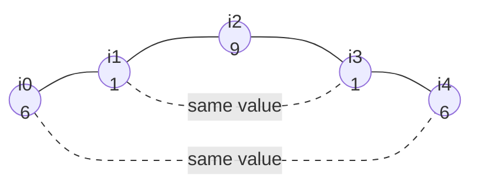

# The Reachability Frontier

A **jump game** gives you an array where the number at each index says how far
forward you are allowed to move from that index, and asks either whether you can
get to the end, or how few moves getting there takes. The **frontier** is the one
number that answers both questions: the farthest index you have proved you can
reach so far

The frontier is a running maximum, so mechanically it looks like the running best
in [Kadane's algorithm](../../01_arrays_and_hashing/notes/04_kadanes_algorithm.md).
What it means is stronger. Kadane's number is a fact about one subarray, while the
frontier is a fact about a whole **set**: every index from `0` up to the frontier
is reachable, not merely the frontier itself. That is why a single integer can
replace an array of booleans, and it is the entire content of this topic

Picture building a plank bridge as you walk it. You are standing on a plank, and
standing there lets you throw new planks some distance ahead. The frontier is the
far end of the finished bridge. It only ever moves forward, because a plank
already laid does not disappear, and the moment your own position passes the far
end you are stepping onto nothing

## An Index Covers A Range, Not A Landing Spot

The load-bearing detail in the problem statement is the word "maximum". In
[Jump Game](https://leetcode.com/problems/jump-game/), `nums[i] = 3` means you may
move forward one, two, or three positions, not that you must move exactly three.
So standing on index `i` does not unlock one index, it unlocks the whole range
`[i + 1, i + nums[i]]`

```text
index    0   1   2   3   4
value    2   3   1   1   4
         |---->            index 0 covers 1 and 2
             |-------->    index 1 covers 2, 3 and 4
```

From that one fact comes the property everything else rests on

> **The set of reachable indices has no holes.** It is always `0` through some
> largest reachable index, with nothing missing in between

The reason is short enough to say out loud. Suppose you can reach index `t` by
some sequence of stops `0 = i0 -> i1 -> ... -> t`, and pick any index `u` below
`t`. Then `u` falls between two consecutive stops `i_m` and `i_{m+1}` of that
sequence, and since `u <= i_{m+1} <= i_m + nums[i_m]`, you could have landed on
`u` directly from `i_m` by jumping a little shorter. So `u` is reachable too.
Shortening a jump is exactly the swap an
[exchange argument](01_greedy_fundamentals.md) is made of, and here it proves the
reachable set is a solid prefix

## Why A Reachability Table Recomputes What One Number Already Says

The direct way to answer the question is to build the reachable set literally. Let
`reachable[i]` mean "index `i` can be landed on", seed index 0, and fill the array
left to right by asking, for each `i`, whether any earlier reachable index can
throw a plank that far

```python
def can_jump_table(nums: list[int]) -> bool:
    n = len(nums)
    reachable = [False] * n
    reachable[0] = True
    for i in range(1, n):
        for j in range(i):
            if reachable[j] and j + nums[j] >= i:
                reachable[i] = True
                break
    return reachable[-1]


assert can_jump_table([2, 3, 1, 1, 4]) is True
assert can_jump_table([3, 2, 1, 0, 4]) is False
assert can_jump_table([0]) is True
```

This is correct and it is `O(n²)`, because the inner loop rescans every earlier
index for each of the `n` positions. Worse, look at what it produces

```text
nums = [3, 2, 1, 0, 4]   reachable = [True, True, True, True, False]
nums = [2, 3, 1, 1, 4]   reachable = [True, True, True, True, True ]
nums = [1, 0, 0, 9, 9]   reachable = [True, True, False, False, False]
```

Every table is a run of `True` followed by a run of `False`, which is the no-holes
property showing up in the output. An array that can only ever take that shape is
carrying one bit of information per entry when it needs one number in total. The
whole table is described by the index of its last `True`, so store that number and
throw the array away

## The Frontier: One Integer For The Whole Reachable Set

Keep `farthest`, meaning "the largest index reachable using only what I have
walked past so far". Walk left to right. At each index, first check whether you
have already fallen off the end of the bridge, and only then let the current index
extend it

```python
def can_jump(nums: list[int]) -> bool:
    farthest = 0
    for i, jump_length in enumerate(nums):
        if i > farthest:
            return False
        farthest = max(farthest, i + jump_length)
    return True


assert can_jump([2, 3, 1, 1, 4]) is True
assert can_jump([3, 2, 1, 0, 4]) is False
assert can_jump([2, 0, 0]) is True
assert can_jump([0]) is True
```

**The three decisions worth defending**:

- The guard is `i > farthest` and not `i >= farthest`, because standing exactly on
  the frontier is a success rather than a failure. The scan opens at index 0 with
  `farthest` still 0, so a non-strict comparison fires on the very first iteration
  of every input and returns `False` unconditionally
- The guard runs **before** `farthest` is updated. If you update first, index `i`
  gets to extend the bridge using a plank that is standing on air, so an
  unreachable index quietly rescues itself and `[1, 0, 0, 9, 9]` comes back `True`
- `max` means the frontier never retreats, which is the code-level statement of
  "a plank already laid does not disappear". A short jump from a late index cannot
  undo a long jump from an early one

There is no need to check `farthest >= n - 1` inside the loop. If the scan
survives to the final index without tripping the guard, the final index was
reachable, so returning `True` after the loop is the same statement

> "The reachable indices always form a prefix, because a jump of up to `nums[i]`
> also covers every position short of that. So I only need the largest reachable
> index, one integer, and I fail the moment my scan position passes it."

## Tracing The Frontier Through An Array That Stalls

Two arrays, five entries each, differing only in how much reach the early indices
hand over

```text
nums = [2, 3, 1, 1, 4]

i=0  nums[i]=2   0 <= 0 ok   candidate 0+2=2   farthest 0 -> 2
i=1  nums[i]=3   1 <= 2 ok   candidate 1+3=4   farthest 2 -> 4
i=2  nums[i]=1   2 <= 4 ok   candidate 2+1=3   DISCARDED, 3 < 4
i=3  nums[i]=1   3 <= 4 ok   candidate 3+1=4   DISCARDED, ties do not improve
i=4  nums[i]=4   4 <= 4 ok                     survived the last index -> True
```

The discarded candidates at `i=2` and `i=3` are the point of the trace. Both
indices are perfectly reachable and both are allowed to jump, and neither changes
the answer, because index 1 had already thrown a plank past where they can reach.
That is why the loop keeps no history: a candidate that fails to beat `farthest`
is not remembered anywhere, and it is never needed again

```text
nums = [3, 2, 1, 0, 4]

i=0  nums[i]=3   0 <= 0 ok   candidate 0+3=3   farthest 0 -> 3
i=1  nums[i]=2   1 <= 3 ok   candidate 1+2=3   DISCARDED, tie
i=2  nums[i]=1   2 <= 3 ok   candidate 2+1=3   DISCARDED, tie
i=3  nums[i]=0   3 <= 3 ok   candidate 3+0=3   DISCARDED, a zero adds nothing
i=4              4 > 3       STOP -> False
```

The zero at index 3 is the trap the problem is built around. Index 3 is reachable,
so the scan happily arrives there, and it contributes a candidate of `3 + 0 = 3`
that ties the frontier and dies. Nothing after it can push the frontier past 3,
so index 4 is stranded and the guard fires. Notice that the failure is detected at
index 4 rather than at index 3, which is why the guard has to sit at the top of
every iteration rather than only at the end

## Counting Jumps By Watching The Frontier Hand Over

[Jump Game II](https://leetcode.com/problems/jump-game-ii/) promises the end is
reachable and asks for the minimum number of jumps. That is a shortest-path
question on an implicit graph, so
[breadth-first search](../../10_graphs/notes/01_graph_basics.md) answers it: level
0 is `{0}`, level `k + 1` is every index you can land on from level `k`. The
trouble is the edge count, since index `i` has up to `nums[i]` successors and the
enumeration costs `O(n²)` on an array of large values

The no-holes argument rescues it, because it applies level by level. The set of
indices reachable in **at most** `k` jumps is also a prefix `0..F_k`, by the same
shorten-the-jump swap, which never increases the number of jumps used. So a BFS
level is not an arbitrary set that needs a queue, it is a contiguous range that
two integers describe completely

```text
nums = [2, 3, 1, 1, 4]

level 0   [0]           F_0 = 0
level 1   [1 .. 2]      F_1 = max(0+2)            = 2
level 2   [3 .. 4]      F_2 = max(1+3, 2+1)       = 4
```

So keep `current_end`, the last index of the level you are walking, and `farthest`,
the frontier being assembled for the next level. Scanning forward, every index
contributes to `farthest`, and the instant the scan reaches `current_end` you have
seen every index of the current level, so `farthest` is now final for the next one
and you spend a jump to move into it

```python
def jump(nums: list[int]) -> int:
    jumps = 0
    current_end = 0
    farthest = 0
    for i in range(len(nums) - 1):
        farthest = max(farthest, i + nums[i])
        if i == current_end:
            jumps += 1
            current_end = farthest
    return jumps


assert jump([2, 3, 1, 1, 4]) == 2
assert jump([2, 3, 0, 1, 4]) == 2
assert jump([1, 2]) == 1
assert jump([0]) == 0
```

**The loop stops at `len(nums) - 1`, and that bound is the whole bug surface**.
Arriving at the last index means you are already done, so letting the scan step
onto it would fire the boundary check one more time and charge a jump for a
journey that has ended. Running the same code over `range(len(nums))` returns 3
for `[2, 3, 1, 1, 4]` instead of 2, and returns 1 for the single-element array
`[0]` instead of 0

Here is the trace, where `BOUNDARY` marks an iteration that spends a jump

```text
nums = [2, 3, 1, 1, 4]      loop runs i = 0, 1, 2, 3

i=0  candidate 0+2=2   farthest 0 -> 2   BOUNDARY i == current_end 0, jumps=1, current_end=2
i=1  candidate 1+3=4   farthest 2 -> 4   i != current_end, keep scanning the level
i=2  candidate 2+1=3   DISCARDED         BOUNDARY i == current_end 2, jumps=2, current_end=4
i=3  candidate 3+1=4   DISCARDED         i != current_end 4, and the loop ends
```

Index 2 is the interesting line. Its candidate of 3 loses to the frontier of 4 and
is thrown away, and in the very same iteration index 2 triggers the level handover
because it is the last index of level 1. Contributing nothing and still being the
boundary are independent facts, which is why the `max` and the `if` are two
separate statements rather than one combined condition

The jump is charged at the moment the level turns over, not when a particular
index is chosen. The algorithm never decides *which* index to jump from, and it
never needs to, since the count only depends on how many levels the prefix takes
to swallow the array

## When Blocked Landings Break The Prefix

[Jump Game VII](https://leetcode.com/problems/jump-game-vii/) changes two things
at once. A jump from index `i` lands somewhere in `[i + min_jump, i + max_jump]`,
so short hops are forbidden, and a landing is only legal on a `'0'` character, so
some positions are walls. Either change alone destroys the no-holes property

```text
s          0  1  1  0  1  0
index      0  1  2  3  4  5      min_jump = 2, max_jump = 3

reachable  T  F  F  T  F  T      holes at 1, 2 and 4
```

With holes in the set, no single integer describes it, so the boolean array comes
back. What survives is that the moves still only go forward, which means
`reachable[i]` depends on a fixed-width band of already-decided entries, namely
whether **any** index in `[i - max_jump, i - min_jump]` is reachable. That is a
counting question over a window that slides one step per index, so the
[fixed-size window](../../04_sliding_window/notes/01_fixed_size_window.md) update
applies: add the entry that enters at the right, subtract the entry that leaves at
the left, and keep the running count

```python
def can_reach_end(s: str, min_jump: int, max_jump: int) -> bool:
    n = len(s)
    if s[-1] != "0":
        return False
    reachable = [False] * n
    reachable[0] = True
    in_window = 0
    for i in range(1, n):
        if i >= min_jump:
            in_window += reachable[i - min_jump]
        if i > max_jump:
            in_window -= reachable[i - max_jump - 1]
        reachable[i] = in_window > 0 and s[i] == "0"
    return reachable[-1]


assert can_reach_end("011010", 2, 3) is True
assert can_reach_end("01101110", 2, 3) is False
assert can_reach_end("0", 1, 1) is True
```

The two guards are off-by-one traps worth reading slowly. Index `i - min_jump`
enters the window at step `i`, so it is added only once `i >= min_jump`, and index
`i - max_jump - 1` has just fallen off the left edge, so it is subtracted only once
`i > max_jump`. Both are read from `reachable`, which is safe because both indices
are strictly below `i` and were therefore decided on an earlier iteration

```text
s = "011010", min_jump = 2, max_jump = 3

i=1  s[i]=1   nothing enters yet          in_window=0   reachable=False
i=2  s[i]=1   index 0 enters              in_window=1   reachable=False, blocked by the wall
i=3  s[i]=0   index 1 enters (False)      in_window=1   reachable=True
i=4  s[i]=1   index 2 enters, 0 leaves    in_window=0   reachable=False
i=5  s[i]=0   index 3 enters, 1 leaves    in_window=1   reachable=True
```

Index 2 is the rejected step. Its window holds a reachable index, so a jump could
physically land there, and it is still marked unreachable because `s[2] == '1'`.
Both halves of the `and` are doing work, and dropping the character test returns
`True` on inputs whose end sits behind a wall

## When Backward Jumps Turn The Array Into A Graph

[Jump Game III](https://leetcode.com/problems/jump-game-iii/) moves you from index
`i` to `i + arr[i]` or `i - arr[i]`, and asks whether any index holding a zero can
be reached from a given start. Two things are now different. The jump length is
exact rather than "at most", so an index unlocks two points instead of a range, and
one of them is behind you. The reachable set is no longer ordered by index at all,
which means there is nothing for a frontier to summarise

At that point stop looking for a greedy rule and call it what it is, an
[implicit graph](../../10_graphs/notes/06_implicit_state_bfs.md) whose nodes are
indices and whose edges are the two moves. A visited set plus a queue is the whole
solution

```python
from collections import deque


def can_reach(arr: list[int], start: int) -> bool:
    n = len(arr)
    seen = {start}
    queue = deque([start])
    while queue:
        i = queue.popleft()
        if arr[i] == 0:
            return True
        for j in (i + arr[i], i - arr[i]):
            if 0 <= j < n and j not in seen:
                seen.add(j)
                queue.append(j)
    return False


assert can_reach([4, 2, 3, 0, 3, 1, 2], 5) is True
assert can_reach([3, 0, 2, 1, 2], 2) is False
assert can_reach([0], 0) is True
```

The `seen` set is not an optimisation here, it is what makes the loop terminate,
because `i + arr[i]` and then `i - arr[i]` walks straight back to where it came
from. Since the question is only reachability, depth-first search with the same
visited set works identically and the queue is a matter of taste

[Jump Game IV](https://leetcode.com/problems/jump-game-iv/) adds a third kind of
move: from index `i` you may go to `i - 1`, to `i + 1`, or to **any** index holding
the same value as `arr[i]`. Those value edges connect positions that are arbitrarily
far apart, so the array really is a graph now



Minimum moves over unit edges is plain BFS, but a value shared by `m` indices
contributes `m²` edges, and an array like `[7] * 50000` would make the search
quadratic. The fix is that a value group is only ever useful **once**: the first
time BFS expands any member of the group, every other member is enqueued at that
same level, so no later expansion of that value can improve anything. Clear the
bucket after using it and each index is scanned once across the whole run

```python
from collections import defaultdict, deque


def min_jumps(arr: list[int]) -> int:
    n = len(arr)
    if n == 1:
        return 0
    positions: dict[int, list[int]] = defaultdict(list)
    for i, value in enumerate(arr):
        positions[value].append(i)
    seen = {0}
    queue = deque([0])
    steps = 0
    while queue:
        for _ in range(len(queue)):
            i = queue.popleft()
            if i == n - 1:
                return steps
            for j in positions[arr[i]]:
                if j not in seen:
                    seen.add(j)
                    queue.append(j)
            positions[arr[i]].clear()
            for j in (i - 1, i + 1):
                if 0 <= j < n and j not in seen:
                    seen.add(j)
                    queue.append(j)
        steps += 1
    return -1


assert min_jumps([100, -23, -23, 404, 100, 23, 23, 23, 3, 404]) == 3
assert min_jumps([7, 6, 9, 6, 9, 6, 9, 7]) == 1
assert min_jumps([6, 1, 9]) == 2
assert min_jumps([7]) == 0
```

`positions[arr[i]].clear()` is the line that turns a quadratic solution into a
linear one, and it is safe precisely because BFS visits levels in order, so
everything that group could offer has already been offered at the earliest possible
level

## Worked Example: [Minimum Jumps to Reach Home](https://leetcode.com/problems/minimum-jumps-to-reach-home/)

A bug starts at position 0 on an infinite number line and wants to land exactly on
position `x`. It can jump forward exactly `a` and backward exactly `b`, it may
never jump backward twice in a row, it may never land on a forbidden position or
on a negative one, and forward jumps have no such pairing restriction

**Input**:

- `forbidden`, a `list[int]` of positions the bug may never land on, holding
  between 1 and 1000 distinct values, each between 1 and 2000
- `a`, an `int` forward jump length, between 1 and 2000
- `b`, an `int` backward jump length, between 1 and 2000, with no guaranteed
  relationship to `a`, so `b` may be larger, smaller, or equal
- `x`, an `int` target position between 0 and 2000, guaranteed not to appear in
  `forbidden`

**Output**: an `int`, the fewest jumps needed to land exactly on `x`, or `-1` when
no legal sequence of jumps reaches it. The bug starts at position 0, so a target of
`x = 0` is answered with 0 jumps rather than 1

The phrase "fewest jumps" over moves that all cost the same is BFS, and the reason
it cannot be the frontier from the top of this topic is that backward jumps make
the reachable set unordered, exactly as in Jump Game III. Two things make this
version harder than a plain grid search, and both need saying before any code

The first is that "no two backward jumps in a row" is a fact about how you arrived,
not about where you are. Position 7 reached by a backward jump has one legal move
and position 7 reached by a forward jump has two, so they are genuinely different
situations. This is
[state augmentation](../../10_graphs/notes/07_weighted_shortest_paths.md): the node
is the pair `(position, arrived_backward)`, and the `seen` set must be keyed on the
pair, since keying on position alone would let the first arrival lock out a strictly
better-equipped second one

The second is that the line is infinite, so the search needs a stated upper bound
or it never terminates. Once the bug is past every forbidden position and past `x`,
the road behind it is clear, so overshooting by more than one forward jump plus one
backward jump can never be part of a shortest route. Therefore
`max(x, max(forbidden)) + a + b` is a safe ceiling

> "The node is not the position, it is the position paired with whether I got here
> by jumping backward, because that flag decides which moves are legal next. I will
> BFS over those pairs, and I will cap positions at `max(x, max(forbidden)) + a + b`
> because past that point nothing forbidden is left to route around."

1. Put `forbidden` into a set, since every generated position needs a membership
   test and a list scan would make each test `O(len(forbidden))`
2. Compute `limit = max(x, max(forbidden)) + a + b` and treat any position above it
   as illegal, which is what makes an infinite line into a finite search space
3. Seed the queue with `(0, False, 0)`, meaning position 0, not arrived backward,
   zero jumps spent, and seed `seen` with the pair `(0, False)`. Starting with the
   flag `False` is what allows the very first move to be a backward one, which is
   correct because there was no previous jump to conflict with
4. Pop a state and check `position == x` immediately on the pop. Because every edge
   costs one jump, the first time BFS pops the target it has arrived by a shortest
   route, so the step count carried in that entry is the answer
5. Generate the forward move `(position + a, False)` unconditionally, and generate
   the backward move `(position - b, True)` only when the current state's flag is
   `False`. The flag written into the successor records how that successor was
   entered, which is the whole reason the pair is the node
6. Reject a successor when its position is negative, above `limit`, in `forbidden`,
   or when its `(position, flag)` pair is already in `seen`. Everything that
   survives goes into `seen` at push time and into the queue with `steps + 1`
7. If the queue empties without popping `x`, every legal state has been visited and
   the target is unreachable, so return `-1`

```python
from collections import deque


def minimum_jumps(forbidden: list[int], a: int, b: int, x: int) -> int:
    blocked = set(forbidden)
    limit = max(x, max(forbidden, default=0)) + a + b
    seen = {(0, False)}
    queue = deque([(0, False, 0)])
    while queue:
        position, came_backward, steps = queue.popleft()
        if position == x:
            return steps
        moves = [(position + a, False)]
        if not came_backward:
            moves.append((position - b, True))
        for next_position, backward in moves:
            state = (next_position, backward)
            if 0 <= next_position <= limit and next_position not in blocked and state not in seen:
                seen.add(state)
                queue.append((next_position, backward, steps + 1))
    return -1


assert minimum_jumps([14, 4, 18, 1, 15], 3, 15, 9) == 3
assert minimum_jumps([8, 3, 16, 6, 12, 20], 15, 13, 11) == -1
assert minimum_jumps([1, 6, 2, 14, 5, 17, 4], 16, 9, 7) == 2
assert minimum_jumps([], 3, 2, 0) == 0
```

Tracing `forbidden = [12]`, `a = 5`, `b = 3`, `x = 7` gives a limit of
`max(7, 12) + 5 + 3 = 20`, and every push and rejection fits in a few lines

```text
pop (0, False) steps=0     -> (5, False)  push
                           -> (-3, True)  REJECTED, negative
pop (5, False) steps=1     -> (10, False) push
                           -> (2, True)   push
pop (10, False) steps=2    -> (15, False) push
                           -> (7, True)   push
pop (2, True) steps=2      -> (7, False)  push          backward move not offered
pop (15, False) steps=3    -> (20, False) push
                           -> (12, True)  REJECTED, forbidden
pop (7, True) steps=3      -> position == x, answer 3
```

Two rejections, each for a different reason, and the second is the one to
remember. Position 12 is a legal arithmetic result that is simply off limits, and
without the `blocked` test the search would route through it and return a shorter
wrong answer

The `(2, True)` line shows the flag doing its job. That state arrived backward, so
only the forward move is generated from it. And notice that positions `(7, True)`
and `(7, False)` are both pushed and both kept, because they are different nodes.
A `seen` set holding bare positions would have discarded the second one, which is
correct here by luck and wrong in general, since the discarded state is the one
with more moves available

- **Time Complexity:** `O(L)` where `L = max(x, max(forbidden)) + a + b`, because
  there are `2L` states in total, each is pushed and popped at most once, and each
  pop generates at most two successors with `O(1)` set lookups
- **Space Complexity:** `O(L + f)` where `f = len(forbidden)`, since `seen` and the
  queue each hold at most one entry per state and the blocked set holds one entry
  per forbidden position

## Time and Space Complexity

Throughout, `n` is the length of the input array or string, and `L` is the position
ceiling `max(x, max(forbidden)) + a + b` used by the home-jumping search

**Reachability, Jump Game**

| Approach                   | Time                                                                              | Space                                                              |
| -------------------------- | --------------------------------------------------------------------------------- | ------------------------------------------------------------------ |
| Frontier scan              | `O(n)`: one pass with `O(1)` work per index, since the frontier is a single `max` | `O(1)`: two integers, and nothing that grows with `n`              |
| Boolean reachability table | `O(n²)`: index `i` rescans every earlier index looking for one that reaches it    | `O(n)`: one boolean per index, all of which encode a single number |

**Minimum jumps, Jump Game II**

| Approach                       | Time                                                                                  | Space                                                                                      |
| ------------------------------ | ------------------------------------------------------------------------------------- | ------------------------------------------------------------------------------------------ |
| Frontier with level boundaries | `O(n)`: each index is visited once and the level handover is `O(1)`                   | `O(1)`: three integers, because a BFS level is a contiguous range rather than a stored set |
| BFS over indices               | `O(n²)`: index `i` enumerates up to `nums[i]` successors, and `nums[i]` can be `O(n)` | `O(n)`: a queue and a visited array over the indices                                       |

**The variants that leave greedy behind**

| Problem                                        | Time                                                                                                                        | Space                                                                                              |
| ---------------------------------------------- | --------------------------------------------------------------------------------------------------------------------------- | -------------------------------------------------------------------------------------------------- |
| Jump Game VII, window over the reachable array | `O(n)`: each index does `O(1)` work, with one entry added and one removed from the running count                            | `O(n)`: the boolean array, which cannot collapse to an integer because the reachable set has holes |
| Jump Game III, BFS over indices                | `O(n)`: each index is enqueued at most once and generates exactly two successors                                            | `O(n)`: the visited set and the queue, each holding at most one entry per index                    |
| Jump Game IV, BFS with value buckets           | `O(n)`: unit edges give two successors per index, and every value group is expanded and cleared exactly once across the run | `O(n)`: the position buckets hold each index once, plus the queue and visited set                  |
| Jump Game IV without clearing the buckets      | `O(n²)`: a value shared by `m` indices is re-enumerated by each of its members, and `m` can be `n`                          | `O(n)`: the same structures, so the failure is time only and the code still looks correct          |
| Minimum Jumps to Reach Home                    | `O(L)`: `2L` states, each popped once with two successors                                                                   | `O(L + f)`: one entry per visited state, plus `f` forbidden positions in a set                     |

## Summary

- A **jump game** array is one where `nums[i]` is the *maximum* forward move from
  index `i`, so standing on `i` unlocks the entire range `[i + 1, i + nums[i]]`
  rather than the single index `i + nums[i]`
  - That is the fact the whole family rests on, and misreading it as an exact jump
    length turns an `O(n)` scan into a graph search
- Because a jump can always be shortened, the set of reachable indices is a solid
  prefix `0..F` with no holes, so it is fully described by the single integer `F`,
  the **frontier**
  - The shortening swap is the [exchange argument](01_greedy_fundamentals.md)
    applied to this problem, and it is what licenses the greedy rule
  - Say the property out loud before coding, because it is the justification an
    interviewer is listening for, and the code is three lines once it is stated
- The reachability scan keeps `farthest`, checks `if i > farthest: return False`
  before updating it, and then does `farthest = max(farthest, i + nums[i])`
  - The comparison is strict, since standing exactly on the frontier is legal. A
    non-strict `i >= farthest` fires at index 0 of every input, because the scan
    starts sitting on the frontier it is about to test against
  - Checking after the update is the real bug, because it lets an unreachable index
    extend the frontier with a plank standing on air
  - A zero entry is the classic trap: it is reachable, it contributes a candidate
    equal to its own index, and it strands everything past the current frontier
- Minimum jumps works because "reachable in at most `k` jumps" is a prefix too, so
  each BFS level is a contiguous range that two integers describe: `current_end`
  for the level being scanned and `farthest` for the level being assembled
  - The jump count increases when the scan reaches `current_end`, which is the
    moment every index of the current level has contributed
  - The loop must stop at `len(nums) - 1`, because stepping onto the final index
    triggers one more handover and charges a jump for a trip already finished
  - The algorithm never picks which index to jump from, and never needs to, since
    only the number of levels matters
- The frontier survives only while moves are forward and cover a range. Break
  either condition and the no-holes property goes with it
  - Blocked landing positions or a minimum jump distance put holes in the reachable
    set, so the boolean array comes back, but forward-only motion keeps the
    dependency inside a fixed band and a sliding-window count answers it in `O(n)`
  - Backward moves destroy the ordering entirely, so Jump Game III, Jump Game IV,
    and Minimum Jumps to Reach Home are BFS over an implicit graph, and the visited
    set is what makes them terminate rather than what makes them fast
- Jump Game IV's same-value edges would be `O(n²)`, and clearing each value bucket
  after its first expansion makes the run linear, which is safe because BFS reaches
  every member of a group at the earliest possible level
- When a rule constrains what you may do next based on how you arrived, the node is
  a pair, as in `(position, arrived_backward)` for the home-jumping bug
  - Keying `seen` on the position alone lets a worse-equipped first arrival block a
    better-equipped second one
  - An unbounded line needs an argued ceiling, and
    `max(x, max(forbidden)) + a + b` works because past every obstacle and past the
    target there is nothing left to route around

## Interview Checklist

Before writing code, make sure you can answer each of these

```text
Is nums[i] a maximum jump length (a range of landing spots) or an exact one (two points)?
Can I state why the reachable set has no holes, and shorten a jump to prove it?
Am I answering "can I reach it" (one boolean) or "how few jumps" (a level count)?
Does the guard run before the frontier update, and is it i > farthest rather than i >= farthest?
What does my code return on a single-element array, where zero jumps are needed?
For minimum jumps: does my loop stop at n - 2 so landing on the last index costs nothing?
For minimum jumps: which variable is the level I am scanning, and which is the level I am building?
Do any moves go backward, or land on blocked cells, or require an exact distance?
If so, have I stopped defending a greedy rule and switched to BFS with a visited set?
Does a rule depend on how I arrived, meaning the node is a tuple rather than a position?
If the space is unbounded, what is my ceiling and what is the argument for it?
Is there a repeated group of edges, like equal values, that must be cleared after one use?
```
