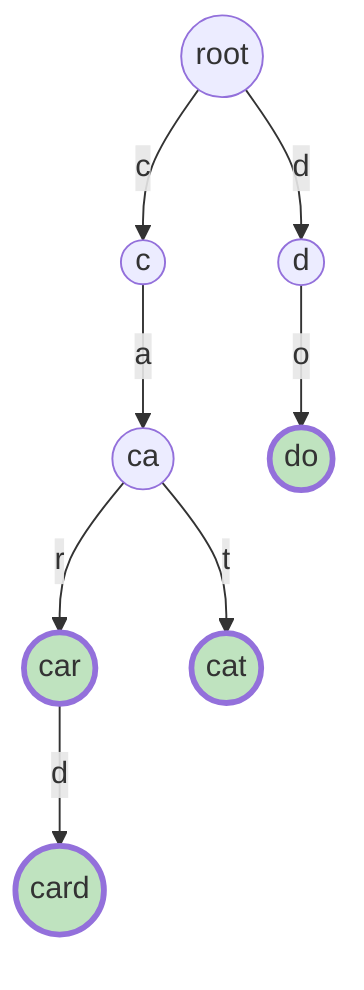
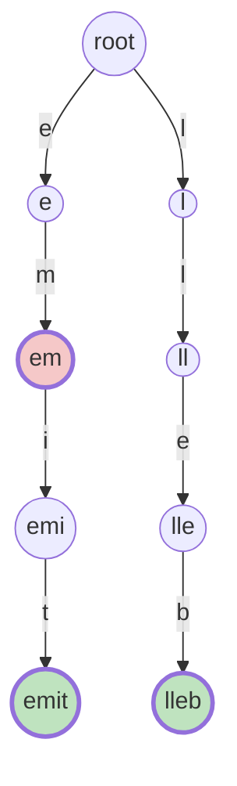

# Tries (Prefix Trees)

A **trie** is a [tree](../../07_trees/notes/01_fundamentals.md) whose edges are
labelled with single characters, so that walking from the root down to any node
spells out a string. The name is the middle of the word re**trie**val, and it is
pronounced either "try" or "tree" depending on who you ask

Its other name, **prefix tree**, says what it is for. A **prefix** of a word is
any run of characters from the start of that word, so `c`, `ca`, `car` and `card`
are all prefixes of `card`. In a trie every node *is* one prefix of the words you
stored, the root is the empty prefix, and a word you inserted is just one
particular node somewhere down a path

That is the whole difference from the [hash set](../../01_arrays_and_hashing/notes/02_hashing.md)
you already know. A set stores each word as one indivisible key, so it can tell
you whether `card` is present and nothing else. A trie takes the word apart and
stores its characters along a path, so words that begin the same way physically
share the same nodes. Think of nested folders on a disk: `c/a/r` and `c/a/t` are
two different files that live inside the same `c/a` directory, and that directory
exists exactly once

Here is a trie holding `car`, `card`, `cat`, and `do`. Green nodes are the four
words themselves, and every other node is a prefix that some word passes through



Two things in that picture do the teaching. The three words `car`, `card`, and
`cat` are ten characters written out but only five nodes stored, because `c` and
`ca` are shared by all three and `car` is shared by two of them. And the node
`ca` is not green, because `ca` was never inserted as a word even though it
exists as a node, which means a node existing and a word existing are two
different facts that the structure has to record separately

> This topic covers the node shape, insert and search and prefix search, the
> end-of-word marker that keeps those two facts apart, what else a node can be
> made to carry, and the reversal trick that turns a suffix question into a
> prefix question

## Why a Hash Set Cannot Answer Prefix Questions

Say you are storing a dictionary of words and the queries are "is `card` one of
them" and "does any stored word start with `car`". A `set` handles the first
query in `O(len(word))` and there is nothing to improve. The second one is where
it falls apart, because a set has no way to look inside a key, so the only
implementation available is to look at every word

```python
def starts_with_scan(words: list[str], prefix: str) -> bool:
    for word in words:
        if word.startswith(prefix):
            return True
    return False


assert starts_with_scan(["car", "card", "care"], "car") is True
assert starts_with_scan(["car", "card", "care"], "cab") is False
assert starts_with_scan([], "c") is False
```

With `n` stored words of length up to `L`, one query costs `O(n * L)`, and the
problems that ask prefix questions are almost always design problems that fire
thousands of queries at a dictionary of thousands of words. That product is what
times out

Look at *what* the scan spends its time on rather than just at the bound. Testing
`car` against `card` compares `c`, `a`, `r`. Testing it against `care` compares
`c`, `a`, `r` again. Testing it against `car` compares them a third time. The
same three comparisons are redone once per stored word, and they are redone on
every future query too, because a set forgets everything between calls

The wasted work has an obvious shape: it is exactly the shared opening of the
words. So store the shared opening once, walk it once, and the single walk
answers for every word underneath it at the same time. Storing shared openings
once is the trie, and once you have one, a prefix query costs `O(len(prefix))`
and does not depend on `n` at all

> "A set can only match whole keys, so `startsWith` degrades to a linear scan
> over the dictionary. The words share their opening characters, so I will store
> those characters once in a trie and walk the prefix a single time"

## The Node, and What the Path Spells

A trie node holds two things, and neither of them is a character

```python
class TrieNode:
    def __init__(self) -> None:
        self.children: dict[str, TrieNode] = {}
        self.is_word: bool = False
```

The character lives on the **edge**, which in code means it is the key in the
parent's `children` dictionary. A node itself is anonymous, and it means "the
string spelled by the path that reaches me". That is why the root holds no
character, since the path to the root is empty and the empty string is a prefix
of everything

`is_word`, the **terminal flag** or end-of-word marker, is the field beginners
leave out and then cannot get back. Insert `card` alone and the trie contains
nodes for `c`, `ca`, `car`, and `card`, so the node at `car` exists even though
`car` was never a word. Without a flag there is no way to answer `search("car")`,
because the only evidence available, node existence, says yes for both. A leaf
test does not rescue it either, since `car` is a real word in the picture above
and is not a leaf

> "A node existing only tells me some stored word has that prefix. I need a
> separate boolean on the node to record that a word actually ends there, and
> `search` reads the boolean while `startsWith` only checks that the walk
> survived"

The three operations are the same walk with different endings

```python
class Trie:
    def __init__(self) -> None:
        self.root = TrieNode()

    def insert(self, word: str) -> None:
        node = self.root
        for ch in word:
            if ch not in node.children:
                node.children[ch] = TrieNode()
            node = node.children[ch]
        node.is_word = True

    def _walk(self, text: str) -> TrieNode | None:
        node = self.root
        for ch in text:
            if ch not in node.children:
                return None
            node = node.children[ch]
        return node

    def search(self, word: str) -> bool:
        node = self._walk(word)
        return node is not None and node.is_word

    def starts_with(self, prefix: str) -> bool:
        return self._walk(prefix) is not None


t = Trie()
for w in ("car", "card", "cat"):
    t.insert(w)
assert t.search("car") is True
assert t.search("ca") is False
assert t.starts_with("ca") is True
assert t.starts_with("cab") is False
assert t.search("card") is True
assert Trie().search("") is False
assert Trie().starts_with("") is True
```

**The lines worth defending out loud**:

- `insert` creates a node only when the character is missing, so inserting `card`
  after `car` allocates exactly one node. Words that share nothing allocate a
  fresh node per character, which is the worst case for space
- `insert` never checks whether the word is already present, because re-inserting
  it walks the same path and re-sets `is_word` to a value it already had, and
  that is harmless rather than a bug worth guarding
- `_walk` returns the node or `None`, and it is the only place the trie is
  traversed. Writing `search` and `starts_with` on top of it is what makes the
  difference between them one line instead of two near-identical loops that drift
  apart
- `search` and `starts_with` differ by exactly `and node.is_word`, which is the
  near-miss to name in an interview, because returning `True` for a bare prefix
  is the single most common trie bug
- The empty string is not a special case anywhere. `starts_with("")` walks zero
  characters, returns the root, and answers `True`, which is correct because
  every word begins with the empty prefix. `search("")` returns the root's flag,
  which is `False` until somebody actually inserts `""`

## Dry Run: Three Words In, Four Questions Out

Inserting `car`, then `card`, then `cat`, into an empty trie

```text
insert("car")   c:new    a:new    r:new             mark is_word at "car"
insert("card")  c:reuse  a:reuse  r:reuse  d:new    mark is_word at "card"
insert("cat")   c:reuse  a:reuse  t:new             mark is_word at "cat"
```

Ten characters went in and six nodes exist afterwards, counting the root. Five of
the ten characters reused a node that was already there, and that reuse is the
entire reason the structure is worth building

Now four queries against that trie

```text
search("car")        c:ok  a:ok  r:ok      is_word=True    -> True
search("ca")         c:ok  a:ok            is_word=False   -> False   REJECTED
starts_with("ca")    c:ok  a:ok                            -> True
starts_with("cab")   c:ok  a:ok  b:missing                 -> False   REJECTED
```

The two rejections fail for completely different reasons, and telling them apart
is the point of the trace. `search("ca")` walked successfully all the way to the
end of the query, and every character matched, so the walk itself has no
complaint. It is rejected purely by the flag, because no word ends at that node.
Delete `and node.is_word` from the code and this line silently becomes `True`

`starts_with("cab")` is rejected earlier and by the structure instead. The walk
died at `b`, since the `ca` node has children `r` and `t` only. Nothing about
`is_word` was consulted, and nothing needed to be, because a missing edge already
proves no stored word continues that way

The middle line is the pair to the first. `starts_with("ca")` and `search("ca")`
run the identical walk, reach the identical node, and return opposite answers

## Three Ways to Store the Children

The `dict[str, TrieNode]` above is the default worth writing, because it works
for any alphabet, costs
[`O(1)` per lookup](../../00_fundamentals/notes/04_common_operation_costs.md),
and allocates only the branches that exist. The alternative is a fixed array
`[None] * 26` indexed by `ord(ch) - ord("a")`, which is a little faster by a
constant factor and hands you a-to-z child order for free, which is convenient
when a problem wants the lexicographically smallest answer. It also wastes 26
slots at every node regardless of how many are used, so it only makes sense when
the alphabet really is fixed and small

There is a third form worth recognising, because it is quicker to type under time
pressure and interviewers accept it. Drop the class entirely and use plain nested
dictionaries, with a sentinel key standing in for the terminal flag

```python
WORD_END = "$"


def build_trie(words: list[str]) -> dict:
    root: dict = {}
    for word in words:
        node = root
        for ch in word:
            node = node.setdefault(ch, {})
        node[WORD_END] = True
    return root


def contains_word(root: dict, word: str) -> bool:
    node = root
    for ch in word:
        if ch not in node:
            return False
        node = node[ch]
    return WORD_END in node


d = build_trie(["car", "card", "cat"])
assert contains_word(d, "car") is True
assert contains_word(d, "ca") is False
assert contains_word(build_trie([]), "a") is False
```

`node.setdefault(ch, {})` is the whole insert loop, since it returns the existing
child when there is one and creates it otherwise. The cost is that `WORD_END`
occupies the same namespace as the characters, so this form breaks the moment the
alphabet can contain `$`, and it gives you nowhere clean to hang extra fields.
Reach for the class as soon as a node needs to carry anything more than a flag

## Every Prefix Also Has to Be a Word

[Longest Word In Dictionary](https://leetcode.com/problems/longest-word-in-dictionary/)
turns the node-versus-word distinction into an entire problem. It asks for the
longest word that can be built one character at a time, where every intermediate
string must itself be in the dictionary, with ties broken by taking the
lexicographically smallest

In trie terms the condition is short: a word is buildable when every node on the
path to it, not just the last one, has `is_word` set. So do a
[depth-first search](../../07_trees/notes/02_dfs.md) from the root and refuse to
descend into any child whose flag is `False`, which prunes the whole subtree
beneath it because nothing further down can be buildable either

```python
def longest_word_in_dictionary(words: list[str]) -> str:
    root = TrieNode()
    for word in words:
        node = root
        for ch in word:
            node = node.children.setdefault(ch, TrieNode())
        node.is_word = True

    best = ""
    stack: list[tuple[TrieNode, str]] = [(root, "")]
    while stack:
        node, spelled = stack.pop()
        if len(spelled) > len(best) or (len(spelled) == len(best) and spelled < best):
            best = spelled
        for ch, child in node.children.items():
            if child.is_word:
                stack.append((child, spelled + ch))
    return best


assert longest_word_in_dictionary(["w", "wo", "wor", "worl", "world"]) == "world"
assert longest_word_in_dictionary(["a", "banana", "app", "appl", "ap", "apply", "apple"]) == "apple"
assert longest_word_in_dictionary(["ab"]) == ""
assert longest_word_in_dictionary([]) == ""
```

Carrying `spelled` alongside the node is what makes the answer printable, since a
node cannot tell you its own string. Comparing lengths first and only then
comparing alphabetically is the tie-break the problem asks for, and doing it
explicitly means the iteration order over `node.children` never matters. The
`["ab"]` case returns the empty string because `a` was never inserted, so the
search refuses to take even the first step

## What a Node Can Carry Besides a Flag

Every word beginning with `app` passes through the node at `app`. That single
sentence is the reason tries are worth more than membership testing, because it
means a node is a natural place to keep an aggregate over all the words below it,
updated as you walk down during insert rather than computed later by exploring
the subtree

[Implement Trie II](https://leetcode.com/problems/implement-trie-ii-prefix-tree/)
is that idea in its plainest form. Keep `prefix_count`, bumped at every node the
insert passes through, and `word_count`, bumped only at the final node

```python
class CountingNode:
    def __init__(self) -> None:
        self.children: dict[str, CountingNode] = {}
        self.word_count: int = 0
        self.prefix_count: int = 0


class TrieII:
    def __init__(self) -> None:
        self.root = CountingNode()

    def insert(self, word: str) -> None:
        node = self.root
        for ch in word:
            node = node.children.setdefault(ch, CountingNode())
            node.prefix_count += 1
        node.word_count += 1

    def _walk(self, text: str) -> CountingNode | None:
        node = self.root
        for ch in text:
            if ch not in node.children:
                return None
            node = node.children[ch]
        return node

    def count_words_equal_to(self, word: str) -> int:
        node = self._walk(word)
        return 0 if node is None else node.word_count

    def count_words_starting_with(self, prefix: str) -> int:
        node = self._walk(prefix)
        return 0 if node is None else node.prefix_count

    def erase(self, word: str) -> None:
        node = self.root
        for ch in word:
            node = node.children[ch]
            node.prefix_count -= 1
        node.word_count -= 1


tii = TrieII()
tii.insert("apple")
tii.insert("apple")
assert tii.count_words_equal_to("apple") == 2
assert tii.count_words_starting_with("app") == 2
tii.erase("apple")
assert tii.count_words_equal_to("apple") == 1
assert tii.count_words_starting_with("app") == 1
assert tii.count_words_equal_to("app") == 0
assert TrieII().count_words_starting_with("") == 0
```

The counters replace the boolean rather than joining it, because a count of zero
already means "not a word here" and a count above one records duplicates that a
boolean would collapse. `erase` decrements on the way down and leaves the nodes
in place, which is the right call under interview pressure: physically deleting
them means walking back up removing any node whose `prefix_count` hit zero, and
the extra code buys memory the grader does not measure

The same slot can hold a sum instead of a count, which is
[Map Sum Pairs](https://leetcode.com/problems/map-sum-pairs/), and that version
carries a real trap. Its `insert(key, val)` **overwrites** a key that is already
stored rather than adding another copy of it, so adding `val` to every node on
the path double-counts the old value. Keep the previous values in a separate dict
and propagate the **delta**

```python
class MapSumNode:
    def __init__(self) -> None:
        self.children: dict[str, MapSumNode] = {}
        self.total: int = 0


class MapSum:
    def __init__(self) -> None:
        self.root = MapSumNode()
        self.stored: dict[str, int] = {}

    def insert(self, key: str, val: int) -> None:
        delta = val - self.stored.get(key, 0)
        self.stored[key] = val
        node = self.root
        for ch in key:
            node = node.children.setdefault(ch, MapSumNode())
            node.total += delta

    def sum(self, prefix: str) -> int:
        node = self.root
        for ch in prefix:
            if ch not in node.children:
                return 0
            node = node.children[ch]
        return node.total


ms = MapSum()
ms.insert("apple", 3)
assert ms.sum("ap") == 3
ms.insert("app", 2)
assert ms.sum("ap") == 5
ms.insert("apple", 5)
assert ms.sum("ap") == 7
assert ms.sum("zz") == 0
assert MapSum().sum("a") == 0
```

Trace the third insert against the asserts. Before it, `ap` totals 5 from
`apple = 3` and `app = 2`. Re-inserting `apple` at 5 propagates `5 - 3 = 2`, so
the total becomes 7, which is `5 + 2` and correct. Propagating the raw 5 would
give 10, counting the old 3 that the overwrite was supposed to erase

## Reversing the Word to Ask About Suffixes

A trie only ever knows about prefixes, since a prefix is what a path from the
root spells. When the question is about **suffixes** instead, the fix is not a
different structure, it is to insert every word backwards, because a suffix of a
word is a prefix of that word reversed

[Short Encoding Of Words](https://leetcode.com/problems/short-encoding-of-words/)
is the clean case. A word can be dropped from the encoding when it is a suffix of
some other word, since it can be read out of that longer word's tail for free.
Insert the reversed words and the question becomes a shape question: a word
survives when its reversed path ends at a node with no children, because a child
would mean some longer word continues past it and therefore swallows it

Here is the trie for `time`, `me`, and `bell` reversed into `emit`, `em`, and
`lleb`. The pink node is where `me` ends, and it has a child, so `me` is a suffix
of something longer and gets absorbed



```python
def minimum_length_encoding(words: list[str]) -> int:
    unique = set(words)
    root = TrieNode()
    for word in unique:
        node = root
        for ch in reversed(word):
            node = node.children.setdefault(ch, TrieNode())

    total = 0
    for word in unique:
        node = root
        for ch in reversed(word):
            node = node.children[ch]
        if not node.children:
            total += len(word) + 1
    return total


assert minimum_length_encoding(["time", "me", "bell"]) == 10
assert minimum_length_encoding(["t"]) == 2
assert minimum_length_encoding(["a", "a"]) == 2
assert minimum_length_encoding([]) == 0
```

The reversed paths for `time` and `bell` end at leaves, so they contribute
`5 + 5 = 10`, which is exactly the length of the string `time#bell#` that the
problem is asking you to measure. The `set(words)` is load-bearing rather than
tidiness, because a duplicated word walks the same path twice and both copies look
like leaves, so the duplicate would be charged for a second time. No `is_word`
flag appears anywhere here, since the question is about node shape rather than
about which strings were words

The same reversal shows up again in
[wildcard and stream matching](02_word_dictionary.md) and in the
[trie-plus-search problems](03_trie_plus_dfs.md), so it is worth storing as a
reflex: the words are asked about from the back means insert them from the back

## Worked Example: [Replace Words](https://leetcode.com/problems/replace-words/)

You are given a list of root words and a sentence. Whenever a word in the
sentence begins with one of the roots, replace it by that root, and when several
roots match, use the shortest one. Words with no matching root are left alone

**Input**:

- `dictionary`, a `list[str]` of root words made of lowercase English letters
- `sentence`, a `str` of lowercase words separated by single spaces

**Output**: a `str`, the sentence rebuilt word by word, where each word has been
replaced by its shortest matching root and every other word is copied through
unchanged. The spacing of the original sentence is preserved, so the output has
the same number of words as the input

The identifying phrase is "replace it with the root forming it", which is a
prefix question wearing a costume, and "the shortest one" is the second half of
the signal. The naive version tests every word against every root with
`word.startswith(root)`, which costs `O(W * n * L)` for `W` sentence words, `n`
roots, and root length up to `L`, and it re-derives the same shared openings for
every single word in the sentence

The trie removes both factors at once. Walking a sentence word down the trie
visits its prefixes in increasing length, `c` then `ca` then `car`, so the first
terminal flag you meet is by construction the shortest matching root, and you can
stop walking the moment you see it

> "Every root that matches this word is a prefix of it, and walking the trie
> hands me those prefixes shortest first. So I walk until either a node is
> flagged as a word, which is my answer, or the next character is missing, which
> means no root matches and the word stays as it is"

Therefore,

1. Build one trie from the whole dictionary, inserting each root and flagging its
   final node, because the sentence will be queried against all the roots at once
   and the roots do not change as you go
2. Split the sentence on spaces and handle each word independently, collecting
   the results in a list to join at the end, since building the output by
   repeated string concatenation copies the whole accumulated string each time
3. For one word, start at the root of the trie and step through the word's
   characters while tracking the index, because the index is what lets you slice
   the matching root back out of the word
4. If the current character has no child, stop immediately and keep the original
   word, because a missing edge proves no root continues this way and no longer
   prefix can rescue it
5. If the node you just moved into is flagged, stop and emit `word[:i + 1]`,
   which is the prefix you have walked so far. It is the shortest match because
   the walk visits prefixes in increasing length and this is the first flag seen
6. If the loop runs off the end of the word without either event, keep the
   original word, which is the case where the word is a strict prefix of some root
   rather than the other way round
7. Join the collected pieces with single spaces, which reproduces the original
   word separation

```python
def replace_words(dictionary: list[str], sentence: str) -> str:
    root = TrieNode()
    for word in dictionary:
        node = root
        for ch in word:
            node = node.children.setdefault(ch, TrieNode())
        node.is_word = True

    out: list[str] = []
    for word in sentence.split():
        node = root
        for i, ch in enumerate(word):
            if ch not in node.children:
                out.append(word)
                break
            node = node.children[ch]
            if node.is_word:
                out.append(word[: i + 1])
                break
        else:
            out.append(word)
    return " ".join(out)


assert (
    replace_words(["cat", "bat", "rat"], "the cattle was rattled by the battery")
    == "the cat was rat by the bat"
)
assert replace_words(["a", "b", "c"], "aadsfasf absbs bbab cadsfafs") == "a a b c"
assert replace_words(["cat", "ca"], "cattle") == "ca"
assert replace_words([], "hello world") == "hello world"
```

The `for`/`else` is doing real work rather than showing off, because `else` runs
only when the loop finished without a `break`, which is exactly step 6. The third
assert is the one that proves shortest-wins: both `ca` and `cat` are roots of
`cattle`, the walk hits the flag on `ca` first, and it stops there instead of
continuing to `cat`

- **Time Complexity:** `O(D + S)`, where `D` is the total number of characters
  across all the roots and `S` is the length of the sentence, because building
  the trie touches each dictionary character once and each sentence word is
  walked at most to its own length before it either matches or fails
- **Space Complexity:** `O(D)` for the trie, since it allocates at most one node
  per dictionary character, plus `O(S)` for the output list and the joined
  string, which is unavoidable because the answer is that size

## Time and Space Complexity

Throughout, `n` is the number of stored words, `L` is the length of a single word
being inserted or searched, `p` is the length of a queried prefix, `N` is the
total number of characters across all stored words, and `Σ` is the alphabet size

**Answering "does any stored word begin with this prefix?"**

| Approach                   | Time                                                                                                                       | Space                                                                                                                                |
| -------------------------- | -------------------------------------------------------------------------------------------------------------------------- | ------------------------------------------------------------------------------------------------------------------------------------ |
| Scanning a `set` or `list` | `O(n * L)`: every stored word has to be tested, and each test compares up to `L` characters before it can be ruled out     | `O(N)`: each word is stored whole, so the storage is the sum of their lengths with no sharing                                        |
| Walking a trie             | `O(p)`: one step per prefix character, with a dict lookup at each, and completely independent of how many words are stored | `O(N)`: at most one node per inserted character, and strictly fewer whenever words share openings, since a shared node is not copied |

The trie never uses more nodes than there are characters, but each node is an
object holding a dictionary, so its constant factor per character is much worse
than a flat string. The win is the query time, not the bytes

**Trie operations, with children stored in a `dict`**

| Operation                                | Time                                                                                                                           | Space                                                                                                                       |
| ---------------------------------------- | ------------------------------------------------------------------------------------------------------------------------------ | --------------------------------------------------------------------------------------------------------------------------- |
| `insert(word)`                           | `O(L)`: one dict lookup and at most one allocation per character                                                               | `O(L)`: worst case one new node per character, when the word shares no prefix with anything already stored                  |
| `search(word)` / `starts_with(prefix)`   | `O(L)` and `O(p)`: the same walk, ending in a flag read or a `None` check                                                      | `O(1)`: the walk holds one node reference and allocates nothing                                                             |
| `count_words_starting_with(prefix)`      | `O(p)`: the counter was maintained during insert, so the answer is read off one node instead of exploring the subtree below it | `O(1)`: one extra integer per node, paid at build time rather than at query time                                            |
| Listing every stored word under a prefix | `O(p + M)`: walk to the prefix node, then visit the subtree, where `M` is the number of nodes below it                         | `O(h)` for the recursion or explicit stack, where `h` is the longest word's length, plus the size of the output list itself |
| Building the whole trie from `n` words   | `O(N)`: each character of each word is handled exactly once                                                                    | `O(N)` with a dict per node, or `O(N * Σ)` with a fixed `[None] * Σ` array per node, since those slots are allocated unused |

Every single-word bound above depends only on that word's length and never on
`n`, which is the sentence to say out loud. A trie holding ten words and a trie
holding ten million words answer `startsWith("car")` in the same three steps

## Summary

- A **trie**, also called a **prefix tree**, is a tree whose edges carry single
  characters, so the path from the root to a node spells a string and every node
  stands for one prefix of the stored words
  - The node itself stores no character. The character is the key under which the
    parent holds that child, which is why the root is characterless and stands
    for the empty prefix
  - Words that begin the same way share the same nodes, so `car`, `card`, and
    `cat` occupy five nodes rather than ten characters worth of storage
- Reach for a trie when the problem asks a question about **prefixes** across a
  whole dictionary, such as autocomplete, "shortest root of this word", "how many
  stored words start with this", or repeated lookups of many words against one
  fixed word list
  - A plain `set` beats a trie whenever the only question is whole-word
    membership, because it answers in `O(L)` with far less overhead, and reaching
    for a trie there is a real interview mistake
- The naive alternative is scanning every stored word with `startswith`, which
  costs `O(n * L)` per query and redoes the same character comparisons once per
  word and once per query. A trie walk costs `O(p)` and does not depend on `n`
- The **terminal flag**, `is_word`, is what separates "a node exists here"
  from "a word ends here", and it cannot be derived from the structure
  - Inserting `card` creates a node for `car` even though `car` is not a word, so
    node existence proves only that some word has that prefix
  - Leaf-ness does not substitute for it either, because a stored word can have
    longer words beneath it, as `car` does under `card`
  - `search` and `starts_with` are the identical walk and differ only in whether
    the flag is consulted, and returning `True` for a bare prefix is the most
    common trie bug
- Children live in a `dict[str, TrieNode]` by default, which suits any alphabet
  and allocates only the branches used
  - A fixed `[None] * 26` array indexed by `ord(ch) - ord("a")` is slightly
    faster and gives alphabetical child order for free, at the cost of 26 slots
    per node whether or not they are used
  - Nested plain dictionaries with a `"$"` sentinel key are the fastest form to
    type, and they break if `$` can appear in the alphabet or if a node needs to
    carry extra fields
- A node is a place to keep an aggregate over every word beneath it, because
  every such word passes through it during insert
  - `prefix_count` bumped at each node on the way down and `word_count` bumped at
    the last node answer both counting queries of Implement Trie II in `O(p)`,
    and `erase` just decrements the same fields
  - Map Sum Pairs stores a running total the same way, but its `insert`
    overwrites an existing key, so propagate `val - previous_value` rather than
    `val` and keep the previous values in a side dictionary
- Inserting words **reversed** turns every suffix question into a prefix
  question, since a suffix of a word is a prefix of that word backwards
  - Short Encoding Of Words uses it to ask a pure shape question, where a word
    survives only if its reversed path ends at a node with no children, and the
    input must be de-duplicated first or a repeated word is charged twice
- The costs are `O(L)` to insert, `O(L)` to search, `O(p)` for a prefix query,
  and `O(N)` nodes for `N` total characters, with fewer nodes whenever prefixes
  are shared
  - None of the query bounds mention `n`, the number of stored words, which is
    the property that makes the structure worth building

## Interview Checklist

Before writing code, make sure you can answer each of these

```text
Is the question about prefixes, or is a plain set enough for whole-word lookup?
What is the node: a children map plus a flag, or does it need counts or sums too?
Where does the character live, on the node or on the edge into it?
Does search check is_word, and does startsWith deliberately not check it?
What does an empty word or an empty prefix return, and is that the right answer?
Are children a dict, a 26-slot array, or nested plain dicts with a sentinel key?
Is the query about suffixes, meaning I should insert every word reversed?
Can I keep an aggregate on each node during insert instead of scanning a subtree?
If keys can be re-inserted with a new value, am I propagating a delta or the value?
Can I state that every operation costs O(word length) and never depends on n?
```
