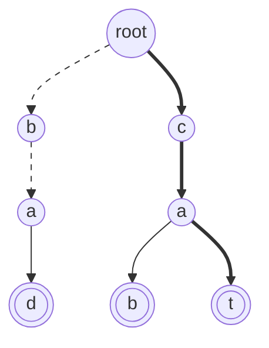

# Wildcard And Near-Miss Search Over A Trie

In [trie basics](01_trie_basics.md) a search is a walk. You stand on a node, read
the next character of the word, and that character names exactly one child to
move to. There is never a choice to make, so the whole thing is a `for` loop over
the characters and the only two outcomes are "the child was missing" or "I
arrived, is `is_word` set"

A **wildcard** breaks that. A wildcard is a character in the query that stands for
any single character, written as `.` in the problems in this module, so `c.t`
should match `cat` and `cot` and anything else of that shape. When you reach a
wildcard you no longer know which child to take, and every child of the current
node is a legitimate continuation. The walk stops being a walk and becomes a
**branching search**

That is the whole topic. The query no longer names one path through the trie, it
names a *set* of paths, and your job is to decide whether any path in that set
ends on a word. Searching a set of paths in a tree is [depth-first
search](../../07_trees/notes/02_dfs.md), which you already know, so the technique
here is really "trie walk, with recursion where the choices are"

The piece that makes the recursion easy to write is that **the pattern index and
the trie depth move together**. Character `i` of the pattern is always matched at
a node of depth `i`, because every step consumes exactly one character and
descends exactly one level. So the entire position of the search is two things: a
node and an index. That pair is the state you recurse on, and it is what you say
out loud when the interviewer asks what your recursion is doing

## Queries That Name A Set Of Paths, Not One

The wildcard is only the most literal version of this. The same "one node plus
one index, recursing where there is a choice" shape covers a family of queries:

- A pattern with `.` in it, which is *Design Add And Search Words Data
  Structure*, where the choice is "which child does the dot stand for"
- "Is there a stored word exactly one character different from this one", which
  is *Implement Magic Dictionary*, where the choice is "do I spend my one
  allowed mismatch here"
- "Give me the top three products for every prefix of what the user has typed so
  far", which is *Search Suggestions System*, where after the walk you collect
  everything in the subtree below where you stopped
- "As characters stream in one at a time, does any stored word end at the newest
  character", which is *Stream Of Characters*, where the fix is to change what you
  store rather than how you search

It is worth being clear about what does **not** need any of this. If the unknown
characters are all at the tail, as in "every word starting with `ca`", that is
plain prefix search and the loop from trie basics already answers it. If there is
exactly one query and it is a straight membership test, a `set` answers it in
`O(L)` with no structure to build, and a trie is the wrong tool

## Why Testing The Pattern Against Every Word Dies

Keep the dictionary as a plain `list[str]`. To answer `search("b..")`, walk the
list, and for each stored word of the right length compare position by position,
letting `.` match anything. This is correct, short, and needs no trie at all

It dies on repeated work across words that look alike. With `n` stored words of
length `L`, one query costs `O(n * L)` because every word is examined, and
nothing about examining `cab` tells the scan anything about `cat` even though the
two agree on their first two characters. Run `search("b..")` against a dictionary
of ten thousand words beginning with `c` and the letter `c` is fetched, compared
against `b`, and rejected ten thousand separate times

The wasted work is entirely in the shared prefixes, and merging shared prefixes
into one path is exactly what a trie is for. Once the words live in a trie, that
whole population of `c` words hangs below a single `c` node, and one failed
dictionary lookup at the root discards all of them at once. What is left over is
the case where the current character genuinely does not tell you where to go,
which is precisely the wildcard, and there you branch — but only into the
children that actually exist, which is usually a handful rather than 26

## Matching A Pattern With Wildcards

The node is the one from [trie basics](01_trie_basics.md): a `children` dict
keyed by character, and an `is_word` flag saying a stored word ends right here.
Insertion is unchanged, since the wildcards live in the queries and never in the
stored words

```python
from __future__ import annotations


class TrieNode:
    def __init__(self) -> None:
        self.children: dict[str, TrieNode] = {}
        self.is_word: bool = False


class WordDictionary:
    def __init__(self) -> None:
        self.root = TrieNode()

    def add_word(self, word: str) -> None:
        node = self.root
        for ch in word:
            node = node.children.setdefault(ch, TrieNode())
        node.is_word = True

    def search(self, word: str) -> bool:
        def dfs(node: TrieNode, i: int) -> bool:
            if i == len(word):
                return node.is_word
            ch = word[i]
            if ch == ".":
                return any(dfs(child, i + 1) for child in node.children.values())
            child = node.children.get(ch)
            return child is not None and dfs(child, i + 1)

        return dfs(self.root, 0)


wd = WordDictionary()
for w in ("bad", "cab", "cat"):
    wd.add_word(w)
assert wd.search("cat") is True
assert wd.search("ca") is False
assert wd.search("..t") is True
assert wd.search("b..") is True
assert wd.search("b.") is False
assert wd.search("...") is True
assert wd.search("....") is False
assert WordDictionary().search(".") is False
```

**The four lines that decide whether this is correct**:

- `if i == len(word): return node.is_word` is the base case, and returning
  `node.is_word` rather than `True` is the difference between the two failing
  asserts and the passing ones
  - `wd.search("ca")` lands on a real node, because `cab` and `cat` both pass
    through it, and still has to answer `False` because no stored word ends there
  - This is the same distinction as `search` versus `starts_with`, and a search
    that returns `True` on arrival has quietly implemented prefix matching
- `any(dfs(child, i + 1) for child in node.children.values())` is the branch.
  It iterates the children that exist rather than the 26 letters, so a node with
  two children costs two recursive calls and not 26
  - `any` over a generator short-circuits, so the first child that reports a match
    stops the loop and the remaining subtrees are never touched
- `child is not None and dfs(child, i + 1)` is the non-wildcard case, and the
  `and` is doing the early exit. A missing child means no stored word continues
  this way, so the entire subtree that would have hung below it is rejected by one
  failed dict lookup
- `i + 1` appears in every recursive call and never anything else, which is the
  index-equals-depth invariant made physical. If a branch ever advanced the node
  without advancing the index, the two would drift apart and the base case would
  fire at the wrong depth

> "The state is a node and a position in the pattern, and they always move
> together. On a normal character there is one child to try, so it is a walk. On a
> dot there are as many candidates as that node has children, so I recurse into
> each and take the first one that reports a match."

## Dry Run: `..t` And `ca`

Three words, `bad`, `cab`, and `cat`, inserted in that order. Double circles are
nodes with `is_word` set, and the bold path is the one `search("..t")` finally
accepts while the dashed path is the one it abandons



The trie holds seven nodes below the root rather than the nine characters the
three words contain, because `cab` and `cat` share the `ca` path

```text
search("..t")
  i=0  at ""     wildcard, children are b and c   -> try b
  i=1  at "b"    wildcard, children are a         -> try a
  i=2  at "ba"   need 't', children are d only    -> REJECT, return False
  i=1  at "b"    every child failed               -> return False
  i=0  at ""     wildcard                         -> try c
  i=1  at "c"    wildcard, children are a         -> try a
  i=2  at "ca"   need 't', child exists           -> follow it
  i=3  at "cat"  end of pattern, is_word=True     -> True
```

The rejection at `i=2` is the step to look at. The search had already committed to
`b` and then to `a`, and both of those were legal moves, but the pattern's final
`t` has no child to follow because the only word down that side is `bad`. Nothing
about the rejection is special-cased: the recursive call returns `False`, the
`any` at the `b` node runs out of children and returns `False` too, and control
lands back at the root wildcard which simply tries its next child. That unwinding
is the backtracking, and it is free because the only state being carried is a
node reference and an integer, so there is nothing to undo

The second query shows the other way to fail

```text
search("ca")
  i=0  at ""     follow 'c'
  i=1  at "c"    follow 'a'
  i=2  at "ca"   end of pattern, is_word=False    -> False
```

Every character matched and the walk never fell off the trie, and the answer is
still `False`, because `ca` is a prefix of two stored words and is not a stored
word itself. A base case written as `return True` passes `search("cat")` and
`search("..t")` and breaks exactly the two asserts that stop on a non-terminal
node, this one and `search("b.")`, which is why these are the asserts to write
first

## Spending A Budget Of Mismatches

*Implement Magic Dictionary* asks whether some stored word can be reached by
changing **exactly one** character of the query, keeping the length the same. The
query has no dots in it, so at first glance there is nothing to branch on, but the
permission to be wrong once is itself a choice at every position: at each node you
may take the matching child for free, or take some other child and pay for it

That is one more piece of state. The search position becomes a node, an index,
and a **budget** of remaining changes, and the recursion is the same shape as
before with the budget threaded through

```python
from __future__ import annotations


class TrieNode:
    def __init__(self) -> None:
        self.children: dict[str, TrieNode] = {}
        self.is_word: bool = False


class MagicDictionary:
    def __init__(self) -> None:
        self.root = TrieNode()

    def build_dict(self, dictionary: list[str]) -> None:
        for word in dictionary:
            node = self.root
            for ch in word:
                node = node.children.setdefault(ch, TrieNode())
            node.is_word = True

    def search(self, search_word: str) -> bool:
        def dfs(node: TrieNode, i: int, budget: int) -> bool:
            if i == len(search_word):
                return budget == 0 and node.is_word
            for ch, child in node.children.items():
                if ch == search_word[i]:
                    if dfs(child, i + 1, budget):
                        return True
                elif budget == 1 and dfs(child, i + 1, 0):
                    return True
            return False

        return dfs(self.root, 0, 1)


md = MagicDictionary()
md.build_dict(["hello", "leetcode"])
assert md.search("hello") is False
assert md.search("hhllo") is True
assert md.search("hell") is False
assert md.search("leetcoded") is False
empty = MagicDictionary()
empty.build_dict([])
assert empty.search("a") is False
```

**Contrast this against the wildcard version, because they are one line apart**:

- The wildcard search may branch only where the pattern says `.`, and it may
  branch there as many times as there are dots. This search may branch at *any*
  position, and only once in total
- `budget == 0 and node.is_word` in the base case is where the word "exactly"
  lives. Dropping the `budget == 0` half turns the question into "at most one
  change", which makes `md.search("hello")` return `True` and is the single most
  common wrong answer to this problem
- `elif budget == 1` is what stops a second mismatch, since after paying once the
  recursive call receives `0` and its own `elif` can never fire again, so the rest
  of that path is forced to match character for character
- `md.search("hell")` is `False` because the budget is never spent. The only
  length-four path is the free walk `h`, `e`, `l`, `l`, so the base case is
  reached with `budget == 1` and fails on its first half. Adding `hell` to the
  dictionary leaves the answer `False`, which is what separates this from
  `search("ca")` above: there the `is_word` half did the rejecting, here the
  "exactly" rule does

## Changing What Goes In Rather Than How You Search

Three of the remaining problems in this section keep the search itself completely
ordinary and instead transform the words on the way in. Recognising that is worth
more than any code, because the search you already know then applies unchanged

*Stream Of Characters* asks, after each new character arrives, whether any stored
word ends at that character. Words end at the newest character and begin somewhere
unknown in the past, so a forward trie would need to start a fresh walk at every
past position. **Insert the words reversed**, then a single walk backward from the
newest character answers the whole question, because a stored word ending now is a
stored word whose reverse is a prefix of the reversed stream

```python
from __future__ import annotations


class TrieNode:
    def __init__(self) -> None:
        self.children: dict[str, TrieNode] = {}
        self.is_word: bool = False


class StreamChecker:
    def __init__(self, words: list[str]) -> None:
        self.root = TrieNode()
        self.stream: list[str] = []
        self.longest = max((len(w) for w in words), default=0)
        for word in words:
            node = self.root
            for ch in reversed(word):
                node = node.children.setdefault(ch, TrieNode())
            node.is_word = True

    def query(self, letter: str) -> bool:
        self.stream.append(letter)
        node = self.root
        for ch in reversed(self.stream[-self.longest :]):
            node = node.children.get(ch)
            if node is None:
                return False
            if node.is_word:
                return True
        return False


sc = StreamChecker(["cd", "f", "kl"])
assert "".join("T" if sc.query(c) else "." for c in "abcdefghijkl") == "...T.T.....T"
assert StreamChecker(["ab"]).query("z") is False
assert StreamChecker([]).query("a") is False
```

The `self.stream[-self.longest :]` slice is the bound that keeps each query cheap.
No stored word is longer than `longest`, so walking further back than that can
only fall off a trie that has no nodes at those depths, and `default=0` keeps the
`max` from raising on an empty word list

Two more transformations round out the section, alongside the one problem here
that does change the search:

- *Prefix And Suffix Search* has to filter by a prefix and a suffix at once, and a
  trie can only anchor at the start of a key. Insert every `suffix + "#" + word`
  combination as its own key, so the single query `suffix + "#" + prefix` becomes
  an ordinary prefix walk, and store the word's index on every node it passes so
  the largest matching index is readable where the walk stops
- *Camelcase Matching* lets a query carry extra lowercase letters but never extra
  uppercase ones, which is the one case where the index and the node **stop**
  moving in lockstep. On a mismatch you may advance the query position while
  staying on the same trie node if the skipped character is lowercase, and must
  fail immediately if it is uppercase
- *Design Search Autocomplete System* keeps the walk identical and instead hangs a
  **payload** on each node, a dict of every historical sentence passing through
  that node mapped to how many times it was typed. Ranking then reads that dict
  with the sort key `(-count, sentence)` instead of walking the subtree at all,
  which is what lets the ranking be by frequency first and alphabetical only as
  the tie-break

## Worked Example: [Search Suggestions System](https://leetcode.com/problems/search-suggestions-system/)

A shopping site shows suggestions as you type. After each character of the search
word, report the three lexicographically smallest products that have everything
typed so far as a prefix, and report fewer than three when fewer exist

**Input**:

- `products`, a `list[str]` of product names made of lowercase English letters,
  in no particular order and possibly containing names that are prefixes of other
  names
- `search_word`, a `str` of lowercase English letters, typed one character at a
  time from left to right

**Output**: a `list[list[str]]` whose length equals `len(search_word)`. Entry `i`
holds the suggestions after the user has typed `i + 1` characters, which is at
most three product names, sorted lexicographically, each having
`search_word[: i + 1]` as a prefix. An entry is the empty list when no product
carries that prefix

The identifying phrase is "after each character typed", which says the queries are
the prefixes of one string, each one character longer than the last. The naive
answer scans all products once per typed character and sorts the survivors, which
costs `O(len(search_word) * n * L)` for `n` products of length `L` and redoes the
same prefix comparison at every step. A trie removes the rescan, because walking
one character further down is a single dict lookup that inherits everything the
previous character established

The new move is what happens once you stop walking. Up to now the answer has been
about the node you land on, but here it is about **everything stored below** that
node, since every word in that subtree has the typed prefix by construction. So
walk to the node, then run a depth-first collection under it, visiting children in
sorted character order so that words come out in lexicographic order, and stop the
moment three have been collected

> "The node I stop on represents the prefix, and every word in its subtree starts
> with that prefix. Visiting children in sorted order makes a depth-first walk emit
> words in lexicographic order, so I can cut it off after three instead of
> collecting everything and sorting."

The step by step:

1. Insert every product into a trie, marking `is_word` at the last node of each
   one, which is what lets a product that is a prefix of another still be
   reported. Insertion order does not matter here, because the collector below
   reads `sorted(node.children)` rather than dict order
2. Write the collector first, as a recursion taking the current node, the string
   spelled out by the path to it, and the output list. It returns as soon as the
   output holds three names, which is what keeps a huge subtree from being walked
3. Inside the collector, append the current path *before* descending when
   `is_word` is set, because the word ending here is shorter than everything below
   it and therefore lexicographically smaller than all of them
4. Then recurse into `sorted(node.children)`, checking the three-item cap again
   between children, since an earlier child can fill the quota and make the later
   ones pointless
5. For the main loop, keep a node cursor starting at the root and extend the
   prefix one character per iteration, moving the cursor to the matching child
6. When the cursor has no matching child, set it to `None` and record an empty
   list. Every later character extends a prefix that already matched nothing, so
   the cursor stays `None` for the rest of the run and every remaining answer is
   empty without any further work
7. Otherwise run the collector from the cursor and append its result, giving one
   list of at most three names per typed character

```python
from __future__ import annotations


class TrieNode:
    def __init__(self) -> None:
        self.children: dict[str, TrieNode] = {}
        self.is_word: bool = False


def search_suggestions(products: list[str], search_word: str) -> list[list[str]]:
    root = TrieNode()
    for word in products:
        node = root
        for ch in word:
            node = node.children.setdefault(ch, TrieNode())
        node.is_word = True

    def collect(node: TrieNode, prefix: str, out: list[str]) -> None:
        if len(out) == 3:
            return
        if node.is_word:
            out.append(prefix)
        for ch in sorted(node.children):
            if len(out) == 3:
                return
            collect(node.children[ch], prefix + ch, out)

    answer: list[list[str]] = []
    cursor: TrieNode | None = root
    prefix = ""
    for ch in search_word:
        prefix += ch
        cursor = cursor.children.get(ch) if cursor else None
        matches: list[str] = []
        if cursor:
            collect(cursor, prefix, matches)
        answer.append(matches)
    return answer


assert search_suggestions(["mobile", "mouse", "moneypot", "monitor", "mousepad"], "mouse") == [
    ["mobile", "moneypot", "monitor"],
    ["mobile", "moneypot", "monitor"],
    ["mouse", "mousepad"],
    ["mouse", "mousepad"],
    ["mouse", "mousepad"],
]
assert search_suggestions(["havana"], "havana") == [["havana"]] * 6
assert search_suggestions(["a"], "b") == [[]]
```

A three-product run shows the cursor dying, which is the case that gets skipped

```text
products = ["mouse", "mousepad", "mobile"],  search_word = "mox"

typed "m"    cursor at node "m"    collect -> ["mobile", "mouse", "mousepad"]
typed "mo"   cursor at node "mo"   collect -> ["mobile", "mouse", "mousepad"]
typed "mox"  node "mo" has children b and u, no x   -> cursor = None, answer []
```

The last line is the rejected step. Nothing raises and nothing is special-cased,
because `children.get("x")` returns `None`, the `if cursor` guard skips the
collection, and an empty list is appended. Had `search_word` continued past `x`,
the `if cursor else None` in the cursor update would keep returning `None`
forever, so the remaining answers cost one iteration each

- **Time Complexity:** `O(N + L * M * A log A)`, where `N` is the total number of
  characters across all products, `L` is `len(search_word)`, `M` is the longest
  product length, and `A` is the alphabet size. Building the trie visits each
  character once, which is the `O(N)`. Each of the `L` typed characters costs one
  dict lookup to move the cursor plus one collection, and a collection stops after
  three words so it touches `O(3 * M)` nodes rather than the whole subtree, sorting
  a child dict of at most `A` keys at each one
- **Space Complexity:** `O(N)` for the trie, since a node is allocated per distinct
  prefix and there are at most `N` of those, plus `O(M)` for the collector's
  recursion depth, which cannot exceed the longest product, plus `O(L * M)` for the
  answer itself, which holds up to three product names per typed character

## Time and Space Complexity

Throughout, `n` is the number of stored words, `L` is the length of the query,
`N` is the total number of characters stored across all words, which is also the
number of trie nodes other than the root, `A` is the alphabet size, and `w` is
the number of wildcards in the query

**Answering one query**

| Approach                                        | Time                                                                                                                                                                  | Space                                                                                                                        |
| ----------------------------------------------- | --------------------------------------------------------------------------------------------------------------------------------------------------------------------- | ---------------------------------------------------------------------------------------------------------------------------- |
| Comparing the pattern against every stored word | `O(n * L)`: each of the `n` words is compared position by position, and a shared prefix is re-read once per word that carries it                                      | `O(N)`: the words are held verbatim as `N` characters in total, and matching allocates nothing beyond a loop counter         |
| Trie walk, no wildcards                         | `O(L)`: one dict lookup per query character, independent of how many words are stored, because a missing child rejects a whole subtree at once                        | `O(L)`: the recursion is one frame per character, and `O(1)` if you write it as a loop instead                               |
| Trie search with `w` wildcards                  | `O(min(A^w * L, N))`: each wildcard multiplies the number of live paths by at most the branching factor, and a pattern of all dots degenerates to visiting every node | `O(L)`: the call stack holds one frame per pattern position, and the only state per frame is a node reference and an integer |
| Exactly-one-change search                       | `O(A * L²)`: the free path following exact matches has `L` nodes, and each one spawns at most `A - 1` budget-zero walks that are deterministic and at most `L` long   | `O(L)`: same single chain of frames, with one extra integer for the budget                                                   |

The `min` in the wildcard row is worth stating out loud. A node at depth `d` is
only ever reached with index `i = d`, because every recursive call advances both
by one, so no node is visited twice within a single search and `N` is a hard
ceiling regardless of how many dots the pattern has

**Building and holding the structure**

| Operation      | Time                                                                                                             | Space                                                                                                                     |
| -------------- | ---------------------------------------------------------------------------------------------------------------- | ------------------------------------------------------------------------------------------------------------------------- |
| `add_word`     | `O(L)`: one `setdefault` per character, creating a node only where the path diverges from what is already stored | `O(L)`: at most one new node per character, and fewer when the word shares a prefix with an existing one                  |
| The whole trie | `O(N)`: inserting all words touches each stored character once                                                   | `O(N)`: one node per distinct prefix, each holding a dict, so shared prefixes are paid for once rather than once per word |

## Summary

- A **wildcard** is a query character that stands for any single character, and it
  is what turns a trie search from a walk into a depth-first search. On a normal
  character there is exactly one child to follow, and on a wildcard every existing
  child is a candidate
  - Recurse into `node.children.values()` rather than over the alphabet, so a node
    with two children costs two calls instead of 26
  - `any(...)` over a generator short-circuits, so the first branch that finds a
    match stops the search
- The state of the search is a node plus an index into the pattern, and the two
  always advance together, which means a node at depth `d` is only ever examined
  with index `d`
  - That is why backtracking is free here: there is no shared mutable state to
    undo, only a returned `False` that unwinds a frame
  - It is also why no node is visited twice in one search, which caps even an
    all-wildcard query at the size of the trie
- The base case must return `node.is_word`, never `True`. Arriving at a real node
  proves the pattern is a prefix of some stored word, and proving it is a whole
  stored word is a different claim
  - `search("ca")` against a trie holding `cab` and `cat` is the assert that
    catches this, since it walks successfully and must still answer `False`
- "Exactly one character different", as in *Implement Magic Dictionary*, is the
  same recursion with a **budget** of allowed mismatches threaded through it. Take
  the matching child for free, or any other child for the price of the budget
  - The base case is `budget == 0 and node.is_word`, and dropping the first half
    silently answers "at most one change", which reports a word as matching itself
- Several problems in this family are solved by changing the keys rather than the
  search. *Stream Of Characters* inserts every word reversed so one backward walk
  from the newest character answers the query, and *Prefix And Suffix Search*
  inserts `suffix + "#" + word` keys so a two-ended filter becomes an ordinary
  prefix walk
- When the answer is about a whole set of words rather than one, walk to the
  prefix node and then collect below it, visiting `sorted(node.children)` so the
  depth-first order is lexicographic order
  - Append a node's own word before descending, because a word ending here is
    shorter than everything under it and therefore smaller
  - Cut the collection off once you have as many as the problem asks for, which is
    what keeps *Search Suggestions System* from walking a huge subtree for three
    names
- Costs split cleanly. Building is `O(N)` for `N` stored characters, an exact query
  is `O(L)` for a query of length `L`, and a query with `w` wildcards is
  `O(min(A^w * L, N))` for alphabet size `A`, so the exponent only bites when the
  trie is larger than the number of paths the pattern describes

## Interview Checklist

Before writing code, make sure you can answer each of these

```text
Does the query name one path through the trie, or a set of paths?
What exactly is my recursion's state: which node, and which index into the pattern?
Do the node and the index advance together on every single branch?
Does my base case return node.is_word, or did I return True on arrival?
Am I iterating the children that exist, or looping over all 26 letters?
Does the first successful branch short-circuit the rest?
If there is a budget of mismatches, must it be spent exactly, or is "at most" enough?
Would reversing the words, or gluing two pieces into one key, make this an ordinary walk?
Is the answer about the node I land on, or about every word in its subtree?
Can I state the worst case as both A^w * L and the trie size, and say which one binds?
```
