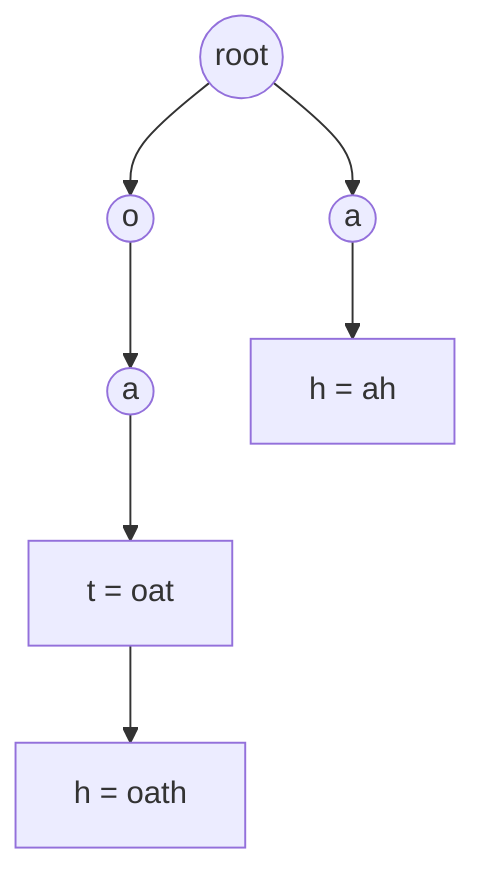
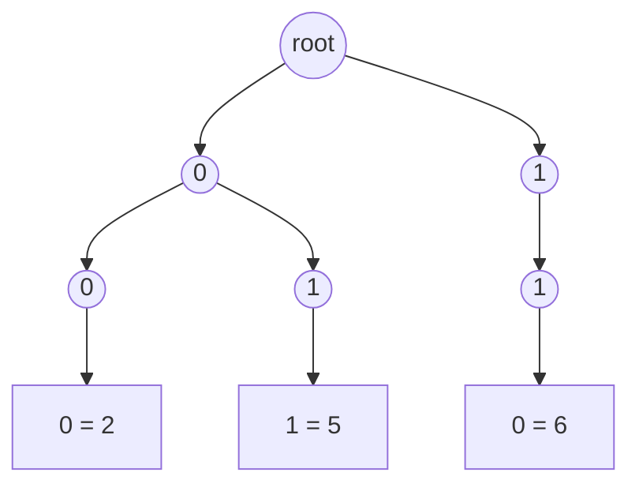

# Trie-Guided Search

In [trie basics](01_trie_basics.md) and [wildcard search](02_word_dictionary.md)
you always arrived holding a string. The trie's job was to answer a question
about that string, and the walk down the nodes lasted exactly as long as the
string you brought

This topic is about the case where **you have no string yet**. The characters
arrive one at a time from somewhere else: the next cell you step onto on a board,
the next place you cut a long word, the next letter a column of a grid forces on
you, the next bit of an integer. The candidate is being *spelled out by a search*,
and every character the search commits to is a character the trie can immediately
judge

That flips what the trie is for. It stops being a lookup table you consult at the
end and becomes a **running verdict** you carry alongside the search. Two cursors
move in lockstep: one in the search space, one in the trie. Whenever the search
takes a step, the trie takes the matching step, and the moment the trie has no
child for the character just chosen, the search is standing on a **dead prefix**
and can abandon that entire branch

Think of it as driving with a map that greys out the road the instant you turn
onto one that leads to no town at all. You do not drive to the end and then check
whether you arrived somewhere. You find out at the turn

## Searches That Spell Out Their Own Candidates

The signal is a search over some large space where **what you are searching for is
a set of strings given up front**. Three parts show up together:

- A list of target words or values is handed to you before the search starts, so
  the whole target set is known and can be preprocessed
- The candidate is assembled step by step by something other than the word list —
  a grid path, a split position, a bit choice — so you cannot simply look each
  target up
- The target list is big, so testing one target at a time repeats work, because
  targets that share a prefix would have their shared part re-explored once per
  target

That last point is what the trie fixes, and it is worth naming out loud: the trie
collapses the whole target set into one object whose shape *is* the set of live
prefixes

This is not the pattern when there is only one target word, which is plain
[grid backtracking](../../09_backtracking/notes/04_grid_backtracking.md) with an
index into that word, and building a trie for a single string buys nothing

## Why One Board Sweep Per Word Dies

Take [Word Search II](https://leetcode.com/problems/word-search-ii/), where you are
given a grid of letters and a list of words, and must return every word that can be
spelled by walking to adjacent cells without reusing a cell

The obvious idea is the one you already have: you can already solve this for a
single word, so loop over the words and solve it `W` times, once each. It is
correct, and the cost is the reason nobody ships it

Two separate things go wrong, and both point at the same fix:

- **The board is swept from scratch for every word.** Every one of the `m * n`
  starting cells launches a fresh search per word, so the entire cost of solving
  the problem once gets multiplied by `W`, and `W` can be in the thousands
- **Shared prefixes are re-explored, once per word.** Given `oa`, `oat`, and
  `oath`, the search for `oath` walks the same two cells that the search for `oat`
  already walked, and neither search knows the other happened

The second failure is the informative one. Those three searches are identical
until they diverge, so the work is only duplicated because the words are stored in
a flat list that has no idea they overlap. Merge the words into a structure keyed
by prefix and the shared walk happens once. That structure is a trie, and the
sweep can then run **once** over the board instead of once per word, because a
single board path is being tested against every word simultaneously

> "Instead of one board search per word, I will put all the words into one trie and
> sweep the board once. A path on the board is a prefix, and the trie tells me
> whether any word still extends that prefix. If none does, I stop that path for
> every word at once."

## One Trie, One Sweep, Two Cursors

The DFS carries a trie node as an extra parameter, and that node is the invariant
worth stating: **the node passed in always corresponds to the path already walked**.
Stepping onto a new cell means asking that node for a child under the cell's
letter. A missing child is the dead prefix, and it is the only pruning rule the
search needs

One change to the node shape from [trie basics](01_trie_basics.md) pays for itself
here. Instead of a boolean `is_word` flag, the terminal node stores **the word
itself**. Without it you would have to thread a growing path string through the
recursion and join it at every hit, and with it the found word is simply sitting
there waiting to be read

```python
from __future__ import annotations


class TrieNode:
    def __init__(self) -> None:
        self.children: dict[str, TrieNode] = {}
        self.word: str | None = None


DIRECTIONS = ((1, 0), (-1, 0), (0, 1), (0, -1))


def find_words(board: list[list[str]], words: list[str]) -> list[str]:
    root = TrieNode()
    for word in words:
        node = root
        for ch in word:
            node = node.children.setdefault(ch, TrieNode())
        node.word = word

    rows = len(board)
    cols = len(board[0]) if rows else 0
    found: list[str] = []

    def dfs(r: int, c: int, parent: TrieNode) -> None:
        letter = board[r][c]
        node = parent.children.get(letter)
        if node is None:
            return
        if node.word is not None:
            found.append(node.word)
            node.word = None
        board[r][c] = "#"
        for dr, dc in DIRECTIONS:
            nr, nc = r + dr, c + dc
            if 0 <= nr < rows and 0 <= nc < cols:
                dfs(nr, nc, node)
        board[r][c] = letter
        if not node.children:
            del parent.children[letter]

    for r in range(rows):
        for c in range(cols):
            dfs(r, c, root)
    return found


assert sorted(
    find_words(
        [
            ["o", "a", "a", "n"],
            ["e", "t", "a", "e"],
            ["i", "h", "k", "r"],
            ["i", "f", "l", "v"],
        ],
        ["oath", "pea", "eat", "rain"],
    )
) == ["eat", "oath"]
assert find_words([["a"]], ["a"]) == ["a"]
assert find_words([], ["a"]) == []
assert find_words([["a"]], []) == []
```

**The four lines that do the real work**:

- `node = parent.children.get(letter)` followed by the `None` return is the entire
  pruning rule, and it fires *before* the cell is marked or any neighbour is
  visited, so a dead prefix costs one dictionary lookup rather than a subtree of
  recursion
- `node.word = None` after a hit is how duplicates are avoided. The same word can
  be spellable along several different board paths, and clearing the field means
  the second path finds nothing to append. A `set` would also work, but this costs
  nothing and keeps the answer in discovery order
- `board[r][c] = "#"` and the restore afterwards are the ordinary
  [sentinel-and-undo](../../09_backtracking/notes/04_grid_backtracking.md) that
  keeps a path from reusing a cell. It doubles as pruning here for free, because
  `#` is not a letter any word contains, so re-entering a used cell hits the
  missing-child return like any other dead prefix
- `del parent.children[letter]` is the optimisation interviewers ask about. Once a
  node has no children left and its word has already been collected, nothing below
  it can ever match again, so unlinking it shortens every later sweep. Because the
  deletion happens as the recursion unwinds, a branch is trimmed bottom-up and an
  exhausted chain disappears in one pass

The search never asks "is this cell part of word 17". It only ever asks whether
the path so far is still a prefix of *something*, which is why the word count
stops multiplying the cost

## Dry Run: A Two-By-Two Board

Three words, `oath`, `oat`, and `ah`, produce this trie, where the boxed nodes are
the terminal ones carrying a stored word:



The board is small enough to hold in your head, and `oath` snakes through all four
cells:

```text
        col 0   col 1
row 0     o       a
row 1     h       t
```

Directions are tried in the order down, up, right, left, and the walk from the
first starting cell looks like this:

```text
start at (0,0)
(0,0)='o'   prefix 'o' alive
  (1,0)='h'   prefix 'oh' not in trie -> REJECT
  (0,1)='a'   prefix 'oa' alive
    (1,1)='t'   prefix 'oat' alive   FOUND 'oat'
      (0,1)='#'  prefix 'oat#' not in trie -> REJECT
      (1,0)='h'   prefix 'oath' alive   FOUND 'oath'
        (0,0)='#'  REJECT      (1,1)='#'  REJECT
        trim 'oath' from the trie
      trim 'oat' from the trie
    (0,0)='#'  REJECT
    trim 'oa' from the trie
  trim 'o' from the trie
```

The first rejected step is the whole technique in one line. Standing on `o` the
search tried `h` and the node for `o` has only an `a` child, so `oh` died at a
single lookup, without marking a cell, without recursing, and simultaneously for
every word in the list

The rejections reading `'#'` are the same mechanism doing the visited check. The
cell had been overwritten with a sentinel, no trie node has a `#` child, so the
step that would revisit an occupied cell is refused by exactly the code that
refuses a dead prefix

The trims run bottom-up as the recursion returns. By the time the sweep leaves
`(0, 0)`, the entire `o` branch is gone from the trie, so the three remaining
starting cells never look at it again. The `a` branch survives, because its child
`h` still holds the uncollected word `ah`

The remaining starts finish quickly. From `(0, 1)` the search enters the `a` node
and both neighbours, `t` and `o`, are missing children, so `ah` is never found —
the only `h` on the board is not adjacent to the `a`. Starting at `(1, 0)` and
`(1, 1)` fails at the root, since no word begins with `h` or `t`. The answer is
`['oat', 'oath']`

## Splitting A Word Into Other Stored Words

[Concatenated Words](https://leetcode.com/problems/concatenated-words/) asks which
words in the list are built by gluing together **two or more** of the other words.
The search space here is not a board but the **cut positions** inside a single
word, and the trie is what makes each cut cheap to test

The candidate is spelled out the same way as before. Walk forward from the current
start, advancing one trie node per character, and every terminal node you pass is
a legal place to cut. The walk stops dead at the first character with no child,
because if `cats` has no `z` child then no stored word continues this way and every
longer cut is hopeless too

Each cut position gets solved once and reused, which is
[memoization](../../11_dp/notes/01_dp_fundamentals.md) over a single integer state:
"can the suffix starting at `start` be built from stored words"

```python
def find_all_concatenated_words(words: list[str]) -> list[str]:
    root = TrieNode()
    for word in words:
        if not word:
            continue
        node = root
        for ch in word:
            node = node.children.setdefault(ch, TrieNode())
        node.word = word

    def splits(word: str, start: int, memo: dict[int, bool]) -> bool:
        if start == len(word):
            return True
        if start in memo:
            return memo[start]
        node = root
        ok = False
        for i in range(start, len(word)):
            node = node.children.get(word[i])
            if node is None:
                break
            uses_whole_word = start == 0 and i == len(word) - 1
            if node.word is not None and not uses_whole_word and splits(word, i + 1, memo):
                ok = True
                break
        memo[start] = ok
        return ok

    return [w for w in words if w and splits(w, 0, {})]


assert find_all_concatenated_words(
    ["cat", "cats", "catsdogcats", "dog", "dogcatsdog", "hippopotamuses", "rat", "ratcatdogcat"]
) == ["catsdogcats", "dogcatsdog", "ratcatdogcat"]
assert find_all_concatenated_words(["a", "aa", "aaa"]) == ["aa", "aaa"]
assert find_all_concatenated_words(["a"]) == []
assert find_all_concatenated_words([]) == []
```

**Two details decide whether this is right**:

- `uses_whole_word` is the "two or more pieces" rule. Every word is in the trie, so
  without that guard every word would trivially match itself as a single piece and
  the answer would be the whole list. Blocking the one cut that consumes the entire
  string from position zero is enough, since any other successful match leaves a
  non-empty suffix that must itself be built from stored words
- `break` on the missing child, rather than `continue`, is what keeps this
  quadratic instead of quadratic-with-a-restart. Once the prefix is dead, extending
  it cannot revive it, so there is nothing left to try from this start

## Candidates That Fit The Columns

[Word Squares](https://leetcode.com/problems/word-squares/) builds a `k` by `k`
grid of words that reads the same across and down. Once you have placed some rows,
row `k` is not free: reading down column `k` of the rows already placed gives a
prefix that row `k` **must** start with. The search is
[backtracking](../../09_backtracking/notes/01_backtracking_basics.md) over rows, and
the constraint arrives as a prefix, which is precisely the query a trie answers

The node payload changes to suit the question. A terminal flag would only tell you
whether the prefix is itself a word, which is not what you need. What you need is
*every word that starts with this prefix*, so each node stores the list of indices
of the words whose insert path passed through it

```python
class PrefixNode:
    def __init__(self) -> None:
        self.children: dict[str, PrefixNode] = {}
        self.indices: list[int] = []


def word_squares(words: list[str]) -> list[list[str]]:
    if not words:
        return []
    root = PrefixNode()
    for i, word in enumerate(words):
        node = root
        node.indices.append(i)
        for ch in word:
            node = node.children.setdefault(ch, PrefixNode())
            node.indices.append(i)

    def starting_with(prefix: str) -> list[int]:
        node = root
        for ch in prefix:
            child = node.children.get(ch)
            if child is None:
                return []
            node = child
        return node.indices

    size = len(words[0])
    squares: list[list[str]] = []
    rows: list[str] = []

    def build() -> None:
        if len(rows) == size:
            squares.append(rows[:])
            return
        prefix = "".join(row[len(rows)] for row in rows)
        for i in starting_with(prefix):
            rows.append(words[i])
            build()
            rows.pop()

    build()
    return squares


assert word_squares(["area", "lead", "wall", "lady", "ball"]) == [
    ["wall", "area", "lead", "lady"],
    ["ball", "area", "lead", "lady"],
]
assert word_squares(["ab", "ba"]) == [["ab", "ba"], ["ba", "ab"]]
assert word_squares(["ab", "cd"]) == []
assert word_squares([]) == []
```

The indices are appended at the root as well as at every node along the path,
which is what makes the empty prefix return all the words and lets a single
`build()` call seed the first row instead of a separate loop. The pruning is
implicit and total: `starting_with` returns only words that can legally go in the
next row, so a partial square that no word can extend produces an empty candidate
list and the branch dies without a single wasted placement

## When The Node Already Holds The Answer

Two problems in this module put the answer itself on the node, so the search
becomes a plain walk with no branching at all. Both build the trie over **reversed**
words, which is the standard move when the matching happens at the end of a string
rather than the start, because a trie only ever compares prefixes

[Longest Common Suffix Queries](https://leetcode.com/problems/longest-common-suffix-queries/)
asks, for each query word, which container word shares the longest suffix with it,
breaking ties by shortest length and then smallest index. Insert every container
word reversed, and at each node on the insert path keep `best_index`, the index of
the best word seen passing through that node under exactly the problem's tie-break.
Answering a query is then walking the reversed query as deep as the trie allows and
reading `best_index` off the deepest node reached, since that node represents the
longest shared suffix, and the root's value covers a query sharing nothing

[Palindrome Pairs](https://leetcode.com/problems/palindrome-pairs/) asks for the
ordered pairs `(i, j)` whose concatenation is a palindrome. Insert every word
reversed, and give each node two payloads: `word_index`, the word ending exactly
here, and `palindrome_suffix_indices`, the indices of words whose remaining
unconsumed characters below this node form a palindrome. Walking `words[i]` down
that trie then covers both shapes a palindrome pair can take:

- The walk hits a node with a `word_index` of `j` partway through, meaning
  `words[j]` reversed matched a prefix of `words[i]`, so the pair works exactly
  when the *rest* of `words[i]` is a palindrome, which is one linear check
- The walk consumes all of `words[i]` and stops at some node, meaning `words[i]`
  matched a prefix of several reversed words, and every `j` in that node's
  `palindrome_suffix_indices` works because the leftover tail is already known to
  be a palindrome

Both cases must skip `j == i`, since a word is not allowed to pair with itself

## Worked Example: [Maximum XOR of Two Numbers in an Array](https://leetcode.com/problems/maximum-xor-of-two-numbers-in-an-array/)

Given a list of non-negative integers, return the largest value of `nums[i] ^ nums[j]`
over all pairs of positions. The **XOR** of two numbers, written `^`, compares them
bit by bit and produces a `1` in every position where the two bits differ and a `0`
where they agree, so making a XOR large means making the two numbers differ as early
as possible in their binary form

**Input**: `nums`, a `list[int]` of non-negative integers, each fitting in 32 bits,
with up to about `2 * 10^5` values in the list

**Output**: a single `int`, the maximum XOR achievable by any pair of positions.
Positions may coincide, so a list with one element has answer `0` rather than being
undefined, and the value returned is the XOR total itself and not the pair that
produced it

The identifying phrase is "over all pairs", and the naive reading of it is the
double loop over every `i` and `j`, which is `O(n²)` and too slow at two hundred
thousand values. The way out is to stop thinking of a number as a number. Written
in binary at a fixed width it is a **string over the two-character alphabet `0` and
`1`**, and a set of strings goes in a trie. Every root-to-leaf path is one of the
input values, and the branching factor is 2 rather than 26

Here is that trie for `2`, `5`, and `6` at a width of three bits, with the boxed
nodes ending a value:



Once the values live in a trie, finding the best partner for one number is a walk
rather than a search. At each level you know exactly which bit you want, because a
`1` at a high position is worth more than every lower position combined, so
securing the high bit is never a mistake you can regret later

> "I will store all the numbers in a binary trie, most significant bit at the top.
> For each number I walk down asking for the opposite bit at every level, since
> that is the bit that makes the XOR a 1 there. If the opposite branch is missing I
> follow the only branch that exists and lose that bit, and greed is safe because
> one high bit outweighs every lower bit put together."

Therefore,

1. Fix a width first, using the bit length of the largest value, so that every
   number is inserted with the same number of levels. Without a fixed width, `3`
   and `25` would start at different depths and their high bits would not line up
2. Insert each number by walking from the most significant bit down to bit zero,
   reading bit `i` as `(num >> i) & 1` and creating the child if it is missing.
   Most significant first is required, because the greedy choice must happen at
   the most valuable bit while there is still a choice to make
3. For each number in turn, walk the trie again as a query. Track `current`, the
   XOR being assembled with the best partner for this number, starting at zero
4. At every level compute `wanted`, the opposite of your own bit. A partner with
   that bit differs from you here, which is what puts a `1` in the XOR at this
   position
5. If a child under `wanted` exists, take it and set that bit of `current` with
   `current |= 1 << i`, because at least one stored value has that bit and the
   partner is still being narrowed down among them
6. If it does not exist, follow the child under your own bit instead. That level
   contributes a `0` to the XOR and nothing is lost by continuing, since your own
   number is in the trie, so the branch you fall back to is always present
7. After the walk, `current` is the best XOR available to this number. Keep the
   running maximum across all numbers and return it

```python
class BitTrieNode:
    def __init__(self) -> None:
        self.children: dict[int, BitTrieNode] = {}


def find_maximum_xor(nums: list[int]) -> int:
    if len(nums) < 2:
        return 0
    width = max(nums).bit_length()
    root = BitTrieNode()
    for num in nums:
        node = root
        for i in range(width - 1, -1, -1):
            node = node.children.setdefault((num >> i) & 1, BitTrieNode())

    best = 0
    for num in nums:
        node = root
        current = 0
        for i in range(width - 1, -1, -1):
            bit = (num >> i) & 1
            wanted = 1 - bit
            if wanted in node.children:
                current |= 1 << i
                node = node.children[wanted]
            else:
                node = node.children[bit]
        best = max(best, current)
    return best


assert find_maximum_xor([3, 10, 5, 25, 2, 8]) == 28
assert find_maximum_xor([14, 70, 53, 83, 49, 91, 36, 80, 92, 51, 66, 70]) == 127
assert find_maximum_xor([0, 0]) == 0
assert find_maximum_xor([0]) == 0
```

Reading and setting individual bits with `(num >> i) & 1` and `current |= 1 << i`
is the same bit handling used for
[state bitmasks](../../10_graphs/notes/06_implicit_state_bfs.md), applied to the
input values instead of to a set of collected items

Tracing the query for `5` against `[3, 10, 5, 25, 2, 8]`, where the width is five
because `25` needs five bits, shows both outcomes:

```text
5  = 00101
25 = 11001

bit 4: mine=0  want=1  present -> take it, running xor 10000 = 16
bit 3: mine=0  want=1  present -> take it, running xor 11000 = 24
bit 2: mine=1  want=0  present -> take it, running xor 11100 = 28
bit 1: mine=0  want=1  ABSENT  -> forced down 0, running xor stays 28
bit 0: mine=1  want=0  ABSENT  -> forced down 1, running xor stays 28
```

The two refused steps at the bottom are where the greedy argument earns its keep.
By bit 1 the walk had already committed to the branch holding only `25`, and `25`
has a `0` there just as `5` does, so no partner in that branch can contribute a
one. Backing up to take a `1` at bit 1 would have meant giving up the `1` at bit 2,
and `4` is larger than `2`, so the trade is never worth making. The answer for `5`
is `5 ^ 25 = 28`, which is also the answer for the whole list

- **Time Complexity:** `O(n * B)`, where `n` is the number of values and `B` is the
  bit width, because each value walks `B` levels once to be inserted and once to be
  queried, and each level is a dictionary lookup. With `B` fixed at 32 this is
  linear in `n`, against `O(n²)` for the pair scan
- **Space Complexity:** `O(n * B)` for the trie, because each insert creates at most
  `B` new nodes and shared high-bit prefixes are stored once. The walks are loops
  rather than recursion, so nothing is added on the call stack

The follow-up,
[Maximum XOR With an Element From Array](https://leetcode.com/problems/maximum-xor-with-an-element-from-array/),
caps each query with an upper bound on the partner value. Sorting the values and
sorting the queries by that bound turns it back into this same walk, because you
insert values into the trie in increasing order and answer each query once every
value it is allowed to use is present, with `-1` when the trie is still empty

## Time and Space Complexity

Symbols used below: the board is `m` by `n`, `W` is the number of target words, `L`
is the length of the longest word, `k` is the side of a word square, `B` is the bit
width, and `C` is the total number of characters across all stored words

**Word Search II**

| Approach                         | Time                                                                                                                                                                                                                                                             | Space                                                                                                                                                                                               |
| -------------------------------- | ---------------------------------------------------------------------------------------------------------------------------------------------------------------------------------------------------------------------------------------------------------------- | --------------------------------------------------------------------------------------------------------------------------------------------------------------------------------------------------- |
| One trie, one sweep              | `O(C + m * n * 4 * 3^(L - 1))`: `O(C)` to build the trie, then each of the `m * n` starts has 4 first moves and at most 3 onward moves per step since the cell it came from is marked, with `L` bounding the depth because that is the deepest path the trie has | `O(C)`: one node per distinct prefix character across all words, plus `O(L)` for the recursion stack, which is dominated by the trie unless a single word is longer than the whole rest of the list |
| A separate board search per word | `O(W * m * n * 4 * 3^(L - 1))`: the same sweep repeated once per word, with nothing shared between words that share a prefix                                                                                                                                     | `O(L)`: only the recursion stack, since no structure is built, which is the one thing this version does better                                                                                      |

The `3^(L - 1)` factor is a loose ceiling that assumes the trie never prunes. In
practice the dead-prefix return cuts branches within two or three characters,
because most letter sequences on a board are not prefixes of anything

**Maximum XOR of Two Numbers in an Array**

| Approach    | Time                                                                                                    | Space                                                                           |
| ----------- | ------------------------------------------------------------------------------------------------------- | ------------------------------------------------------------------------------- |
| Binary trie | `O(n * B)`: `n` inserts and `n` queries, each walking the fixed `B` levels with constant work per level | `O(n * B)`: at most `B` new nodes per insert, fewer once values share high bits |
| Every pair  | `O(n²)`: one XOR per unordered pair, with no way to skip a pair since any pair might be the best        | `O(1)`: two loop variables and a running maximum                                |

**The other trie-guided searches in this module**

| Problem                       | Time                                                                                                                                                                                                                                                                                      | Space                                                                                                                               |
| ----------------------------- | ----------------------------------------------------------------------------------------------------------------------------------------------------------------------------------------------------------------------------------------------------------------------------------------- | ----------------------------------------------------------------------------------------------------------------------------------- |
| Concatenated Words            | `O(C + n * L²)`: for each of `n` words, each of `L` start positions walks at most `L` characters forward, and the memo means each start is solved once, against `O(n * 2^L)` if every combination of cuts were retried                                                                    | `O(C)`: the trie, plus `O(L)` for the memo and `O(L)` recursion depth per word                                                      |
| Word Squares                  | `O(C * L)` to build, then output-sensitive: each row's candidate list holds only words matching the forced prefix, so the branching factor is the number of such words rather than `n`, and the search is still exponential in `k` in the worst case where every word shares every prefix | `O(C * L)`: each word's index is appended to `L + 1` nodes along its path, which is the price of the constant-time candidate lookup |
| Longest Common Suffix Queries | `O(C + Q)`: one insert per container word and one walk per query, where `Q` is the total length of all query words, against `O(C * Q)` for comparing every query against every container word                                                                                             | `O(C)`: one node per distinct reversed prefix, each holding a single cached index                                                   |
| Palindrome Pairs              | `O(C * L)`: each word walks the trie once, and each stopping point costs a linear palindrome check on the leftover characters                                                                                                                                                             | `O(C)` for the trie, plus the palindrome index lists stored on the nodes                                                            |

## Summary

- A **trie-guided search** is a search that spells out its own candidate one
  character at a time, with a trie carried alongside it that judges each character
  the moment it is chosen. The DFS holds a trie node as a parameter, and that node
  always represents the path walked so far
  - The signal is a set of target words handed to you up front plus a search space
    that produces candidates step by step, such as a board path, a cut position, a
    grid row, or a bit choice
  - With a single target word there is nothing to merge, so build no trie and index
    into the word instead
- The naive alternative is running the search once per target word, and it is
  correct but multiplies the whole cost by the number of words while re-exploring
  every shared prefix once per word that has it
  - One trie sweeps once and tests a board path against every word at the same
    time, because the trie's shape is exactly the set of prefixes still alive
- The pruning rule is a single line: ask the current node for a child under the
  character just chosen, and return immediately when there is none. Placing that
  check before marking the cell or recursing is what makes a dead prefix cost one
  dictionary lookup instead of a subtree
- Store the whole word on the terminal node rather than a boolean flag, since the
  search has no string of its own to report, and clearing that field after
  collecting the word is how the same word found along a second board path is
  prevented from appearing twice
- Deleting a node from its parent once it has no children left and its word has
  been collected trims the trie as the recursion unwinds, so later starting cells
  never walk a branch that is already exhausted
- Nodes can carry whatever payload the question needs, and choosing that payload is
  usually the actual insight
  - The word itself for Word Search II, a list of word indices for the candidate
    rows of Word Squares, one cached best index for Longest Common Suffix Queries,
    and a word index plus a palindromic-tail list for Palindrome Pairs
- Build the trie over **reversed** words whenever the matching happens at the end of
  a string, as in Longest Common Suffix Queries and Palindrome Pairs, because a
  trie can only ever compare prefixes
- An integer written in binary at a fixed width is a string over a two-symbol
  alphabet, so a **binary trie** stores numbers the same way a normal trie stores
  words, with a branching factor of 2 and a depth of `B` bits
  - Walk it most significant bit first and greedily ask for the opposite bit,
    because one high bit is worth more than every lower bit combined, which turns
    the `O(n²)` pair scan into `O(n * B)`
  - Fix the width from the largest value before inserting anything, since numbers
    inserted at different depths do not line their high bits up
- The mistake that costs the most is checking the trie after the move rather than
  before it, which marks cells, recurses, and unmarks them for a prefix that was
  already dead on arrival

## Interview Checklist

Before writing code, make sure you can answer each of these

```text
Is the candidate given to me, or is the search building it character by character?
Is there more than one target word, so that merging them into a trie actually pays?
What does the DFS carry: the trie node for the path so far, or an index into a word?
Where exactly does the dead-prefix check go, before or after marking the cell?
Does the terminal node hold a flag, the word, an index, a list, or a cached answer?
How do I stop the same word being reported twice from two different paths?
Do I trim exhausted nodes so later starting cells skip branches already collected?
Does the matching happen at the start or the end of the string, and so do I reverse?
For a binary trie: what width am I fixing, and am I walking the high bit first?
For a binary trie: what do I do when the opposite bit is missing, and why is that safe?
Can I state the cost in terms of the board and the total characters, not the word count?
```
