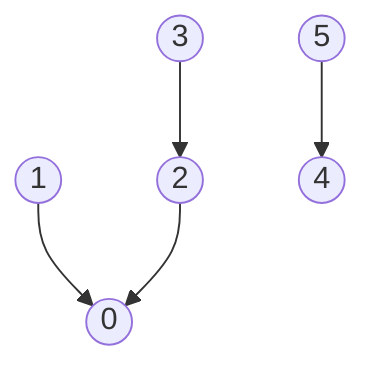
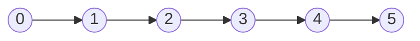
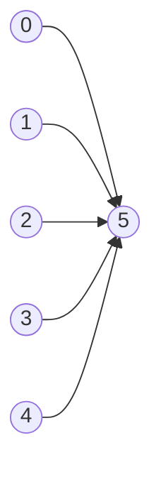

# Union Find

Sometimes the only thing you need to know about a pile of items is **which ones
belong together**. Not their order, not the distance between them, not the route
from one to another. Just whether these two are in the same group

A collection split up that way is a set of **disjoint sets**. "Disjoint" means no
overlap, so every item sits in exactly one group, no item is in two groups at
once, and between them the groups cover everything. Six items might currently be
split as `{0, 1, 2, 3}` and `{4, 5}`, and that split is the entire state being
tracked

**Union find**, also called **disjoint set union (DSU)**, is the structure that
maintains such a split while it changes. Its name is its two operations

- **`find(x)`** answers which group `x` currently belongs to
- **`union(a, b)`** merges the group holding `a` with the group holding `b` into
  one group

Naming a group is the part that needs a decision, since a group is a set of items
and a set is not a convenient thing to return. Union find picks one member of each
group to be its **representative**, also called its **root**, and `find` returns
that member. So the group `{0, 1, 2, 3}` might be known by the name `0`, and every
one of its four members answers `0` when asked. That single move turns the
question "are these two together?" into

```python
find(a) == find(b)
```

which is one equality test rather than a search. Which member ends up as the
representative is arbitrary and never matters. Only whether two `find` calls agree
matters

Here is the split `{0, 1, 2, 3}` and `{4, 5}` as union find actually stores it,
with each arrow pointing from an item to the item it defers to, and the roots
being the two items with no arrow leaving them



Item `3` does not know its root directly. It points at `2`, which points at `0`,
and `0` points at nothing, so `0` is the answer. Following those arrows upward is
all `find` does

Notice everything the structure has thrown away. It cannot list the members of a
group without scanning every item, it cannot tell you how `3` and `0` are related
beyond "same group", and it can never **split** a group back apart. That
narrowness is the price, and near-constant time per operation is what it buys

## When The Groups Keep Changing

The signal is a relation that **arrives piece by piece** while you are being asked
about the groups it creates. Some ways that shows up

- Edges show up one at a time and after each one you need to know whether two
  nodes are now connected, which is called **dynamic connectivity**
- The relation is an **equivalence**, meaning that if `a` relates to `b` and `b`
  relates to `c` then `a` relates to `c` for free. Cities joined by roads, string
  positions you are allowed to swap, and variables asserted equal are all
  equivalences, and transitivity is exactly what union find is built to track
- You are counting groups, or watching a count change as merges happen
- You need the moment a new relation becomes **redundant**, because both of its
  ends were already in the same group, or the moment it becomes a
  **contradiction**, because it asserts two things are different when they are
  already merged

Two situations look like union find and are not

- **The graph is static and handed to you all at once.** A plain sweep already
  [counts connected components](../../10_graphs/notes/04_components_cycles_bipartite.md)
  in `O(V + E)`, and it does not need a new data structure. Union find is still a
  fine answer there, because it is short to write and iterative so it cannot blow
  the recursion limit, but do not claim it is asymptotically better
- **You need a path, a distance, or the group's members in order.** Union find
  stores none of that, so a question about how to get from `a` to `b` wants a
  traversal instead

The one structural rule is that **merges are permanent**. If a problem needs a
group taken apart again, either process the input in an order where that never
happens, or use something else

## Why Relabelling Every Member Dies

The obvious way to store a partition is to give every item a group label, so
`label[i]` is the name of `i`'s group. Then "same group?" is one array read, and
merging means picking the losing label and rewriting every item that carries it

```python
class LabelSets:
    def __init__(self, n: int) -> None:
        self.label = list(range(n))

    def connected(self, a: int, b: int) -> bool:
        return self.label[a] == self.label[b]

    def union(self, a: int, b: int) -> None:
        old, new = self.label[b], self.label[a]
        if old == new:
            return
        for i in range(len(self.label)):
            if self.label[i] == old:
                self.label[i] = new


sets = LabelSets(5)
sets.union(0, 1)
sets.union(1, 2)
assert sets.connected(0, 2) is True
assert sets.connected(0, 3) is False
assert LabelSets(1).connected(0, 0) is True
```

This is correct, and `connected` is genuinely `O(1)`. The problem is the `for`
loop, which walks all `n` labels on every merge, so `m` merges cost `O(n * m)`. On
a graph with 100,000 nodes and 100,000 edges, both routine sizes for these
problems, that is around `10^10` label writes, which no time limit tolerates

The specific reason it is slow is worth stating precisely, because it hands you
the fix. **The expensive part is telling every member.** A group of 50,000 items
does not need 50,000 announcements when it merges, because there is only one fact
to record, which is that this group now defers to that one. So stop storing the
answer at every item, and instead store **one pointer per group** that names
another group. A merge becomes a single write

The cost does not vanish, it moves. Nothing knows its group by direct lookup any
more, so `find` now has to follow those pointers until it reaches an item that
defers to nobody

## Parent Pointers, And The Root As The Group's Name

Keep one array, `parent`, where `parent[x]` is the item that `x` defers to. An
item that is its own parent is a root, and therefore the name of its group.
Everything starts alone, so every item starts as its own root

```python
def make_forest(n: int) -> list[int]:
    return list(range(n))


def find_slow(parent: list[int], x: int) -> int:
    while parent[x] != x:
        x = parent[x]
    return x


def union_slow(parent: list[int], a: int, b: int) -> bool:
    root_a, root_b = find_slow(parent, a), find_slow(parent, b)
    if root_a == root_b:
        return False
    parent[root_a] = root_b
    return True


forest = make_forest(5)
assert union_slow(forest, 0, 1) is True
assert union_slow(forest, 1, 2) is True
assert union_slow(forest, 0, 2) is False
assert find_slow(forest, 0) == find_slow(forest, 2)
assert find_slow(forest, 3) != find_slow(forest, 0)
assert find_slow(make_forest(1), 0) == 0
```

**The two lines people get wrong**:

- `parent[root_a] = root_b` links **root to root**, never node to node. Writing
  `parent[a] = b` looks equivalent and is not, because if `a` already had a parent
  then that write drags `a` and everything beneath it under `b` while leaving the
  rest of `a`'s old group behind, so two groups that should have merged stay split
  and the structure is quietly wrong from then on
- `if root_a == root_b: return False` is what makes `union` report whether it
  actually did anything. That boolean is free here and several problems are
  nothing but a reading of it, so return it rather than `None`

There is still no speed. Feed the merges in the order `(0,1), (1,2), (2,3), ...`
and every root gets hung under the next item, producing a single chain



Running that on six items and then asking for the depth of node `0` gives 5, so
`find(0)` follows five pointers. In general a chain over `n` items makes `find`
cost `O(n)`, which is the same `O(n)` per operation the label array had. The work
has been moved from `union` to `find` and not yet reduced

Two independent repairs fix it, and they attack different halves of the problem.
One stops paying for the same walk twice, and the other stops the tall tree from
forming at all

## Path Compression: Never Walk The Same Path Twice

By the time `find` returns, it knows the root. Every item it passed on the way up
also belongs to that root, so pointing each of them straight at the root costs
almost nothing now and saves the entire walk next time

```python
def find_compress(parent: list[int], x: int) -> int:
    root = x
    while parent[root] != root:
        root = parent[root]
    while parent[x] != root:
        nxt = parent[x]
        parent[x] = root
        x = nxt
    return root


chain = make_forest(6)
for i in range(5):
    union_slow(chain, i, i + 1)
assert chain == [1, 2, 3, 4, 5, 5]
assert find_compress(chain, 0) == 5
assert chain == [5, 5, 5, 5, 5, 5]
assert find_compress(make_forest(1), 0) == 0
```

The asserts show the flattening directly. Before the call the six-item chain is
`[1, 2, 3, 4, 5, 5]`, meaning each item defers to the next. One `find(0)` turns it
into `[5, 5, 5, 5, 5, 5]`, so every item is now one hop from the root and every
later `find` on any of them is a single step



**Two things about this loop are worth saying out loud in an interview**:

- The walk happens **twice on purpose**. The first `while` finds the root, and the
  second rewrites the path now that the root is known. Trying to do it in one pass
  does not work, because you cannot point an item at a root you have not reached
- `find` **mutates the structure**, which is unusual for something named like a
  query. It never changes which group anything is in, only how many hops away the
  answer is, so the mutation is invisible to callers. Interviewers do ask why a
  read is writing

The one-line recursive version, `parent[x] = find(parent[x])`, compresses the same
path and reads better. It also recurses once per level, so on a chain built before
any compression happened it can hit
[Python's 1000-frame limit](../../10_graphs/notes/01_graph_basics.md). The
iterative version above never can

## Union By Size: Do Not Build The Chain In The First Place

Compression repairs a tall tree after somebody walks it. The second repair stops
the tree from getting tall, by making the merge choose a direction instead of
always hanging the first root under the second

Store how many items each root owns, and **attach the smaller tree under the
larger root**. A node only gets deeper when the tree it lives in is the smaller of
the two, and in that case the tree it ends up in is at least twice the size it
was. Doubling can happen at most `log2(n)` times before the tree contains
everything, so **no item is ever more than `log2(n)` hops from its root**, even
with no compression at all

**Union by rank** is the same idea keyed on tree height rather than item count,
attaching the shorter tree under the taller root and bumping the stored rank only
when two equal-height trees merge. The bound it gives is the same, so pick one and
be able to say which you used. Size is easier to defend, because the number it
stores is meaningful on its own and doubles as "how big is this group"

## The Whole Structure

Both repairs together, in the form worth memorizing, since this is the class you
will type out from scratch in an interview

```python
class UnionFind:
    def __init__(self, n: int) -> None:
        self.parent = list(range(n))
        self.size = [1] * n
        self.count = n

    def find(self, x: int) -> int:
        root = x
        while self.parent[root] != root:
            root = self.parent[root]
        while self.parent[x] != root:
            nxt = self.parent[x]
            self.parent[x] = root
            x = nxt
        return root

    def union(self, a: int, b: int) -> bool:
        root_a, root_b = self.find(a), self.find(b)
        if root_a == root_b:
            return False
        if self.size[root_a] < self.size[root_b]:
            root_a, root_b = root_b, root_a
        self.parent[root_b] = root_a
        self.size[root_a] += self.size[root_b]
        self.count -= 1
        return True


uf = UnionFind(6)
assert uf.union(0, 1) is True
assert uf.union(2, 3) is True
assert uf.union(1, 3) is True
assert uf.union(0, 2) is False
assert uf.union(4, 5) is True
assert uf.count == 2
assert uf.find(3) == uf.find(0)
assert uf.find(4) != uf.find(0)
assert UnionFind(1).count == 1
```

**What each piece of state is for**:

- `parent = list(range(n))` says every item starts as its own root, so the
  structure begins as `n` groups of one
- `size` is only ever read at a **root**, since the count of items beneath a
  non-root is meaningless to the merge decision. `size[self.find(x)]` is therefore
  how you ask how big `x`'s group is, and forgetting the `find` there is a common
  bug that returns a stale number
- `count` starts at `n` and drops by one on every successful merge, because
  merging two groups into one always reduces the number of groups by exactly one.
  Maintaining it costs one line and saves a `len(set(...))` pass at the end, and
  it is the entire answer to *Number of Provinces* once the adjacency matrix has
  been unioned
- The swap `root_a, root_b = root_b, root_a` is union by size expressed without a
  second branch, since after it `root_a` is guaranteed to name the larger tree and
  a single attach line covers both cases

**The cost, stated the way an interviewer wants to hear it**: with path
compression and union by size together, a sequence of `m` operations over `n`
items costs `O(m * α(n))`
[amortized](../../00_fundamentals/notes/03_time_and_space_complexity.md), where
`α` is the inverse Ackermann function. That function grows so slowly that `α(n)`
stays below 5 for any `n` that will ever be typed into a computer, so the honest
sentence is **"near-constant amortized time per operation"**. Say *amortized*, and
do not say `O(1)`, because a single early `find` really can walk a long path
before compression has flattened it. With only one of the two optimizations the
bound is `O(log n)` amortized, which is still fine for interview inputs

## Dry Run

Six items, and five merges offered in this order, with the state printed after
each one. `parent` and `size` are the two arrays, and a `.` marks an item whose
size entry is stale because it is no longer a root

```text
start          parent=[0, 1, 2, 3, 4, 5]  size=[1, 1, 1, 1, 1, 1]  count=6

union(0,1)  find(0)=0, find(1)=1  different, equal sizes so 1 goes under 0
    TAKE       parent=[0, 0, 2, 3, 4, 5]  size=[2, ., 1, 1, 1, 1]  count=5

union(2,3)  find(2)=2, find(3)=3  different, equal sizes so 3 goes under 2
    TAKE       parent=[0, 0, 2, 2, 4, 5]  size=[2, ., 2, ., 1, 1]  count=4

union(1,3)  find(1)=0, find(3)=2  different, sizes tie at 2, so 2 goes under 0
    TAKE       parent=[0, 0, 0, 2, 4, 5]  size=[4, ., ., ., 1, 1]  count=3

union(0,2)  find(0)=0, find(2)=0  SAME ROOT
    REJECT     parent unchanged, count unchanged, union returns False

union(4,5)  find(4)=4, find(5)=5  different, equal sizes so 5 goes under 4
    TAKE       parent=[0, 0, 0, 2, 4, 4]  size=[4, ., ., ., 2, .]  count=2
```

The rejected merge is the important line. Items `0` and `2` were already joined
through `1` and `3`, so the edge between them adds nothing, `union` returns
`False`, and `count` stays at 3. Every problem in the ladder that asks for a
redundant edge, a cycle, or a contradiction is reading exactly that `False`

Path compression has not fired yet, because none of those `find` calls walked past
a node it could shorten. Item `3` is still two hops from the root, going
`3 -> 2 -> 0`. The first `find(3)` after the merges fixes that

```text
find(3)   walk up: 3 -> 2 -> 0, so root = 0
          rewrite: parent[3] = 0
          parent=[0, 0, 0, 0, 4, 4]   node 3 is now one hop from its root
```

Nothing about the grouping changed. `{0, 1, 2, 3}` and `{4, 5}` are the same two
groups before and after, which is why a query is allowed to rewrite the array

## What You Hang Off The Structure

The class above is almost never the whole answer. These are the adaptations that
cover the problems in this module's ladder

**Items that are not integers.** The parent array is indexed by `int`, so map the
real items to `0 .. n-1` first. Single lowercase letters become `ord(c) - ord("a")`,
which is what *Satisfiability of Equality Equations* wants, and arbitrary strings
go through a dictionary built as you read the input. The alternative is a `dict`
parent instead of a list, which costs a hash per hop and saves the mapping code

**Grid cells.** A cell `(r, c)` becomes the integer `r * cols + c`, which is the
same flattening used to walk a matrix in one loop, so a `rows * cols` union find
covers the whole grid. *Number of Islands II* then adds cells one at a time,
raising a live island counter by one for each new land cell and lowering it by one
for each `union` that returns `True`, which is `count` maintained by hand because
the items are not all live from the start

**The first merge that fails.** In *Redundant Connection* the answer is literally
the edge whose `union` returns `False`, since that edge joined two nodes already
connected and therefore closed a cycle. No tree is ever built and no traversal is
run

**Ordering the input when merges are permanent.** *Satisfiability of Equality
Equations* gives you `==` and `!=` facts mixed together. Union every `==` pair
first, then check every `!=` pair against the finished structure, because a `!=`
checked early would be testing groups that are about to merge, and union find
cannot take a merge back

**Extra data on the pointer.** *Evaluate Division* stores, alongside each parent
pointer, the ratio between the item and its parent, and multiplies those ratios
during `find` while compressing. This is **weighted union find**, and it is worth
knowing the name, though the DFS-with-a-running-product solution from
[weighted graphs](../../10_graphs/notes/07_weighted_shortest_paths.md) is easier
to get right under time pressure

## Worked Example: [Smallest String With Swaps](https://leetcode.com/problems/smallest-string-with-swaps/)

You are given a string and a list of index pairs. Each pair says those two
positions may be swapped, as many times as you like and in any order. Return the
smallest string, in dictionary order, that any sequence of those swaps can reach

**Input**:

- `s`, a `str` of lowercase English letters
- `pairs`, a `list[list[int]]` where each inner list is a pair `[a, b]` of
  0-indexed positions in `s` that may be swapped with each other. Pairs may repeat
  and may appear in either order

**Output**: a `str` of the same length as `s`, holding the same multiset of
characters rearranged, and being **lexicographically smallest** among every
arrangement reachable by applying the given swaps any number of times.
Lexicographically smallest means compared left to right, so the earliest position
where two candidates differ decides which is smaller

**Recognizing it**: nothing here says "graph" or "component". The tell is that a
swap is **symmetric and composable**, since swapping through an intermediate
position moves a character further than any single pair allows. That composability
is transitivity, which is what union find tracks

The naive reading is that each pair is one local fix, so you walk the pair list
once and, for each `[a, b]`, put the smaller character at the smaller index. It is
fast and it is wrong. On `s = "dcb"` with pairs `[0, 1]` and `[1, 2]` it produces
`"cbd"`, because it never notices that the `b` at index 2 can reach index 0 by
riding through index 1. The real answer is `"bcd"`. Fixing pairs locally misses
everything reachable through a chain, and chains are the whole problem

> "The pairs let me swap through intermediates, so 'swappable' is transitive. If I
> can swap 0 with 1 and 1 with 2, I can move any character to any of those three
> positions, which means the whole set of indices is freely permutable. So I will
> union the index pairs, collect each component's characters, sort them, and write
> them back in index order."

Therefore,

1. Build a `UnionFind` over `len(s)` items, because the things being grouped are
   **positions**, not characters. Two positions belong together when some chain of
   given pairs connects them, and identical characters at unconnected positions
   must stay unconnected
2. Union both ends of every pair. Nothing is done with the return value here,
   since a repeated or redundant pair is simply a merge that changes nothing
3. Bucket the positions by root, walking `i` from `0` upward and appending `i` to
   the list belonging to `find(i)`. Walking in increasing order means each bucket
   comes out already sorted by index, which step 5 relies on, and it also gives
   every position a bucket including the ones that appear in no pair
4. For each bucket, pull out the characters currently sitting at those positions
   and sort them ascending. Sorting is legal precisely because the component is
   freely permutable, so any arrangement of those characters over those positions
   is reachable
5. Write the sorted characters back into the bucket's positions in index order,
   pairing the smallest character with the smallest index. Lexicographic order is
   decided left to right, so putting the smallest available character as far left
   as possible is optimal, and it stays optimal for each following position by the
   same argument
6. Join the list into a string and return it. A position in no pair forms a bucket
   of one, gets sorted trivially, and is written back unchanged, so no special case
   is needed

```python
from collections import defaultdict


def smallest_string_with_swaps(s: str, pairs: list[list[int]]) -> str:
    uf = UnionFind(len(s))
    for a, b in pairs:
        uf.union(a, b)

    groups: dict[int, list[int]] = defaultdict(list)
    for i in range(len(s)):
        groups[uf.find(i)].append(i)

    out = list(s)
    for indices in groups.values():
        letters = sorted(out[i] for i in indices)
        for i, ch in zip(indices, letters):
            out[i] = ch
    return "".join(out)


assert smallest_string_with_swaps("dcab", [[0, 3], [1, 2]]) == "bacd"
assert smallest_string_with_swaps("dcab", [[0, 3], [1, 2], [0, 2]]) == "abcd"
assert smallest_string_with_swaps("dcb", [[0, 1], [1, 2]]) == "bcd"
assert smallest_string_with_swaps("zx", []) == "zx"
assert smallest_string_with_swaps("", []) == ""
```

The first two asserts are the pair that shows what the structure buys. On
`"dcab"` with pairs `[0, 3]` and `[1, 2]`, the buckets come out as `{0: [0, 3]}`
and `{1: [1, 2]}`, so `d` and `b` sort into positions 0 and 3 while `c` and `a`
sort into positions 1 and 2, giving `"bacd"`. Adding the single extra pair
`[0, 2]` welds both buckets into one, every position becomes reachable from every
other, and the answer drops to the fully sorted `"abcd"`

The last assert is the degenerate input with no pairs at all, where every bucket
holds one index and the string comes back untouched

- **Time Complexity**: `O(p * α(n) + n log n)`, where `n` is `len(s)` and `p` is
  `len(pairs)`. The `p` unions are near-constant amortized each, the bucketing pass
  is one `find` per position, and the bucket sorts cost `O(n log n)` in total
  because the bucket sizes add up to exactly `n`, and sorting parts of a whole is
  never worse than sorting the whole
- **Space Complexity**: `O(n)`, since the `parent` and `size` arrays hold one entry
  per position, the buckets together hold each index exactly once, and the output
  list holds `n` characters. Nothing scales with `p`, because a pair is consumed
  the moment it is unioned and never stored

## Time and Space Complexity

`n` is the number of items the structure covers and `m` is the number of `find`
and `union` calls made against it. `α` is the inverse Ackermann function, which
stays below 5 for every input size that fits in a real machine

**Union find with path compression and union by size**

| Operation                                   | Time                                                                                                                                               | Space                                                                                                                           |
| ------------------------------------------- | -------------------------------------------------------------------------------------------------------------------------------------------------- | ------------------------------------------------------------------------------------------------------------------------------- |
| `find(x)`                                   | `O(α(n))` amortized: the walk is at most `log n` hops from union by size alone, and compression flattens the path so later calls on it are one hop | `O(1)`: the two `while` loops are iterative and hold a single extra index, so nothing is allocated and no stack frames are used |
| `union(a, b)`                               | `O(α(n))` amortized: two `find` calls plus a constant number of array writes                                                                       | `O(1)`: it writes into the existing arrays and allocates nothing                                                                |
| `m` operations after building the structure | `O(n + m * α(n))`: `O(n)` to allocate the two arrays, then near-constant amortized per call                                                        | `O(n)`: `parent` and `size` are one slot per item, so two arrays of length `n` and nothing else                                 |

**Parent pointers with neither optimization, which is the version to reject**

| Operation      | Time                                                                                                                   | Space                                                      |
| -------------- | ---------------------------------------------------------------------------------------------------------------------- | ---------------------------------------------------------- |
| `find(x)`      | `O(n)` worst case: merges fed in a chain-building order stack every item into one line, so the walk visits all of them | `O(1)`: the walk is a loop over an existing array          |
| `union(a, b)`  | `O(n)` worst case: it is two `find` calls, so it inherits the walk                                                     | `O(1)`: one pointer write                                  |
| `m` operations | `O(n * m)` worst case: every call can walk the whole chain                                                             | `O(n)`: only the `parent` array, since no sizes are stored |

**Relabelling array, which is the naive idea the structure replaces**

| Operation         | Time                                                                                                                | Space                                           |
| ----------------- | ------------------------------------------------------------------------------------------------------------------- | ----------------------------------------------- |
| `connected(a, b)` | `O(1)`: two array reads and one comparison, which is genuinely faster than `find`                                   | `O(1)`: two reads, nothing allocated            |
| `union(a, b)`     | `O(n)` always, not just worst case: every entry is scanned so the losing label can be rewritten wherever it appears | `O(1)`: the rewrite happens in place            |
| `m` unions        | `O(n * m)`: the `O(n)` scan is unavoidable per merge, which is what rules the approach out                          | `O(n)`: a single label array, one slot per item |

## Summary

- **Union find**, also called **disjoint set union**, maintains a split of `n`
  items into non-overlapping groups under merges. `find(x)` returns the
  **representative** of `x`'s group and `union(a, b)` merges two groups, so "are
  these two together?" is written `find(a) == find(b)`
  - Which item is the representative is arbitrary. Only whether two `find` calls
    return the same thing carries meaning
  - The structure deliberately keeps nothing else, so it cannot list a group's
    members, cannot tell you the route between two items, and can never split a
    group back apart
- Reach for it when a relation arrives piece by piece and you are asked about
  groups while it arrives, when the relation is transitive so that connections
  compose, when you are counting groups, or when you need the moment a new
  relation turns out to be redundant or contradictory
  - On a static graph handed to you all at once, a plain DFS or BFS sweep already
    counts components in `O(V + E)`, so union find there is a convenience rather
    than a speedup, and its real advantage is that it is iterative and short
- Storing the group name at every item is the idea that almost works. It makes the
  query `O(1)` and the merge `O(n)`, because merging has to rewrite the label of
  every member, so `m` merges cost `O(n * m)` and blow up at routine input sizes
  - The fix is to store one pointer per **group** rather than an answer per item,
    which makes a merge one write and moves the cost into `find`
- Every item points at a **parent**, and an item that is its own parent is the
  **root** and therefore the group's name. `find` walks up to the root and `union`
  links one root under the other
  - `union` must link **root to root**. Writing `parent[a] = b` on non-roots drags
    part of a group across and leaves the rest behind, splitting a group that
    should have merged, and nothing raises an error
  - Have `union` return `True` when it merged and `False` when the roots already
    matched, since several problems are nothing but a reading of that boolean
- **Path compression** points every item on the walk directly at the root once
  `find` has located it, so the second query on that path is one hop. It needs two
  loops, one to find the root and one to rewrite, because you cannot point an item
  at a root you have not reached yet
  - This makes `find` a query that mutates. It never changes which group anything
    belongs to, only how far the answer is, so callers cannot tell
  - The one-line recursive form is prettier and recurses once per level, which can
    hit Python's 1000-frame limit on a tall tree that has not been compressed yet
- **Union by size** attaches the smaller tree under the larger root, which keeps
  every item within `log2(n)` hops of its root even with no compression, because an
  item only gets deeper when its tree is the smaller one and that tree then at
  least doubles. **Union by rank** is the same idea keyed on height, with the same
  bound
- With both optimizations, `m` operations over `n` items cost `O(m * α(n))`
  **amortized**, where `α` is the inverse Ackermann function and stays below 5 for
  any real input, so describe it as near-constant amortized rather than `O(1)`.
  Space is `O(n)` for the `parent` and `size` arrays
  - One optimization alone still gives `O(log n)` amortized, which passes every
    interview input, so a forgotten `size` array is a small loss and a forgotten
    root comparison is a correctness bug
- Keep a `count` field starting at `n` and decrement it on every successful merge,
  because a merge always reduces the number of groups by exactly one. That answers
  "how many groups are left" for one line of code instead of a final pass
  - Read `size[find(x)]` rather than `size[x]` when you want a group's size, since
    the stored size is only meaningful at a root
- Four adaptations cover most disguises. Non-integer items get mapped to indices
  first, such as `ord(c) - ord("a")` for letters. Grid cells flatten to
  `r * cols + c`. Facts that would be tested against a not-yet-final structure get
  reordered, which is why every `==` is unioned before any `!=` is checked. And
  **weighted union find** carries a ratio alongside each parent pointer for
  problems that need a relationship rather than just membership

## Interview Checklist

Before writing code, make sure you can answer each of these

```text
Is the relation transitive, so that connections compose, and can I say so out loud?
Do the relations arrive over time, or is the whole graph handed to me at once?
Would a plain DFS/BFS component sweep be simpler here, and can I justify not using it?
What exactly is an item: a node, a grid cell, a string index, or a named variable?
If items are not integers, what maps them onto 0..n-1, and where does that happen?
Does find use path compression, and can I explain why it needs two loops?
Does union compare and link roots rather than the original nodes?
Does union return True/False, and is a problem asking me to read that value?
Am I attaching the smaller tree under the larger, and is size read only at a root?
Do I need a group count, a group size, or both, and am I maintaining them in union?
Can I state the bound as near-constant amortized and name the inverse Ackermann?
Does anything in this problem need a merge undone, which this structure cannot do?
Does the input order matter, as with equalities that must all be merged first?
```
