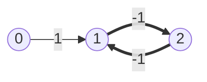
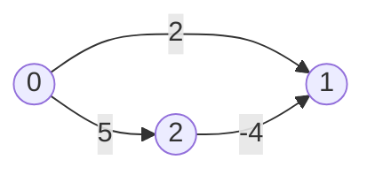
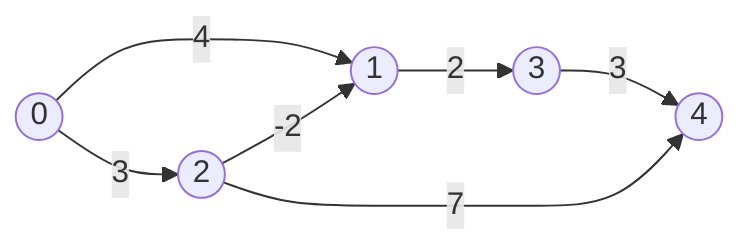
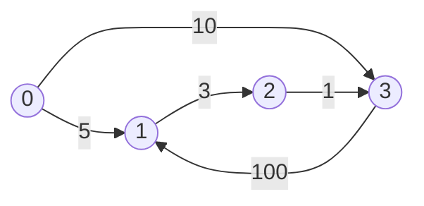

# Shortest Paths Beyond Dijkstra

[Dijkstra](../../10_graphs/notes/07_weighted_shortest_paths.md) rests on one
promise: the cheapest unsettled node in the heap can never get cheaper later,
because every remaining edge only adds to a total. That promise is what lets it
settle a node on the first pop and never look at it again. This topic is about
the graphs where the promise is false, and about a question Dijkstra was never
built to answer

A **negative edge weight** is an edge whose weight is less than zero, so
crossing it makes the running total go *down*. Interviews dress it up as a
refund, a rebate, a currency trade that gains value, a chemical reaction that
releases energy, or an arbitrage step in a market graph. The moment such an edge
exists, a longer detour can arrive somewhere cheaper than a short direct route,
and "I already settled that node" stops being a safe thing to say

Push that one step further and the question itself can fall apart. A **negative
cycle** is a cycle whose edge weights sum to something below zero. Walk it once
and you save money, walk it twice and you save twice as much, and since nothing
stops you from lapping it forever, the cheapest cost to any node reachable from
that cycle is negative infinity. There is no shortest path, only an ever-cheaper
one, so an algorithm's real job on such a graph is to *report* the cycle rather
than to return a number



The bold pair is a negative cycle, since `1 -> 2 -> 1` costs `-2` per lap. Node
`1` is 1 away from the source on the first visit, `-1` after one lap, `-3` after
two, and so on downward with no floor

Two algorithms handle what Dijkstra cannot. **Bellman-Ford** finds single-source
distances on any graph with negative edges and tells you when a negative cycle
makes the answer meaningless. **Floyd-Warshall** finds the distance between
*every* pair of nodes at once, which is a different question that no single run
of Dijkstra answers

## Why A Negative Edge Is Not A Small Problem

Three nodes are enough to break it. The source is `0`, the target is `1`, and
the only negative edge is `2 -> 1`



The direct route costs 2. The detour through node `2` costs `5 - 4 = 1`, which is
cheaper. Run the Dijkstra variant that returns as soon as the target is popped,
which is the standard early exit, and watch it hand back the wrong number

```python
import heapq
import math


def cheapest_arrival(adj: list[list[tuple[int, int]]], src: int, dst: int) -> float:
    """Textbook Dijkstra with the early return on popping the target."""
    dist: list[float] = [math.inf] * len(adj)
    dist[src] = 0
    heap: list[tuple[float, int]] = [(0, src)]
    while heap:
        d, u = heapq.heappop(heap)
        if u == dst:
            return d
        if d > dist[u]:
            continue
        for v, w in adj[u]:
            nd = d + w
            if nd < dist[v]:
                dist[v] = nd
                heapq.heappush(heap, (nd, v))
    return math.inf


trap = [[(1, 2), (2, 5)], [], [(1, -4)]]
assert cheapest_arrival(trap, 0, 1) == 2  # wrong: the real answer is 1, via node 2
assert cheapest_arrival([[(1, 2), (2, 5)], [], [(1, 4)]], 0, 1) == 2  # same shape, no negative edge, correct
assert cheapest_arrival([[]], 0, 0) == 0
```

The heap pops `(2, 1)` before it ever pops `(5, 2)`, because 2 is smaller than 5,
so the function returns 2 and the edge that would have saved a unit is never
examined. The second assert is the same graph with `-4` flipped to `4`, where the
same code is right, which isolates the negative weight as the cause

The natural repair is to shift every weight up by a constant large enough to make
them all nonnegative, then run Dijkstra as usual. It does not work, because
adding `c` to every edge adds `c` per *edge used*, so a three-edge path is
penalised by `3c` while a one-edge path is penalised by `c`. That changes which
path is cheapest rather than preserving it, and above with `c = 4` the detour
becomes `9 + 0 = 9` against a direct route of `6`, so the shift has quietly
reversed the answer. Nothing that reweights edges uniformly can survive this, and
that is the point at which you stop trying to save Dijkstra

## One Sweep Over The Edge List, And Why It Is Not Enough

Give up on choosing a clever order and do the dumbest thing available. Walk the
edge list once, and for every edge `u -> v` check whether reaching `u` and then
crossing costs less than the best known cost to `v`, writing it down if it does.
That check is [relaxation](../../10_graphs/notes/07_weighted_shortest_paths.md)
with no heap deciding who goes first

```python
def relax_once(n: int, edges: list[tuple[int, int, int]], src: int) -> list[float]:
    dist: list[float] = [math.inf] * n
    dist[src] = 0
    for u, v, w in edges:
        if dist[u] + w < dist[v]:
            dist[v] = dist[u] + w
    return dist


EDGES = [(0, 1, 4), (0, 2, 3), (3, 4, 3), (2, 1, -2), (1, 3, 2), (2, 4, 7)]

assert relax_once(5, EDGES, 0) == [0, 1, 3, 3, 10]  # dist[4] should be 6
assert relax_once(2, [(0, 1, 5)], 0) == [0, 5]
assert relax_once(1, [], 0) == [0]
```

`dist[u] + w` on an unreached `u` evaluates to `inf`, and `inf < inf` is false, so
an edge whose source has not been reached yet is skipped without a special case.
That is exactly what happens to `(3, 4, 3)`, which sits third in the list and gets
examined while `dist[3]` is still infinite

By the time the sweep ends, `dist[3]` has become 3 through the later edge
`(1, 3, 2)`, but the edge out of node 3 was already behind us. Node `4` is left
holding 10, the cost of the direct `2 -> 4` edge, when the route `0 -> 2 -> 1 -> 3 -> 4` costs `3 - 2 + 2 + 3 = 6`

The failure is entirely about ordering, and it is small. A single sweep pushes
correct information along an edge only when that edge happens to be visited after
its source was finalised, so in the worst case one sweep advances the frontier by
just one edge. The fix is to stop caring about the order and simply sweep again.
Each additional full sweep is guaranteed to extend every correct distance by at
least one more edge, so after enough sweeps everything is correct

How many is enough? A shortest path never repeats a node, because a repeat means
a cycle sitting inside the path, and removing a cycle whose weight is nonnegative
cannot make the path more expensive. A path over `n` nodes with no repeats holds
at most `n - 1` edges, so `n - 1` sweeps are enough. That is **Bellman-Ford**

## Bellman-Ford

```python
def bellman_ford(n: int, edges: list[tuple[int, int, int]], src: int) -> list[float] | None:
    """Distances from src, or None when a negative cycle makes them meaningless."""
    dist: list[float] = [math.inf] * n
    dist[src] = 0
    for _ in range(n - 1):
        changed = False
        for u, v, w in edges:
            if dist[u] + w < dist[v]:
                dist[v] = dist[u] + w
                changed = True
        if not changed:
            break
    for u, v, w in edges:
        if dist[u] + w < dist[v]:
            return None
    return dist


assert bellman_ford(5, EDGES, 0) == [0, 1, 3, 3, 6]
assert bellman_ford(3, [(0, 1, 1), (1, 2, -1), (2, 1, -1)], 0) is None  # 1 -> 2 -> 1 costs -2
assert bellman_ford(3, [(0, 1, 1)], 0) == [0, 1, math.inf]  # node 2 unreachable
assert bellman_ford(1, [], 0) == [0]
```

**The four decisions in that function**:

- `for _ in range(n - 1)` is the sweep count, and it is `n - 1` rather than `n`
  because a shortest path holds at most `n - 1` edges and one sweep is worth at
  least one edge of progress
- `if not changed: break` is the early exit. A sweep that improves nothing means
  every distance is already final, since the next sweep reads the same numbers and
  writes the same numbers, so continuing is pure waste. On a graph shaped like a
  short chain this turns `O(V * E)` into something close to `O(E)`, and it costs
  one boolean
- The **second loop is not a repeat of the first**, and this is the line people
  omit. It runs one extra sweep and asks whether anything still improves. After
  `n - 1` sweeps every distance is final on a graph with no negative cycle, so an
  edge that can still be relaxed proves a path with `n` or more edges got cheaper,
  which is only possible if a cycle on it has negative weight
- Returning `None` rather than a number is a real design decision, since on such a
  graph the honest answer is that no shortest path exists. Say that out loud
  instead of returning a distance array nobody can use

Bellman-Ford never sorts, never uses a heap, and never asks which node to visit
next. It only needs the flat edge list, which is usually the exact shape the
problem hands you, so there is no adjacency list to build either

> "There is a negative edge here, so the settle-once argument behind Dijkstra
> stops holding and I need Bellman-Ford. I relax every edge `n - 1` times, since a
> shortest path can hold at most `n - 1` edges. Then I run one more sweep, and if
> anything still improves there is a negative cycle and no answer exists."

## Dry Run: Bellman-Ford

Five nodes, six directed edges, source `0`. The edge list is deliberately in an
unhelpful order, with the edge out of node 3 sitting third

```text
edges (u, v, w):  (0,1,4) (0,2,3) (3,4,3) (2,1,-2) (1,3,2) (2,4,7)
```



Start with `dist = [0, inf, inf, inf, inf]` and sweep the list left to right

```text
round 1
  0->1 w=4    0 + 4 = 4    < inf   ACCEPT   dist[1] = 4
  0->2 w=3    0 + 3 = 3    < inf   ACCEPT   dist[2] = 3
  3->4 w=3    inf + 3      = inf   SKIP     node 3 not reached yet
  2->1 w=-2   3 - 2 = 1    < 4     ACCEPT   dist[1] = 1   (overwrites the direct edge)
  1->3 w=2    1 + 2 = 3    < inf   ACCEPT   dist[3] = 3
  2->4 w=7    3 + 7 = 10   < inf   ACCEPT   dist[4] = 10
                                            dist = [0, 1, 3, 3, 10]

round 2
  0->1 w=4    0 + 4 = 4    >= 1    REJECT
  0->2 w=3    0 + 3 = 3    >= 3    REJECT
  3->4 w=3    3 + 3 = 6    < 10    ACCEPT   dist[4] = 6
  2->1 w=-2   3 - 2 = 1    >= 1    REJECT
  1->3 w=2    1 + 2 = 3    >= 3    REJECT
  2->4 w=7    3 + 7 = 10   >= 6    REJECT
                                            dist = [0, 1, 3, 3, 6]

round 3
  nothing improves, so changed stays False and the loop breaks
```

Three moments carry the whole algorithm

- **The skip in round 1.** Edge `3 -> 4` was examined while `dist[3]` was still
  infinite, so it contributed nothing. That single mis-ordered edge is why one
  sweep is not enough, and rounds exist entirely to give it a second chance
- **The overwrite in round 1.** `dist[1]` was written as 4 through the direct edge
  and then rewritten as 1 through node 2, because `-2` made the two-edge route
  cheaper than the one-edge route. Dijkstra would have settled node `1` at 4
- **The rejects in round 2.** Five of the six edges propose something worse than
  what is already recorded, which is what convergence looks like. The single
  accepted one, `3 -> 4` dropping 10 to 6, is the delayed payoff from the skip

The loop ran three rounds out of the four it was allowed, breaking early because
round 3 changed nothing. The verification sweep after the loop then relaxes
nothing either, so no negative cycle is reported and the distances are returned

## Bounding The Number Of Edges

Bellman-Ford has a property Dijkstra does not: **after `i` sweeps, `dist[v]` holds
the cheapest cost to `v` using at most `i` edges**. The sweep counter is a hop
counter, for free, which is exactly the constraint in
[Cheapest Flights Within K Stops](https://leetcode.com/problems/cheapest-flights-within-k-stops/).
"At most `k` intermediate stops" is "at most `k + 1` flights", so run `k + 1`
sweeps and stop

You solved that problem once already with
[state-augmented Dijkstra](../../10_graphs/notes/07_weighted_shortest_paths.md)
over `(city, flights used)` pairs. This version needs no second dimension at all,
because the round number *is* the second dimension

```python
def find_cheapest_price(n: int, flights: list[list[int]], src: int, dst: int, k: int) -> int:
    dist: list[float] = [math.inf] * n
    dist[src] = 0
    for _ in range(k + 1):
        snapshot = dist[:]
        for u, v, w in flights:
            if snapshot[u] + w < dist[v]:
                dist[v] = snapshot[u] + w
    return -1 if dist[dst] == math.inf else int(dist[dst])


assert find_cheapest_price(4, [[0, 1, 100], [1, 2, 100], [2, 0, 100], [1, 3, 600], [2, 3, 200]], 0, 3, 1) == 700
assert find_cheapest_price(3, [[0, 1, 100], [1, 2, 100], [0, 2, 500]], 0, 2, 1) == 200
assert find_cheapest_price(3, [[0, 1, 100], [1, 2, 100], [0, 2, 500]], 0, 2, 0) == 500
assert find_cheapest_price(2, [], 0, 1, 0) == -1
```

`snapshot = dist[:]` is the entire difference between this and plain
Bellman-Ford, and it is the line the problem exists to test. Reading from a frozen
copy of the previous round means a single sweep can extend a route by exactly one
edge, never two, so the hop count stays honest. Read from the live `dist` instead
and an edge relaxed earlier in the same sweep can feed an edge relaxed later,
chaining two hops into one round

The third assert is where that shows. With `k = 0` only the direct flight
`0 -> 2` at 500 is legal. Drop the snapshot and the sweep relaxes `0 -> 1` to
100 and then immediately uses that fresh 100 to relax `1 -> 2` to 200 inside the
same round, returning 200 for a route that takes a stop it was not allowed to
take. The first two asserts pass either way, which is what makes the bug survive
a casual test

Unbounded Bellman-Ford does not need the snapshot, because chaining hops early
only reaches the correct answer sooner and the loop runs long enough regardless.
The copy is required precisely when the round count is load-bearing

## Distances Between Every Pair

Some problems want the distance between every pair of nodes rather than from one
source. The honest first answer is to run Dijkstra `V` times, once per source,
and on a sparse graph that is genuinely the right call at `O(V * E log V)`

On a small dense graph it is the wrong shape. When `E` approaches `V²`, `V` runs
of Dijkstra cost about `O(V³ log V)`, and you have paid for `V` heaps, `V`
adjacency lists, and `V` sets of stale entries to answer a question with a much
plainer structure. The whole answer is a `V` by `V` grid of numbers, and there is
an algorithm that just fills the grid in

**Floyd-Warshall** is
[dynamic programming](../../11_dp/notes/01_dp_fundamentals.md) whose state is
"cheapest cost from `i` to `j` using only nodes numbered below `k` as
intermediates". Grow `k` one node at a time. When node `k` becomes usable, the
best route from `i` to `j` either ignores it, in which case the old value stands,
or it goes through it, in which case it splits at `k` into a route from `i` to `k`
and a route from `k` to `j`, both of which were already computed without `k` in
the middle

```text
dist[i][j] = min(dist[i][j], dist[i][k] + dist[k][j])
```

That one line is the whole algorithm, and everything else is loops around it. The
table lives in place, so there is no separate `dp` array: `dist` starts as the
adjacency matrix and finishes as the answer

```python
def floyd_warshall(n: int, edges: list[tuple[int, int, int]]) -> list[list[float]]:
    """All-pairs shortest distances for a directed graph, dist[i][j] = inf when unreachable."""
    dist: list[list[float]] = [[math.inf] * n for _ in range(n)]
    for i in range(n):
        dist[i][i] = 0
    for u, v, w in edges:
        dist[u][v] = min(dist[u][v], w)
    for k in range(n):
        for i in range(n):
            if dist[i][k] == math.inf:
                continue
            for j in range(n):
                if dist[i][k] + dist[k][j] < dist[i][j]:
                    dist[i][j] = dist[i][k] + dist[k][j]
    return dist


FW = [(0, 1, 5), (0, 3, 10), (1, 2, 3), (2, 3, 1), (3, 1, 100)]

assert floyd_warshall(4, FW) == [
    [0, 5, 8, 9],
    [math.inf, 0, 3, 4],
    [math.inf, 101, 0, 1],
    [math.inf, 100, 103, 0],
]
assert floyd_warshall(2, [(0, 1, 3), (1, 0, 3)]) == [[0, 3], [3, 0]]
assert floyd_warshall(1, []) == [[0]]
```

**Four things about the setup**:

- `dist[i][i] = 0` seeds the diagonal, since staying put costs nothing, and
  without it a node's distance to itself would read as infinite and poison every
  route that passes through it
- `min(dist[u][v], w)` rather than a plain assignment handles **parallel edges**,
  which are two roads between the same pair with different costs, and the input
  format allows them more often than you would guess
- Undirected input needs `dist[v][u]` written as well, one line, and forgetting it
  produces a matrix that is silently half empty
- `if dist[i][k] == math.inf: continue` is a pure speed guard. When `i` cannot
  reach `k` at all, no `j` can be improved through `k`, so the whole inner loop is
  skippable. It changes no answer and it saves a real fraction of the work

**The loop order is the bug everyone writes.** `k` must be the outermost loop,
because the recurrence for a given `k` reads `dist[i][k]` and `dist[k][j]` as they
stood *before* node `k` was allowed, and only a full `i` by `j` pass per `k`
guarantees that. Put `k` innermost, so the loops read `i`, `j`, `k`, and you get a
grid where some pairs never receive the update they needed

```text
nodes 0..3, directed edges:  1 -> 2 (2),  2 -> 3 (6),  3 -> 0 (4)

correct dist[1][0] = 12       the route 1 -> 2 -> 3 -> 0
i,j,k order gives inf         at i=1, j=0 both dist[1][3] and dist[2][0] are
                              still infinite, and by the time either is filled
                              in, the cell (1, 0) has already been passed
```

Floyd-Warshall is fine with negative edges for the same reason Bellman-Ford is,
since nothing in the recurrence assumes a weight is nonnegative. A negative cycle
shows up as a **negative value on the diagonal**, because `dist[i][i]` dropping
below zero says node `i` can leave and return at a profit

## Dry Run: Floyd-Warshall

The `FW` graph above, drawn out, with all edges directed



The matrix starts as the edges themselves, with zeros down the diagonal and
infinity everywhere else. Each block below is one value of `k`, and only the cells
where something was proposed are listed

```text
k = 0   node 0 has no incoming edge, so no dist[i][0] is finite and nothing fires

k = 1   i=0 j=2   dist[0][1] + dist[1][2] = 5 + 3 = 8     < inf   ACCEPT
        i=3 j=2   dist[3][1] + dist[1][2] = 100 + 3 = 103 < inf   ACCEPT

k = 2   i=0 j=3   dist[0][2] + dist[2][3] = 8 + 1 = 9     < 10    ACCEPT
        i=1 j=3   dist[1][2] + dist[2][3] = 3 + 1 = 4     < inf   ACCEPT

k = 3   i=0 j=1   dist[0][3] + dist[3][1] = 9 + 100 = 109 >= 5    REJECT
        i=0 j=2   dist[0][3] + dist[3][2] = 9 + 103 = 112 >= 8    REJECT
        i=1 j=2   dist[1][3] + dist[3][2] = 4 + 103 = 107 >= 3    REJECT
        i=2 j=1   dist[2][3] + dist[3][1] = 1 + 100 = 101 < inf   ACCEPT
```

```text
final       to:   0     1     2     3
      from 0      0     5     8     9
           1    inf     0     3     4
           2    inf   101     0     1
           3    inf   100   103     0
```

The accept at `k = 2` is the one that matters. Cell `(0, 3)` held 10 from the
direct edge, and routing through node 2 brought it to 9, so the direct edge was
never the answer. Notice it could only happen after `k = 1` had filled `(0, 2)`
with 8, which is the ordering the outer `k` loop enforces

The three rejects at `k = 3` are the more instructive part. Every one of them
proposes a genuine, finite, legal route that is simply worse than what the cell
already holds, and the strict `<` throws all three away. A version that wrote
unconditionally, or used `<=`, would still be correct here but is one edit away
from not being

The whole column for node 0 stays infinite below the diagonal because nothing
points at node 0, and reading that column is how you spot unreachability in the
finished matrix

## Counting The Shortest Routes, Not Just Measuring One

[Number Of Ways To Arrive At Destination](https://leetcode.com/problems/number-of-ways-to-arrive-at-destination/)
asks how many distinct shortest routes exist, which is a counting question
wearing a shortest-path costume. Dijkstra already does the measuring, so carry a
second array `ways` beside `dist` and update it at the same moment

The rule follows from what a relaxation means. When a strictly cheaper route to
`v` appears, every route counted so far was measuring an obsolete distance, so
`ways[v]` is **overwritten** with `ways[u]` rather than added to. When an
equally cheap route appears, it is a genuinely new way to achieve the same
distance, so `ways[v] += ways[u]`

```python
MOD = 10**9 + 7


def count_paths(n: int, roads: list[list[int]]) -> int:
    adj: list[list[tuple[int, int]]] = [[] for _ in range(n)]
    for u, v, w in roads:
        adj[u].append((v, w))
        adj[v].append((u, w))
    dist: list[float] = [math.inf] * n
    ways = [0] * n
    dist[0] = 0
    ways[0] = 1
    heap: list[tuple[float, int]] = [(0, 0)]
    while heap:
        d, u = heapq.heappop(heap)
        if d > dist[u]:
            continue
        for v, w in adj[u]:
            nd = d + w
            if nd < dist[v]:
                dist[v] = nd
                ways[v] = ways[u]
                heapq.heappush(heap, (nd, v))
            elif nd == dist[v]:
                ways[v] = (ways[v] + ways[u]) % MOD
    return ways[n - 1]


assert count_paths(7, [[0, 6, 7], [0, 1, 2], [1, 2, 3], [1, 3, 3], [6, 3, 3],
                       [3, 5, 1], [6, 5, 1], [2, 5, 1], [0, 4, 5], [4, 6, 2]]) == 4
assert count_paths(2, [[1, 0, 10]]) == 1
assert count_paths(1, []) == 1
```

`ways[0] = 1` is the base case, because there is exactly one way to be standing at
the source having gone nowhere. The `elif nd == dist[v]` branch pushes nothing,
since an equal-cost arrival changes no distance and re-expanding `v` would double
count. Adding `ways[u]` rather than `1` is what makes it a count of whole routes:
every shortest route into `u` extends into a distinct shortest route into `v`

This works because the settle-once property holds. By the time `u` is popped with
`d == dist[u]`, every shortest route into `u` has already been counted, so
`ways[u]` is final and safe to hand onward. On a graph with negative edges that
guarantee dies and the count would be wrong, which is another way of saying the
counting trick is a Dijkstra feature rather than a shortest-path feature

## Picking The Right Algorithm

`V` is the number of nodes and `E` is the number of edges

| The situation                       | What to run                                                     | Why                                                                     |
| ----------------------------------- | --------------------------------------------------------------- | ----------------------------------------------------------------------- |
| every edge costs the same           | [BFS](../../10_graphs/notes/03_grid_bfs.md)                     | fewest edges is already cheapest, so no priority structure is needed    |
| every edge costs 0 or 1             | [0-1 BFS](../../10_graphs/notes/07_weighted_shortest_paths.md)  | only two distances are ever queued, so a deque replaces the heap        |
| nonnegative weights, one source     | [Dijkstra](../../10_graphs/notes/07_weighted_shortest_paths.md) | settling on the first pop is safe, and the heap makes it `O(E log V)`   |
| any negative edge, one source       | Bellman-Ford                                                    | settling is unsafe, so relax everything `V - 1` times instead           |
| a cap on the number of edges used   | Bellman-Ford with a snapshot                                    | the round counter is the hop counter, so no augmented state is needed   |
| you need to prove a negative cycle  | Bellman-Ford                                                    | one extra sweep that still improves something is the proof              |
| every pair, and `V` is small        | Floyd-Warshall                                                  | `O(V³)` with a tiny constant, three loops, and no graph structure built |
| every pair, and the graph is sparse | Dijkstra run `V` times                                          | `O(V * E log V)` beats `O(V³)` when `E` is far below `V²`               |

**The size of `V` is the giveaway for Floyd-Warshall.** A constraint like
`n <= 100` or `n <= 200` is not there by accident, since `200³` is eight million
operations and `1000³` is a billion. When a problem caps the node count that
aggressively and asks something about all pairs, it is telling you which algorithm
it wants

## Worked Example: [Find The City With The Smallest Number Of Neighbors At A Threshold Distance](https://leetcode.com/problems/find-the-city-with-the-smallest-number-of-neighbors-at-a-threshold-distance/)

Given a weighted undirected graph of cities, find the city that can reach the
fewest other cities within a given distance budget, breaking ties by preferring
the largest city number

**Input**:

- `n`, an `int`, the number of cities, labelled `0` through `n - 1`
- `edges`, a `list[list[int]]` where each entry is `[from, to, weight]`, a
  bidirectional road with a positive weight, and there is at most one road for a
  given pair of cities
- `distance_threshold`, an `int`, the distance budget

**Output**: an `int`, the label of the city with the fewest other cities
reachable at a total distance of `distance_threshold` or less. Reachable means
along any route, not just a single road, so a city three roads away still counts
if the three weights sum within budget. When several cities tie on that count,
return the largest label among them

**Recognizing it**: the question is asked about *every* city rather than one, so a
single source is not enough. Running Dijkstra `n` times is correct and would pass,
but `n` is capped at 100 in this problem, and a cap that small on an all-pairs
question is the Floyd-Warshall signal. Three nested loops over 100 nodes is a
million operations, and there is no heap, no adjacency list, and no stale entry to
reason about

> "I need the distance between every pair, not from one source, and `n` is only
> 100, so `n³` is a million operations and Floyd-Warshall is simpler than running
> Dijkstra `n` times. I build the adjacency matrix, run the triple loop with `k`
> outermost, then count per row and take the last city that ties."

1. Allocate an `n` by `n` matrix filled with infinity and write `0` down the
   diagonal, since a city reaches itself at no cost. Infinity is the right filler
   because it makes an unreachable pair fail the budget test later without a
   separate check
2. Write each road into the matrix in **both directions**, since the roads are
   undirected, and use `min` against what is already there so a duplicate road
   between the same pair keeps only the cheaper one
3. Run the triple loop with `k` outermost, letting `dist[i][j]` fall to
   `dist[i][k] + dist[k][j]` whenever that is smaller. After the `k` loop finishes
   for a given value, every pair knows its best route using nodes `0` through `k`
   as stepping stones, and after the last `k` that restriction is gone
4. Skip the inner `j` loop when `dist[i][k]` is infinite, since a city that cannot
   reach `k` at all cannot use `k` as a stepping stone toward anything
5. For each city `i`, count how many other cities sit at `dist[i][j]` within the
   threshold. Excluding `j == i` matters, because the diagonal is `0` and would
   otherwise add one to every count and tilt nothing, but it makes the number you
   report wrong
6. Track the running best with `<=` rather than `<` on the comparison. Scanning
   cities in increasing label order, `<=` lets a later city with an equal count
   replace an earlier one, which is exactly the "largest label wins" tie-break the
   problem asks for and is far cleaner than a separate tie check

```python
def find_the_city(n: int, edges: list[list[int]], distance_threshold: int) -> int:
    dist: list[list[float]] = [[math.inf] * n for _ in range(n)]
    for i in range(n):
        dist[i][i] = 0
    for u, v, w in edges:
        dist[u][v] = min(dist[u][v], w)
        dist[v][u] = dist[u][v]

    for k in range(n):
        for i in range(n):
            if dist[i][k] == math.inf:
                continue
            for j in range(n):
                if dist[i][k] + dist[k][j] < dist[i][j]:
                    dist[i][j] = dist[i][k] + dist[k][j]

    best_city = -1
    fewest = n + 1
    for i in range(n):
        reach = sum(1 for j in range(n) if j != i and dist[i][j] <= distance_threshold)
        if reach <= fewest:
            fewest = reach
            best_city = i
    return best_city


assert find_the_city(4, [[0, 1, 3], [1, 2, 1], [1, 3, 4], [2, 3, 1]], 4) == 3
assert find_the_city(5, [[0, 1, 2], [0, 4, 8], [1, 2, 3], [1, 4, 2], [2, 3, 1], [3, 4, 1]], 2) == 0
assert find_the_city(2, [[0, 1, 5]], 1) == 1
```

The first assert is worth checking by hand. The finished matrix is

```text
            to:  0   1   2   3
      from 0     0   3   4   5
           1     3   0   1   2
           2     4   1   0   1
           3     5   2   1   0
```

With a threshold of 4, city 0 reaches cities 1 and 2 but not 3 at distance 5, so
its count is 2. City 3 reaches cities 1 and 2 but not 0, so its count is also 2.
Cities 1 and 2 each reach all three others. The two-way tie between 0 and 3
resolves to 3, and the `<=` in the scan is what does it, since city 3 is examined
later and replaces city 0. Note that `dist[0][2]` is 4 through the two-road route
`0 -> 1 -> 2`, even though no direct road between them exists, which is the whole
reason the all-pairs run had to happen first

- **Time Complexity:** `O(V³ + E)` where `V` is `n` and `E` is the number of
  roads, because the triple loop touches every `(k, i, j)` triple exactly once and
  does constant work in each, the matrix setup reads each road once, and the final
  counting pass is `O(V²)` which the cube absorbs
- **Space Complexity:** `O(V²)` for the distance matrix, which is the dominant
  cost and is unavoidable here because the answer genuinely is a `V` by `V` grid,
  with no additional structure since there is no heap and no adjacency list

## Time and Space Complexity

`V` is the number of nodes, `E` is the number of edges, and `k` is a cap on the
number of edges a route may use

**Single source**

| Approach                       | Time                                                                                                                    | Space                                                                                                |
| ------------------------------ | ----------------------------------------------------------------------------------------------------------------------- | ---------------------------------------------------------------------------------------------------- |
| Bellman-Ford                   | `O(V * E)`: `V - 1` sweeps plus one verification sweep, each touching all `E` edges, and the early exit only helps      | `O(V)`: one distance entry per node, since the edge list is the input and no adjacency list is built |
| Bellman-Ford bounded to `k`    | `O(k * E)`: exactly `k + 1` sweeps of `E` edges, which is why a small `k` makes it cheap regardless of how large `V` is | `O(V)`: the distance array plus one snapshot copy of it per round, both of which are `V` long        |
| Dijkstra, nonnegative weights  | `O(E log V)`: every edge can push once and each heap operation is logarithmic, so pushes dominate pops                  | `O(V + E)`: the distance array plus a heap that can hold one stale entry per edge                    |
| Dijkstra plus a `ways` counter | `O(E log V)`: the counting is `O(1)` work folded into a relaxation that was already happening                           | `O(V + E)`: one extra integer per node on top of Dijkstra, which does not change the class           |

Bellman-Ford's early exit is real but not a better bound, because a graph shaped
like a long chain, with the edge list ordered against you, genuinely needs all
`V - 1` sweeps

**All pairs**

| Approach                    | Time                                                                                                              | Space                                                                                                    |
| --------------------------- | ----------------------------------------------------------------------------------------------------------------- | -------------------------------------------------------------------------------------------------------- |
| Floyd-Warshall              | `O(V³)`: three nested loops over all nodes with constant work inside, independent of how many edges the graph has | `O(V²)`: the matrix, which is also the output, so nothing here is auxiliary                              |
| Dijkstra from each node     | `O(V * E log V)`: one full Dijkstra per source, which beats `O(V³)` on a sparse graph where `E` is close to `V`   | `O(V² + E)`: the same `V` by `V` result grid plus one adjacency list and one heap reused across the runs |
| Bellman-Ford from each node | `O(V² * E)`: strictly worse than both of the above, and worth running only when negative edges rule Dijkstra out  | `O(V²)`: the result grid, with no heap or adjacency list needed                                          |

Floyd-Warshall's `O(V³)` ignores `E` entirely, which cuts both ways. On a dense
graph that independence is the win, and on a sparse graph it is why repeated
Dijkstra is faster despite looking more complicated

## Summary

- A **negative edge weight** is an edge that lowers a running total when you cross
  it, and it breaks Dijkstra rather than slowing it down. Dijkstra settles a node
  on the first pop because every remaining edge can only add cost, and a negative
  edge makes that false, so a longer detour can arrive cheaper after the node was
  already declared final
  - The tempting repair of adding a constant to every weight does not work,
    because the constant is paid once per edge used, so it penalises long routes
    more than short ones and changes which route is cheapest
- A **negative cycle** is a cycle whose weights sum below zero, and any node
  reachable from one has no shortest distance at all, since each extra lap saves
  more money. The correct output on such a graph is a report that no answer
  exists, not a number
- **Bellman-Ford** ignores ordering entirely and relaxes every edge in the list
  `V - 1` times. `V - 1` is enough because a shortest path never repeats a node
  and so holds at most `V - 1` edges, and each full sweep is guaranteed to push
  every correct distance at least one edge further along
  - A sweep that improves nothing means every distance is final, so an early
    `break` on an unchanged flag is free, though it does not improve the `O(V * E)`
    worst case
  - One **extra sweep after the loop** is the negative-cycle test. If anything
    still improves after `V - 1` sweeps, some route with `V` or more edges got
    cheaper, which only a negative cycle allows
  - Unreached nodes need no special case, since `math.inf + w` stays infinite and
    never beats an existing entry
- After `i` sweeps of Bellman-Ford, every distance is the cheapest one **using at
  most `i` edges**, so the sweep counter doubles as a hop counter. That is what
  makes *Cheapest Flights Within K Stops* fall out of `k + 1` sweeps with no
  augmented `(city, flights used)` state
  - Relax from a **frozen copy** of the previous round's array. Reading the live
    array lets an edge relaxed early in a sweep feed an edge relaxed later,
    chaining two hops into one round and quietly allowing a stop the limit forbade
  - Plain unbounded Bellman-Ford does not need the copy, since arriving at the
    right answer sooner is harmless when the round count is not the constraint
- **Floyd-Warshall** answers a different question, which is the distance between
  every pair rather than from one source. It is dynamic programming over "routes
  allowed to pass through nodes `0` through `k`", and the single recurrence
  `dist[i][j] = min(dist[i][j], dist[i][k] + dist[k][j])` says a route either
  ignores node `k` or splits at it
  - `k` must be the **outermost** loop, because each value of `k` needs a complete
    `i` by `j` pass before the next one begins. Writing the loops as `i`, `j`, `k`
    compiles, runs, and leaves some pairs at infinity that had perfectly good
    routes
  - Seed the diagonal to `0`, write undirected roads into both `dist[u][v]` and
    `dist[v][u]`, and use `min` when writing an edge so parallel roads keep the
    cheaper one
  - It tolerates negative edges, and a negative cycle announces itself as a
    negative number on the diagonal, since `dist[i][i]` below zero means a node can
    leave and return at a profit
- A cap like `n <= 100` sitting next to a question about all pairs is the
  Floyd-Warshall signal, since `100³` is a million operations. On a sparse graph
  running Dijkstra `V` times at `O(V * E log V)` is faster than `O(V³)`, so say
  which side of that line the input falls on rather than reaching for the matrix
  reflexively
- Counting shortest routes is Dijkstra with a `ways` array updated during
  relaxation, seeded at `ways[source] = 1`. A strictly cheaper arrival
  **overwrites** `ways[v]` with `ways[u]`, because everything counted before was
  measuring a distance that is now obsolete, while an equal-cost arrival **adds**
  `ways[u]` and pushes nothing, because it changes no distance
  - It relies on the settle-once guarantee, so `ways[u]` is final when `u` is
    popped. The trick does not survive negative edges
- The whole ladder, from cheapest to most general, is BFS for uniform weights,
  0-1 BFS with a deque for weights of only zero and one, Dijkstra for nonnegative
  weights, Bellman-Ford once anything is negative or the hop count is capped, and
  Floyd-Warshall when the question is about every pair on a small graph

## Interview Checklist

Before writing code, make sure you can answer each of these

```text
Is any weight negative, and can I say in one sentence why that rules out Dijkstra?
Could a negative cycle exist, and what am I supposed to return if one does?
Is this one source, or every pair, and did I reread the problem to be sure?
For Bellman-Ford: is my sweep count V - 1, and can I justify V - 1 out loud?
For Bellman-Ford: did I add the extra sweep that detects a negative cycle?
Is there a cap on edges or stops, meaning the round counter is doing double duty?
If a hop cap exists, am I relaxing from a snapshot rather than the live array?
For Floyd-Warshall: is k the outermost loop, and can I say why it has to be?
For Floyd-Warshall: is the diagonal seeded to 0, and are undirected roads written both ways?
Is V small enough that V^3 fits, or is the graph sparse enough to favour V Dijkstras?
Am I counting routes as well as measuring them, and is that an overwrite or an add?
Can I state time and space for the version I chose, and name the term that dominates?
```
