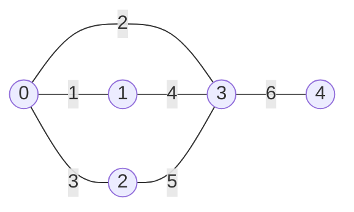
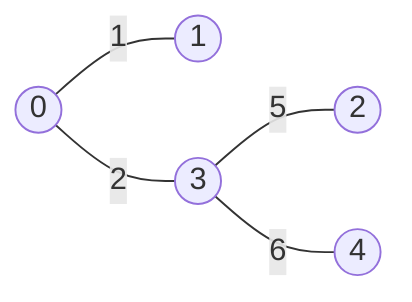
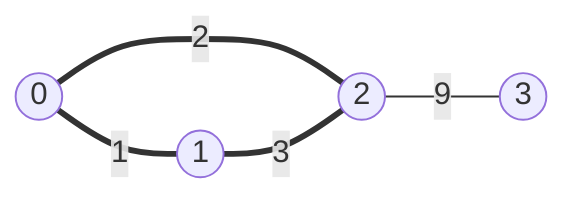
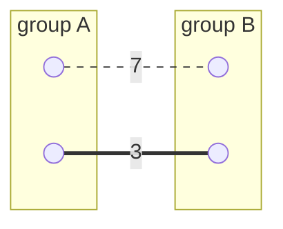

# Minimum Spanning Tree

A **spanning tree** of a connected undirected graph is a set of edges that keeps
every node reachable from every other node while containing **no cycles**. You
begin with the graph you were handed, throw edges away, and stop at the moment
one more removal would break the graph into pieces that cannot reach each other

The [trees](../../07_trees/notes/01_fundamentals.md) from earlier in the book
arrived already built, with a root on top and children hanging beneath it. A
spanning tree is the reverse situation. Nothing hands you the structure, and you
have to carve it out of a graph that carries more edges than a tree is allowed to
have. *Which* edges survive the carving is the whole question

You can think of a spanning tree as the roads a town council refuses to close.
Every town has to stay drivable from every other town, so the council keeps
closing roads until closing one more would strand somebody. Two councils cutting
in a different order end up keeping different roads, and some of those road
networks cost far more to maintain than others

This topic covers **minimum spanning trees (MST)**, which involves finding the
**cheapest possible spanning tree**

**MST Properties**:

- It is a **tree**, which means it contains **no cycles**. This means that
  a tree over `n` nodes contains exactly `n - 1` edges
  - If it had fewer, the graph would fall apart into disconnected pieces
  - If it had more, some edge would be closing a loop, and you could delete that edge without disconnecting anything
- It is **spanning**, which means it reaches every single node in the original
  graph. You are allowed to discard edges, but you are never allowed to discard a
  node
- It is **minimum**, which means that out of all the spanning trees the graph
  admits, you want the one whose edge weights add up to the smallest total

Below is a small graph with five nodes and six edges, and therefore has cycles. Any
spanning tree of it has exactly four edges, because a tree over `n` nodes always
holds `n - 1` of them



Here is one of its spanning trees. Two edges are gone, no cycle is left, and all
five nodes are still connected



This spanning tree costs a total of 14. A different set of four edges would give a different
spanning tree with a different total. The MST becomes whichever spanning tree is the
cheapest (i.e. has the cheapest total). This graph has a cheaper one costing 12

> The rest of this topic will cover how to find the MST without checking every possibility

## When to Use

Interview problems regarding MSTs are typically written in the form of:

- "connect all the cities with roads at minimum total cost"
- "wire up every computer in the office as cheaply as possible"
- "every village needs water, and pipes have different costs"
- "return the minimum cost to make all points connected"

Three signals appear together in all of them

- Every node has to end up reachable, which is usually signalled by a word like "all" or "every"
- The edges carry costs and you are being asked to minimize the total of those costs
- The graph is undirected, because a real world use representation of an edge, like a road or a wire, works in both directions

A minimum spanning tree problem will always ask for the cheapest way to connect the entire graph or network, while a shortest path problem will ask for the cheapest way to travel between two particular nodes. These are different questions with different answers, and they need different algorithms

| The question being asked           | The tool you want                                               |
| ---------------------------------- | --------------------------------------------------------------- |
| Cheapest way to connect everything | Minimum spanning tree, which is this topic                      |
| Cheapest way to get from A to B    | [Dijkstra](../../10_graphs/notes/07_weighted_shortest_paths.md) |

A minimum spanning tree does not care how far apart any two specific nodes end up
being. It can even place two nodes quite far from each other, as long as doing so
keeps the total bill low. This means that problems that mention travelling from one
specific node to another won't need an MST

## Why Sorting Alone Fails

You are minimizing a sum of weights, so the natural first idea is to sort the
edges by weight and take the `n - 1` cheapest. It runs fast and it is wrong, and
seeing how it breaks hands you the correct algorithm



The three cheapest edges are in bold, and all three land inside the group
`{0, 1, 2}`, forming a triangle

- The third edge was **pure waste**, since the nodes it joined were already
  connected through the first two
- Node 3 was reachable only through the edge weighing 9, which sorting told you
  to buy last, so it never got connected at all

The instinct to sort was right, and the sorted order is still the order you want
to spend money in. What it lacked is one extra rule: **skip any edge whose
endpoints are already connected**, because such an edge can only close a loop and
a loop is exactly what a tree is not allowed to contain. Sorting plus that one
rule is known as **Kruskal's algorithm**

## The Cut Property

Kruskal is a **greedy algorithm**, meaning it takes the cheapest edge available
right now and never revisits the decision.
[Greedy algorithms](../../12_greedy_algorithms/notes/01_greedy_fundamentals.md)
can often fail, since the best local choice can paint you into a corner. So the
question worth answering before writing any code is why greedy happens to be safe
here

Suppose the nodes are split into two groups, any way you like. That split is called a
**cut**, and the edges with one endpoint in each group are the **crossing edges**

> For any cut, the cheapest crossing edge is always safe to put in the MST

**Why that holds**, assuming the optimal tree does not use `e`, the cheapest
crossing edge:

- That tree still has to join the two groups, so it uses some other crossing edge
  `f`
- `e` was the cheapest crossing edge, so `f` weighs at least as much as `e`
- Swap `f` out and `e` in, and the tree is still connected, still has `n - 1`
  edges, and costs the same or less

So an optimal solution containing `e` always exists, which means taking `e` can
never hurt you. This is the same
[exchange argument](../../12_greedy_algorithms/notes/01_greedy_fundamentals.md)
that justifies every other safe greedy choice in the book, applied to edges
instead of intervals



The dashed edge weighing 7 is `f`, the one the supposedly optimal tree used. The
bold edge weighing 3 is `e`, the cheapest crossing edge. Swapping them keeps the
tree spanning and saves 4

Notice that the swap never compared a weight against zero, only against another
weight. **Negative edge weights are therefore fine** for both algorithms below,
which is not true of Dijkstra, where a negative edge breaks the assumption that a
settled node can never get cheaper. Rejecting an MST because the input contains
negative numbers is a mistake worth not making

Both algorithms below are the cut property applied over and over. The only
difference is which cut they look at

- **Kruskal** takes the globally cheapest remaining edge and asks whether its
  endpoints are in two different pieces
- **Prim** fixes one cut and never changes it, separating the nodes it has
  reached from the nodes it has not

## Kruskal's Algorithm

Kruskal starts with `n` separate single-node islands and merges them until one
island is left. Each step it looks at the cheapest edge it has not seen yet, and
takes it only if that edge joins two islands that are currently separate

```text
1. sort every edge by weight, cheapest first
2. walk down the sorted list one edge at a time
3. if both endpoints are already in the same island, skip the edge
4. otherwise merge the two islands and add the weight to the total
5. stop once n - 1 edges have been accepted
```

Step 3 means answering "are these two already connected?" thousands of times. The
structure built for that question is [union-find](01_union_find.md), and Kruskal
is its flagship use. The only thing to carry over: **two nodes are in the same
island exactly when `find` returns the same root for both**

```python
def kruskal(n: int, edges: list[tuple[int, int, int]]) -> int:
    """edges are (weight, u, v). Returns MST cost, or -1 if the graph is disconnected."""
    parent = list(range(n))

    def find(x: int) -> int:
        while parent[x] != x:
            parent[x] = parent[parent[x]]  # path compression
            x = parent[x]
        return x

    total = 0
    used = 0
    for w, u, v in sorted(edges):
        root_u, root_v = find(u), find(v)
        if root_u == root_v:
            continue  # already connected, so this edge would close a cycle
        parent[root_u] = root_v
        total += w
        used += 1
        if used == n - 1:
            break

    return total if used == n - 1 else -1


assert kruskal(5, [(1, 0, 1), (2, 1, 2), (3, 0, 2), (4, 1, 3), (5, 2, 3), (6, 3, 4), (7, 2, 4)]) == 13
assert kruskal(4, [(1, 0, 1), (2, 0, 2), (3, 1, 2), (9, 2, 3)]) == 12
assert kruskal(3, [(1, 0, 1)]) == -1  # node 2 is unreachable
assert kruskal(1, []) == 0
```

**Reading the loop**:

- `parent = list(range(n))` makes every node its own parent, which is how you say
  each node starts as its own island
- `for w, u, v in sorted(edges)` is why the tuple puts the **weight first**, since
  Python compares tuples element by element
  - A plain `sorted()` then gives you cheapest-first with no `key` argument
  - Small detail, but worth saying out loud in an interview
- `if root_u == root_v` is the cycle check, and it compares **roots, not nodes**
  - Writing `if u == v` is a real and common bug
  - That version only catches self-loops and lets every actual cycle through
- `return total if used == n - 1 else -1` is the disconnected-graph guard, since a
  graph arriving in two unconnected halves has no spanning tree at all
  - Drop this line and you silently return a **forest's** cost as if it were an
    answer
  - That is exactly the input interviewers plant

## Dry Run: Kruskal

Take a five-node graph with seven edges

```text
n = 5
edges (weight, u, v):
  (1,0,1) (2,1,2) (3,0,2) (4,1,3) (5,2,3) (6,3,4) (7,2,4)
```

Those are already sorted, so process them left to right

```text
w=1  (0,1)  find(0)=0, find(1)=1   different  -> TAKE   total=1   used=1
w=2  (1,2)  find(1)=1, find(2)=2   different  -> TAKE   total=3   used=2
w=3  (0,2)  find(0)=2, find(2)=2   SAME       -> SKIP   (0-1-2 is already a loop)
w=4  (1,3)  find(1)=2, find(3)=3   different  -> TAKE   total=7   used=3
w=5  (2,3)  find(2)=3, find(3)=3   SAME       -> SKIP
w=6  (3,4)  find(3)=3, find(4)=4   different  -> TAKE   total=13  used=4
```

The root of the merged island keeps changing because `parent[root_u] = root_v`
hangs the first root under the second one, so after taking `(0,1)` the island
`{0, 1}` answers `1`, and after taking `(1,2)` the island `{0, 1, 2}` answers `2`.
Which node ends up as root is arbitrary and never matters. Only whether two `find`
calls agree matters

`used` hits `n - 1`, which is 4, so it stops. The MST costs **13**, using edges
`(0,1)`, `(1,2)`, `(1,3)` and `(3,4)`

The interesting part is the two rejections. The edge weighing **3 was thrown away
while the edge weighing 6 was accepted**, so sorting alone would have given a
different and worse answer. The cycle check is not a detail bolted onto a sort, it
is the algorithm

The final edge weighing 7 never got examined at all, because `used` reached four
first. That early exit is free correctness rather than an optimization, since any
edge reached after `n - 1` acceptances would have been rejected as a cycle anyway

## Prim's Algorithm

Prim never has separate islands. It picks one starting node and grows a single
blob outward, each step absorbing the cheapest edge that leads somewhere new

```text
1. start at any node and push (cost 0, that node) into a min-heap
2. pop the cheapest (weight, node) pair
3. if that node is already in the blob, discard the entry and pop again
4. otherwise add it to the blob, add the weight, and push all of its edges
5. stop once every node has been absorbed
```

A min-heap fits because the cheapest edge leaving the blob changes every time the
blob grows, and a heap keeps that answer ready without rescanning everything. Prim
also wants an **adjacency list** rather than a flat edge list, and that difference
in input shape is usually what decides which algorithm you pick

```python
import heapq


def prim(n: int, adj: list[list[tuple[int, int]]]) -> int:
    """adj[u] holds (neighbor, weight). Returns MST cost, or -1 if disconnected."""
    visited = [False] * n
    heap: list[tuple[int, int]] = [(0, 0)]  # (weight, node), starting at node 0
    total = 0
    count = 0

    while heap and count < n:
        w, u = heapq.heappop(heap)
        if visited[u]:
            continue  # stale entry, since we already reached u more cheaply
        visited[u] = True
        total += w
        count += 1
        for v, weight in adj[u]:
            if not visited[v]:
                heapq.heappush(heap, (weight, v))

    return total if count == n else -1


adj = [
    [(1, 1), (2, 3)],
    [(0, 1), (2, 2), (3, 4)],
    [(0, 3), (1, 2), (3, 5), (4, 7)],
    [(1, 4), (2, 5), (4, 6)],
    [(3, 6), (2, 7)],
]
assert prim(5, adj) == 13
assert prim(3, [[(1, 1)], [(0, 1)], []]) == -1  # node 2 is unreachable
assert prim(1, [[]]) == 0
```

**The three lines that matter**:

- `heap = [(0, 0)]` starts at node 0 for free, and any node works, since the
  finished tree includes all of them no matter where you began
- `if visited[u]: continue` handles **stale entries**, since a node gets pushed
  once per edge pointing at it
  - Once it is absorbed, the other copies are garbage
  - You let them surface and throw them away rather than hunting them down
  - Trying to keep the heap clean is wasted effort
- `visited[u] = True` sits **after the pop, never at push time**
  - Mark on push and you block yourself from a cheaper edge you have not found yet
  - You get a valid but non-minimal tree, and this is the most common Prim bug

One thing lives outside the function and still breaks it. Prim reads nothing but
`adj`, so an adjacency list built in one direction only will quietly hide half the
graph, because the input is undirected and every edge needs an entry in both
`adj[u]` and `adj[v]`. Nothing crashes when you get this wrong. You either return
`-1` on a graph that was genuinely connected, or a total that is too high because
the cheap edge back the other way was never visible

### The Dijkstra Trap

Prim looks almost exactly like
[Dijkstra](../../10_graphs/notes/07_weighted_shortest_paths.md). The whole
difference is one line

```python
heapq.heappush(heap, (weight, v))  # Prim
heapq.heappush(heap, (dist[u] + weight, v))  # Dijkstra
```

They are answering different questions

- **Prim** asks how cheaply it can attach a node to the tree, which is one single
  edge weight, so nothing accumulates
- **Dijkstra** asks how cheaply it can walk to a node from the source, which is a
  running total along a path, so distances accumulate

Accumulate by accident inside Prim and you get a connected, plausible-looking,
wrong answer

## Dry Run: Prim

Same five-node graph, starting from node 0

```text
pop (0,0)  new    -> visit 0   total=0    push (1,1) (3,2)
pop (1,1)  new    -> visit 1   total=1    push (2,2) (4,3)
pop (2,2)  new    -> visit 2   total=3    push (5,3) (7,4)
pop (3,2)  node 2 already visited  -> STALE, discard
pop (4,3)  new    -> visit 3   total=7    push (6,4)
pop (5,3)  node 3 already visited  -> STALE, discard
pop (6,4)  new    -> visit 4   total=13   all 5 nodes visited, done
```

The total is **13**, the same as Kruskal, reached in a completely different order

**Two things to notice**:

- **The stale pops are the design working.** Node 2 was pushed twice, as `(3,2)`
  from node 0 and `(2,2)` from node 1
  - The cheaper copy surfaced first and got used
  - The other surfaced later and got discarded
- **Same total, different edges.** When weights tie, a graph can have more than one
  MST, and the two algorithms may return different edge sets
  - The total is always identical
  - Problems almost always ask for the cost, so either algorithm is fine

## Kruskal Or Prim

|                      | Kruskal                           | Prim                               |
| -------------------- | --------------------------------- | ---------------------------------- |
| Structure it needs   | union-find                        | min-heap and an adjacency list     |
| Input shape it wants | a flat edge list                  | an adjacency list                  |
| Time                 | `O(E log E)`                      | `O(E log V)`                       |
| Strongest when       | sparse graph, edges handed to you | dense graph, or edges are implicit |
| Free bonus           | connected components as it runs   | one growing connected tree         |

**The input shape usually decides for you**:

- Given `edges = [[u, v, w], ...]`, use **Kruskal**, since you can sort it
  immediately with no setup
- Given points or coordinates where every pair is connected, use **Prim**, since
  building and sorting all `V²` edges is wasteful
- Asked about connectivity, components, or critical edges, use **Kruskal**, since
  union-find already tracks that for free

If you only master one, master Kruskal. It shows up more, and union-find pays for
itself across a dozen unrelated problems

## Variants You Will Actually See

An MST rarely shows up undisguised. These four costumes cover most of it

**Implicit complete graph.** You get points on a plane and have to connect them
all, where the cost between two points is the
[Manhattan distance](../../16_math_geometry/notes/04_geometry_basics.md). No edge
list is given, because every pair is an edge, so there are about `V²/2` of them.
Generate them all and run Kruskal, or run Prim straight over the points. This is
*Min Cost to Connect All Points*, worked in full below

**Virtual node.** Each city can dig its own well at one cost, or run a pipe to a
neighbour at another. Two different kinds of cost, which looks like it breaks the
model. The trick is to invent a fake node 0 and connect it to city `i` with an edge
weighing that city's well cost. Digging your own well becomes "connect to the
virtual node", every cost is an edge weight again, and a plain MST over `n + 1`
nodes solves it. This is *Optimize Water Distribution in a Village*

**Critical and pseudo-critical edges.** Compute the normal MST cost first

- An edge is **critical** when banning it makes the cost go up, so the tree cannot
  do without it
- An edge is **pseudo-critical** when forcing it in leaves the cost unchanged, so
  it belongs to some MST without being required by all of them

You run Kruskal repeatedly, once per edge, with that edge either skipped or merged
in advance

**Offline queries.** For each query of two nodes and a limit, is there a path using
only edges lighter than that limit? Sort the queries by limit, sort the edges by
weight, then sweep both together, unioning edges as they come under the current
limit. This is Kruskal's machinery without ever building a tree, and getting it
right is a good sign you actually absorbed union-find rather than memorizing one
algorithm that uses it

## Worked Example: [Min Cost To Connect All Points](https://leetcode.com/problems/min-cost-to-connect-all-points/)

Given points on a plane, connect them all at minimum total cost, where the cost
between two points is their Manhattan distance

**Input**: `points`, a `list[list[int]]` where each inner list is a pair
`[x, y]` giving one point's coordinates, all points are distinct, and the list
holds between 1 and 1000 of them

**Output**: an `int`, the smallest total Manhattan distance needed to connect
every point to every other one, where a connection between `[xi, yi]` and
`[xj, yj]` costs `|xi - xj| + |yi - yj|` and points count as connected when a
chain of chosen connections runs between them

**Recognizing it**: "connect all points" plus a total being minimized is the MST
signal. What makes this one different is that **no edge list is given**. Every
pair of points is an edge, so there are about `V²/2` of them, which is what
decides the algorithm

Therefore,

1. Keep two arrays instead of a heap, `visited` marking which points are already
   in the tree and `best` holding, for every point, the cheapest known distance
   from it to any point already absorbed. On a graph this dense the heap would
   carry one entry per edge, which is `O(V²)` of them, so an array of `V` numbers
   replaces it
2. Set `best[0] = 0` and leave every other entry at infinity, which starts the
   tree at point 0 for free. Any starting point works, since the finished tree
   holds all of them, and the zero is what makes the first round add nothing to
   the total
3. Run exactly `n` rounds, one per point absorbed, because the tree is finished
   the moment every point is inside it and no separate stopping condition is
   needed
4. Each round pick the unvisited point `u` with the smallest `best[u]`, which is
   the cheapest edge crossing the cut between visited and unvisited, so the cut
   property says taking it is safe. This linear scan is what the heap pop used to
   do
5. Mark `u` visited and add `best[u]` to the running total, which pays for the
   single edge that attached `u`. On the first round that payment is the zero from
   step 2, which is why the starting point costs nothing and the loop can run a
   full `n` times rather than `n - 1`
6. Relax from `u` by walking every still-unvisited `v`, computing the Manhattan
   distance `|ux - vx| + |uy - vy|` on the fly, and lowering `best[v]` whenever
   that distance beats what was already recorded. Nothing is stored, so no edge
   list is ever built
7. After the `n` rounds return the total. There is no disconnected case to guard
   here, because every pair of points is joined by an edge, and a single point is
   handled by the same code, absorbing itself for a cost of 0

```python
def min_cost_connect_points(points: list[list[int]]) -> int:
    n = len(points)
    visited = [False] * n
    best = [float("inf")] * n
    best[0] = 0
    total = 0
    for _ in range(n):
        u = min((i for i in range(n) if not visited[i]), key=lambda i: best[i])
        visited[u] = True
        total += best[u]
        ux, uy = points[u]
        for v in range(n):
            if not visited[v]:
                d = abs(ux - points[v][0]) + abs(uy - points[v][1])
                if d < best[v]:
                    best[v] = d
    return total


assert min_cost_connect_points([[0, 0], [2, 2], [3, 10], [5, 2], [7, 0]]) == 20
assert min_cost_connect_points([[3, 12], [-2, 5], [-4, 1]]) == 18
assert min_cost_connect_points([[0, 0]]) == 0
```

**The insight**: this is Prim without a heap. On a dense graph the heap stops
paying for itself, because it can hold one entry per edge, which is `O(V²)`
entries. Scanning an array of `V` best-known distances is `O(V)` per step and
`O(V²)` overall, with no heap and no stale entries to discard

The `best` array is doing what the heap did. `best[v]` is the cheapest known cost
of attaching `v` to the tree so far, updated whenever a newly absorbed node offers
something closer. That is still the cut property, with the cut being visited
against unvisited

Kruskal is the wrong pick here, since materializing and sorting `V²/2` edges costs
`O(V² log V)` before the union-find work even begins

Time is `O(V²)`, since `V` rounds each scan `V` entries twice, once to pick the
next point and once to relax. Space is `O(V)` for the `visited` and `best` arrays
and nothing else, since distances are recomputed on the fly rather than stored.
Stating why you dropped the heap is the part that gets credit

## Time and Space Complexity

`V` is the number of nodes and `E` is the number of edges

**Kruskal**

| Step                  | Time                                                                                    | Space                                                      |
| --------------------- | --------------------------------------------------------------------------------------- | ---------------------------------------------------------- |
| sorting the edges     | `O(E log E)`: this dominates the whole algorithm                                        | `O(E)`: `sorted` allocates a copy of the edge list         |
| union-find operations | `O(E · α(V))` amortized: effectively `O(E)`, since `α` stays below 5 for any real input | `O(V)`: the parent array, one slot per node                |
| **total**             | **`O(E log E)`**: the sort is the cost and union-find is nearly free                    | **`O(V + E)`**: the parent array plus the sorted edge list |

**Prim, using a binary heap**

| Step                  | Time                                                              | Space                                           |
| --------------------- | ----------------------------------------------------------------- | ----------------------------------------------- |
| each edge pushed once | `O(E log V)`: this dominates, since every edge can enter the heap | `O(E)`: the heap holds up to one entry per edge |
| each node popped once | `O(V log V)`: fewer nodes than edges, so this is the smaller term | `O(V)`: the visited array, one flag per node    |
| **total**             | **`O(E log V)`**: driven by pushes rather than pops               | **`O(V + E)`**: the visited array plus the heap |

**Prim on a dense or implicit graph, with no heap**

| Step                       | Time                                                                                         | Space                                                                        |
| -------------------------- | -------------------------------------------------------------------------------------------- | ---------------------------------------------------------------------------- |
| picking the next node      | `O(V)`: it scans the `best` array once per absorbed node, which happens `V` times            | `O(V)`: the `best` array plus the visited array, one slot each per node      |
| relaxing from the new node | `O(V)`: every unvisited node gets its `best` value refreshed against the node just absorbed  | `O(1)`: the distance is computed on the fly, so no edge is ever stored       |
| **total**                  | **`O(V²)`**: `V` rounds of an `O(V)` scan, which beats `O(E log V)` once `E` approaches `V²` | **`O(V)`**: nothing scales with `E`, which is the point of dropping the heap |

## Summary

- A **minimum spanning tree** is the cheapest set of edges that keeps every node
  of a weighted undirected graph reachable from every other node. It is a **tree**,
  so it holds no cycles and exactly `n - 1` edges over `n` nodes, it is
  **spanning**, so no node is ever discarded, and it is **minimum**, so out of
  every spanning tree the graph admits you want the one whose weights sum to the
  least
  - Fewer than `n - 1` edges and the graph falls into disconnected pieces, more
    than `n - 1` and some edge is closing a loop you could delete for free
- Problems reach for an MST when they say "connect all the cities", "wire every
  computer", or "make all points connected", so the tell is a word like **all** or
  **every** sitting next to a **total** cost being minimized, over edges that work
  in both directions
- An MST is not a shortest path. It will happily leave two particular nodes a long
  way apart as long as the whole network stays cheap, so a problem about
  travelling from A to B wants Dijkstra instead, and rereading for "every node"
  versus "from A to B" is what separates the two in the first minute
- Sorting the edges and buying the cheapest `n - 1` is the idea that almost works,
  and it fails because the cheap edges can all land among nodes that are already
  connected, forming a loop while some far-off node never gets bought at all.
  Adding a single rule, which is to skip any edge whose endpoints are already
  connected, turns that failed idea into Kruskal
- The **cut property** is why greedy is allowed here. Split the nodes into two
  groups however you like, and the cheapest edge crossing the split belongs to
  some MST, because an optimal tree that skipped it must have used another
  crossing edge weighing at least as much, and swapping the two leaves the tree
  connected and no more expensive
  - That swap compares weights only against other weights and never against zero,
    so **negative edge weights are fine** for both Kruskal and Prim, unlike
    Dijkstra
- **Kruskal** sorts every edge cheapest first and accepts one only when
  `find(u) != find(v)`, merging two islands each time, and stopping once `n - 1`
  edges have been accepted. It costs `O(E log E)` time, which is the sort and
  nothing else, since the union-find work is `O(E · α(V))` amortized and so
  effectively free,
  and `O(V + E)` space for the parent array plus the sorted copy of the edges
- **Prim** starts anywhere, grows one blob outward, and repeatedly pops the
  cheapest edge leaving the blob from a min-heap, discarding any popped node it
  has already absorbed. It costs `O(E log V)` time, driven by pushes rather than
  pops because every edge can enter the heap, and `O(V + E)` space for the heap
  plus the visited array
  - On a dense or implicit graph the heap stops paying for itself, so you replace
    it with a `best` array scanned in `O(V)` per round, giving `O(V²)` time and
    `O(V)` space. That is the shape *Min Cost to Connect All Points* wants
- The input shape picks the algorithm for you, so say so out loud. A flat edge
  list means **Kruskal**, since you can sort it with no setup. Coordinates with
  every pair implicitly connected mean **Prim**, since building `V²/2` edges
  wastes the time you saved. Anything asking about components, connectivity, or
  critical edges means **Kruskal**, since union-find already tracks it
- Three disguises cover most real problems. A per-node standalone cost, such as
  digging a well instead of laying a pipe, becomes a **virtual node 0** joined to
  every node so that two kinds of cost turn into one kind of edge weight.
  **Critical and pseudo-critical edges** are found by rerunning Kruskal once per
  edge with that edge banned or forced in. **Offline connectivity queries** sort
  the queries by weight limit and sweep them alongside the sorted edges, which is
  Kruskal's machinery with no tree ever built
- The most common mistake involves pushing `dist[u] + weight` into Prim's heap,
  which silently turns Prim into Dijkstra and hands back a spanning tree that is
  connected, plausible, and not minimal
  - Two more fail just as quietly. Comparing `if u == v` instead of
    `if find(u) == find(v)` in Kruskal catches only self-loops and lets every real
    cycle through, and returning the total without checking that `n - 1` edges
    were accepted reports a forest's cost as though it were an answer
  - Marking a node visited in Prim at push time rather than pop time blocks the
    cheaper edge you have not discovered yet, and building the adjacency list in
    one direction only hides half of an undirected graph

## Interview Checklist

Before writing code, make sure you can answer each of these

```text
Is this connect-everything, or travel from A to B, and can I say which in a sentence?
Can I raise the sorted-cheapest-n-1 idea and kill it myself before being asked?
Can I state the cut property, and give the swap argument that makes greedy safe?
Flat edge list (favours Kruskal), or dense/implicit graph (favours Prim), and why?
Kruskal: am I skipping on find(u) == find(v), not on u == v?
Prim: am I pushing the raw edge weight, not an accumulated distance?
Prim: am I marking visited on pop, and discarding stale heap entries?
Prim: does the adjacency list carry every undirected edge in both directions?
How do I detect a disconnected graph, and what do I return then?
Is there a hidden virtual node, meaning a per-node standalone cost, to add first?
Can I volunteer time and space unprompted, and name the step that dominates?
Do negative weights change anything here, and can I say why they do not?
What is my answer if an edge is added later, or if two weights tie?
```
