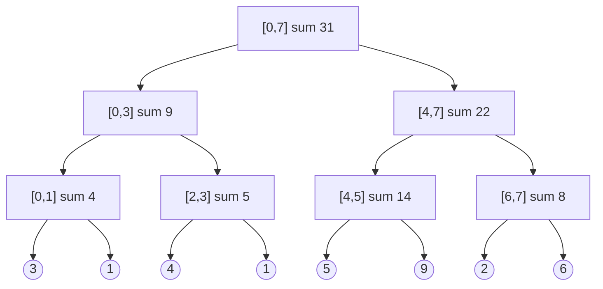

# Segment Trees and Fenwick Trees

A **range query** asks for one aggregate over a slice of an array, such as the sum
of `nums[2..7]`, the maximum of `nums[0..4]`, or how many values sit in
`nums[3..9]`. A **point update** changes one entry, as in `nums[5] = 12`. Either
one alone is easy. Problems in this topic hand you both, **interleaved**, thousands
of times each, and that combination is what breaks every simple approach

The two structures here solve exactly that. Both store **precomputed aggregates
over blocks of the array** rather than over the array's prefixes, and both are
built so that any single element lives inside only about `log n` of those blocks.
That is the entire idea, and everything else is index arithmetic

- A **segment tree** is a binary tree where each node owns a contiguous
  **segment** of the array and stores the aggregate of it. The root owns
  everything, each node splits its segment in half between its two children, and
  the leaves own one element each
- A **Fenwick tree**, also called a **binary indexed tree** or **BIT**, is a flat
  array that keeps only the segment-tree nodes needed for *prefix* answers, and
  finds them with one bitwise trick instead of storing child pointers. It is
  shorter to write and faster in practice, and it answers a narrower set of
  questions

> This topic covers why prefix sums fail once values change, both structures from
> scratch, the coordinate-compression trick that turns counting problems into
> range queries, the two-dimensional version, and lazy propagation for range
> updates

## When A Problem Wants One Of These

The signal is a problem where **queries and modifications are mixed together**, and
you cannot answer all the queries against a single fixed snapshot of the data:

- A design problem whose class exposes both an `update` and a `sum_range` method,
  as in *Range Sum Query - Mutable*, which is this topic's worked example
- A problem asking, for every position, **how many earlier or later elements are
  smaller or larger**, as in *Count Of Smaller Numbers After Self* and
  *Reverse Pairs*. The array being updated is not the input array, and spotting
  that is the whole difficulty
- Counting how many subarray sums land inside a numeric interval, as in
  *Count Of Range Sum*, where the structure runs over prefix sums instead of over
  the values themselves
- Booking intervals and reporting the maximum overlap so far, as in
  *My Calendar III*, which needs a range update rather than a point update

Three situations look similar and want something cheaper, so rule them out first:

- **The array never changes.** Then
  [prefix sums](../../01_arrays_and_hashing/notes/03_prefix_suffix_sums.md) answer
  every range sum in `O(1)` after one `O(n)` pass, and a segment tree is strictly
  worse
- **Every query is over the whole array.** Then one running variable is enough,
  since there is no range to decompose
- **All the updates happen before all the queries**, or the queries can be
  reordered. Then you can sort the work **offline** and sweep, which is what
  *Checking Existence Of Edge Length Limited Paths* does with union-find in the
  [minimum spanning tree](03_mst.md) topic

## Why Prefix Sums Collapse When A Value Changes

The natural first idea is the one that already worked for static range sums. Build
`prefix`, where `prefix[i]` is the total of everything before index `i`, and answer
`sum(left..right)` as `prefix[right + 1] - prefix[left]` in constant time

Now change one value and watch what happens. Take `nums = [3, 1, 4, 1, 5]` and set
`nums[1] = 7`, which is a change of `+6`:

```text
index      0    1    2    3    4
nums       3    1    4    1    5
prefix   0    3    4    8    9   14
              ^ everything from here right is now wrong

nums       3    7    4    1    5
prefix   0    3   10   14   15   20
                   ^^   ^^   ^^   ^^  four entries had to be rewritten
```

The definition is what kills it. `prefix[i]` covers **everything to the left of
`i`**, so index 1 is contained in `prefix[2]`, `prefix[3]`, `prefix[4]`, and
`prefix[5]`. In general an index sits inside about `n` of the stored aggregates, so
one update rewrites `O(n)` of them. With `q` operations that is `O(n * q)`, which
on tens of thousands of each is billions of writes and a timeout

Going the other way is no better. Store nothing, and each query rescans its range
for `O(n)` while updates become free, so `O(n * q)` returns with the roles swapped.
One operation is cheap only because the other is expensive, and the reason is that
**every stored total overlaps every other one**. Prefix `[0..4]` completely
contains prefix `[0..3]`, so they can never be updated independently

## Blocks Of Doubling Size

The fix is to store totals for **disjoint blocks that nest**, instead of prefixes
that all pile up at index 0. Halve the array, halve each half, and keep going until
each block holds one element. Every block's total is the sum of its two children,
so the whole thing is a binary tree over segments



That is `[3, 1, 4, 1, 5, 9, 2, 6]` with every block total filled in. Two properties
fall straight out of the shape, and together they are why both structures work

- **Each element belongs to exactly one block per level**, and the levels number
  `log2 n + 1` because each level halves the block width. Changing `nums[2]` from 4
  to 10 means fixing the leaf, then `[2,3]`, then `[0,3]`, then `[0,7]`, which is
  four writes on a walk from a leaf to the root instead of the `O(n)` prefix
  sums needed
- **Any range decomposes into `O(log n)` whole blocks.** The range `[1,4]` is the
  leaf `[1,1]` plus the block `[2,3]` plus the leaf `[4,4]`, three stored numbers
  added together, never five elements scanned

> "A prefix array makes queries `O(1)` and updates `O(n)`, because one index sits
> inside `O(n)` prefixes. If I store nested blocks instead, each index sits inside
> only `log n` of them, so both operations become `O(log n)` and the mix of the two
> stops being the bottleneck."

The combining operation does not have to be addition. It has to be **associative**,
meaning `(a + b) + c` equals `a + (b + c)`, because the tree fixes a grouping of the
range that you do not control and the answer must not depend on that grouping. Sum,
minimum, maximum, greatest common divisor, and bitwise OR all qualify. "The average
of the range" does not, which is why you store the sum and the count and divide at
the end

## Building A Segment Tree

The tree is kept in a flat array with no pointers, using the same numbering as a
[heap](../../08_heaps/notes/01_heap_basics.md): the root is index 1, and node `v`
has children `2 * v` and `2 * v + 1`. Each recursive call is told which segment
`[lo, hi]` its node owns, so no node has to store its own boundaries

Three operations are needed, and all three are the same recursion with a different
base case

```python
class SegmentTree:
    def __init__(self, nums: list[int]) -> None:
        self.n = len(nums)
        self.tree = [0] * (4 * self.n) if self.n else []
        if self.n:
            self._build(nums, 1, 0, self.n - 1)

    def _build(self, nums: list[int], node: int, lo: int, hi: int) -> None:
        if lo == hi:
            self.tree[node] = nums[lo]
            return
        mid = (lo + hi) // 2
        self._build(nums, 2 * node, lo, mid)
        self._build(nums, 2 * node + 1, mid + 1, hi)
        self.tree[node] = self.tree[2 * node] + self.tree[2 * node + 1]

    def update(self, index: int, value: int) -> None:
        self._update(1, 0, self.n - 1, index, value)

    def _update(self, node: int, lo: int, hi: int, index: int, value: int) -> None:
        if lo == hi:
            self.tree[node] = value
            return
        mid = (lo + hi) // 2
        if index <= mid:
            self._update(2 * node, lo, mid, index, value)
        else:
            self._update(2 * node + 1, mid + 1, hi, index, value)
        self.tree[node] = self.tree[2 * node] + self.tree[2 * node + 1]

    def range_sum(self, left: int, right: int) -> int:
        if self.n == 0 or left > right:
            return 0
        return self._query(1, 0, self.n - 1, left, right)

    def _query(self, node: int, lo: int, hi: int, left: int, right: int) -> int:
        if right < lo or hi < left:
            return 0
        if left <= lo and hi <= right:
            return self.tree[node]
        mid = (lo + hi) // 2
        return self._query(2 * node, lo, mid, left, right) + self._query(
            2 * node + 1, mid + 1, hi, left, right
        )


st = SegmentTree([3, 1, 4, 1, 5, 9, 2, 6])
assert st.range_sum(1, 4) == 11
assert st.range_sum(0, 7) == 31
st.update(2, 10)
assert st.range_sum(1, 4) == 17
assert SegmentTree([7]).range_sum(0, 0) == 7
assert SegmentTree([]).range_sum(0, 0) == 0
```

**The decisions worth defending out loud**:

- `4 * self.n` is the array size, and the reason is worth knowing because
  interviewers ask. Padding the array up to the next power of two gives a perfect
  tree of `2 * 2^ceil(log2 n)` nodes, and `2^ceil(log2 n)` is under `2 * n`, so
  `4 * n` slots always fit. Sizing it `2 * n` works only when `n` is already a
  power of two and silently writes out of bounds otherwise
- `_query` has **three** cases and getting them in the wrong order is the usual
  bug. **No overlap** returns the identity element first, then **total overlap**
  returns the stored value, and only a **partial overlap** recurses
  - The identity is `0` for a sum, `float("-inf")` for a maximum, and
    `float("inf")` for a minimum, because it is the value that changes nothing when
    combined
  - Return the wrong identity, such as `0` for a maximum over negative numbers, and
    you get a plausible answer that is wrong on exactly the inputs interviewers
    plant
- `self.tree[node] = self.tree[2 * node] + self.tree[2 * node + 1]` sits **after**
  the recursive call in `_update`, since the parent can only be recomputed once the
  child it depends on has changed. Moving that line above the recursion leaves every
  ancestor of the updated leaf stale, and the leaf itself will still read correctly,
  so small tests pass
- Swapping the operator in the two combine lines and the identity in `_query` is
  the whole change needed for range minimum or range maximum. Nothing else in the
  class knows what it is aggregating

## Dry Run: One Range Query

Query `range_sum(1, 4)` on `[3, 1, 4, 1, 5, 9, 2, 6]`, whose true answer is
`1 + 4 + 1 + 5 = 11`. Indentation shows the recursion depth

```text
node 1  [0,7]  partial   split at mid=3
  node 2  [0,3]  partial   split at mid=1
    node 4  [0,1]  partial   split at mid=0
      node 8  [0,0]  NO OVERLAP  -> 0        rejected, 0 is left of the range
      node 9  [1,1]  inside      -> 1
    node 5  [2,3]  inside        -> 5        one stored number, not two elements
  node 3  [4,7]  partial   split at mid=5
    node 12 [4,4]  inside        -> 5
    node 13 [5,5]  NO OVERLAP    -> 0        rejected, 5 is right of the range
    node 7  [6,7]  NO OVERLAP    -> 0        rejected, and its two leaves are
                                             never visited at all
total = 1 + 5 + 5 = 11
```

The rejections are where the `log n` comes from. Node 7 owns `[6,7]`, which is
entirely outside `[1,4]`, so it returns the identity `0` immediately and **prunes
its whole subtree**, which is why a query never touches more than a couple of nodes
per level. Nodes 8 and 13 are single leaves rejected the same way, and they are the
price of a range whose ends do not line up with block boundaries

The accepted node 5 is the payoff. It covers `[2,3]` and is used as one number,
even though it stands for two array elements. On a range of length one million the
same walk would use blocks of length half a million

A point update is the reverse walk. Calling `update(2, 10)` descends to the leaf for
index 2, writes it, and then recomputes `[2,3]`, `[0,3]`, and `[0,7]` on the way
back up, which is four writes total

## The Fenwick Tree, Or Binary Indexed Tree

Half of the segment tree is redundant when the only question is a **prefix** sum. If
you know a parent's total and its left child's total, the right child's total is the
difference, so there is no reason to store it. Throw away every right child, keep the
rest in a flat array, and you have a Fenwick tree: about `n` numbers instead of
`4 * n`, with no recursion and a much shorter body

The catch is finding which surviving block a given index belongs to, and that is
what the bit trick does. Index the array from **1**, and let `tree[i]` store the sum
of the `i & -i` elements ending at `i`

`i & -i` isolates the **lowest set bit** of `i`. In
[two's complement](../../15_bit_manipulation/notes/01_bitwise_basics.md), `-i` is
`~i + 1`, so flipping turns the trailing zeroes into ones and the lowest set bit
into a zero, and the `+ 1` then carries back through those ones and stops exactly on
that bit. So `i` and `-i` agree on that one bit and disagree everywhere else. For
`i = 6`, which is `0110`, `-6` is `1010`, and the AND is `0010`, which is 2

```text
i   binary   tree[i] covers        block length = i & -i
1    0001    a1                    1
2    0010    a1 + a2               2
3    0011    a3                    1
4    0100    a1 + a2 + a3 + a4     4
5    0101    a5                    1
6    0110    a5 + a6               2
7    0111    a7                    1
8    1000    a1 + ... + a8         8
```

Read that table two ways, because the two walks fall out of it directly

- **A prefix sum of `a1..a7`** is `tree[7]` plus `tree[6]` plus `tree[4]`, which is
  `a7`, then `a5 + a6`, then `a1..a4`. Each step strips the lowest set bit, so
  `i -= i & -i` walks `7 → 6 → 4 → 0`, and the number of steps is the number of
  one-bits in `i`, which is at most `log2 n`
- **Updating `a3`** must fix every block containing position 3, which is `tree[3]`,
  `tree[4]`, and `tree[8]`. Each step adds the lowest set bit, so
  `i += i & -i` walks `3 → 4 → 8`. Note that `tree[5]` and `tree[6]` are left alone,
  because their blocks start at position 5

```python
class FenwickTree:
    def __init__(self, n: int) -> None:
        self.n = n
        self.tree = [0] * (n + 1)

    def update(self, index: int, delta: int) -> None:
        """Adds delta to position index, which is 0-based from the caller's view."""
        i = index + 1
        while i <= self.n:
            self.tree[i] += delta
            i += i & -i

    def prefix_sum(self, index: int) -> int:
        """Sum of positions 0 through index inclusive, and 0 when index < 0."""
        i = index + 1
        total = 0
        while i > 0:
            total += self.tree[i]
            i -= i & -i
        return total

    def range_sum(self, left: int, right: int) -> int:
        return self.prefix_sum(right) - self.prefix_sum(left - 1)


bit = FenwickTree(8)
for position, value in enumerate([3, 1, 4, 1, 5, 9, 2, 6]):
    bit.update(position, value)
assert bit.tree == [0, 3, 4, 4, 9, 5, 14, 2, 31]
assert bit.range_sum(1, 4) == 11
assert bit.prefix_sum(7) == 31
assert bit.range_sum(0, 0) == 3
assert FenwickTree(1).prefix_sum(0) == 0
```

**The four things that go wrong**:

- **The tree is 1-indexed and the public methods are 0-indexed**, which is the
  `index + 1` in both walks. Mixing the two conventions is the single most common
  Fenwick bug, so pick this split, say it out loud, and never let a raw `index`
  reach `self.tree`
- **Index 0 cannot be a node**, because `0 & -0` is `0`, so `i += 0` would loop
  forever. That is not an arbitrary convention, it is forced by the arithmetic
- **`update` takes a delta, not a new value.** The structure only knows how to add,
  so setting a position to `val` means calling `update(index, val - old)` and
  keeping your own copy of the array to remember `old`. This is exactly what the
  worked example below has to do
- **`range_sum` is a subtraction of two prefixes**, using
  `prefix_sum(left - 1)` rather than `prefix_sum(left)` so that `left` itself stays
  inside the answer. `prefix_sum(-1)` is `0` because `i` starts at `0` and the loop
  never runs, which is why `left = 0` needs no special case

Building by calling `update` once per element is `O(n log n)`. An `O(n)` build
exists, where you fill `tree[i] = a[i]` and then push each cell into its parent at
`i + (i & -i)`, and it is worth mentioning as a follow-up rather than writing first

## Dry Run: One Update And One Prefix Sum

Same array `[3, 1, 4, 1, 5, 9, 2, 6]`, whose built tree is the one asserted above.
Add `2` to position 2, which is `a3` in 1-based terms, then ask for the sum through
position 6

```text
start  tree = [_, 3, 4, 4,  9, 5, 14, 2, 31]

update(2, +2)   i = 3
  i=3   tree[3]: 4 -> 6      i += 3 & -3 = 1   ->  i = 4
  i=4   tree[4]: 9 -> 11     i += 4 & -4 = 4   ->  i = 8
  i=8   tree[8]: 31 -> 33    i += 8 & -8 = 8   ->  i = 16
  i=16  16 > n = 8, so this write is DISCARDED and the loop ends
after  tree = [_, 3, 4, 6, 11, 5, 14, 2, 33]

prefix_sum(6)   i = 7
  i=7   total = 0 + tree[7] = 2      i -= 1  ->  i = 6
  i=6   total = 2 + tree[6] = 16     i -= 2  ->  i = 4
  i=4   total = 16 + tree[4] = 27    i -= 4  ->  i = 0
  loop ends, return 27
```

Check it by hand: `3 + 1 + 6 + 1 + 5 + 9 + 2` is 27, using the updated 6

The discarded step at `i = 16` matters more than it looks. Positions past the end of
the array are real nodes in the conceptual tree, since the tree is padded to a power
of two, but they hold nothing you will ever query, so the guard `while i <= self.n`
throws them away rather than allocating them

The nodes that were **never visited** are the other half of the story. The update
skipped `tree[5]`, `tree[6]`, and `tree[7]` entirely, because their blocks start at
position 5 or later and cannot contain position 3. The query skipped `tree[5]`, and
its block `(4,5]` was still counted, because `tree[6]` covers `a5 + a6` and swallows
it. Three reads replaced seven

## Counting With A Tree Indexed By Value

The hardest part of this family of problems is not the structure, it is noticing
that a range structure applies at all. *Count Of Smaller Numbers After Self* asks,
for each index, how many values to its right are smaller than it, and it contains no
sums, no ranges, and no updates

The reframing is to build **an array of counters indexed by value rather than by
position**. Slot `v` holds how many copies of value `v` you have seen so far. Then
"how many seen values are smaller than `x`" is the prefix sum over slots below `x`,
and "I have now seen `x`" is a point update of `+1` at slot `x`. Scanning right to
left makes "seen so far" mean "to my right", which is what the problem asked

Values can be huge while there are only `n` of them, so the counter array is indexed
by **rank** instead of by raw value. **Coordinate compression** is the two-line move
that gets there: sort the distinct values, then replace each value by its position in
that sorted list with
[`bisect_left`](../../05_binary_search/notes/02_boundary_search.md). Order is
preserved, which is all the prefix sum needs, and the array shrinks to the number of
distinct values

```python
from bisect import bisect_left


def count_smaller(nums: list[int]) -> list[int]:
    ranks = sorted(set(nums))
    tree = FenwickTree(len(ranks))
    counts: list[int] = []
    for value in reversed(nums):
        rank = bisect_left(ranks, value)
        counts.append(tree.prefix_sum(rank - 1))
        tree.update(rank, 1)
    counts.reverse()
    return counts


assert count_smaller([5, 2, 6, 1]) == [2, 1, 1, 0]
assert count_smaller([-1]) == [0]
assert count_smaller([-1, -1]) == [0, 0]
assert count_smaller([]) == []
```

`prefix_sum(rank - 1)` is the line to be careful with. Stopping one slot short of
`rank` excludes equal values, which is what "strictly smaller" demands, and writing
`prefix_sum(rank)` counts duplicates of `value` itself as smaller than it

```text
nums = [5, 2, 6, 1], scanned right to left, ranks = [1, 2, 5, 6]

value=1  rank=0  prefix_sum(-1) = 0  loop never runs   count 0, then add 1 at slot 0
value=6  rank=3  prefix_sum(2)  = 1  the 1 is smaller  count 1, then add 1 at slot 3
value=2  rank=1  prefix_sum(0)  = 1  the 1 again       count 1, then add 1 at slot 1
value=5  rank=2  prefix_sum(1)  = 2  the 1 and the 2   count 2, then add 1 at slot 2

collected [0, 1, 1, 2], reversed -> [2, 1, 1, 0]
```

The third line is the interesting one. When `value = 2` is processed the tree already
holds a 6, and the query walks from slot 1 downward, so that 6 is **never read** and
correctly contributes nothing, because it is not smaller than 2. The first line is
the degenerate query: `rank - 1` is `-1`, `i` starts at `0`, and the loop body never
executes, so an empty tree returns `0` with no special case

**The same machine answers two harder questions**:

- ***Reverse Pairs*** counts pairs where `nums[i] > 2 * nums[j]` and `i < j`. Scan
  right to left as before, but query for values `v` satisfying `2 * v < value`, which
  means `v < ceil(value / 2)`, so the cutoff rank is
  `bisect_left(ranks, (value + 1) // 2)`. The integer form of the ceiling matters
  because `(value + 1) // 2` is correct for negative values too, whereas a float
  division loses precision on large inputs. The insertion still happens at the rank
  of `value` itself, since the tree tracks values, not cutoffs
- ***Count Of Range Sum*** counts subarrays whose sum lies in `[lower, upper]`. A
  subarray sum is `prefix[j] - prefix[i]` with `i < j`, so the condition becomes
  `prefix[j] - upper <= prefix[i] <= prefix[j] - lower`. Compress the prefix sums,
  walk them left to right, and for each `prefix[j]` ask the tree for the count of
  already-inserted prefixes inside that interval before inserting `prefix[j]`. It is
  the same scan with a two-sided range query instead of a one-sided prefix query

## Two Dimensions

*Range Sum Query 2D - Mutable* wants the sum of a rectangle in a grid whose cells
change. Nest the Fenwick walk: a cell `(row, col)` belongs to blocks indexed by both
chains, so `update` runs the `i += i & -i` walk over rows and, inside it, the same
walk over columns, touching `log m * log n` cells

The `_prefix(row, col)` helper returns the sum of the whole rectangle from `(0, 0)`
to `(row, col)`, and the answer comes from the same
[inclusion-exclusion](../../01_arrays_and_hashing/notes/03_prefix_suffix_sums.md)
that static 2D prefix sums use, subtracting the strip above and the strip to the left
and adding back the corner that was removed twice

```python
class NumMatrix:
    def __init__(self, matrix: list[list[int]]) -> None:
        self.m = len(matrix)
        self.n = len(matrix[0]) if self.m else 0
        self.nums = [[0] * self.n for _ in range(self.m)]
        self.tree = [[0] * (self.n + 1) for _ in range(self.m + 1)]
        for r in range(self.m):
            for c in range(self.n):
                self.update(r, c, matrix[r][c])

    def update(self, row: int, col: int, val: int) -> None:
        delta = val - self.nums[row][col]
        self.nums[row][col] = val
        i = row + 1
        while i <= self.m:
            j = col + 1
            while j <= self.n:
                self.tree[i][j] += delta
                j += j & -j
            i += i & -i

    def _prefix(self, row: int, col: int) -> int:
        total = 0
        i = row + 1
        while i > 0:
            j = col + 1
            while j > 0:
                total += self.tree[i][j]
                j -= j & -j
            i -= i & -i
        return total

    def sum_region(self, row1: int, col1: int, row2: int, col2: int) -> int:
        return (
            self._prefix(row2, col2)
            - self._prefix(row1 - 1, col2)
            - self._prefix(row2, col1 - 1)
            + self._prefix(row1 - 1, col1 - 1)
        )


nm = NumMatrix(
    [
        [3, 0, 1, 4, 2],
        [5, 6, 3, 2, 1],
        [1, 2, 0, 1, 5],
        [4, 1, 0, 1, 7],
        [1, 0, 3, 0, 5],
    ]
)
assert nm.sum_region(2, 1, 4, 3) == 8
nm.update(3, 2, 2)
assert nm.sum_region(2, 1, 4, 3) == 10
assert NumMatrix([[5]]).sum_region(0, 0, 0, 0) == 5
```

`self.nums` is the copy of the grid that makes `update` able to accept a new value
rather than a delta, and dropping it is the bug that makes the second and later
updates to the same cell wrong while the first one looks fine

## Range Updates And Lazy Propagation

Everything so far updates one position. *My Calendar III* books an interval and asks
for the largest number of overlapping bookings so far, which is a `+1` applied to a
whole **range**, followed by a maximum over the whole range. Applying that `+1` to
every leaf costs `O(n)` per booking and undoes the point of the structure

**Lazy propagation** is the fix: when a node's segment lies entirely inside the
update range, stamp the node and stop, rather than descending into children that all
change by the same amount. The stamp is a `pending` counter saying "everything below
me is also `+1`, and I have not told them yet"

For this particular pair of operations the pushing down never has to happen at all,
which is what makes the code short. The update is a uniform `+1` over the node's
whole segment and the query is a maximum over that same segment, so a node's true
answer is always its own pending total plus the larger of its two children's answers.
That is the last line of `_add` below

Booking times run to a billion, so there is no array to build. The nodes live in a
dictionary and come into existence only when a booking touches them, which is a
**dynamic** or implicitly built segment tree over the fixed range `[0, 10**9]`

```python
from collections import defaultdict


class MyCalendarThree:
    def __init__(self) -> None:
        self.best: dict[int, int] = defaultdict(int)
        self.pending: dict[int, int] = defaultdict(int)

    def book(self, start: int, end: int) -> int:
        self._add(1, 0, 10**9, start, end - 1)
        return self.best[1]

    def _add(self, node: int, lo: int, hi: int, left: int, right: int) -> None:
        if right < lo or hi < left:
            return
        if left <= lo and hi <= right:
            self.best[node] += 1
            self.pending[node] += 1
            return
        mid = (lo + hi) // 2
        self._add(2 * node, lo, mid, left, right)
        self._add(2 * node + 1, mid + 1, hi, left, right)
        self.best[node] = self.pending[node] + max(self.best[2 * node], self.best[2 * node + 1])


calendar = MyCalendarThree()
assert [
    calendar.book(10, 20),
    calendar.book(50, 60),
    calendar.book(10, 40),
    calendar.book(5, 15),
    calendar.book(5, 10),
    calendar.book(25, 55),
] == [1, 1, 2, 3, 3, 3]
assert MyCalendarThree().book(0, 1) == 1
```

`end - 1` converts the problem's half-open interval `[start, end)` into the inclusive
`[left, right]` the recursion expects, and forgetting it makes back-to-back bookings
such as `(5, 10)` and `(10, 20)` report an overlap that does not exist. The three
cases in `_add` are the same no-overlap, total-overlap, partial-overlap split as
`_query` in the segment tree, with the middle case doing the stamping instead of
returning

## Fenwick Or Segment Tree

|                          | Fenwick tree                                    | Segment tree                                                |
| ------------------------ | ----------------------------------------------- | ----------------------------------------------------------- |
| What it answers          | prefix aggregates, so range sums by subtraction | any associative aggregate over any range                    |
| Range minimum or maximum | no, since a maximum cannot be un-subtracted     | yes, by swapping the combine and the identity               |
| Range updates            | possible with a difference-array trick          | yes, with lazy propagation                                  |
| Memory                   | `n + 1` numbers                                 | `4 * n` numbers, or a dictionary when built dynamically     |
| Code length              | about ten lines, no recursion                   | four times that, with three recursive helpers               |
| Reach for it when        | the aggregate is a sum or a count               | the aggregate is a min or max, or the update covers a range |

Sums invert and maxima do not, and that single fact decides most of the table. A
Fenwick tree answers `sum(left..right)` by computing two prefixes and subtracting the
unwanted front off, whereas knowing the maximum of `[0..7]` and of `[0..2]` tells you
nothing about the maximum of `[3..7]`

In an interview, write the Fenwick tree when the problem is about sums or counts,
because it is short enough to get right under pressure, and say the sentence above to
show you know when it stops working. Reach for the segment tree the moment a minimum,
a maximum, or a range update appears

## Worked Example: [Range Sum Query - Mutable](https://leetcode.com/problems/range-sum-query-mutable/)

Design a class over an integer array that supports changing any single value and
asking for the sum of any range, with the two kinds of call arriving mixed together
in any order

Since this is a design problem, the contract is stated per method

**Input**:

- `NumArray(nums: list[int])`, the constructor, taking the initial non-empty array
- `update(index: int, val: int) -> None`, where `index` is a valid 0-based position
  and `val` is the value that position should now hold. It **sets**, it does not add
- `sum_range(left: int, right: int) -> int`, where `0 <= left <= right < len(nums)`
- The number of calls is large enough that `O(n)` work inside either method times
  out, which is the only reason the problem exists

**Output**:

- `update` returns `None`, since its whole effect is the mutation
- `sum_range` returns an `int`, the total of `nums[left]` through `nums[right]`
  inclusive, reflecting every `update` that has happened so far

**Recognizing it**: a class exposing an update method and a range query method is
the signal, and the phrase "the array is modified by multiple calls" is the problem
telling you the static prefix array is the trap. A prefix array answers `sum_range`
in `O(1)` but rebuilds `O(n)` entries per update, and reversing the tradeoff by
storing nothing just moves the `O(n)` into the query, so both are `O(n * q)` overall

The aggregate is a sum, so the Fenwick tree is the right pick and is a third the code
of a segment tree

> "Both operations have to be sublinear, so I want a structure where each index
> belongs to only `log n` stored blocks. It is a sum, so a Fenwick tree is enough. One
> wrinkle: the tree only knows how to add a delta, and this `update` sets a value, so
> I will keep my own copy of the array to compute `val - old`."

Therefore,

1. Keep two things: a `FenwickTree` sized to the array, and `self.nums`, a plain copy
   of the current values. The copy is not redundant, because a Fenwick tree can add
   to a position but cannot tell you what that position currently holds
2. Build by calling `update` on the tree once per element, starting from all zeroes.
   That is `O(n log n)`, which is fine here since it happens once, and it avoids a
   second build routine that could be wrong in its own way
3. For `update(index, val)`, compute `delta = val - self.nums[index]` first, which is
   the amount every block containing `index` must change by. A value that did not
   change gives a delta of `0`, and the walk harmlessly adds nothing
4. Store `val` into `self.nums[index]` so the next `update` to the same position
   computes its delta against the current value rather than the original one. Leaving
   this out is the bug that makes only the first update to a position correct
5. Push the delta into the tree, which walks `index + 1` upward by `i += i & -i`,
   touching one block per set bit and stopping past the end of the array
6. For `sum_range(left, right)`, return `prefix_sum(right) - prefix_sum(left - 1)`.
   Both walks strip one set bit at a time, and `left = 0` needs no guard because
   `prefix_sum(-1)` starts its loop at `i = 0` and returns `0` immediately

```python
class NumArray:
    def __init__(self, nums: list[int]) -> None:
        self.nums = list(nums)
        self.tree = FenwickTree(len(nums))
        for position, value in enumerate(nums):
            self.tree.update(position, value)

    def update(self, index: int, val: int) -> None:
        delta = val - self.nums[index]
        self.nums[index] = val
        self.tree.update(index, delta)

    def sum_range(self, left: int, right: int) -> int:
        return self.tree.range_sum(left, right)


arr = NumArray([1, 3, 5])
assert arr.sum_range(0, 2) == 9
arr.update(1, 2)
assert arr.sum_range(0, 2) == 8
assert arr.sum_range(1, 1) == 2
arr.update(1, 2)
assert arr.sum_range(0, 2) == 8
single = NumArray([-7])
assert single.sum_range(0, 0) == -7
single.update(0, 4)
assert single.sum_range(0, 0) == 4
```

The repeated `arr.update(1, 2)` in the asserts is deliberate, since it is the case
that catches a missing `self.nums[index] = val`. Without that line the second call
computes `2 - 3` again and subtracts another 1, and the sum drifts to 7

- **Time Complexity**: `O(n log n)` to build, then `O(log n)` per `update` and
  `O(log n)` per `sum_range`, because each walk strips or adds one bit of the index
  per step and there are at most `log2 n` bits. Across `q` mixed calls that is
  `O((n + q) log n)` against the `O(n * q)` of a rebuilt prefix array
- **Space Complexity**: `O(n)`, holding the `n + 1` tree slots plus the `n` copied
  values, with no recursion and therefore no call stack to account for

## Time and Space Complexity

`n` is the number of elements, `q` is the number of operations, `m` and `n` are the
grid dimensions in the two-dimensional row, and `d` is the number of distinct values
after compression

**One point update plus one range sum, which is the core problem**

| Approach                           | Time                                                                                                         | Space                                                                                       |
| ---------------------------------- | ------------------------------------------------------------------------------------------------------------ | ------------------------------------------------------------------------------------------- |
| Fenwick tree                       | `O(log n)` each: both walks change `i` by its lowest set bit, so they take one step per one-bit of the index | `O(n)`: one flat array of `n + 1` numbers, and the loops recurse into nothing               |
| Segment tree                       | `O(log n)` each: an update walks one leaf-to-root path, and a query keeps at most two live nodes per level   | `O(n)`: `4 * n` slots to allow for padding to a power of two, plus `O(log n)` of call stack |
| Prefix sums rebuilt on each update | `O(1)` query but `O(n)` update: one index sits inside `O(n)` prefixes, so `q` mixed calls cost `O(n * q)`    | `O(n)`: the prefix array, so the space never reveals the problem                            |
| Plain array rescanned per query    | `O(1)` update but `O(n)` query: the same `O(n * q)` total with the two roles swapped                         | `O(1)`: no auxiliary structure at all, which is what makes it tempting                      |

**The variants built on top**

| Variant                                          | Time                                                                                                                        | Space                                                                                                      |
| ------------------------------------------------ | --------------------------------------------------------------------------------------------------------------------------- | ---------------------------------------------------------------------------------------------------------- |
| Counting Fenwick with coordinate compression     | `O(n log n)`: the initial sort dominates, then each element does one `O(log d)` query and one `O(log d)` update             | `O(d)`: the tree is sized by distinct values, plus `O(n)` for the sorted rank list and the output          |
| 2D Fenwick, as in *Range Sum Query 2D - Mutable* | `O(log m * log n)` per update and per prefix, since the row walk runs a full column walk at every step                      | `O(m * n)`: the tree grid plus the copy of the values needed to turn a set into a delta                    |
| Dynamic segment tree with lazy propagation       | `O(log C)` per booking, where `C` is the coordinate range rather than the number of bookings, since the tree spans `[0, C]` | `O(q log C)`: only the nodes touched by some booking are ever created, at `O(log C)` new nodes per booking |

## Summary

- A **range structure** stores precomputed aggregates over **blocks** of an array so
  that a point update and a range query both cost `O(log n)`. The reason it works is
  that the blocks nest and double in size, so any one index belongs to only about
  `log n` of them
  - Reach for one when updates and range queries are **interleaved**. If the array
    never changes, prefix sums are `O(1)` per query and strictly better, and if all
    the updates come before all the queries you can sort the work offline instead
- Prefix sums are the idea that almost works and the reason these structures exist.
  `prefix[i]` covers everything to the left of `i`, so a single changed value
  invalidates `O(n)` entries, and `q` mixed operations cost `O(n * q)`. Storing
  nothing and rescanning per query has the identical cost with update and query
  swapped
- A **segment tree** is a binary tree over segments where each node holds the
  aggregate of its half of the parent's range, kept in a flat array with the root at
  index 1 and children at `2 * v` and `2 * v + 1`
  - Size it `4 * n`, because padding to the next power of two needs up to
    `2 * 2^ceil(log2 n)` nodes and that is under `4 * n`
  - The query has three cases in a fixed order: no overlap returns the **identity**,
    total overlap returns the stored value, and partial overlap recurses. The
    identity is `0` for a sum and `float("-inf")` for a maximum, and using `0` for a
    maximum quietly breaks on negative inputs
  - The combine only has to be **associative**, so sum, min, max, gcd, and bitwise
    OR all work, while an average does not and has to be stored as a sum and a count
- A **Fenwick tree**, also called a **binary indexed tree**, drops every right child
  of the segment tree because a right child's total is the parent's minus the left
  child's. What is left is `n + 1` numbers where `tree[i]` covers the `i & -i`
  elements ending at `i`
  - `i & -i` isolates the lowest set bit, since in two's complement `-i` is `~i + 1`
    and the carry lands exactly on that bit. `prefix_sum` walks `i -= i & -i` down to
    zero and `update` walks `i += i & -i` past the end
  - It is 1-indexed and index `0` cannot exist, because `0 & -0` is `0` and the
    update loop would never advance. Keeping the public methods 0-based with one
    `index + 1` at the top of each walk is the convention least likely to go wrong
  - Its `update` adds a **delta**, so a problem whose update *sets* a value needs
    your own copy of the array to compute `val - old`, and forgetting to write the
    new value back into that copy makes every update after the first one wrong
- Counting problems become range queries by indexing the tree **by value instead of
  by position**, so slot `v` counts how many copies of `v` have been seen. Scanning
  right to left turns "seen so far" into "to my right", which is how
  *Count Of Smaller Numbers After Self* becomes a prefix sum below `rank`
  - **Coordinate compression**, meaning `sorted(set(nums))` plus `bisect_left`,
    shrinks a value range of a billion down to the `d` distinct values while
    preserving order, which is all a prefix sum needs
  - Query `rank - 1` rather than `rank`, because stopping one slot short is what
    makes the count strictly smaller rather than smaller-or-equal
  - *Reverse Pairs* is the same scan with the cutoff at
    `bisect_left(ranks, (value + 1) // 2)`, and *Count Of Range Sum* is the same scan
    over compressed prefix sums with a two-sided query for
    `prefix[j] - upper <= prefix[i] <= prefix[j] - lower`
- Two dimensions nest the two walks, so an update costs `O(log m * log n)` and a
  rectangle sum comes from four corner prefixes combined by inclusion-exclusion
- **Lazy propagation** handles a range update by stamping any node whose segment lies
  entirely inside the range and not descending further. In *My Calendar III* the
  stamp is a pending `+1` and a node's answer is its pending total plus the larger
  child, so nothing ever has to be pushed down, and a dictionary of nodes lets the
  tree span a billion coordinates while only creating the `O(log C)` nodes per
  booking that are actually touched
- Choose by the aggregate. Sums and counts invert, so a Fenwick tree gets a range by
  subtracting two prefixes, and it is short enough to write correctly under time
  pressure. Maxima and minima do not invert, so a range min or max, or any range
  update, needs the segment tree

## Interview Checklist

Before writing code, make sure you can answer each of these

```text
Are updates and queries genuinely interleaved, or is the array static enough for prefix sums?
Can I state why a prefix array is O(n) per update, and name the O(n * q) that follows?
Is my aggregate a sum or count (Fenwick), or a min, max, or range update (segment tree)?
Is the combine associative, and what is its identity for the no-overlap branch?
Fenwick: is the tree 1-indexed with exactly one index + 1 at the top of each walk?
Fenwick: does update take a delta, and am I keeping my own array to compute it?
Segment tree: is my array 4 * n, and do I recompute the parent after the recursive call?
Is the thing I am indexing the input array, or a table of counters indexed by value?
If values are huge, have I compressed coordinates, and is the query rank - 1 or rank?
Is the interval half-open in the problem and inclusive in my recursion, and where do I convert?
Can I give build, update, and query costs separately, and say which one dominates?
What breaks first if the input is empty, or the range is a single element?
```
