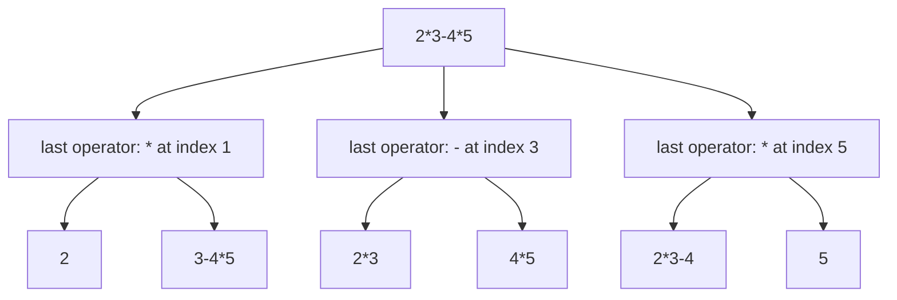

# Divide And Conquer

**Divide and conquer** is a way of building an algorithm out of three moves, and
the name lists two of them while hiding the one that matters

- **Divide** the input into pieces that do not overlap, usually two of them
- **Conquer** each piece by calling the same function on it, all the way down to a
  piece small enough to answer outright
- **Combine** the piece answers into the answer for the whole thing

Recursion on [trees](../../07_trees/notes/02_dfs.md) already had this shape, but
there the combine step was almost always one line, such as
`1 + max(left, right)`. Here the combine is where the algorithm lives. Everything
interesting about merge sort happens in the merge, not in the splitting, and the
same is true of every problem in this topic. When you are asked what the
divide-and-conquer idea is, the useful answer describes the combine

That also gives you the boundary against
[dynamic programming](../../11_dp/notes/01_dp_fundamentals.md). DP exists because
subproblems **overlap**, so you cache each answer and read it back many times.
Divide and conquer assumes the pieces are **independent**, so each answer is
produced once, used once by its parent, and thrown away. Merge sort splitting
`[5, 2, 8, 1]` into `[5, 2]` and `[8, 1]` gives two halves that share nothing, and
a cache would sit there and never get a hit

The reason to reach for it is that the combine can exploit something the divide
step handed you for free. Merging two halves that are *already sorted* costs
`O(n)`, whereas sorting `n` values from scratch costs `O(n log n)`. That gap
between "combine on structured input" and "solve from scratch" is the entire
payoff, and when a problem has no such gap, divide and conquer buys you nothing

## Reading The Cost Off The Split

Before any specific problem, you need to be able to look at a split and say what
it costs, because that is the sentence an interviewer expects the moment you say
the words "divide and conquer"

Write the recurrence in the standard shape, where solving a problem of size `n`
means solving `a` pieces of size `n / b` and then doing `O(n^d)` work to combine
them

```text
T(n) = a * T(n / b) + O(n^d)
```

You do not need to memorize a theorem to read this. Count the work level by
level. At depth `i` there are `a^i` pieces, each of size `n / b^i`, so that level
does `a^i * (n / b^i)^d = n^d * (a / b^d)^i` work in total. Every level is the
previous one multiplied by `a / b^d`, so that single ratio decides everything

| What `a / b^d` does                | Where the work piles up                                                 | Total                                                                    |
| ---------------------------------- | ----------------------------------------------------------------------- | ------------------------------------------------------------------------ |
| less than 1, so levels shrink      | the top level, since each level is a fraction of the one above          | `O(n^d)`, the cost of the single outermost combine                       |
| exactly 1, so every level is equal | nowhere, since all `log_b n` levels cost the same `O(n^d)`              | `O(n^d log n)`, which is where merge sort's `log` factor comes from      |
| more than 1, so levels grow        | the bottom, since the number of leaves outruns the shrinking piece size | `O(n^(log_b a))`, the leaf count, and the combine stops mattering at all |

Merge sort splits into two halves and merges in linear time, so `a = 2`, `b = 2`,
`d = 1`, and the ratio `2 / 2^1` is exactly 1, giving `O(n log n)`.
[Binary search](../../05_binary_search/notes/01_binary_search_basics.md) is the
degenerate case where `a = 1` because only one half is ever solved, and `d = 0`
because there is nothing to combine, so the ratio is again 1 and the total is
`O(n^0 log n) = O(log n)`

> "Two halves and a linear merge is `T(n) = 2T(n/2) + O(n)`, and every level of
> that recursion does the same `O(n)` work across `log n` levels, so it is
> `O(n log n)`"

The one thing the shape above cannot express is a combine that is itself
superlinear, such as sorting inside the combine step. Then each of the `log n`
levels costs `O(n log n)` and the total is `O(n log² n)`, which is exactly what
happens in Closest Pair Of Points below

## Why The Better Half Is Not The Answer

[Maximum Subarray](https://leetcode.com/problems/maximum-subarray/) asks for the
largest sum obtainable from a contiguous run of an integer array. You already
have [Kadane's algorithm](../../01_arrays_and_hashing/notes/04_kadanes_algorithm.md)
for it, which is `O(n)` and strictly better. It is still the right problem to
derive divide and conquer on, because the way the obvious split fails is the
clearest illustration in the book of what a combine step is for

Cut the array down the middle and recurse on both halves. That much is free. The
tempting next line is that the answer for the whole array is whichever half
answer is bigger

```text
index    0    1    2    3    4    5
value   -2    3   -1    4   -5    2
             ^^^^^^^^^^^^^
             the actual best run, sum 6

        [ -2   3  -1 ] [  4  -5   2 ]
          best = 3       best = 4
```

The left half's best run is `[3]` summing to 3, and the right half's best run is
`[4]` summing to 4, so this rule reports 4. The true answer is 6, from
`[3, -1, 4]`, and no recursive call ever saw that run because it lies in neither
half. It **straddles the cut**

The failure tells you exactly what is missing. Any contiguous run is in exactly
one of three situations, and the recursion only covered two of them

- It ends before the midpoint, so it lives entirely in the left half
- It starts after the midpoint, so it lives entirely in the right half
- It contains both the midpoint and the position after it, so it crosses

The third case is the combine step, and it is cheap for a reason the divide step
handed you. A crossing run is pinned: it must include the midpoint, so its left
part is some suffix ending at `mid` and its right part is some prefix starting at
`mid + 1`, and those two choices are independent. Walk left from the midpoint
keeping a running sum and remember the best you ever saw, walk right the same way,
and add the two bests. That is `O(n)` for the whole crossing case instead of
checking every pair of endpoints

> "The best subarray either sits inside the left half, sits inside the right half,
> or crosses the midpoint. Those three cases are disjoint and cover everything, so
> I take the maximum of the three. The crossing one I can get in linear time
> because it has to touch the midpoint"

```python
from math import inf


def max_sub_array(nums: list[int]) -> int:
    def solve(lo: int, hi: int) -> int:
        if lo == hi:
            return nums[lo]

        mid = (lo + hi) // 2
        left_best = solve(lo, mid)
        right_best = solve(mid + 1, hi)

        running, left_edge = 0, -inf
        for i in range(mid, lo - 1, -1):
            running += nums[i]
            left_edge = max(left_edge, running)

        running, right_edge = 0, -inf
        for i in range(mid + 1, hi + 1):
            running += nums[i]
            right_edge = max(right_edge, running)

        return max(left_best, right_best, left_edge + right_edge)

    return solve(0, len(nums) - 1)


assert max_sub_array([-2, 3, -1, 4, -5, 2]) == 6
assert max_sub_array([-2, 1, -3, 4, -1, 2, 1, -5, 4]) == 6
assert max_sub_array([5, 4, -1, 7, 8]) == 23
assert max_sub_array([-3, -1, -7]) == -1
assert max_sub_array([-3]) == -3
```

**The lines people get wrong**:

- `if lo == hi: return nums[lo]` is the base case, and it returns a **single
  element rather than 0**, because a run of length zero is not allowed and seeding
  with 0 would report 0 on an all-negative array
  - The `[-3, -1, -7]` assert is the one that catches this, and it is the input an
    interviewer reaches for first
- `left_edge` and `right_edge` start at `-inf`, not at 0, for the same reason. The
  crossing run has to contain both sides of the cut, so neither walk is allowed to
  contribute nothing
- The left walk runs `range(mid, lo - 1, -1)`, meaning it starts **at** `mid` and
  moves outward, since every candidate suffix ends at the midpoint by definition
- The two walks are added, never `max`ed, because a crossing run is one suffix
  followed by one prefix and it pays for both

## Dry Run: Maximum Subarray On Six Numbers

Take `nums = [-2, 3, -1, 4, -5, 2]`, and follow the calls in the order they
return. `left` and `right` are the two recursive answers, `cross` is the sum of
the two outward walks

```text
solve(0,0)  base                                                        -> -2
solve(1,1)  base                                                        ->  3
solve(0,1)  mid=0  left=-2  right=3   walks [-2] and [3]     cross=1    ->  3
solve(2,2)  base                                                        -> -1
solve(0,2)  mid=1  left=3   right=-1  walks [3,1] and [-1]   cross=2    ->  3
solve(3,3)  base                                                        ->  4
solve(4,4)  base                                                        -> -5
solve(3,4)  mid=3  left=4   right=-5  walks [4] and [-5]     cross=-1   ->  4
solve(5,5)  base                                                        ->  2
solve(3,5)  mid=4  left=4   right=2   walks [-5,-1] and [2]  cross=1    ->  4
solve(0,5)  mid=2  left=3   right=4   walks [-1,2,0] and [4,-1,1]  cross=6  -> 6
```

The bracketed lists are the running sums as each walk moves outward from the cut,
so the best of each walk is its maximum

**Two candidates were generated and thrown away in the final call, and both
matter**:

- The walk leftward from index 2 produced the running sums `-1`, then `2`, then
  `0`. That last value is the suffix `[-2, 3, -1]` reaching all the way to the
  start of the array, and it is **discarded** because `2` was better. Extending
  further is not automatically better, which is precisely why the walk tracks a
  maximum instead of just taking the full-length sum
- The two half answers, 3 and 4, are both **rejected** by the final `max`. If the
  combine step did not exist this function would return 4 and be wrong on a
  six-element array, which is the whole argument for the combine step in one line

Notice also that `solve(3,5)` computed `cross = 1` and rejected it in favour of
its left child's answer of 4. Crossing does not win at every level, and a combine
that only ever won would mean the recursion was doing nothing

## Cutting Where The Structure Says To

Splitting an array at its midpoint is the version everyone learns, and it is the
version that shows up least often in interview problems. The real skill is
spotting **what the input can be cut along**, because divide and conquer only
needs the pieces to be independent, not equal in size

Four cut lines cover the whole problem set for this topic

- **By position**, cutting an array or a list of buildings in half, which is
  Maximum Subarray above and The Skyline Problem below. Balanced halves, so
  `log n` levels
- **By a chosen operator**, cutting an arithmetic expression at each `+`, `-` or
  `*` in turn, which is Different Ways To Add Parentheses. Every operator is a
  legal cut, so the branching factor is the number of operators rather than 2
- **By a coordinate**, cutting a set of points at the median `x` value, which is
  Closest Pair Of Points. Geometry supplies the cut, and it is what makes the
  combine step cheap
- **By parity**, splitting the numbers `1..n` into the odd ones and the even ones,
  which is Beautiful Array. Nothing about the input suggests this cut, and the
  property being constructed does

The last two are the ones that are hard to see cold. The tell is that the
**combine step needs a guarantee**, and you pick the cut that provides it. Closest
Pair needs to know that a left point and a right point are far apart in `x`, so it
cuts on `x`. Beautiful Array needs to know that a sum from opposite sides is odd,
so it cuts on parity. Choose the cut for what it gives the combine, not for what
looks tidy

## Merging Two Skylines

[The Skyline Problem](https://leetcode.com/problems/the-skyline-problem/) gives
you rectangular buildings as `[left, right, height]` and asks for the outline
their silhouette makes, written as the list of points where the outline's height
changes

One building on its own is trivially its own skyline, going up at `left` and back
to 0 at `right`. So cut the building list in half, get each half's skyline
recursively, and the entire problem becomes merging two finished skylines. That is
the combine, and it is structurally the merge from merge sort with one change:
instead of picking the smaller of two values, you take the **taller of two current
heights**

```python
def merge_skylines(a: list[list[int]], b: list[list[int]]) -> list[list[int]]:
    merged: list[list[int]] = []
    i = j = 0
    height_a = height_b = 0
    while i < len(a) or j < len(b):
        if j == len(b):
            x = a[i][0]
        elif i == len(a):
            x = b[j][0]
        else:
            x = min(a[i][0], b[j][0])
        while i < len(a) and a[i][0] == x:
            height_a = a[i][1]
            i += 1
        while j < len(b) and b[j][0] == x:
            height_b = b[j][1]
            j += 1
        tallest = max(height_a, height_b)
        if not merged or merged[-1][1] != tallest:
            merged.append([x, tallest])
    return merged


def get_skyline(buildings: list[list[int]]) -> list[list[int]]:
    if not buildings:
        return []
    if len(buildings) == 1:
        left, right, height = buildings[0]
        return [[left, height], [right, 0]]
    mid = len(buildings) // 2
    return merge_skylines(get_skyline(buildings[:mid]), get_skyline(buildings[mid:]))


assert get_skyline([[2, 9, 10], [3, 7, 15], [5, 12, 12], [15, 20, 10], [19, 24, 8]]) == [
    [2, 10], [3, 15], [7, 12], [12, 0], [15, 10], [20, 8], [24, 0],
]
assert get_skyline([[0, 2, 3], [2, 5, 3]]) == [[0, 3], [5, 0]]
assert get_skyline([[1, 4, 7]]) == [[1, 7], [4, 0]]
assert get_skyline([]) == []
```

**Three decisions carry this merge**:

- `height_a` and `height_b` are the **current** height of each input skyline, held
  outside the loop and only updated when that skyline has a point at the `x` being
  processed. A skyline point means "from here onward I am this tall", so the value
  has to persist across iterations where the other side is the one moving
- Both inner `while` loops run at the same `x` before any output is produced,
  which is how **ties** are handled. If both skylines change height at the same
  coordinate, computing the maximum after only one of them updated would emit a
  point at a height that never existed
- `if not merged or merged[-1][1] != tallest` suppresses any point that does not
  actually change the outline. Without it a building hidden behind a taller one
  emits ghost points at its own corners, and the output fails on equality even
  though the picture is right

The recursion also needs `height_a` and `height_b` to start at 0 and the
single-building case to end with `[right, 0]`, because a skyline's last point is
always a return to ground level, and that is what makes the exhausted-list side
contribute nothing once its points run out

**A trace where the combine rejects things.** Merge the skyline of a building at
`[2, 9, 10]`, which is `[[2, 10], [9, 0]]`, with a shorter one at `[3, 6, 7]`,
which is `[[3, 7], [6, 0]]`

```text
x=2   height_a=10  height_b=0   tallest=10   EMIT     [2, 10]
x=3   height_a=10  height_b=7   tallest=10   SUPPRESS (7 is hidden behind 10)
x=6   height_a=10  height_b=0   tallest=10   SUPPRESS (nothing changed on the outline)
x=9   height_a=0   height_b=0   tallest=0    EMIT     [9, 0]
```

The result is `[[2, 10], [9, 0]]`, the taller building alone. The short building
contributed two candidate points and both were suppressed, which is correct
because it is entirely swallowed. Only when the second building is *taller*, say
`[3, 7, 15]`, do those coordinates survive, giving
`[[2, 10], [3, 15], [7, 10], [9, 0]]` where `[7, 10]` is a point neither input
skyline contained

## The Strip That Makes Closest Pair Fast

**Closest Pair Of Points** asks for the smallest Euclidean distance between any
two of `n` points on a plane. Checking every pair is `O(n²)`, and the reason this
problem is famous is that divide and conquer gets it under that

Sort the points by `x` and cut at the median, giving a left set and a right set
separated by a vertical line. Recurse on each side and let `d` be the smaller of
the two answers. The combine step has to consider pairs with one point on each
side, and there are `n²/4` such pairs, so doing it naively would erase the whole
benefit

The saving comes from `d` itself. Any cross pair closer than `d` must have both
its points within horizontal distance `d` of the dividing line, since a point
further out is already more than `d` away from anything on the other side. That
narrows the candidates to a **strip** around the cut

```text
                  |<-- d -->|<-- d -->|
      left        |         |         |        right
        .         |    .    |         |
                  |         |    .    |     .
        .         |         |         |
                  |    .    |    .    |
                  |         |         |
                          split_x
```

The strip can still hold every point, so one more observation is needed. Sort the
strip by `y`. Two points in the strip that are more than `d` apart vertically
cannot beat `d`, so once you scan upward from a point and hit a `y` gap of `d`,
you can stop. The number of points you examine before that happens is bounded by a
constant, because a `d`-by-`2d` box can hold only a few points that are all
pairwise at least `d` apart. Each point therefore compares against a fixed handful
of neighbours rather than the whole strip

```python
from math import inf


def closest_pair(points: list[list[int]]) -> float:
    def dist(p: list[int], q: list[int]) -> float:
        return ((p[0] - q[0]) ** 2 + (p[1] - q[1]) ** 2) ** 0.5

    def solve(pts: list[list[int]]) -> float:
        n = len(pts)
        if n <= 3:
            return min(
                (dist(pts[i], pts[j]) for i in range(n) for j in range(i + 1, n)),
                default=inf,
            )
        mid = n // 2
        split_x = pts[mid][0]
        best = min(solve(pts[:mid]), solve(pts[mid:]))
        strip = sorted((p for p in pts if abs(p[0] - split_x) < best),
                       key=lambda p: p[1])
        for i in range(len(strip)):
            for j in range(i + 1, len(strip)):
                if strip[j][1] - strip[i][1] >= best:
                    break
                best = min(best, dist(strip[i], strip[j]))
        return best

    return solve(sorted(points))


assert closest_pair([[0, 0], [3, 4]]) == 5.0
assert closest_pair([[0, 0], [1, 1], [4, 4], [7, 7], [8, 9]]) == 2 ** 0.5
assert closest_pair([[2, 2], [2, 2]]) == 0.0
assert closest_pair([[1, 1]]) == inf
```

**What the two loop guards are doing**:

- `if strip[j][1] - strip[i][1] >= best: break` is the entire complexity argument
  written as one line. Delete it and the strip scan becomes `O(n²)` on an input
  where every point lands in the strip, which is what happens when all the points
  share an `x` coordinate
- `best` is updated **inside** the scan rather than after it, which only ever
  tightens the cutoff and makes the `break` fire sooner, so it is safe as well as
  faster
- The base case handles `n <= 3` by brute force with `default=inf`, so a group
  that ends up holding one point returns infinity and never wins a `min`. That is
  the degenerate case the single-point assert pins down

This version re-sorts the strip by `y` at every node, which costs `O(n log n)` per
level and gives `O(n log² n)` overall. The textbook `O(n log n)` version threads a
`y`-sorted copy of the points down through the recursion so the strip comes out
sorted for free. Saying that out loud is usually enough, and writing it is rarely
worth the interview minutes

## Building The Answer Instead Of Searching For It

[Beautiful Array](https://leetcode.com/problems/beautiful-array/) asks for any
permutation of `1..n` with no index triple `i < k < j` where
`A[i] + A[j] == 2 * A[k]`, meaning no element is ever the exact average of one
element to its left and one to its right

Nothing here is being searched or minimized, so there is no half of the input to
solve and no maximum to take. Divide and conquer still applies, and it runs in the
other direction: instead of splitting a given input, you split the **output** into
two parts whose combination cannot violate the property

The forbidden equation is `A[i] + A[j] == 2 * A[k]`, and its right side is always
even. So if you put every odd number first and every even number second, any
triple whose `i` and `j` land on opposite sides of that boundary has an odd left
value plus an even right value, giving an odd sum, which can never equal an even
number. Every cross-boundary triple is dead on arrival, for free

That leaves triples living entirely inside the odd block or entirely inside the
even block, so those two blocks need to be beautiful on their own. Here the second
ingredient arrives. If `A` is beautiful then so is `[c * x + e for x in A]` for any
non-zero `c`, because the equation `A[i] + A[j] == 2 * A[k]` survives and fails
identically under that mapping. The odd numbers `1, 3, 5, ...` are exactly
`2 * x - 1` over `x` in `1..ceil(n / 2)`, and the evens are `2 * x` over `x` in
`1..floor(n / 2)`, so both blocks are affine images of smaller beautiful arrays,
which you build with the same function

```python
def beautiful_array(n: int) -> list[int]:
    memo: dict[int, list[int]] = {1: [1]}

    def build(k: int) -> list[int]:
        if k not in memo:
            odds = [2 * x - 1 for x in build((k + 1) // 2)]
            evens = [2 * x for x in build(k // 2)]
            memo[k] = odds + evens
        return memo[k]

    return build(n)


def is_beautiful(a: list[int]) -> bool:
    n = len(a)
    return all(
        a[i] + a[j] != 2 * a[k]
        for i in range(n)
        for k in range(i + 1, n)
        for j in range(k + 1, n)
    )


assert beautiful_array(1) == [1]
assert beautiful_array(4) == [1, 3, 2, 4]
assert beautiful_array(9) == [1, 9, 5, 3, 7, 2, 6, 4, 8]
assert sorted(beautiful_array(9)) == list(range(1, 10))
assert is_beautiful(beautiful_array(9))
assert all(is_beautiful(beautiful_array(k)) for k in range(1, 30))
```

`(k + 1) // 2` and `k // 2` are ceiling and floor of a half, and they have to be
that way round because the odd numbers in `1..k` outnumber the evens when `k` is
odd. Get them backwards and the two blocks no longer cover `1..k` exactly. The
`memo` is not required for correctness, and it is worth keeping because `build`
would otherwise recompute the same two sizes at every level

This is also the one place in this topic where a cache appears, which is worth
naming out loud so nobody thinks the DP boundary moved. The pieces here are still
independent, and the memo is only removing repeated calls at identical sizes, not
storing a table of states that get read back in different combinations

## When One Side Can Be Thrown Away

There is a degenerate branch of this paradigm where the divide step is followed by
solving only **one** of the pieces, which people call **decrease and conquer**. You
already know it well:
[binary search](../../05_binary_search/notes/01_binary_search_basics.md) halves the
candidate region and recurses into a single half, with no combine step at all,
which is why its recurrence is `T(n) = T(n/2) + O(1)` and its cost is `O(log n)`
rather than `O(n log n)`

The reason to have the name is recognition. If you can prove the answer cannot be
in one of the pieces, you throw that piece away and the `a` in the recurrence drops
to 1, which is worth an entire logarithmic factor.
[Median Of Two Sorted Arrays](https://leetcode.com/problems/median-of-two-sorted-arrays/)
in this module's ladder is that idea applied to a partition point, and it is worked
in full under
[search on the answer](../../05_binary_search/notes/04_search_on_answer.md)

## Worked Example: [Different Ways To Add Parentheses](https://leetcode.com/problems/different-ways-to-add-parentheses/)

Given a string holding numbers and the operators `+`, `-` and `*`, return every
value the expression can evaluate to under some way of parenthesizing it. Order
does not matter, and repeated values are kept

**Input**: `expression`, a `str` made only of digits and the characters `+`, `-`
and `*`, holding at least one number and containing no spaces or brackets

**Output**: a `list[int]` holding one value per distinct parenthesization of the
expression, in any order. Two different groupings that happen to evaluate to the
same number both appear, so the list can contain duplicates, and for an expression
with no operator at all it holds the single number itself

**The approach.** The phrase that identifies the technique is "all the different
ways to group", because a grouping of an arithmetic expression is a binary tree
and building all binary trees is a split at every legal position. The naive
version is to generate every bracketing as a string and evaluate each one, which
means writing a parser and doing the evaluation work from scratch for each of an
exponential number of strings, when almost all of them share their sub-results

The idea is to ask, for each operator, what happens if **that** operator is the
last one applied. Everything to its left is one fully-parenthesized subexpression,
everything to its right is another, and the two sides are independent. Recurse on
both, then combine every value from the left with every value from the right under
that operator. Every parenthesization has exactly one last operator, so looping
over operators covers each grouping once and never twice



> "Every way of parenthesizing has exactly one operator that gets applied last, so
> I will loop over the operators, treat each one as the last, recursively get all
> the values of the left and right substrings, and combine every pair. A substring
> with no operator in it is just its own number, and that is my base case"

Therefore,

1. Check whether the string contains an operator at all. If `expression.isdigit()`
   is true it is a bare number, so return a one-element list holding it. This is
   the base case, and it must return a **list** rather than an integer because
   every caller expects something it can iterate over
2. Start an empty `results` list. This will collect one value per parenthesization,
   duplicates included, since the problem asks for values rather than a set
3. Walk the string index by index and skip anything that is not `+`, `-` or `*`.
   Digits are not split points, and a multi-digit number must never be cut in the
   middle
4. At each operator, recurse on `expression[:i]` for everything before it and on
   `expression[i + 1:]` for everything after. Both slices are guaranteed
   non-empty and syntactically valid, because an operator always sits between two
   numbers
5. Take the Cartesian product of the two returned lists and apply the current
   operator to each pair, appending every result. This is the combine step, and it
   is a double loop rather than one pass because the left choice and the right
   choice are independent of each other
6. Return `results` after all operators have been tried. Nothing is sorted and
   nothing is deduplicated, since two different groupings that agree on a value are
   two different answers

```python
def diff_ways_to_compute(expression: str) -> list[int]:
    if expression.isdigit():
        return [int(expression)]

    results: list[int] = []
    for i, ch in enumerate(expression):
        if ch not in "+-*":
            continue
        for left in diff_ways_to_compute(expression[:i]):
            for right in diff_ways_to_compute(expression[i + 1:]):
                if ch == "+":
                    results.append(left + right)
                elif ch == "-":
                    results.append(left - right)
                else:
                    results.append(left * right)
    return results


assert sorted(diff_ways_to_compute("2-1-1")) == [0, 2]
assert sorted(diff_ways_to_compute("2*3-4*5")) == [-34, -14, -10, -10, 10]
assert diff_ways_to_compute("11") == [11]
```

Running `"2*3-4*5"` returns `[-34, -10, -14, -10, 10]`. The value `-10` appears
twice, from `(2*(3-4))*5` and from `2*((3-4)*5)`, which are genuinely different
groupings, and dropping one of them fails the problem

**Time**: `O(n · C_m)` where `n` is the length of the string and `m` is the number
of operators, and `C_m` is the `m`-th **Catalan number**, which counts the ways to
parenthesize `m` binary operators and grows roughly like `4^m`. Every one of those
groupings produces exactly one appended value, and the string slicing at each call
adds a factor of the string length on top

**Space**: `O(n · C_m)` as well, because the returned lists across all live calls
hold that many integers at once, plus `O(m)` stack depth since each recursive call
consumes at least one operator and the string cannot be split more times than it
has operators

The interesting follow-up is memoizing on the substring. Contiguous
subexpressions do recur across different split points, so a cache keyed by the
substring collapses the recomputation to `O(m²)` distinct subproblems, and the
answer still takes exponential time because the output itself is exponentially
long. That is a good line to volunteer, since it shows you know the difference
between the recursion being wasteful and the answer simply being big

## Time and Space Complexity

**Maximum Subarray**, where `n` is the length of the array

| Approach                                                            | Time                                                                                                                      | Space                                                                                                          |
| ------------------------------------------------------------------- | ------------------------------------------------------------------------------------------------------------------------- | -------------------------------------------------------------------------------------------------------------- |
| Divide and conquer                                                  | `O(n log n)`: `T(n) = 2T(n/2) + O(n)`, since the two outward walks touch every index once per level across `log n` levels | `O(log n)`: nothing is allocated, so only the recursion stack costs anything, and it is as deep as the halving |
| [Kadane](../../01_arrays_and_hashing/notes/04_kadanes_algorithm.md) | `O(n)`: one pass carrying an extend-or-restart running best, with no recursion at all                                     | `O(1)`: two integers, which is why this is the answer you would actually give                                  |

**The Skyline Problem**, where `n` is the number of buildings

| Approach                                | Time                                                                                                                        | Space                                                                                                              |
| --------------------------------------- | --------------------------------------------------------------------------------------------------------------------------- | ------------------------------------------------------------------------------------------------------------------ |
| Divide and conquer with a merge         | `O(n log n)`: `T(n) = 2T(n/2) + O(n)`, since merging two skylines walks each once and each holds `O(n)` points              | `O(n)`: the merged output at the top level dominates, and the slices plus `O(log n)` stack frames stay inside that |
| Scanning every building at every corner | `O(n²)`: there are `2n` corner coordinates and each one is tested against all `n` buildings to find the tallest covering it | `O(n)`: only the output list, since no auxiliary structure is built                                                |

**Closest Pair Of Points**, where `n` is the number of points

| Approach                                    | Time                                                                                                                                          | Space                                                                        |
| ------------------------------------------- | --------------------------------------------------------------------------------------------------------------------------------------------- | ---------------------------------------------------------------------------- |
| Divide and conquer, strip re-sorted         | `O(n log² n)`: `T(n) = 2T(n/2) + O(n log n)`, since sorting the strip by `y` at every node makes each of the `log n` levels cost `O(n log n)` | `O(n)`: the sliced halves and the strip copy, plus `O(log n)` stack frames   |
| Divide and conquer, `y` order threaded down | `O(n log n)`: one `O(n log n)` sort up front, after which every combine is a linear scan of an already-`y`-sorted strip                       | `O(n)`: the same copies, since threading the order down does not remove them |
| Every pair                                  | `O(n²)`: there are `n(n-1)/2` pairs and each is measured once                                                                                 | `O(1)`: one running minimum and nothing else                                 |

**Beautiful Array**, where `n` is the length of the permutation being built

| Approach                         | Time                                                                                                                                                                  | Space                                                                                                      |
| -------------------------------- | --------------------------------------------------------------------------------------------------------------------------------------------------------------------- | ---------------------------------------------------------------------------------------------------------- |
| Recursive construction with memo | `O(n)`: each halving level reaches at most two distinct sizes near `n / 2^i`, and the work at a size is proportional to it, so the levels sum geometrically to `O(n)` | `O(n)`: the memo holds one list per reachable size and those sizes also sum geometrically to `O(n)` values |
| Searching permutations of `1..n` | `O(n!)` at best: that is simply how many candidate orderings exist, before any check is run on one                                                                    | `O(n)`: one candidate ordering plus the recursion stack, which is not what makes this approach unusable    |

## Summary

- **Divide and conquer** splits an input into non-overlapping pieces, solves each
  piece with the same function, and then **combines** the piece answers into the
  whole answer. The divide is usually obvious and the combine is where the
  algorithm actually lives, so when you describe the approach out loud, describe
  the combine
  - The paradigm pays off only when the combine can exploit something the divide
    handed it, the way merging two already-sorted halves costs `O(n)` while
    sorting from scratch costs `O(n log n)`
- It is not [dynamic programming](../../11_dp/notes/01_dp_fundamentals.md), because
  DP exists to serve **overlapping** subproblems out of a cache, whereas here each
  piece answer is produced once, consumed by its parent, and discarded. Reaching
  for divide and conquer on genuinely overlapping subproblems means redoing the
  same work exponentially many times
  - Beautiful Array's `memo` is the near-miss. It removes repeated calls at
    identical sizes rather than storing a table read back in many combinations, so
    it is caching, not DP
- Write the recurrence as `T(n) = a * T(n / b) + O(n^d)` and read the cost off the
  single ratio `a / b^d`, because level `i` costs `n^d * (a / b^d)^i`
  - Below 1 the top level dominates and the total is `O(n^d)`, exactly 1 makes all
    `log_b n` levels equal for `O(n^d log n)`, and above 1 the leaves dominate for
    `O(n^(log_b a))`
  - Two halves plus a linear merge gives a ratio of exactly 1 and therefore
    `O(n log n)`, which is the recurrence to have memorized because it covers merge
    sort, Maximum Subarray and The Skyline Problem
  - A combine that itself sorts falls outside that shape, giving `O(n log² n)`
- The idea that almost works on Maximum Subarray is taking the better of the two
  half answers, and it fails because the best run can **straddle the cut** and be
  invisible to both recursive calls. The repair is a third case for crossing runs,
  found by walking outward from the midpoint in both directions and adding the two
  best walks, which is `O(n)` because a crossing run is pinned to the midpoint
  - Both walks must start at `-inf` rather than 0, since a crossing run has to
    contain something from each side, and the base case returns a single element so
    an all-negative array does not report 0
- Cutting an array in half is the least common version of this in interviews. Look
  for what the input can be cut **along**, choosing the cut for what it hands the
  combine
  - Cut by position for arrays and building lists, by a chosen operator for
    expressions, by median `x` coordinate for points on a plane, and by parity when
    you are constructing an answer rather than finding one
- The skyline combine is merge sort's merge with `max` of two current heights in
  place of "take the smaller value". Each side's height persists between
  iterations, ties at the same `x` are consumed together before any output, and a
  point is emitted only when the outline's height actually changes, which is what
  hides a building standing behind a taller one
- Closest Pair beats `O(n²)` by cutting at the median `x`, recursing, and then only
  examining points within the winning distance `d` of the dividing line, sorted by
  `y` so that a vertical gap of `d` ends the scan. Each point compares against a
  constant number of neighbours because a `d`-by-`2d` box cannot hold many points
  that are all `d` apart
  - Re-sorting the strip at every node gives `O(n log² n)`, and threading a
    `y`-sorted copy down the recursion gives `O(n log n)`, which is usually enough
    to describe rather than write
- **Decrease and conquer** is the case where you prove the answer cannot lie in one
  piece and throw that piece away, so `a` drops to 1 and you save a whole
  logarithmic factor. That is
  [binary search](../../05_binary_search/notes/01_binary_search_basics.md), and it
  is why Median Of Two Sorted Arrays belongs to that family rather than to the
  merging one
- Different Ways To Add Parentheses splits at every operator in turn on the
  argument that each parenthesization has exactly one operator applied last, which
  covers every grouping once. It stays exponential after memoizing on the
  substring, because the returned list itself is Catalan-sized, and that
  distinction between a wasteful recursion and a genuinely large answer is worth
  saying out loud

## Interview Checklist

Before writing code, make sure you can answer each of these

```text
What are the pieces, and are they genuinely independent, or do they overlap enough that this is DP?
What am I cutting along: position, an operator, a coordinate, or a property of the output?
Did I pick that cut for what it guarantees the combine step, and can I say what that guarantee is?
What exactly does the combine do, and is it cheaper than solving the whole thing from scratch?
Is there an answer that straddles the cut, and does my combine step find it?
What is the base case, does every recursive call shrink toward it, and does a size-one piece work?
What is T(n) = a*T(n/b) + O(n^d) here, and what does the ratio a / b^d make the total?
Can I throw one piece away instead of solving it, which would drop a whole log factor?
Does my combine accidentally cost as much as brute force, erasing the split?
Is the recursion depth log n, or can it degrade to n on a bad split?
Is there a linear algorithm I already know, such as Kadane, that beats this?
```
