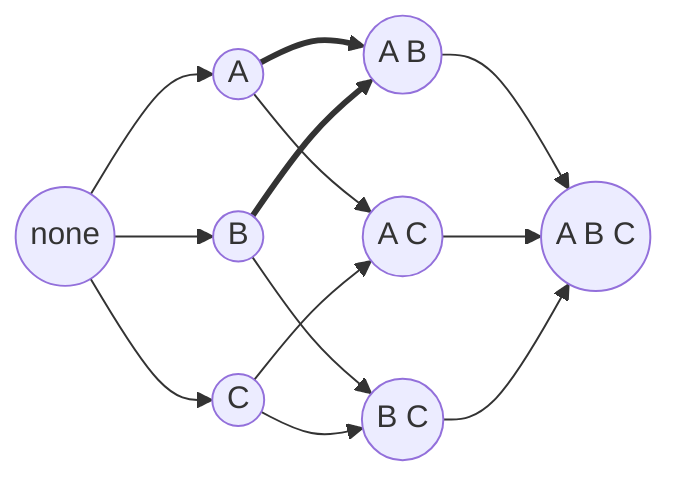

# Bitmask DP

Every dynamic programming table so far has been indexed by a **position**: an
index into an array, a pair of prefix lengths, a row and a column, a remaining
capacity. **Bitmask DP** indexes the table by a **set** instead. One entry of
`dp` holds the answer for one particular subset of the input, so `dp[mask]`
answers a question shaped like "what is the cheapest way to have finished
*exactly these* four jobs, in any order"

A set cannot index a Python list, but a small collection of yes/no answers packs
into a single integer, and an integer can. That integer is a **bitmask**: bit `i`
is 1 when item `i` is in the set and 0 when it is not, so a subset of `n` items
is exactly one number between `0` and `2^n - 1`

```text
item         C    B    A
bit          2    1    0

mask 0b101   1    0    1     the set {A, C}
mask 0b000   0    0    0     the empty set, which is where the table starts
mask 0b111   1    1    1     every item, which is (1 << 3) - 1
```

Two earlier pieces of the book meet here. You have
[set, cleared, and tested single bits](../../15_bit_manipulation/notes/02_masks.md)
and [walked all `2^n` masks](../../15_bit_manipulation/notes/04_subset_masks.md),
and you have written [dp tables](../../11_dp/notes/01_dp_fundamentals.md) with a
state, a transition, and a base case. Bitmask DP is those two glued together, and
the glue is the only new idea: the subsets stop being things you look at
independently and become **states that feed each other**, with `dp` at a large
mask computed from `dp` at the smaller masks inside it

> This topic covers when a set is the entire state, how a plain upward loop turns
> out to be a legal fill order, the second dimension you sometimes need beside
> the mask, and how to walk only the subsets of a mask instead of all `2^n`

## Where The Set Of Finished Items Is The Whole State

The loudest signal is in the constraints. When a problem caps its input at
something tiny and oddly specific, like `n <= 14` or `n <= 16` or `n <= 20`, that
bound is not there for the sake of small test files. It is there because the
intended solution is exponential in `n`, and `2^n` is the exponential that fits:
`2^20` is 1,048,576 states, which is comfortable, while `2^25` is 33,554,432 and
is not

Two more signals come with it:

- The problem asks you to **use every item exactly once**, or **cover every
  requirement**, phrased as assign every job, seat every student, visit every
  city, or complete every course
- Two different ways of arriving at the same set of finished items leave you
  facing **the same remaining problem**, so nothing about the order you got there
  survives into the future

That second one is the real condition, and it is worth checking explicitly rather
than assuming. It is
[overlapping subproblems](../../11_dp/notes/01_dp_fundamentals.md) stated for
sets instead of positions

Three things look like this and are not:

- If `n` is 100 or unbounded, `2^n` is not a table you can allocate, so the
  problem wants greedy, flow, or a dp indexed by an ordinary position
- If the future genuinely depends on more than the set, such as which item you
  touched last, the mask alone is under-informed and you need a second dimension
  beside it
- If you scan every subset once, in isolation, and never read one subset's answer
  while computing another's, there is no dp table at all and you are doing
  [plain subset enumeration](../../15_bit_manipulation/notes/04_subset_masks.md)

## Why Every Ordering Collapses Onto A Subset

Take the standard shape: `n` workers, `n` jobs, and a cost matrix where
`cost[i][j]` is what it costs to give job `j` to worker `i`. Every worker takes
exactly one job and every job goes to exactly one worker, and you want the
cheapest total

The natural first idea is to try every way of handing the jobs out. Give worker 0
one of the `n` jobs, give worker 1 one of the `n - 1` that are left, and keep
going. That is correct, and it enumerates `n!` complete assignments, which is
479,001,600 of them at `n = 12`, so it is unusable at exactly the input size
these problems are written for

Now look at what those `n!` branches actually contain. Suppose worker 0 takes job
A and worker 1 takes job B. Suppose instead worker 0 takes job B and worker 1
takes job A. **The two branches have spent different amounts of money, but they
face an identical remaining problem**, because the jobs still available are the
same two, and the workers still waiting are the same ones. Whatever the cheapest
completion of the rest costs, it costs that in both branches



The two bold arrows are the collision. `A` then `B` and `B` then `A` are separate
paths in the `n!` search, and they arrive at the same node. The tree of `n!`
leaves is really this graph of `2^n` nodes, drawn out once per path that reaches
it, and at `n = 12` that is 4,096 distinct nodes standing in for 479 million
paths

> "Two orders that have assigned the same set of jobs are the same subproblem,
> because the workers left over and the jobs left over are identical. So my state
> is the set of jobs already assigned, not the sequence I assigned them in."

Recognizing that the state is a set is the whole insight, and everything after it
is bookkeeping. You could key a memo dictionary on a `frozenset` and be correct.
An integer carries the same information in one machine word, hashes for free, and
indexes a flat list directly, which is why the table is a list of `2^n` numbers
rather than a dictionary of sets

## Adding An Item Always Makes The Number Bigger

Two facts about masks carry the rest of this topic, and only the second one is
new

```python
def chosen(items: list[str], mask: int) -> list[str]:
    return [items[i] for i in range(len(items)) if mask >> i & 1]


items = ["a", "b", "c"]
assert chosen(items, 0b000) == []
assert chosen(items, 0b101) == ["a", "c"]
assert chosen(items, 0b111) == ["a", "b", "c"]

assert (1 << 3) - 1 == 0b111  # the full mask over 3 items
assert (0b101).bit_count() == 2  # how many items are in the set
assert 0b101 | (1 << 1) == 0b111  # adding item 1
assert 0b101 < 0b101 | (1 << 1)  # and the number went up
```

`mask.bit_count()` counts the set bits, which is the **size** of the subset. It
needs Python 3.10 or newer, and `bin(mask).count("1")` is the fallback worth
knowing in case the judge is older

The last assert is the load-bearing one. `mask | (1 << j)` for a bit `j` that was
0 turns one 0 into a 1 and never turns a 1 into a 0, so the resulting integer is
strictly larger than the one you started with. Every subset therefore has a
smaller number than every superset of it, which means this loop

```text
for mask in range(1 << n):
```

visits each state **after** everything it could have been built from and
**before** everything it feeds. That is exactly the fill-order argument
[tabulation](../../11_dp/notes/01_dp_fundamentals.md) requires, and here you get
it from plain counting rather than from reasoning about rows and columns. It is a
good line to say out loud, because an interviewer who asks "why is that a safe
order to fill the table in?" is asking for precisely this sentence

## Filling The Table For The Assignment Problem

`dp[mask]` is the cheapest total cost of having assigned exactly the jobs in
`mask`. The workers are handed jobs in order, so the number of jobs given out and
the number of workers used are the same number, and `mask.bit_count()` tells you
whose turn it is without storing it

```python
from math import inf


def min_assignment_cost(cost: list[list[int]]) -> int:
    n = len(cost)
    full = (1 << n) - 1
    dp = [inf] * (1 << n)
    dp[0] = 0
    for mask in range(1 << n):
        if dp[mask] == inf:
            continue
        worker = mask.bit_count()
        if worker == n:
            continue
        for job in range(n):
            if mask >> job & 1:
                continue
            nxt = mask | (1 << job)
            candidate = dp[mask] + cost[worker][job]
            if candidate < dp[nxt]:
                dp[nxt] = candidate
    return int(dp[full])


assert min_assignment_cost([[9, 2, 7], [6, 4, 3], [5, 8, 1]]) == 9
assert min_assignment_cost([[5]]) == 5
assert min_assignment_cost([]) == 0
```

**What each decision is doing**:

- `dp[0] = 0` is the base case, and it says that assigning nobody costs nothing.
  Every bitmask DP starts at the empty mask or at the single-bit masks, because
  those are the states with no smaller state inside them
- `worker = mask.bit_count()` is the trick that keeps this one-dimensional. The
  mask already implies how far along you are, so storing a separate index would
  store a number the mask can compute
- `if dp[mask] == inf: continue` skips states nothing ever reached. Without it you
  would transition off `inf` and write plausible-looking garbage into a state that
  should stay unreachable, which is the failure that makes a bitmask DP return a
  wrong answer rather than crash
- The loop **pushes forward**, improving `dp[nxt]` from `dp[mask]`, rather than
  pulling backward by asking which smaller mask fed this one. Both are correct
  and the upward loop makes both legal, so use whichever reads more naturally for
  the transition you have
- `dp[full]` is the answer, because `full` is the state where every job is out

The degenerate call `min_assignment_cost([])` returns 0 and is worth keeping. It
runs one iteration with `mask = 0`, finds `worker == n == 0`, skips, and reads
`dp[0]`, since the full mask of an empty set is the empty set

## Dry Run: Three Workers And Three Jobs

Use `cost = [[9, 2, 7], [6, 4, 3], [5, 8, 1]]`, so bit 0 is job A, bit 1 is job
B, and bit 2 is job C. Row `i` of `cost` is worker `i`

```text
mask=000 dp=0   worker0 -> job0  cand=9   vs dp[001]=inf  TAKE
mask=000 dp=0   worker0 -> job1  cand=2   vs dp[010]=inf  TAKE
mask=000 dp=0   worker0 -> job2  cand=7   vs dp[100]=inf  TAKE
mask=001 dp=9   worker1 -> job1  cand=13  vs dp[011]=inf  TAKE
mask=001 dp=9   worker1 -> job2  cand=12  vs dp[101]=inf  TAKE
mask=010 dp=2   worker1 -> job0  cand=8   vs dp[011]=13   TAKE, 8 beats 13
mask=010 dp=2   worker1 -> job2  cand=5   vs dp[110]=inf  TAKE
mask=011 dp=8   worker2 -> job2  cand=9   vs dp[111]=inf  TAKE
mask=100 dp=7   worker1 -> job0  cand=13  vs dp[101]=12   REJECT
mask=100 dp=7   worker1 -> job1  cand=11  vs dp[110]=5    REJECT
mask=101 dp=12  worker2 -> job1  cand=20  vs dp[111]=9    REJECT
mask=110 dp=5   worker2 -> job0  cand=10  vs dp[111]=9    REJECT
mask=111 dp=9   worker == n, nothing left to hand out
```

The answer is **9**, from worker 0 taking job B for 2, worker 1 taking job A for
6, and worker 2 taking job C for 1

The line to stare at is `mask=011`, where the two bold arrows of the diagram
land. State `011` was written twice: once at 13 by the path that gave job A away
first, and once at 8 by the path that gave job B away first. The **13 was
overwritten and never mentioned again**, and that single overwrite is where an
entire branch of the `n!` search gets deleted. Everything below `mask=011` in the
trace is computed once, on behalf of both orders

The four `REJECT` lines are the same mechanism from the other side. By the time
`mask=100` is processed, `dp[101]` and `dp[110]` already hold better numbers
written by earlier masks, so those candidates are discarded on the spot. Notice
that `mask=100` was still worth processing, because a state being a dead end for
two transitions does not make it unreachable

One ordering detail is doing quiet work here. `mask=011` is processed at step 8,
before `mask=100` at step 9, and both of its feeders `001` and `010` were
processed before it. That is the upward loop earning its keep, and if you
iterated masks in any other order you would read `dp[011]` while it still said 13

## When One Choice Sets Many Bits At Once

*Smallest Sufficient Team* changes the transition. The bits are **skills**, but
the thing you choose is a **person**, and hiring one person covers every skill on
their resume in a single move. So the transition is `mask | person_mask[i]`
rather than `mask | (1 << j)`, and the loop over "what could I add next" becomes
a loop over people rather than a loop over bits

```python
def smallest_sufficient_team(req_skills: list[str], people: list[list[str]]) -> list[int]:
    index = {s: i for i, s in enumerate(req_skills)}
    full = (1 << len(req_skills)) - 1
    person_mask = [sum(1 << index[s] for s in p if s in index) for p in people]
    dp: dict[int, list[int]] = {0: []}
    for i, pm in enumerate(person_mask):
        if pm == 0:
            continue
        for mask, team in list(dp.items()):
            combined = mask | pm
            if combined == mask:
                continue
            if combined not in dp or len(dp[combined]) > len(team) + 1:
                dp[combined] = team + [i]
    return dp[full]


assert smallest_sufficient_team(
    ["java", "nodejs", "reactjs"], [["java"], ["nodejs"], ["nodejs", "reactjs"]]
) == [0, 2]
assert smallest_sufficient_team(
    ["algorithms", "math", "java", "reactjs", "csharp", "aws"],
    [
        ["algorithms", "math", "java"],
        ["algorithms", "math", "reactjs"],
        ["java", "csharp", "aws"],
        ["reactjs", "csharp"],
        ["csharp", "math"],
        ["aws", "java"],
    ],
) == [1, 2]
assert smallest_sufficient_team(["a"], [["b"], ["a"]]) == [1]
```

**Three things differ from the assignment table**:

- The mask counts **requirements covered**, not items consumed, so `dp` is keyed
  by a set of skills while the choices range over a completely different list.
  Deciding which of the two the bits represent is the first thing to settle out
  loud, and getting it backwards is the usual way this problem goes wrong
- `dp` stores the team itself rather than its size, since the problem wants the
  people back. Storing an answer object instead of a number is fine, and only the
  comparison `len(dp[combined]) > len(team) + 1` has to know what "better" means
- The people loop is **outside** and `list(dp.items())` snapshots the table before
  the round begins, so a person can never be added on top of themselves. This is
  the same one-item-per-round discipline as
  [0/1 knapsack](../../11_dp/notes/04_knapsack.md), where the sweep direction is
  what stops an item being reused, and here the snapshot plays that role

The `if pm == 0: continue` line drops people whose skills are all irrelevant,
and the `if combined == mask: continue` line drops a hire that covers nothing new.
Neither is required for correctness, since a strictly worse team would lose the
length comparison anyway, but both keep the table from filling with entries that
can never win

## Walking Only The Subsets Of A Mask

*Parallel Courses II* breaks the one-bit-at-a-time transition. A semester takes
**up to `k` courses at once**, so a move from `mask` adds a whole group, and the
group has to be some subset of the courses whose prerequisites are all inside
`mask` already

You could loop over all `2^n` integers and keep the ones that happen to sit
inside the ready set, but there is an exact walk over just the subsets of a mask,
and it is three characters long:

```python
def submasks(mask: int) -> list[int]:
    out = []
    sub = mask
    while sub:
        out.append(sub)
        sub = (sub - 1) & mask
    out.append(0)
    return out


assert submasks(0b101) == [0b101, 0b100, 0b001, 0]
assert submasks(0b1010) == [0b1010, 0b1000, 0b0010, 0]
assert submasks(0) == [0]
```

`sub - 1` clears the lowest set bit of `sub` and turns every bit below it into a
1, which is ordinary borrowing. Some of those borrowed 1s may sit outside `mask`,
so `& mask` erases them, and what survives is the next smaller subset of `mask`.
The walk is strictly decreasing and hits every subset exactly once, and the `0`
is appended after the loop because the loop condition has to stop somewhere

Summed over all `2^n` masks, this walk visits `3^n` pairs rather than `4^n`. Each
bit is independently in `sub`, in `mask` but not `sub`, or in neither, which is
three choices per bit. For `n = 15` that is 14,348,907 steps instead of a billion

```python
def min_number_of_semesters(n: int, relations: list[list[int]], k: int) -> int:
    prereq = [0] * n
    for a, b in relations:
        prereq[b - 1] |= 1 << (a - 1)
    dp = [n + 1] * (1 << n)
    dp[0] = 0
    for mask in range(1 << n):
        if dp[mask] > n:
            continue
        ready = 0
        for i in range(n):
            if not (mask >> i & 1) and prereq[i] & ~mask == 0:
                ready |= 1 << i
        if ready.bit_count() <= k:
            nxt = mask | ready
            dp[nxt] = min(dp[nxt], dp[mask] + 1)
        else:
            sub = ready
            while sub:
                if sub.bit_count() == k:
                    dp[mask | sub] = min(dp[mask | sub], dp[mask] + 1)
                sub = (sub - 1) & ready
    return dp[(1 << n) - 1]


assert min_number_of_semesters(4, [[2, 1], [3, 1], [1, 4]], 2) == 3
assert min_number_of_semesters(5, [[2, 1], [3, 1], [4, 1], [1, 5]], 2) == 4
assert min_number_of_semesters(11, [], 2) == 6
assert min_number_of_semesters(1, [], 1) == 1
```

`prereq[i] & ~mask == 0` is the readiness test, and it reads as "course `i` has
no prerequisite outside the set already taken". Python integers are unbounded, so
`~mask` has infinitely many leading 1s, which is harmless here because `prereq[i]`
only ever has bits below `n` set

Two decisions are worth defending out loud. When `ready` holds `k` or fewer
courses, taking all of them is safe and no subset walk is needed, because
finishing a course earlier never blocks anything later. When it holds more, the
code only considers subsets of size **exactly** `k` rather than at most `k`, since
under-filling a semester wastes a slot you can never get back. The `n + 1`
sentinel stands in for unreachable, because no answer can need more semesters
than there are courses

## Which Side Belongs In The Mask

*Number Of Ways To Wear Different Hats To Each Other* gives at most 10 people and
40 hat types, and asks how many assignments give everybody a different hat. The
obvious state is "which hats are used", and it is a trap: `2^40` is a trillion
entries. Put the **people** in the mask and sweep the hats as an ordinary linear
index, and the table is `2^10` entries wide with 40 rounds over it

> "There are two sides here, people and hats, and the mask has to be the smaller
> one. So `dp[mask]` counts the ways to have given hats to exactly the people in
> `mask`, and I will walk the hats one at a time as the outer loop."

Walking hats as the outer axis also enforces "different hats", because a hat gets
one chance to be handed out and is never revisited. This is the same
one-item-per-round shape as the team problem above, and the copy `nxt = dp[:]`
is what carries forward the possibility of skipping this hat entirely

```python
def number_ways(hats: list[list[int]]) -> int:
    MOD = 10**9 + 7
    n = len(hats)
    wearers: list[list[int]] = [[] for _ in range(41)]
    for person, options in enumerate(hats):
        for h in options:
            wearers[h].append(person)
    dp = [0] * (1 << n)
    dp[0] = 1
    for h in range(1, 41):
        nxt = dp[:]
        for mask in range(1 << n):
            if dp[mask] == 0:
                continue
            for p in wearers[h]:
                if mask >> p & 1:
                    continue
                nxt[mask | (1 << p)] = (nxt[mask | (1 << p)] + dp[mask]) % MOD
        dp = nxt
    return dp[(1 << n) - 1]


assert number_ways([[3, 4], [4, 5], [5]]) == 1
assert number_ways([[3, 5, 1], [3, 5]]) == 4
assert number_ways([[1, 2, 3, 4], [1, 2, 3, 4], [1, 2, 3, 4], [1, 2, 3, 4]]) == 24
assert number_ways([[1]]) == 1
```

`dp[0] = 1` is the counting base case rather than the optimizing one, since there
is exactly one way to have assigned nothing. The `% MOD` on every write is
[modular accumulation](../../16_math_geometry/notes/02_modular_arithmetic.md),
applied at the point of addition so the numbers never grow

The general rule this problem teaches is that **the mask is usually one dimension
of a table, not the whole table**. Beside the hats index here, the other common
partner is the item you touched most recently: a problem that visits every city
where the cost of a hop depends on the previous city needs `dp[mask][last]`,
because the mask says which cities are done and says nothing about where you are
standing. That gives `2^n * n` states and an `O(2^n * n^2)` fill, and reaching for
it when you do not need it is as much of a mistake as omitting it when you do

## A Mask For Each Row

*Maximum Students Taking Exam* uses the mask for something different again: not a
set of consumed items but a **row of the seating chart**, where bit `j` says a
student sits in seat `j`. The partner index is the row number, and the table is
filled one row at a time, which makes this the same rolling shape as
[grid DP](../../11_dp/notes/03_2d_grid_dp.md) with a mask in place of a column

Three constraints all become mask tests:

```text
mask & ~good           a student is sitting in a broken seat
mask & (mask << 1)     two students are next to each other in this row
mask & (pmask << 1)    a student sits below-right of one in the row above
mask & (pmask >> 1)    a student sits below-left of one in the row above
```

Each is a shifted overlap, and each is zero exactly when the arrangement is
legal. The row above only matters through its mask, which is what lets the whole
history collapse into one number per row

```python
def max_students(seats: list[list[str]]) -> int:
    n = len(seats[0])
    open_seats = [sum(1 << j for j, c in enumerate(row) if c == ".") for row in seats]
    prev = [-1] * (1 << n)
    prev[0] = 0
    for good in open_seats:
        cur = [-1] * (1 << n)
        for mask in range(1 << n):
            if mask & ~good or mask & (mask << 1):
                continue
            for pmask in range(1 << n):
                if prev[pmask] < 0:
                    continue
                if mask & (pmask << 1) or mask & (pmask >> 1):
                    continue
                cur[mask] = max(cur[mask], prev[pmask] + mask.bit_count())
        prev = cur
    return max(prev)


assert (
    max_students(
        [
            ["#", ".", "#", "#", ".", "#"],
            [".", "#", "#", "#", "#", "."],
            ["#", ".", "#", "#", ".", "#"],
        ]
    )
    == 4
)
assert max_students([[".", "#"], ["#", "#"], ["#", "."], ["#", "#"], [".", "#"]]) == 3
assert max_students([["#"]]) == 0
```

`prev[0] = 0` with everything else at `-1` seeds a fictional empty row above the
first one, which is compatible with any real row and so imposes no constraint.
The `-1` is again the unreachable sentinel, and skipping those entries is what
stops an illegal row from being extended. Note that vertical neighbours are
allowed by the problem, which is why there is no `mask & pmask` test

## Worked Example: [Partition to K Equal Sum Subsets](https://leetcode.com/problems/partition-to-k-equal-sum-subsets/)

Given a list of positive integers, decide whether they can be split into exactly
`k` groups whose sums are all equal. Every number goes into exactly one group

**Input**: `nums`, a `list[int]` of positive values with `1 <= nums[i] <= 10^4`,
and `k`, an `int` with `1 <= k <= len(nums) <= 16`

**Output**: a `bool`, `True` when the whole list can be partitioned into `k`
groups of equal sum, and `False` otherwise. Every element must be used, the
groups are unordered, and no group may be empty

**Recognizing it**: `len(nums) <= 16` is the constraint that names the technique,
because `2^16` is 65,536 and nothing else about the problem explains a bound that
small. The identifying phrase is "into `k` subsets", so the choice being made is
which numbers go together and the order inside a group is irrelevant

The naive approach is to try each number in each group, which branches `k` ways
at every element and gives `k^n` assignments, or 4^16 at the limit. It repeats
work for the same reason the assignment problem did, since two searches that have
placed the same set of numbers and filled the same number of complete groups are
looking at the same remainder of the problem

The idea that removes the `k` from the state is to fill the groups **one at a
time**. Keep a single running bucket, add numbers to it until it hits `target`,
and the moment it does, start a fresh one. Then the only thing worth remembering
alongside the set is how full the current bucket is, and even that turns out to
be free, because the numbers placed so far sum to a fixed amount and the current
bucket holds `sum(mask) % target` of it

> "I will fill one bucket at a time, so `dp[mask]` is how full the current bucket
> is after placing exactly the numbers in `mask`. Reaching the full mask with a
> remainder of zero means every bucket closed exactly on target."

Therefore,

1. Reject early on arithmetic. If `sum(nums)` is not divisible by `k` there is no
   `target` at all, and if any single number exceeds `target` it can never fit in
   a group, so both cases are `False` before any table is allocated
2. Sort `nums` ascending, which is not for correctness but to enable a `break` in
   step 5. Use `sorted(nums)` rather than `nums.sort()` so the caller's list is
   left alone
3. Allocate `dp` over `1 << n` masks, storing `-1` for a state that no legal
   sequence of placements reaches, and set `dp[0] = 0`, since placing nothing
   leaves an empty bucket
4. Sweep masks upward, skipping any that still hold `-1`, because the upward order
   guarantees a reachable state has already been written by the time you arrive
   at it
5. From a reachable `mask`, try each number `i` not yet placed. If
   `dp[mask] + nums[i]` exceeds `target` the number does not fit in the current
   bucket, and because the list is sorted, no later number fits either, so `break`
   out of the loop instead of continuing
6. Otherwise mark `mask | (1 << i)` reachable and store
   `(dp[mask] + nums[i]) % target` as its bucket level. The modulo is what closes
   a full bucket and opens the next one in the same expression, since a bucket
   that lands exactly on `target` wraps to 0
7. Only write a state the first time it is reached, because the bucket level of a
   mask is always `sum(mask) % target` and cannot differ between two routes to the
   same mask, so a second write would store the number already there
8. Answer `dp[full] == 0`, which asserts both that every number was placed and
   that the last bucket closed exactly, rather than being left part-filled

```python
def can_partition_k_subsets(nums: list[int], k: int) -> bool:
    total = sum(nums)
    if total % k:
        return False
    target = total // k
    if max(nums) > target:
        return False
    nums = sorted(nums)
    n = len(nums)
    dp = [-1] * (1 << n)
    dp[0] = 0
    for mask in range(1 << n):
        if dp[mask] < 0:
            continue
        for i in range(n):
            if mask >> i & 1:
                continue
            if dp[mask] + nums[i] > target:
                break
            nxt = mask | (1 << i)
            if dp[nxt] < 0:
                dp[nxt] = (dp[mask] + nums[i]) % target
    return dp[(1 << n) - 1] == 0


assert can_partition_k_subsets([4, 3, 2, 3, 5, 2, 1], 4) is True
assert can_partition_k_subsets([1, 2, 3, 4], 3) is False
assert can_partition_k_subsets([2, 2, 2, 2, 3, 4, 5], 4) is False
assert can_partition_k_subsets([1], 1) is True
```

A short trace of the first example, where `total` is 20, `k` is 4 and `target` is
5, with the sorted list `[1, 2, 2, 3, 3, 4, 5]`:

```text
mask=0000000  dp=0  place 1        -> dp[0000001] = 1
mask=0000001  dp=1  place 2        -> dp[0000011] = 3
mask=0000011  dp=3  place 2        -> dp[0000111] = 0   bucket closed at 5
mask=0000011  dp=3  place 3        -> 3 + 3 = 6 > 5, BREAK, and 4 and 5 are bigger
mask=0000111  dp=0  place 3        -> dp[0001111] = 3
```

The `BREAK` line is the sort paying off. Once 3 does not fit into a bucket
already holding 3, neither 4 nor 5 can, so the loop stops rather than testing
them. Without the sort that `break` would have to be a `continue`, which is still
correct and does more work

- **Time Complexity:** `O(2^n * n)`, where `n` is `len(nums)`, because the outer
  loop runs over all `2^n` masks and each one tries at most `n` unplaced numbers,
  with the sort adding a negligible `O(n log n)`
- **Space Complexity:** `O(2^n)` for the `dp` list, which holds one small integer
  per mask and is the only allocation that scales with the input

## Time and Space Complexity

`n` is the number of items encoded in the mask throughout

**The assignment problem, which is the shape this topic derives**

| Approach                | Time                                                                                                                         | Space                                                                                                |
| ----------------------- | ---------------------------------------------------------------------------------------------------------------------------- | ---------------------------------------------------------------------------------------------------- |
| Trying every order      | `O(n * n!)`: one branch per remaining job at every depth, and each of the `n!` complete assignments costs `O(n)` to total up | `O(n)`: only the recursion stack and a used-flag array, since nothing is remembered between branches |
| `dp[mask]` over subsets | `O(2^n * n)`: `2^n` states, each scanning `n` bits for one that is still unset                                               | `O(2^n)`: one number per subset, and 8 MB or so at `n = 20` with Python integers                     |

**The table shapes in this topic**

| Shape                                     | Time                                                                                                             | Space                                                                                 |
| ----------------------------------------- | ---------------------------------------------------------------------------------------------------------------- | ------------------------------------------------------------------------------------- |
| `dp[mask]`, one bit added per move        | `O(2^n * n)`: every state tries every unset bit, as in *Partition to K Equal Sum Subsets*                        | `O(2^n)`: one entry per subset                                                        |
| `dp[mask]`, choices instead of bits       | `O(2^n * c)`: where `c` is the number of choices, such as the people in *Smallest Sufficient Team*               | `O(2^n * n)` here, because each entry stores a team list rather than a number         |
| `dp[mask][last]`, path problems           | `O(2^n * n^2)`: `2^n * n` states, each trying `n` next items                                                     | `O(2^n * n)`: one entry per subset per possible last item                             |
| `dp[i][mask]`, a mask per step of an axis | `O(A * 2^n * t)`: where `A` is the axis length, such as 40 hats, and `t` is the transitions per state            | `O(2^n)` when rolling two rows, since only the previous step of the axis is ever read |
| Submask enumeration over all masks        | `O(3^n)`: each bit is in the submask, in the mask only, or in neither, and that is 3 independent choices per bit | `O(2^n)`: the walk itself allocates nothing beyond the table                          |

*Maximum Students Taking Exam* is the one place that pairing gets expensive: it
compares every row mask against every previous row mask, giving `O(m * 4^n)` for
`m` rows, which is affordable only because that problem caps `n` at 8 and `4^8`
is 65,536 per row

The `2^n` in every row is the whole reason this pattern lives in module 17. It is
tractable to roughly `n = 20`, borderline in Python well before that, and hopeless
by `n = 25`

## Summary

- **Bitmask DP** is dynamic programming whose state is a **set** rather than a
  position, stored as an integer where bit `i` is 1 when item `i` belongs to the
  set. A subset of `n` items is one number in `[0, 2^n)`, so `dp` is a flat list
  of `2^n` entries and `dp[mask]` answers a question about exactly that subset
  - The empty set is mask `0`, the full set is `(1 << n) - 1`, and
    `mask.bit_count()` is the size of the subset, falling back to
    `bin(mask).count("1")` before Python 3.10
- The signal is a constraint like `n <= 14`, `n <= 16`, or `n <= 20` sitting next
  to a problem about using every item exactly once or covering every requirement.
  That bound is the interviewer telling you the intended solution is exponential,
  and `2^n` is the only exponential that fits inside it
- The technique is derived by noticing that trying every order costs `n!` while
  the number of distinct *situations* is only `2^n`, because two branches that
  have finished the same set of items face an identical remaining problem no
  matter what order they finished them in. At `n = 12` that is 4,096 states
  standing in for 479,001,600 orderings
  - Check that collapse explicitly rather than assuming it, since a problem where
    the future still depends on which item you touched last needs `dp[mask][last]`
    instead
- Adding an item can only turn a 0 bit into a 1, so `mask < mask | (1 << j)` and
  every subset has a smaller number than all of its supersets. That makes plain
  `for mask in range(1 << n)` a legal fill order with no other argument required,
  and it is the sentence to say when asked why the loop is safe
- Unreachable states have to carry a sentinel such as `-1`, `inf`, or `n + 1`, and
  the loop has to skip them with a `continue`. Transitioning off a state that was
  never actually reached writes a plausible number into a state that should have
  stayed impossible, and the result is a wrong answer rather than a crash
- The transition does not have to add a single bit. Hiring one person in
  *Smallest Sufficient Team* covers several skills at once through
  `mask | person_mask[i]`, and a semester in *Parallel Courses II* adds a whole
  group of courses, which is why the bits and the choices are frequently two
  different lists
  - When choices are looped one round at a time rather than per mask, snapshot the
    table for that round, which is the same one-item-per-round discipline that
    0/1 knapsack gets from its sweep direction
- **Submask enumeration** walks exactly the subsets of a mask with
  `sub = (sub - 1) & mask`, starting from `sub = mask` and handling `0` after the
  loop, because subtracting 1 clears the lowest set bit and borrows 1s underneath
  it that the `& mask` then erases. Across all masks it costs `O(3^n)` rather than
  `O(4^n)`, since each bit is in the submask, in the mask only, or in neither
- The mask is usually one dimension of a table rather than the whole table, and
  the partner is either the item you touched last, for path-shaped problems, or an
  ordinary linear axis. Put the **smaller** side in the mask, which for
  *Number Of Ways To Wear Different Hats* means the 10 people rather than the 40
  hat types, since `2^40` is not a table and `2^10` is
  - A mask can also describe a **shape** rather than a set of consumed items, as
    in *Maximum Students Taking Exam*, where it is one row of a seating chart and
    every constraint becomes a shifted overlap test like `mask & (pmask << 1)`
- Costs are `O(2^n * n)` time and `O(2^n)` space for the plain one-bit
  transition, `O(2^n * n^2)` time and `O(2^n * n)` space once a last-item
  dimension is added, and `O(3^n)` when submasks are enumerated. All of them stop
  being usable somewhere around `n = 20`, which is exactly why the constraint
  announces the technique

## Interview Checklist

Before writing code, make sure you can answer each of these

```text
What is the constraint on n, and does 2^n actually fit inside my time budget?
What does one bit mean: an item consumed, a requirement covered, or a seat filled?
Do two orders reaching the same set face the same future, and can I say why?
Is the set enough, or do I also need the last item touched or a position on an axis?
If there are two sides to the problem, is the smaller one the one in my mask?
What is dp[mask] a sentence about, and what is dp[0] or dp[1 << i]?
Does one move add exactly one bit, or a whole precomputed mask of them?
Do I need every subset of a set, meaning the (sub - 1) & mask walk and O(3^n)?
Am I iterating masks upward so every state is written before it is read?
What is my unreachable sentinel, and do I skip those states before transitioning?
Is the answer at (1 << n) - 1, or a min or max across a trailing dimension?
Can I state the state count and the work per state separately, out loud?
```
