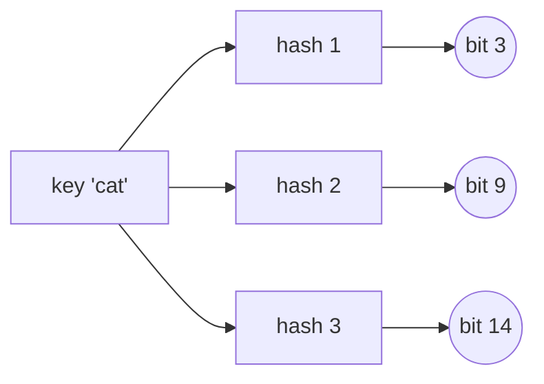

# Bloom Filters

A **Bloom filter** is a membership test that stores no keys. You hand it a key,
it hands back one of two answers: **definitely not present**, or **probably
present**. It is named after Burton Bloom, who published it in 1970, so unlike
"minimum spanning tree" the name tells you nothing and you have to remember the
behaviour instead

Every set you have used so far in this book stores what you put in it. A Python
`set` keeps the actual strings in its
[buckets](../../01_arrays_and_hashing/notes/05_hash_table_internals.md), because
it has to compare a probe key against a stored key to answer honestly. A Bloom
filter throws the key away the moment it has hashed it, and keeps only a fixed
array of **bits**, all starting at `0`. Adding a key flips a few of those bits to
`1`. Querying a key looks at the same few bits and reports whether they are all
`1`

Since nothing is stored, nothing can be compared, and the structure has no way to
tell *your* bits from bits that some other key happened to flip. That is where
the "probably" comes from. The error only ever runs in one direction, which is
the property everything else hangs off:

- If the filter says **not present**, the key was definitely never added. This
  answer is always right
- If the filter says **present**, the key was *probably* added, and might not
  have been. This is a **false positive**, and its rate is a number you choose in
  advance by choosing how much memory to spend

Think of a bouncer with no guest list, only a wall of light switches. Each
arriving guest flips three switches that their name maps to. Later, someone
claims to be on the list, so the bouncer checks their three switches. One switch
off means they are certainly lying. All three on means either they really came
earlier, or three unrelated guests happened to flip exactly those three switches
between them

## When "Probably Yes" Is Worth The Memory

The structure earns its place when there is an **expensive exact check** sitting
behind it and most queries would fail that check. The filter absorbs the misses
cheaply, and the small fraction of false positives just pay the expensive check
they were going to pay anyway. The signals in an interview:

- The key count is enormous and the memory budget is not, as in "a billion URLs
  and 500 MB of RAM"
- A miss is cheap to serve but a hit is expensive to verify, as in a disk read, a
  network call, or a database query. Web crawlers use this for "have I fetched
  this URL", and storage engines use it to skip reading a file that cannot
  contain the key
- The question is only ever "have I seen this", never "how many" or "which ones"
- A wrong "yes" costs you one wasted lookup, and never a wrong answer to the user

It is the wrong structure when you need to iterate the keys, count them, get them
back out, or delete them. It is also wrong when a false positive is unsafe rather
than merely wasteful, such as a filter deciding that a password is already
compromised. In those cases you want the exact structure and you pay for it

## One Bit Per Key Is Not Enough

Start with the cheapest thing that fits the description. Take an array of `m`
bits, hash each key once to a position, and set that bit. To query, hash and
check the one bit. No false negatives, since bits are only ever turned on, and
the memory is fixed no matter how long the keys are

The problem is the false positive rate, and it is much worse than it looks.
Inserting `n` keys turns on at most `n` bits out of `m`, so a stranger's single
bit lands on an occupied position with probability roughly `n / m`. There is no
second chance, because one bit is the entire test

Here is the measured behaviour with `m = 8000` bits and `n = 1000` inserted keys,
probing with 200,000 strangers that were never added:

```text
hashes k    bits set of 8000    measured false positive rate
   1              945  (11.8%)            11.85%
   2             1763  (22.0%)             4.87%
   3             2508  (31.4%)             3.10%
   5             3732  (46.7%)             2.21%
```

The single-hash row lies to you on nearly one query in eight, which makes the
filter useless as a prefilter, since you would be paying for the expensive exact
check 12% of the time on keys you never stored

Look at what the second row does, because it is the whole idea. Going from one
hash to two roughly *doubles* the number of set bits, which should make a
collision more likely, and yet the false positive rate drops by more than half. A
stranger now has to collide **twice**, on two independently chosen positions, and
independent probabilities multiply. The set-bit fraction rises from `0.118` to
`0.220`, and squaring `0.220` gives about `0.048`, which is the rate the
experiment measured. Squaring a fraction below one beats doubling it easily. That trade keeps paying until the array is around half full, which is why
the third and fourth rows keep improving and why they improve less each time

So the fix is not a better hash function. It is **more** hash functions, `k` of
them, so a false positive requires `k` simultaneous collisions instead of one

## Setting k Bits Per Key

One key maps to `k` positions in the bit array, and adding it sets all of them:



Querying walks the same three arrows and reports whether all three bits are `1`.
That is the entire structure, and there are only two operations because there is
nothing else it can do

Real Bloom filters do not run `k` separate hash functions, because that would
cost `k` full digests per operation. Instead they compute one strong hash, split
it into two independent halves `h1` and `h2`, and generate the `i`-th position as
`h1 + i * h2`. This is called **double hashing**, and it behaves statistically
like `k` independent hashes while paying for one:

```python
import hashlib


class BloomFilter:
    def __init__(self, num_bits: int, num_hashes: int) -> None:
        self.num_bits = num_bits
        self.num_hashes = num_hashes
        self.bits = bytearray((num_bits + 7) // 8)

    def _positions(self, key: str) -> list[int]:
        digest = hashlib.sha256(key.encode()).digest()
        h1 = int.from_bytes(digest[:8], "big")
        h2 = int.from_bytes(digest[8:16], "big") | 1
        return [(h1 + i * h2) % self.num_bits for i in range(self.num_hashes)]

    def add(self, key: str) -> None:
        for position in self._positions(key):
            self.bits[position // 8] |= 1 << (position % 8)

    def might_contain(self, key: str) -> bool:
        return all((self.bits[position // 8] >> (position % 8)) & 1 for position in self._positions(key))


seen = BloomFilter(num_bits=64, num_hashes=3)
for word in ["cat", "dog", "emu"]:
    seen.add(word)

assert seen.might_contain("cat") is True
assert seen.might_contain("emu") is True
assert seen.might_contain("fox") is False
assert BloomFilter(num_bits=64, num_hashes=3).might_contain("cat") is False
```

**Four lines do the real work here.**

`self.bits = bytearray((num_bits + 7) // 8)` allocates the array in bytes rather
than a list of booleans, because a Python `list` of `bool` costs a pointer per
entry and the whole point of the structure is that it is small. The `+ 7` is the
usual round-up so that `m = 17` still gets 3 bytes instead of 2

`h2 = ... | 1` forces the stride to be odd. When `h2` shares a large factor with
`num_bits`, the sequence `h1 + i * h2` wraps back onto a position it has already
used, so that key quietly sets fewer than `k` distinct bits and clears fewer
hurdles than the sizing formula assumed. Drop the `| 1` and 604 keys out of
20,000 land on fewer than 3 distinct positions at `num_bits = 64`; keep it and
none do. Setting the low bit costs nothing and makes the stride coprime with any
power of two

`self.bits[position // 8] |= 1 << (position % 8)` is
[setting a single bit](../../15_bit_manipulation/notes/02_masks.md): the byte
index is the position divided by 8, and the bit inside that byte is the
remainder. `|=` is the reason there are no false negatives, since it can turn a
bit on and has no way to turn one off

`all(...)` over a generator short-circuits, so a query that hits a zero bit on
the first probe returns without computing the remaining ones. Misses are the
common case in a prefilter, so they are also the fast case

## Why A False Negative Is Impossible

The argument is one sentence and interviewers ask for it directly. Bits are only
ever written with `|=`, so the array is **monotone**: a bit that is `1` stays `1`
forever, no matter what is inserted afterwards. When `add(key)` ran, it set every
one of `key`'s `k` positions, and any later query recomputes those same `k`
positions from the same digest. All of them are still `1`, so `might_contain`
returns `True`. Nothing about the rest of the array matters

> "Insertion only turns bits on and nothing ever turns them off, so a key's bits
> are still set when I look for it later. That gives one-sided error: a `False`
> is a proof of absence, and a `True` is evidence"

That monotonicity is also exactly why **you cannot delete**. Clearing a key's `k`
bits would clear bits that other keys are relying on, and those keys would then
report `False` after having been added, which is the false negative the whole
structure promises never to produce. The fix is a **counting Bloom filter**,
which replaces each bit with a small counter (four bits is typical) that
increments on add and decrements on remove:

```python
import hashlib


class CountingBloomFilter:
    def __init__(self, num_slots: int, num_hashes: int) -> None:
        self.num_slots = num_slots
        self.num_hashes = num_hashes
        self.counts = [0] * num_slots

    def _positions(self, key: str) -> list[int]:
        digest = hashlib.sha256(key.encode()).digest()
        h1 = int.from_bytes(digest[:8], "big")
        h2 = int.from_bytes(digest[8:16], "big") | 1
        return [(h1 + i * h2) % self.num_slots for i in range(self.num_hashes)]

    def add(self, key: str) -> None:
        for position in self._positions(key):
            self.counts[position] += 1

    def remove(self, key: str) -> None:
        for position in self._positions(key):
            self.counts[position] = max(0, self.counts[position] - 1)

    def might_contain(self, key: str) -> bool:
        return all(self.counts[position] > 0 for position in self._positions(key))


counting = CountingBloomFilter(num_slots=64, num_hashes=3)
counting.add("ada")
counting.add("grace")
assert counting.might_contain("ada") is True
counting.remove("ada")
assert counting.might_contain("ada") is False
assert counting.might_contain("grace") is True
assert CountingBloomFilter(num_slots=64, num_hashes=3).might_contain("ada") is False
```

Removing a key that was never added is the trap here, because it decrements
counters that belong to somebody else and can produce a genuine false negative.
The `max(0, ...)` guard stops a counter going negative but does not fix that, so
a counting filter is only safe when you remove keys you know you inserted

Two filters over the same `m` and the same `k` also **union** by a plain bitwise
OR of their arrays, which is why they are convenient in distributed systems: each
machine builds its own filter over its own shard, and one OR combines them into a
filter over everything. Intersection does not work that way, since ANDing two
arrays can leave a key's bits set by two different keys and invent members that
neither side ever saw

## Picking m And k

Two numbers are yours to choose, and an interviewer will ask you to justify them.
Write `n` for the number of keys you expect, `m` for the bits you are willing to
spend, `k` for the number of hashes, and `p` for the false positive rate you can
live with

Inserting `n` keys sets `k * n` bits, each landing at a uniformly random
position, so a given bit survives as `0` with probability `(1 - 1 / m)^(k * n)`,
which is about `e^(-k * n / m)`. A stranger false-positives when all `k` of its
positions are among the set bits, giving

```text
p  ≈  (1 - e^(-k * n / m))^k
```

Minimising that over `k` lands on `k = (m / n) * ln 2`, which is the value that
leaves the array **half full**. Below it you have not made the stranger clear
enough hurdles, and above it you have set so many bits that every hurdle is easy.
The measured sweep above shows both sides of that peak, since `m / n = 8` there
puts the optimum at about `5.5` hashes and the gain from `k = 3` to `k = 5` is
already small. Substituting the optimal `k` back gives `p = 2^-k`, and solving
for `m` gives the two formulas worth memorising:

```text
m = -n * ln(p) / (ln 2)^2          bits needed
k = (m / n) * ln 2                 hashes to use
```

The consequence worth saying out loud is that `m / n` depends only on `p` and not
on `n` at all, so **the cost per key is a constant** once you have fixed the error
rate. A 1% filter costs about 9.6 bits per key whether you are storing a thousand
keys or a billion, and each extra factor of ten on the error rate costs about 4.8
more bits per key

## Dry Run: Sixteen Bits, Three Animals

Take `num_bits = 16` and `num_hashes = 2`, small enough to print, and insert
`cat`, `dog`, and `emu`. The positions come from running `_positions`, and the
array is printed with index 0 on the left:

```text
start                          0000000000000000

add "cat"   -> bits 3, 0       1001000000000000
                               ^  ^
add "dog"   -> bits 8, 15      1001000010000001
                                       ^      ^
add "emu"   -> bits 10, 11     1001000010110001
                                         ^^
```

Six of the sixteen bits are now `1`, at positions 0, 3, 8, 10, 11, and 15. Now
run three queries:

```text
query "ram" -> bits 2, 11      bit 2 is 0  -> return False on the first probe
                               REJECTED, and correctly: "ram" was never added

query "fox" -> bits 0, 9       bit 0 is 1  (set earlier by "cat")
                               bit 9 is 0  -> return False
                               REJECTED on the second probe, after a matching first

query "eel" -> bits 11, 8      bit 11 is 1 (set by "emu")
                               bit 8  is 1 (set by "dog")
                               -> return True.  FALSE POSITIVE
```

The `fox` query is the one to study, because a matching first bit means nothing
on its own and the query still gets rejected. That is the multiplication from the
derivation happening in miniature

The `eel` query is the honest failure. It was never inserted, and no single key
set both of its bits, but `emu` set one and `dog` set the other and the filter
cannot tell the difference. Six set bits out of sixteen with two hashes is a
predicted rate of about `(6/16)^2`, which is roughly 14%, so a lie this early is
expected rather than unlucky. Real filters are not run this full

## Worked Example: Design A Bloom Filter For Username Signup

This one comes up as a design-round coding question rather than as a LeetCode
problem, and it is the form most interviewers use

A signup service holds 100 million taken usernames. When someone types a name
into the form, the page needs an instant "already taken" hint without a database
round trip on every keystroke. Wrongly telling a user a free name is taken is
acceptable at a low rate, since they will try another, but wrongly telling them a
taken name is free is not, since the real signup would then fail. Build the
structure and size it for a 1% error rate

**Input**: `expected_keys`, an `int` giving how many usernames the filter will
hold, and `false_positive_rate`, a `float` in `(0, 1)` giving the largest
fraction of never-added names that may be reported as taken. Then a stream of
`add(username)` calls, where `username` is a `str`

**Output**: `might_contain(username)` returns a `bool`. `False` means the
username is definitely free, and the page can say so with certainty. `True` means
the username is probably taken, and the page must confirm against the real
database before telling the user anything final. The constructor produces no
output but fixes the memory the structure will ever use

**The approach.** The phrase that identifies the technique is "instant negative
answer, exact check only on a hit", combined with a key count far larger than the
memory budget. The exact structure is a `set` of the usernames, which is correct
and unusable: measured on 100,000 usernames of this shape, a CPython `set` costs
about 93.9 bytes per key once the string objects are counted, because it stores
every character plus per-object overhead. The Bloom filter for the same keys at
1% costs 1.198 bytes per key, measured the same way, which is about 78 times
smaller, and it gets there by storing no usernames at all

> "A false positive costs one database lookup we were willing to make anyway, and
> a false negative would cost a broken signup. Bloom filters have one-sided error
> in exactly that direction, so I will put one in front of the database and size
> it for 1%"

**Step by step.**

1. Convert the two requirements into a bit count with
   `m = -n * ln(p) / (ln 2)^2`, since that is the smallest array that can hold
   `n` keys at error rate `p`. Round up, because a fractional bit is not a thing
   you can allocate
2. Convert that bit count into a hash count with `k = (m / n) * ln 2`, rounded to
   an integer, since that is the value that leaves the finished array half full
   and therefore minimises the error. Clamp it to at least `1`, because a filter
   with zero hashes would call every key present
3. Guard `n = 0` by treating it as `1`, since the formula divides by the key
   count and an empty filter is a legal thing to construct
4. Allocate `ceil(m / 8)` bytes of `bytearray` zeroed out, which is the entire
   memory footprint and does not grow afterwards
5. For each key, take one SHA-256 digest, split its first sixteen bytes into two
   64-bit halves, and generate the `k` positions as `(h1 + i * h2) % m` with `h2`
   forced odd so the stride never collapses
6. `add` sets all `k` bits with `|=`, and never clears anything, which is what
   keeps the error one-sided
7. `might_contain` returns `True` only if every one of the `k` bits is `1`,
   short-circuiting on the first `0` so that the common miss is the cheap path

```python
import hashlib
import math


def optimal_parameters(expected_keys: int, false_positive_rate: float) -> tuple[int, int]:
    keys = max(expected_keys, 1)
    num_bits = math.ceil(-keys * math.log(false_positive_rate) / (math.log(2) ** 2))
    num_hashes = max(1, round(num_bits / keys * math.log(2)))
    return num_bits, num_hashes


class UsernameFilter:
    def __init__(self, expected_keys: int, false_positive_rate: float = 0.01) -> None:
        self.num_bits, self.num_hashes = optimal_parameters(expected_keys, false_positive_rate)
        self.bits = bytearray((self.num_bits + 7) // 8)

    def _positions(self, key: str) -> list[int]:
        digest = hashlib.sha256(key.encode()).digest()
        h1 = int.from_bytes(digest[:8], "big")
        h2 = int.from_bytes(digest[8:16], "big") | 1
        return [(h1 + i * h2) % self.num_bits for i in range(self.num_hashes)]

    def add(self, key: str) -> None:
        for position in self._positions(key):
            self.bits[position // 8] |= 1 << (position % 8)

    def might_contain(self, key: str) -> bool:
        return all((self.bits[position // 8] >> (position % 8)) & 1 for position in self._positions(key))


assert optimal_parameters(100_000_000, 0.01) == (958505838, 7)

taken = UsernameFilter(expected_keys=3, false_positive_rate=0.01)
for name in ["ada", "grace", "alan"]:
    taken.add(name)

assert taken.might_contain("ada") is True
assert taken.might_contain("grace") is True
assert taken.might_contain("linus") is False
assert UsernameFilter(expected_keys=3).might_contain("ada") is False
assert UsernameFilter(expected_keys=0).might_contain("") is False
```

The first assert is the sizing answer: 958,505,838 bits and 7 hashes, which is
119.8 MB for 100 million usernames. Filling a filter of that shape with 100,000
keys and probing it with 200,000 never-added names measured a false positive rate
of 1.009%, against the 1% that was asked for

- **Time**: `O(k)` per `add` and per `might_contain`, where `k` is the hash count
  the constructor chose (7 here), because each operation computes one digest and
  then touches `k` bits. It does not depend on `n`, the number of keys already
  inserted
- **Space**: `O(m)` bits, where `m` is fixed at construction from `n` and `p`,
  which is 119.8 MB here and does not grow as usernames are added. The usernames
  themselves contribute nothing, since the filter never stores them

## Time and Space Complexity

Throughout: `n` is the number of keys inserted, `m` is the size of the bit array,
`k` is the number of hash functions, `p` is the false positive rate, and `L` is
the average key length

**Membership structures over the same `n` keys**

| Approach                        | Time                                                                                                                                                       | Space                                                                                                                                                        |
| ------------------------------- | ---------------------------------------------------------------------------------------------------------------------------------------------------------- | ------------------------------------------------------------------------------------------------------------------------------------------------------------ |
| Bloom filter                    | `O(k)` per `add` and per query: one digest plus `k` bit touches, and `k` is a constant fixed at construction, so neither operation slows down as `n` grows | `O(m)` bits, with `m = -n * ln(p) / (ln 2)^2` chosen up front: about 9.6 bits per key at `p = 0.01`, independent of `L` because keys are never stored        |
| Python `set`                    | `O(L)` average per `add` and per query: hashing the key reads all `L` characters, and a collision costs a full equality comparison of two keys             | `O(n * L)`: every key is stored in full, measured at about 93.9 bytes per key for 100,000 usernames of this shape, which is roughly 78 times the filter      |
| Single-hash bit array (`k = 1`) | `O(1)` per operation: one digest and one bit, the cheapest of the three                                                                                    | `O(m)` bits, but useless at any reasonable `m`, since with `m / n = 8` it measured an 11.85% false positive rate against 2.21% for `k = 5` on the same array |

**Bloom filter operations in detail**

| Operation                       | Time                                                                                     | Space                                                                                                                    |
| ------------------------------- | ---------------------------------------------------------------------------------------- | ------------------------------------------------------------------------------------------------------------------------ |
| `add(key)`                      | `O(k)`: `k` positions computed from one digest, each an OR into one byte                 | `O(k)` auxiliary for the list of `k` positions, and nothing at all in the bit array, which was allocated at construction |
| `might_contain(key)`, a miss    | `O(k)` worst case but usually less, because `all` short-circuits on the first `0` bit    | `O(k)` auxiliary for the positions list, and nothing else                                                                |
| `might_contain(key)`, a hit     | `O(k)` always, since every one of the `k` bits must be confirmed before returning `True` | `O(k)` auxiliary for the positions list, and nothing else                                                                |
| union of two filters            | `O(m)`: one bitwise OR across the whole array, valid only when both share `m` and `k`    | `O(m)` for the result, or `O(1)` if done in place                                                                        |
| `remove(key)`, counting variant | `O(k)`: same positions, decrementing counters instead of clearing bits                   | `O(m * c)` bits where `c` is the counter width, typically 4, so four times a plain filter                                |

## Summary

- A **Bloom filter** is a probabilistic set that stores an array of `m` bits and
  no keys at all. Adding a key sets the `k` bits that `k` hash functions map it
  to, and querying reports whether all `k` of those bits are `1`
  - It answers **definitely not present** or **probably present**, never
    "definitely present", because it has no stored key to compare against
- The error is one-sided, so **false positives happen and false negatives cannot**.
  Bits are only ever turned on with `|=` and nothing ever turns one off, so a
  key's bits are still set whenever you look for it again
  - This is the sentence to have ready, because interviewers ask for the argument
    rather than the fact
- Reach for one when an expensive exact check sits behind it and most queries
  will miss, such as a crawler asking "have I fetched this URL" or a storage
  engine asking "could this file contain this key". A `True` costs one lookup you
  were willing to make, and a `False` skips it entirely
  - Do not reach for one when you need to enumerate, count, or retrieve keys, or
    when a wrong "yes" is unsafe rather than merely wasteful
- Using one hash instead of `k` is the mistake that makes the structure useless.
  A stranger then needs a single collision instead of `k` simultaneous ones, and
  measured on `m = 8000` bits with `n = 1000` keys that is an 11.85% false
  positive rate against 2.21% at `k = 5` on the same memory
- Size it with `m = -n * ln(p) / (ln 2)^2` bits and `k = (m / n) * ln 2` hashes,
  where `p` is the false positive rate you choose. The optimal `k` is the one that
  leaves the array half full, and substituting it back gives `p = 2^-k`
  - The bits per key depend only on `p` and not on `n`, so 1% costs about 9.6
    bits per key at any scale, and each extra factor of ten costs 4.8 bits more
- Deleting is impossible, because clearing a key's bits would clear bits other
  keys share and would manufacture a false negative. A **counting Bloom filter**
  replaces each bit with a small counter and supports `remove` at roughly four
  times the space
  - Removing a key that was never added corrupts the filter for real, so a
    counting filter is only safe over keys you know you inserted
- Two filters with the same `m` and the same `k` combine with a bitwise OR of
  their arrays, which is how sharded systems merge them. Intersection by AND is
  not valid, since it can invent members that neither side ever saw
- Both operations cost `O(k)` time and the whole structure costs `O(m)` bits,
  neither of which depends on the key length, which is the concrete reason it
  beats a `set` on memory

## Interview Checklist

Before writing code, make sure you can answer:

```text
Can this problem tolerate a wrong "yes", and is a wrong "no" definitely fatal?
What expensive check sits behind the filter, and does it get skipped on a False?
How many keys n, and what false positive rate p is acceptable?
What m and k do the formulas give, and how many bytes is that?
Am I generating k positions from one digest, with an odd stride, or paying for k digests?
Does anything in the problem need delete, count, or iterate? If so, say why a plain
  Bloom filter cannot do it, and offer the counting variant for delete
What happens on a True in the calling code, and who does the exact confirmation?
```
