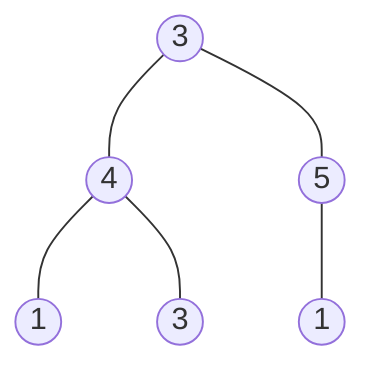

# Mock Interviews

A **mock interview** is one full interview round, rehearsed under the conditions
of the real thing. Four things have to be true at once for a session to count as
a mock rather than as practice: the problem is **unseen**, the clock is **fixed
and external**, a **second party** is present who is not obliged to help you, and
the session ends in a **debrief** that names what went wrong

That is a different exercise from everything the book has asked for so far.
Module problem sets hand you the technique in the folder name. Mixed practice
hides the label but still lets you stop, look something up, and come back
tomorrow. [Timed solving](01_timed_solving.md) adds the clock and takes away the
lookups. A mock takes away the last thing left, which is your control over the
problem and over what happens after you finish it

The consequence is worth stating plainly, because it is the reason mocks feel
disproportionately hard the first few times. In solo practice, the only thing
being measured is the final code. In a mock, most of what gets recorded happens
**before** the code exists, while you are still clarifying, comparing approaches,
and being wrong out loud. The mock is where you find out which parts of your loop
only worked because nobody was watching

> This topic covers what a mock session is scored on, why narrating a solo solve
> is not one, how to spend the forty-five minutes, how to run a mock when you have
> no partner, and what to extract from the recording afterwards

## What The Scorecard Actually Records

The interviewer does not fill in one box marked "solved it". Feedback is written
from notes taken during the session, and it is broken into separate signals so
that a candidate who finished the code but could not explain it is distinguishable
from one who ran out of time with the right idea half typed

The four signals below appear under different names at different companies, but
the split is consistent, and each one is proved by a specific artifact you leave
behind:

```text
problem solving   did the approach come from reasoning about the input, or from
                  recognition alone?          proved by: the brute force you
                  stated and the bottleneck you named in it
coding            does the idea survive contact with syntax?
                  proved by: code that runs, with names that say what they hold
communication     could the interviewer follow the decision as it was made?
                  proved by: the sentence you said before each chunk, not after
verification      do you find your own bugs?
                  proved by: a trace on a small input, run before you say "done"
```

The load-bearing fact is that **evidence you did not produce out loud does not
exist**. An interviewer who watched you sit silent for eight minutes and then type
a correct solution cannot write "strong problem solving", because they saw no
problem solving. They saw an answer arrive. That is the single largest gap
between someone's LeetCode record and their interview record, and it is invisible
until a mock makes it visible

The [live-interview conversation](../../00_fundamentals/notes/05_interview_problem_solving.md)
already covers how to narrate each step. What a mock adds is the audit: a
recording that shows you which of those four rows you actually left evidence for

## Why Narrating A Solo Solve Is Not A Mock

The obvious way to practice this without organizing anything is to sit alone,
pick a problem, and talk through it out loud as you solve. It is cheap, it takes
no scheduling, and it does rehearse the words. It also fails, and the specific way
it fails is what tells you which three ingredients a real mock needs

**It cannot hand you a problem you did not choose.** Choosing your own problem
leaks the answer, because the reason you picked it is usually the pattern you have
been drilling. You end the session having practiced applying a technique you were
already primed for, which is the one thing an interview never gives you

**It cannot interrupt you.** Nobody asks "why a heap and not sorting?" at minute
14, and nobody drops a hint you did not anticipate. Since you wrote the script,
every question in it is one you already had an answer to. Real sessions are
derailed by exactly the questions you did not write

**It cannot make you finish.** Alone, an unpleasant phase gets quietly skipped.
Testing gets replaced by "that looks right", the follow-up never happens because
you already know the clock has no teeth, and you stop the moment the interesting
part is over. Nothing records the skip, so nothing corrects it

Each failure names its own fix. A blind problem source replaces your biased
choice, a second party (or a stand-in for one) supplies the interruption, and a
recording plus a hard stop removes the ability to skip a phase and forget you did.
Those three, plus the debrief, are the whole apparatus

## Budgeting Forty-Five Minutes

A standard round is a forty-five minute slot, and the coding problem does not get
all of it. Introductions, the interviewer's setup, and your questions at the end
take real minutes off both ends, so plan around thirty-five to forty minutes of
actual problem time

The budget below is a set of **checkpoints, not a stopwatch**. You are not trying
to hit each phase exactly; you are trying to notice when you are past a checkpoint
with nothing to show for it, because that is the moment a recoverable session
turns into a failed one

| By this point | You should have                                                                             | If you don't                                                                                                              |
| ------------- | ------------------------------------------------------------------------------------------- | ------------------------------------------------------------------------------------------------------------------------- |
| minute 5      | the contract restated in your own words, one worked example, and every ambiguity resolved   | you are guessing at the problem, so ask now rather than discovering the misread at minute 30                              |
| minute 12     | a correct approach agreed out loud, with its complexity stated and the brute force it beats | stop optimizing and offer the brute force as the thing you will code, because a slow correct plan beats a fast absent one |
| minute 25     | code that runs on the example, even if it is the slow version                               | cut scope: hardcode a helper, handle the general case first, and say which piece you are deferring                        |
| minute 35     | a trace on a small input, including one edge case, done out loud                            | trace anyway and skip polish, since an untested solution and a wrong solution score the same                              |
| minute 40     | complexity in both time and space, and one sentence on the follow-up                        | volunteer the complexity even mid-sentence, because it is the cheapest signal on the sheet                                |

The minute-12 checkpoint is the one people fail, and it fails in a predictable
way: the optimal solution is *almost* in reach, so you keep reaching, and at
minute 30 you have no code at all. The correct move is to say the tradeoff rather
than make it silently

> "I think there is an `O(n log n)` version using a heap, but I do not have it
> yet. Rather than spend more time there, I will code the `O(n²)` version, which I
> am sure is correct, and then optimize it if the clock allows. Does that work for
> you?"

That sentence does three things at once. It shows you know the better bound
exists, it commits to something shippable, and it hands the interviewer an opening
to nudge you if the optimization is the point of the question. Silence at minute
30 does none of them

The clock discipline itself, meaning how to keep working while aware of elapsed
time, belongs to [timed solving](01_timed_solving.md). What the mock adds is that
two of these checkpoints are conversations rather than milestones, so missing them
costs you a signal even when the final code is correct

## Running A Mock Without A Partner

A partner is better, and you should trade rounds with someone whenever you can.
When you cannot, a solo session still works if you rebuild the three missing
ingredients deliberately rather than hoping to be honest about them

**Take the problem blind.** Pick from a list you did not curate today. The
[mixed problem set](../problem_set/MIXED_PROBLEM_SET.md) is built for exactly this,
because every problem in it chains two or more patterns and the folder name gives
nothing away. Roll a die or use a random index, read only the problem title, and
do not read the `chains:` line

**Seal the hint.** The `chains:` line under each problem names the patterns it
combines, which makes it a perfect stand-in for an interviewer's first nudge. Rule:
you may open it once, only after twelve minutes with no approach, and opening it
gets written into the debrief. This preserves the distinction the book already
draws between a
[cold solve and a hint-assisted one](../../00_fundamentals/notes/01_how_to_prep.md)

**Record the session.** Screen plus audio, or a phone on the desk. This is the
ingredient that does the most work, because a recording is the only thing that
proves whether you narrated a decision or merely thought it. Almost everyone
believes they explained more than the tape shows

**Type in an editor that cannot run the code.** A plain text file with no
autocomplete and no interpreter matches the shared document you will actually be
given. Discovering that you rely on the red squiggle to close your brackets is
better done here

**Draw the follow-up blind too.** Before starting, write three follow-up prompts
on separate lines, then reveal one only after your solution passes. Generic ones
work, because interviewers ask generic ones: make the input a stream that does not
fit in memory, forbid the extra space you used, ask for every answer instead of
one, or push `n` up by three orders of magnitude and ask what breaks first

## The Debrief Is The Product

The session is the input, and the debrief is the output. Skipping it turns a mock
into an expensive practice problem

Watch the recording at speed and grade only the four signals from the scorecard,
one line each, in the same specific language a
[pattern review entry](02_pattern_review.md) uses. Two questions drive almost all
the value:

- **Where did the transcript go quiet?** Find the longest silence and label what
  you were doing during it. Thinking through a recurrence, debugging an index, and
  being stuck all look identical from outside, and each has a different sentence
  that would have fixed it
- **Which checkpoint did you miss, and what did you do at the moment you missed
  it?** Missing minute 12 is normal. Missing it and continuing to optimize
  silently is the failure, and it is a habit rather than a knowledge gap, which
  means rereading a module note will not repair it

A knowledge gap goes into the review log and gets a re-solve date. A habit gap,
such as never volunteering complexity or never testing before declaring victory,
gets rehearsed in the next mock as an explicit goal. Those are different repairs,
and confusing them is why people run twenty mocks and keep receiving the same
feedback

## Worked Example: [House Robber III](https://leetcode.com/problems/house-robber-iii/)

This one is chosen because it is the shape of problem that punishes bad clock
management. The naive solution is short, correct, and reachable inside ten
minutes, while the good solution is a small twist on it that is easy to miss under
pressure. That means it separates candidates who shipped something from candidates
who chased the twist and shipped nothing

Houses are arranged as a binary tree instead of a line. Every house holds an
amount of money, and you may rob any set of houses you like except that **no two
directly connected houses may both be robbed**, since robbing a parent and its
child on the same night triggers the alarm. Return the largest total you can take

**Input**: `root`, the root of a binary tree of `TreeNode` objects, or `None` for
an empty tree. Each node carries an integer `val`, the money in that house, and
`left` / `right` child pointers that are themselves `TreeNode` or `None`

**Output**: a single `int`, the maximum money obtainable over all valid selections
of houses. It is the total taken, not a count of houses and not the list of houses
chosen. An empty tree yields `0`, since there is nothing to take

**The approach.** The identifying phrase is "no two directly connected houses",
which is a constraint linking a node to its immediate neighbours only, and that is
the signature of a
[take-or-skip decision per node](../../11_dp/notes/01_dp_fundamentals.md) rather
than anything greedy. Robbing the largest house first is wrong for the usual
reason a greedy fails here, because taking a big parent can forfeit two larger
children

Write the decision down directly and you get a working solution. Either you rob
this node, which forbids its children and leaves you the four grandchildren, or
you skip it and take the best from each child. The problem is that computing the
robbed branch descends to the grandchildren, and computing the skipped branch
descends to the children, which then descend to those same grandchildren. Every
grandchild subtree is therefore solved twice, once from each side, and the
doubling compounds with depth. On a tree shaped like a single path of 30 nodes
that recursion makes 7,049,153 calls, which I measured by counting them, for an
answer that a single pass could produce in 30

The fix is to stop returning one number. The reason the recursion re-descends is
that `rob(child)` throws away the information the parent actually needs, which is
not "the best you can do in this subtree" but **the best with the child robbed and
the best with the child skipped, separately**. Return both as a pair and the
parent can combine them without ever looking at a grandchild

> "One number per subtree is under-informed, because the parent's own choice
> changes which of the child's answers is legal. I will return a pair, robbed and
> skipped, and each node will read its children's pairs once. That makes it a
> single post-order pass, `O(n)` time and `O(h)` stack"

**Step by step:**

1. Recognize the state. Each node needs two answers rather than one, because
   whether the child may be robbed depends on a decision made above it, and a
   single number cannot answer both versions of the question
2. Fix the return contract before writing anything: `visit(node)` returns
   `(robbed, skipped)`, where `robbed` is the best total for that subtree given
   that this node **is** robbed, and `skipped` is the best given that it is not.
   Say this contract out loud, since every line below is derived from it
3. Handle the empty child. `visit(None)` returns `(0, 0)`, which is the identity
   for both branches, so the code below never needs a `None` check on either child
4. Recurse into both children first. This has to be a **post-order** pass, because
   a node cannot compute either of its own answers until both children's pairs are
   known
5. Build `robbed` as `node.val + left_skipped + right_skipped`. Taking this house
   forbids both children, so only their skipped answers are legal, and this is the
   line where the constraint actually lives
6. Build `skipped` as `max(left_robbed, left_skipped) + max(right_robbed, right_skipped)`.
   Not taking this house frees each child to do whatever is best for it, and the
   two children are independent because they share no edge
7. Return `max` of the root's pair, since the root is under no constraint from
   above and either of its two answers is permitted

Here is the version worth having on the screen by minute 25. It is correct, it is
short, and it is the one to write first if the pair insight has not arrived yet:

```python
class TreeNode:
    def __init__(self, val: int = 0, left: "TreeNode | None" = None, right: "TreeNode | None" = None) -> None:
        self.val = val
        self.left = left
        self.right = right


def rob_recompute(node: "TreeNode | None") -> int:
    if node is None:
        return 0
    robbed = node.val
    if node.left:
        robbed += rob_recompute(node.left.left) + rob_recompute(node.left.right)
    if node.right:
        robbed += rob_recompute(node.right.left) + rob_recompute(node.right.right)
    skipped = rob_recompute(node.left) + rob_recompute(node.right)
    return max(robbed, skipped)


example_one = TreeNode(3, TreeNode(2, None, TreeNode(3)), TreeNode(3, None, TreeNode(1)))
example_two = TreeNode(3, TreeNode(4, TreeNode(1), TreeNode(3)), TreeNode(5, None, TreeNode(1)))

assert rob_recompute(example_one) == 7
assert rob_recompute(example_two) == 9
assert rob_recompute(TreeNode(7)) == 7
assert rob_recompute(None) == 0
```

And here is the pair-returning version, which is the answer:

```python
def rob(root: "TreeNode | None") -> int:
    def visit(node: "TreeNode | None") -> tuple[int, int]:
        if node is None:
            return (0, 0)
        left_robbed, left_skipped = visit(node.left)
        right_robbed, right_skipped = visit(node.right)
        robbed = node.val + left_skipped + right_skipped
        skipped = max(left_robbed, left_skipped) + max(right_robbed, right_skipped)
        return (robbed, skipped)

    return max(visit(root))


assert rob(example_one) == 7
assert rob(example_two) == 9
assert rob(TreeNode(7)) == 7
assert rob(None) == 0
```

The two lines to defend out loud are the asymmetric ones. `robbed` reads only the
children's **skipped** entries, because that is where the alarm constraint is
enforced, and `skipped` takes a `max` per child, because an unrobbed parent
imposes nothing on either child

**Trace on `example_two`.** The tree is the second official example, with the
answer 9:



Post-order means the leaves resolve first and the root resolves last. Every pair
below was produced by running the code:

```text
node 1 (under 4)   children (0,0) (0,0)   -> robbed=1  skipped=0
node 3 (under 4)   children (0,0) (0,0)   -> robbed=3  skipped=0
node 4             children (1,0) (3,0)   -> robbed=4  skipped=4
node 1 (under 5)   children (0,0) (0,0)   -> robbed=1  skipped=0
node 5             children (0,0) (1,0)   -> robbed=5  skipped=1
node 3 (root)      children (4,4) (5,1)   -> robbed=8  skipped=9
answer = max(8, 9) = 9
```

**The rejected step is at the root.** Robbing it scores `3 + 4 + 1 = 8`, using the
two children's skipped entries, and that branch is discarded in favour of skipping
the root for `4 + 5 = 9`. The root holds the largest single value in the top
layer, so a greedy that grabs it loses by one, and this trace is the counterexample
to say out loud if asked why greedy fails

Two smaller things in the same trace are worth naming. At node 4 the two answers
tie at 4, which is why the parent must keep both rather than collapse to a winner,
since a tie above may be broken differently below. At node 5 the missing left
child contributes `(0, 0)` and disappears from both sums, which is the identity
base case doing its job with no special-casing anywhere

## Time and Space Complexity

Let `n` be the number of nodes and `h` the height of the tree, where `h` is
`log n` on a balanced tree and `n` on a path-shaped one

| Approach                                                         | Time                                                                                                                                                                          | Space                                                                                                               |
| ---------------------------------------------------------------- | ----------------------------------------------------------------------------------------------------------------------------------------------------------------------------- | ------------------------------------------------------------------------------------------------------------------- |
| Rob-or-skip returning one number, re-descending to grandchildren | Exponential: each node solves its grandchildren from both branches, so the call count follows a Fibonacci-shaped recurrence. A 30-node path produced 7,049,153 measured calls | `O(h)`: only the call stack, since nothing is stored, which is why the bad version looks harmless on small examples |
| The same recursion with a memo keyed by node                     | `O(n)`: each node's answer is computed once and read from the cache after, so the repeated descent becomes a lookup                                                           | `O(n)`: the cache holds one entry per node, plus `O(h)` of stack on top of it                                       |
| Pair-returning post-order pass                                   | `O(n)`: every node is visited exactly once and does constant work combining two pairs                                                                                         | `O(h)`: the call stack only, so `O(log n)` balanced and `O(n)` on a path, and no auxiliary table at all             |

The memo row is the honest middle answer, and it is what to reach for when the
pair insight will not come, since it is a mechanical fix to a recursion you have
already written. The pair version wins because it removes the cache entirely by
making the return value carry the extra information instead

## Summary

- A **mock interview** is one interview round rehearsed under real conditions,
  and it needs four things to count: a problem you did not choose, a fixed
  external clock, a second party who is not obliged to help, and a debrief
  afterwards that names what went wrong
  - Removing any one of them turns it back into practice. Choosing your own
    problem is the most common and the most damaging, since the reason you picked
    it usually leaks the pattern
- Feedback is recorded as separate signals rather than one verdict, and the four
  that recur are problem solving, coding, communication, and verification. Each
  is proved by an artifact: the brute force you stated, code that runs, the
  sentence before each chunk, and a trace done before you say "done"
  - Evidence you did not produce out loud does not exist. Eight silent minutes
    followed by correct code reads as an answer arriving, not as problem solving
- Narrating a solo solve rehearses the words and nothing else, because it cannot
  hand you an unchosen problem, cannot interrupt you with a question you did not
  anticipate, and cannot stop you from quietly skipping the phases you dislike
  - The fixes are a blind problem source, a sealed hint you may open once and must
    log, and a recording, since the tape is the only witness that you narrated a
    decision instead of thinking it
- Spend the round against checkpoints rather than a stopwatch, with the contract
  clear by minute 5, an approach agreed by minute 12, running code by minute 25,
  a spoken trace by minute 35, and complexity by minute 40
  - Minute 12 is the checkpoint people fail, by chasing an almost-reachable
    optimum in silence and arriving at minute 30 with nothing typed. Say the
    tradeoff instead and code the version you are sure of
- The debrief is the output of the session, not an optional extra. Grade the four
  signals from the recording, find the longest silence and label what you were
  doing in it, and separate a knowledge gap from a habit gap
  - A knowledge gap goes to the review log with a cold re-solve date, while a
    habit gap such as never volunteering complexity has to be rehearsed as an
    explicit goal in the next mock, because rereading a note will not fix it
- *House Robber III* is the worked example, and its lesson is the clock lesson.
  The one-number recursion is correct and exponential, while returning a
  `(robbed, skipped)` pair from a single post-order pass is `O(n)` time and
  `O(h)` stack
  - The under-informed return value is the whole bug, since the parent needs both
    of the child's answers separately and one number throws the needed half away
  - Between the two sits the memoized version at `O(n)` time and `O(n)` space,
    which is the mechanical fix to reach for when the pair insight does not arrive
    before your minute-12 checkpoint

## Interview Checklist

Before starting a mock, and again while reviewing the recording, make sure you
can answer each of these

```text
Did someone or something other than me choose this problem?
Is the clock external and visible, and did I record audio plus screen?
By minute 5, had I restated the contract and walked one example?
By minute 12, had I said an approach and its complexity out loud?
When the optimum was out of reach, did I offer the slower version or go silent?
Did I code first and test after, or claim "looks right" and stop?
Did I state time and space unprompted, or wait to be asked?
Did I take a hint, and is that written down so this counts as hint-assisted?
Where is the longest silence on the tape, and what was I doing during it?
Was my miss a knowledge gap for the review log, or a habit to rehearse next time?
```
