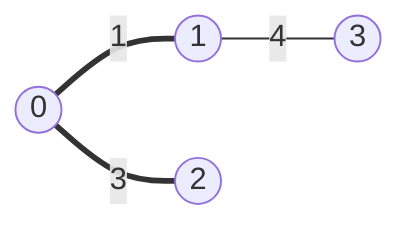

# Writing Notes

The `notes/` files across the numbered modules form one book, read start to
finish by someone with no DSA or LeetCode background who is preparing for
whiteboard and live coding interviews at top tech companies — the FAANG+ set in
the repo `CLAUDE.md`, from Meta and Google through Amazon, Microsoft, Apple,
Bloomberg, Uber, Databricks, OpenAI, and the rest.

Write for that bar generally, not for any one company's reputation. The formats
overlap heavily: a 35-45 minute problem, code in a shared editor or on a
whiteboard, thinking narrated out loud, complexity discussed, follow-ups on the
clock. A note that prepares someone for that prepares them everywhere.

## The Only Test That Matters

> After reading this note, can someone who had never heard of the technique
> recognize it in a disguised problem, code it correctly under pressure, and
> explain why it works out loud?

If yes, the note is done, whatever shape it took. If no, it isn't, however
faithfully it followed a template.

Everything below is a means to that end. Adapt freely — a bit-manipulation note
and a DP note should not be forced into identical section lists.

Two facts constrain the writing:

1. **It is a book, not 84 articles.** A note assumes every note before it. See
   `ledger.md` for what each note establishes.
2. **The reader is time-boxed.** They read each note once to learn, then skim it
   again weeks later to revise. Write for both passes.

Notes teach the technique. Speed and recall come from the module problem sets —
so a note does not need drills, repetition, or "try this yourself" exercises.
Teach it once, teach it properly, hand off to the problem set.

Primary calibration note:
`03_stacks_and_queues/notes/02_queue_and_deque.md`. Its conversational prose,
derivation, runnable Python, diagrams, dry runs, interview reasoning, worked
example, and compact revision layer define the bar. Its headings and length are
not a template to copy.

## Two-Pass Design

| Pass   | When                         | What carries it                                            |
| ------ | ---------------------------- | ---------------------------------------------------------- |
| Learn  | first read                   | prose: brute force → why it fails → insight → code → trace |
| Revise | before practice, weeks later | compact complexity, summary, and interview checklist       |

The prose teaches; the tail is what they reread at 11pm before a mock. Both are
required. A note that is all prose can't be revised from; a note that is all
bullets never taught anything.

## A Shape That Usually Works

Not a mandate — a default to depart from when the topic wants something else.

**The names below are placeholders describing what each part does, not headings to
copy.** Name every heading for the topic in front of you. `Why Recomputing Each Window Dies` says something; `The Brute Force` does not. `Counting Events In A Time Window` tells a new reader what the section is about; `Draining A Stale Front` only makes sense once you already know the pattern.

Use headings that describe the topic in front of the reader. Keep the compact
revision layer easy to find, but let narration and pitfalls appear beside the
decision or branch where they matter.

```text
# Title

(opening lede)              the concept itself, before the first heading
## When You Use It          how it shows up disguised, and what it is NOT
## The Brute Force          the naive idea and the concrete reason it dies
## The Key Insight          the one idea that fixes it, with the justifying argument
## <Technique Name>         prose explanation, then real Python, then line-by-line
## Dry Run                  hand trace on small input, including a rejected step
## Time and Space Complexity   both, always, with the reason for each
## Summary                  the whole topic compressed into bullets
## Interview Checklist      questions to answer before writing code
```

Add when the topic earns it:

- A second `## <Technique>` + `## Dry Run` pair when there are two rival
  algorithms (Kruskal/Prim, memo/tabulation, BFS/DFS).
- `## Which One` — comparison table, only when there are rivals.
- `## Variants You Will Actually See` — named twists with the problem each comes
  from.

Departing is often right. Some examples:

- A topic with no interesting brute force (bitwise basics, trie structure) should
  drop `The Brute Force` rather than invent a strawman.
- A topic that is really a **toolkit** rather than one algorithm (XOR tricks,
  matrix coordinate transforms) reads better as several small
  idea → code → trace units than as one derivation.
- A topic whose whole difficulty is **recognition** (greedy vs DP, which pattern
  a blind problem wants) should spend most of its length on worked
  classification examples.
- A topic that is one template with many disguises (sliding window, binary
  search on answer) should show the template once and then several short
  re-skins of it.

Do not add `Problems That Use This`. The README and workbook list problems.

## Non-Negotiables

Six things hold regardless of shape. Everything else is adjustable.

1. Explain the concept before applying it.
2. Derive the technique, never just announce it.
3. Real Python, executed and verified before saving, and any mermaid diagram
   rendered before saving.
4. A hand trace that includes a rejected or discarded step.
5. Never re-teach what an earlier note established (`ledger.md`).
6. Something on what to say out loud — the interview is verbal.

## Rules

### Explain the thing before using the thing

Open by teaching the concept the note introduces, from zero, in the lede that
sits between the title and the first `##` heading. The reader should learn what
the thing *is* before they read one word about when to reach for it or how to
code it.

Take the name apart when the name is descriptive. "Minimum spanning tree" is
three words that each mean something, so the exemplar spends a short paragraph on
each: it is a *tree*, so no cycles and exactly `n - 1` edges; it is *spanning*,
so every node is included; it is *minimum*, so of all such trees you want the
cheapest. That single move turns an intimidating phrase into a definition the
reader can reconstruct later from the name alone.

When the technique maintains a shape that the code does not show, such as a
dynamic programming table, a tree, a heap, a graph frontier, or the positions of
two pointers in an array, then draw that shape at the moment it is most
interesting. A trace logs a mechanism, whereas a figure is what actually shows
it. Draw the dynamic programming table partly filled with arrows indicating which
cell reads which, or the counterexample graph that strands a node.

For topics with no such shape, such as XOR tricks, hashing, the greedy versus
dynamic programming distinction, or complexity analysis, a concrete instance is
enough. Do not manufacture a diagram in order to satisfy this rule.

Only then move on to recognizing the technique in problems.

### Diagrams and traces use the clearest shape

Use Mermaid only for shapes with real nodes and edges: graphs, trees, linked
lists, partitions, and state machines. Use `text` blocks for arrays, pointer
positions, state logs, and dry runs; they are clearer than forcing those shapes
into Mermaid.



Traces stay in `text` blocks, since those are logs rather than drawings.
Complexity goes in markdown tables, covered below under
`Complexity goes in tables, not text blocks`.

**Arrays and pointer positions are the exception, and they stay in `text`.**
Mermaid has no array primitive. Chaining cells with invisible links inside a
subgraph and pointing arrows at the ends renders wrong, with every arrow landing
on the middle cell regardless of its declared target. Draw them like this
instead, which is clearer anyway:

```text
index   0   1   2    3    4
value   2   7  11   15   19
        ^                 ^
      left             right
```

Mermaid is for graphs, trees, linked lists, partitions, and state machines, which
are all things with real nodes and edges.

A few practical points. Prefix numeric node names, writing `n0((0))` rather than
a bare `0`, because a bare digit is not a reliable mermaid identifier. Use
`graph LR` for graphs and linked lists, and `graph TD` for trees and recursion.
Highlight edges with `linkStyle`, whose indices count edges in declaration order
starting at zero, using `stroke-width:3px` for an edge under discussion and
`stroke-dasharray:5` for one being rejected. Wrap groups in `subgraph` when the
concept involves a partition, which is how the cut property in the exemplar is
drawn.

Render every diagram before saving it. The command below writes a PNG you can
look at, and a diagram that fails to parse silently degrades to a code block on
the site.

```bash
npx -y @mermaid-js/mermaid-cli -i diagram.mmd -o diagram.png -w 900 -b white
```

This is the most commonly skipped step, because to the writer the concept feels
too obvious to state. It is not obvious to the reader — that is why they opened
the note.

```md
GOOD  a spanning tree keeps every node and exactly n-1 edges, no cycles;
      "minimum" means the version whose weights sum to the smallest total
BAD   opening with "you are in MST territory when the problem says connect all
      cities" — the reader does not yet know what an MST is
```

The concept to explain is **this note's own**, not its prerequisites. The MST
note defines spanning tree and cut property; it does not redefine what a graph
is, because `10_graphs/01` already did. Check `ledger.md` to see where the line
falls.

Name the term explicitly and bold it on first use. The reader needs the
vocabulary to follow the rest of the book and to speak in the interview.

### The problem set decides what the note covers

Before writing, open the module's workbook in `problem_set/` and list the problems
your note is responsible for. That list, not your own sense of what is
interesting, decides the scope.

**Every problem in the workbook needs teaching behind it.** If the ladder contains
*Design Circular Queue*, the note has to build a ring buffer, even though ring
buffers are lower frequency in interviews than the rest of the module. A problem
with no teaching behind it is a hole the reader falls into.

**Do not teach what no problem needs.** If nothing in the ladder exercises a
technique, it does not belong in the topic, however elegant it is.

**The one sanctioned exception is a topic with no LeetCode problems at all.**
Bloom filters are the only case in this curriculum: they are a design-round
subject, not a 40-minute coding problem. When that happens, the topic says so in
its own words, its worked example is framed as a design question rather than
given a fake LeetCode link, and the workbook carries a short section explaining
why there are no numbered problems and what to practise instead. Never invent a
LeetCode link to satisfy the structure.

The check runs both directions, and it is the fastest way to settle an argument
about whether a section earns its place. Name the problems each major section
prepares the reader for, and if you cannot name one, cut the section.

### Every topic works one LeetCode medium end to end

Take a real interview problem and solve it completely. Not a toy, not a fragment,
and not an easy. Pick a **medium from this module's own workbook** and link it in
the heading:

```md
## Worked Example: [Group Anagrams](https://leetcode.com/problems/group-anagrams/)
```

**The section runs in this order, and every part is required.**

**1. The problem**, in a sentence or two, in your own words.

**2. Input and output, stated explicitly, with types.** Be thorough. The reader
should be able to write the signature from this alone, and in a real interview
this is the clarifying step that gets skipped:

```md
**Input**: `temperatures`, a `list[int]` of daily temperatures, where
`1 <= len(temperatures) <= 10^5` and each value is between 30 and 100

**Output**: a `list[int]` of the same length, where position `i` holds the number
of days after day `i` until a warmer temperature, or `0` if no warmer day comes
```

For a design problem, list every method with its signature and its return
contract, including what it returns when the structure is empty. Never invent a
numeric bound. If you cannot confirm one, describe the shape instead.

**3. The approach.** Name the phrase in the problem that identifies the technique,
say why the naive version is too slow, then give the idea in prose. Put the
decision the candidate has to defend in a quoted block, phrased as speech:

```md
> "Two words are anagrams exactly when their sorted characters match. I will use
> that sorted string as the dictionary key and append each word to its group."
```

**4. A numbered step by step.** Walk through the solution in the same explanatory
voice as the rest of the topic, not as terse imperatives. Someone should be able
to follow it to a working answer on a whiteboard without reading the Python. Four
to eight steps is typical, and each step says what happens and why.

**5. The solution.** Real Python, with `assert` statements on the official
examples inside the same block, so the code carries its own proof:

```python
assert group_anagrams([]) == []
assert group_anagrams([""]) == [[""]]
```

**6. Time and space complexity for this problem**, each with its reason, as two
bolded bullets. Be precise rather than round: `O(n + sum(|word| log |word|))`
beats `O(n log n)` when the input is a list of strings of differing lengths.

A trace after the code is welcome, and it should name the step that gets rejected.

Name the section for the problem so the reader finds it when they hit it in the
ladder.

### End with a bulleted summary

Every topic carries a `## Summary` section, sitting after the complexity tables.
Bullets only, no paragraphs.

This is what the reader comes back to weeks later. On the revision pass they read
the summary and the checklist and skip everything else, so it has to stand on its
own without the topic around it.

**Write full explanatory sentences, not compressed labels.** The failure mode is
telegraphic bullets that only make sense if you just read the topic, which defeats
the point:

```md
BAD    - **What it is**: first-in, first-out. Remove at the front, add at the back
       - **Signal**: processing in arrival order
       - **Cost**: `O(1)` per operation for all three designs, `O(n)` space

GOOD   - A **queue** is a type of data structure, where elements are added on one
         end (back) and they come out from the other end (front). Remove at the
         front, add at the back
         - Many people typically remember this through a mnemonic known as
           **FIFO**: **First In First Out**. The first element that comes into the
           queue is the first element that comes out
       - Interview problems that hint at a queue typically involve processing
         things in arrival order, a level-by-level traversal, or a window of
         recent events that ages out
```

What the good version is doing:

- **No `**Label**:` prefixes.** The bullet says the thing directly rather than
  announcing a category first
- **Two to four lines per bullet**, enough for a real sentence with its reason
  attached
- **Sub-bullets carry the elaboration**: a mnemonic, a caveat, a variant, the
  reason behind a bound
- **Mnemonics and vocabulary are spelled out**, since the reader may be recalling
  this cold months later
- **Concrete names, not categories.** "The three designs are the ring buffer,
  `collections.deque`, and the queue from two stacks" beats "all three designs"

Cover roughly this ground, in whatever order the topic wants: what the thing is,
the signal that a problem wants it, the trap or the naive approach that fails, the
core mechanic, the named variants, the cost, and the mistake people make most.

**Numbers in the summary get the same scrutiny as anywhere else.** A summary once
said "`O(1)` per operation for all three designs, `O(n)` space", and both halves
were wrong: the two-stack queue is `O(1)` amortized rather than worst case, and
the ring buffer is `O(k)` because it allocates its slots up front. Compressing a
bound is how it becomes false.

Write it last, from the finished topic, and let it repeat things said earlier.
Repetition is the point, since this is the copy that gets reread.

### Tables in the complexity section, text blocks inline

The `## Time and Space Complexity` section uses markdown tables. That is the
section the reader scans on the revision pass, and alignment matters there.

An **incidental** cost list in the middle of the prose can stay in a `text` block,
where it reads as a quick reference rather than the authoritative table:

```text
deque.append / appendleft / pop / popleft    O(1)   no element ever moves
deque[i] for a middle index                  O(n)   it walks block by block
```

Do not state the same numbers twice. If a mid-note block repeats what the tail
table says, cut the block, since two copies drift apart.

### Complexity goes in tables, not text blocks

`## Time and Space Complexity` uses markdown tables. They align, they render, and
they are what the reader scans on the revision pass. A monospace block does none
of that.

Three columns, and **the reason goes inside each cell** as `` `O(...)`: why ``.

```md
| Approach | Time | Space |
|---|---|---|
| Monotonic stack | `O(n)`: each index is pushed once and popped at most once, so the inner `while` does `O(n)` work across the whole run | `O(n)`: a strictly decreasing input never pops, so every index sits on the stack at once |
| Scanning forward from each index | `O(n²)`: each index rescans the tail of the array, redoing comparisons the stack remembers for free | `O(1)`: no auxiliary structure beyond the answer array |
```

A single shared explanation column does not work, because it always ends up
explaining the time and leaving the space as a bare class. Space needs its own
reason, and the reason is usually the more interesting one — what the worst case
actually looks like, and why. "`O(n)`: a strictly decreasing input never pops"
tells the reader something; "`O(n)`" alone does not.

Every cell needs a reason, including the ones that feel obvious. If a cell truly
has nothing to say, the row probably belongs in a different table.

**Name every symbol where it is used.** `O(k)` on its own means nothing, so write
"`O(k)`: where `k` is the window width" or "the fixed capacity of `k`". Define
`V` and `E` in a line above the table when a topic uses them throughout.

Watch for a symbol meaning two different things inside one topic. The variable
window note uses `k` for the **budget** ("at most `k` zeroes"), so its space cell
could not also use `k` for the number of distinct values in the map. That row now
says `O(d)` and states the difference, because a reader who has just learned
`k = budget` will otherwise read the space bound as budget-sized, which is wrong.

**One row per approach, and always include the one you rejected.** The reader
needs the comparison to state the improvement out loud, and a table with a single
row is not telling them anything.

**Use several tables when the topic covers several designs**, each under a bold
label. The queue topic has four — ring buffer, `collections.deque`, queue from
two stacks, and the `list.pop(0)` trap — because they are different structures
rather than different approaches to one problem. In that case the first column
becomes `Operation` rather than `Approach`.

Keep any argument that needs a paragraph, such as an amortized proof or why a
bound is `O(n)` rather than `O(k)`, in prose beneath the table. The cell carries
the reason, not the derivation.

### Space is not optional

The section is called `## Time and Space Complexity`, and every entry in it needs
both. Space gets dropped constantly because time is the interesting number, and
then the candidate has nothing to say when asked "and the space?", which is a
question that always comes.

Give the reason alongside each figure, not just the class:

```text
Monotonic stack
  building the whole answer   O(n)     each index is pushed once and popped at
                                       most once
  space                       O(n)     on a strictly decreasing input nothing
                                       ever pops, so every index sits on the
                                       stack at once
```

Include the approach you rejected, so the reader can state the improvement out
loud rather than only the final number. A note once listed `list.pop(0)` as
`O(n)` per call and `O(n²)` to drain, but gave no space line, which leaves the
impression that space was the problem when it is not.

Put it in its own tail section even when the reasoning already appears earlier in
the note. One monotonic stack note explained the amortized argument inside a
mid-note section and never repeated the numbers at the end, which is fine on the
first read and useless on the revision pass.

### Never state a number you did not measure

Timings, speedups, and memory figures are facts about a machine, and you do not
have one unless you ran something. A sweep once produced this sentence, which was
never measured and is therefore fabricated:

```text
BAD   Draining 200,000 elements this way takes about 2.9 seconds on my machine,
      while the fixed version takes about 0.007 seconds, a factor of roughly 400
```

Either run it and quote the real output, or say the thing you actually know:

```text
GOOD  One pop(0) costs O(n) because of the shift, so draining n elements costs
      O(n²). That is a correct solution that times out
```

Complexity classes are derivable and safe to state. Wall-clock numbers are not.
The same goes for claims like "the most common failure in this module", which
sound authoritative and are invented.

### Cut the re-derivation, keep the consequence

A note may state a consequence of something an earlier module established, but it
may not re-derive it. The distinction is easy to miss because the re-derivation
feels helpful.

The queue note originally spent a whole section explaining that a Python list
stores values in contiguous slots, so removing index 0 shifts everything left.
That belongs to
[common operation costs](../../00_fundamentals/notes/04_common_operation_costs.md)
and [dynamic arrays](../../01_arrays_and_hashing/notes/01_dynamic_arrays.md),
both of which the reader has already read. The whole section collapsed to two
sentences and a link, and nothing was lost.

If you find yourself writing a diagram of memory slots inside a queue note, or
re-explaining Big-O inside a graph note, stop and link instead.

### Every claim carries its reason

State the reason inline, in the same sentence, using "because" or "since". Do not
assert a fact and leave the reader to connect it back to something established
earlier, even when that something is two paragraphs up in the same note. They
will not make the connection, and a fact they cannot justify is one they cannot
use in an interview.

```md
BAD   Any spanning tree of it has exactly four edges
GOOD  Any spanning tree of it has exactly four edges, because a tree over `n`
      nodes always has `n - 1` edges
```

The bad version is not wrong, and the note did define `n - 1` earlier. It still
fails, because the reader has to do the joining and most will just accept the
number and move on.

Read back over the draft and find every sentence stating a number, a bound, or a
property. Each one needs a "because" attached, or a reason to be obvious on its
face.

### Assume the book so far

Check `ledger.md` before writing. If an earlier note established something, link
it in one line and move on:

```md
You met Dijkstra in [10_graphs/07](../../10_graphs/notes/07_weighted_shortest_paths.md).
Prim differs from it by exactly one line.
```

Re-teaching what an earlier chapter covered is the most common failure. Do not
redefine graph, node, edge, heap, recursion, or Big-O in module 17.

The flip side: never assume something from a *later* module. Module 08 cannot
lean on union-find.

### Derive, never announce

Show the naive idea, show concretely why it fails, then name the insight that
fixes it. A note that opens with the finished template has skipped the teaching,
and the reader is left memorizing a rule instead of understanding why it is the
only rule available.

Include exactly one naive idea: the one whose specific failure hands you the real
algorithm. In the exemplar that is sorting the edges and taking the cheapest
`n - 1` of them, because watching those cheap edges form a triangle and strand a
node is what makes "skip edges that would close a cycle" inevitable rather than
arbitrary.

Cut every other naive idea, and in particular cut the generic one. "You could
enumerate all the possibilities, but that is exponential" is true of nearly every
topic in this book, so it teaches nothing about this one. The reader already
knows brute force is slow. What they do not know is which specific cheap idea
almost works, and why it doesn't.

The test is whether the failure you describe points directly at the fix. If you
could delete the naive idea and the algorithm would still feel inevitable, delete
it.

Watch for the restatement trap. If a paragraph after the diagram says the same
thing as the paragraph before it, keep one of them.

### Real Python, carrying its own asserts

Templates are runnable Python with type hints, not pseudocode, and **every block
that defines something ends with `assert` statements on real examples**:

```python
def two_sum_sorted(nums: list[int], target: int) -> list[int]:
    ...


assert two_sum_sorted([2, 7, 11, 15], 9) == [1, 2]
assert two_sum_sorted([], 8) == []
```

The asserts do three jobs. The reader can paste the block and watch it pass, the
expected output is stated next to the code rather than described in prose that can
drift, and nobody editing the topic later can quietly break it.

Include an empty or degenerate case in the asserts, since that is the input
interviewers probe and the one most likely to be wrong.

After the code, walk the lines that carry the idea: why the tuple is ordered that
way, why the check is on roots and not nodes, what breaks if a line is removed.
Use `text` blocks for traces and figures.

### The dry run is the load-bearing section

Trace by hand on input small enough to hold in your head — about 5 nodes, 7
edges, 8 array elements. It **must include at least one rejected or discarded
step**: the skipped cycle edge, the stale heap pop, the pointer that doesn't
move, the branch that prunes. Showing only accepted steps teaches the happy path
and hides the actual mechanism.

### Contrast against the near-miss

Most bugs come from confusing two similar things. Name the confusion explicitly
and show the one differing line — Prim vs Dijkstra, `bisect_left` vs
`bisect_right`, top-down vs bottom-up. This is high-value per line.

### Interview narration belongs beside the reasoning

Live coding is scored on what the candidate says, not only on what compiles.
Put the useful narration where it supports the derivation or worked example:
state the brute force, name the property that makes the approach correct,
volunteer complexity, and name the edge case being guarded. A short blockquote
is useful when it captures a candidate's exact explanation.

Keep it specific to the technique. Generic advice belongs in
`00_fundamentals/05_interview_problem_solving.md`.

### Put pitfalls beside the branch they explain

"Forgetting the base case" is useless. "Marking visited on push instead of pop,
which blocks the cheaper edge you haven't discovered yet and yields a valid but
non-minimal tree" is worth rereading. Do not force either into a standalone
`Common Pitfalls` section; explain it beside the relevant decision instead.

### Verify every code block

Write the code to the scratchpad with a few asserts, run it, and confirm the
dry-run numbers match the note. Hand-traced numbers drift from what the code
actually does. This is not optional.

## Voice

Straightforward and readable. Not wordy, not formal. Explain it the way you would
to a friend who is smart but has not seen this before.

Read `03_stacks_and_queues/notes/02_queue_and_deque.md` before writing. Match its
conversational register, connected derivation, concrete state, short direct
sentences, and compact reference material. Do not copy its phrasing, headings,
or length: the note is calibration, not a rigid template.

### Do not write to a formula

The reader goes through 84 of these in a row. Anything repeated in every note
becomes noise, and by note ten they stop reading it.

**Vary how you open.** The calibration note begins by defining a queue, but that
is one option among many, not the house opener. Open in whatever way this
particular topic wants:

```text
Start from the problem      "You need the largest value in every window of size k"
Start from the structure    "A stack is a list where you only ever touch one end"
Start from the failure      "Recomputing the max for each window is O(nk), and that is
                             the entire reason this technique exists"
Start from the prior note   "In the fixed-size window the width never changed. Here the
                             window grows and shrinks as the condition allows"
Start from the name         "Monotonic means the values inside only ever go one direction"
Start from a question       "How do you find the next greater element without scanning
                             forward from every index?"
```

**Write labels fresh.** A lead-in like `**Lines that carry the weight**:` is fine
once. Reused across every note it becomes wallpaper. Name what is actually in the
list: `**Why the loop is `while j >= 0`**`, `**Two moves, and only two**`,
`**The one line people get wrong**`.

**Name mid-note headings for this topic**, and write them so they make sense to
someone who has not read the section yet. A heading that describes the mechanism
only lands for a reader who already knows the pattern, which is the wrong
audience.

```text
BAD    Draining A Stale Front        mechanism, meaningless before you know it
GOOD   Counting Events In A Time Window

BAD    The Brute Force               says nothing about this topic
GOOD   Why Recomputing Each Window Dies
```

`Time and Space Complexity`, `Summary`, and `Interview Checklist` are useful
consistent names for the revision layer. Narration and pitfalls should instead
sit where the reader needs them; do not add standalone sections just to create a
uniform template.

### Links go on the term

Link the words the reader is looking for, not the file path or module number.

```md
GOOD  [Greedy algorithms](../../12_greedy_algorithms/notes/01_greedy_fundamentals.md)
      can often fail
GOOD  Dijkstra (covered [here](../../10_graphs/notes/07_weighted_shortest_paths.md))
BAD   You saw this in [12_greedy_algorithms/01](../../12_greedy_algorithms/notes/01_greedy_fundamentals.md)
BAD   union-find from [01_union_find.md](01_union_find.md)
```

A path as link text makes the reader parse a filename mid-sentence. The concept
name is what they are actually scanning for.

Three habits carry most of the difference.

**Bold the terms that matter.** The first time a real piece of vocabulary
appears, bold it. The reader needs those words to follow the rest of the book and
to speak in an interview, and bolding makes the note skimmable on the second
read.

**Use bullets when the content is genuinely a list.** Properties, signals,
consequences, and cases are lists, so write them as lists with sub-bullets for
the consequences. Do not dissolve a list into paragraphs for the sake of flowing
prose. Do not do the reverse either, since an argument that builds is a
paragraph, not bullets.

**Cut the throat-clearing.** Sentences like "it is worth taking the three words
one at a time", "this has a consequence you should commit to memory", or "you
should always start an interview by describing the naive approach" are the writer
warming up. Delete them and start with the content.

A short labelled lead-in beats a topic sentence when what follows is a list, as
in `**MST Properties**:` above.

Still write in complete sentences, which is a separate matter from register. The
rule bans fragments and compressed note-taking, not plain language.

```text
BAD   The obvious idea: try every subset of n-1 edges. Exponential. Dead on
      arrival.
GOOD  The first idea is to try every possibility. Since you know the answer
      contains exactly n-1 edges, you could enumerate every group of that size
      and keep the cheapest one that works. This is correct, and it is also
      completely unusable, because the number of groups grows exponentially.
```

Concretely, this rules out several habits:

- A colon used to skip the verb, as in "The fix: sort by weight." Write "The fix
  is to sort by weight."
- Sentence fragments used for emphasis, as in "Exponential. Dead on arrival."
- An em dash splicing two independent clauses that should be two sentences, or
  should be joined by a word like "because", "since", or "which means".
- A semicolon standing in for a real connective, as in "Kruskal sorts globally;
  Prim grows locally."
- Telegraphic bullets. A bullet is still a sentence and still needs a verb.

The exceptions are `text` blocks, which hold traces, figures, and complexity
tables, and which are deliberately compressed. Section headings are also exempt.

Beyond that: direct and explanatory, no story framing, since the reader is
time-boxed and an office-wiring narrative wastes their evening. Keep paragraphs
short and wrap around 80 characters. Second person is fine, and so are
contractions.

## Length

A finished note covering a single technique usually lands somewhere between 200
and 350 lines. A note covering two rival algorithms, each with its own code and
dry run, runs longer: the MST exemplar is about 550. Anything near 50 lines is
still a skeleton, and that is the signal to rewrite it with this skill.

Writing in complete sentences costs roughly twice the lines that compressed
note-taking does, and that trade is deliberate. Do not claw the space back by
dropping back into fragments.

Length is a symptom, never a target. Do not pad to reach a number, and do not
truncate a topic that needs the room.

## Coverage Check

After writing, confirm the note and the workbook agree. Run this from the repo
root to see the problems your module's ladder contains:

```bash
grep -n "^### " NN_module/problem_set/*.md | sed 's/.*### //'
```

Then answer two questions:

- Which of those problems does my note prepare the reader for? Name them.
- Is any problem in my note's technique section left without teaching?

A section of the note that prepares the reader for no problem in the ladder is a
candidate for cutting. A problem in the ladder with no teaching behind it is a
gap to fill.

## Working Across the Repo

Most notes are still skeletons. When rewriting more than one:

1. Go in curriculum order, `00` → `18`. A note can only reference what earlier
   notes have established, so rewriting out of order produces dangling
   references.
2. Update `ledger.md` when a rewrite changes what a note establishes.
3. Rewrite whole modules at a time, so the notes in one module share vocabulary
   and cross-reference each other correctly.
4. Leave the module README and workbook alone. Deepening prose is not a
   curriculum change.

## Gotchas

- **Do not sweep the repo unprompted.** Most notes need review. Deepen what
  the user is working in, show it, and get agreement before batching. A 60-file
  rewrite is the user's call.
- **The ledger goes stale silently.** If a note gets renamed or absorbs new
  material and `ledger.md` isn't updated, later notes start re-teaching or
  dangling. Update it in the same commit.
- **"Beginner-friendly" does not mean "restate chapter 1."** The book assumes no
  background; an individual chapter assumes all previous chapters. Those are
  different claims and confusing them produces bloated, repetitive notes.
- **The calibration note shows the approved bar.** Read
  `03_stacks_and_queues/notes/02_queue_and_deque.md` before writing, then adapt
  its teaching flow to the topic rather than copying its structure.
- **Don't teach a neighbouring module's job.** If an MST note starts explaining
  union-find from scratch, link `01_union_find.md` instead.
- **Don't force the default shape onto a topic that resists it.** A note with a
  strawman "brute force" section, or a `Which One` table comparing one thing, is
  a note written to satisfy a template instead of a reader. Cut the section.
- **Don't build drills into notes.** Repetition and speed come from the module
  problem sets. A note that ends with practice exercises is duplicating work the
  workbook already does better.
